# Research-LLM factor comparison — `2025-03`

Comparing the **factor output of different research LLMs** on three axes (raw factor quality → factors as ML features → factors through the full agentic fund). The panel, IS/OOS split, horizon and model hyper-parameters are held identical across preruns — the *only* variable is the factor set.

## Preruns compared

| prerun | research_model | usable_factors | dropped_factors |
| --- | --- | --- | --- |
| gpt4omini120650 | gpt-4o-mini | 66 | 0 |
| gpt5.4mini120650 | gpt-5.4-mini | 69 | 0 |
| main | seed library | 77 | 11 |

> Dropped factors declare fields the current data doesn't have yet (e.g. fundamentals); they light up unchanged once that data is downloaded.

*Usable vs awaiting-data factors per research model*

## Key findings

- **Best ML-combined OOS Sharpe:** `gpt5.4mini120650` with `random_forest` (OOS Sharpe = 40.013).
- **Mean OOS Sharpe across models, by research set:** `gpt5.4mini120650` = 20.466, `main` = 6.458, `gpt4omini120650` = 1.080.
- **Highest mean single-factor |IC| (h=6):** `gpt4omini120650` (mean |IC| = 0.0357).
- **Most diverse zoo (highest effective/raw factor ratio):** `gpt5.4mini120650` (eff 56.6 of 69, ratio 0.82).
- **Best selection-deflated single-factor |IC|:** `main` (deflated |IC| = 0.1374 from 36 factors tried).

## 1. Single-factor IC (raw factor quality)

Per-underlying time-series Spearman rank-IC of every researched factor, recomputed on the shared panel at horizons h=1, h=6, h=60. The per-underlying IC correlates each factor's value vector with the underlying's own forward-return vector (pooled across underlyings); the cross-sectional IC ranks across underlyings per timestamp.

| prerun | n_factors | mean_abs_ic_1 | mean_abs_ic_6 | mean_abs_ic_60 | mean_abs_icir_6 | best_factor_h6 | best_abs_ic_h6 |
| --- | --- | --- | --- | --- | --- | --- | --- |
| gpt4omini120650 | 66 | 0.0221 | 0.0357 | 0.0317 | 0.9972 | effective_spread_reversal_strength | 0.1109 |
| gpt5.4mini120650 | 69 | 0.014 | 0.0271 | 0.0283 | 0.9778 | lstm_flow_price_mismatch | 0.106 |
| main | 77 | 0.0189 | 0.0305 | 0.0406 | 0.4958 | alpha_059 | 0.1445 |

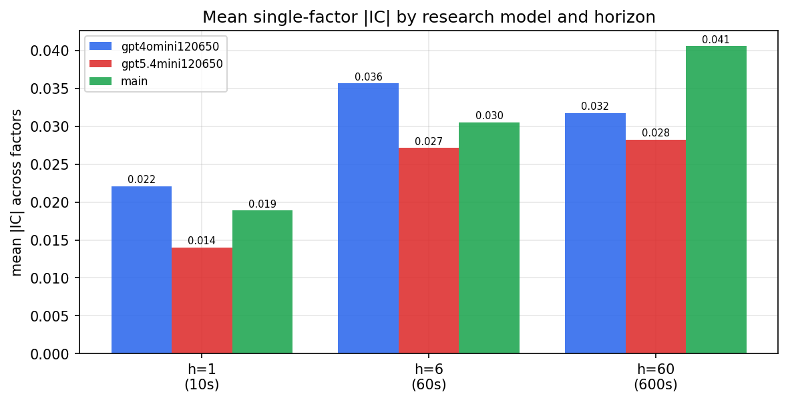

*Mean |IC| by research model and horizon*

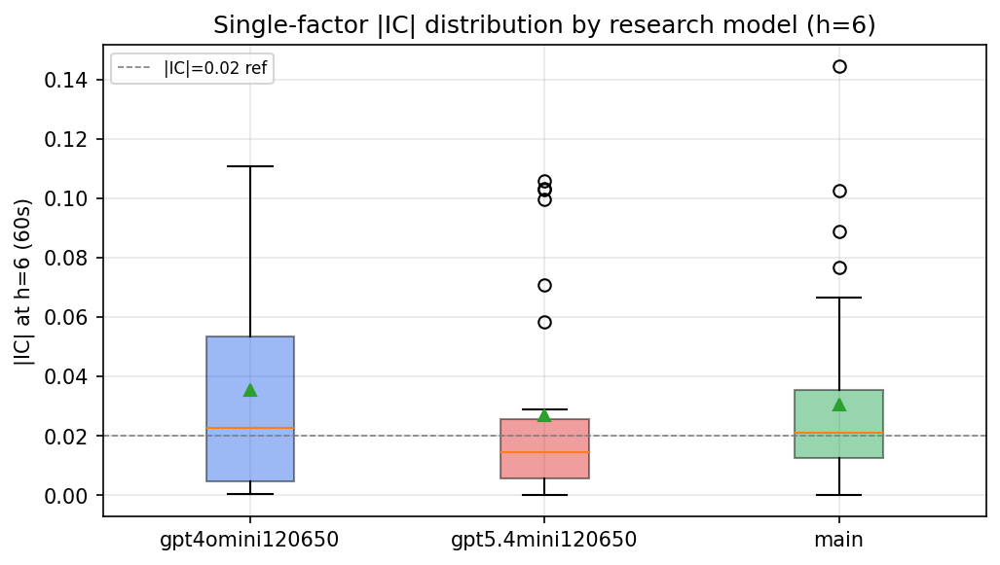

*Per-factor |IC| distribution by research model*

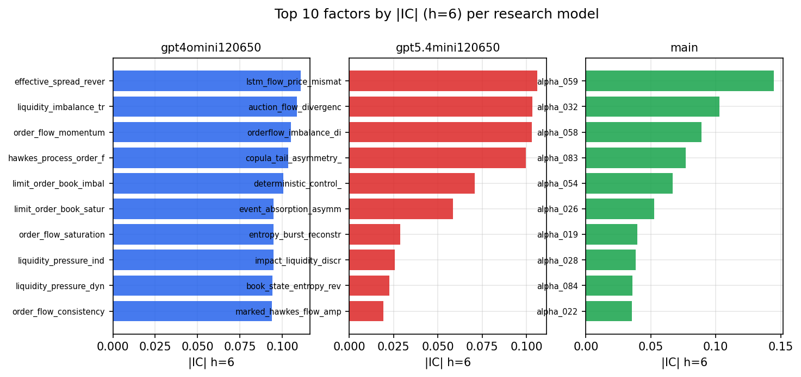

*Top factors by |IC| per research model*

## 2. Factor diversity & redundancy

Pairwise correlation of each zoo's *signals*. `eff_n_factors` is the effective number of independent factors (participation ratio of the correlation eigenvalues); `eff_ratio` and `redundancy` summarise how much unique information the zoo holds vs. how much is duplicated; `n_clusters` groups factors at |corr| ≥ 0.7.

| prerun | n_factors | eff_n_factors | eff_ratio | mean_abs_corr | n_clusters | redundancy |
| --- | --- | --- | --- | --- | --- | --- |
| gpt4omini120650 | 66 | 32.3224 | 0.4897 | 0.0437 | 55 | 0.5103 |
| gpt5.4mini120650 | 69 | 56.6212 | 0.8206 | 0.0086 | 65 | 0.1794 |
| main | 77 | 30.8598 | 0.4008 | 0.047 | 55 | 0.5992 |

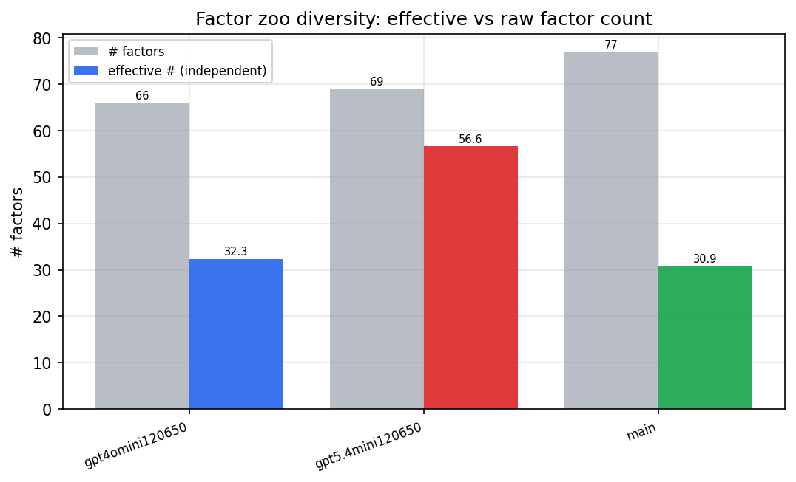

*Effective vs raw factor count per research model*

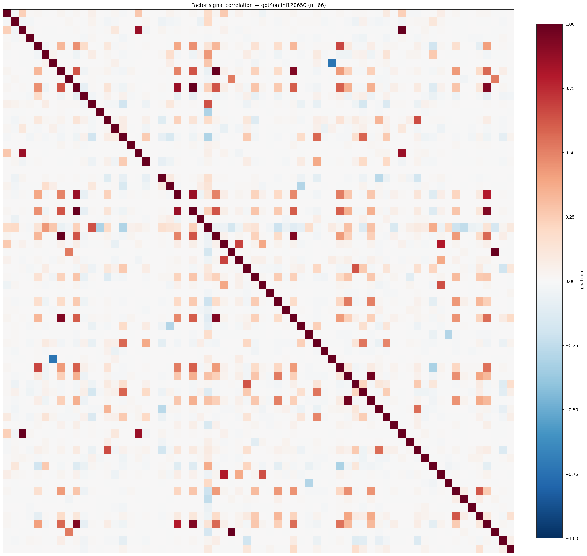

*Signal correlation matrix — gpt4omini120650*

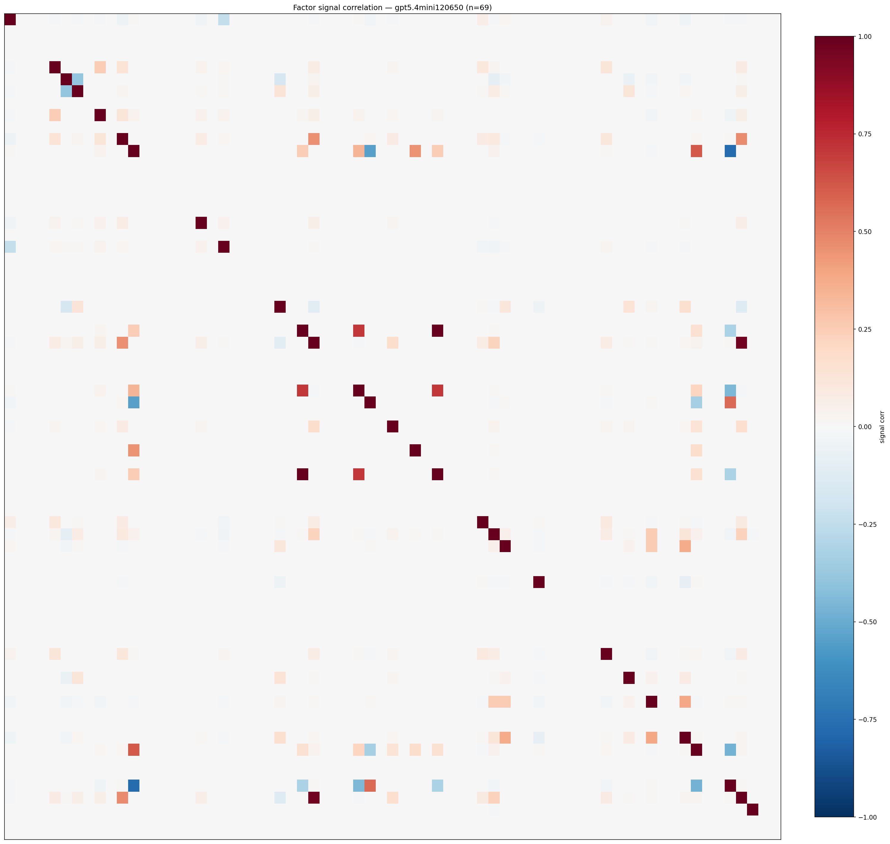

*Signal correlation matrix — gpt5.4mini120650*

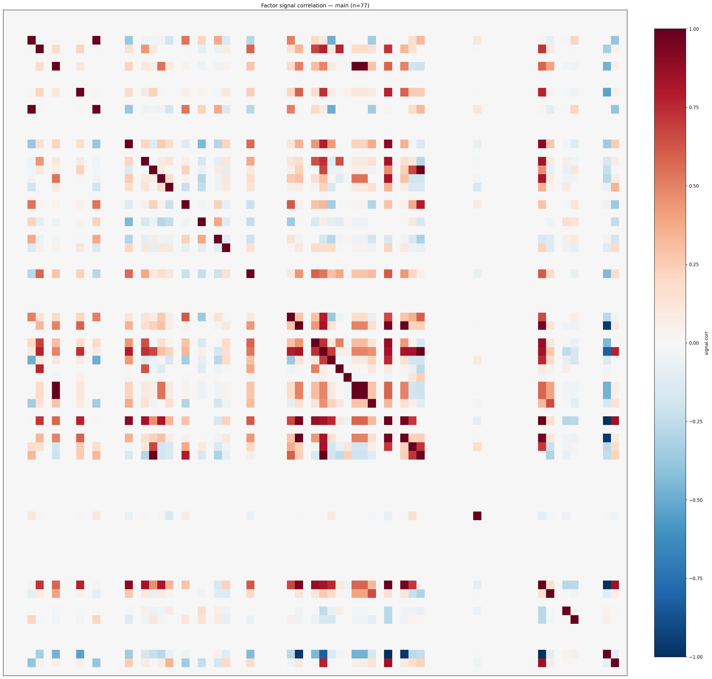

*Signal correlation matrix — main*

## 3. Deflation & model-based importance

`deflated_best_ic` haircuts each zoo's best |IC| for the number of factors tried (`ic_n_tested`) — a bigger zoo's best factor is more likely to be lucky. `lasso_n_nonzero` / `lasso_sparsity` show how many factors a sparse linear model actually keeps (model-view redundancy).

| prerun | best_ic | deflated_best_ic | deflated_best_t | ic_n_tested | ic_n_obs | lasso_n_nonzero | lasso_sparsity |
| --- | --- | --- | --- | --- | --- | --- | --- |
| gpt4omini120650 | 0.1109 | 0.1032 | 38.652 | 64 | 140399 | 17 | 0.7424 |
| gpt5.4mini120650 | 0.106 | 0.0991 | 37.1208 | 29 | 140399 | 10 | 0.8551 |
| main | 0.1445 | 0.1374 | 51.4686 | 36 | 140399 | 6 | 0.9221 |

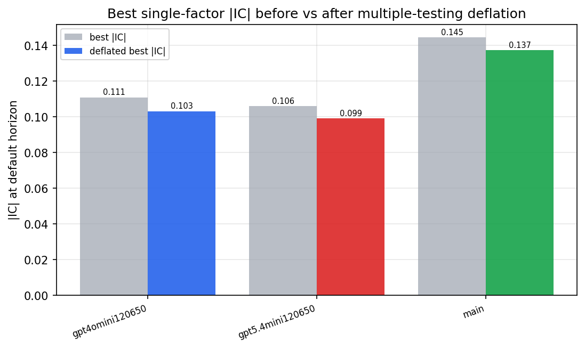

*Best |IC| before vs after multiple-testing deflation*

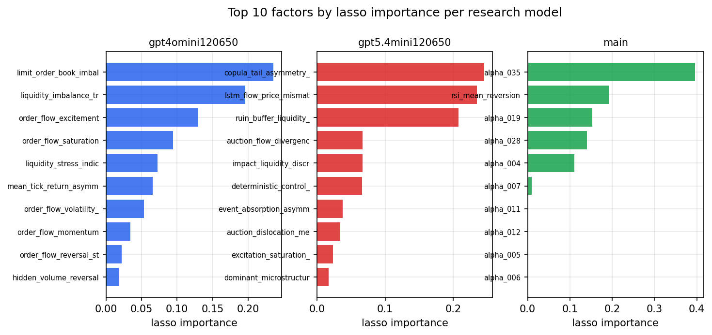

*Top factors by lasso importance per zoo*

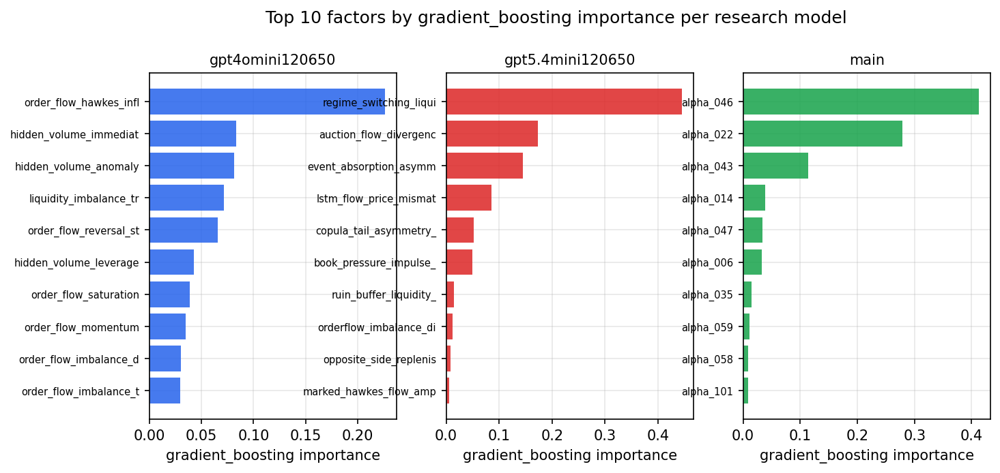

*Top factors by gradient_boosting importance per zoo*

## 4. ML-combined signal — per-underlying vectorised backtest

Each model combines a prerun's factors into ONE signal (fit `factors → forward return` on IS, predict per (bar, underlying)), then that combined signal is run through a simple vectorised backtest — `position(signal) × the underlying's own forward return` — on the held-out OOS tail (+ an equal-weight ensemble). No cross-sectional ranking.

> Config: position=**threshold** (t=1.0, z-score `expanding`), aggregation=**portfolio**, fit-standardise=**per_underlying**, horizon=6.

| prerun | model | n_factors_used | oos_ic | oos_sharpe | is_sharpe | oos_ann_return | oos_max_drawdown |
| --- | --- | --- | --- | --- | --- | --- | --- |
| gpt4omini120650 | linear_regression | 66 | 0.1275 | -0.9974 | 10.8293 | -0.0072 | -0.0021 |
| gpt4omini120650 | ridge | 66 | 0.1298 | -1.3626 | 10.8068 | -0.0101 | -0.0023 |
| gpt4omini120650 | lasso | 66 | nan | nan | nan | nan | nan |
| gpt4omini120650 | elastic_net | 66 | nan | nan | nan | nan | nan |
| gpt4omini120650 | random_forest | 66 | 0.0992 | 10.5429 | 12.3653 | 0.0979 | -0.0016 |
| gpt4omini120650 | gradient_boosting | 66 | 0.0925 | -0.8993 | 6.9602 | -0.0066 | -0.002 |
| gpt4omini120650 | xgboost | 66 | 0.1058 | -0.486 | 8.0762 | -0.0031 | -0.0023 |
| gpt4omini120650 | lightgbm | 66 | 0.1092 | 0.7856 | 10.7705 | 0.0071 | -0.0023 |
| gpt4omini120650 | ensemble | 66 | 0.1193 | -0.0215 | 12.6565 | -0.0002 | -0.0032 |
| gpt5.4mini120650 | linear_regression | 69 | 0.1189 | 17.9494 | 14.3386 | 0.1812 | -0.0019 |
| gpt5.4mini120650 | ridge | 69 | 0.1212 | 18.943 | 14.7169 | 0.1932 | -0.0019 |
| gpt5.4mini120650 | lasso | 69 | 0.1203 | 24.3714 | 20.2824 | 0.2042 | -0.0009 |
| gpt5.4mini120650 | elastic_net | 69 | 0.1203 | 24.3714 | 20.2824 | 0.2042 | -0.0009 |
| gpt5.4mini120650 | random_forest | 69 | 0.192 | 40.0134 | 21.7961 | 0.3571 | -0.0005 |
| gpt5.4mini120650 | gradient_boosting | 69 | 0.1639 | 7.4587 | 5.3607 | 0.0067 | -0.0001 |
| gpt5.4mini120650 | xgboost | 69 | 0.2094 | 6.8905 | 8.965 | 0.0199 | -0.0004 |
| gpt5.4mini120650 | lightgbm | 69 | 0.2137 | 10.9179 | 10.8551 | 0.0498 | -0.0004 |
| gpt5.4mini120650 | ensemble | 69 | 0.1577 | 33.2817 | 17.3553 | 0.2653 | -0.0005 |
| main | linear_regression | 77 | 0.0476 | 9.9331 | 6.2666 | 0.0583 | -0.0009 |
| main | ridge | 77 | 0.0495 | 10.0119 | 6.2585 | 0.0636 | -0.0007 |
| main | lasso | 77 | 0.048 | 9.0377 | 6.1407 | 0.0567 | -0.0008 |
| main | elastic_net | 77 | 0.0491 | 9.6222 | 6.1916 | 0.0634 | -0.0007 |
| main | random_forest | 77 | 0.0575 | 10.7064 | 8.2202 | 0.0738 | -0.0012 |
| main | gradient_boosting | 77 | 0.0498 | -2.5082 | 4.6877 | -0.005 | -0.0005 |
| main | xgboost | 77 | 0.0529 | -0.2198 | 6.1422 | -0.0006 | -0.0008 |
| main | lightgbm | 77 | 0.0496 | 2.2588 | 8.0601 | 0.0136 | -0.0015 |
| main | ensemble | 77 | 0.0548 | 9.2783 | 7.22 | 0.0513 | -0.0008 |

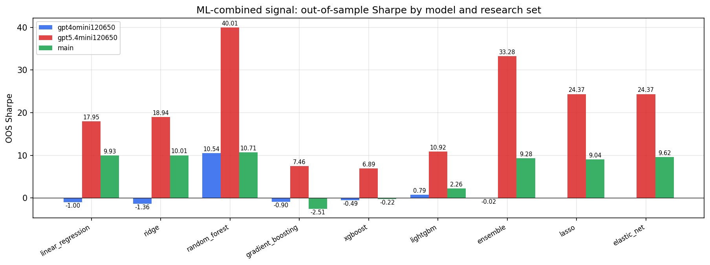

*ML-combined OOS Sharpe by model and research set*

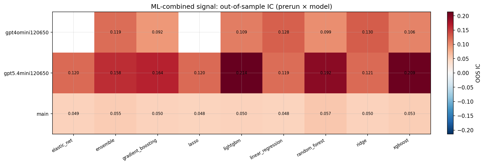

*ML-combined OOS IC (prerun × model)*

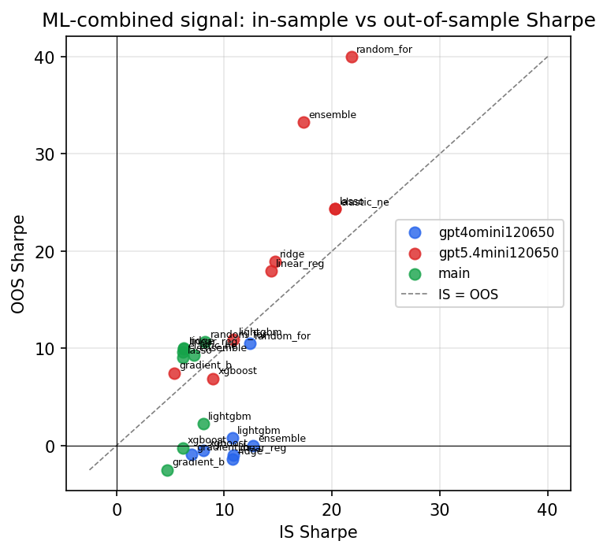

*IS vs OOS Sharpe (overfitting diagnostic)*

---
*Generated by `run_model_comparison.py`. Tables: `*.csv`; interactive: `comparison.ipynb`.*
