# Research-LLM factor comparison — `2025-04`

Comparing the **factor output of different research LLMs** on three axes (raw factor quality → factors as ML features → factors through the full agentic fund). The panel, IS/OOS split, horizon and model hyper-parameters are held identical across preruns — the *only* variable is the factor set.

## Preruns compared

| prerun | research_model | usable_factors | dropped_factors |
| --- | --- | --- | --- |
| gpt4omini120650 | gpt-4o-mini | 66 | 0 |
| gpt5.4mini120650 | gpt-5.4-mini | 69 | 0 |
| main | seed library | 77 | 11 |

> Dropped factors declare fields the current data doesn't have yet (e.g. fundamentals); they light up unchanged once that data is downloaded.

*Usable vs awaiting-data factors per research model*

## Key findings

- **Best ML-combined OOS Sharpe:** `gpt5.4mini120650` with `random_forest` (OOS Sharpe = 26.550).
- **Mean OOS Sharpe across models, by research set:** `gpt5.4mini120650` = 13.832, `gpt4omini120650` = 13.016, `main` = 4.835.
- **Highest mean single-factor |IC| (h=6):** `main` (mean |IC| = 0.0290).
- **Most diverse zoo (highest effective/raw factor ratio):** `gpt5.4mini120650` (eff 56.6 of 69, ratio 0.82).
- **Best selection-deflated single-factor |IC|:** `gpt4omini120650` (deflated |IC| = 0.1132 from 64 factors tried).

## 1. Single-factor IC (raw factor quality)

Per-underlying time-series Spearman rank-IC of every researched factor, recomputed on the shared panel at horizons h=1, h=6, h=60. The per-underlying IC correlates each factor's value vector with the underlying's own forward-return vector (pooled across underlyings); the cross-sectional IC ranks across underlyings per timestamp.

| prerun | n_factors | mean_abs_ic_1 | mean_abs_ic_6 | mean_abs_ic_60 | mean_abs_icir_6 | best_factor_h6 | best_abs_ic_h6 |
| --- | --- | --- | --- | --- | --- | --- | --- |
| gpt4omini120650 | 66 | 0.0192 | 0.0284 | 0.0237 | 0.9262 | limit_order_book_imbalance_surge | 0.1208 |
| gpt5.4mini120650 | 69 | 0.0139 | 0.0237 | 0.0223 | 1.0175 | orderflow_imbalance_divergence | 0.1059 |
| main | 77 | 0.0148 | 0.029 | 0.0207 | 0.7666 | alpha_032 | 0.0985 |

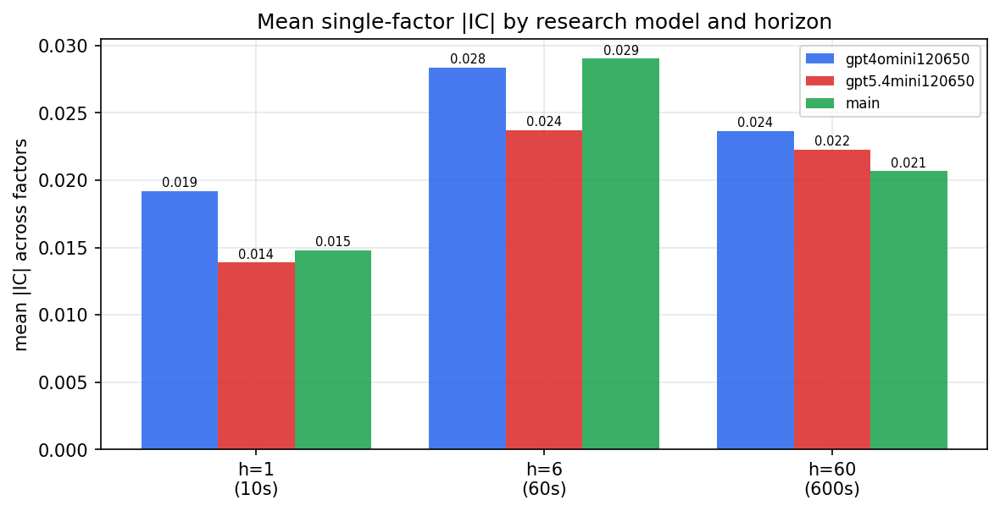

*Mean |IC| by research model and horizon*

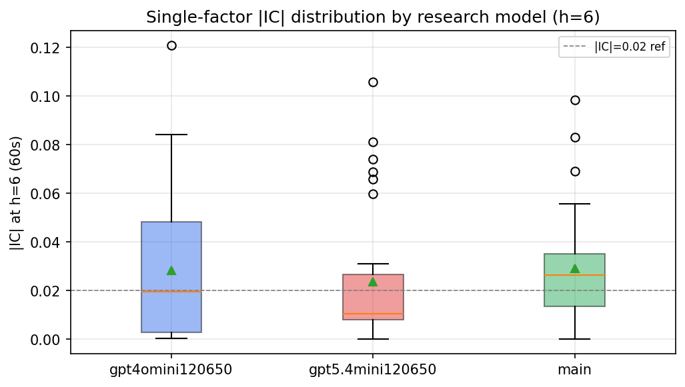

*Per-factor |IC| distribution by research model*

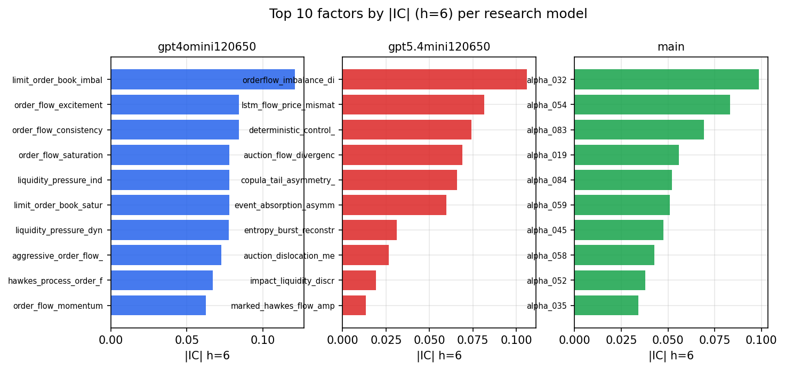

*Top factors by |IC| per research model*

## 2. Factor diversity & redundancy

Pairwise correlation of each zoo's *signals*. `eff_n_factors` is the effective number of independent factors (participation ratio of the correlation eigenvalues); `eff_ratio` and `redundancy` summarise how much unique information the zoo holds vs. how much is duplicated; `n_clusters` groups factors at |corr| ≥ 0.7.

| prerun | n_factors | eff_n_factors | eff_ratio | mean_abs_corr | n_clusters | redundancy |
| --- | --- | --- | --- | --- | --- | --- |
| gpt4omini120650 | 66 | 35.2464 | 0.534 | 0.0395 | 58 | 0.466 |
| gpt5.4mini120650 | 69 | 56.6401 | 0.8209 | 0.0089 | 65 | 0.1791 |
| main | 77 | 32.2296 | 0.4186 | 0.043 | 64 | 0.5814 |

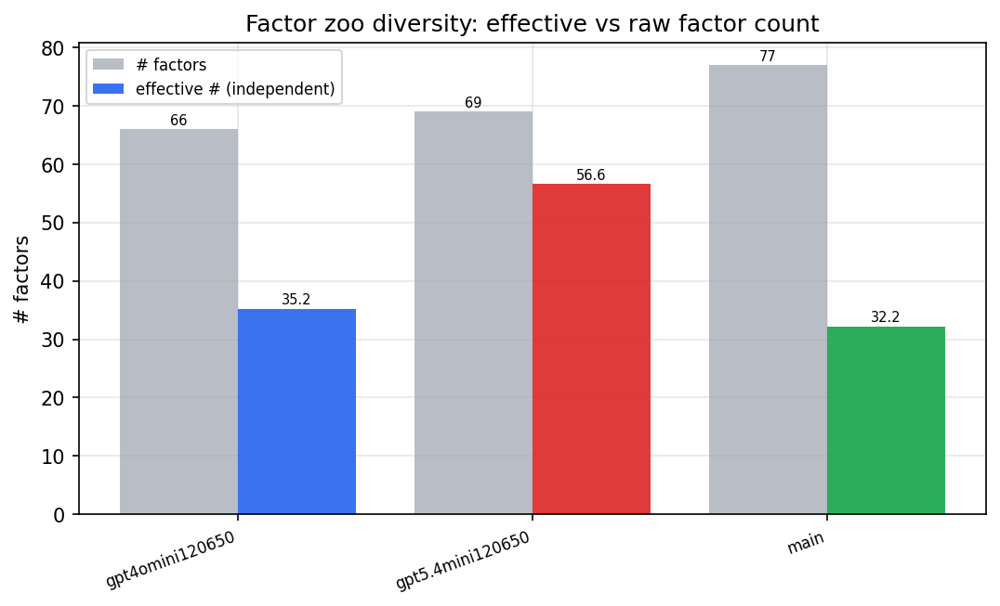

*Effective vs raw factor count per research model*

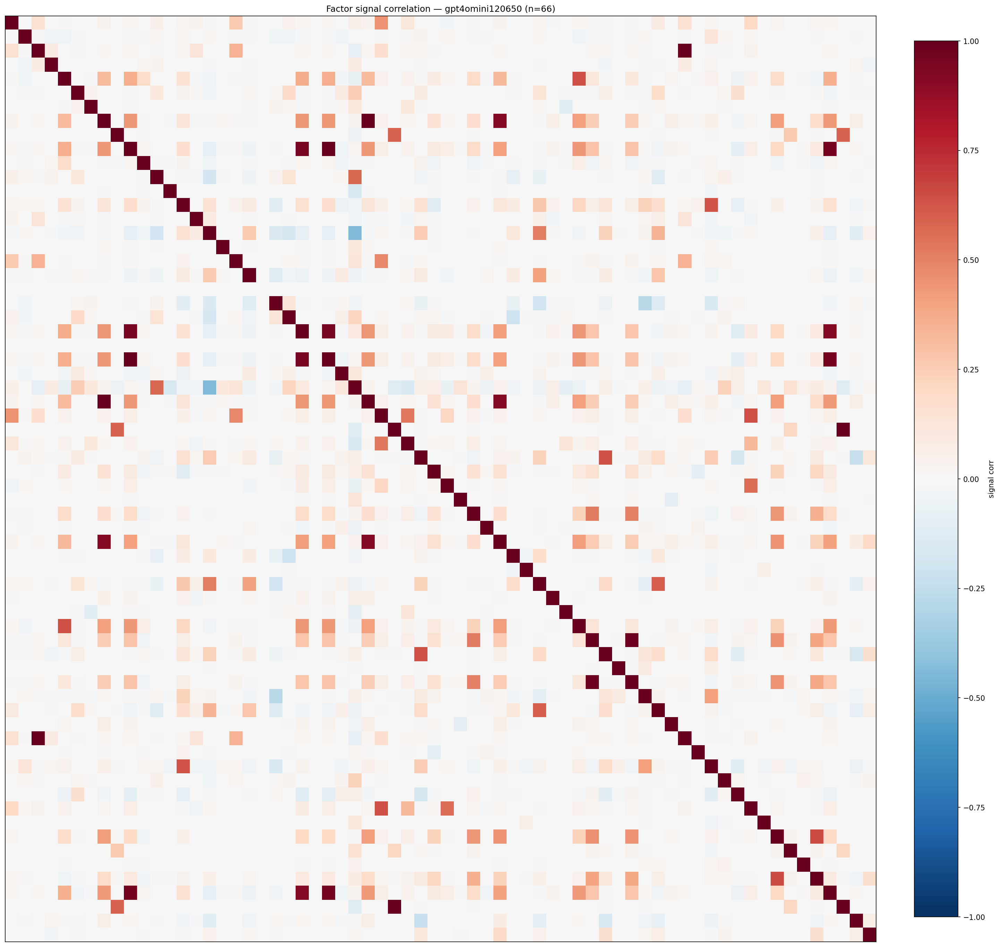

*Signal correlation matrix — gpt4omini120650*

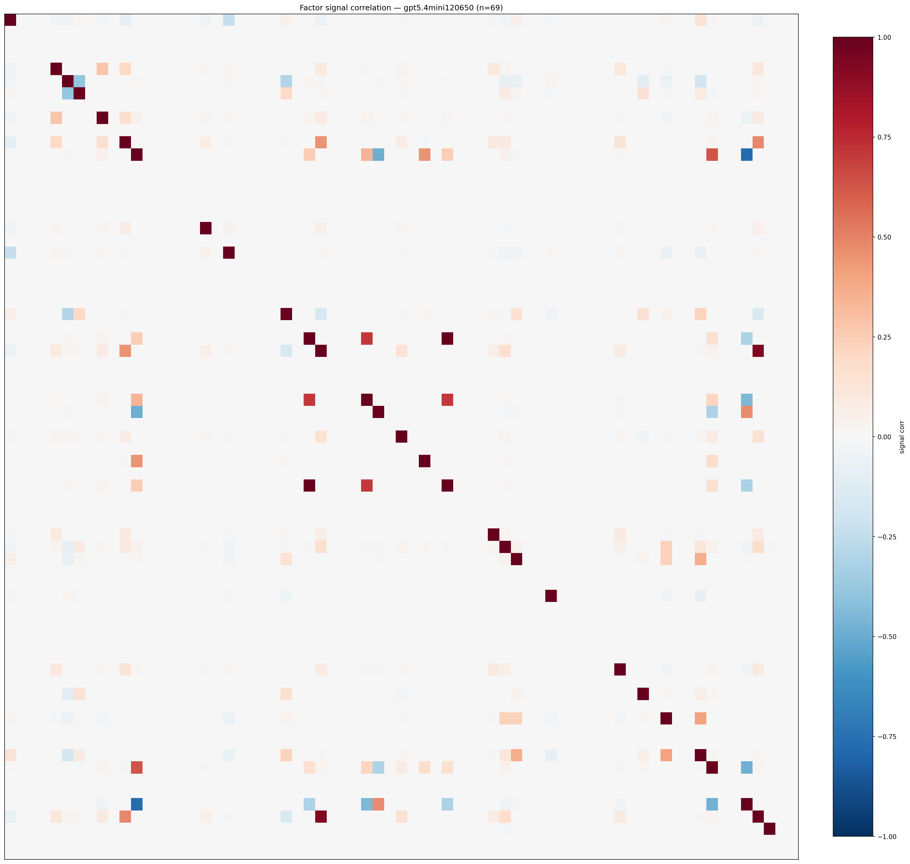

*Signal correlation matrix — gpt5.4mini120650*

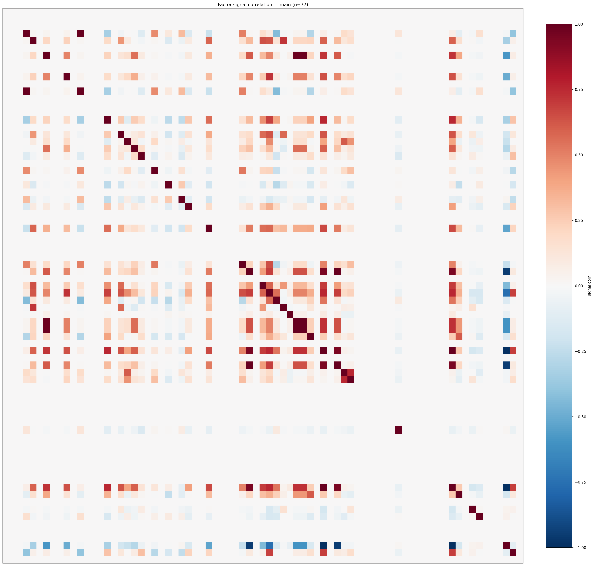

*Signal correlation matrix — main*

## 3. Deflation & model-based importance

`deflated_best_ic` haircuts each zoo's best |IC| for the number of factors tried (`ic_n_tested`) — a bigger zoo's best factor is more likely to be lucky. `lasso_n_nonzero` / `lasso_sparsity` show how many factors a sparse linear model actually keeps (model-view redundancy).

| prerun | best_ic | deflated_best_ic | deflated_best_t | ic_n_tested | ic_n_obs | lasso_n_nonzero | lasso_sparsity |
| --- | --- | --- | --- | --- | --- | --- | --- |
| gpt4omini120650 | 0.1208 | 0.1132 | 42.7615 | 64 | 142739 | 20 | 0.697 |
| gpt5.4mini120650 | 0.1059 | 0.0991 | 37.4244 | 29 | 142739 | 10 | 0.8551 |
| main | 0.0985 | 0.0914 | 34.5269 | 36 | 142739 | 18 | 0.7662 |

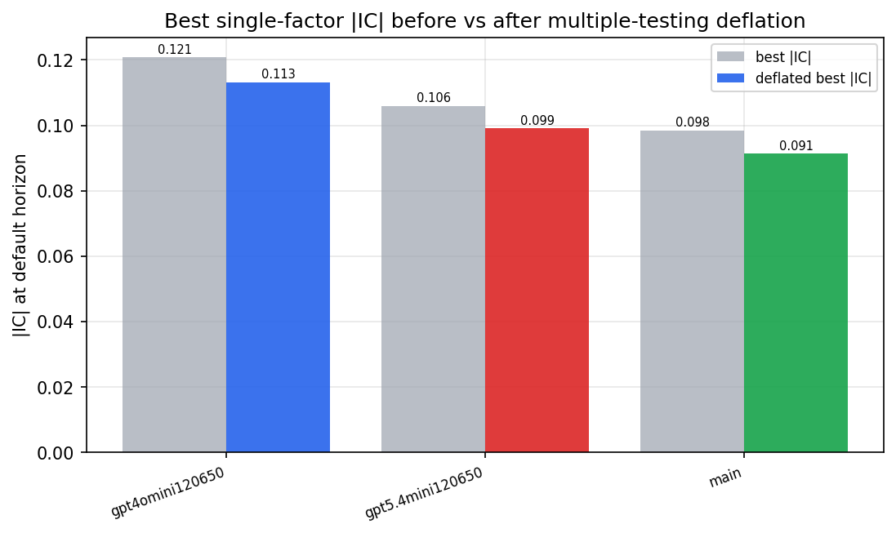

*Best |IC| before vs after multiple-testing deflation*

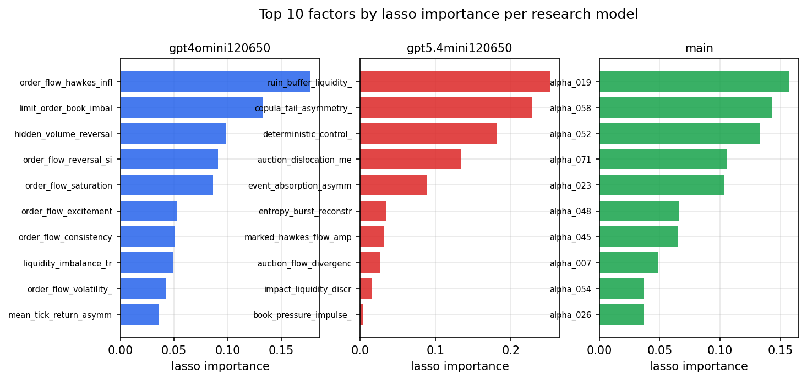

*Top factors by lasso importance per zoo*

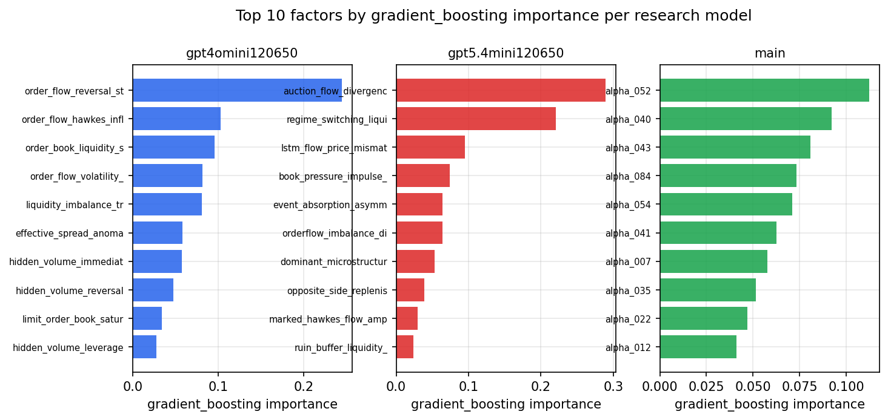

*Top factors by gradient_boosting importance per zoo*

## 4. ML-combined signal — per-underlying vectorised backtest

Each model combines a prerun's factors into ONE signal (fit `factors → forward return` on IS, predict per (bar, underlying)), then that combined signal is run through a simple vectorised backtest — `position(signal) × the underlying's own forward return` — on the held-out OOS tail (+ an equal-weight ensemble). No cross-sectional ranking.

> Config: position=**threshold** (t=1.0, z-score `expanding`), aggregation=**portfolio**, fit-standardise=**per_underlying**, horizon=6.

| prerun | model | n_factors_used | oos_ic | oos_sharpe | is_sharpe | oos_ann_return | oos_max_drawdown |
| --- | --- | --- | --- | --- | --- | --- | --- |
| gpt4omini120650 | linear_regression | 66 | 0.1166 | 22.1193 | 27.5989 | 0.2791 | -0.0039 |
| gpt4omini120650 | ridge | 66 | 0.1152 | 21.014 | 28.4405 | 0.2768 | -0.0038 |
| gpt4omini120650 | lasso | 66 | nan | nan | nan | nan | nan |
| gpt4omini120650 | elastic_net | 66 | nan | nan | nan | nan | nan |
| gpt4omini120650 | random_forest | 66 | 0.1072 | 20.291 | 20.1428 | 0.3049 | -0.0029 |
| gpt4omini120650 | gradient_boosting | 66 | 0.103 | 0.4466 | 9.4796 | 0.0041 | -0.002 |
| gpt4omini120650 | xgboost | 66 | 0.1193 | 1.4551 | 16.4553 | 0.0135 | -0.002 |
| gpt4omini120650 | lightgbm | 66 | 0.1186 | 4.985 | 15.8922 | 0.07 | -0.003 |
| gpt4omini120650 | ensemble | 66 | 0.1213 | 20.798 | 22.1668 | 0.2595 | -0.0035 |
| gpt5.4mini120650 | linear_regression | 69 | 0.0772 | 17.9034 | 25.918 | 0.2497 | -0.0023 |
| gpt5.4mini120650 | ridge | 69 | 0.0766 | 17.1319 | 26.0525 | 0.2414 | -0.0026 |
| gpt5.4mini120650 | lasso | 69 | nan | nan | nan | nan | nan |
| gpt5.4mini120650 | elastic_net | 69 | nan | nan | nan | nan | nan |
| gpt5.4mini120650 | random_forest | 69 | 0.1718 | 26.5502 | 27.5068 | 0.4487 | -0.0036 |
| gpt5.4mini120650 | gradient_boosting | 69 | 0.1339 | -3.4871 | 14.5125 | -0.0312 | -0.003 |
| gpt5.4mini120650 | xgboost | 69 | 0.1794 | 10.5397 | 16.9493 | 0.0879 | -0.0008 |
| gpt5.4mini120650 | lightgbm | 69 | 0.1782 | 6.2682 | 15.5998 | 0.0625 | -0.0019 |
| gpt5.4mini120650 | ensemble | 69 | 0.1362 | 21.9161 | 24.6086 | 0.3326 | -0.0019 |
| main | linear_regression | 77 | 0.0419 | 4.7852 | 14.6421 | 0.0846 | -0.0024 |
| main | ridge | 77 | 0.04 | 5.0895 | 15.0106 | 0.0948 | -0.0024 |
| main | lasso | 77 | 0.0466 | 9.2954 | 13.1199 | 0.1967 | -0.0028 |
| main | elastic_net | 77 | 0.0423 | 8.9923 | 13.5215 | 0.1873 | -0.0028 |
| main | random_forest | 77 | 0.0471 | 8.7134 | 14.9642 | 0.1737 | -0.0033 |
| main | gradient_boosting | 77 | 0.0478 | -1.8902 | 14.3432 | -0.0164 | -0.0032 |
| main | xgboost | 77 | 0.038 | -0.6059 | 13.9018 | -0.0088 | -0.0039 |
| main | lightgbm | 77 | 0.043 | 0.5515 | 18.1046 | 0.0086 | -0.0067 |
| main | ensemble | 77 | 0.0566 | 8.5851 | 15.4508 | 0.177 | -0.0028 |

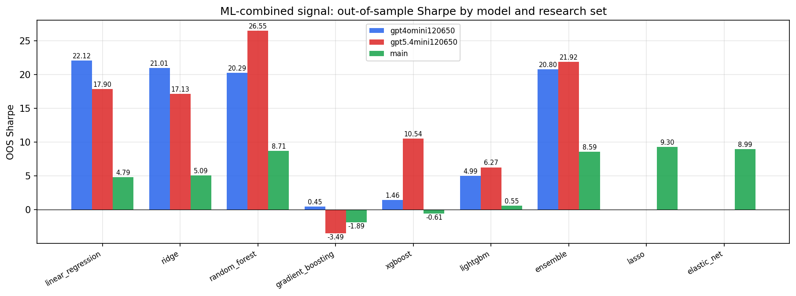

*ML-combined OOS Sharpe by model and research set*

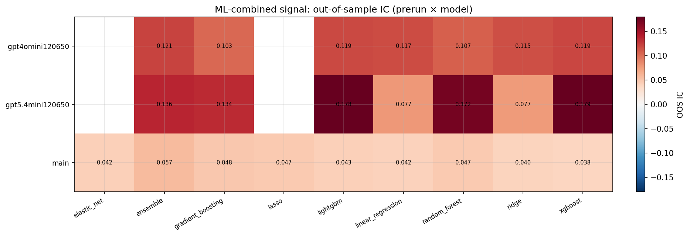

*ML-combined OOS IC (prerun × model)*

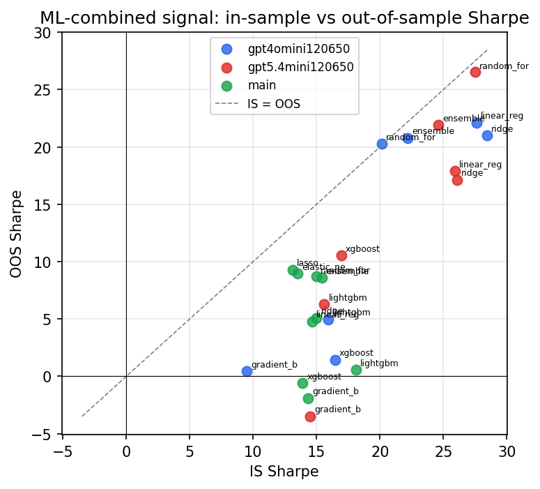

*IS vs OOS Sharpe (overfitting diagnostic)*

---
*Generated by `run_model_comparison.py`. Tables: `*.csv`; interactive: `comparison.ipynb`.*
