# Research-LLM factor comparison — `2025-05`

Comparing the **factor output of different research LLMs** on three axes (raw factor quality → factors as ML features → factors through the full agentic fund). The panel, IS/OOS split, horizon and model hyper-parameters are held identical across preruns — the *only* variable is the factor set.

## Preruns compared

| prerun | research_model | usable_factors | dropped_factors |
| --- | --- | --- | --- |
| gpt4omini120650 | gpt-4o-mini | 66 | 0 |
| gpt5.4mini120650 | gpt-5.4-mini | 69 | 0 |
| main | seed library | 77 | 11 |

> Dropped factors declare fields the current data doesn't have yet (e.g. fundamentals); they light up unchanged once that data is downloaded.

*Usable vs awaiting-data factors per research model*

## Key findings

- **Best ML-combined OOS Sharpe:** `gpt5.4mini120650` with `random_forest` (OOS Sharpe = 19.294).
- **Mean OOS Sharpe across models, by research set:** `main` = 6.313, `gpt4omini120650` = 5.877, `gpt5.4mini120650` = 3.835.
- **Highest mean single-factor |IC| (h=6):** `main` (mean |IC| = 0.0300).
- **Most diverse zoo (highest effective/raw factor ratio):** `gpt5.4mini120650` (eff 56.9 of 69, ratio 0.82).
- **Best selection-deflated single-factor |IC|:** `gpt4omini120650` (deflated |IC| = 0.1082 from 64 factors tried).

## 1. Single-factor IC (raw factor quality)

Per-underlying time-series Spearman rank-IC of every researched factor, recomputed on the shared panel at horizons h=1, h=6, h=60. The per-underlying IC correlates each factor's value vector with the underlying's own forward-return vector (pooled across underlyings); the cross-sectional IC ranks across underlyings per timestamp.

| prerun | n_factors | mean_abs_ic_1 | mean_abs_ic_6 | mean_abs_ic_60 | mean_abs_icir_6 | best_factor_h6 | best_abs_ic_h6 |
| --- | --- | --- | --- | --- | --- | --- | --- |
| gpt4omini120650 | 66 | 0.0173 | 0.0239 | 0.0207 | 0.6031 | limit_order_book_imbalance_surge | 0.1158 |
| gpt5.4mini120650 | 69 | 0.0114 | 0.0184 | 0.0184 | 0.7628 | orderflow_imbalance_divergence | 0.1099 |
| main | 77 | 0.0137 | 0.03 | 0.0215 | 0.8306 | alpha_032 | 0.1033 |

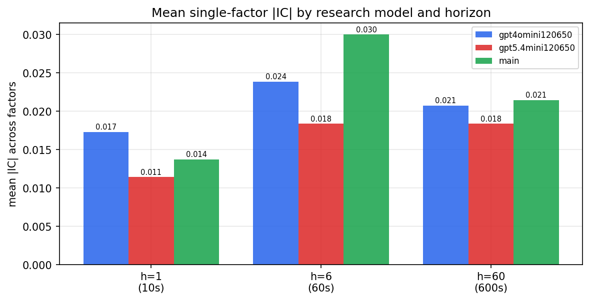

*Mean |IC| by research model and horizon*

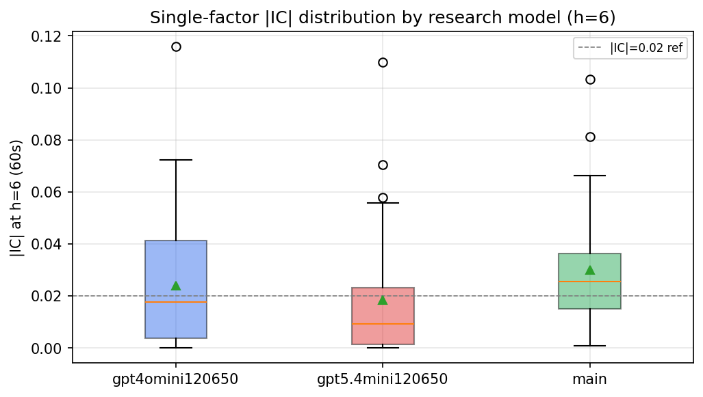

*Per-factor |IC| distribution by research model*

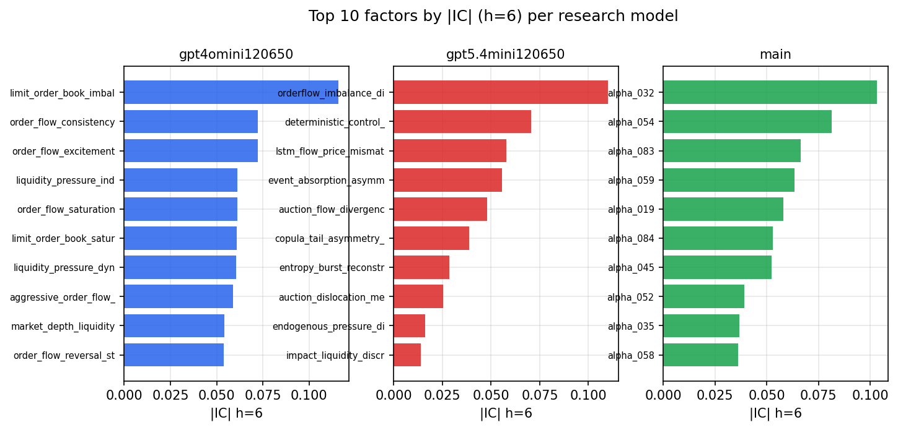

*Top factors by |IC| per research model*

## 2. Factor diversity & redundancy

Pairwise correlation of each zoo's *signals*. `eff_n_factors` is the effective number of independent factors (participation ratio of the correlation eigenvalues); `eff_ratio` and `redundancy` summarise how much unique information the zoo holds vs. how much is duplicated; `n_clusters` groups factors at |corr| ≥ 0.7.

| prerun | n_factors | eff_n_factors | eff_ratio | mean_abs_corr | n_clusters | redundancy |
| --- | --- | --- | --- | --- | --- | --- |
| gpt4omini120650 | 66 | 34.5918 | 0.5241 | 0.04 | 56 | 0.4759 |
| gpt5.4mini120650 | 69 | 56.8647 | 0.8241 | 0.0087 | 65 | 0.1759 |
| main | 77 | 30.312 | 0.3937 | 0.0454 | 63 | 0.6063 |

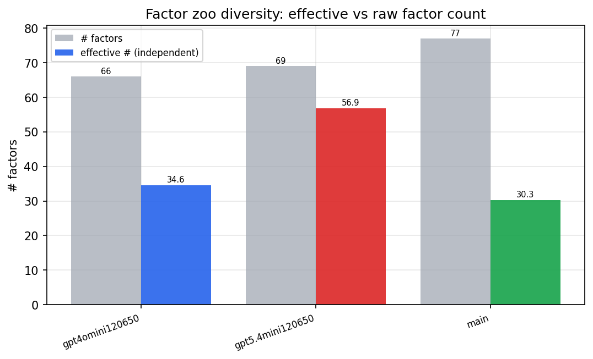

*Effective vs raw factor count per research model*

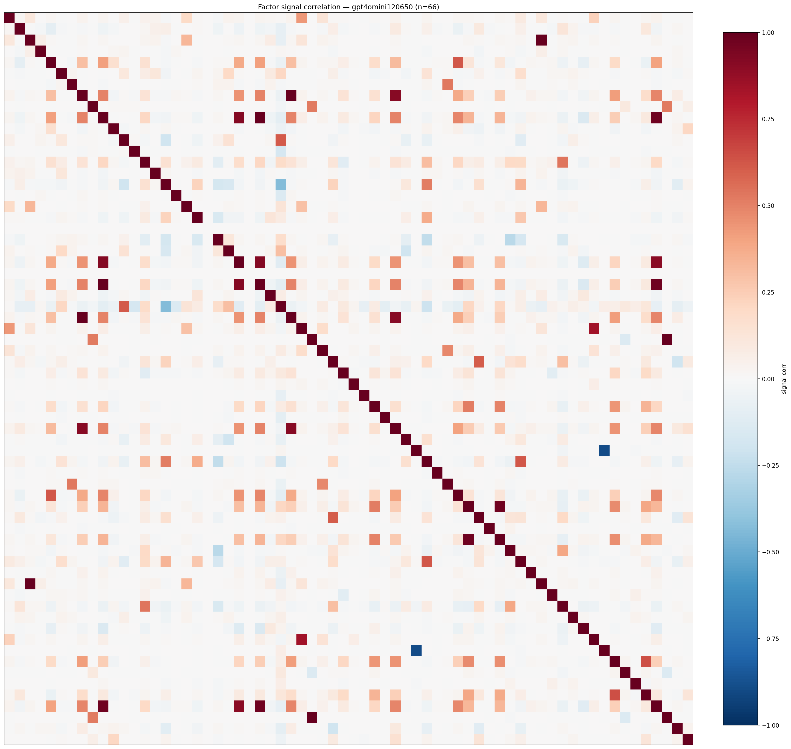

*Signal correlation matrix — gpt4omini120650*

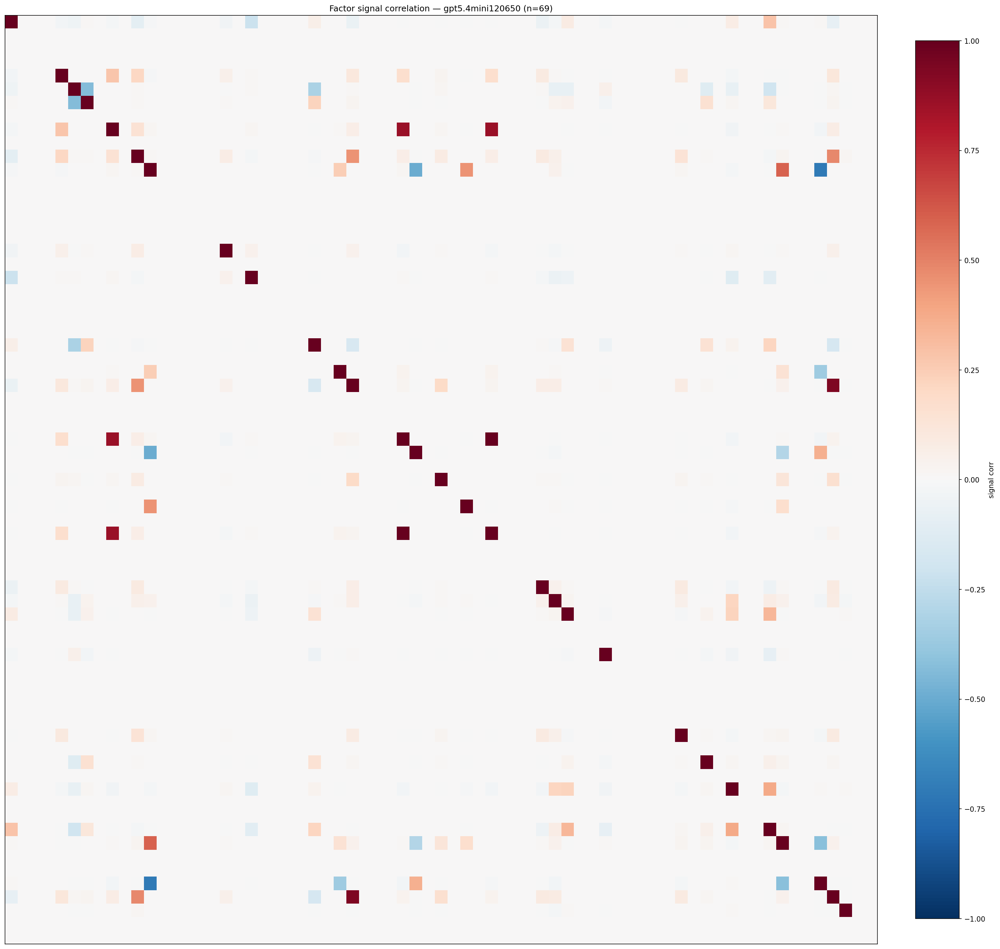

*Signal correlation matrix — gpt5.4mini120650*

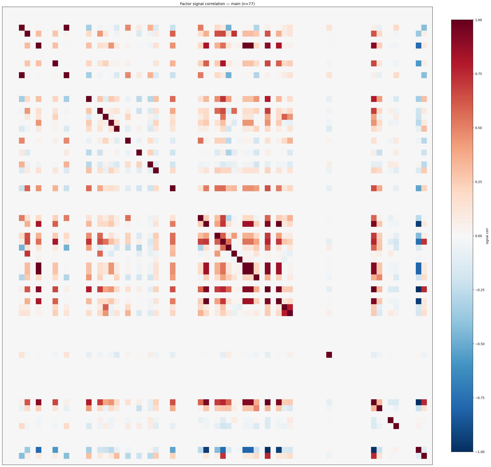

*Signal correlation matrix — main*

## 3. Deflation & model-based importance

`deflated_best_ic` haircuts each zoo's best |IC| for the number of factors tried (`ic_n_tested`) — a bigger zoo's best factor is more likely to be lucky. `lasso_n_nonzero` / `lasso_sparsity` show how many factors a sparse linear model actually keeps (model-view redundancy).

| prerun | best_ic | deflated_best_ic | deflated_best_t | ic_n_tested | ic_n_obs | lasso_n_nonzero | lasso_sparsity |
| --- | --- | --- | --- | --- | --- | --- | --- |
| gpt4omini120650 | 0.1158 | 0.1082 | 41.2213 | 64 | 145078 | 25 | 0.6212 |
| gpt5.4mini120650 | 0.1099 | 0.103 | 39.2451 | 30 | 145078 | 0 | 1.0 |
| main | 0.1033 | 0.0963 | 36.6643 | 36 | 145078 | 12 | 0.8442 |

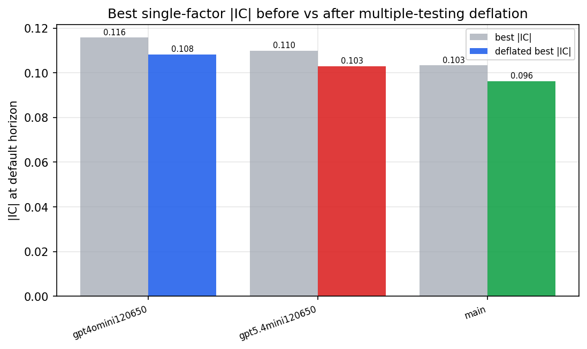

*Best |IC| before vs after multiple-testing deflation*

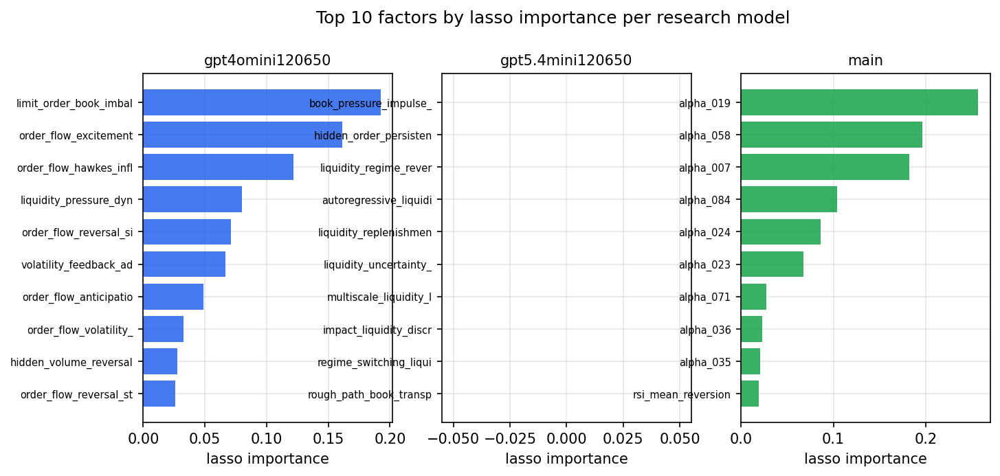

*Top factors by lasso importance per zoo*

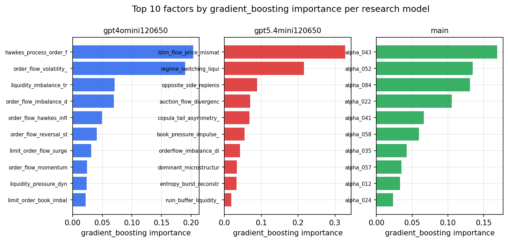

*Top factors by gradient_boosting importance per zoo*

## 4. ML-combined signal — per-underlying vectorised backtest

Each model combines a prerun's factors into ONE signal (fit `factors → forward return` on IS, predict per (bar, underlying)), then that combined signal is run through a simple vectorised backtest — `position(signal) × the underlying's own forward return` — on the held-out OOS tail (+ an equal-weight ensemble). No cross-sectional ranking.

> Config: position=**threshold** (t=1.0, z-score `expanding`), aggregation=**portfolio**, fit-standardise=**per_underlying**, horizon=6.

| prerun | model | n_factors_used | oos_ic | oos_sharpe | is_sharpe | oos_ann_return | oos_max_drawdown |
| --- | --- | --- | --- | --- | --- | --- | --- |
| gpt4omini120650 | linear_regression | 66 | 0.0527 | 7.4137 | 28.7481 | 0.0511 | -0.0011 |
| gpt4omini120650 | ridge | 66 | 0.0545 | 6.3211 | 28.4128 | 0.0462 | -0.0013 |
| gpt4omini120650 | lasso | 66 | 0.0571 | 7.0526 | 28.4258 | 0.0448 | -0.0009 |
| gpt4omini120650 | elastic_net | 66 | 0.0565 | 7.1908 | 28.8354 | 0.0456 | -0.0009 |
| gpt4omini120650 | random_forest | 66 | 0.0887 | 7.52 | 28.5322 | 0.0636 | -0.0015 |
| gpt4omini120650 | gradient_boosting | 66 | 0.0692 | 5.3724 | 13.7605 | 0.0156 | -0.0001 |
| gpt4omini120650 | xgboost | 66 | 0.0811 | 4.8682 | 19.4739 | 0.0356 | -0.0011 |
| gpt4omini120650 | lightgbm | 66 | 0.0861 | 1.9305 | 21.455 | 0.011 | -0.0014 |
| gpt4omini120650 | ensemble | 66 | 0.072 | 5.2259 | 29.5113 | 0.0438 | -0.0017 |
| gpt5.4mini120650 | linear_regression | 69 | -0.0084 | -4.4947 | 22.999 | -0.0251 | -0.0027 |
| gpt5.4mini120650 | ridge | 69 | -0.0078 | -4.9375 | 22.9331 | -0.0269 | -0.0028 |
| gpt5.4mini120650 | lasso | 69 | nan | nan | nan | nan | nan |
| gpt5.4mini120650 | elastic_net | 69 | nan | nan | nan | nan | nan |
| gpt5.4mini120650 | random_forest | 69 | 0.1482 | 19.2938 | 43.5261 | 0.1538 | -0.0017 |
| gpt5.4mini120650 | gradient_boosting | 69 | 0.1063 | -4.9173 | 21.0087 | -0.0059 | -0.0005 |
| gpt5.4mini120650 | xgboost | 69 | 0.1336 | 6.7392 | 29.7419 | 0.0543 | -0.0021 |
| gpt5.4mini120650 | lightgbm | 69 | 0.1552 | 5.6724 | 29.1433 | 0.0341 | -0.0014 |
| gpt5.4mini120650 | ensemble | 69 | 0.036 | 9.486 | 32.2928 | 0.0568 | -0.0014 |
| main | linear_regression | 77 | 0.016 | 7.8938 | 12.6498 | 0.0322 | -0.0007 |
| main | ridge | 77 | 0.0176 | 7.9979 | 12.4609 | 0.0359 | -0.0007 |
| main | lasso | 77 | 0.0208 | 7.0129 | 11.9907 | 0.0337 | -0.0007 |
| main | elastic_net | 77 | 0.0208 | 7.0129 | 11.9764 | 0.0337 | -0.0007 |
| main | random_forest | 77 | 0.0336 | 5.6214 | 21.0638 | 0.0403 | -0.0014 |
| main | gradient_boosting | 77 | 0.0418 | 3.0024 | 18.872 | 0.0048 | -0.0002 |
| main | xgboost | 77 | 0.0361 | 4.117 | 21.1638 | 0.007 | -0.0001 |
| main | lightgbm | 77 | 0.0351 | 5.0093 | 23.7742 | 0.0138 | -0.0002 |
| main | ensemble | 77 | 0.0218 | 9.1528 | 22.0028 | 0.0424 | -0.0007 |

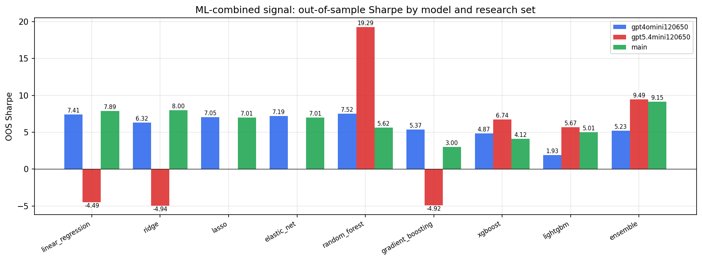

*ML-combined OOS Sharpe by model and research set*

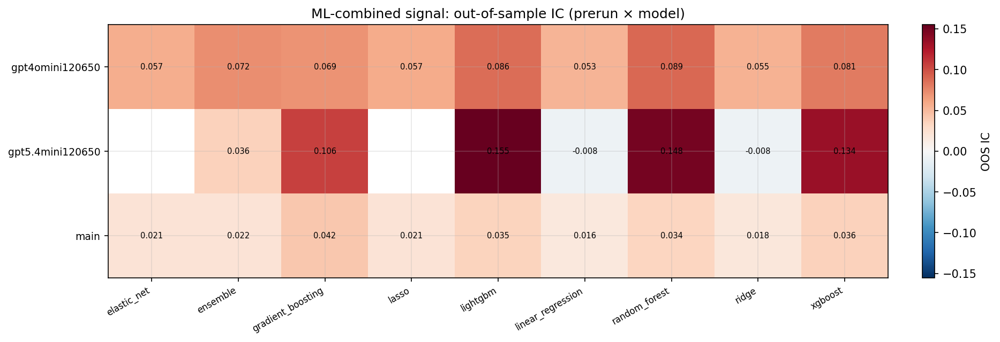

*ML-combined OOS IC (prerun × model)*

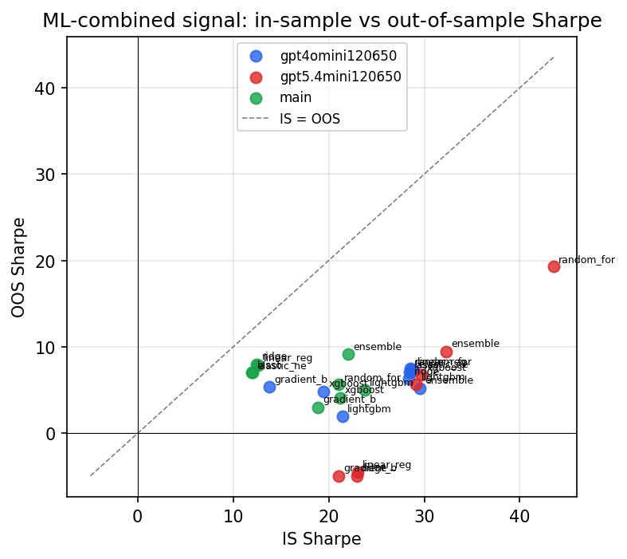

*IS vs OOS Sharpe (overfitting diagnostic)*

---
*Generated by `run_model_comparison.py`. Tables: `*.csv`; interactive: `comparison.ipynb`.*
