# Research-LLM factor comparison — `2025-06`

Comparing the **factor output of different research LLMs** on three axes (raw factor quality → factors as ML features → factors through the full agentic fund). The panel, IS/OOS split, horizon and model hyper-parameters are held identical across preruns — the *only* variable is the factor set.

## Preruns compared

| prerun | research_model | usable_factors | dropped_factors |
| --- | --- | --- | --- |
| gpt4omini120650 | gpt-4o-mini | 66 | 0 |
| gpt5.4mini120650 | gpt-5.4-mini | 69 | 0 |
| main | seed library | 77 | 11 |

> Dropped factors declare fields the current data doesn't have yet (e.g. fundamentals); they light up unchanged once that data is downloaded.

*Usable vs awaiting-data factors per research model*

## Key findings

- **Best ML-combined OOS Sharpe:** `gpt5.4mini120650` with `random_forest` (OOS Sharpe = 23.235).
- **Mean OOS Sharpe across models, by research set:** `gpt5.4mini120650` = 7.424, `gpt4omini120650` = 5.556, `main` = 2.404.
- **Highest mean single-factor |IC| (h=6):** `main` (mean |IC| = 0.0254).
- **Most diverse zoo (highest effective/raw factor ratio):** `gpt5.4mini120650` (eff 57.1 of 69, ratio 0.83).
- **Best selection-deflated single-factor |IC|:** `gpt4omini120650` (deflated |IC| = 0.0926 from 64 factors tried).

## 1. Single-factor IC (raw factor quality)

Per-underlying time-series Spearman rank-IC of every researched factor, recomputed on the shared panel at horizons h=1, h=6, h=60. The per-underlying IC correlates each factor's value vector with the underlying's own forward-return vector (pooled across underlyings); the cross-sectional IC ranks across underlyings per timestamp.

| prerun | n_factors | mean_abs_ic_1 | mean_abs_ic_6 | mean_abs_ic_60 | mean_abs_icir_6 | best_factor_h6 | best_abs_ic_h6 |
| --- | --- | --- | --- | --- | --- | --- | --- |
| gpt4omini120650 | 66 | 0.0134 | 0.0181 | 0.0179 | 0.5958 | limit_order_book_imbalance_surge | 0.1002 |
| gpt5.4mini120650 | 69 | 0.0086 | 0.0121 | 0.0113 | 0.5549 | orderflow_imbalance_divergence | 0.0928 |
| main | 77 | 0.0114 | 0.0254 | 0.0163 | 0.5667 | alpha_032 | 0.0854 |

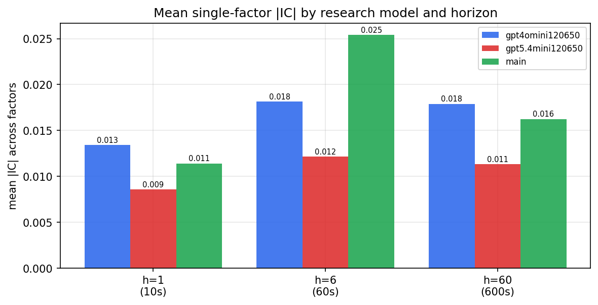

*Mean |IC| by research model and horizon*

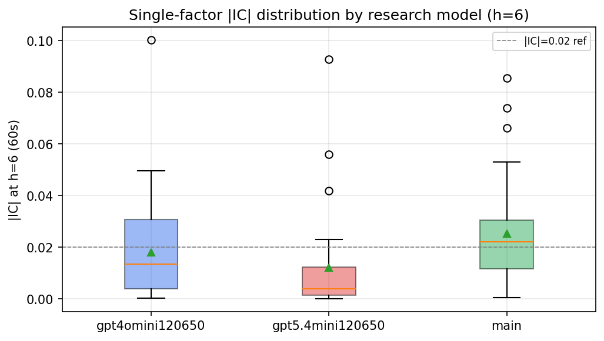

*Per-factor |IC| distribution by research model*

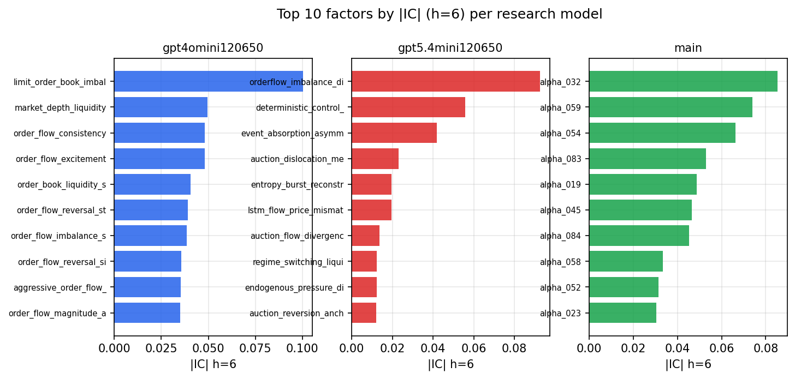

*Top factors by |IC| per research model*

## 2. Factor diversity & redundancy

Pairwise correlation of each zoo's *signals*. `eff_n_factors` is the effective number of independent factors (participation ratio of the correlation eigenvalues); `eff_ratio` and `redundancy` summarise how much unique information the zoo holds vs. how much is duplicated; `n_clusters` groups factors at |corr| ≥ 0.7.

| prerun | n_factors | eff_n_factors | eff_ratio | mean_abs_corr | n_clusters | redundancy |
| --- | --- | --- | --- | --- | --- | --- |
| gpt4omini120650 | 66 | 35.2393 | 0.5339 | 0.0393 | 55 | 0.4661 |
| gpt5.4mini120650 | 69 | 57.0909 | 0.8274 | 0.0083 | 65 | 0.1726 |
| main | 77 | 32.9985 | 0.4286 | 0.042 | 64 | 0.5714 |

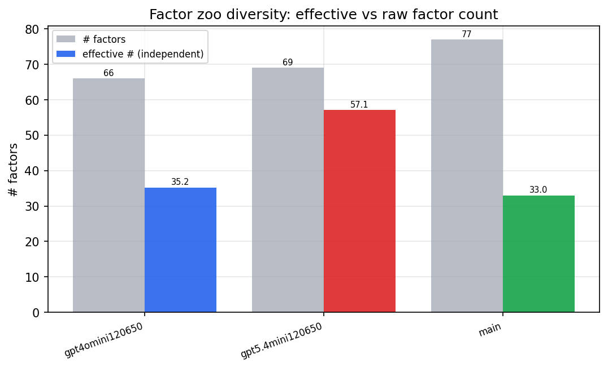

*Effective vs raw factor count per research model*

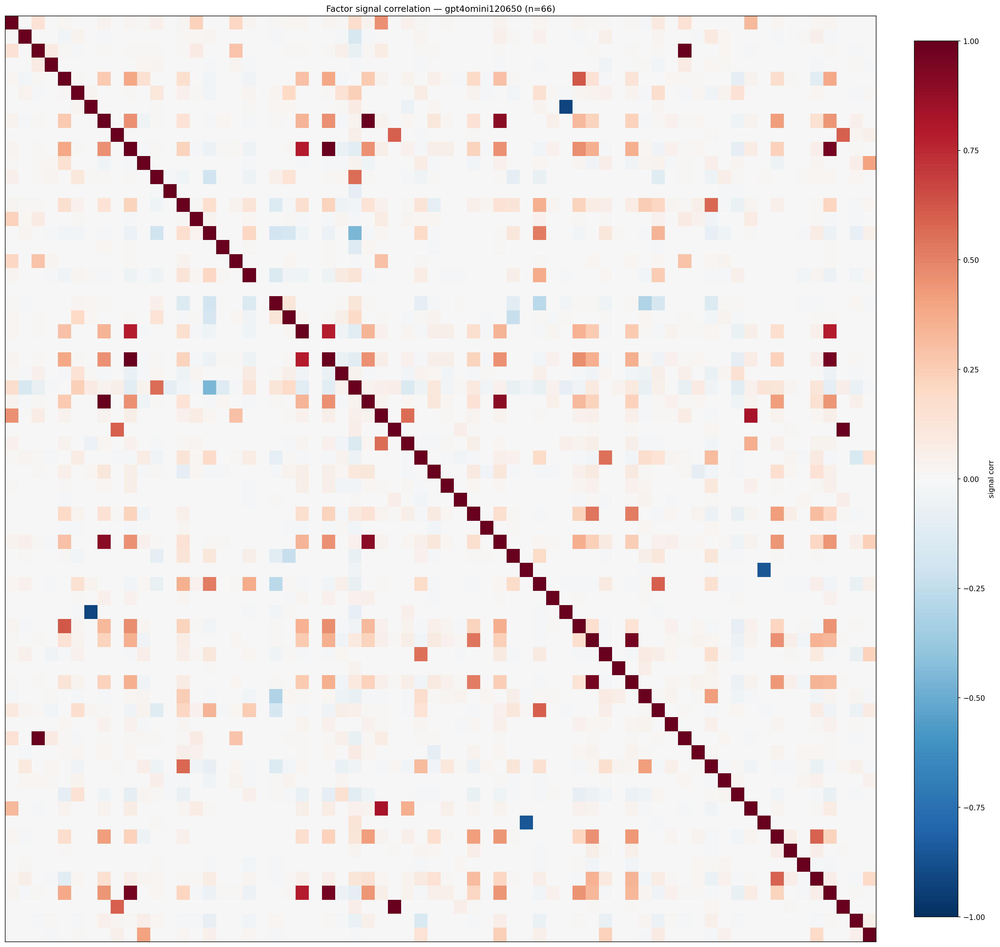

*Signal correlation matrix — gpt4omini120650*

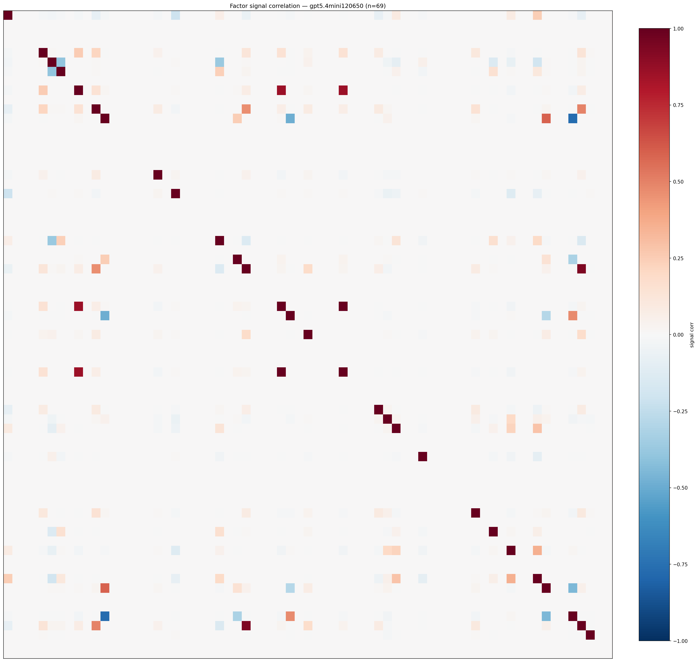

*Signal correlation matrix — gpt5.4mini120650*

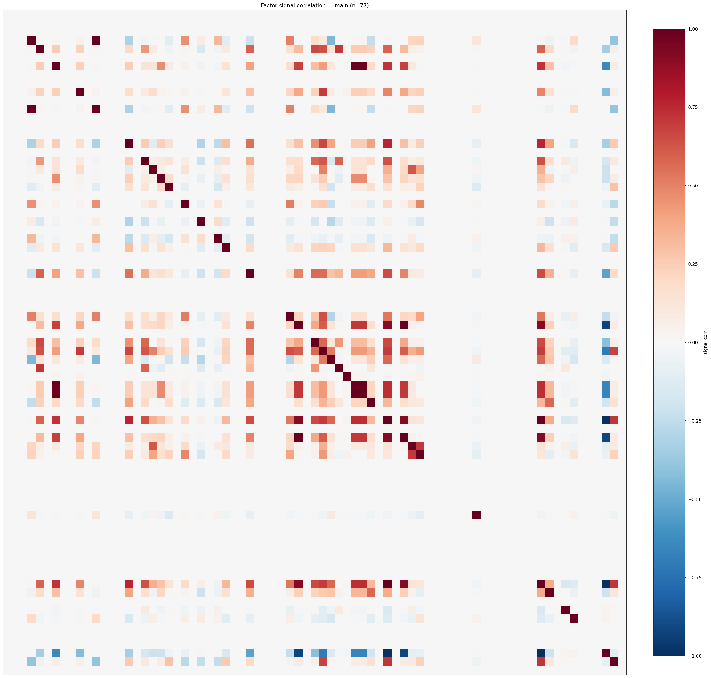

*Signal correlation matrix — main*

## 3. Deflation & model-based importance

`deflated_best_ic` haircuts each zoo's best |IC| for the number of factors tried (`ic_n_tested`) — a bigger zoo's best factor is more likely to be lucky. `lasso_n_nonzero` / `lasso_sparsity` show how many factors a sparse linear model actually keeps (model-view redundancy).

| prerun | best_ic | deflated_best_ic | deflated_best_t | ic_n_tested | ic_n_obs | lasso_n_nonzero | lasso_sparsity |
| --- | --- | --- | --- | --- | --- | --- | --- |
| gpt4omini120650 | 0.1002 | 0.0926 | 34.9811 | 64 | 142738 | 3 | 0.9545 |
| gpt5.4mini120650 | 0.0928 | 0.0858 | 32.4342 | 30 | 142738 | 17 | 0.7536 |
| main | 0.0854 | 0.0784 | 29.6032 | 36 | 142738 | 10 | 0.8701 |

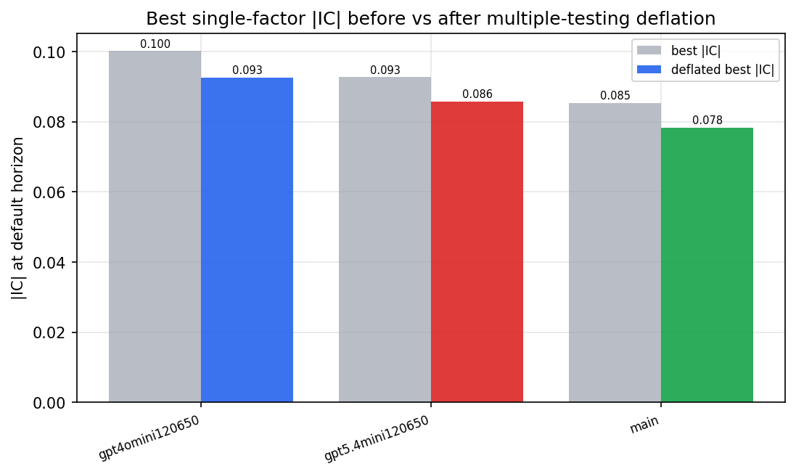

*Best |IC| before vs after multiple-testing deflation*

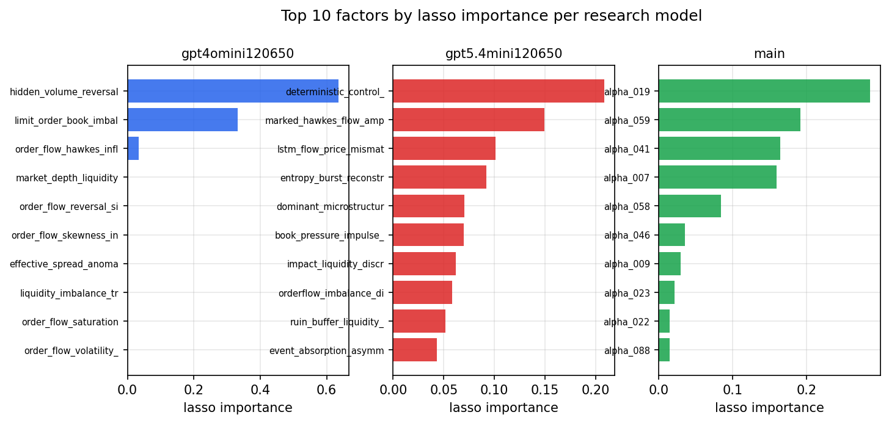

*Top factors by lasso importance per zoo*

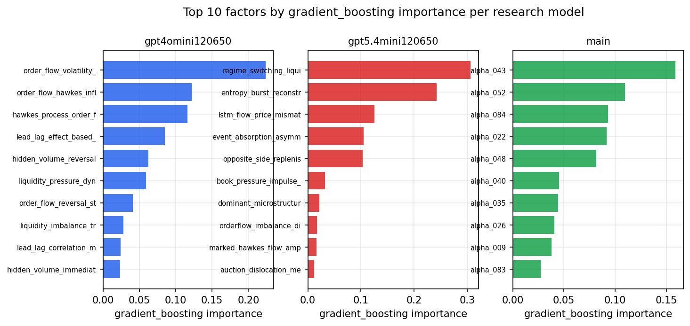

*Top factors by gradient_boosting importance per zoo*

## 4. ML-combined signal — per-underlying vectorised backtest

Each model combines a prerun's factors into ONE signal (fit `factors → forward return` on IS, predict per (bar, underlying)), then that combined signal is run through a simple vectorised backtest — `position(signal) × the underlying's own forward return` — on the held-out OOS tail (+ an equal-weight ensemble). No cross-sectional ranking.

> Config: position=**threshold** (t=1.0, z-score `expanding`), aggregation=**portfolio**, fit-standardise=**per_underlying**, horizon=6.

| prerun | model | n_factors_used | oos_ic | oos_sharpe | is_sharpe | oos_ann_return | oos_max_drawdown |
| --- | --- | --- | --- | --- | --- | --- | --- |
| gpt4omini120650 | linear_regression | 66 | 0.0724 | 7.4461 | 15.0095 | 0.0328 | -0.0007 |
| gpt4omini120650 | ridge | 66 | 0.0749 | 6.7535 | 14.5836 | 0.0331 | -0.001 |
| gpt4omini120650 | lasso | 66 | 0.0805 | 4.6288 | 13.8853 | 0.0204 | -0.0008 |
| gpt4omini120650 | elastic_net | 66 | 0.0805 | 4.6288 | 13.8853 | 0.0204 | -0.0008 |
| gpt4omini120650 | random_forest | 66 | 0.0909 | 8.321 | 17.9839 | 0.0483 | -0.0007 |
| gpt4omini120650 | gradient_boosting | 66 | 0.0709 | 4.9307 | 10.1464 | 0.0107 | -0.0003 |
| gpt4omini120650 | xgboost | 66 | 0.097 | 2.4419 | 14.5924 | 0.0106 | -0.0008 |
| gpt4omini120650 | lightgbm | 66 | 0.1105 | 2.8181 | 18.0677 | 0.0131 | -0.0008 |
| gpt4omini120650 | ensemble | 66 | 0.0928 | 8.033 | 17.3512 | 0.0363 | -0.0003 |
| gpt5.4mini120650 | linear_regression | 69 | 0.023 | -5.9094 | 14.7341 | -0.0115 | -0.001 |
| gpt5.4mini120650 | ridge | 69 | 0.0217 | -5.1686 | 14.7347 | -0.0103 | -0.001 |
| gpt5.4mini120650 | lasso | 69 | nan | nan | nan | nan | nan |
| gpt5.4mini120650 | elastic_net | 69 | nan | nan | nan | nan | nan |
| gpt5.4mini120650 | random_forest | 69 | 0.129 | 23.2348 | 25.9111 | 0.1603 | -0.001 |
| gpt5.4mini120650 | gradient_boosting | 69 | 0.0853 | -2.3405 | 8.8103 | -0.0014 | -0.0002 |
| gpt5.4mini120650 | xgboost | 69 | 0.118 | 16.506 | 21.7559 | 0.0629 | -0.0003 |
| gpt5.4mini120650 | lightgbm | 69 | 0.1372 | 15.0932 | 18.2563 | 0.0524 | -0.0002 |
| gpt5.4mini120650 | ensemble | 69 | 0.0673 | 10.5498 | 19.071 | 0.0269 | -0.0003 |
| main | linear_regression | 77 | 0.0032 | 6.3647 | 7.5524 | 0.029 | -0.0005 |
| main | ridge | 77 | 0.0058 | 6.0826 | 9.2205 | 0.0257 | -0.0006 |
| main | lasso | 77 | 0.002 | 2.4324 | 8.9916 | 0.0055 | -0.0004 |
| main | elastic_net | 77 | 0.0018 | 2.4324 | 8.7899 | 0.0055 | -0.0004 |
| main | random_forest | 77 | 0.0103 | 1.4698 | 14.861 | 0.0045 | -0.0005 |
| main | gradient_boosting | 77 | 0.0194 | -2.0344 | 15.3216 | -0.0033 | -0.0004 |
| main | xgboost | 77 | 0.0127 | 0.7412 | 16.2423 | 0.0017 | -0.0005 |
| main | lightgbm | 77 | 0.0105 | 0.7864 | 19.0897 | 0.0014 | -0.0004 |
| main | ensemble | 77 | 0.0077 | 3.3569 | 18.8986 | 0.0097 | -0.0005 |

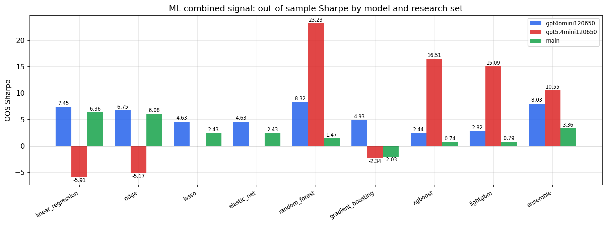

*ML-combined OOS Sharpe by model and research set*

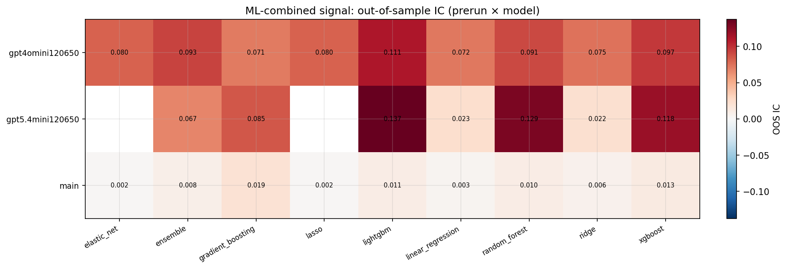

*ML-combined OOS IC (prerun × model)*

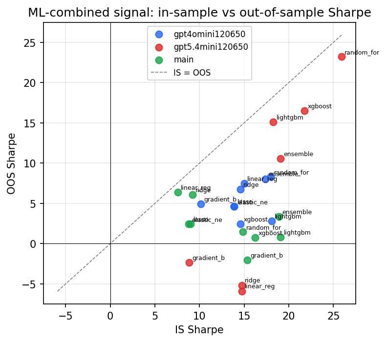

*IS vs OOS Sharpe (overfitting diagnostic)*

---
*Generated by `run_model_comparison.py`. Tables: `*.csv`; interactive: `comparison.ipynb`.*
