# Research-LLM factor comparison — `2025-07`

Comparing the **factor output of different research LLMs** on three axes (raw factor quality → factors as ML features → factors through the full agentic fund). The panel, IS/OOS split, horizon and model hyper-parameters are held identical across preruns — the *only* variable is the factor set.

## Preruns compared

| prerun | research_model | usable_factors | dropped_factors |
| --- | --- | --- | --- |
| gpt4omini120650 | gpt-4o-mini | 66 | 0 |
| gpt5.4mini120650 | gpt-5.4-mini | 69 | 0 |
| main | seed library | 77 | 11 |

> Dropped factors declare fields the current data doesn't have yet (e.g. fundamentals); they light up unchanged once that data is downloaded.

*Usable vs awaiting-data factors per research model*

## Key findings

- **Best ML-combined OOS Sharpe:** `gpt5.4mini120650` with `random_forest` (OOS Sharpe = 20.142).
- **Mean OOS Sharpe across models, by research set:** `gpt4omini120650` = 10.340, `gpt5.4mini120650` = 7.794, `main` = 2.517.
- **Highest mean single-factor |IC| (h=6):** `main` (mean |IC| = 0.0225).
- **Most diverse zoo (highest effective/raw factor ratio):** `gpt5.4mini120650` (eff 56.7 of 69, ratio 0.82).
- **Best selection-deflated single-factor |IC|:** `main` (deflated |IC| = 0.1304 from 36 factors tried).

## 1. Single-factor IC (raw factor quality)

Per-underlying time-series Spearman rank-IC of every researched factor, recomputed on the shared panel at horizons h=1, h=6, h=60. The per-underlying IC correlates each factor's value vector with the underlying's own forward-return vector (pooled across underlyings); the cross-sectional IC ranks across underlyings per timestamp.

| prerun | n_factors | mean_abs_ic_1 | mean_abs_ic_6 | mean_abs_ic_60 | mean_abs_icir_6 | best_factor_h6 | best_abs_ic_h6 |
| --- | --- | --- | --- | --- | --- | --- | --- |
| gpt4omini120650 | 66 | 0.0103 | 0.0176 | 0.0194 | 0.5962 | liquidity_imbalance_trend | 0.0834 |
| gpt5.4mini120650 | 69 | 0.0075 | 0.012 | 0.0138 | 0.5203 | orderflow_imbalance_divergence | 0.0756 |
| main | 77 | 0.0115 | 0.0225 | 0.0263 | 0.4238 | alpha_058 | 0.1375 |

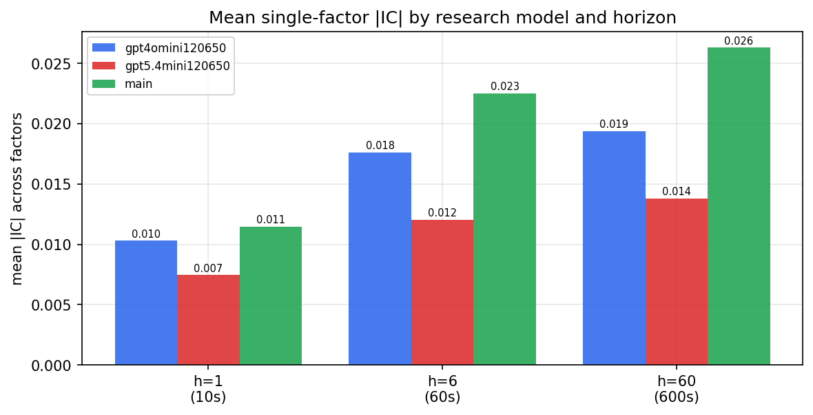

*Mean |IC| by research model and horizon*

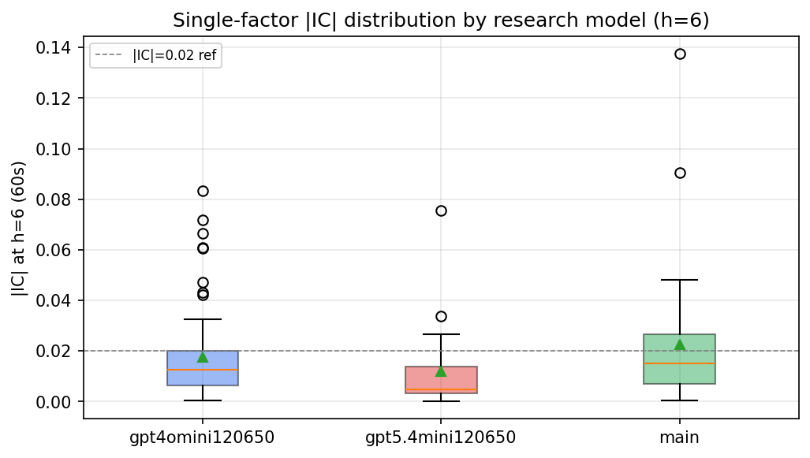

*Per-factor |IC| distribution by research model*

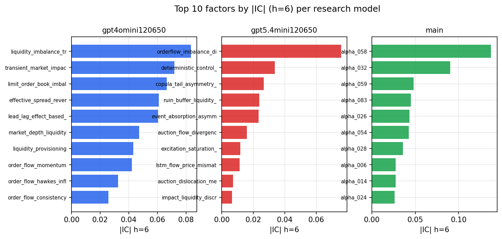

*Top factors by |IC| per research model*

## 2. Factor diversity & redundancy

Pairwise correlation of each zoo's *signals*. `eff_n_factors` is the effective number of independent factors (participation ratio of the correlation eigenvalues); `eff_ratio` and `redundancy` summarise how much unique information the zoo holds vs. how much is duplicated; `n_clusters` groups factors at |corr| ≥ 0.7.

| prerun | n_factors | eff_n_factors | eff_ratio | mean_abs_corr | n_clusters | redundancy |
| --- | --- | --- | --- | --- | --- | --- |
| gpt4omini120650 | 66 | 33.2506 | 0.5038 | 0.0446 | 56 | 0.4962 |
| gpt5.4mini120650 | 69 | 56.6713 | 0.8213 | 0.0089 | 65 | 0.1787 |
| main | 77 | 25.2823 | 0.3283 | 0.0579 | 51 | 0.6717 |

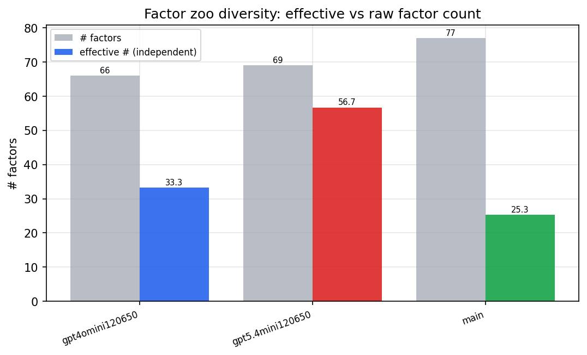

*Effective vs raw factor count per research model*

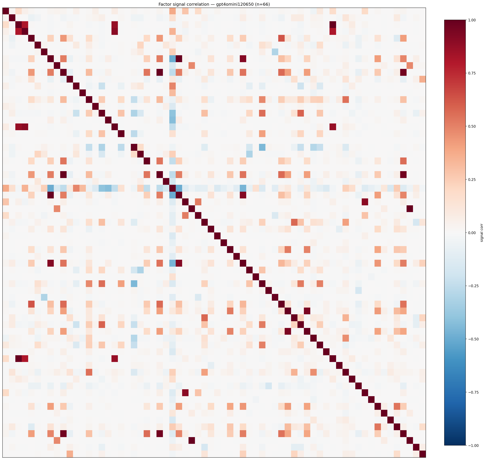

*Signal correlation matrix — gpt4omini120650*

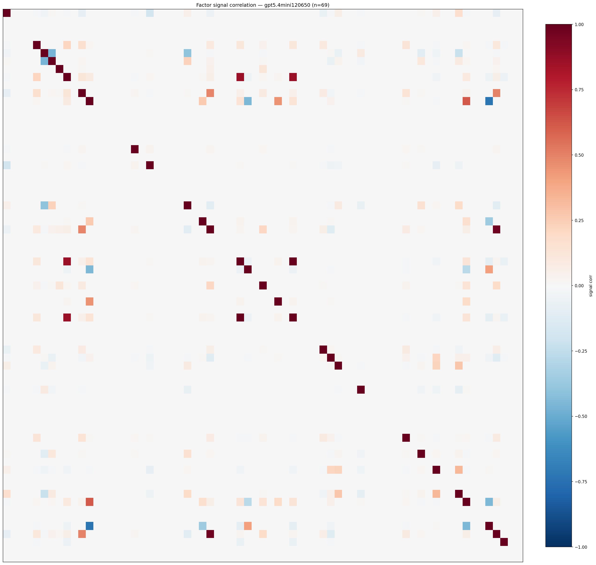

*Signal correlation matrix — gpt5.4mini120650*

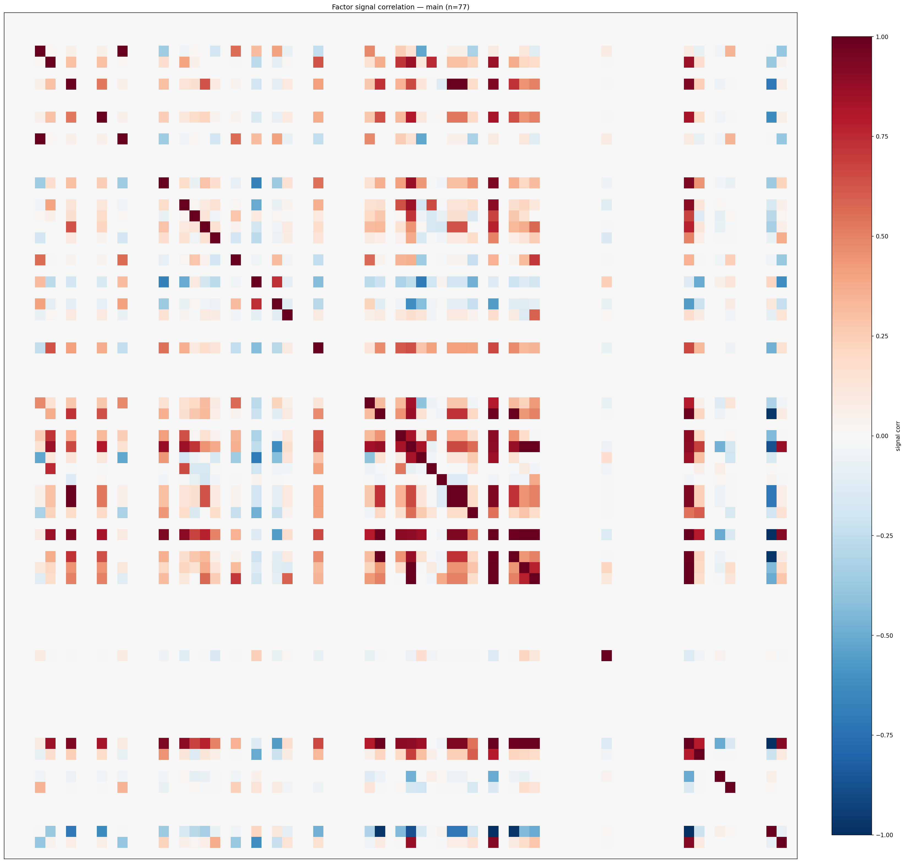

*Signal correlation matrix — main*

## 3. Deflation & model-based importance

`deflated_best_ic` haircuts each zoo's best |IC| for the number of factors tried (`ic_n_tested`) — a bigger zoo's best factor is more likely to be lucky. `lasso_n_nonzero` / `lasso_sparsity` show how many factors a sparse linear model actually keeps (model-view redundancy).

| prerun | best_ic | deflated_best_ic | deflated_best_t | ic_n_tested | ic_n_obs | lasso_n_nonzero | lasso_sparsity |
| --- | --- | --- | --- | --- | --- | --- | --- |
| gpt4omini120650 | 0.0834 | 0.0758 | 28.768 | 64 | 143999 | 14 | 0.7879 |
| gpt5.4mini120650 | 0.0756 | 0.069 | 26.1904 | 23 | 143999 | 8 | 0.8841 |
| main | 0.1375 | 0.1304 | 49.4866 | 36 | 143999 | 0 | 1.0 |

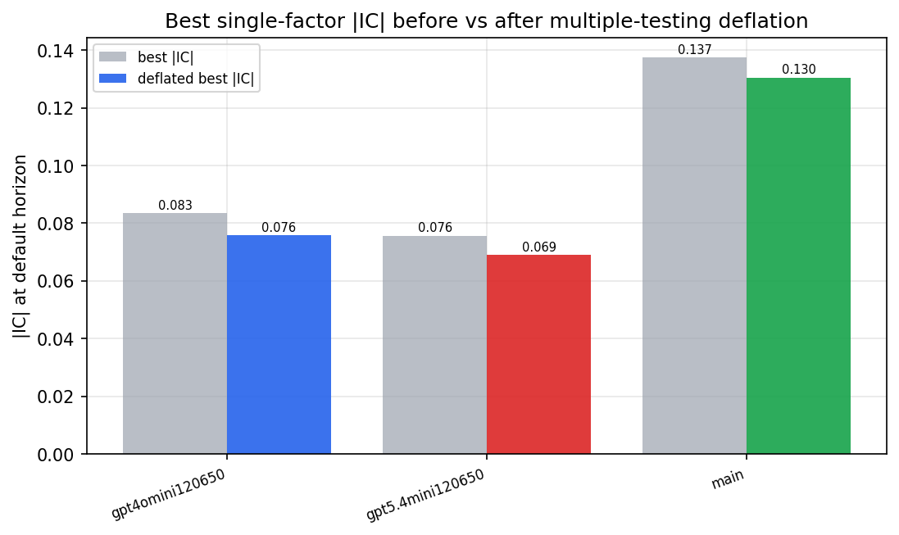

*Best |IC| before vs after multiple-testing deflation*

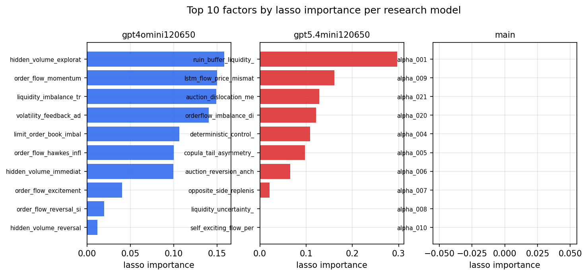

*Top factors by lasso importance per zoo*

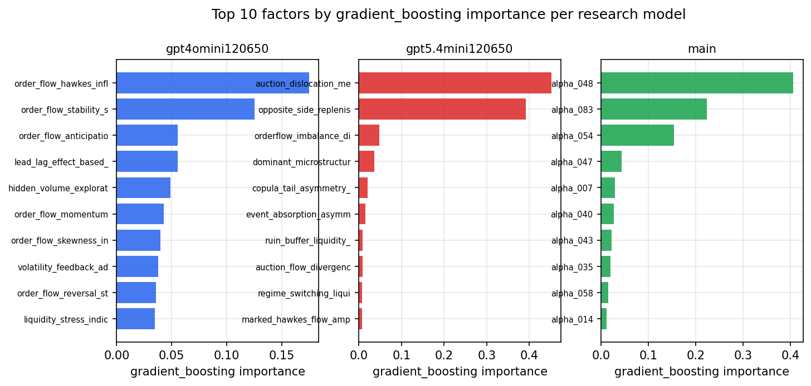

*Top factors by gradient_boosting importance per zoo*

## 4. ML-combined signal — per-underlying vectorised backtest

Each model combines a prerun's factors into ONE signal (fit `factors → forward return` on IS, predict per (bar, underlying)), then that combined signal is run through a simple vectorised backtest — `position(signal) × the underlying's own forward return` — on the held-out OOS tail (+ an equal-weight ensemble). No cross-sectional ranking.

> Config: position=**threshold** (t=1.0, z-score `expanding`), aggregation=**portfolio**, fit-standardise=**per_underlying**, horizon=6.

| prerun | model | n_factors_used | oos_ic | oos_sharpe | is_sharpe | oos_ann_return | oos_max_drawdown |
| --- | --- | --- | --- | --- | --- | --- | --- |
| gpt4omini120650 | linear_regression | 66 | 0.0985 | 19.2033 | 18.3585 | 0.0794 | -0.0004 |
| gpt4omini120650 | ridge | 66 | 0.0987 | 20.1279 | 17.1544 | 0.0782 | -0.0002 |
| gpt4omini120650 | lasso | 66 | nan | nan | nan | nan | nan |
| gpt4omini120650 | elastic_net | 66 | nan | nan | nan | nan | nan |
| gpt4omini120650 | random_forest | 66 | 0.1068 | 9.7041 | 18.3198 | 0.0529 | -0.0006 |
| gpt4omini120650 | gradient_boosting | 66 | 0.0911 | 2.1417 | 11.3712 | 0.0065 | -0.0006 |
| gpt4omini120650 | xgboost | 66 | 0.1016 | 4.507 | 12.2873 | 0.0184 | -0.0007 |
| gpt4omini120650 | lightgbm | 66 | 0.1103 | 4.4593 | 12.6027 | 0.0197 | -0.0004 |
| gpt4omini120650 | ensemble | 66 | 0.0895 | 12.2379 | 17.4614 | 0.0605 | -0.0004 |
| gpt5.4mini120650 | linear_regression | 69 | 0.0378 | 5.2678 | 7.2082 | 0.0123 | -0.0001 |
| gpt5.4mini120650 | ridge | 69 | 0.0387 | 4.1774 | 7.2043 | 0.0102 | -0.0002 |
| gpt5.4mini120650 | lasso | 69 | 0.0327 | 4.5206 | 7.6011 | 0.0118 | -0.0003 |
| gpt5.4mini120650 | elastic_net | 69 | 0.0328 | 4.5113 | 7.5423 | 0.0118 | -0.0003 |
| gpt5.4mini120650 | random_forest | 69 | 0.0907 | 20.1416 | 18.0495 | 0.0914 | -0.0004 |
| gpt5.4mini120650 | gradient_boosting | 69 | 0.0827 | 5.2978 | 6.8742 | 0.0145 | -0.0003 |
| gpt5.4mini120650 | xgboost | 69 | 0.104 | 9.0928 | 10.3546 | 0.0303 | -0.0003 |
| gpt5.4mini120650 | lightgbm | 69 | 0.1192 | 8.4077 | 11.5428 | 0.0271 | -0.0002 |
| gpt5.4mini120650 | ensemble | 69 | 0.0991 | 8.7334 | 8.1411 | 0.0294 | -0.0003 |
| main | linear_regression | 77 | -0.0 | 3.3425 | 10.1833 | 0.0186 | -0.0007 |
| main | ridge | 77 | 0.0004 | 3.693 | 10.4273 | 0.0207 | -0.0007 |
| main | lasso | 77 | -0.0046 | 2.7475 | 9.4001 | 0.0155 | -0.0011 |
| main | elastic_net | 77 | -0.004 | 2.8338 | 9.3682 | 0.016 | -0.001 |
| main | random_forest | 77 | 0.0075 | 2.6051 | 8.8883 | 0.0157 | -0.0008 |
| main | gradient_boosting | 77 | -0.0068 | 0.9668 | 8.4566 | 0.0049 | -0.0009 |
| main | xgboost | 77 | -0.007 | 0.9282 | 8.9522 | 0.0044 | -0.0007 |
| main | lightgbm | 77 | 0.0113 | 2.6427 | 10.4027 | 0.0101 | -0.0005 |
| main | ensemble | 77 | -0.0046 | 2.8961 | 9.6177 | 0.0162 | -0.0009 |

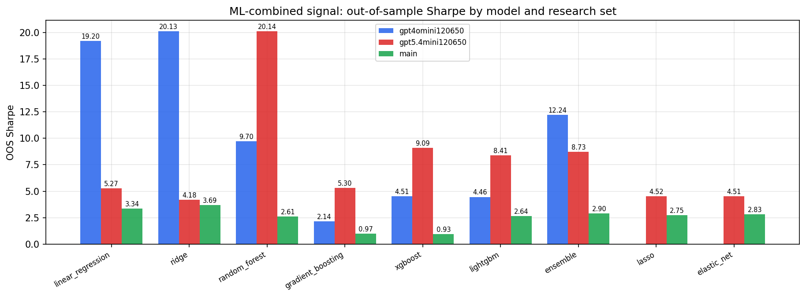

*ML-combined OOS Sharpe by model and research set*

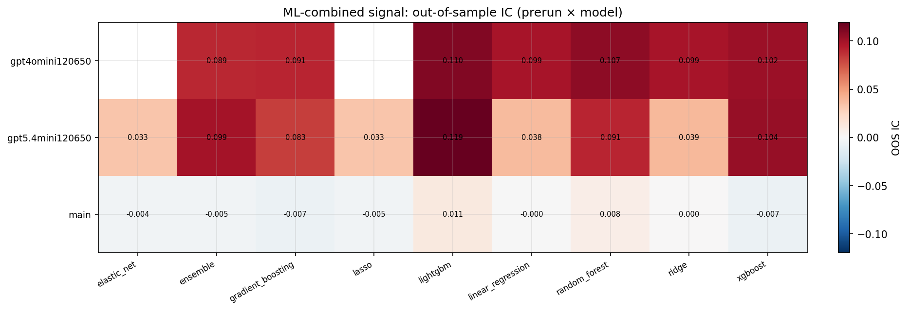

*ML-combined OOS IC (prerun × model)*

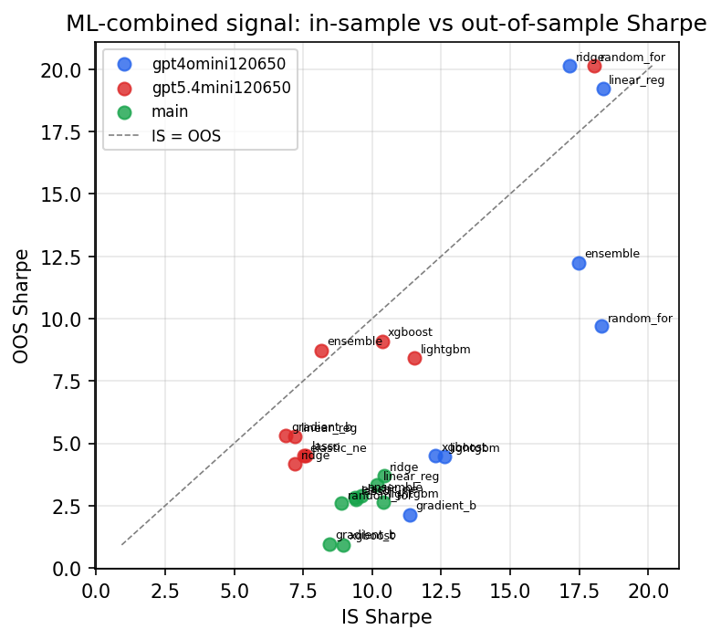

*IS vs OOS Sharpe (overfitting diagnostic)*

---
*Generated by `run_model_comparison.py`. Tables: `*.csv`; interactive: `comparison.ipynb`.*
