# Research-LLM factor comparison — `2025-08`

Comparing the **factor output of different research LLMs** on three axes (raw factor quality → factors as ML features → factors through the full agentic fund). The panel, IS/OOS split, horizon and model hyper-parameters are held identical across preruns — the *only* variable is the factor set.

## Preruns compared

| prerun | research_model | usable_factors | dropped_factors |
| --- | --- | --- | --- |
| gpt4omini120650 | gpt-4o-mini | 66 | 0 |
| gpt5.4mini120650 | gpt-5.4-mini | 69 | 0 |
| main | seed library | 77 | 11 |

> Dropped factors declare fields the current data doesn't have yet (e.g. fundamentals); they light up unchanged once that data is downloaded.

*Usable vs awaiting-data factors per research model*

## Key findings

- **Best ML-combined OOS Sharpe:** `gpt4omini120650` with `random_forest` (OOS Sharpe = 7.834).
- **Mean OOS Sharpe across models, by research set:** `gpt4omini120650` = 3.389, `gpt5.4mini120650` = 1.327, `main` = -0.580.
- **Highest mean single-factor |IC| (h=6):** `main` (mean |IC| = 0.0201).
- **Most diverse zoo (highest effective/raw factor ratio):** `gpt5.4mini120650` (eff 56.8 of 69, ratio 0.82).
- **Best selection-deflated single-factor |IC|:** `main` (deflated |IC| = 0.1351 from 36 factors tried).

## 1. Single-factor IC (raw factor quality)

Per-underlying time-series Spearman rank-IC of every researched factor, recomputed on the shared panel at horizons h=1, h=6, h=60. The per-underlying IC correlates each factor's value vector with the underlying's own forward-return vector (pooled across underlyings); the cross-sectional IC ranks across underlyings per timestamp.

| prerun | n_factors | mean_abs_ic_1 | mean_abs_ic_6 | mean_abs_ic_60 | mean_abs_icir_6 | best_factor_h6 | best_abs_ic_h6 |
| --- | --- | --- | --- | --- | --- | --- | --- |
| gpt4omini120650 | 66 | 0.012 | 0.0168 | 0.0178 | 0.6036 | liquidity_imbalance_trend | 0.0885 |
| gpt5.4mini120650 | 69 | 0.0065 | 0.0077 | 0.0116 | 0.4894 | orderflow_imbalance_divergence | 0.0606 |
| main | 77 | 0.0145 | 0.0201 | 0.0215 | 0.3666 | alpha_058 | 0.1421 |

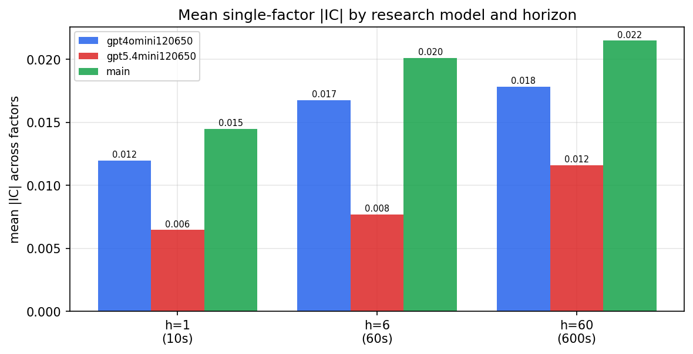

*Mean |IC| by research model and horizon*

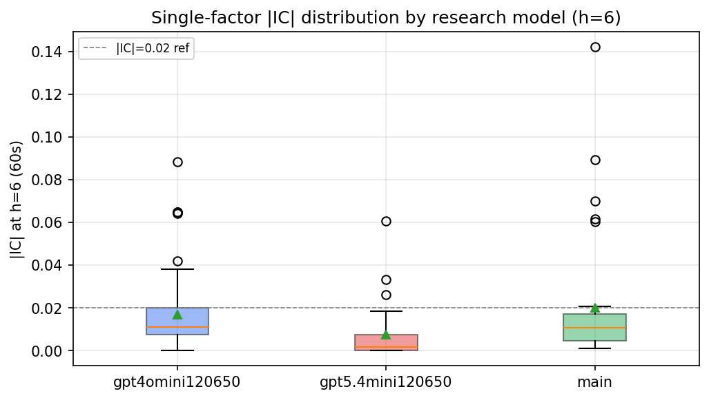

*Per-factor |IC| distribution by research model*

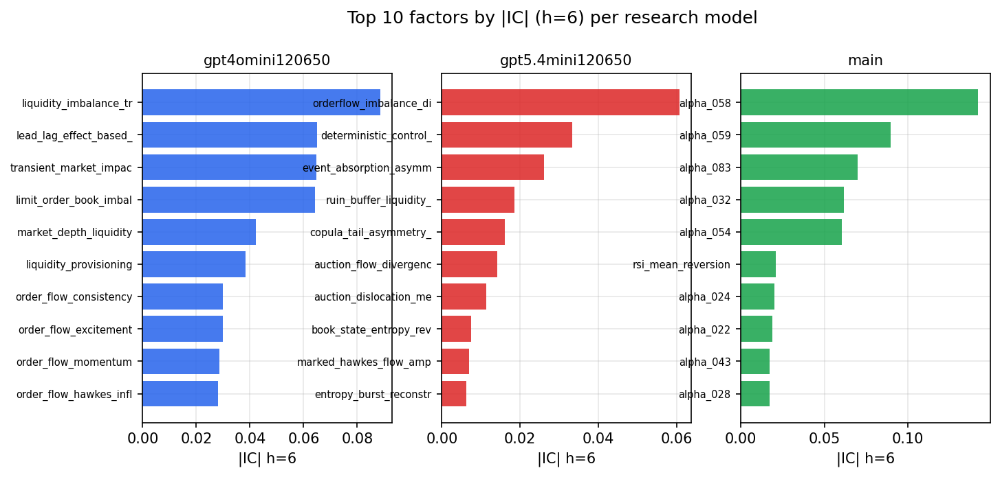

*Top factors by |IC| per research model*

## 2. Factor diversity & redundancy

Pairwise correlation of each zoo's *signals*. `eff_n_factors` is the effective number of independent factors (participation ratio of the correlation eigenvalues); `eff_ratio` and `redundancy` summarise how much unique information the zoo holds vs. how much is duplicated; `n_clusters` groups factors at |corr| ≥ 0.7.

| prerun | n_factors | eff_n_factors | eff_ratio | mean_abs_corr | n_clusters | redundancy |
| --- | --- | --- | --- | --- | --- | --- |
| gpt4omini120650 | 66 | 33.4556 | 0.5069 | 0.0436 | 56 | 0.4931 |
| gpt5.4mini120650 | 69 | 56.8198 | 0.8235 | 0.0086 | 65 | 0.1765 |
| main | 77 | 28.4169 | 0.3691 | 0.0512 | 56 | 0.6309 |

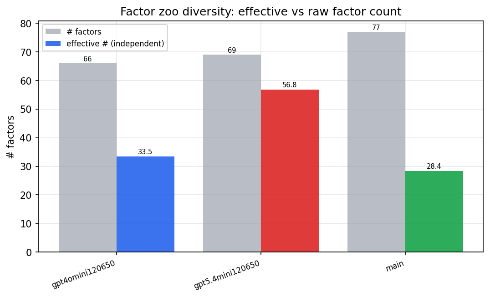

*Effective vs raw factor count per research model*

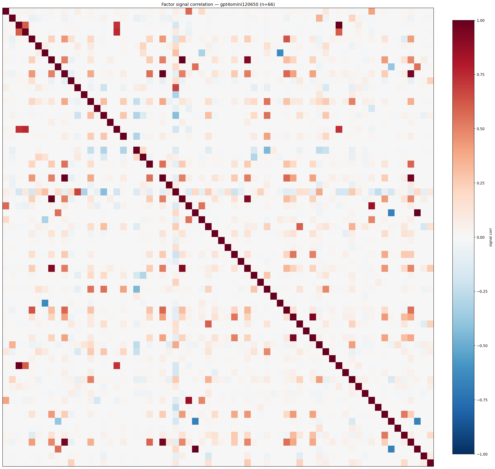

*Signal correlation matrix — gpt4omini120650*

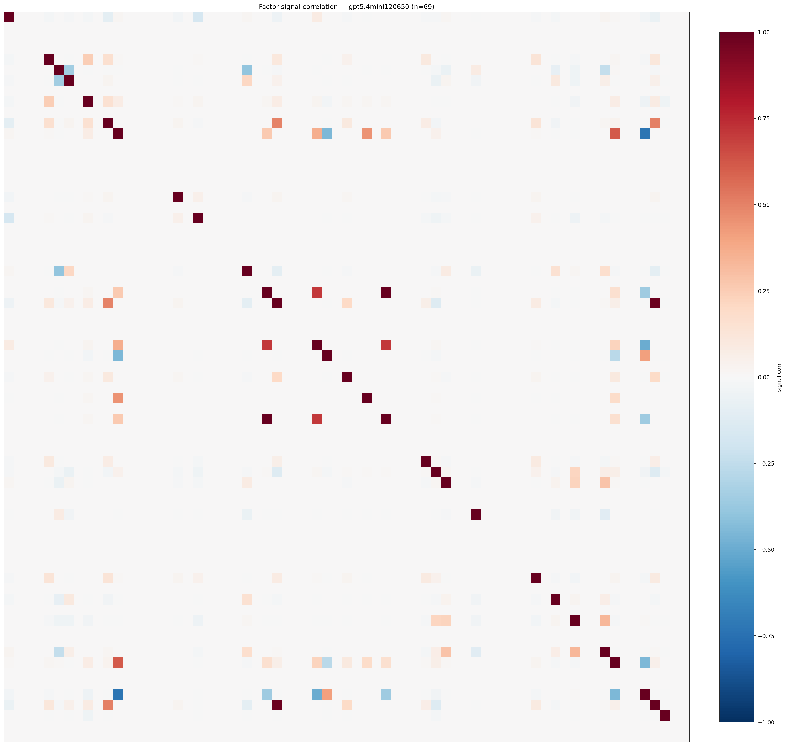

*Signal correlation matrix — gpt5.4mini120650*

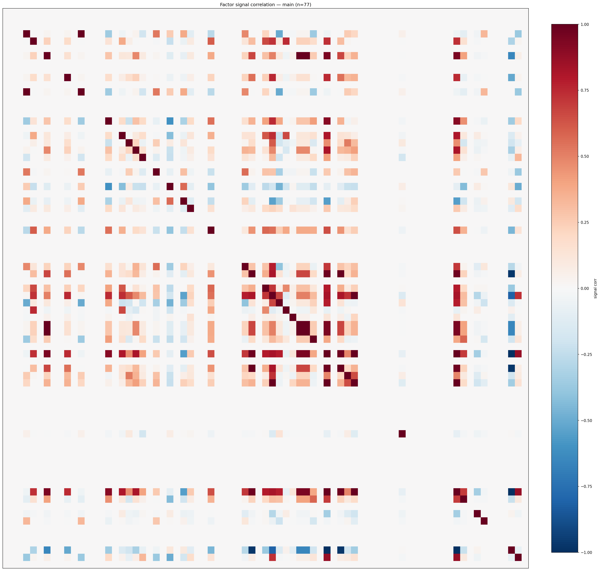

*Signal correlation matrix — main*

## 3. Deflation & model-based importance

`deflated_best_ic` haircuts each zoo's best |IC| for the number of factors tried (`ic_n_tested`) — a bigger zoo's best factor is more likely to be lucky. `lasso_n_nonzero` / `lasso_sparsity` show how many factors a sparse linear model actually keeps (model-view redundancy).

| prerun | best_ic | deflated_best_ic | deflated_best_t | ic_n_tested | ic_n_obs | lasso_n_nonzero | lasso_sparsity |
| --- | --- | --- | --- | --- | --- | --- | --- |
| gpt4omini120650 | 0.0885 | 0.081 | 30.9802 | 64 | 146339 | 28 | 0.5758 |
| gpt5.4mini120650 | 0.0606 | 0.0538 | 20.5971 | 29 | 146339 | 9 | 0.8696 |
| main | 0.1421 | 0.1351 | 51.6979 | 36 | 146339 | 17 | 0.7792 |

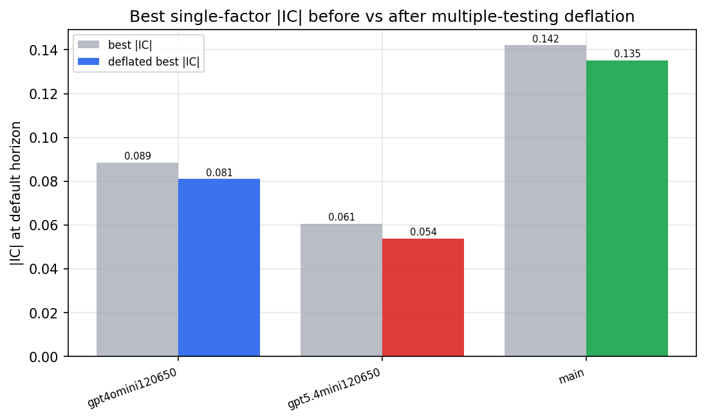

*Best |IC| before vs after multiple-testing deflation*

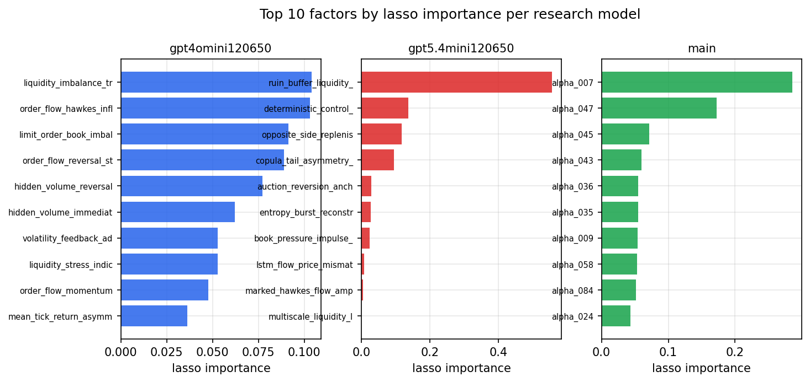

*Top factors by lasso importance per zoo*

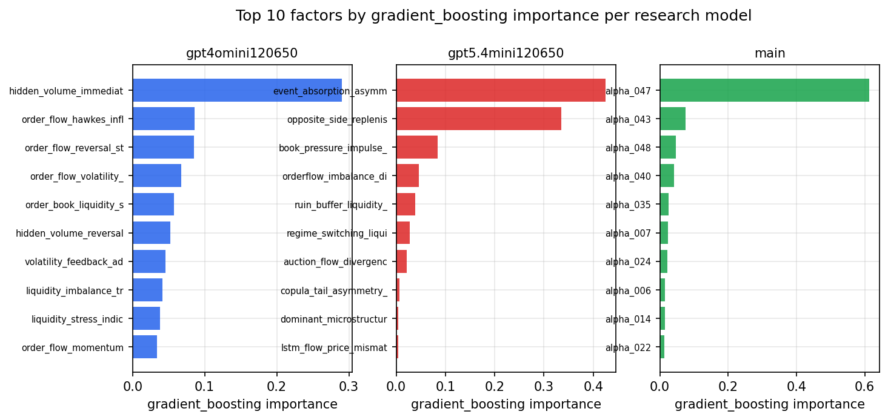

*Top factors by gradient_boosting importance per zoo*

## 4. ML-combined signal — per-underlying vectorised backtest

Each model combines a prerun's factors into ONE signal (fit `factors → forward return` on IS, predict per (bar, underlying)), then that combined signal is run through a simple vectorised backtest — `position(signal) × the underlying's own forward return` — on the held-out OOS tail (+ an equal-weight ensemble). No cross-sectional ranking.

> Config: position=**threshold** (t=1.0, z-score `expanding`), aggregation=**portfolio**, fit-standardise=**per_underlying**, horizon=6.

| prerun | model | n_factors_used | oos_ic | oos_sharpe | is_sharpe | oos_ann_return | oos_max_drawdown |
| --- | --- | --- | --- | --- | --- | --- | --- |
| gpt4omini120650 | linear_regression | 66 | 0.0535 | 4.6163 | 23.8176 | 0.0038 | -0.0001 |
| gpt4omini120650 | ridge | 66 | 0.0558 | 4.8254 | 23.3876 | 0.0038 | -0.0001 |
| gpt4omini120650 | lasso | 66 | 0.0589 | 5.4988 | 18.1001 | 0.0255 | -0.0006 |
| gpt4omini120650 | elastic_net | 66 | 0.059 | 5.7813 | 18.1072 | 0.0267 | -0.0006 |
| gpt4omini120650 | random_forest | 66 | 0.0516 | 7.8337 | 19.5557 | 0.0425 | -0.0008 |
| gpt4omini120650 | gradient_boosting | 66 | 0.0569 | 0.3265 | 9.3764 | 0.001 | -0.0008 |
| gpt4omini120650 | xgboost | 66 | 0.0625 | 1.2368 | 9.554 | 0.0033 | -0.0005 |
| gpt4omini120650 | lightgbm | 66 | 0.0637 | -2.6863 | 13.1051 | -0.0094 | -0.001 |
| gpt4omini120650 | ensemble | 66 | 0.0628 | 3.0701 | 17.1849 | 0.0116 | -0.0009 |
| gpt5.4mini120650 | linear_regression | 69 | 0.0089 | 7.0637 | 8.5901 | 0.0126 | -0.0004 |
| gpt5.4mini120650 | ridge | 69 | 0.009 | 5.6328 | 8.9329 | 0.0102 | -0.0004 |
| gpt5.4mini120650 | lasso | 69 | -0.0037 | -2.0451 | 5.5467 | -0.0023 | -0.0003 |
| gpt5.4mini120650 | elastic_net | 69 | -0.0037 | -2.0451 | 5.5467 | -0.0023 | -0.0003 |
| gpt5.4mini120650 | random_forest | 69 | 0.0922 | 7.4227 | 12.2669 | 0.0299 | -0.0009 |
| gpt5.4mini120650 | gradient_boosting | 69 | 0.0794 | -3.1059 | 6.489 | -0.008 | -0.0012 |
| gpt5.4mini120650 | xgboost | 69 | 0.1044 | 0.2216 | 10.2021 | 0.0006 | -0.0008 |
| gpt5.4mini120650 | lightgbm | 69 | 0.1079 | -1.2459 | 13.3478 | -0.0035 | -0.0009 |
| gpt5.4mini120650 | ensemble | 69 | 0.0825 | 0.0456 | 10.3287 | 0.0001 | -0.0009 |
| main | linear_regression | 77 | -0.0008 | -1.4478 | 8.0892 | -0.0042 | -0.0009 |
| main | ridge | 77 | -0.0023 | -2.0917 | 7.9274 | -0.0062 | -0.0009 |
| main | lasso | 77 | -0.0001 | -1.3513 | 7.7302 | -0.0039 | -0.0007 |
| main | elastic_net | 77 | 0.0005 | -0.643 | 8.2584 | -0.0019 | -0.0008 |
| main | random_forest | 77 | 0.0194 | 1.0519 | 8.1667 | 0.0039 | -0.0008 |
| main | gradient_boosting | 77 | 0.0112 | -1.216 | 8.9119 | -0.0035 | -0.0007 |
| main | xgboost | 77 | 0.0076 | 0.713 | 10.2424 | 0.0026 | -0.0009 |
| main | lightgbm | 77 | 0.0028 | 0.5613 | 12.5726 | 0.0018 | -0.0009 |
| main | ensemble | 77 | 0.0066 | -0.7969 | 9.8803 | -0.0029 | -0.0008 |

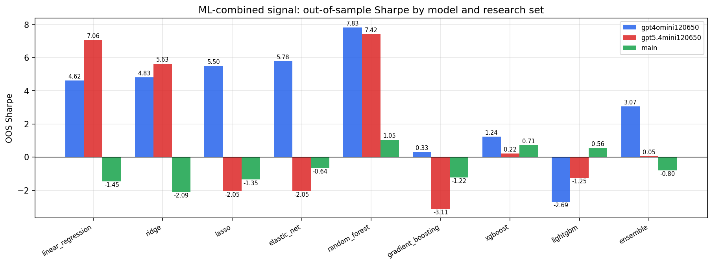

*ML-combined OOS Sharpe by model and research set*

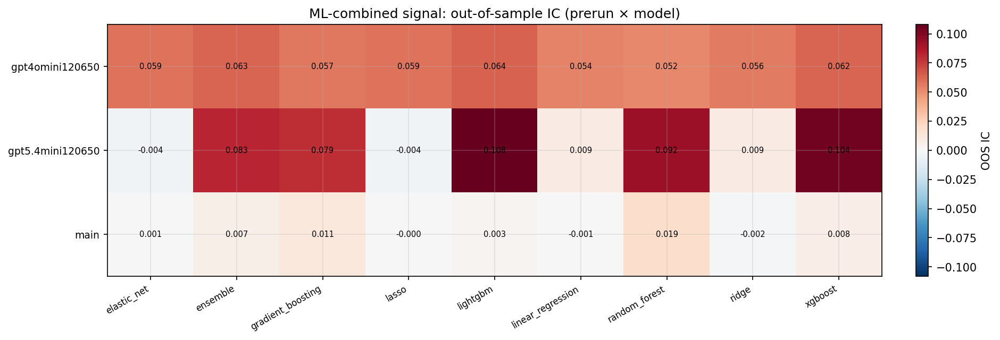

*ML-combined OOS IC (prerun × model)*

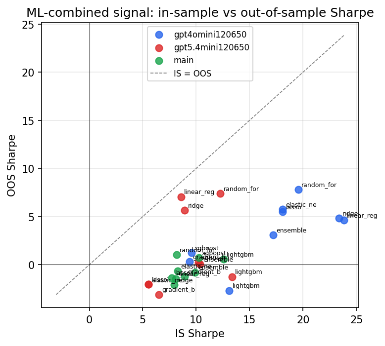

*IS vs OOS Sharpe (overfitting diagnostic)*

---
*Generated by `run_model_comparison.py`. Tables: `*.csv`; interactive: `comparison.ipynb`.*
