# Research-LLM factor comparison — `2025-09`

Comparing the **factor output of different research LLMs** on three axes (raw factor quality → factors as ML features → factors through the full agentic fund). The panel, IS/OOS split, horizon and model hyper-parameters are held identical across preruns — the *only* variable is the factor set.

## Preruns compared

| prerun | research_model | usable_factors | dropped_factors |
| --- | --- | --- | --- |
| gpt4omini120650 | gpt-4o-mini | 66 | 0 |
| gpt5.4mini120650 | gpt-5.4-mini | 69 | 0 |
| main | seed library | 77 | 11 |

> Dropped factors declare fields the current data doesn't have yet (e.g. fundamentals); they light up unchanged once that data is downloaded.

*Usable vs awaiting-data factors per research model*

## Key findings

- **Best ML-combined OOS Sharpe:** `gpt5.4mini120650` with `random_forest` (OOS Sharpe = 11.884).
- **Mean OOS Sharpe across models, by research set:** `gpt5.4mini120650` = 5.371, `main` = 0.215, `gpt4omini120650` = -0.613.
- **Highest mean single-factor |IC| (h=6):** `main` (mean |IC| = 0.0238).
- **Most diverse zoo (highest effective/raw factor ratio):** `gpt5.4mini120650` (eff 60.8 of 69, ratio 0.88).
- **Best selection-deflated single-factor |IC|:** `main` (deflated |IC| = 0.1313 from 36 factors tried).

## 1. Single-factor IC (raw factor quality)

Per-underlying time-series Spearman rank-IC of every researched factor, recomputed on the shared panel at horizons h=1, h=6, h=60. The per-underlying IC correlates each factor's value vector with the underlying's own forward-return vector (pooled across underlyings); the cross-sectional IC ranks across underlyings per timestamp.

| prerun | n_factors | mean_abs_ic_1 | mean_abs_ic_6 | mean_abs_ic_60 | mean_abs_icir_6 | best_factor_h6 | best_abs_ic_h6 |
| --- | --- | --- | --- | --- | --- | --- | --- |
| gpt4omini120650 | 66 | 0.0122 | 0.0166 | 0.0182 | 0.6453 | effective_spread_reversal_strength | 0.0969 |
| gpt5.4mini120650 | 69 | 0.0069 | 0.0108 | 0.0156 | 0.5223 | orderflow_imbalance_divergence | 0.0582 |
| main | 77 | 0.0199 | 0.0238 | 0.0186 | 0.343 | alpha_059 | 0.1382 |

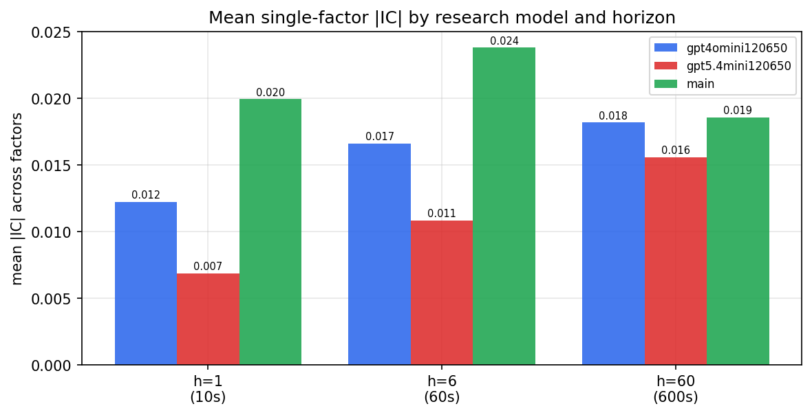

*Mean |IC| by research model and horizon*

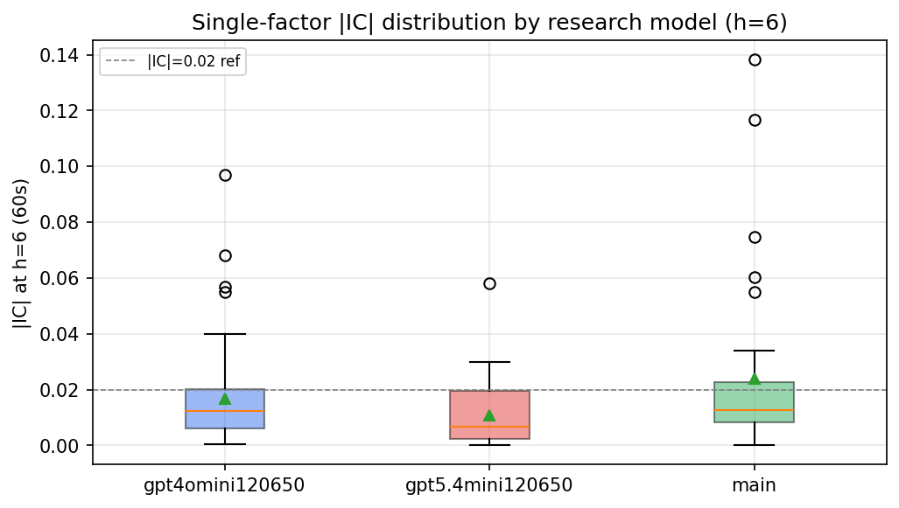

*Per-factor |IC| distribution by research model*

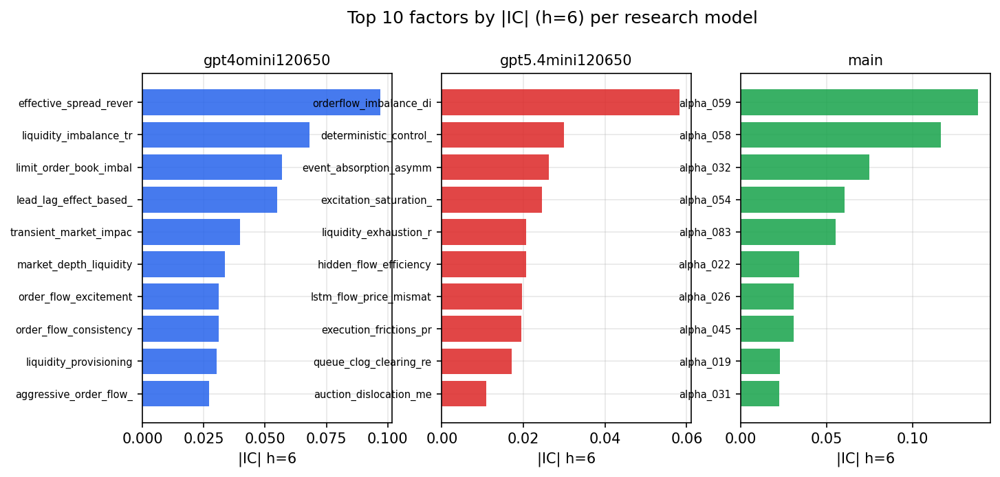

*Top factors by |IC| per research model*

## 2. Factor diversity & redundancy

Pairwise correlation of each zoo's *signals*. `eff_n_factors` is the effective number of independent factors (participation ratio of the correlation eigenvalues); `eff_ratio` and `redundancy` summarise how much unique information the zoo holds vs. how much is duplicated; `n_clusters` groups factors at |corr| ≥ 0.7.

| prerun | n_factors | eff_n_factors | eff_ratio | mean_abs_corr | n_clusters | redundancy |
| --- | --- | --- | --- | --- | --- | --- |
| gpt4omini120650 | 66 | 32.1169 | 0.4866 | 0.0446 | 54 | 0.5134 |
| gpt5.4mini120650 | 69 | 60.7619 | 0.8806 | 0.0067 | 67 | 0.1194 |
| main | 77 | 27.0398 | 0.3512 | 0.0529 | 55 | 0.6488 |

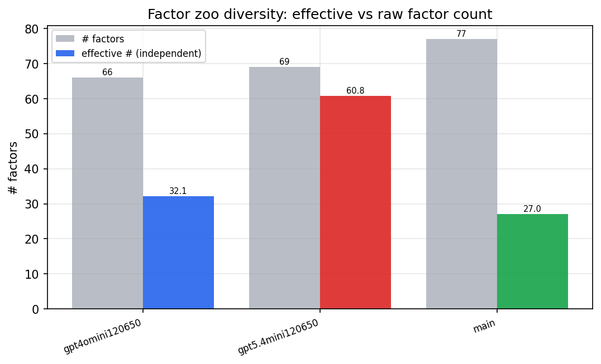

*Effective vs raw factor count per research model*

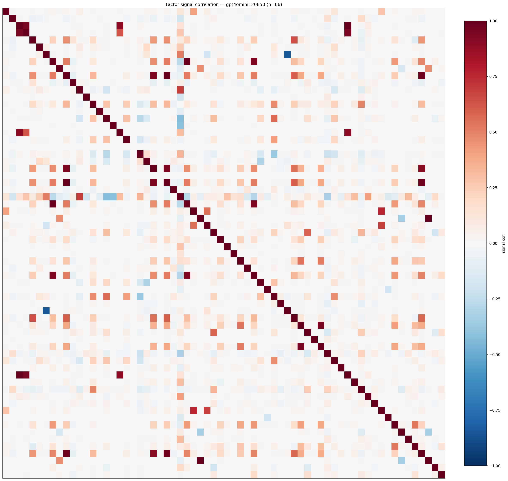

*Signal correlation matrix — gpt4omini120650*

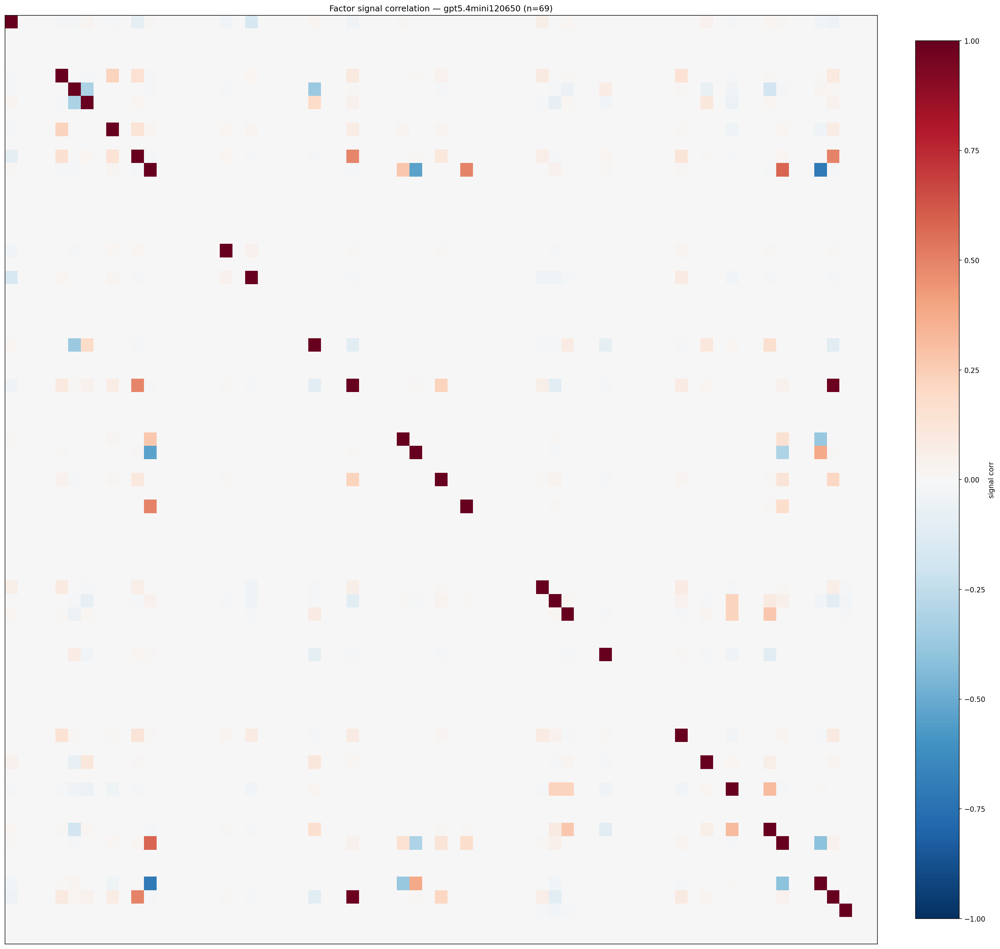

*Signal correlation matrix — gpt5.4mini120650*

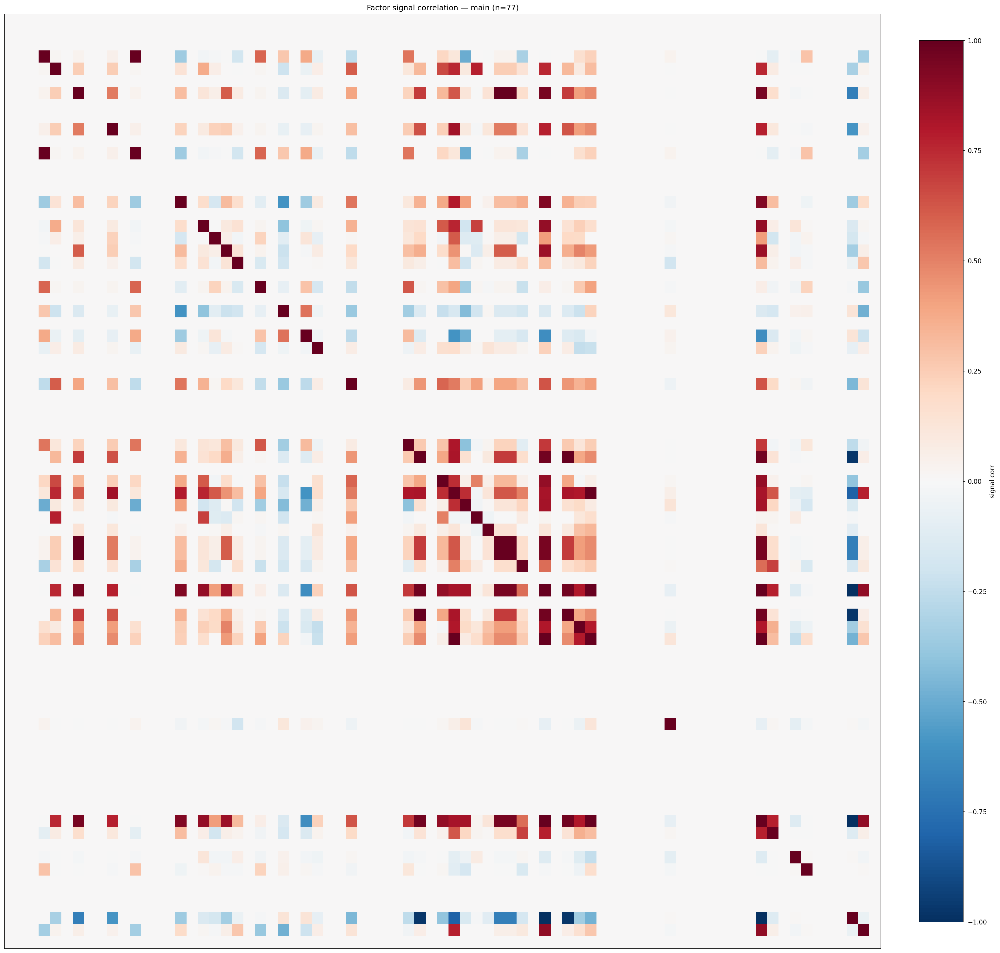

*Signal correlation matrix — main*

## 3. Deflation & model-based importance

`deflated_best_ic` haircuts each zoo's best |IC| for the number of factors tried (`ic_n_tested`) — a bigger zoo's best factor is more likely to be lucky. `lasso_n_nonzero` / `lasso_sparsity` show how many factors a sparse linear model actually keeps (model-view redundancy).

| prerun | best_ic | deflated_best_ic | deflated_best_t | ic_n_tested | ic_n_obs | lasso_n_nonzero | lasso_sparsity |
| --- | --- | --- | --- | --- | --- | --- | --- |
| gpt4omini120650 | 0.0969 | 0.0895 | 34.4947 | 64 | 148679 | 0 | 1.0 |
| gpt5.4mini120650 | 0.0582 | 0.0514 | 19.8308 | 29 | 148679 | 0 | 1.0 |
| main | 0.1382 | 0.1313 | 50.6149 | 36 | 148679 | 0 | 1.0 |

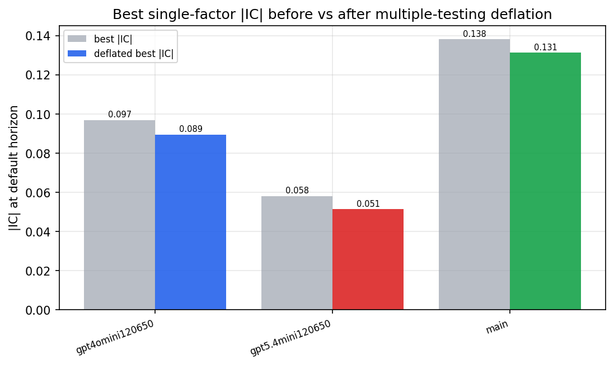

*Best |IC| before vs after multiple-testing deflation*

*Top factors by lasso importance per zoo*

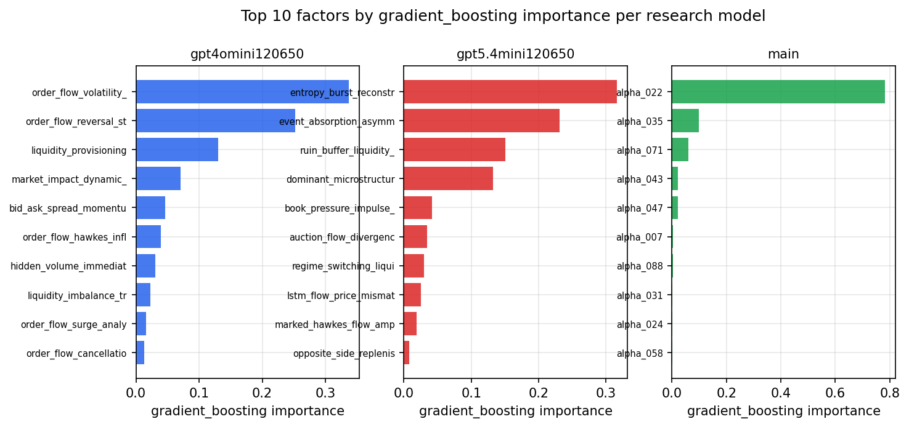

*Top factors by gradient_boosting importance per zoo*

## 4. ML-combined signal — per-underlying vectorised backtest

Each model combines a prerun's factors into ONE signal (fit `factors → forward return` on IS, predict per (bar, underlying)), then that combined signal is run through a simple vectorised backtest — `position(signal) × the underlying's own forward return` — on the held-out OOS tail (+ an equal-weight ensemble). No cross-sectional ranking.

> Config: position=**threshold** (t=1.0, z-score `expanding`), aggregation=**portfolio**, fit-standardise=**per_underlying**, horizon=6.

| prerun | model | n_factors_used | oos_ic | oos_sharpe | is_sharpe | oos_ann_return | oos_max_drawdown |
| --- | --- | --- | --- | --- | --- | --- | --- |
| gpt4omini120650 | linear_regression | 66 | 0.0666 | 2.4187 | 10.2013 | 0.0203 | -0.0022 |
| gpt4omini120650 | ridge | 66 | 0.0681 | 2.7763 | 10.15 | 0.0232 | -0.0022 |
| gpt4omini120650 | lasso | 66 | nan | nan | nan | nan | nan |
| gpt4omini120650 | elastic_net | 66 | nan | nan | nan | nan | nan |
| gpt4omini120650 | random_forest | 66 | 0.0808 | -0.7629 | 8.7546 | -0.0068 | -0.0031 |
| gpt4omini120650 | gradient_boosting | 66 | 0.05 | -5.6262 | 4.3971 | -0.0147 | -0.0012 |
| gpt4omini120650 | xgboost | 66 | 0.0826 | -5.3184 | 7.6184 | -0.0215 | -0.0019 |
| gpt4omini120650 | lightgbm | 66 | 0.0992 | 1.9459 | 11.446 | 0.0071 | -0.0006 |
| gpt4omini120650 | ensemble | 66 | 0.0791 | 0.2755 | 13.0304 | 0.002 | -0.0021 |
| gpt5.4mini120650 | linear_regression | 69 | 0.0296 | 4.021 | 3.2356 | 0.0156 | -0.0001 |
| gpt5.4mini120650 | ridge | 69 | 0.0311 | 4.4993 | 2.9759 | 0.0174 | -0.0001 |
| gpt5.4mini120650 | lasso | 69 | nan | nan | nan | nan | nan |
| gpt5.4mini120650 | elastic_net | 69 | nan | nan | nan | nan | nan |
| gpt5.4mini120650 | random_forest | 69 | 0.1094 | 11.8844 | 12.706 | 0.1064 | -0.0004 |
| gpt5.4mini120650 | gradient_boosting | 69 | 0.0703 | 3.5896 | 4.0403 | 0.014 | -0.0003 |
| gpt5.4mini120650 | xgboost | 69 | 0.1138 | 3.7827 | 5.9793 | 0.0145 | -0.0001 |
| gpt5.4mini120650 | lightgbm | 69 | 0.1276 | 5.1511 | 10.3575 | 0.0269 | -0.0003 |
| gpt5.4mini120650 | ensemble | 69 | 0.11 | 4.6681 | 8.4318 | 0.0364 | -0.0004 |
| main | linear_regression | 77 | 0.002 | 1.788 | 3.737 | 0.0054 | -0.0007 |
| main | ridge | 77 | 0.0009 | -1.2959 | 4.0444 | -0.0041 | -0.0012 |
| main | lasso | 77 | nan | nan | nan | nan | nan |
| main | elastic_net | 77 | nan | nan | nan | nan | nan |
| main | random_forest | 77 | 0.0033 | -1.4515 | 5.3526 | -0.0074 | -0.0014 |
| main | gradient_boosting | 77 | -0.0011 | -4.8625 | 5.1644 | -0.0255 | -0.0021 |
| main | xgboost | 77 | -0.0003 | 2.3008 | 6.9521 | 0.0125 | -0.0008 |
| main | lightgbm | 77 | 0.0075 | 4.7202 | 9.2283 | 0.019 | -0.0003 |
| main | ensemble | 77 | -0.003 | 0.308 | 6.8821 | 0.0008 | -0.0006 |

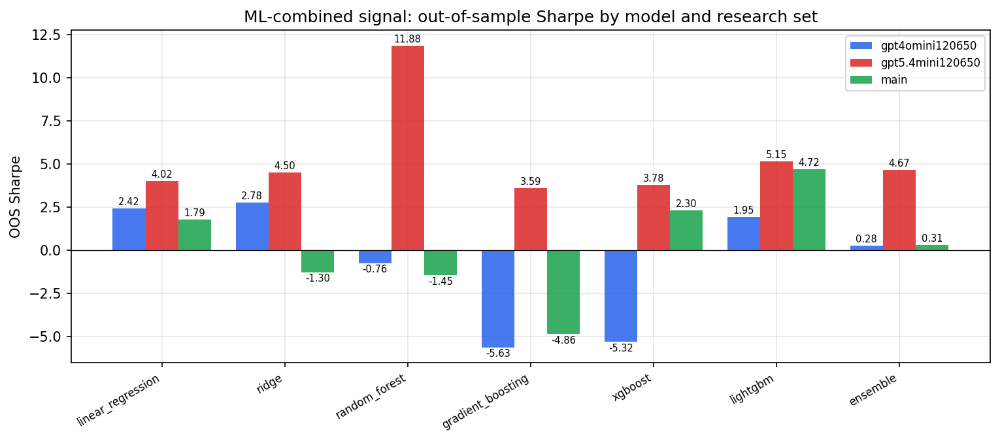

*ML-combined OOS Sharpe by model and research set*

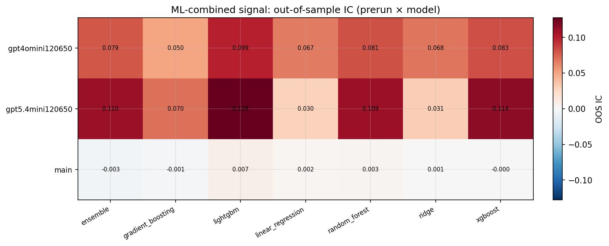

*ML-combined OOS IC (prerun × model)*

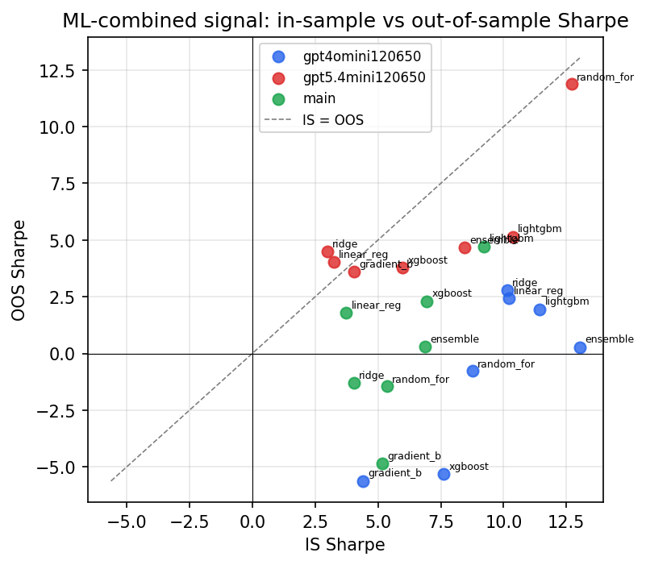

*IS vs OOS Sharpe (overfitting diagnostic)*

---
*Generated by `run_model_comparison.py`. Tables: `*.csv`; interactive: `comparison.ipynb`.*
