# Research-LLM factor comparison — `2025-10`

Comparing the **factor output of different research LLMs** on three axes (raw factor quality → factors as ML features → factors through the full agentic fund). The panel, IS/OOS split, horizon and model hyper-parameters are held identical across preruns — the *only* variable is the factor set.

## Preruns compared

| prerun | research_model | usable_factors | dropped_factors |
| --- | --- | --- | --- |
| gpt4omini120650 | gpt-4o-mini | 66 | 0 |
| gpt5.4mini120650 | gpt-5.4-mini | 69 | 0 |
| main | seed library | 77 | 11 |

> Dropped factors declare fields the current data doesn't have yet (e.g. fundamentals); they light up unchanged once that data is downloaded.

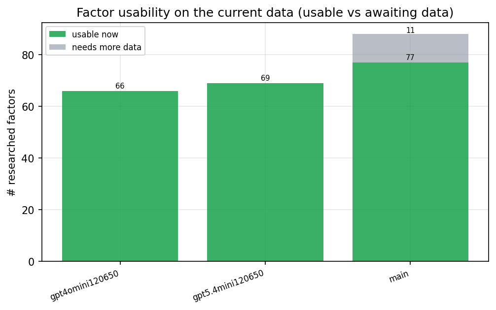

*Usable vs awaiting-data factors per research model*

## Key findings

- **Best ML-combined OOS Sharpe:** `gpt5.4mini120650` with `random_forest` (OOS Sharpe = 11.967).
- **Mean OOS Sharpe across models, by research set:** `main` = 4.684, `gpt5.4mini120650` = 3.841, `gpt4omini120650` = 2.865.
- **Highest mean single-factor |IC| (h=6):** `main` (mean |IC| = 0.0147).
- **Most diverse zoo (highest effective/raw factor ratio):** `gpt5.4mini120650` (eff 61.7 of 69, ratio 0.89).
- **Best selection-deflated single-factor |IC|:** `gpt4omini120650` (deflated |IC| = 0.1222 from 64 factors tried).

## 1. Single-factor IC (raw factor quality)

Per-underlying time-series Spearman rank-IC of every researched factor, recomputed on the shared panel at horizons h=1, h=6, h=60. The per-underlying IC correlates each factor's value vector with the underlying's own forward-return vector (pooled across underlyings); the cross-sectional IC ranks across underlyings per timestamp.

| prerun | n_factors | mean_abs_ic_1 | mean_abs_ic_6 | mean_abs_ic_60 | mean_abs_icir_6 | best_factor_h6 | best_abs_ic_h6 |
| --- | --- | --- | --- | --- | --- | --- | --- |
| gpt4omini120650 | 66 | 0.0115 | 0.0142 | 0.0198 | 0.5571 | effective_spread_reversal_strength | 0.1296 |
| gpt5.4mini120650 | 69 | 0.0078 | 0.0125 | 0.019 | 0.5614 | orderflow_imbalance_divergence | 0.057 |
| main | 77 | 0.0181 | 0.0147 | 0.0204 | 0.3421 | alpha_059 | 0.0697 |

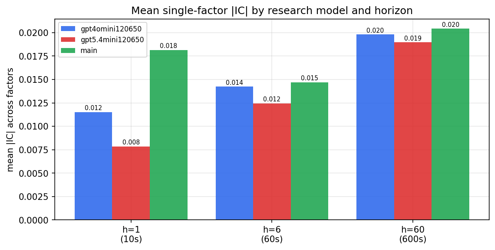

*Mean |IC| by research model and horizon*

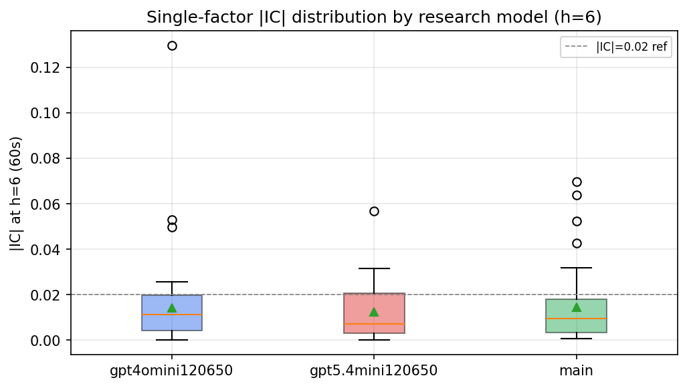

*Per-factor |IC| distribution by research model*

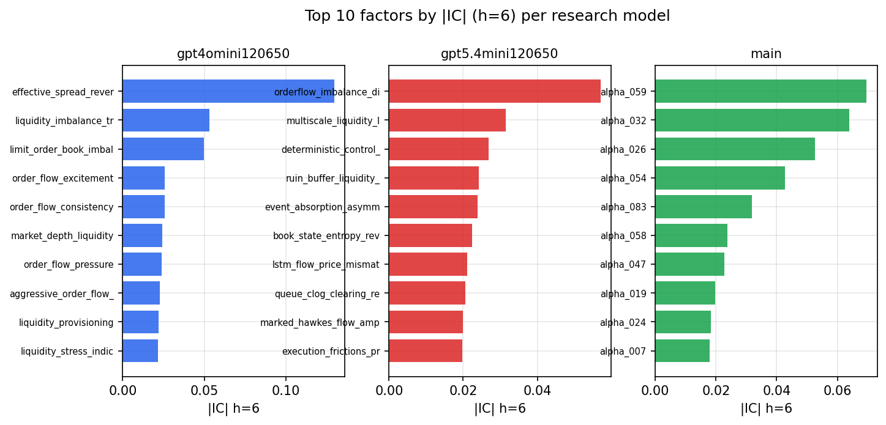

*Top factors by |IC| per research model*

## 2. Factor diversity & redundancy

Pairwise correlation of each zoo's *signals*. `eff_n_factors` is the effective number of independent factors (participation ratio of the correlation eigenvalues); `eff_ratio` and `redundancy` summarise how much unique information the zoo holds vs. how much is duplicated; `n_clusters` groups factors at |corr| ≥ 0.7.

| prerun | n_factors | eff_n_factors | eff_ratio | mean_abs_corr | n_clusters | redundancy |
| --- | --- | --- | --- | --- | --- | --- |
| gpt4omini120650 | 66 | 33.2909 | 0.5044 | 0.0452 | 56 | 0.4956 |
| gpt5.4mini120650 | 69 | 61.6936 | 0.8941 | 0.0061 | 68 | 0.1059 |
| main | 77 | 29.9384 | 0.3888 | 0.0475 | 54 | 0.6112 |

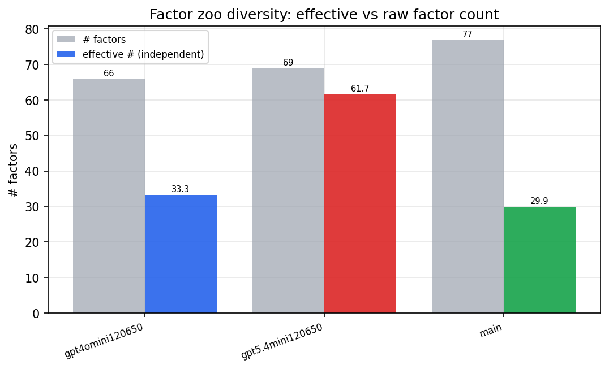

*Effective vs raw factor count per research model*

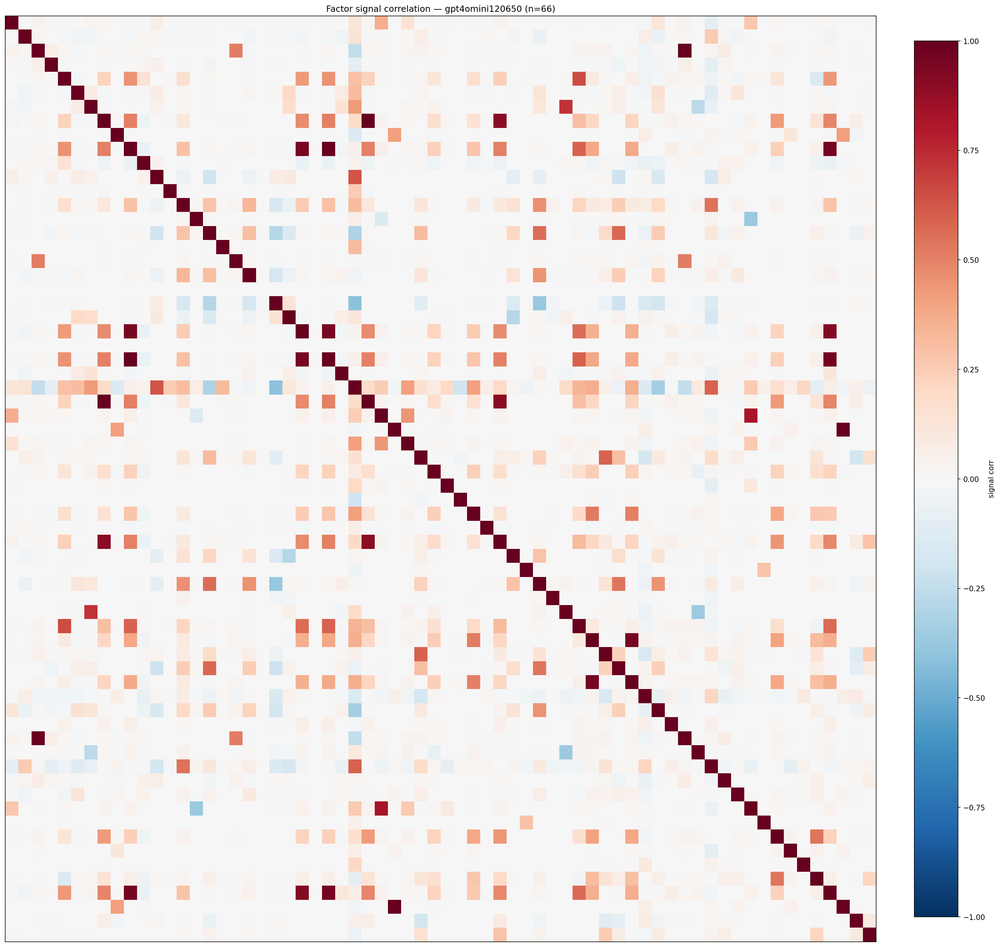

*Signal correlation matrix — gpt4omini120650*

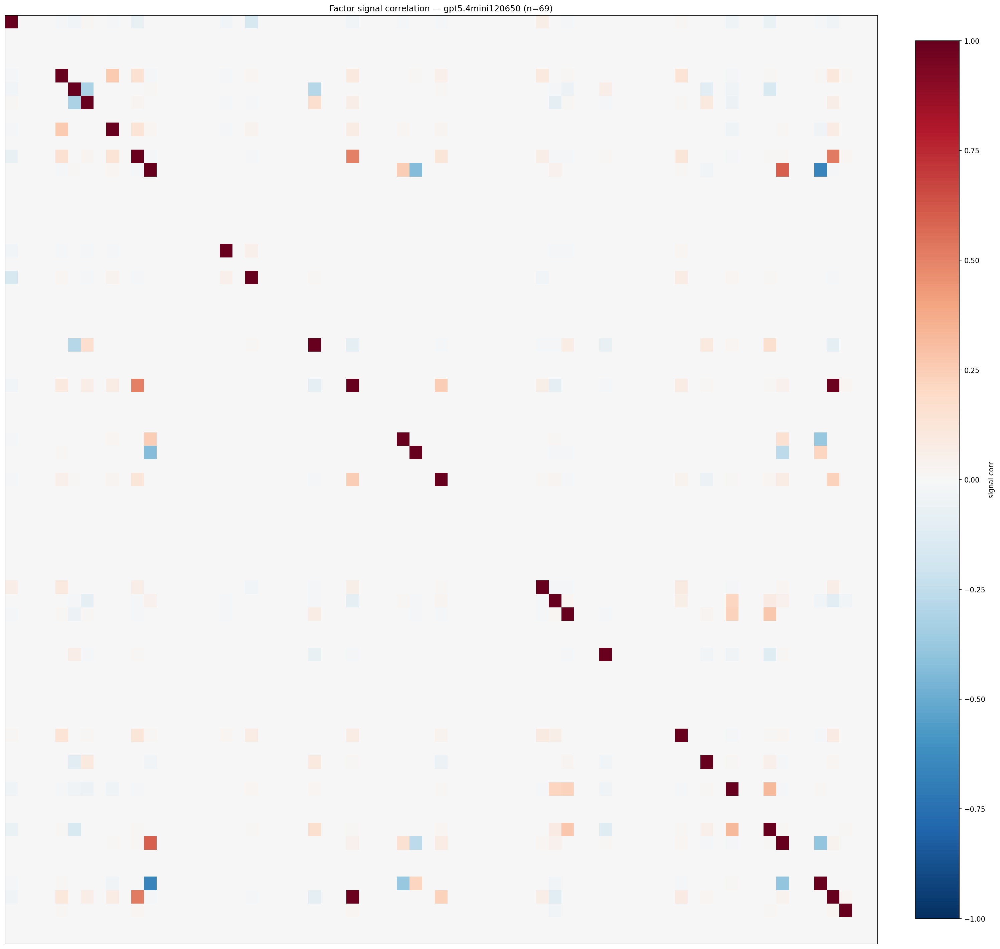

*Signal correlation matrix — gpt5.4mini120650*

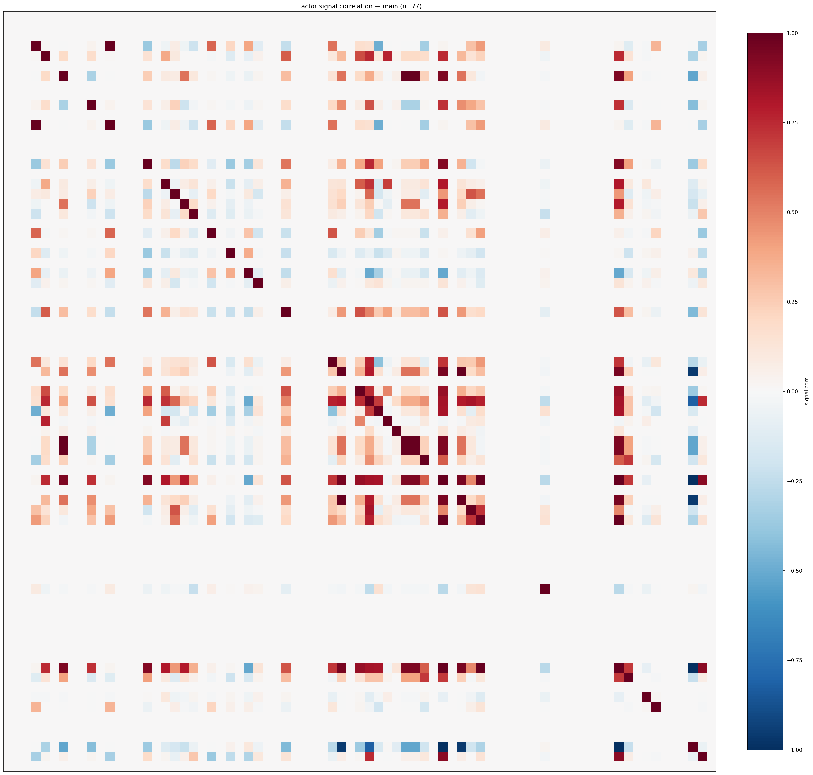

*Signal correlation matrix — main*

## 3. Deflation & model-based importance

`deflated_best_ic` haircuts each zoo's best |IC| for the number of factors tried (`ic_n_tested`) — a bigger zoo's best factor is more likely to be lucky. `lasso_n_nonzero` / `lasso_sparsity` show how many factors a sparse linear model actually keeps (model-view redundancy).

| prerun | best_ic | deflated_best_ic | deflated_best_t | ic_n_tested | ic_n_obs | lasso_n_nonzero | lasso_sparsity |
| --- | --- | --- | --- | --- | --- | --- | --- |
| gpt4omini120650 | 0.1296 | 0.1222 | 47.6758 | 64 | 152099 | 0 | 1.0 |
| gpt5.4mini120650 | 0.057 | 0.0503 | 19.6342 | 29 | 152099 | 0 | 1.0 |
| main | 0.0697 | 0.0628 | 24.4935 | 36 | 152099 | 4 | 0.9481 |

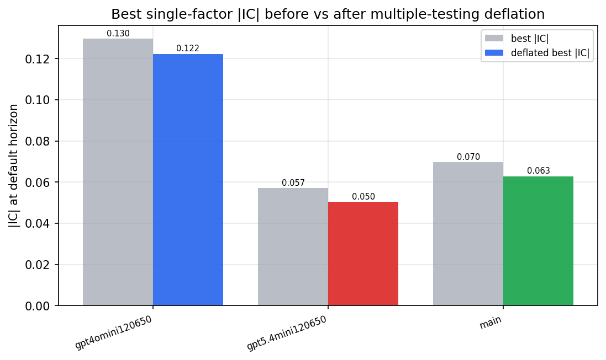

*Best |IC| before vs after multiple-testing deflation*

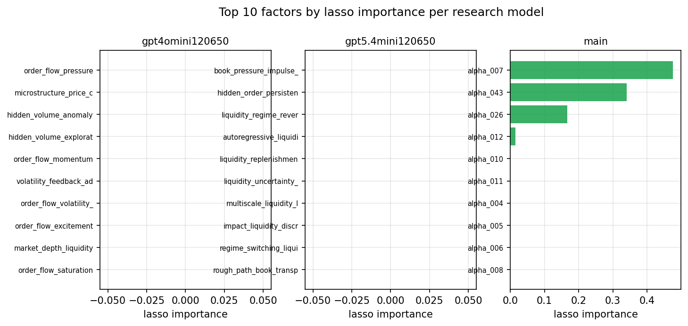

*Top factors by lasso importance per zoo*

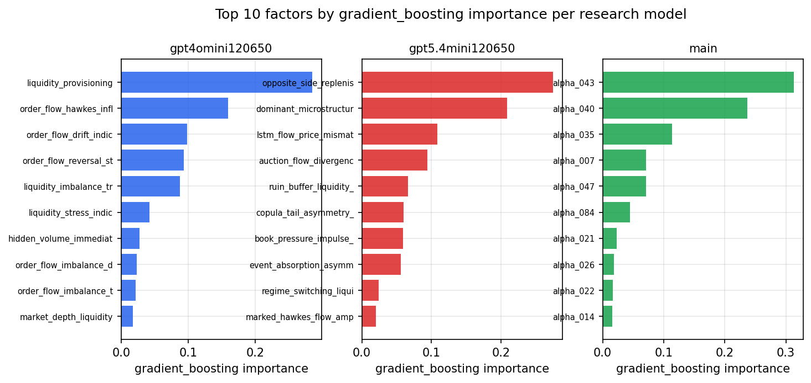

*Top factors by gradient_boosting importance per zoo*

## 4. ML-combined signal — per-underlying vectorised backtest

Each model combines a prerun's factors into ONE signal (fit `factors → forward return` on IS, predict per (bar, underlying)), then that combined signal is run through a simple vectorised backtest — `position(signal) × the underlying's own forward return` — on the held-out OOS tail (+ an equal-weight ensemble). No cross-sectional ranking.

> Config: position=**threshold** (t=1.0, z-score `expanding`), aggregation=**portfolio**, fit-standardise=**per_underlying**, horizon=6.

| prerun | model | n_factors_used | oos_ic | oos_sharpe | is_sharpe | oos_ann_return | oos_max_drawdown |
| --- | --- | --- | --- | --- | --- | --- | --- |
| gpt4omini120650 | linear_regression | 66 | 0.0477 | 6.2072 | 10.6641 | 0.0207 | -0.0007 |
| gpt4omini120650 | ridge | 66 | 0.0477 | 7.034 | 10.6514 | 0.0261 | -0.0006 |
| gpt4omini120650 | lasso | 66 | nan | nan | nan | nan | nan |
| gpt4omini120650 | elastic_net | 66 | nan | nan | nan | nan | nan |
| gpt4omini120650 | random_forest | 66 | 0.0638 | 4.6595 | 6.8795 | 0.0189 | -0.0005 |
| gpt4omini120650 | gradient_boosting | 66 | 0.0085 | -1.1148 | 5.2573 | -0.002 | -0.0009 |
| gpt4omini120650 | xgboost | 66 | 0.0712 | 2.6518 | 6.5256 | 0.0077 | -0.0006 |
| gpt4omini120650 | lightgbm | 66 | 0.0727 | 2.6219 | 10.415 | 0.0082 | -0.0004 |
| gpt4omini120650 | ensemble | 66 | 0.0468 | -2.0019 | 7.4533 | -0.0032 | -0.0006 |
| gpt5.4mini120650 | linear_regression | 69 | 0.0152 | 3.7599 | 3.9532 | 0.0121 | -0.0004 |
| gpt5.4mini120650 | ridge | 69 | 0.017 | 4.9418 | 3.6084 | 0.0155 | -0.0004 |
| gpt5.4mini120650 | lasso | 69 | nan | nan | nan | nan | nan |
| gpt5.4mini120650 | elastic_net | 69 | nan | nan | nan | nan | nan |
| gpt5.4mini120650 | random_forest | 69 | 0.0864 | 11.9675 | 9.9821 | 0.0522 | -0.0004 |
| gpt5.4mini120650 | gradient_boosting | 69 | 0.0666 | 2.5253 | 4.0016 | 0.0033 | -0.0002 |
| gpt5.4mini120650 | xgboost | 69 | 0.0835 | 3.1955 | 4.7764 | 0.0056 | -0.0003 |
| gpt5.4mini120650 | lightgbm | 69 | 0.0916 | 2.5733 | 8.4549 | 0.0057 | -0.0005 |
| gpt5.4mini120650 | ensemble | 69 | 0.0293 | -2.0736 | 3.7971 | -0.0034 | -0.0005 |
| main | linear_regression | 77 | -0.0013 | 4.0245 | 7.4789 | 0.0132 | -0.0006 |
| main | ridge | 77 | -0.0015 | 4.0093 | 7.2694 | 0.0137 | -0.0005 |
| main | lasso | 77 | nan | nan | nan | nan | nan |
| main | elastic_net | 77 | nan | nan | nan | nan | nan |
| main | random_forest | 77 | 0.0207 | 4.5329 | 7.2161 | 0.0173 | -0.0008 |
| main | gradient_boosting | 77 | 0.0156 | 5.8535 | 5.2147 | 0.0186 | -0.0005 |
| main | xgboost | 77 | 0.0142 | 2.723 | 6.9583 | 0.0074 | -0.0004 |
| main | lightgbm | 77 | 0.0204 | 5.3485 | 9.1301 | 0.0085 | -0.0003 |
| main | ensemble | 77 | 0.0057 | 6.2983 | 4.8425 | 0.0076 | -0.0001 |

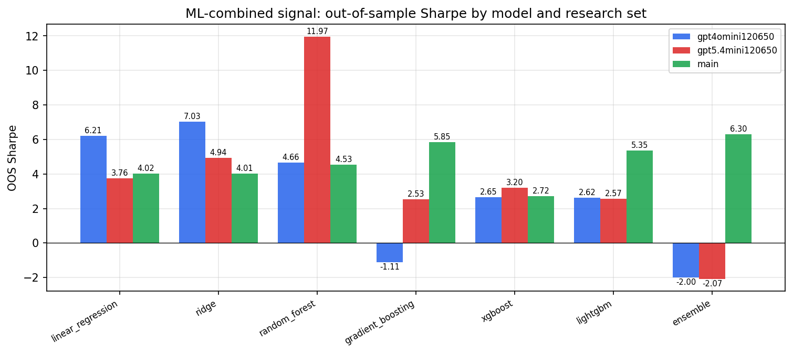

*ML-combined OOS Sharpe by model and research set*

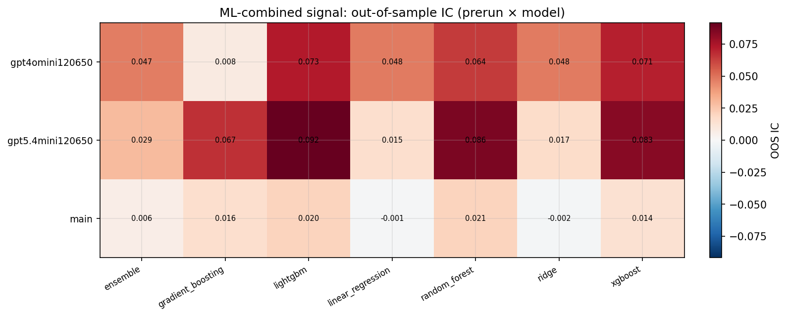

*ML-combined OOS IC (prerun × model)*

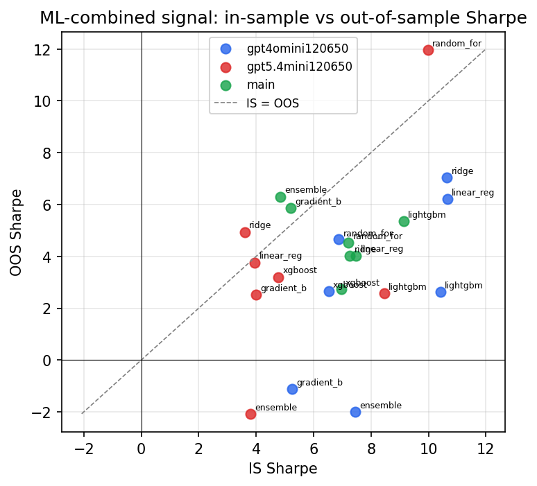

*IS vs OOS Sharpe (overfitting diagnostic)*

---
*Generated by `run_model_comparison.py`. Tables: `*.csv`; interactive: `comparison.ipynb`.*
