# Research-LLM factor comparison — `2025-11`

Comparing the **factor output of different research LLMs** on three axes (raw factor quality → factors as ML features → factors through the full agentic fund). The panel, IS/OOS split, horizon and model hyper-parameters are held identical across preruns — the *only* variable is the factor set.

## Preruns compared

| prerun | research_model | usable_factors | dropped_factors |
| --- | --- | --- | --- |
| gpt4omini120650 | gpt-4o-mini | 66 | 0 |
| gpt5.4mini120650 | gpt-5.4-mini | 69 | 0 |
| main | seed library | 77 | 11 |

> Dropped factors declare fields the current data doesn't have yet (e.g. fundamentals); they light up unchanged once that data is downloaded.

*Usable vs awaiting-data factors per research model*

## Key findings

- **Best ML-combined OOS Sharpe:** `gpt4omini120650` with `ridge` (OOS Sharpe = 21.890).
- **Mean OOS Sharpe across models, by research set:** `gpt4omini120650` = 10.933, `gpt5.4mini120650` = 7.231, `main` = 4.861.
- **Highest mean single-factor |IC| (h=6):** `gpt4omini120650` (mean |IC| = 0.0186).
- **Most diverse zoo (highest effective/raw factor ratio):** `gpt5.4mini120650` (eff 57.1 of 69, ratio 0.83).
- **Best selection-deflated single-factor |IC|:** `gpt4omini120650` (deflated |IC| = 0.2246 from 64 factors tried).

## 1. Single-factor IC (raw factor quality)

Per-underlying time-series Spearman rank-IC of every researched factor, recomputed on the shared panel at horizons h=1, h=6, h=60. The per-underlying IC correlates each factor's value vector with the underlying's own forward-return vector (pooled across underlyings); the cross-sectional IC ranks across underlyings per timestamp.

| prerun | n_factors | mean_abs_ic_1 | mean_abs_ic_6 | mean_abs_ic_60 | mean_abs_icir_6 | best_factor_h6 | best_abs_ic_h6 |
| --- | --- | --- | --- | --- | --- | --- | --- |
| gpt4omini120650 | 66 | 0.0115 | 0.0186 | 0.0206 | 0.631 | effective_spread_reversal_strength | 0.2321 |
| gpt5.4mini120650 | 69 | 0.0075 | 0.012 | 0.0148 | 0.6142 | orderflow_imbalance_divergence | 0.0609 |
| main | 77 | 0.0189 | 0.0136 | 0.0199 | 0.285 | alpha_032 | 0.0632 |

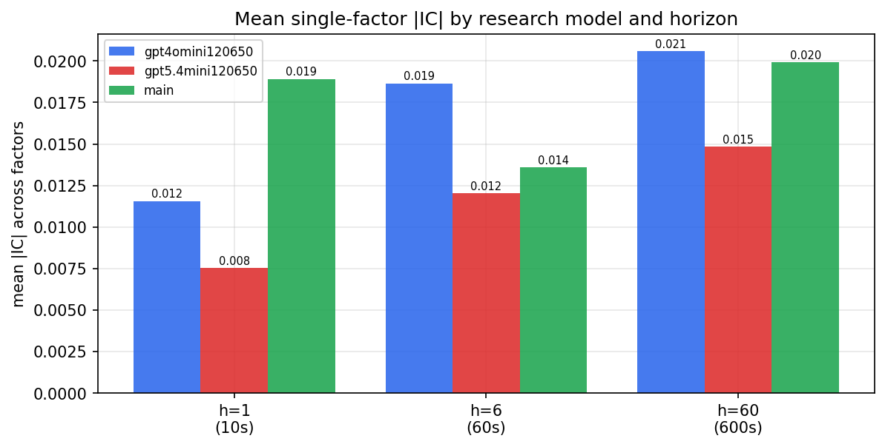

*Mean |IC| by research model and horizon*

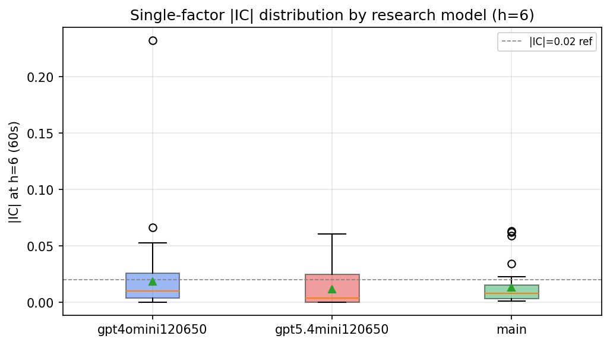

*Per-factor |IC| distribution by research model*

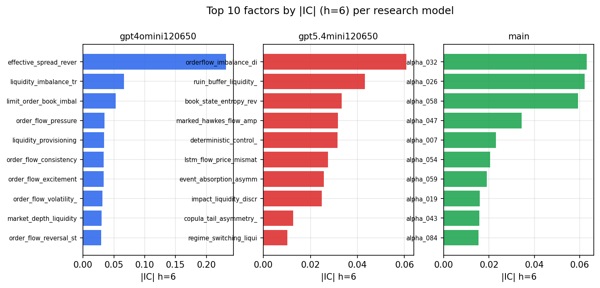

*Top factors by |IC| per research model*

## 2. Factor diversity & redundancy

Pairwise correlation of each zoo's *signals*. `eff_n_factors` is the effective number of independent factors (participation ratio of the correlation eigenvalues); `eff_ratio` and `redundancy` summarise how much unique information the zoo holds vs. how much is duplicated; `n_clusters` groups factors at |corr| ≥ 0.7.

| prerun | n_factors | eff_n_factors | eff_ratio | mean_abs_corr | n_clusters | redundancy |
| --- | --- | --- | --- | --- | --- | --- |
| gpt4omini120650 | 66 | 32.972 | 0.4996 | 0.0447 | 55 | 0.5004 |
| gpt5.4mini120650 | 69 | 57.1081 | 0.8277 | 0.0082 | 65 | 0.1723 |
| main | 77 | 30.5832 | 0.3972 | 0.0474 | 56 | 0.6028 |

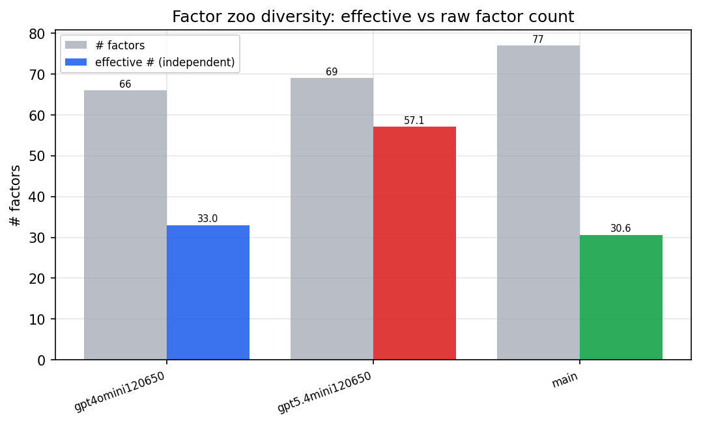

*Effective vs raw factor count per research model*

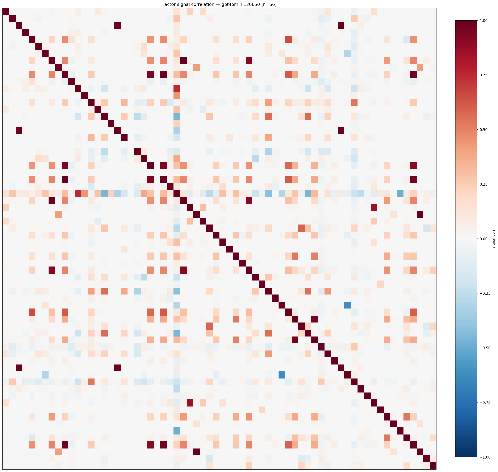

*Signal correlation matrix — gpt4omini120650*

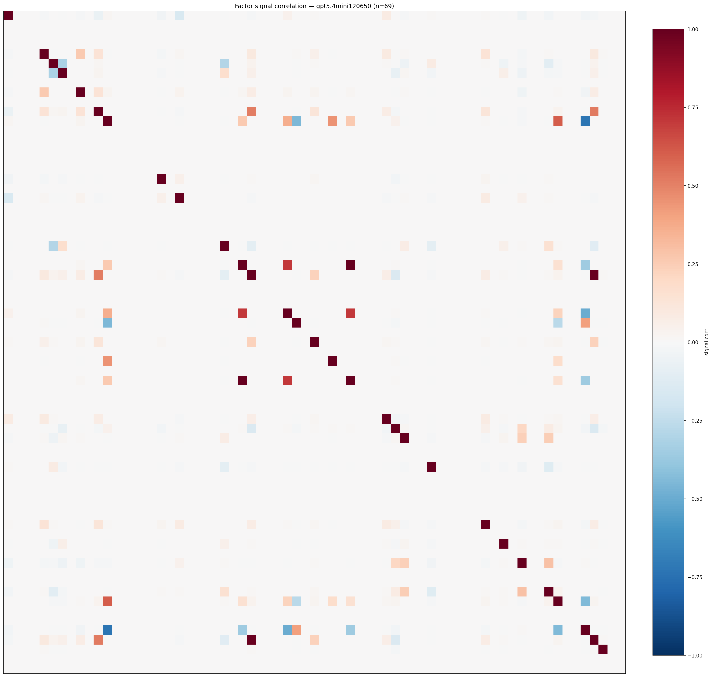

*Signal correlation matrix — gpt5.4mini120650*

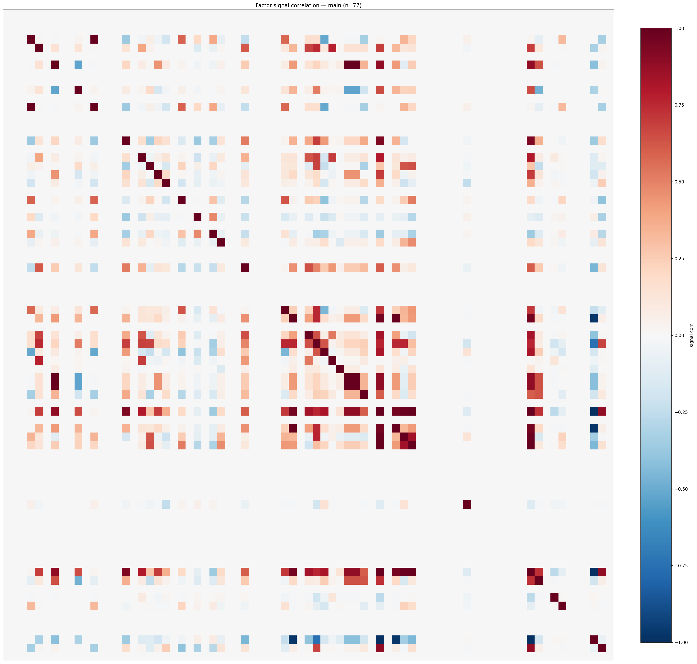

*Signal correlation matrix — main*

## 3. Deflation & model-based importance

`deflated_best_ic` haircuts each zoo's best |IC| for the number of factors tried (`ic_n_tested`) — a bigger zoo's best factor is more likely to be lucky. `lasso_n_nonzero` / `lasso_sparsity` show how many factors a sparse linear model actually keeps (model-view redundancy).

| prerun | best_ic | deflated_best_ic | deflated_best_t | ic_n_tested | ic_n_obs | lasso_n_nonzero | lasso_sparsity |
| --- | --- | --- | --- | --- | --- | --- | --- |
| gpt4omini120650 | 0.2321 | 0.2246 | 85.9208 | 64 | 146339 | 0 | 1.0 |
| gpt5.4mini120650 | 0.0609 | 0.0541 | 20.6843 | 29 | 146339 | 0 | 1.0 |
| main | 0.0632 | 0.0562 | 21.4832 | 36 | 146339 | 0 | 1.0 |

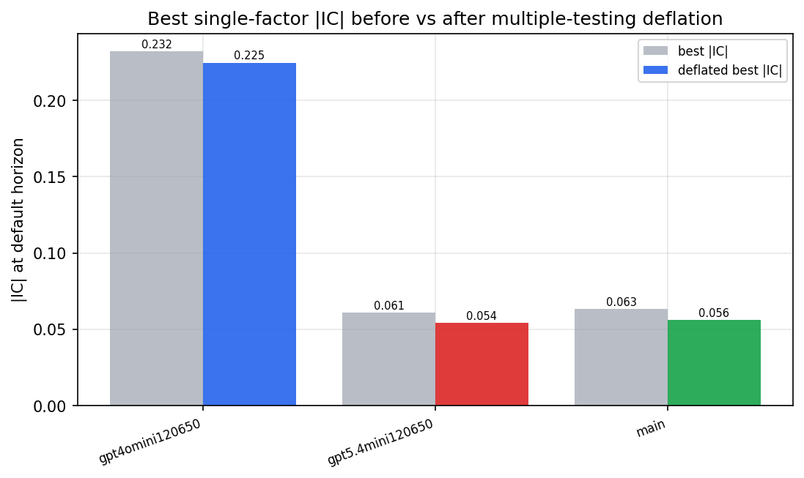

*Best |IC| before vs after multiple-testing deflation*

*Top factors by lasso importance per zoo*

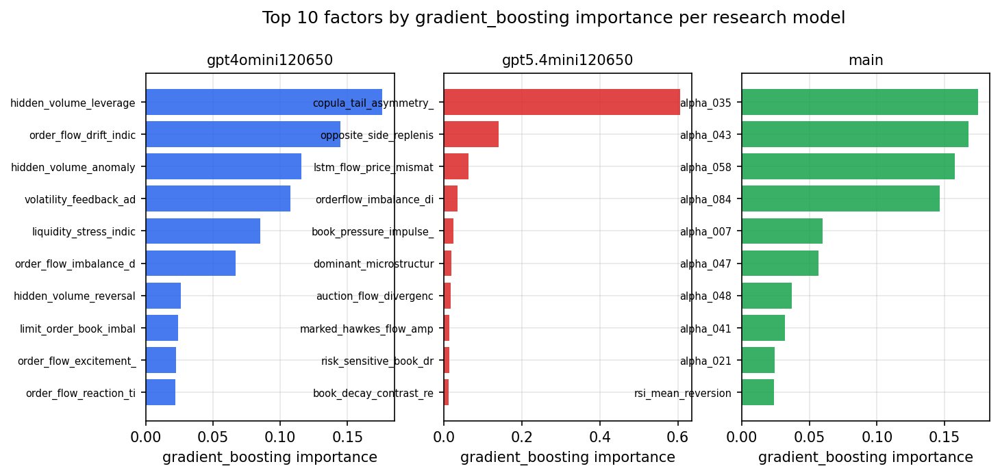

*Top factors by gradient_boosting importance per zoo*

## 4. ML-combined signal — per-underlying vectorised backtest

Each model combines a prerun's factors into ONE signal (fit `factors → forward return` on IS, predict per (bar, underlying)), then that combined signal is run through a simple vectorised backtest — `position(signal) × the underlying's own forward return` — on the held-out OOS tail (+ an equal-weight ensemble). No cross-sectional ranking.

> Config: position=**threshold** (t=1.0, z-score `expanding`), aggregation=**portfolio**, fit-standardise=**per_underlying**, horizon=6.

| prerun | model | n_factors_used | oos_ic | oos_sharpe | is_sharpe | oos_ann_return | oos_max_drawdown |
| --- | --- | --- | --- | --- | --- | --- | --- |
| gpt4omini120650 | linear_regression | 66 | 0.0846 | 21.1436 | 15.7047 | 0.0773 | -0.0004 |
| gpt4omini120650 | ridge | 66 | 0.0856 | 21.8901 | 15.7805 | 0.0805 | -0.0004 |
| gpt4omini120650 | lasso | 66 | nan | nan | nan | nan | nan |
| gpt4omini120650 | elastic_net | 66 | nan | nan | nan | nan | nan |
| gpt4omini120650 | random_forest | 66 | 0.1164 | 10.3682 | 7.6634 | 0.0595 | -0.0003 |
| gpt4omini120650 | gradient_boosting | 66 | 0.0867 | 5.129 | 5.8469 | 0.0049 | -0.0001 |
| gpt4omini120650 | xgboost | 66 | 0.1057 | 4.8801 | 7.1567 | 0.0148 | -0.0003 |
| gpt4omini120650 | lightgbm | 66 | 0.1051 | 0.4707 | 11.4435 | 0.0019 | -0.0011 |
| gpt4omini120650 | ensemble | 66 | 0.0819 | 12.6466 | 10.5683 | 0.0516 | -0.0003 |
| gpt5.4mini120650 | linear_regression | 69 | 0.019 | 9.5814 | 7.5363 | 0.0346 | -0.0002 |
| gpt5.4mini120650 | ridge | 69 | 0.0211 | 10.458 | 7.2659 | 0.039 | -0.0002 |
| gpt5.4mini120650 | lasso | 69 | 0.0445 | 5.8682 | 4.1396 | 0.0126 | -0.0 |
| gpt5.4mini120650 | elastic_net | 69 | 0.0445 | 5.8682 | 4.1396 | 0.0126 | -0.0 |
| gpt5.4mini120650 | random_forest | 69 | 0.1042 | 10.8395 | 9.0756 | 0.0384 | -0.0005 |
| gpt5.4mini120650 | gradient_boosting | 69 | 0.0863 | 3.7283 | 5.2475 | 0.0066 | -0.0002 |
| gpt5.4mini120650 | xgboost | 69 | 0.1124 | 0.6029 | 6.6616 | 0.0012 | -0.0004 |
| gpt5.4mini120650 | lightgbm | 69 | 0.1265 | 7.9334 | 9.3109 | 0.0294 | -0.0002 |
| gpt5.4mini120650 | ensemble | 69 | 0.0913 | 10.1999 | 7.8566 | 0.0283 | -0.0002 |
| main | linear_regression | 77 | 0.0069 | 7.1836 | 7.2724 | 0.0308 | -0.0003 |
| main | ridge | 77 | 0.0051 | 6.2131 | 7.8374 | 0.0275 | -0.0006 |
| main | lasso | 77 | nan | nan | nan | nan | nan |
| main | elastic_net | 77 | nan | nan | nan | nan | nan |
| main | random_forest | 77 | 0.0096 | 6.4458 | 10.2946 | 0.0302 | -0.0003 |
| main | gradient_boosting | 77 | 0.0108 | 4.5135 | 8.4135 | 0.0178 | -0.0006 |
| main | xgboost | 77 | -0.0074 | 0.6185 | 8.0764 | 0.0017 | -0.0009 |
| main | lightgbm | 77 | 0.0187 | 2.204 | 10.8227 | 0.0078 | -0.0006 |
| main | ensemble | 77 | -0.0035 | 6.8489 | 9.689 | 0.0251 | -0.0003 |

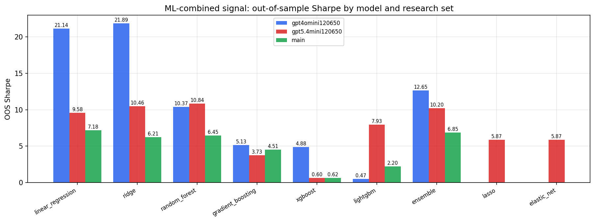

*ML-combined OOS Sharpe by model and research set*

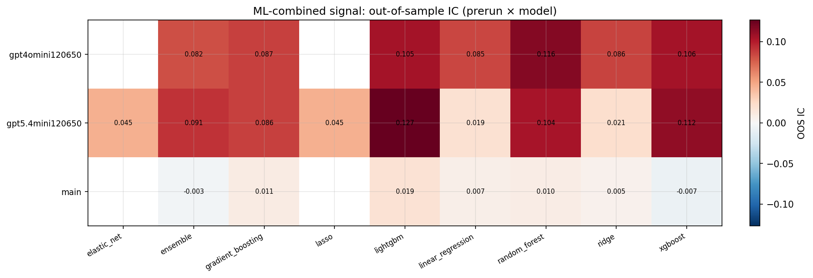

*ML-combined OOS IC (prerun × model)*

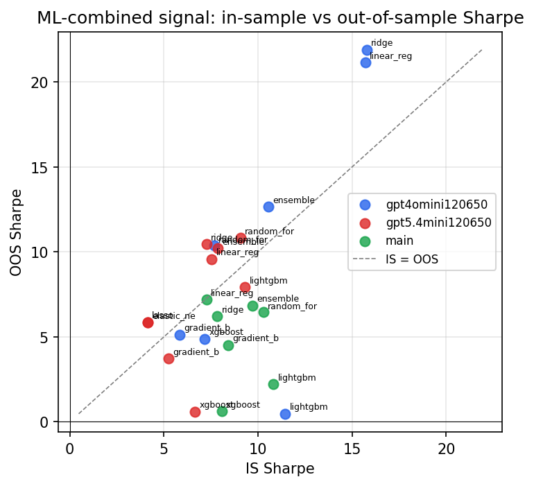

*IS vs OOS Sharpe (overfitting diagnostic)*

---
*Generated by `run_model_comparison.py`. Tables: `*.csv`; interactive: `comparison.ipynb`.*
