# Research-LLM factor comparison — `2025-12`

Comparing the **factor output of different research LLMs** on three axes (raw factor quality → factors as ML features → factors through the full agentic fund). The panel, IS/OOS split, horizon and model hyper-parameters are held identical across preruns — the *only* variable is the factor set.

## Preruns compared

| prerun | research_model | usable_factors | dropped_factors |
| --- | --- | --- | --- |
| gpt4omini120650 | gpt-4o-mini | 66 | 0 |
| gpt5.4mini120650 | gpt-5.4-mini | 69 | 0 |
| main | seed library | 77 | 11 |

> Dropped factors declare fields the current data doesn't have yet (e.g. fundamentals); they light up unchanged once that data is downloaded.

*Usable vs awaiting-data factors per research model*

## Key findings

- **Best ML-combined OOS Sharpe:** `gpt4omini120650` with `linear_regression` (OOS Sharpe = 11.980).
- **Mean OOS Sharpe across models, by research set:** `gpt4omini120650` = 4.707, `gpt5.4mini120650` = 4.220, `main` = 3.636.
- **Highest mean single-factor |IC| (h=6):** `gpt4omini120650` (mean |IC| = 0.0180).
- **Most diverse zoo (highest effective/raw factor ratio):** `gpt5.4mini120650` (eff 57.0 of 69, ratio 0.83).
- **Best selection-deflated single-factor |IC|:** `gpt4omini120650` (deflated |IC| = 0.0728 from 64 factors tried).

## 1. Single-factor IC (raw factor quality)

Per-underlying time-series Spearman rank-IC of every researched factor, recomputed on the shared panel at horizons h=1, h=6, h=60. The per-underlying IC correlates each factor's value vector with the underlying's own forward-return vector (pooled across underlyings); the cross-sectional IC ranks across underlyings per timestamp.

| prerun | n_factors | mean_abs_ic_1 | mean_abs_ic_6 | mean_abs_ic_60 | mean_abs_icir_6 | best_factor_h6 | best_abs_ic_h6 |
| --- | --- | --- | --- | --- | --- | --- | --- |
| gpt4omini120650 | 66 | 0.0112 | 0.018 | 0.0193 | 0.6493 | effective_spread_reversal_strength | 0.0803 |
| gpt5.4mini120650 | 69 | 0.0089 | 0.0129 | 0.0137 | 0.5519 | orderflow_imbalance_divergence | 0.0562 |
| main | 77 | 0.0153 | 0.0124 | 0.0202 | 0.2155 | alpha_058 | 0.0561 |

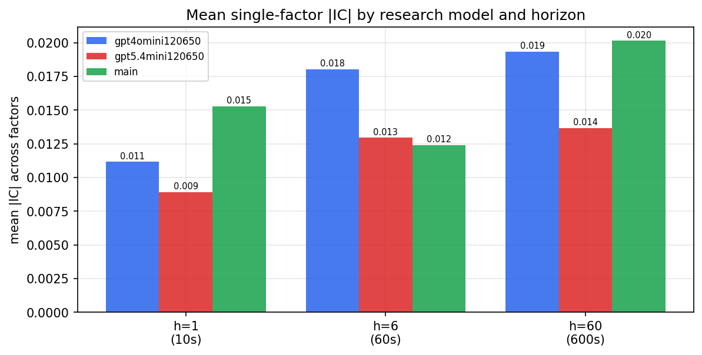

*Mean |IC| by research model and horizon*

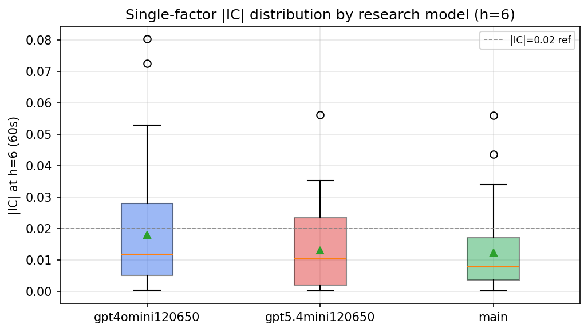

*Per-factor |IC| distribution by research model*

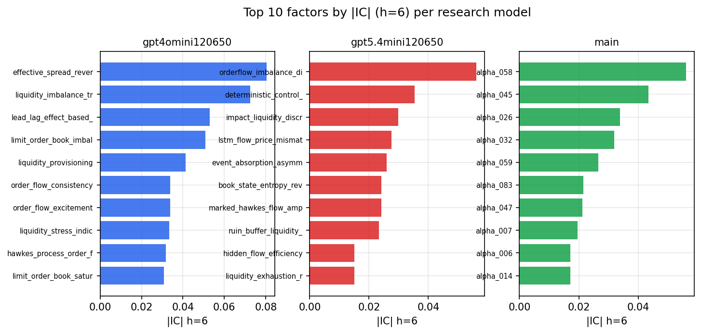

*Top factors by |IC| per research model*

## 2. Factor diversity & redundancy

Pairwise correlation of each zoo's *signals*. `eff_n_factors` is the effective number of independent factors (participation ratio of the correlation eigenvalues); `eff_ratio` and `redundancy` summarise how much unique information the zoo holds vs. how much is duplicated; `n_clusters` groups factors at |corr| ≥ 0.7.

| prerun | n_factors | eff_n_factors | eff_ratio | mean_abs_corr | n_clusters | redundancy |
| --- | --- | --- | --- | --- | --- | --- |
| gpt4omini120650 | 66 | 33.4588 | 0.507 | 0.0436 | 56 | 0.493 |
| gpt5.4mini120650 | 69 | 56.9977 | 0.8261 | 0.0085 | 65 | 0.1739 |
| main | 77 | 30.8807 | 0.401 | 0.0473 | 56 | 0.599 |

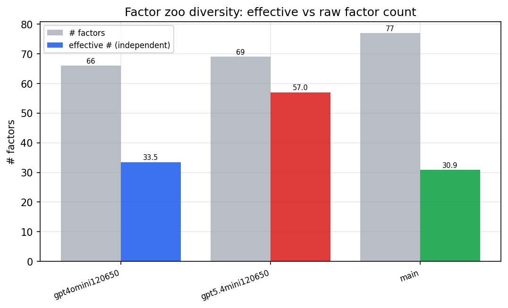

*Effective vs raw factor count per research model*

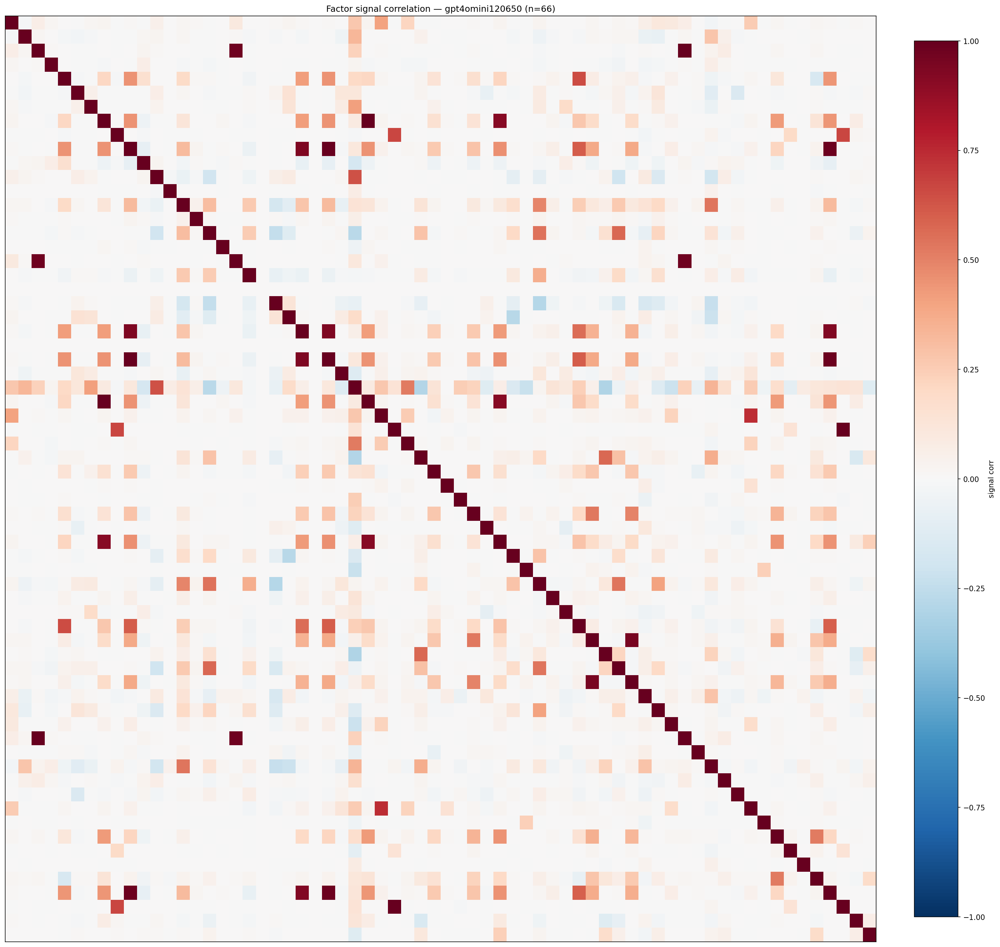

*Signal correlation matrix — gpt4omini120650*

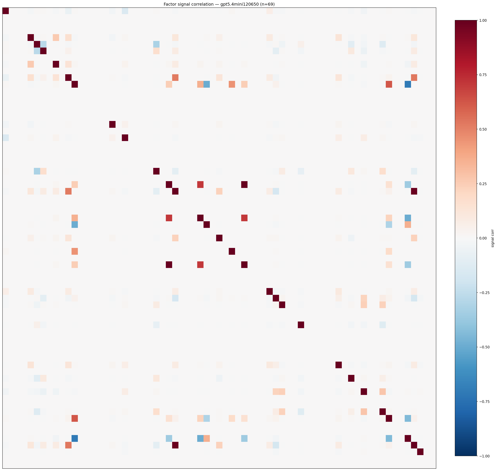

*Signal correlation matrix — gpt5.4mini120650*

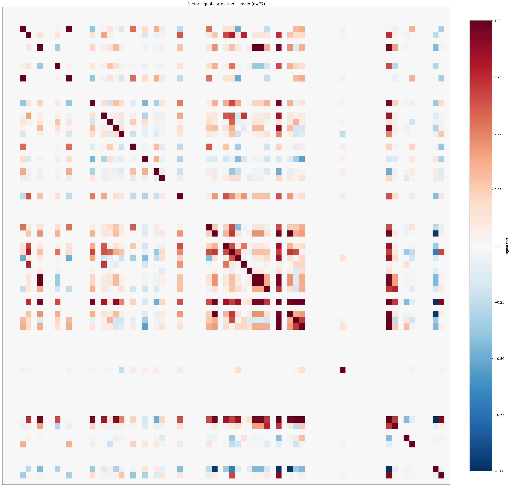

*Signal correlation matrix — main*

## 3. Deflation & model-based importance

`deflated_best_ic` haircuts each zoo's best |IC| for the number of factors tried (`ic_n_tested`) — a bigger zoo's best factor is more likely to be lucky. `lasso_n_nonzero` / `lasso_sparsity` show how many factors a sparse linear model actually keeps (model-view redundancy).

| prerun | best_ic | deflated_best_ic | deflated_best_t | ic_n_tested | ic_n_obs | lasso_n_nonzero | lasso_sparsity |
| --- | --- | --- | --- | --- | --- | --- | --- |
| gpt4omini120650 | 0.0803 | 0.0728 | 27.9832 | 64 | 147599 | 5 | 0.9242 |
| gpt5.4mini120650 | 0.0562 | 0.0494 | 18.9772 | 29 | 147599 | 0 | 1.0 |
| main | 0.0561 | 0.0491 | 18.8602 | 36 | 147599 | 0 | 1.0 |

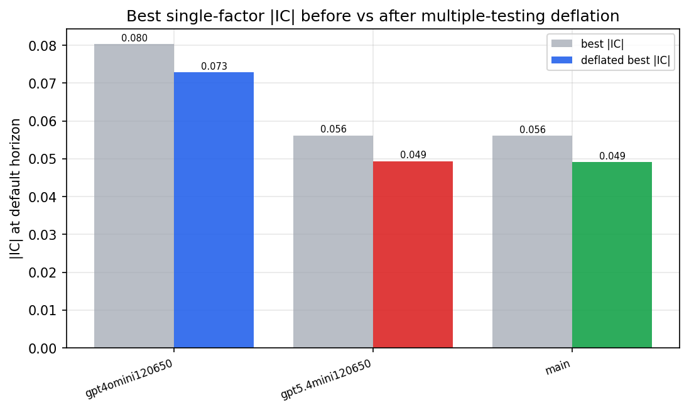

*Best |IC| before vs after multiple-testing deflation*

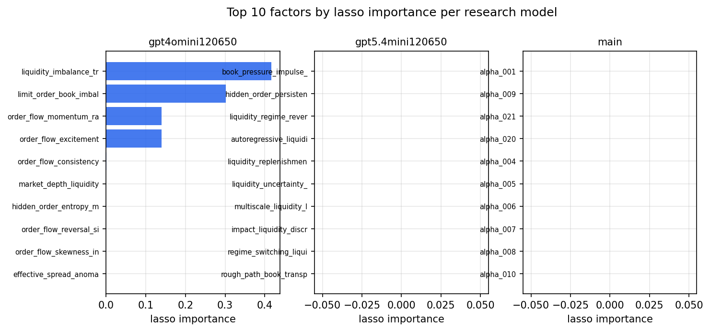

*Top factors by lasso importance per zoo*

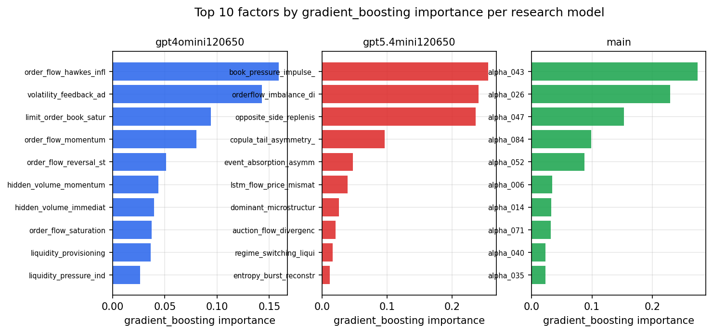

*Top factors by gradient_boosting importance per zoo*

## 4. ML-combined signal — per-underlying vectorised backtest

Each model combines a prerun's factors into ONE signal (fit `factors → forward return` on IS, predict per (bar, underlying)), then that combined signal is run through a simple vectorised backtest — `position(signal) × the underlying's own forward return` — on the held-out OOS tail (+ an equal-weight ensemble). No cross-sectional ranking.

> Config: position=**threshold** (t=1.0, z-score `expanding`), aggregation=**portfolio**, fit-standardise=**per_underlying**, horizon=6.

| prerun | model | n_factors_used | oos_ic | oos_sharpe | is_sharpe | oos_ann_return | oos_max_drawdown |
| --- | --- | --- | --- | --- | --- | --- | --- |
| gpt4omini120650 | linear_regression | 66 | 0.069 | 11.9804 | 8.7981 | 0.0277 | -0.0003 |
| gpt4omini120650 | ridge | 66 | 0.0681 | 11.437 | 8.9439 | 0.026 | -0.0003 |
| gpt4omini120650 | lasso | 66 | nan | nan | nan | nan | nan |
| gpt4omini120650 | elastic_net | 66 | nan | nan | nan | nan | nan |
| gpt4omini120650 | random_forest | 66 | 0.0882 | 1.1118 | 6.7952 | 0.0034 | -0.0007 |
| gpt4omini120650 | gradient_boosting | 66 | 0.0231 | 1.4642 | 5.6404 | 0.0007 | -0.0001 |
| gpt4omini120650 | xgboost | 66 | 0.0808 | 0.3058 | 7.5466 | 0.0005 | -0.0005 |
| gpt4omini120650 | lightgbm | 66 | 0.0915 | 2.9515 | 9.2777 | 0.008 | -0.0005 |
| gpt4omini120650 | ensemble | 66 | 0.08 | 3.696 | 9.2861 | 0.0112 | -0.0006 |
| gpt5.4mini120650 | linear_regression | 69 | 0.0242 | 6.2767 | 6.9187 | 0.025 | -0.0006 |
| gpt5.4mini120650 | ridge | 69 | 0.0254 | 6.535 | 8.2001 | 0.0282 | -0.0006 |
| gpt5.4mini120650 | lasso | 69 | nan | nan | nan | nan | nan |
| gpt5.4mini120650 | elastic_net | 69 | nan | nan | nan | nan | nan |
| gpt5.4mini120650 | random_forest | 69 | 0.0933 | 10.4863 | 9.4647 | 0.0391 | -0.0006 |
| gpt5.4mini120650 | gradient_boosting | 69 | 0.0557 | -4.9293 | 4.5299 | -0.0021 | -0.0002 |
| gpt5.4mini120650 | xgboost | 69 | 0.0877 | -3.5316 | 7.5115 | -0.0046 | -0.0005 |
| gpt5.4mini120650 | lightgbm | 69 | 0.1055 | 7.4081 | 9.072 | 0.0117 | -0.0003 |
| gpt5.4mini120650 | ensemble | 69 | 0.0621 | 7.2946 | 9.8511 | 0.0252 | -0.0006 |
| main | linear_regression | 77 | 0.0027 | 3.164 | 3.1705 | 0.0261 | -0.001 |
| main | ridge | 77 | 0.0058 | 3.5365 | 3.1592 | 0.0357 | -0.0012 |
| main | lasso | 77 | nan | nan | nan | nan | nan |
| main | elastic_net | 77 | nan | nan | nan | nan | nan |
| main | random_forest | 77 | 0.0164 | 2.893 | 6.0897 | 0.0101 | -0.001 |
| main | gradient_boosting | 77 | 0.0129 | 5.0344 | 6.2907 | 0.0088 | -0.0002 |
| main | xgboost | 77 | 0.0153 | 3.5385 | 6.8361 | 0.0086 | -0.0003 |
| main | lightgbm | 77 | 0.0272 | 3.0995 | 8.4828 | 0.0078 | -0.0005 |
| main | ensemble | 77 | 0.0094 | 4.1865 | 7.4749 | 0.017 | -0.0006 |

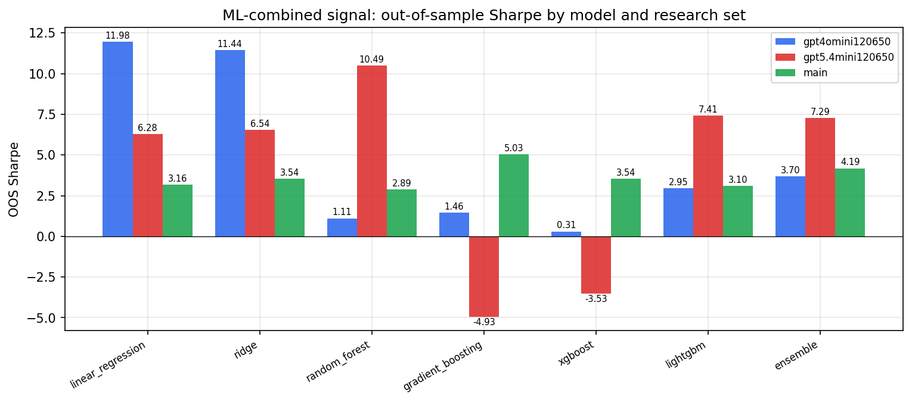

*ML-combined OOS Sharpe by model and research set*

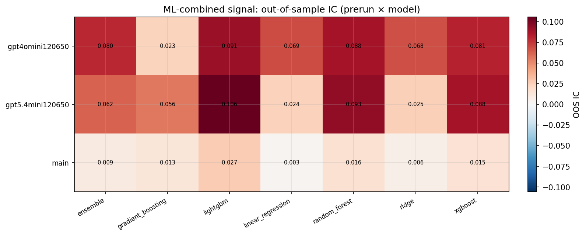

*ML-combined OOS IC (prerun × model)*

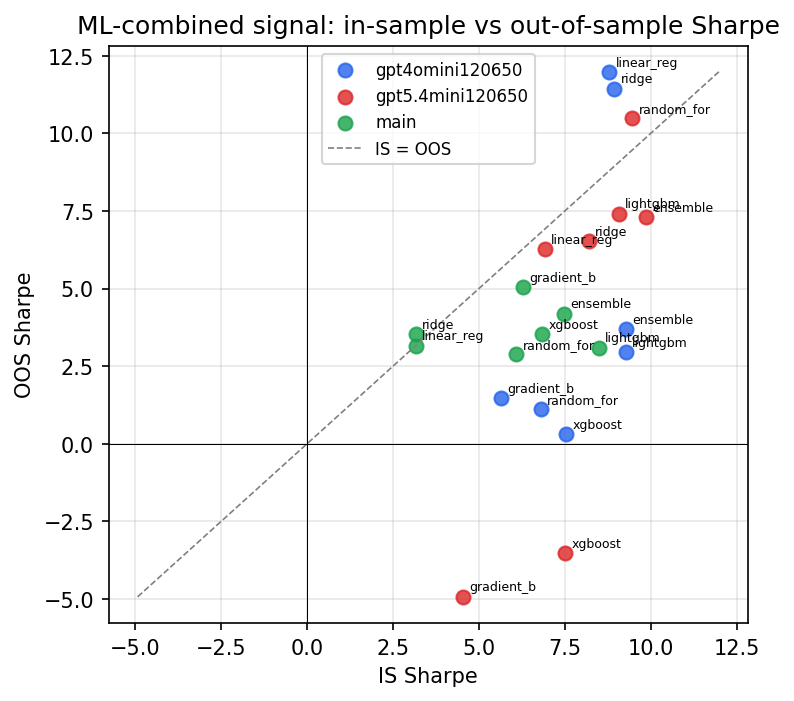

*IS vs OOS Sharpe (overfitting diagnostic)*

---
*Generated by `run_model_comparison.py`. Tables: `*.csv`; interactive: `comparison.ipynb`.*
