# Research-LLM factor comparison — `2026-01`

Comparing the **factor output of different research LLMs** on three axes (raw factor quality → factors as ML features → factors through the full agentic fund). The panel, IS/OOS split, horizon and model hyper-parameters are held identical across preruns — the *only* variable is the factor set.

## Preruns compared

| prerun | research_model | usable_factors | dropped_factors |
| --- | --- | --- | --- |
| gpt4omini120650 | gpt-4o-mini | 66 | 0 |
| gpt5.4mini120650 | gpt-5.4-mini | 69 | 0 |
| main | seed library | 77 | 11 |

> Dropped factors declare fields the current data doesn't have yet (e.g. fundamentals); they light up unchanged once that data is downloaded.

*Usable vs awaiting-data factors per research model*

## Key findings

- **Best ML-combined OOS Sharpe:** `gpt4omini120650` with `ensemble` (OOS Sharpe = 11.235).
- **Mean OOS Sharpe across models, by research set:** `gpt5.4mini120650` = 8.976, `gpt4omini120650` = 6.524, `main` = -0.040.
- **Highest mean single-factor |IC| (h=6):** `gpt4omini120650` (mean |IC| = 0.0196).
- **Most diverse zoo (highest effective/raw factor ratio):** `gpt5.4mini120650` (eff 56.8 of 69, ratio 0.82).
- **Best selection-deflated single-factor |IC|:** `gpt4omini120650` (deflated |IC| = 0.0764 from 64 factors tried).

## 1. Single-factor IC (raw factor quality)

Per-underlying time-series Spearman rank-IC of every researched factor, recomputed on the shared panel at horizons h=1, h=6, h=60. The per-underlying IC correlates each factor's value vector with the underlying's own forward-return vector (pooled across underlyings); the cross-sectional IC ranks across underlyings per timestamp.

| prerun | n_factors | mean_abs_ic_1 | mean_abs_ic_6 | mean_abs_ic_60 | mean_abs_icir_6 | best_factor_h6 | best_abs_ic_h6 |
| --- | --- | --- | --- | --- | --- | --- | --- |
| gpt4omini120650 | 66 | 0.0133 | 0.0196 | 0.0186 | 0.7523 | liquidity_imbalance_trend | 0.0841 |
| gpt5.4mini120650 | 69 | 0.0065 | 0.01 | 0.0124 | 0.5267 | orderflow_imbalance_divergence | 0.0492 |
| main | 77 | 0.0147 | 0.0077 | 0.018 | 0.1707 | alpha_045 | 0.03 |

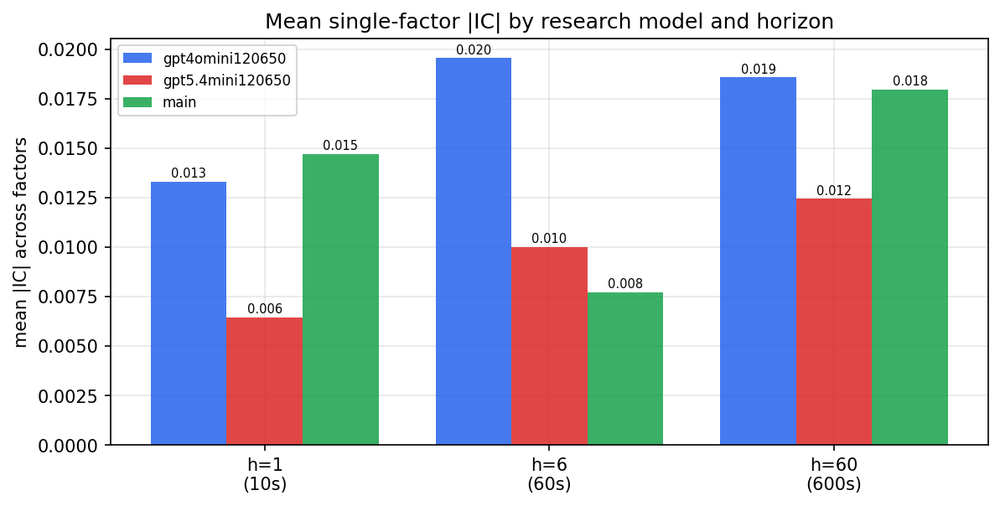

*Mean |IC| by research model and horizon*

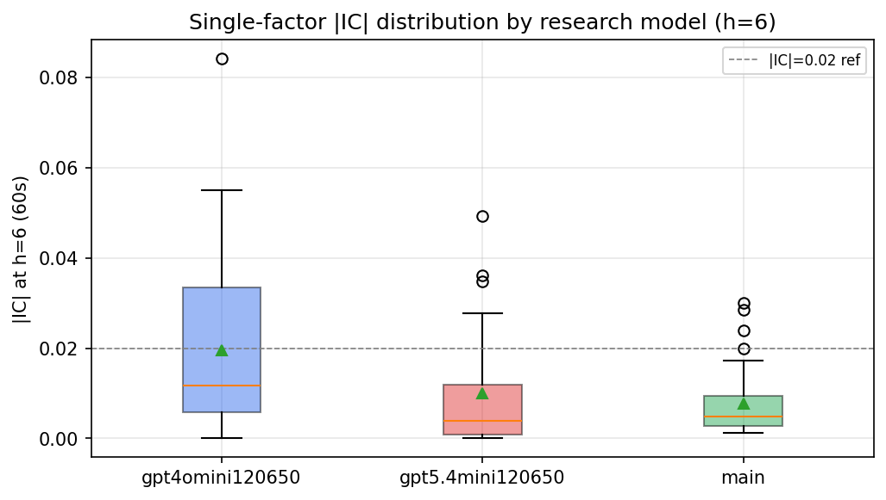

*Per-factor |IC| distribution by research model*

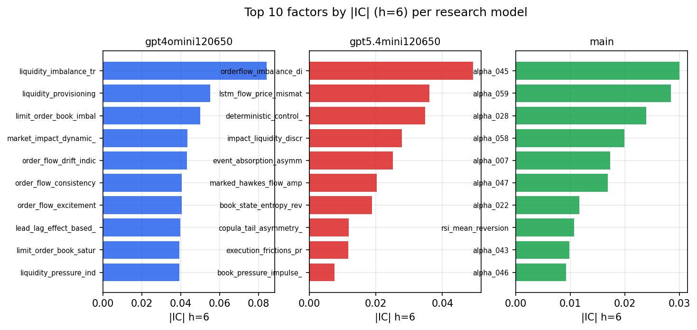

*Top factors by |IC| per research model*

## 2. Factor diversity & redundancy

Pairwise correlation of each zoo's *signals*. `eff_n_factors` is the effective number of independent factors (participation ratio of the correlation eigenvalues); `eff_ratio` and `redundancy` summarise how much unique information the zoo holds vs. how much is duplicated; `n_clusters` groups factors at |corr| ≥ 0.7.

| prerun | n_factors | eff_n_factors | eff_ratio | mean_abs_corr | n_clusters | redundancy |
| --- | --- | --- | --- | --- | --- | --- |
| gpt4omini120650 | 66 | 33.4223 | 0.5064 | 0.0438 | 55 | 0.4936 |
| gpt5.4mini120650 | 69 | 56.757 | 0.8226 | 0.0085 | 65 | 0.1774 |
| main | 77 | 29.0842 | 0.3777 | 0.0501 | 56 | 0.6223 |

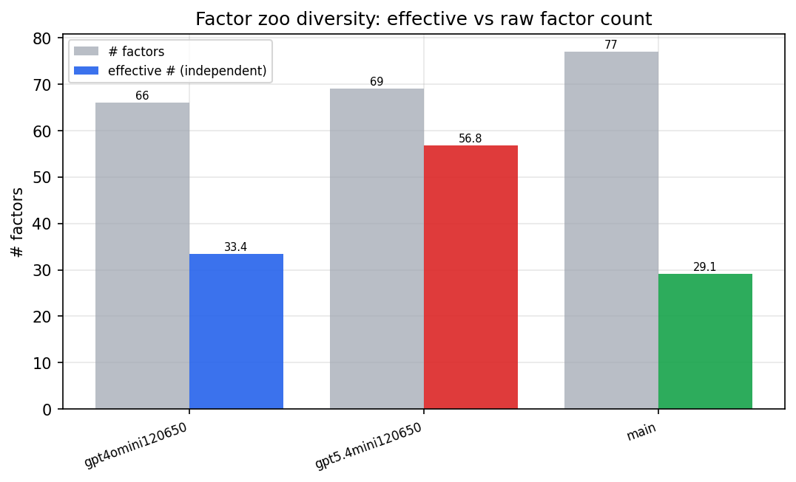

*Effective vs raw factor count per research model*

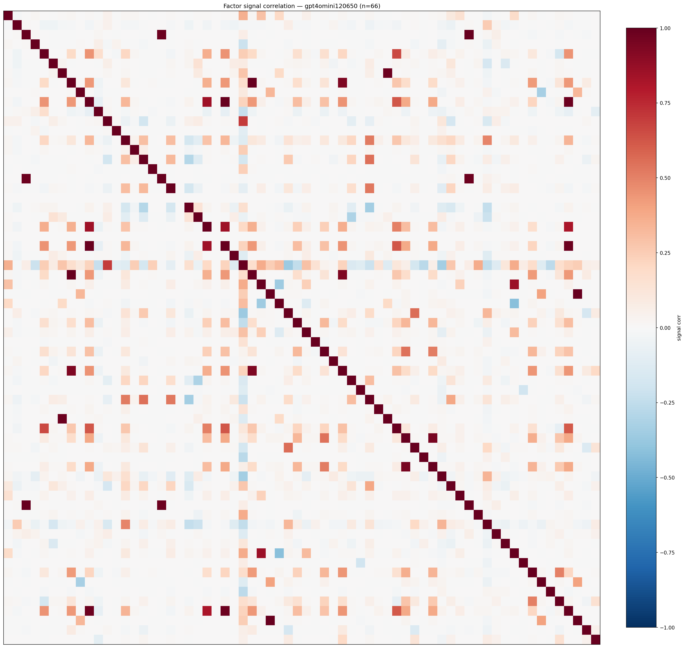

*Signal correlation matrix — gpt4omini120650*

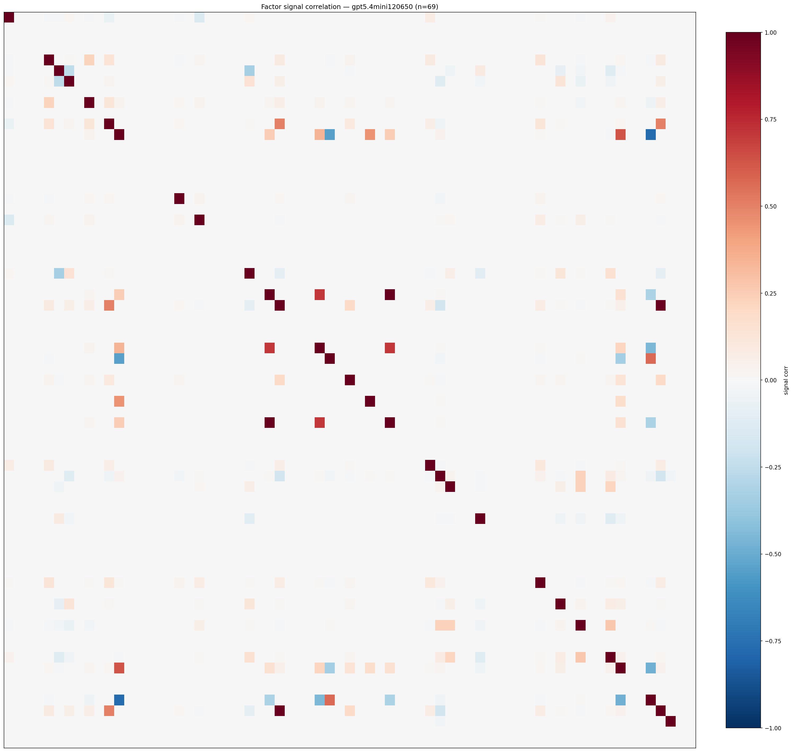

*Signal correlation matrix — gpt5.4mini120650*

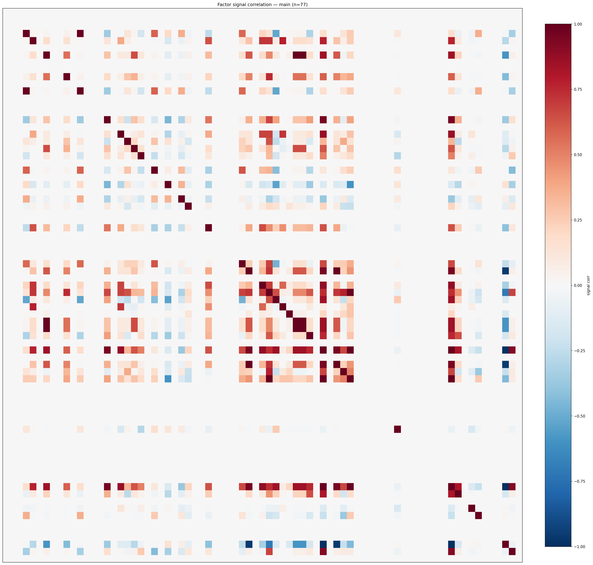

*Signal correlation matrix — main*

## 3. Deflation & model-based importance

`deflated_best_ic` haircuts each zoo's best |IC| for the number of factors tried (`ic_n_tested`) — a bigger zoo's best factor is more likely to be lucky. `lasso_n_nonzero` / `lasso_sparsity` show how many factors a sparse linear model actually keeps (model-view redundancy).

| prerun | best_ic | deflated_best_ic | deflated_best_t | ic_n_tested | ic_n_obs | lasso_n_nonzero | lasso_sparsity |
| --- | --- | --- | --- | --- | --- | --- | --- |
| gpt4omini120650 | 0.0841 | 0.0764 | 28.6619 | 64 | 140579 | 0 | 1.0 |
| gpt5.4mini120650 | 0.0492 | 0.0423 | 15.8569 | 29 | 140579 | 0 | 1.0 |
| main | 0.03 | 0.0229 | 8.5827 | 36 | 140579 | 0 | 1.0 |

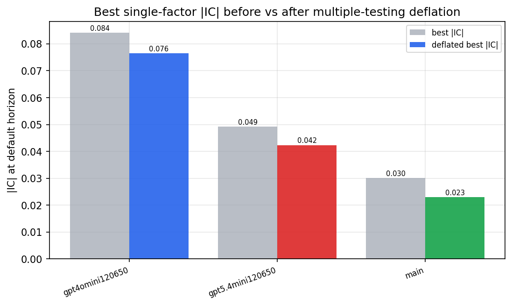

*Best |IC| before vs after multiple-testing deflation*

*Top factors by lasso importance per zoo*

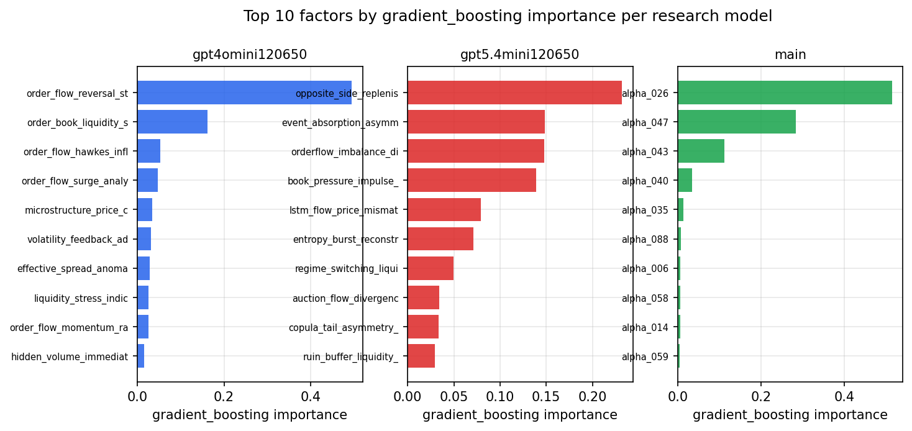

*Top factors by gradient_boosting importance per zoo*

## 4. ML-combined signal — per-underlying vectorised backtest

Each model combines a prerun's factors into ONE signal (fit `factors → forward return` on IS, predict per (bar, underlying)), then that combined signal is run through a simple vectorised backtest — `position(signal) × the underlying's own forward return` — on the held-out OOS tail (+ an equal-weight ensemble). No cross-sectional ranking.

> Config: position=**threshold** (t=1.0, z-score `expanding`), aggregation=**portfolio**, fit-standardise=**per_underlying**, horizon=6.

| prerun | model | n_factors_used | oos_ic | oos_sharpe | is_sharpe | oos_ann_return | oos_max_drawdown |
| --- | --- | --- | --- | --- | --- | --- | --- |
| gpt4omini120650 | linear_regression | 66 | 0.0711 | 2.8976 | 7.51 | 0.0023 | -0.0001 |
| gpt4omini120650 | ridge | 66 | 0.0718 | 3.4372 | 7.2322 | 0.0028 | -0.0001 |
| gpt4omini120650 | lasso | 66 | nan | nan | nan | nan | nan |
| gpt4omini120650 | elastic_net | 66 | nan | nan | nan | nan | nan |
| gpt4omini120650 | random_forest | 66 | 0.0853 | 8.0505 | 8.4477 | 0.025 | -0.0003 |
| gpt4omini120650 | gradient_boosting | 66 | 0.0768 | 2.5188 | 6.7808 | 0.0029 | -0.0002 |
| gpt4omini120650 | xgboost | 66 | 0.087 | 6.3846 | 7.604 | 0.0152 | -0.0003 |
| gpt4omini120650 | lightgbm | 66 | 0.0972 | 11.1456 | 9.3628 | 0.0222 | -0.0001 |
| gpt4omini120650 | ensemble | 66 | 0.0686 | 11.235 | 8.8753 | 0.0294 | -0.0002 |
| gpt5.4mini120650 | linear_regression | 69 | 0.016 | 8.887 | 8.6255 | 0.0257 | -0.0004 |
| gpt5.4mini120650 | ridge | 69 | 0.0154 | 8.5704 | 9.146 | 0.0255 | -0.0004 |
| gpt5.4mini120650 | lasso | 69 | nan | nan | nan | nan | nan |
| gpt5.4mini120650 | elastic_net | 69 | nan | nan | nan | nan | nan |
| gpt5.4mini120650 | random_forest | 69 | 0.0702 | 9.3723 | 10.8658 | 0.026 | -0.0004 |
| gpt5.4mini120650 | gradient_boosting | 69 | 0.0582 | 8.0156 | 5.443 | 0.0103 | -0.0002 |
| gpt5.4mini120650 | xgboost | 69 | 0.071 | 6.7546 | 7.1869 | 0.0091 | -0.0001 |
| gpt5.4mini120650 | lightgbm | 69 | 0.1027 | 10.8298 | 9.9259 | 0.0215 | -0.0002 |
| gpt5.4mini120650 | ensemble | 69 | 0.0354 | 10.4008 | 9.1273 | 0.0236 | -0.0002 |
| main | linear_regression | 77 | -0.001 | -3.647 | 4.7783 | -0.008 | -0.001 |
| main | ridge | 77 | -0.0 | -3.6908 | 4.5915 | -0.0081 | -0.001 |
| main | lasso | 77 | nan | nan | nan | nan | nan |
| main | elastic_net | 77 | nan | nan | nan | nan | nan |
| main | random_forest | 77 | -0.0053 | 1.4713 | 8.4674 | 0.0062 | -0.001 |
| main | gradient_boosting | 77 | 0.0103 | 2.5362 | 5.1693 | 0.0016 | -0.0001 |
| main | xgboost | 77 | 0.0046 | 0.9277 | 5.941 | 0.0016 | -0.0005 |
| main | lightgbm | 77 | 0.001 | 5.65 | 7.6584 | 0.0091 | -0.0003 |
| main | ensemble | 77 | 0.0044 | -3.5251 | 7.0853 | -0.0084 | -0.0011 |

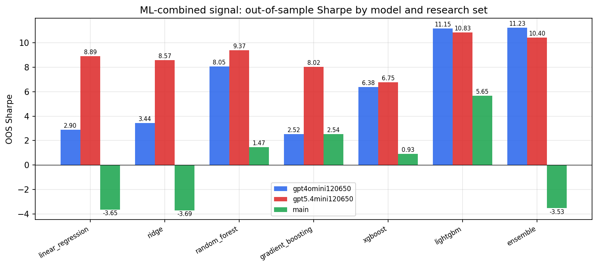

*ML-combined OOS Sharpe by model and research set*

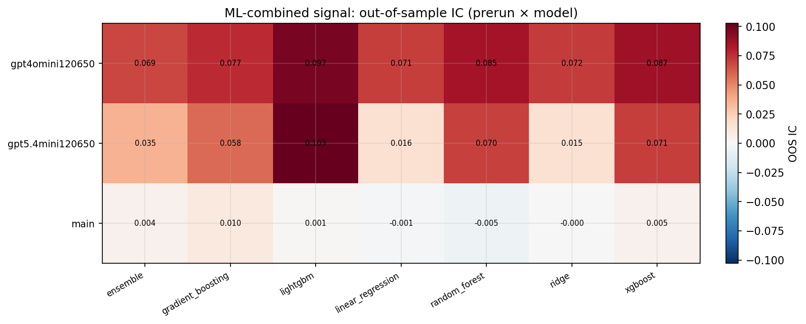

*ML-combined OOS IC (prerun × model)*

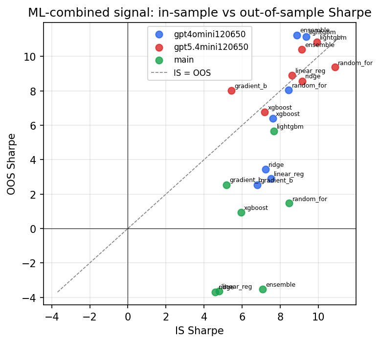

*IS vs OOS Sharpe (overfitting diagnostic)*

---
*Generated by `run_model_comparison.py`. Tables: `*.csv`; interactive: `comparison.ipynb`.*
