# Research-LLM factor comparison — `2026-02`

Comparing the **factor output of different research LLMs** on three axes (raw factor quality → factors as ML features → factors through the full agentic fund). The panel, IS/OOS split, horizon and model hyper-parameters are held identical across preruns — the *only* variable is the factor set.

## Preruns compared

| prerun | research_model | usable_factors | dropped_factors |
| --- | --- | --- | --- |
| gpt4omini120650 | gpt-4o-mini | 66 | 0 |
| gpt5.4mini120650 | gpt-5.4-mini | 69 | 0 |
| main | seed library | 77 | 11 |

> Dropped factors declare fields the current data doesn't have yet (e.g. fundamentals); they light up unchanged once that data is downloaded.

*Usable vs awaiting-data factors per research model*

## Key findings

- **Best ML-combined OOS Sharpe:** `gpt4omini120650` with `random_forest` (OOS Sharpe = 14.781).
- **Mean OOS Sharpe across models, by research set:** `gpt4omini120650` = 8.191, `gpt5.4mini120650` = 6.355, `main` = 4.629.
- **Highest mean single-factor |IC| (h=6):** `gpt4omini120650` (mean |IC| = 0.0167).
- **Most diverse zoo (highest effective/raw factor ratio):** `gpt5.4mini120650` (eff 56.4 of 69, ratio 0.82).
- **Best selection-deflated single-factor |IC|:** `gpt4omini120650` (deflated |IC| = 0.0726 from 64 factors tried).

## 1. Single-factor IC (raw factor quality)

Per-underlying time-series Spearman rank-IC of every researched factor, recomputed on the shared panel at horizons h=1, h=6, h=60. The per-underlying IC correlates each factor's value vector with the underlying's own forward-return vector (pooled across underlyings); the cross-sectional IC ranks across underlyings per timestamp.

| prerun | n_factors | mean_abs_ic_1 | mean_abs_ic_6 | mean_abs_ic_60 | mean_abs_icir_6 | best_factor_h6 | best_abs_ic_h6 |
| --- | --- | --- | --- | --- | --- | --- | --- |
| gpt4omini120650 | 66 | 0.0111 | 0.0167 | 0.0191 | 0.6759 | liquidity_imbalance_trend | 0.0803 |
| gpt5.4mini120650 | 69 | 0.0064 | 0.0082 | 0.0108 | 0.5106 | orderflow_imbalance_divergence | 0.0404 |
| main | 77 | 0.0081 | 0.0089 | 0.0221 | 0.1938 | alpha_032 | 0.0309 |

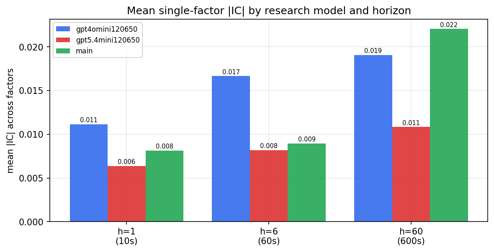

*Mean |IC| by research model and horizon*

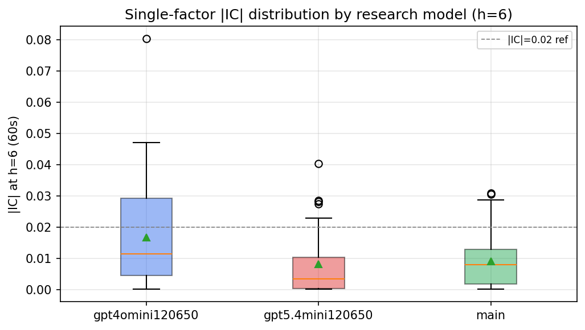

*Per-factor |IC| distribution by research model*

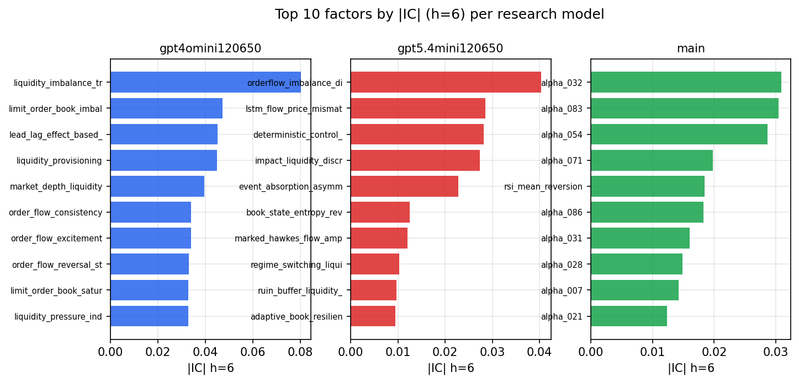

*Top factors by |IC| per research model*

## 2. Factor diversity & redundancy

Pairwise correlation of each zoo's *signals*. `eff_n_factors` is the effective number of independent factors (participation ratio of the correlation eigenvalues); `eff_ratio` and `redundancy` summarise how much unique information the zoo holds vs. how much is duplicated; `n_clusters` groups factors at |corr| ≥ 0.7.

| prerun | n_factors | eff_n_factors | eff_ratio | mean_abs_corr | n_clusters | redundancy |
| --- | --- | --- | --- | --- | --- | --- |
| gpt4omini120650 | 66 | 33.8663 | 0.5131 | 0.0444 | 55 | 0.4869 |
| gpt5.4mini120650 | 69 | 56.4146 | 0.8176 | 0.0091 | 65 | 0.1824 |
| main | 77 | 27.8935 | 0.3623 | 0.0531 | 52 | 0.6377 |

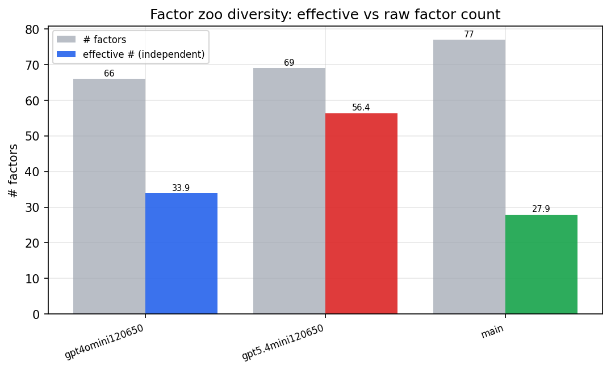

*Effective vs raw factor count per research model*

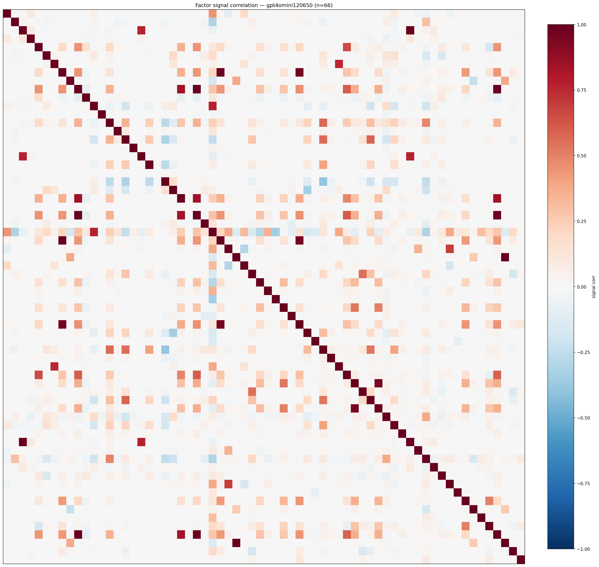

*Signal correlation matrix — gpt4omini120650*

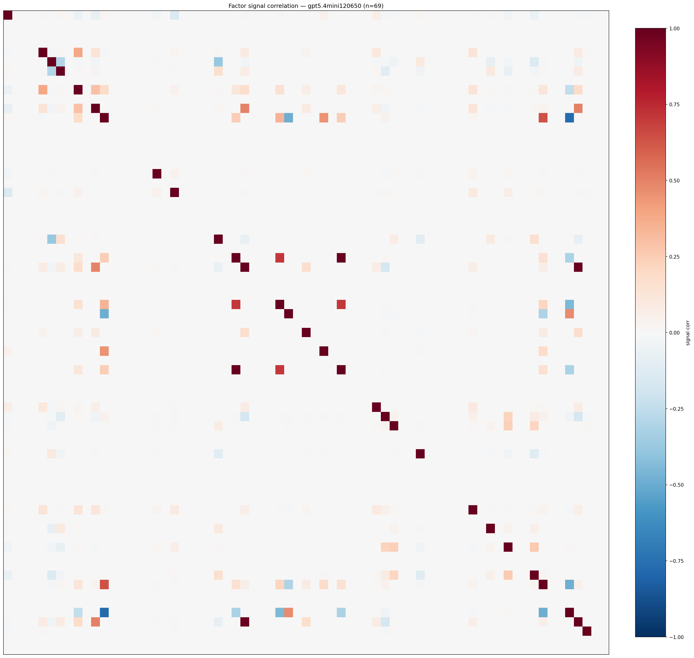

*Signal correlation matrix — gpt5.4mini120650*

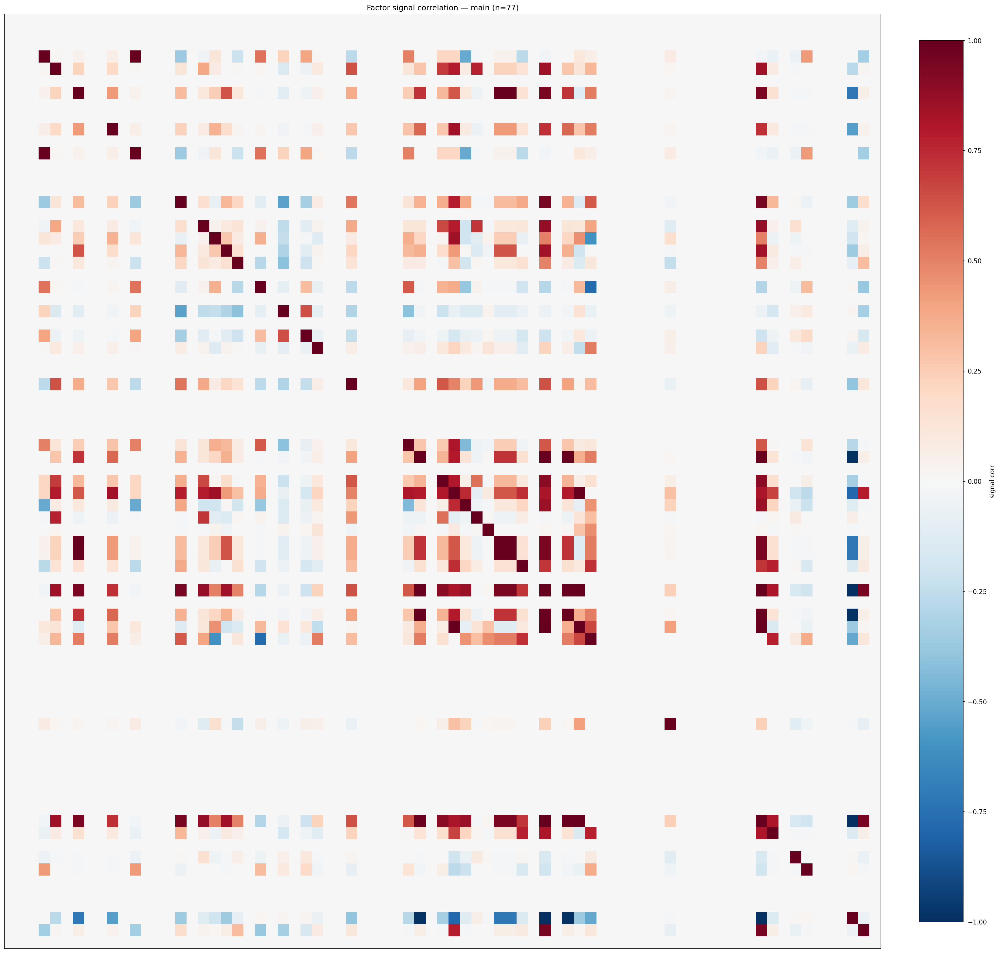

*Signal correlation matrix — main*

## 3. Deflation & model-based importance

`deflated_best_ic` haircuts each zoo's best |IC| for the number of factors tried (`ic_n_tested`) — a bigger zoo's best factor is more likely to be lucky. `lasso_n_nonzero` / `lasso_sparsity` show how many factors a sparse linear model actually keeps (model-view redundancy).

| prerun | best_ic | deflated_best_ic | deflated_best_t | ic_n_tested | ic_n_obs | lasso_n_nonzero | lasso_sparsity |
| --- | --- | --- | --- | --- | --- | --- | --- |
| gpt4omini120650 | 0.0803 | 0.0726 | 27.3296 | 64 | 141659 | 0 | 1.0 |
| gpt5.4mini120650 | 0.0404 | 0.0335 | 12.5948 | 29 | 141659 | 0 | 1.0 |
| main | 0.0309 | 0.0238 | 8.9573 | 36 | 141659 | 0 | 1.0 |

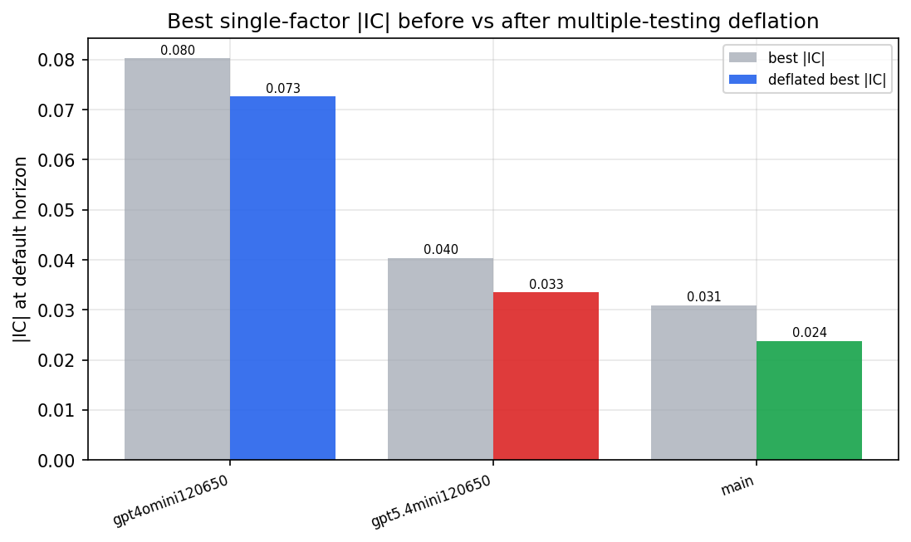

*Best |IC| before vs after multiple-testing deflation*

*Top factors by lasso importance per zoo*

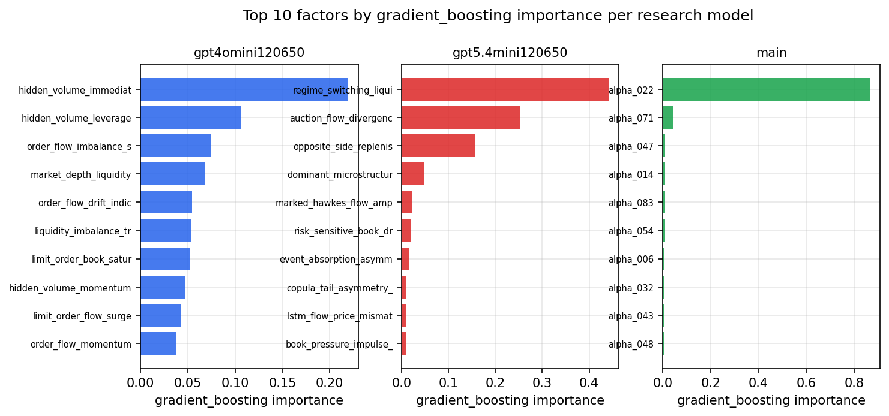

*Top factors by gradient_boosting importance per zoo*

## 4. ML-combined signal — per-underlying vectorised backtest

Each model combines a prerun's factors into ONE signal (fit `factors → forward return` on IS, predict per (bar, underlying)), then that combined signal is run through a simple vectorised backtest — `position(signal) × the underlying's own forward return` — on the held-out OOS tail (+ an equal-weight ensemble). No cross-sectional ranking.

> Config: position=**threshold** (t=1.0, z-score `expanding`), aggregation=**portfolio**, fit-standardise=**per_underlying**, horizon=6.

| prerun | model | n_factors_used | oos_ic | oos_sharpe | is_sharpe | oos_ann_return | oos_max_drawdown |
| --- | --- | --- | --- | --- | --- | --- | --- |
| gpt4omini120650 | linear_regression | 66 | 0.0831 | 7.8538 | 9.4806 | 0.0136 | -0.0002 |
| gpt4omini120650 | ridge | 66 | 0.0846 | 5.9456 | 10.6593 | 0.0099 | -0.0002 |
| gpt4omini120650 | lasso | 66 | nan | nan | nan | nan | nan |
| gpt4omini120650 | elastic_net | 66 | nan | nan | nan | nan | nan |
| gpt4omini120650 | random_forest | 66 | 0.1074 | 14.7809 | 9.6691 | 0.0619 | -0.0005 |
| gpt4omini120650 | gradient_boosting | 66 | 0.0919 | 4.6279 | 7.7254 | 0.0139 | -0.0003 |
| gpt4omini120650 | xgboost | 66 | 0.0976 | 7.3523 | 7.4885 | 0.0271 | -0.0002 |
| gpt4omini120650 | lightgbm | 66 | 0.1212 | 6.6638 | 9.5622 | 0.0198 | -0.0005 |
| gpt4omini120650 | ensemble | 66 | 0.1084 | 10.1161 | 11.0246 | 0.0368 | -0.0003 |
| gpt5.4mini120650 | linear_regression | 69 | 0.0209 | 4.8763 | 8.3369 | 0.0216 | -0.0011 |
| gpt5.4mini120650 | ridge | 69 | 0.0211 | 4.6061 | 8.2265 | 0.0205 | -0.001 |
| gpt5.4mini120650 | lasso | 69 | nan | nan | nan | nan | nan |
| gpt5.4mini120650 | elastic_net | 69 | nan | nan | nan | nan | nan |
| gpt5.4mini120650 | random_forest | 69 | 0.0765 | 7.103 | 9.1563 | 0.0317 | -0.0009 |
| gpt5.4mini120650 | gradient_boosting | 69 | 0.0657 | 2.733 | 6.2436 | 0.0028 | -0.0001 |
| gpt5.4mini120650 | xgboost | 69 | 0.0914 | 7.2221 | 8.8222 | 0.0138 | -0.0002 |
| gpt5.4mini120650 | lightgbm | 69 | 0.1076 | 4.0145 | 10.4076 | 0.0131 | -0.0007 |
| gpt5.4mini120650 | ensemble | 69 | 0.0485 | 13.9304 | 9.9818 | 0.0372 | -0.0004 |
| main | linear_regression | 77 | 0.0081 | 5.485 | 4.3594 | 0.0225 | -0.0008 |
| main | ridge | 77 | 0.0087 | 4.5291 | 3.9406 | 0.0201 | -0.0009 |
| main | lasso | 77 | nan | nan | nan | nan | nan |
| main | elastic_net | 77 | nan | nan | nan | nan | nan |
| main | random_forest | 77 | 0.0217 | 4.3906 | 5.8732 | 0.0184 | -0.0007 |
| main | gradient_boosting | 77 | 0.0241 | 4.8632 | 6.1455 | 0.0043 | -0.0001 |
| main | xgboost | 77 | 0.0216 | 4.6021 | 7.0008 | 0.0124 | -0.0004 |
| main | lightgbm | 77 | 0.0287 | 4.2524 | 8.1826 | 0.0105 | -0.0003 |
| main | ensemble | 77 | 0.0258 | 4.2809 | 6.672 | 0.0166 | -0.0007 |

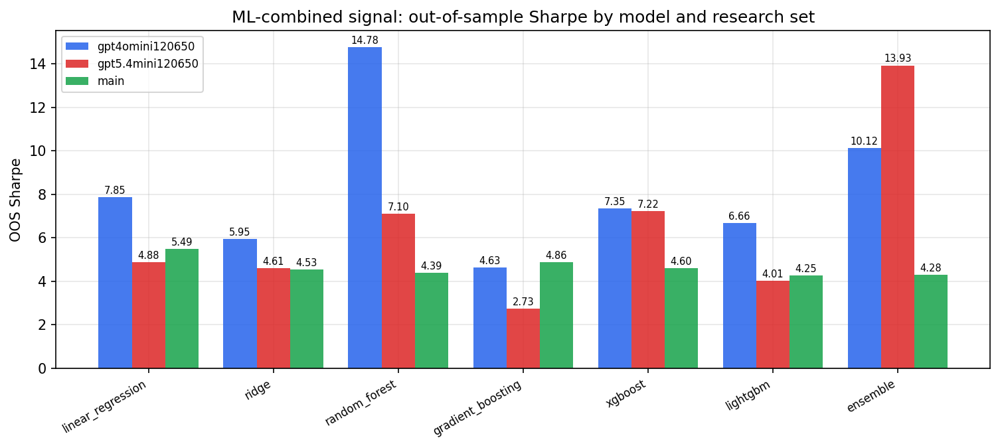

*ML-combined OOS Sharpe by model and research set*

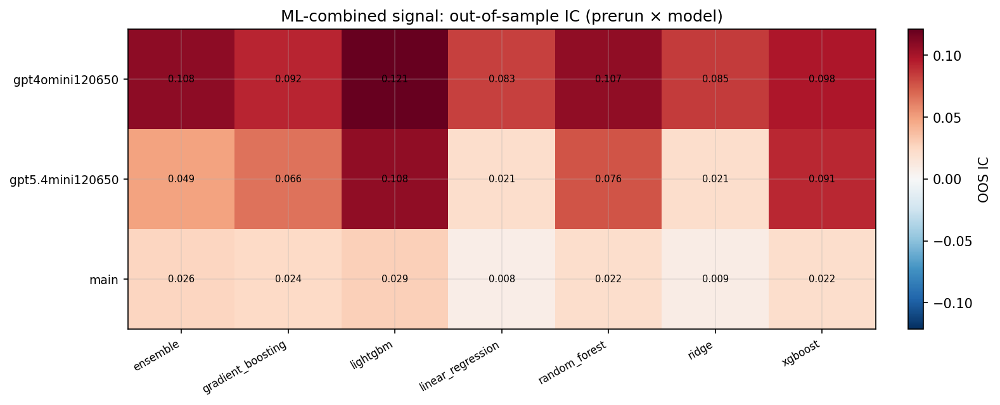

*ML-combined OOS IC (prerun × model)*

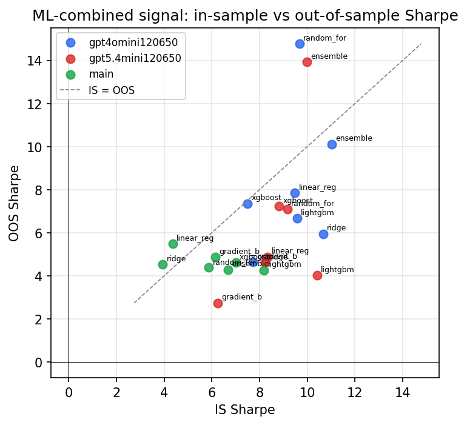

*IS vs OOS Sharpe (overfitting diagnostic)*

---
*Generated by `run_model_comparison.py`. Tables: `*.csv`; interactive: `comparison.ipynb`.*
