# Research-LLM factor comparison — `2026-03`

Comparing the **factor output of different research LLMs** on three axes (raw factor quality → factors as ML features → factors through the full agentic fund). The panel, IS/OOS split, horizon and model hyper-parameters are held identical across preruns — the *only* variable is the factor set.

## Preruns compared

| prerun | research_model | usable_factors | dropped_factors |
| --- | --- | --- | --- |
| gpt4omini120650 | gpt-4o-mini | 66 | 0 |
| gpt5.4mini120650 | gpt-5.4-mini | 69 | 0 |
| main | seed library | 77 | 11 |

> Dropped factors declare fields the current data doesn't have yet (e.g. fundamentals); they light up unchanged once that data is downloaded.

*Usable vs awaiting-data factors per research model*

## Key findings

- **Best ML-combined OOS Sharpe:** `gpt4omini120650` with `linear_regression` (OOS Sharpe = 18.572).
- **Mean OOS Sharpe across models, by research set:** `gpt4omini120650` = 4.826, `main` = 0.237, `gpt5.4mini120650` = -3.867.
- **Highest mean single-factor |IC| (h=6):** `main` (mean |IC| = 0.0244).
- **Most diverse zoo (highest effective/raw factor ratio):** `gpt5.4mini120650` (eff 56.3 of 69, ratio 0.82).
- **Best selection-deflated single-factor |IC|:** `gpt4omini120650` (deflated |IC| = 0.0901 from 64 factors tried).

## 1. Single-factor IC (raw factor quality)

Per-underlying time-series Spearman rank-IC of every researched factor, recomputed on the shared panel at horizons h=1, h=6, h=60. The per-underlying IC correlates each factor's value vector with the underlying's own forward-return vector (pooled across underlyings); the cross-sectional IC ranks across underlyings per timestamp.

| prerun | n_factors | mean_abs_ic_1 | mean_abs_ic_6 | mean_abs_ic_60 | mean_abs_icir_6 | best_factor_h6 | best_abs_ic_h6 |
| --- | --- | --- | --- | --- | --- | --- | --- |
| gpt4omini120650 | 66 | 0.0128 | 0.0158 | 0.0167 | 0.6113 | liquidity_imbalance_trend | 0.0977 |
| gpt5.4mini120650 | 69 | 0.0047 | 0.008 | 0.0093 | 0.5063 | orderflow_imbalance_divergence | 0.031 |
| main | 77 | 0.0143 | 0.0244 | 0.0285 | 0.5137 | alpha_032 | 0.0847 |

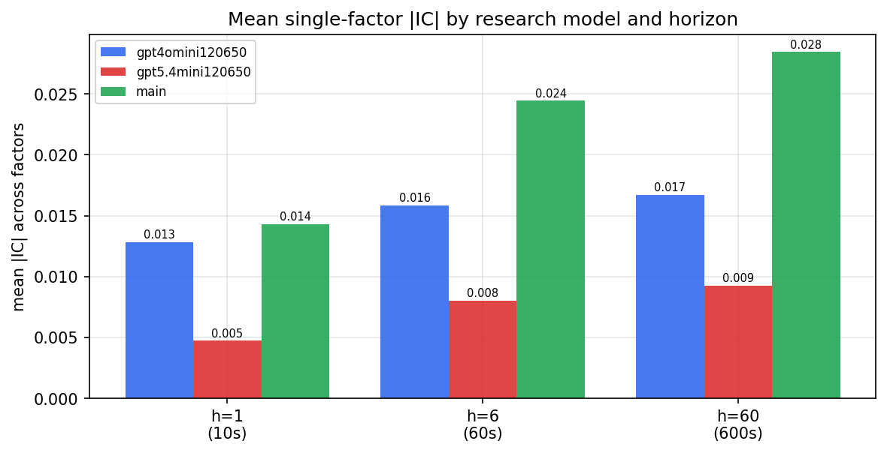

*Mean |IC| by research model and horizon*

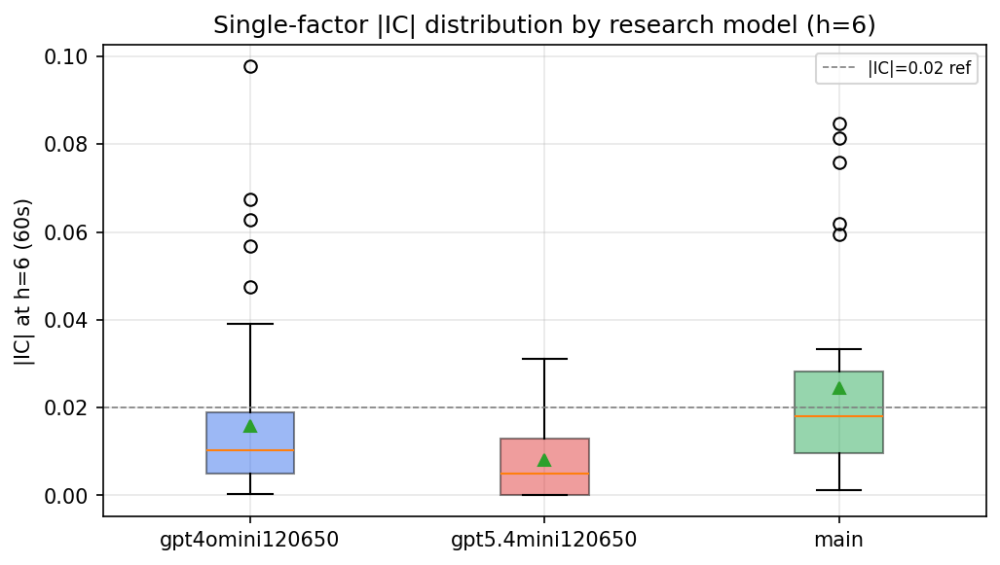

*Per-factor |IC| distribution by research model*

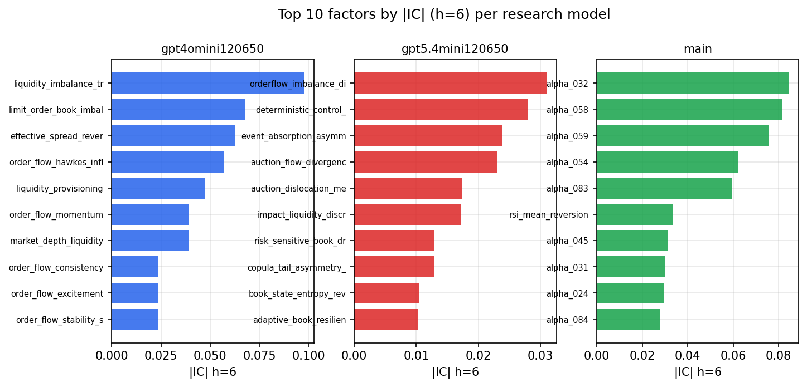

*Top factors by |IC| per research model*

## 2. Factor diversity & redundancy

Pairwise correlation of each zoo's *signals*. `eff_n_factors` is the effective number of independent factors (participation ratio of the correlation eigenvalues); `eff_ratio` and `redundancy` summarise how much unique information the zoo holds vs. how much is duplicated; `n_clusters` groups factors at |corr| ≥ 0.7.

| prerun | n_factors | eff_n_factors | eff_ratio | mean_abs_corr | n_clusters | redundancy |
| --- | --- | --- | --- | --- | --- | --- |
| gpt4omini120650 | 66 | 34.3454 | 0.5204 | 0.0415 | 57 | 0.4796 |
| gpt5.4mini120650 | 69 | 56.3027 | 0.816 | 0.0092 | 65 | 0.184 |
| main | 77 | 29.4265 | 0.3822 | 0.0498 | 54 | 0.6178 |

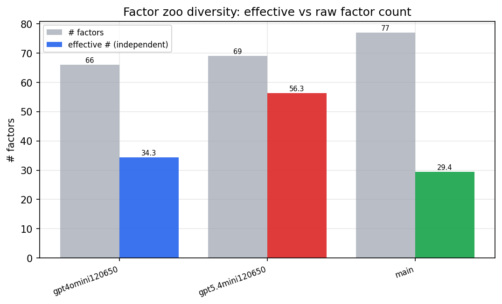

*Effective vs raw factor count per research model*

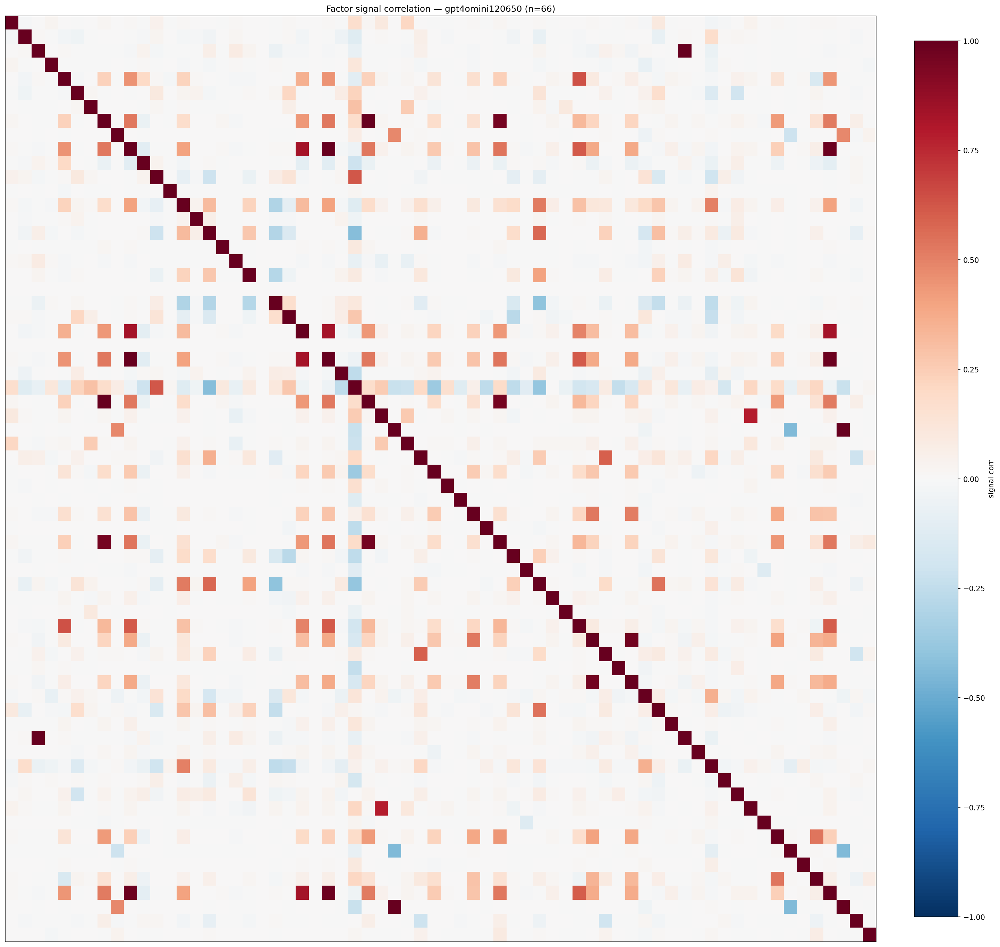

*Signal correlation matrix — gpt4omini120650*

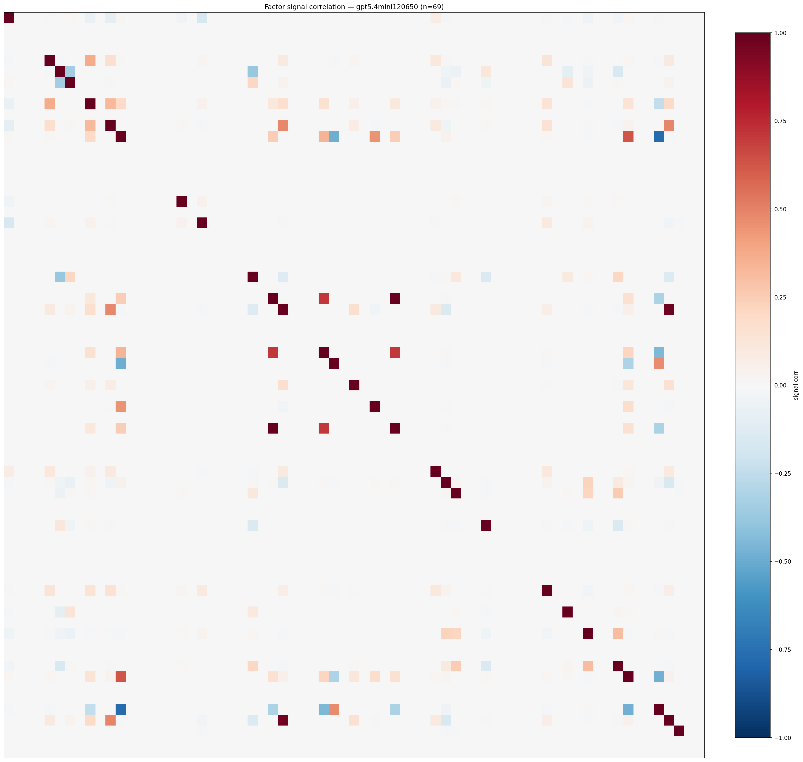

*Signal correlation matrix — gpt5.4mini120650*

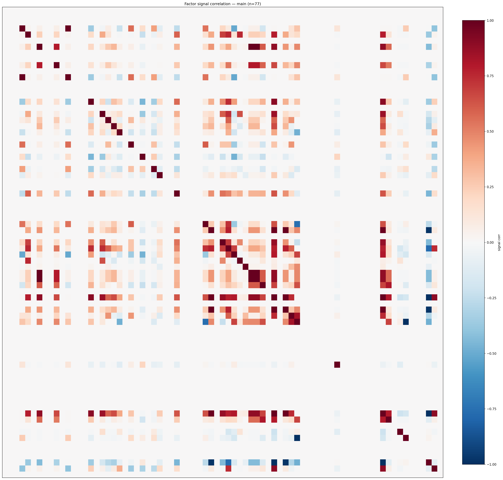

*Signal correlation matrix — main*

## 3. Deflation & model-based importance

`deflated_best_ic` haircuts each zoo's best |IC| for the number of factors tried (`ic_n_tested`) — a bigger zoo's best factor is more likely to be lucky. `lasso_n_nonzero` / `lasso_sparsity` show how many factors a sparse linear model actually keeps (model-view redundancy).

| prerun | best_ic | deflated_best_ic | deflated_best_t | ic_n_tested | ic_n_obs | lasso_n_nonzero | lasso_sparsity |
| --- | --- | --- | --- | --- | --- | --- | --- |
| gpt4omini120650 | 0.0977 | 0.0901 | 34.0296 | 64 | 142739 | 0 | 1.0 |
| gpt5.4mini120650 | 0.031 | 0.0241 | 9.123 | 29 | 142739 | 0 | 1.0 |
| main | 0.0847 | 0.0776 | 29.3202 | 36 | 142739 | 0 | 1.0 |

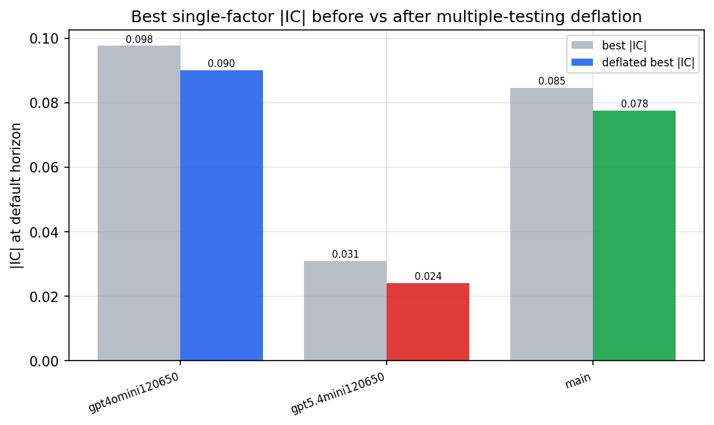

*Best |IC| before vs after multiple-testing deflation*

*Top factors by lasso importance per zoo*

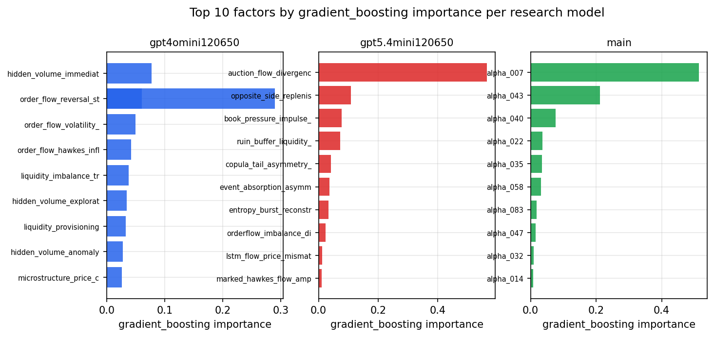

*Top factors by gradient_boosting importance per zoo*

## 4. ML-combined signal — per-underlying vectorised backtest

Each model combines a prerun's factors into ONE signal (fit `factors → forward return` on IS, predict per (bar, underlying)), then that combined signal is run through a simple vectorised backtest — `position(signal) × the underlying's own forward return` — on the held-out OOS tail (+ an equal-weight ensemble). No cross-sectional ranking.

> Config: position=**threshold** (t=1.0, z-score `expanding`), aggregation=**portfolio**, fit-standardise=**per_underlying**, horizon=6.

| prerun | model | n_factors_used | oos_ic | oos_sharpe | is_sharpe | oos_ann_return | oos_max_drawdown |
| --- | --- | --- | --- | --- | --- | --- | --- |
| gpt4omini120650 | linear_regression | 66 | 0.1599 | 18.5721 | 7.5509 | 0.0906 | -0.0006 |
| gpt4omini120650 | ridge | 66 | 0.1597 | 18.357 | 7.8772 | 0.1025 | -0.0005 |
| gpt4omini120650 | lasso | 66 | nan | nan | nan | nan | nan |
| gpt4omini120650 | elastic_net | 66 | nan | nan | nan | nan | nan |
| gpt4omini120650 | random_forest | 66 | 0.1383 | 5.0524 | 8.4106 | 0.0354 | -0.0015 |
| gpt4omini120650 | gradient_boosting | 66 | 0.1096 | -6.1179 | 6.3353 | -0.0296 | -0.0027 |
| gpt4omini120650 | xgboost | 66 | 0.1474 | -4.23 | 6.792 | -0.0203 | -0.0025 |
| gpt4omini120650 | lightgbm | 66 | 0.1554 | 1.2113 | 8.4814 | 0.0081 | -0.0012 |
| gpt4omini120650 | ensemble | 66 | 0.1596 | 0.9342 | 8.6274 | 0.0052 | -0.0016 |
| gpt5.4mini120650 | linear_regression | 69 | 0.0237 | -4.6536 | 2.6268 | -0.0213 | -0.002 |
| gpt5.4mini120650 | ridge | 69 | 0.0221 | -5.1461 | 2.4971 | -0.0229 | -0.0021 |
| gpt5.4mini120650 | lasso | 69 | nan | nan | nan | nan | nan |
| gpt5.4mini120650 | elastic_net | 69 | nan | nan | nan | nan | nan |
| gpt5.4mini120650 | random_forest | 69 | 0.0825 | -1.5048 | 6.7421 | -0.0092 | -0.0016 |
| gpt5.4mini120650 | gradient_boosting | 69 | 0.045 | 0.144 | 5.2128 | 0.0002 | -0.0005 |
| gpt5.4mini120650 | xgboost | 69 | 0.0923 | -5.1059 | 7.0485 | -0.0218 | -0.0022 |
| gpt5.4mini120650 | lightgbm | 69 | 0.1233 | -5.1192 | 7.9538 | -0.0331 | -0.0032 |
| gpt5.4mini120650 | ensemble | 69 | 0.0887 | -5.6865 | 7.1364 | -0.0366 | -0.0033 |
| main | linear_regression | 77 | 0.0051 | 1.4867 | 4.2369 | 0.0116 | -0.0016 |
| main | ridge | 77 | 0.0096 | 0.1497 | 4.5108 | 0.0012 | -0.0021 |
| main | lasso | 77 | nan | nan | nan | nan | nan |
| main | elastic_net | 77 | nan | nan | nan | nan | nan |
| main | random_forest | 77 | 0.0223 | 2.6944 | 5.5407 | 0.0241 | -0.0015 |
| main | gradient_boosting | 77 | 0.0186 | 0.7118 | 5.3763 | 0.001 | -0.0003 |
| main | xgboost | 77 | 0.0192 | -4.7862 | 6.4128 | -0.0093 | -0.0011 |
| main | lightgbm | 77 | 0.0281 | -1.0396 | 6.7222 | -0.0046 | -0.001 |
| main | ensemble | 77 | 0.0113 | 2.4393 | 5.759 | 0.0177 | -0.0011 |

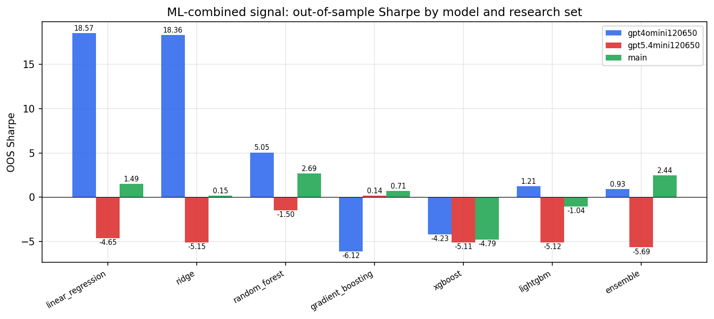

*ML-combined OOS Sharpe by model and research set*

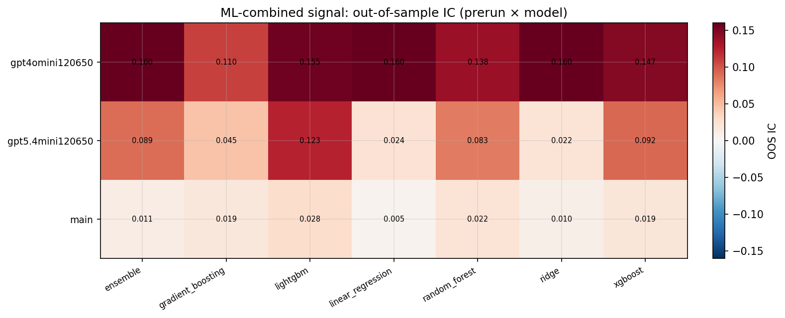

*ML-combined OOS IC (prerun × model)*

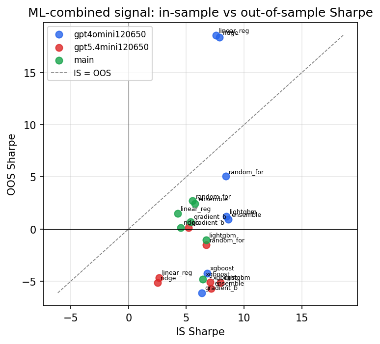

*IS vs OOS Sharpe (overfitting diagnostic)*

---
*Generated by `run_model_comparison.py`. Tables: `*.csv`; interactive: `comparison.ipynb`.*
