# Research-LLM factor comparison — `2026-04`

Comparing the **factor output of different research LLMs** on three axes (raw factor quality → factors as ML features → factors through the full agentic fund). The panel, IS/OOS split, horizon and model hyper-parameters are held identical across preruns — the *only* variable is the factor set.

## Preruns compared

| prerun | research_model | usable_factors | dropped_factors |
| --- | --- | --- | --- |
| gpt4omini120650 | gpt-4o-mini | 66 | 0 |
| gpt5.4mini120650 | gpt-5.4-mini | 69 | 0 |
| main | seed library | 77 | 11 |

> Dropped factors declare fields the current data doesn't have yet (e.g. fundamentals); they light up unchanged once that data is downloaded.

*Usable vs awaiting-data factors per research model*

## Key findings

- **Best ML-combined OOS Sharpe:** `gpt4omini120650` with `random_forest` (OOS Sharpe = 30.317).
- **Mean OOS Sharpe across models, by research set:** `gpt4omini120650` = 15.419, `gpt5.4mini120650` = 5.293, `main` = 4.009.
- **Highest mean single-factor |IC| (h=6):** `main` (mean |IC| = 0.0233).
- **Most diverse zoo (highest effective/raw factor ratio):** `gpt5.4mini120650` (eff 56.7 of 69, ratio 0.82).
- **Best selection-deflated single-factor |IC|:** `gpt4omini120650` (deflated |IC| = 0.1059 from 64 factors tried).

## 1. Single-factor IC (raw factor quality)

Per-underlying time-series Spearman rank-IC of every researched factor, recomputed on the shared panel at horizons h=1, h=6, h=60. The per-underlying IC correlates each factor's value vector with the underlying's own forward-return vector (pooled across underlyings); the cross-sectional IC ranks across underlyings per timestamp.

| prerun | n_factors | mean_abs_ic_1 | mean_abs_ic_6 | mean_abs_ic_60 | mean_abs_icir_6 | best_factor_h6 | best_abs_ic_h6 |
| --- | --- | --- | --- | --- | --- | --- | --- |
| gpt4omini120650 | 66 | 0.0119 | 0.0148 | 0.0159 | 0.6325 | liquidity_imbalance_trend | 0.1134 |
| gpt5.4mini120650 | 69 | 0.0051 | 0.0095 | 0.0111 | 0.551 | orderflow_imbalance_divergence | 0.0363 |
| main | 77 | 0.0136 | 0.0233 | 0.0331 | 0.5678 | alpha_032 | 0.0974 |

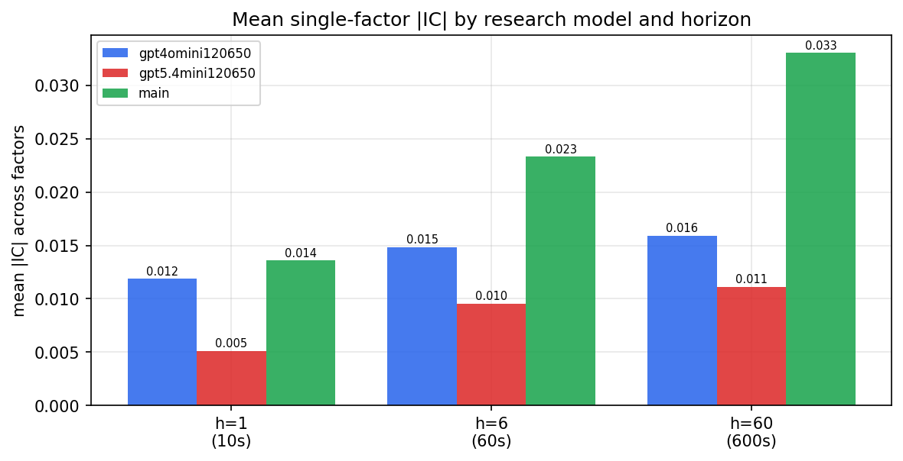

*Mean |IC| by research model and horizon*

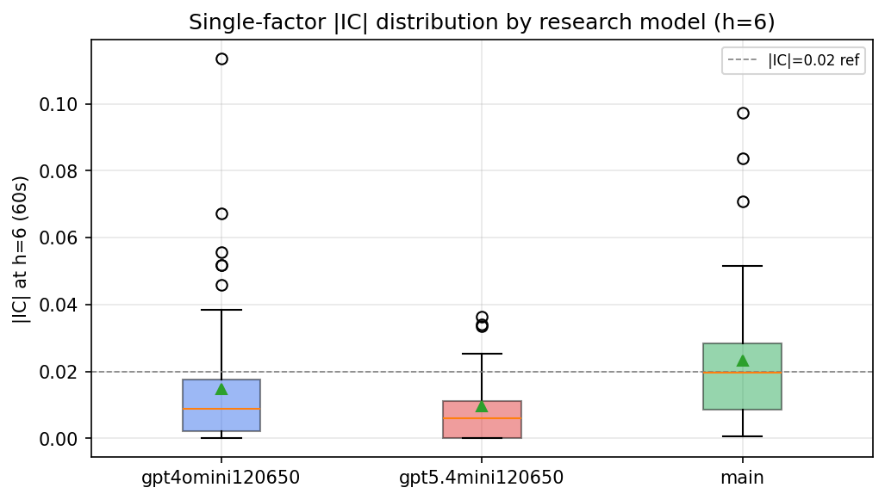

*Per-factor |IC| distribution by research model*

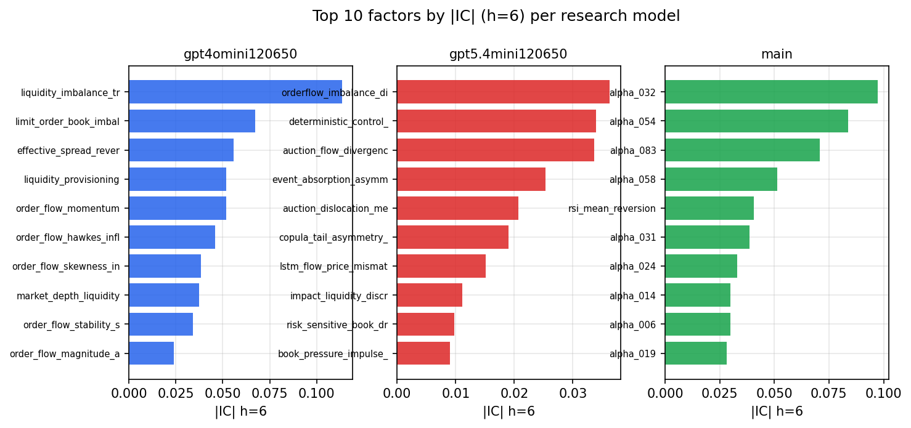

*Top factors by |IC| per research model*

## 2. Factor diversity & redundancy

Pairwise correlation of each zoo's *signals*. `eff_n_factors` is the effective number of independent factors (participation ratio of the correlation eigenvalues); `eff_ratio` and `redundancy` summarise how much unique information the zoo holds vs. how much is duplicated; `n_clusters` groups factors at |corr| ≥ 0.7.

| prerun | n_factors | eff_n_factors | eff_ratio | mean_abs_corr | n_clusters | redundancy |
| --- | --- | --- | --- | --- | --- | --- |
| gpt4omini120650 | 66 | 32.8117 | 0.4971 | 0.0446 | 55 | 0.5029 |
| gpt5.4mini120650 | 69 | 56.7204 | 0.822 | 0.0089 | 65 | 0.178 |
| main | 77 | 29.0273 | 0.377 | 0.0511 | 54 | 0.623 |

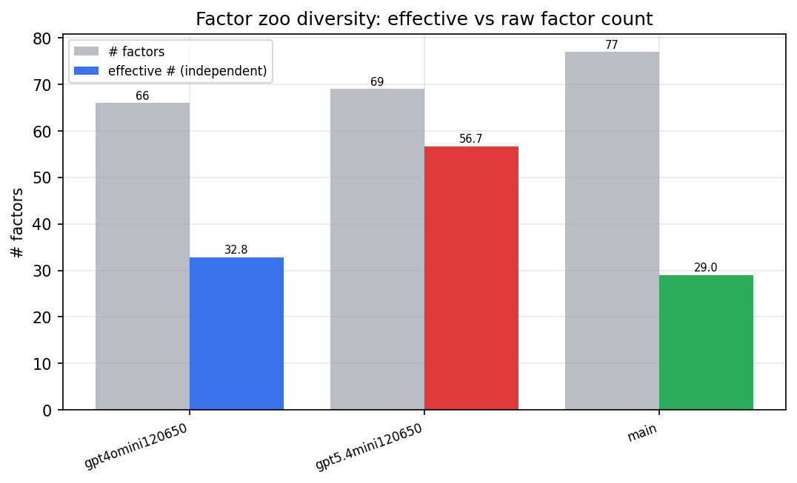

*Effective vs raw factor count per research model*

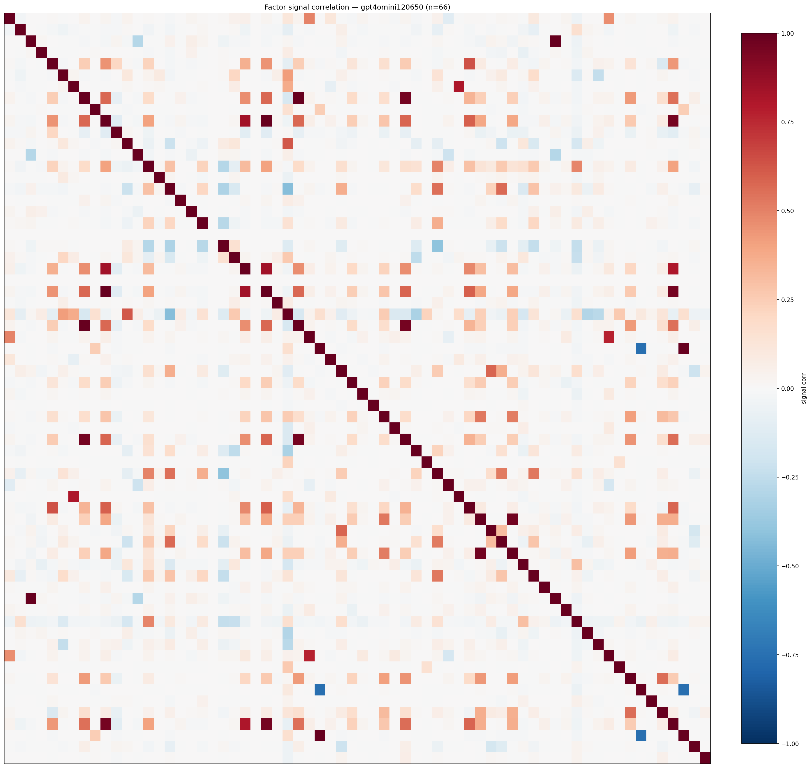

*Signal correlation matrix — gpt4omini120650*

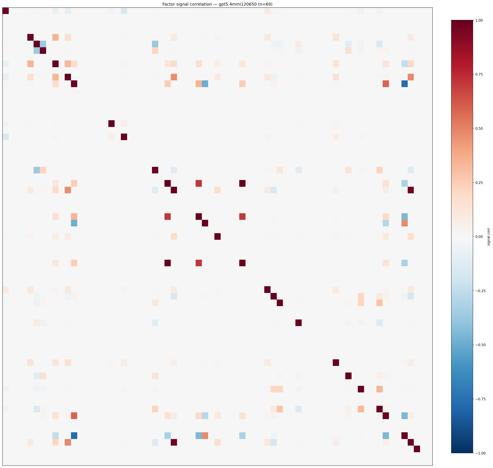

*Signal correlation matrix — gpt5.4mini120650*

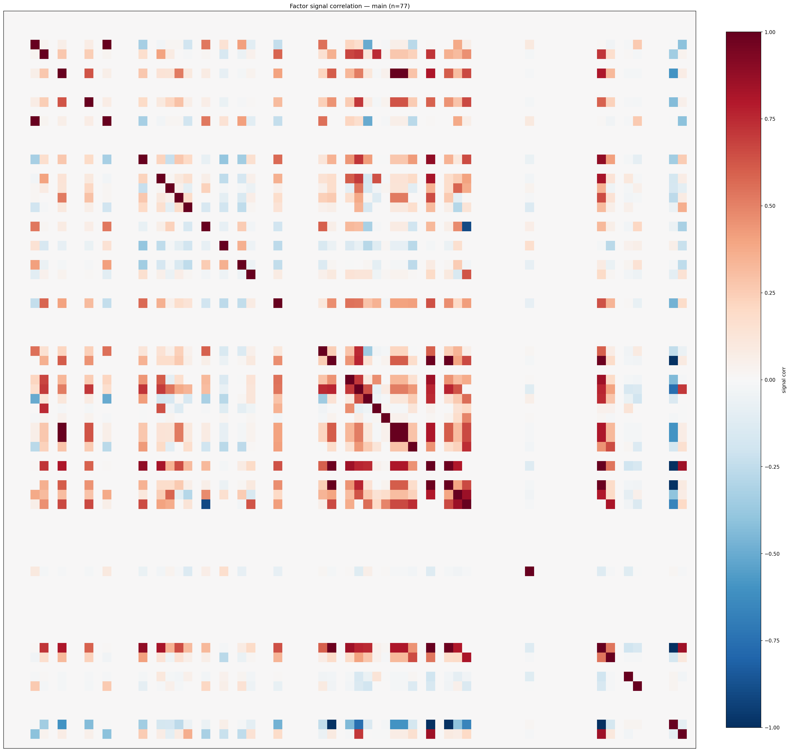

*Signal correlation matrix — main*

## 3. Deflation & model-based importance

`deflated_best_ic` haircuts each zoo's best |IC| for the number of factors tried (`ic_n_tested`) — a bigger zoo's best factor is more likely to be lucky. `lasso_n_nonzero` / `lasso_sparsity` show how many factors a sparse linear model actually keeps (model-view redundancy).

| prerun | best_ic | deflated_best_ic | deflated_best_t | ic_n_tested | ic_n_obs | lasso_n_nonzero | lasso_sparsity |
| --- | --- | --- | --- | --- | --- | --- | --- |
| gpt4omini120650 | 0.1134 | 0.1059 | 40.3275 | 64 | 145079 | 0 | 1.0 |
| gpt5.4mini120650 | 0.0363 | 0.0295 | 11.2334 | 29 | 145079 | 0 | 1.0 |
| main | 0.0974 | 0.0904 | 34.4254 | 36 | 145079 | 0 | 1.0 |

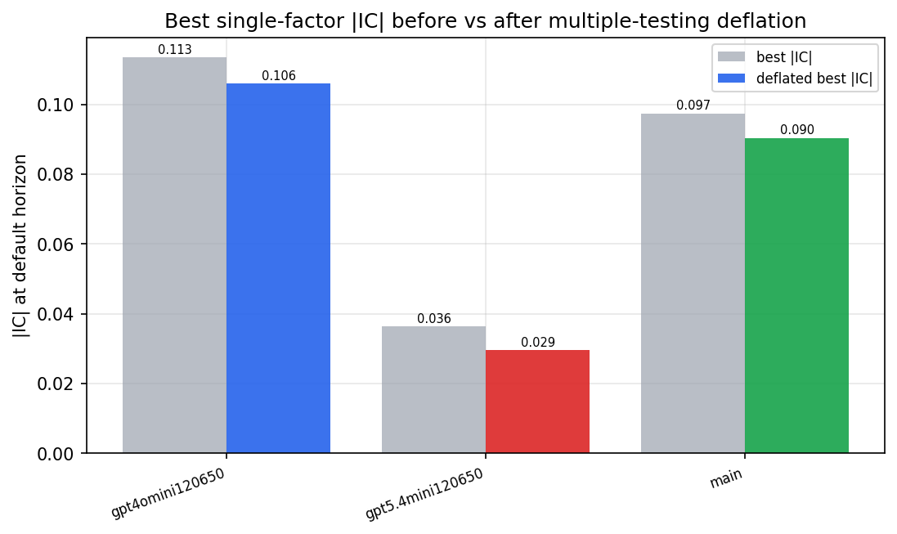

*Best |IC| before vs after multiple-testing deflation*

*Top factors by lasso importance per zoo*

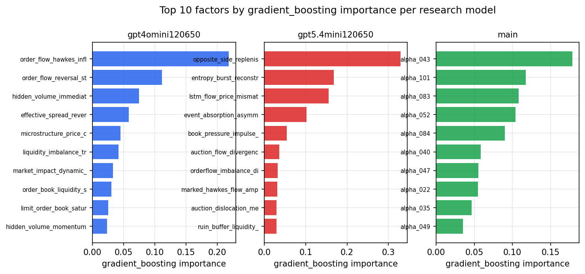

*Top factors by gradient_boosting importance per zoo*

## 4. ML-combined signal — per-underlying vectorised backtest

Each model combines a prerun's factors into ONE signal (fit `factors → forward return` on IS, predict per (bar, underlying)), then that combined signal is run through a simple vectorised backtest — `position(signal) × the underlying's own forward return` — on the held-out OOS tail (+ an equal-weight ensemble). No cross-sectional ranking.

> Config: position=**threshold** (t=1.0, z-score `expanding`), aggregation=**portfolio**, fit-standardise=**per_underlying**, horizon=6.

| prerun | model | n_factors_used | oos_ic | oos_sharpe | is_sharpe | oos_ann_return | oos_max_drawdown |
| --- | --- | --- | --- | --- | --- | --- | --- |
| gpt4omini120650 | linear_regression | 66 | 0.1448 | 14.6554 | 19.7874 | 0.0624 | -0.001 |
| gpt4omini120650 | ridge | 66 | 0.1457 | 14.178 | 20.1622 | 0.0602 | -0.001 |
| gpt4omini120650 | lasso | 66 | 0.1342 | 27.5829 | 18.7811 | 0.1807 | -0.001 |
| gpt4omini120650 | elastic_net | 66 | 0.1459 | 26.2774 | 19.8098 | 0.1561 | -0.0009 |
| gpt4omini120650 | random_forest | 66 | 0.1797 | 30.3175 | 22.0777 | 0.1707 | -0.0008 |
| gpt4omini120650 | gradient_boosting | 66 | 0.1408 | 2.3278 | 6.3036 | 0.0016 | -0.0001 |
| gpt4omini120650 | xgboost | 66 | 0.1622 | -1.4595 | 7.651 | -0.0039 | -0.0006 |
| gpt4omini120650 | lightgbm | 66 | 0.1784 | 1.8127 | 12.0091 | 0.007 | -0.0009 |
| gpt4omini120650 | ensemble | 66 | 0.1619 | 23.0795 | 20.581 | 0.127 | -0.0009 |
| gpt5.4mini120650 | linear_regression | 69 | 0.056 | 1.5179 | 4.2559 | 0.0042 | -0.0006 |
| gpt5.4mini120650 | ridge | 69 | 0.0552 | 2.2069 | 3.8876 | 0.0062 | -0.0006 |
| gpt5.4mini120650 | lasso | 69 | nan | nan | nan | nan | nan |
| gpt5.4mini120650 | elastic_net | 69 | nan | nan | nan | nan | nan |
| gpt5.4mini120650 | random_forest | 69 | 0.156 | 15.7836 | 15.784 | 0.0747 | -0.0008 |
| gpt5.4mini120650 | gradient_boosting | 69 | 0.1187 | 2.2364 | 6.1319 | 0.0019 | -0.0003 |
| gpt5.4mini120650 | xgboost | 69 | 0.1636 | -0.0014 | 6.8958 | -0.0 | -0.0002 |
| gpt5.4mini120650 | lightgbm | 69 | 0.1835 | 7.2882 | 12.1226 | 0.0187 | -0.0005 |
| gpt5.4mini120650 | ensemble | 69 | 0.1247 | 8.0182 | 8.9319 | 0.0229 | -0.0006 |
| main | linear_regression | 77 | 0.0518 | 6.0658 | 5.2477 | 0.0246 | -0.0005 |
| main | ridge | 77 | 0.0508 | 4.5096 | 5.4202 | 0.0217 | -0.0007 |
| main | lasso | 77 | nan | nan | nan | nan | nan |
| main | elastic_net | 77 | nan | nan | nan | nan | nan |
| main | random_forest | 77 | 0.0375 | -0.2665 | 6.7783 | -0.0007 | -0.0006 |
| main | gradient_boosting | 77 | 0.0397 | 7.2511 | 6.1181 | 0.0102 | -0.0002 |
| main | xgboost | 77 | 0.0324 | 6.2918 | 7.4302 | 0.0108 | -0.0003 |
| main | lightgbm | 77 | 0.0282 | 2.9777 | 9.6048 | 0.0119 | -0.0005 |
| main | ensemble | 77 | 0.0411 | 1.2365 | 7.8839 | 0.0039 | -0.0006 |

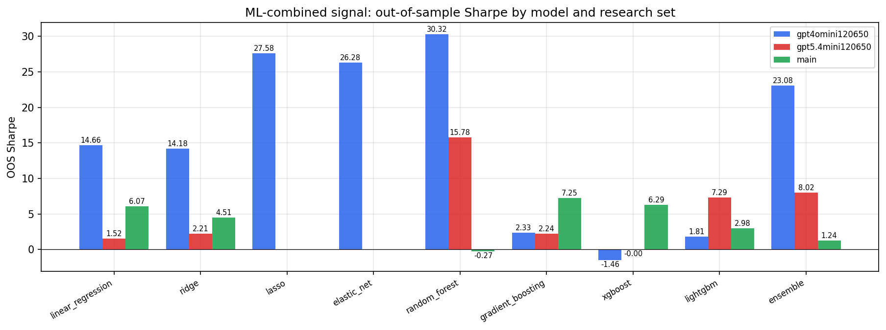

*ML-combined OOS Sharpe by model and research set*

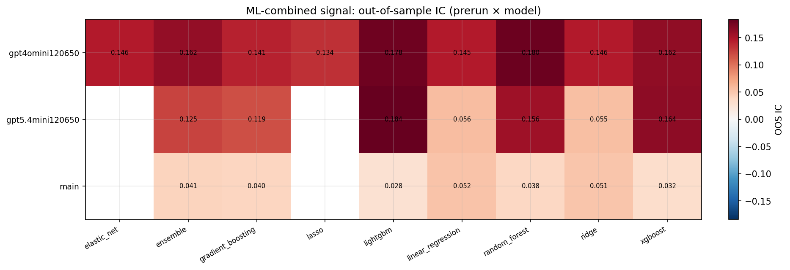

*ML-combined OOS IC (prerun × model)*

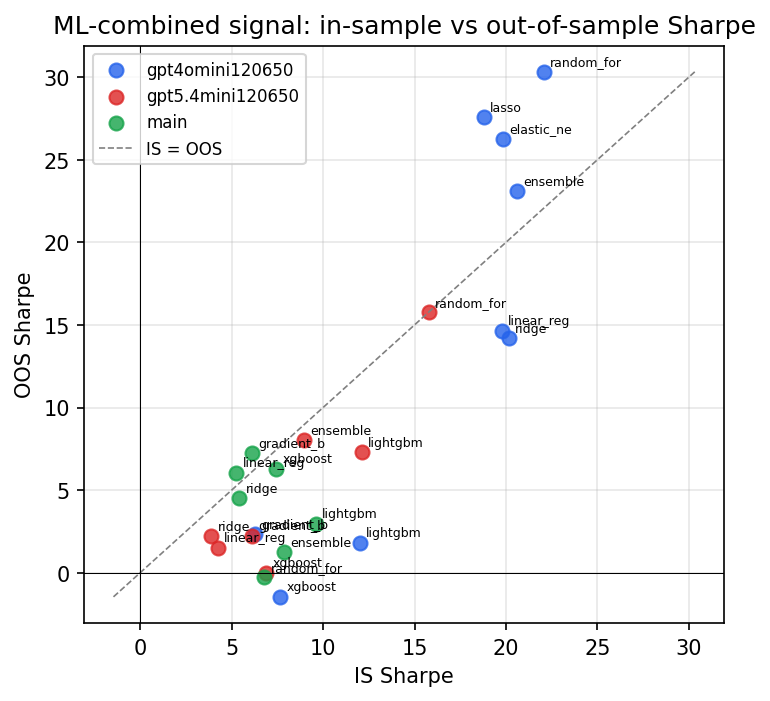

*IS vs OOS Sharpe (overfitting diagnostic)*

---
*Generated by `run_model_comparison.py`. Tables: `*.csv`; interactive: `comparison.ipynb`.*
