# Research-LLM factor comparison — `2026-05`

Comparing the **factor output of different research LLMs** on three axes (raw factor quality → factors as ML features → factors through the full agentic fund). The panel, IS/OOS split, horizon and model hyper-parameters are held identical across preruns — the *only* variable is the factor set.

## Preruns compared

| prerun | research_model | usable_factors | dropped_factors |
| --- | --- | --- | --- |
| gpt4omini120650 | gpt-4o-mini | 66 | 0 |
| gpt5.4mini120650 | gpt-5.4-mini | 69 | 0 |
| main | seed library | 77 | 11 |

> Dropped factors declare fields the current data doesn't have yet (e.g. fundamentals); they light up unchanged once that data is downloaded.

*Usable vs awaiting-data factors per research model*

## Key findings

- **Best ML-combined OOS Sharpe:** `gpt4omini120650` with `random_forest` (OOS Sharpe = 34.782).
- **Mean OOS Sharpe across models, by research set:** `gpt4omini120650` = 17.905, `gpt5.4mini120650` = 8.482, `main` = 5.909.
- **Highest mean single-factor |IC| (h=6):** `main` (mean |IC| = 0.0229).
- **Most diverse zoo (highest effective/raw factor ratio):** `gpt5.4mini120650` (eff 57.1 of 69, ratio 0.83).
- **Best selection-deflated single-factor |IC|:** `gpt4omini120650` (deflated |IC| = 0.1193 from 64 factors tried).

## 1. Single-factor IC (raw factor quality)

Per-underlying time-series Spearman rank-IC of every researched factor, recomputed on the shared panel at horizons h=1, h=6, h=60. The per-underlying IC correlates each factor's value vector with the underlying's own forward-return vector (pooled across underlyings); the cross-sectional IC ranks across underlyings per timestamp.

| prerun | n_factors | mean_abs_ic_1 | mean_abs_ic_6 | mean_abs_ic_60 | mean_abs_icir_6 | best_factor_h6 | best_abs_ic_h6 |
| --- | --- | --- | --- | --- | --- | --- | --- |
| gpt4omini120650 | 66 | 0.0128 | 0.0169 | 0.0162 | 0.6979 | liquidity_imbalance_trend | 0.1268 |
| gpt5.4mini120650 | 69 | 0.0061 | 0.0111 | 0.0136 | 0.5655 | auction_flow_divergence_reversion | 0.0419 |
| main | 77 | 0.0142 | 0.0229 | 0.0334 | 0.6008 | alpha_032 | 0.0971 |

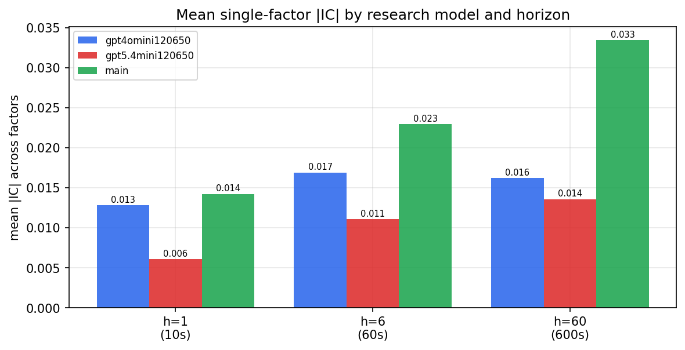

*Mean |IC| by research model and horizon*

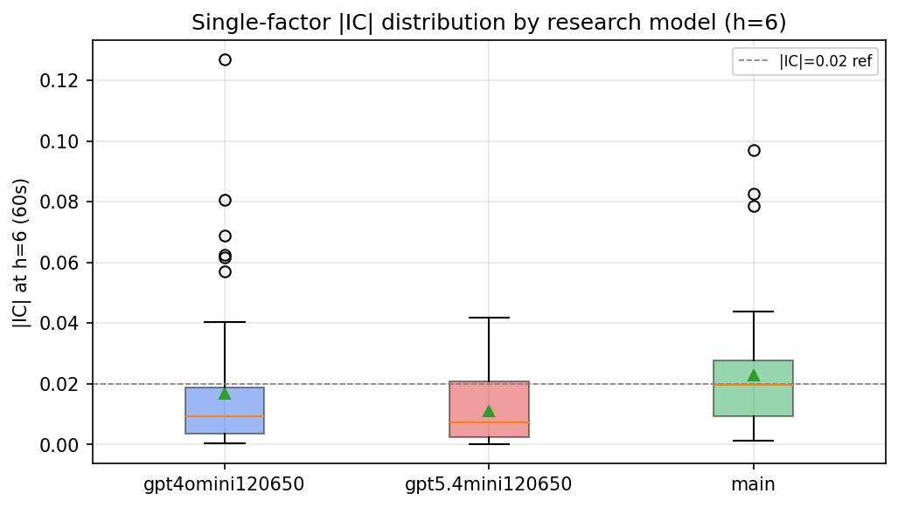

*Per-factor |IC| distribution by research model*

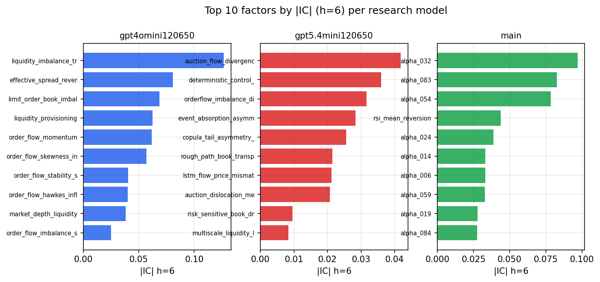

*Top factors by |IC| per research model*

## 2. Factor diversity & redundancy

Pairwise correlation of each zoo's *signals*. `eff_n_factors` is the effective number of independent factors (participation ratio of the correlation eigenvalues); `eff_ratio` and `redundancy` summarise how much unique information the zoo holds vs. how much is duplicated; `n_clusters` groups factors at |corr| ≥ 0.7.

| prerun | n_factors | eff_n_factors | eff_ratio | mean_abs_corr | n_clusters | redundancy |
| --- | --- | --- | --- | --- | --- | --- |
| gpt4omini120650 | 66 | 32.2677 | 0.4889 | 0.0451 | 57 | 0.5111 |
| gpt5.4mini120650 | 69 | 57.1144 | 0.8277 | 0.0084 | 65 | 0.1723 |
| main | 77 | 28.5495 | 0.3708 | 0.0506 | 55 | 0.6292 |

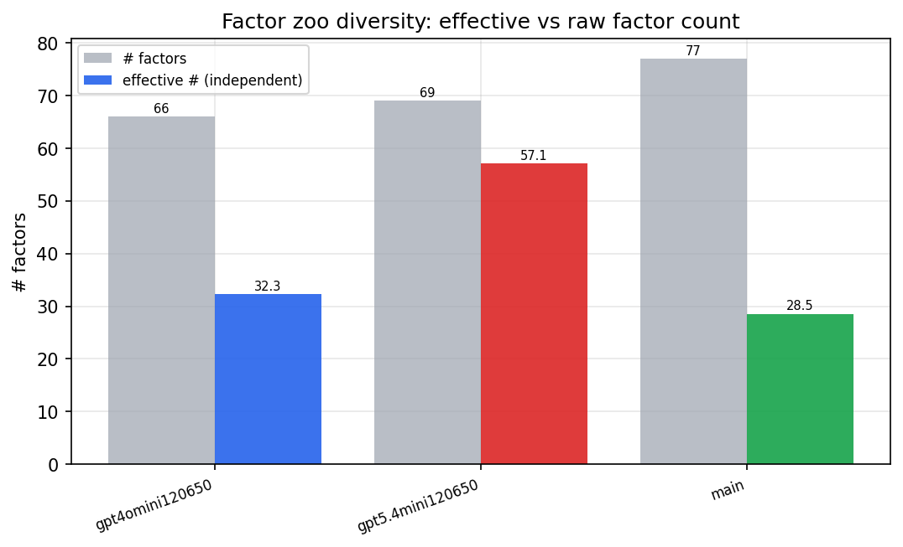

*Effective vs raw factor count per research model*

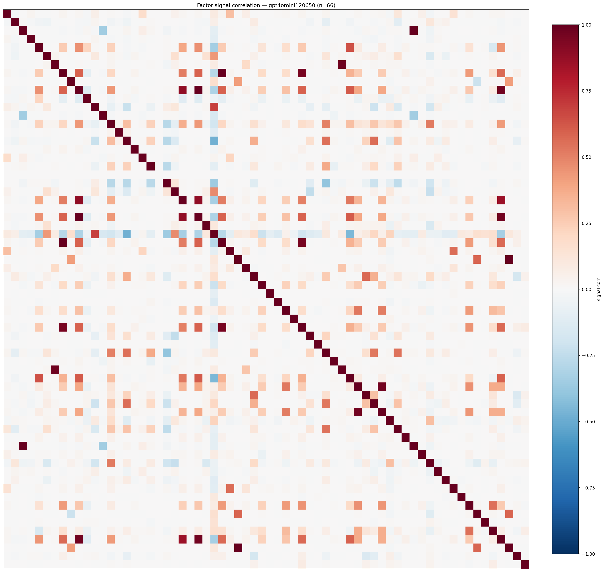

*Signal correlation matrix — gpt4omini120650*

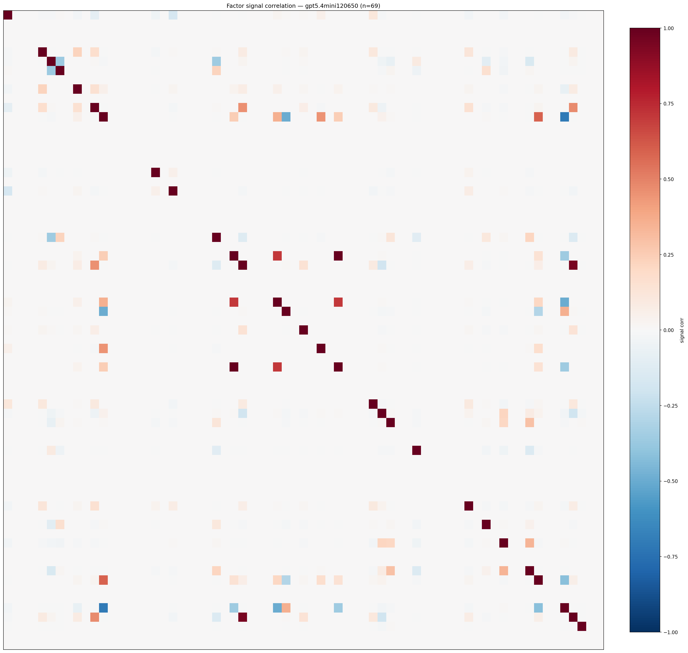

*Signal correlation matrix — gpt5.4mini120650*

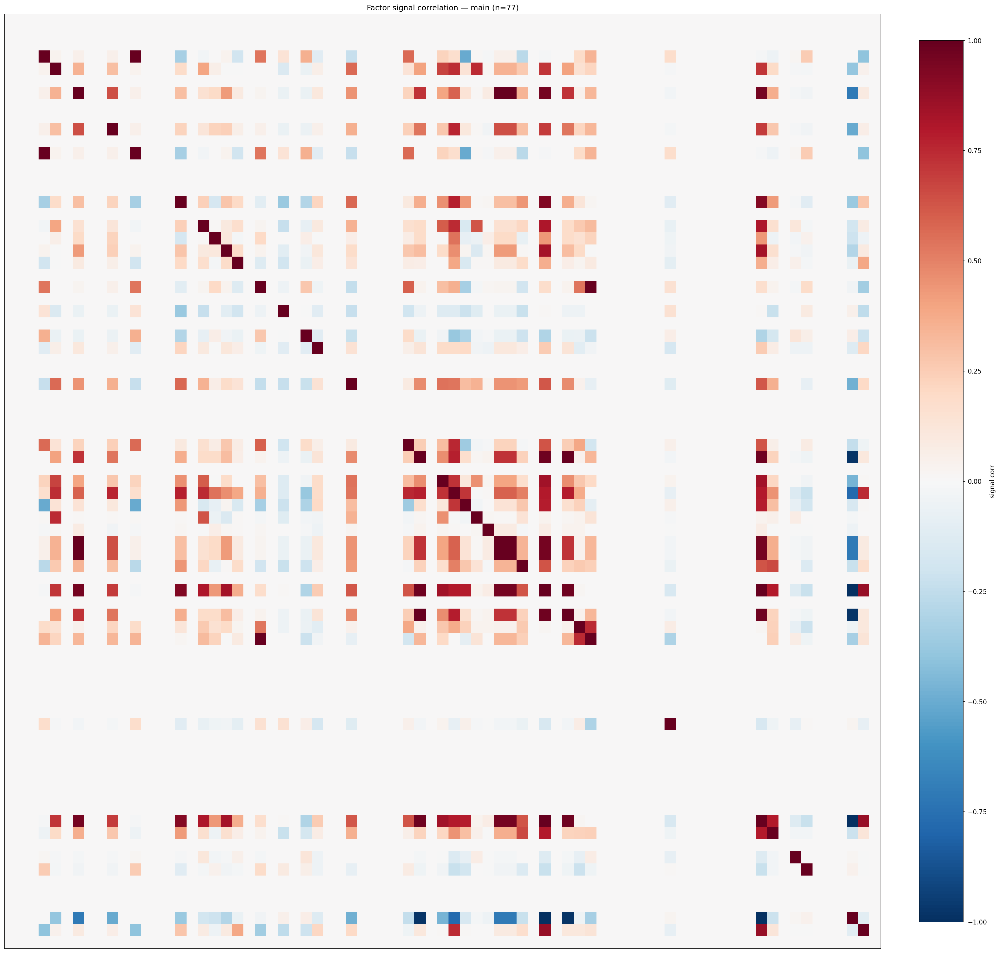

*Signal correlation matrix — main*

## 3. Deflation & model-based importance

`deflated_best_ic` haircuts each zoo's best |IC| for the number of factors tried (`ic_n_tested`) — a bigger zoo's best factor is more likely to be lucky. `lasso_n_nonzero` / `lasso_sparsity` show how many factors a sparse linear model actually keeps (model-view redundancy).

| prerun | best_ic | deflated_best_ic | deflated_best_t | ic_n_tested | ic_n_obs | lasso_n_nonzero | lasso_sparsity |
| --- | --- | --- | --- | --- | --- | --- | --- |
| gpt4omini120650 | 0.1268 | 0.1193 | 45.8064 | 64 | 147419 | 7 | 0.8939 |
| gpt5.4mini120650 | 0.0419 | 0.0351 | 13.475 | 29 | 147419 | 14 | 0.7971 |
| main | 0.0971 | 0.0901 | 34.586 | 36 | 147419 | 0 | 1.0 |

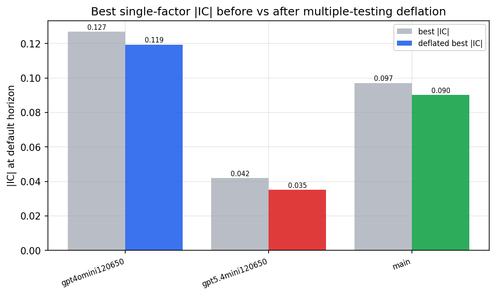

*Best |IC| before vs after multiple-testing deflation*

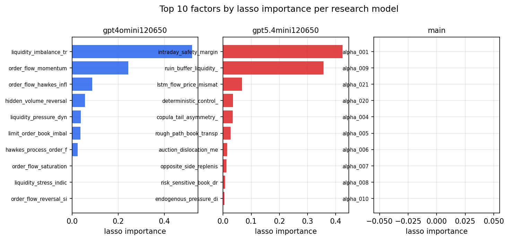

*Top factors by lasso importance per zoo*

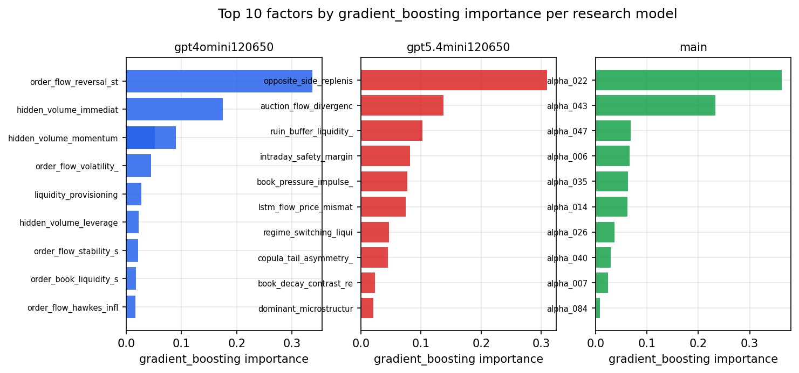

*Top factors by gradient_boosting importance per zoo*

## 4. ML-combined signal — per-underlying vectorised backtest

Each model combines a prerun's factors into ONE signal (fit `factors → forward return` on IS, predict per (bar, underlying)), then that combined signal is run through a simple vectorised backtest — `position(signal) × the underlying's own forward return` — on the held-out OOS tail (+ an equal-weight ensemble). No cross-sectional ranking.

> Config: position=**threshold** (t=1.0, z-score `expanding`), aggregation=**portfolio**, fit-standardise=**per_underlying**, horizon=6.

| prerun | model | n_factors_used | oos_ic | oos_sharpe | is_sharpe | oos_ann_return | oos_max_drawdown |
| --- | --- | --- | --- | --- | --- | --- | --- |
| gpt4omini120650 | linear_regression | 66 | 0.1594 | 24.896 | 17.1871 | 0.1327 | -0.0009 |
| gpt4omini120650 | ridge | 66 | 0.1626 | 25.2184 | 17.9829 | 0.1341 | -0.0009 |
| gpt4omini120650 | lasso | 66 | 0.1383 | 23.0814 | 12.1252 | 0.0948 | -0.0004 |
| gpt4omini120650 | elastic_net | 66 | 0.1383 | 21.4068 | 10.9314 | 0.0836 | -0.0004 |
| gpt4omini120650 | random_forest | 66 | 0.2015 | 34.7819 | 30.4708 | 0.2239 | -0.0006 |
| gpt4omini120650 | gradient_boosting | 66 | 0.1774 | -2.7513 | 7.2823 | -0.0065 | -0.0007 |
| gpt4omini120650 | xgboost | 66 | 0.1805 | -4.7704 | 10.3898 | -0.0118 | -0.001 |
| gpt4omini120650 | lightgbm | 66 | 0.2003 | 11.6882 | 15.6853 | 0.0392 | -0.0004 |
| gpt4omini120650 | ensemble | 66 | 0.1825 | 27.5927 | 18.7318 | 0.1426 | -0.0005 |
| gpt5.4mini120650 | linear_regression | 69 | 0.0529 | 10.0463 | 11.917 | 0.0661 | -0.0017 |
| gpt5.4mini120650 | ridge | 69 | 0.0533 | 10.6536 | 12.9939 | 0.0698 | -0.0017 |
| gpt5.4mini120650 | lasso | 69 | nan | nan | nan | nan | nan |
| gpt5.4mini120650 | elastic_net | 69 | nan | nan | nan | nan | nan |
| gpt5.4mini120650 | random_forest | 69 | 0.1417 | 20.4008 | 21.8166 | 0.1386 | -0.0015 |
| gpt5.4mini120650 | gradient_boosting | 69 | 0.1222 | -2.1272 | 6.4386 | -0.0056 | -0.0009 |
| gpt5.4mini120650 | xgboost | 69 | 0.161 | 2.6937 | 15.3469 | 0.0097 | -0.0008 |
| gpt5.4mini120650 | lightgbm | 69 | 0.1778 | 7.4194 | 16.8113 | 0.0265 | -0.0007 |
| gpt5.4mini120650 | ensemble | 69 | 0.1269 | 10.2888 | 19.3143 | 0.0618 | -0.0018 |
| main | linear_regression | 77 | 0.0348 | 7.2023 | 6.2369 | 0.0362 | -0.0007 |
| main | ridge | 77 | 0.0365 | 7.8187 | 6.0916 | 0.0405 | -0.0006 |
| main | lasso | 77 | nan | nan | nan | nan | nan |
| main | elastic_net | 77 | nan | nan | nan | nan | nan |
| main | random_forest | 77 | 0.0481 | 4.3311 | 8.4351 | 0.0185 | -0.0007 |
| main | gradient_boosting | 77 | 0.0481 | 5.5276 | 5.7004 | 0.0112 | -0.0001 |
| main | xgboost | 77 | 0.0405 | 7.5564 | 7.8381 | 0.016 | -0.0001 |
| main | lightgbm | 77 | 0.0397 | 3.3981 | 11.578 | 0.0079 | -0.0003 |
| main | ensemble | 77 | 0.0428 | 5.5296 | 9.8762 | 0.024 | -0.0005 |

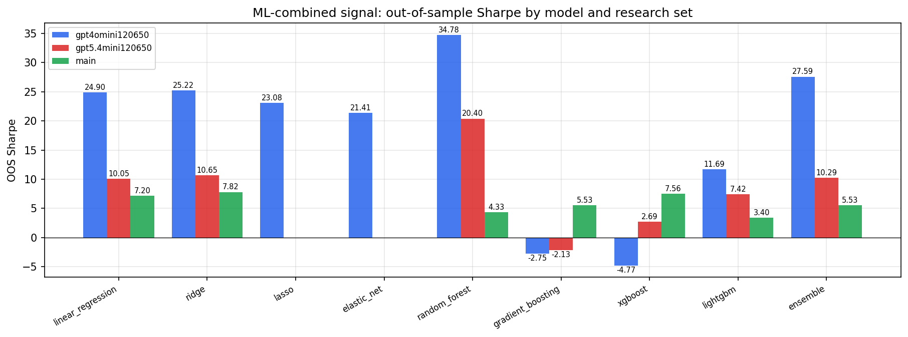

*ML-combined OOS Sharpe by model and research set*

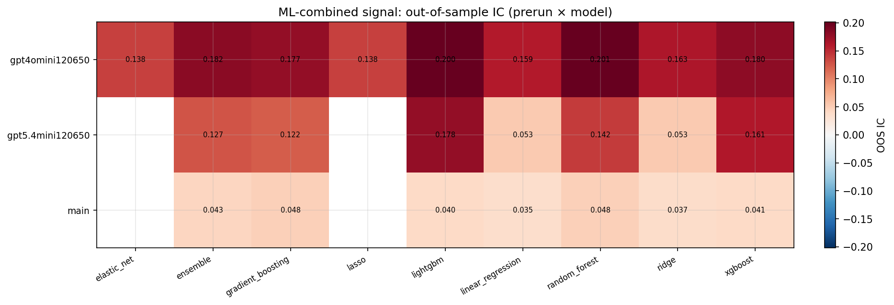

*ML-combined OOS IC (prerun × model)*

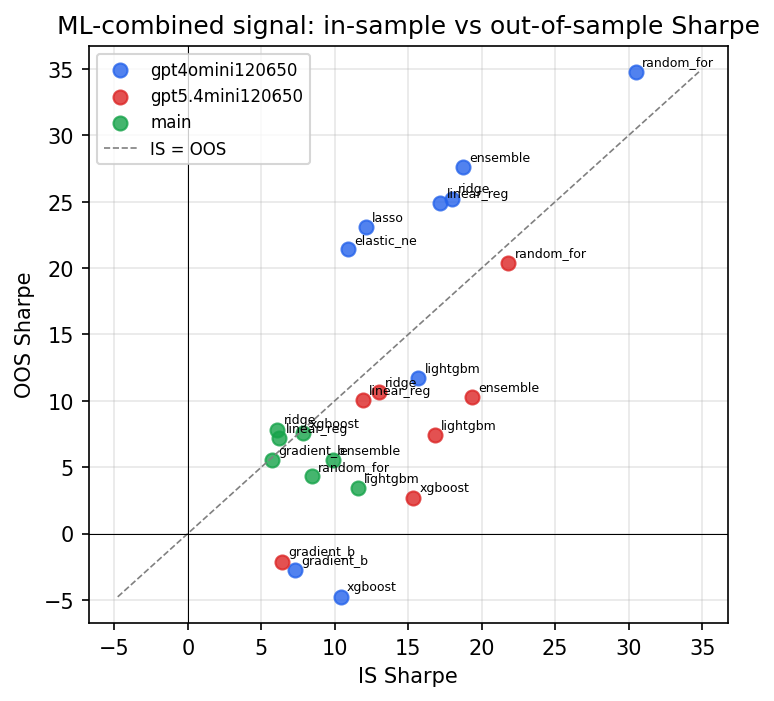

*IS vs OOS Sharpe (overfitting diagnostic)*

---
*Generated by `run_model_comparison.py`. Tables: `*.csv`; interactive: `comparison.ipynb`.*
