# Research-LLM factor comparison — `2026-06`

Comparing the **factor output of different research LLMs** on three axes (raw factor quality → factors as ML features → factors through the full agentic fund). The panel, IS/OOS split, horizon and model hyper-parameters are held identical across preruns — the *only* variable is the factor set.

## Preruns compared

| prerun | research_model | usable_factors | dropped_factors |
| --- | --- | --- | --- |
| gpt4omini120650 | gpt-4o-mini | 66 | 0 |
| gpt5.4mini120650 | gpt-5.4-mini | 69 | 0 |
| main | seed library | 77 | 11 |

> Dropped factors declare fields the current data doesn't have yet (e.g. fundamentals); they light up unchanged once that data is downloaded.

*Usable vs awaiting-data factors per research model*

## Key findings

- **Best ML-combined OOS Sharpe:** `gpt4omini120650` with `ensemble` (OOS Sharpe = 54.534).
- **Mean OOS Sharpe across models, by research set:** `gpt4omini120650` = 39.198, `gpt5.4mini120650` = 34.253, `main` = 13.262.
- **Highest mean single-factor |IC| (h=6):** `main` (mean |IC| = 0.0257).
- **Most diverse zoo (highest effective/raw factor ratio):** `gpt5.4mini120650` (eff 55.6 of 69, ratio 0.81).
- **Best selection-deflated single-factor |IC|:** `gpt4omini120650` (deflated |IC| = 0.1236 from 64 factors tried).

## 1. Single-factor IC (raw factor quality)

Per-underlying time-series Spearman rank-IC of every researched factor, recomputed on the shared panel at horizons h=1, h=6, h=60. The per-underlying IC correlates each factor's value vector with the underlying's own forward-return vector (pooled across underlyings); the cross-sectional IC ranks across underlyings per timestamp.

| prerun | n_factors | mean_abs_ic_1 | mean_abs_ic_6 | mean_abs_ic_60 | mean_abs_icir_6 | best_factor_h6 | best_abs_ic_h6 |
| --- | --- | --- | --- | --- | --- | --- | --- |
| gpt4omini120650 | 66 | 0.0111 | 0.0173 | 0.0178 | 0.553 | liquidity_imbalance_trend | 0.1328 |
| gpt5.4mini120650 | 69 | 0.0064 | 0.0102 | 0.0162 | 0.4351 | auction_flow_divergence_reversion | 0.0427 |
| main | 77 | 0.0169 | 0.0257 | 0.0429 | 0.4872 | alpha_032 | 0.1182 |

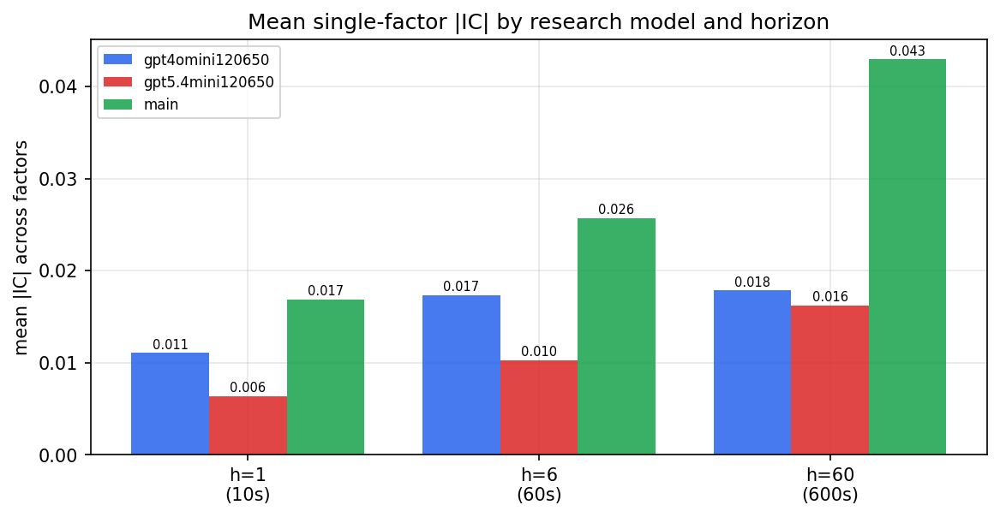

*Mean |IC| by research model and horizon*

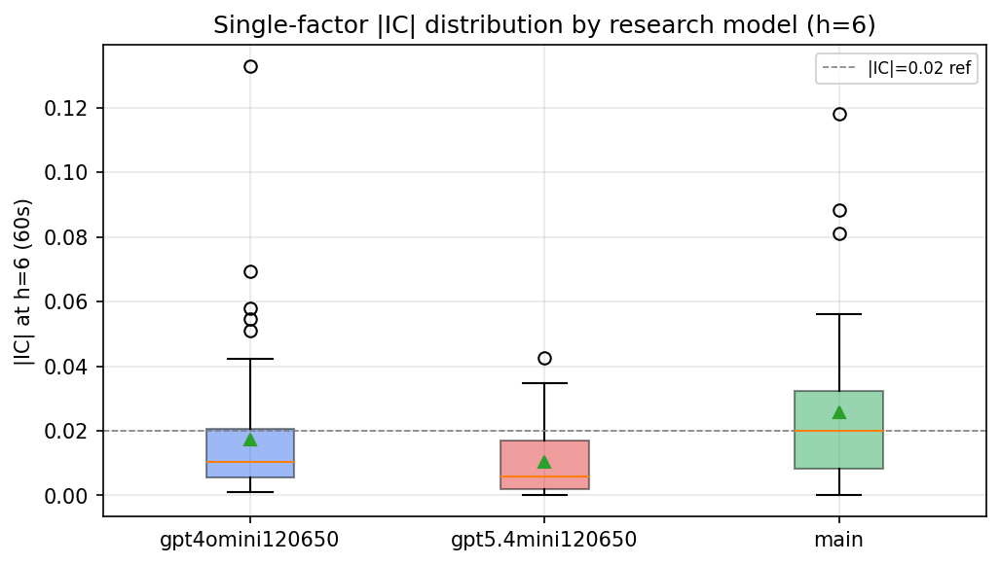

*Per-factor |IC| distribution by research model*

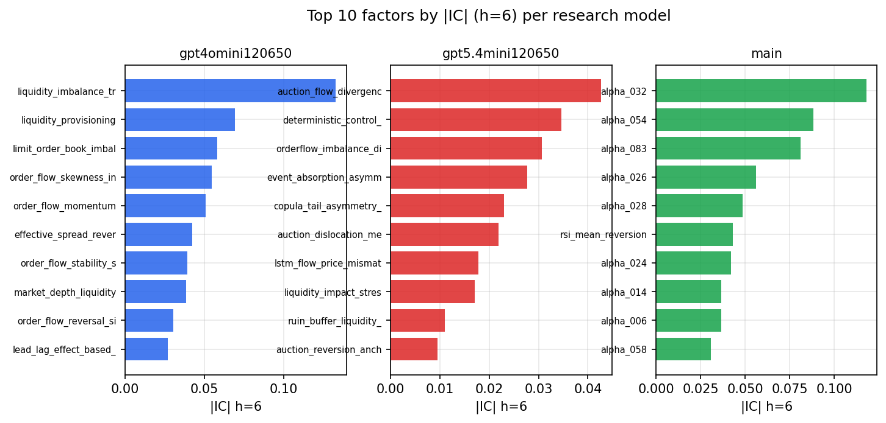

*Top factors by |IC| per research model*

## 2. Factor diversity & redundancy

Pairwise correlation of each zoo's *signals*. `eff_n_factors` is the effective number of independent factors (participation ratio of the correlation eigenvalues); `eff_ratio` and `redundancy` summarise how much unique information the zoo holds vs. how much is duplicated; `n_clusters` groups factors at |corr| ≥ 0.7.

| prerun | n_factors | eff_n_factors | eff_ratio | mean_abs_corr | n_clusters | redundancy |
| --- | --- | --- | --- | --- | --- | --- |
| gpt4omini120650 | 66 | 33.1911 | 0.5029 | 0.0451 | 57 | 0.4971 |
| gpt5.4mini120650 | 69 | 55.5874 | 0.8056 | 0.0088 | 65 | 0.1944 |
| main | 77 | 29.9268 | 0.3887 | 0.0483 | 57 | 0.6113 |

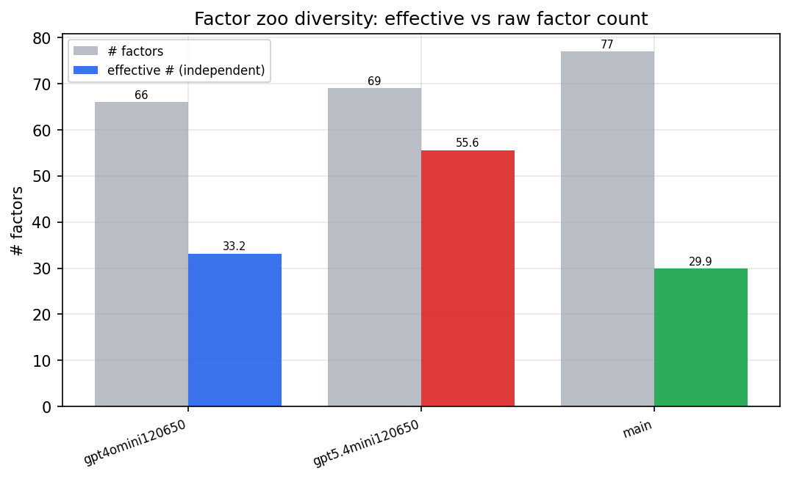

*Effective vs raw factor count per research model*

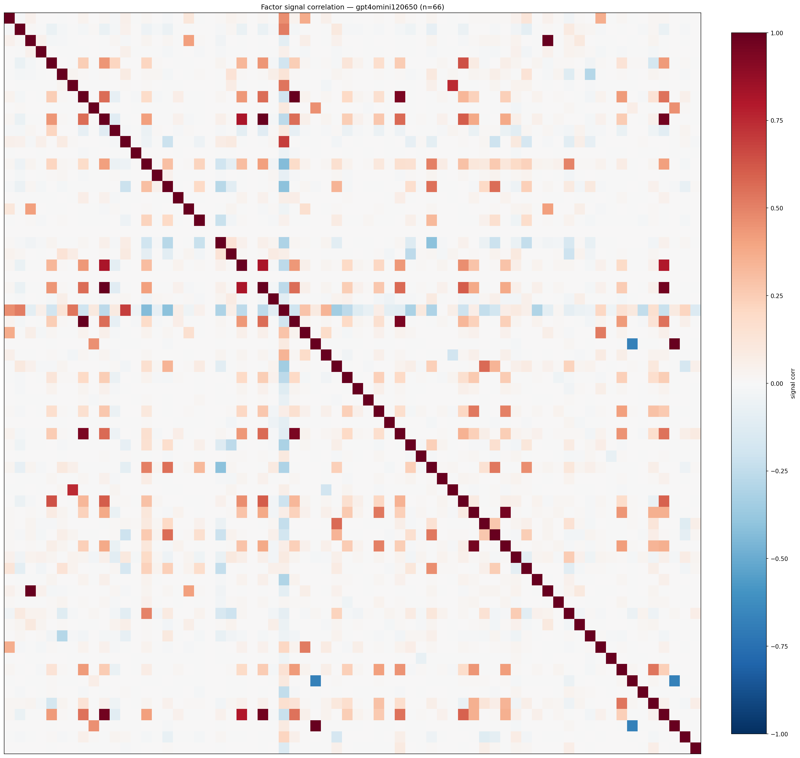

*Signal correlation matrix — gpt4omini120650*

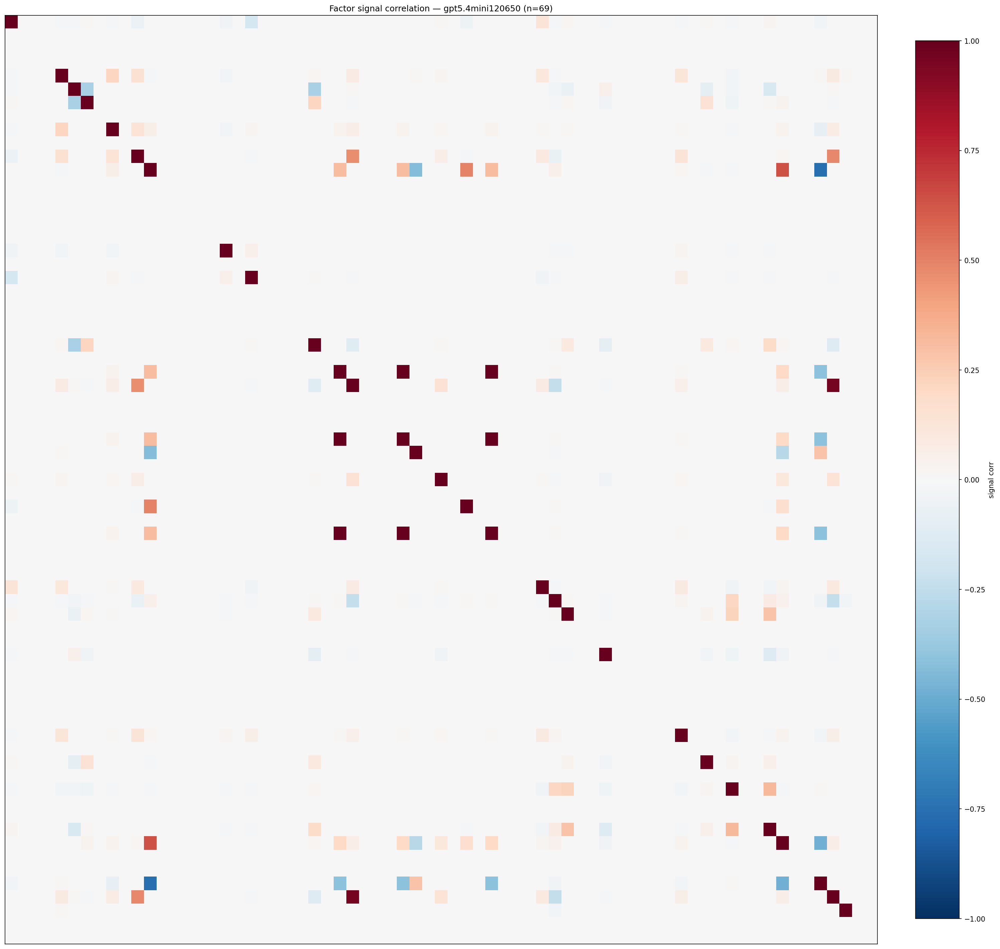

*Signal correlation matrix — gpt5.4mini120650*

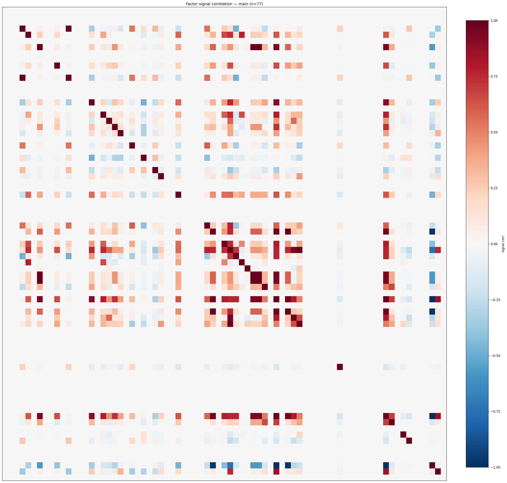

*Signal correlation matrix — main*

## 3. Deflation & model-based importance

`deflated_best_ic` haircuts each zoo's best |IC| for the number of factors tried (`ic_n_tested`) — a bigger zoo's best factor is more likely to be lucky. `lasso_n_nonzero` / `lasso_sparsity` show how many factors a sparse linear model actually keeps (model-view redundancy).

| prerun | best_ic | deflated_best_ic | deflated_best_t | ic_n_tested | ic_n_obs | lasso_n_nonzero | lasso_sparsity |
| --- | --- | --- | --- | --- | --- | --- | --- |
| gpt4omini120650 | 0.1328 | 0.1236 | 38.7465 | 64 | 98279 | 14 | 0.7879 |
| gpt5.4mini120650 | 0.0427 | 0.0344 | 10.7929 | 29 | 98279 | 0 | 1.0 |
| main | 0.1182 | 0.1097 | 34.3778 | 36 | 98279 | 17 | 0.7792 |

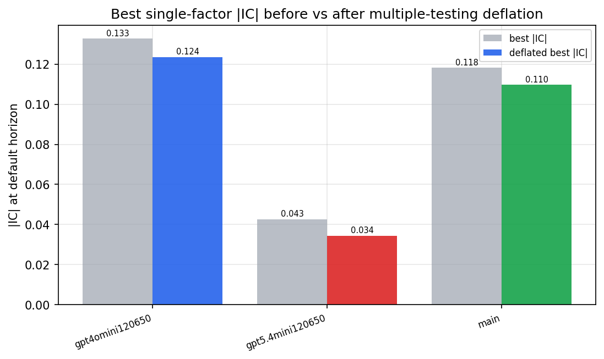

*Best |IC| before vs after multiple-testing deflation*

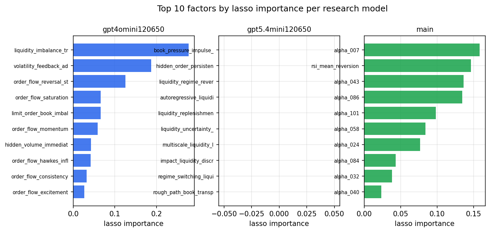

*Top factors by lasso importance per zoo*

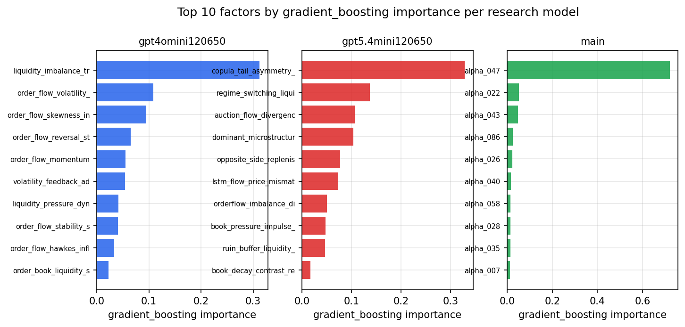

*Top factors by gradient_boosting importance per zoo*

## 4. ML-combined signal — per-underlying vectorised backtest

Each model combines a prerun's factors into ONE signal (fit `factors → forward return` on IS, predict per (bar, underlying)), then that combined signal is run through a simple vectorised backtest — `position(signal) × the underlying's own forward return` — on the held-out OOS tail (+ an equal-weight ensemble). No cross-sectional ranking.

> Config: position=**threshold** (t=1.0, z-score `expanding`), aggregation=**portfolio**, fit-standardise=**per_underlying**, horizon=6.

| prerun | model | n_factors_used | oos_ic | oos_sharpe | is_sharpe | oos_ann_return | oos_max_drawdown |
| --- | --- | --- | --- | --- | --- | --- | --- |
| gpt4omini120650 | linear_regression | 66 | 0.159 | 51.1776 | 19.8703 | 0.3256 | -0.0002 |
| gpt4omini120650 | ridge | 66 | 0.1612 | 53.3511 | 19.9148 | 0.3358 | -0.0001 |
| gpt4omini120650 | lasso | 66 | 0.1277 | 36.3962 | 19.8506 | 0.2871 | -0.0001 |
| gpt4omini120650 | elastic_net | 66 | 0.1277 | 36.3962 | 19.8506 | 0.2871 | -0.0001 |
| gpt4omini120650 | random_forest | 66 | 0.2091 | 42.3487 | 18.4397 | 0.2102 | -0.0001 |
| gpt4omini120650 | gradient_boosting | 66 | 0.1584 | 15.8779 | 7.1842 | 0.0051 | 0.0 |
| gpt4omini120650 | xgboost | 66 | 0.1715 | 28.7265 | 9.5254 | 0.0282 | -0.0 |
| gpt4omini120650 | lightgbm | 66 | 0.2061 | 33.977 | 12.324 | 0.0615 | -0.0 |
| gpt4omini120650 | ensemble | 66 | 0.1771 | 54.534 | 23.3438 | 0.382 | -0.0001 |
| gpt5.4mini120650 | linear_regression | 69 | 0.065 | 48.9463 | 8.5999 | 0.1564 | -0.0 |
| gpt5.4mini120650 | ridge | 69 | 0.0658 | 48.82 | 8.6042 | 0.1564 | -0.0 |
| gpt5.4mini120650 | lasso | 69 | nan | nan | nan | nan | nan |
| gpt5.4mini120650 | elastic_net | 69 | nan | nan | nan | nan | nan |
| gpt5.4mini120650 | random_forest | 69 | 0.1521 | 41.4494 | 14.6987 | 0.1308 | -0.0001 |
| gpt5.4mini120650 | gradient_boosting | 69 | 0.1555 | 6.0027 | 5.9593 | 0.0051 | -0.0 |
| gpt5.4mini120650 | xgboost | 69 | 0.1852 | 13.42 | 10.7074 | 0.0128 | -0.0 |
| gpt5.4mini120650 | lightgbm | 69 | 0.1975 | 28.9132 | 11.6775 | 0.0333 | -0.0 |
| gpt5.4mini120650 | ensemble | 69 | 0.0772 | 52.2193 | 13.0532 | 0.1231 | -0.0 |
| main | linear_regression | 77 | 0.0402 | 15.1539 | 8.5112 | 0.0667 | -0.0003 |
| main | ridge | 77 | 0.0343 | 9.5579 | 8.8928 | 0.0385 | -0.0002 |
| main | lasso | 77 | 0.0322 | 14.8844 | 8.0183 | 0.059 | -0.0002 |
| main | elastic_net | 77 | 0.0319 | 13.5453 | 7.9363 | 0.0539 | -0.0002 |
| main | random_forest | 77 | 0.0084 | 17.9159 | 9.3731 | 0.0744 | -0.0001 |
| main | gradient_boosting | 77 | 0.03 | 13.7743 | 10.5612 | 0.0154 | -0.0 |
| main | xgboost | 77 | 0.0209 | -1.1448 | 11.2157 | -0.0025 | -0.0001 |
| main | lightgbm | 77 | -0.0037 | 18.3633 | 13.4663 | 0.0564 | -0.0001 |
| main | ensemble | 77 | 0.0234 | 17.308 | 11.5233 | 0.0641 | -0.0002 |

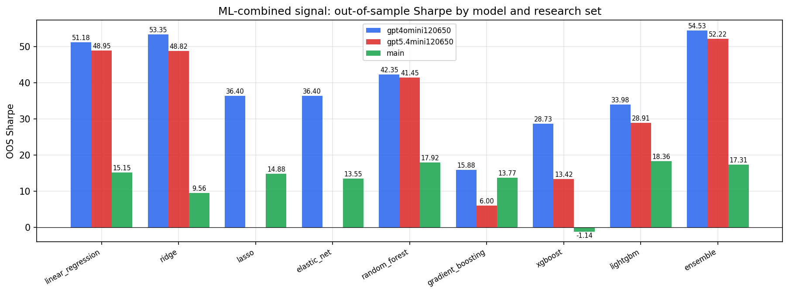

*ML-combined OOS Sharpe by model and research set*

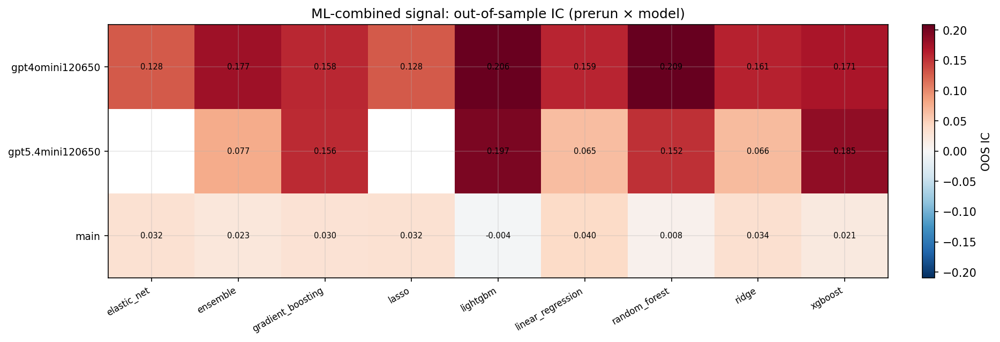

*ML-combined OOS IC (prerun × model)*

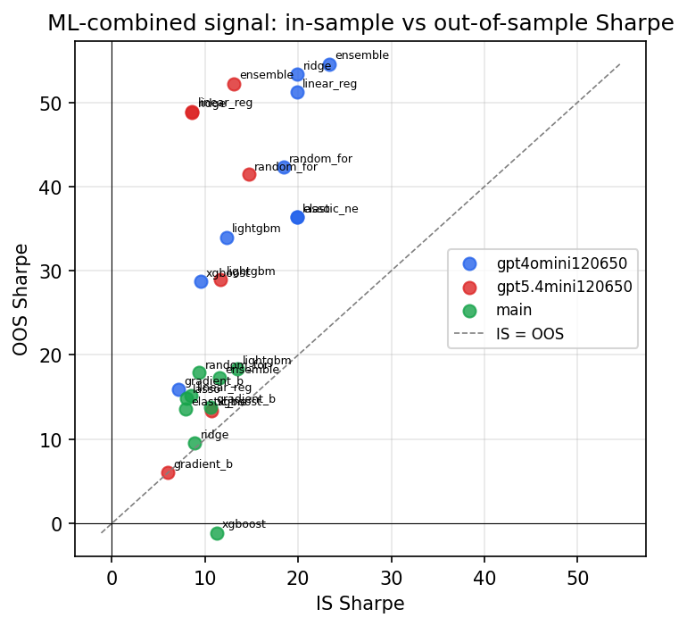

*IS vs OOS Sharpe (overfitting diagnostic)*

---
*Generated by `run_model_comparison.py`. Tables: `*.csv`; interactive: `comparison.ipynb`.*
