# Research-LLM factor comparison — `2024-03`

Comparing the **factor output of different research LLMs** on three axes (raw factor quality → factors as ML features → factors through the full agentic fund). The panel, IS/OOS split, horizon and model hyper-parameters are held identical across preruns — the *only* variable is the factor set.

## Preruns compared

| prerun | research_model | usable_factors | dropped_factors |
| --- | --- | --- | --- |
| gpt4omini120650 | gpt-4o-mini | 66 | 0 |
| gpt5.4mini120650 | gpt-5.4-mini | 69 | 0 |
| main | seed library | 78 | 10 |

> Dropped factors declare fields the current data doesn't have yet (e.g. fundamentals); they light up unchanged once that data is downloaded.

*Usable vs awaiting-data factors per research model*

## Key findings

- **Best ML-combined OOS Sharpe:** `gpt4omini120650` with `ridge` (OOS Sharpe = 5.112).
- **Mean OOS Sharpe across models, by research set:** `gpt4omini120650` = 3.454, `gpt5.4mini120650` = -0.882, `main` = -1.397.
- **Highest mean single-factor |IC| (h=6):** `main` (mean |IC| = 0.0082).
- **Most diverse zoo (highest effective/raw factor ratio):** `gpt5.4mini120650` (eff 46.1 of 69, ratio 0.67).
- **Best selection-deflated single-factor |IC|:** `gpt4omini120650` (deflated |IC| = 0.0159 from 64 factors tried).

## 1. Single-factor IC (raw factor quality)

Per-underlying time-series Spearman rank-IC of every researched factor, recomputed on the shared panel at horizons h=1, h=6, h=60. The per-underlying IC correlates each factor's value vector with the underlying's own forward-return vector (pooled across underlyings); the cross-sectional IC ranks across underlyings per timestamp.

| prerun | n_factors | mean_abs_ic_1 | mean_abs_ic_6 | mean_abs_ic_60 | mean_abs_icir_6 | best_factor_h6 | best_abs_ic_h6 |
| --- | --- | --- | --- | --- | --- | --- | --- |
| gpt4omini120650 | 66 | 0.0062 | 0.0075 | 0.0076 | 0.4192 | hawkes_process_order_flow_indicator | 0.0235 |
| gpt5.4mini120650 | 69 | 0.0039 | 0.0054 | 0.0073 | 0.3973 | lstm_flow_price_mismatch | 0.0194 |
| main | 78 | 0.0084 | 0.0082 | 0.0061 | 0.5072 | alpha_035 | 0.019 |

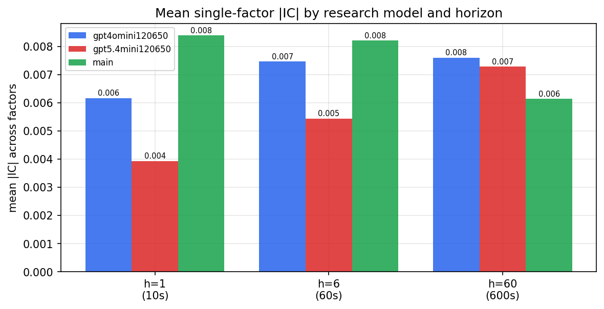

*Mean |IC| by research model and horizon*

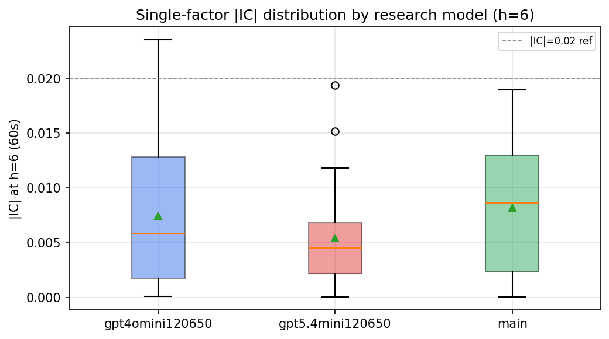

*Per-factor |IC| distribution by research model*

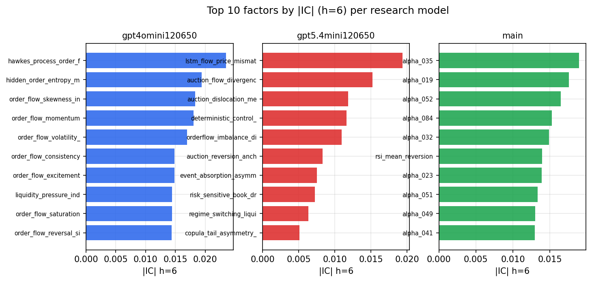

*Top factors by |IC| per research model*

## 2. Factor diversity & redundancy

Pairwise correlation of each zoo's *signals*. `eff_n_factors` is the effective number of independent factors (participation ratio of the correlation eigenvalues); `eff_ratio` and `redundancy` summarise how much unique information the zoo holds vs. how much is duplicated; `n_clusters` groups factors at |corr| ≥ 0.7.

| prerun | n_factors | eff_n_factors | eff_ratio | mean_abs_corr | n_clusters | redundancy |
| --- | --- | --- | --- | --- | --- | --- |
| gpt4omini120650 | 66 | 25.4991 | 0.3864 | 0.0533 | 51 | 0.6137 |
| gpt5.4mini120650 | 69 | 46.12 | 0.6684 | 0.0145 | 61 | 0.3316 |
| main | 78 | 41.6026 | 0.5334 | 0.0288 | 70 | 0.4666 |

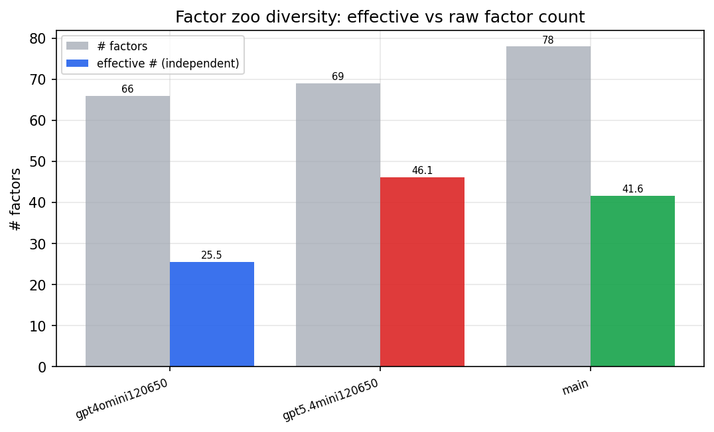

*Effective vs raw factor count per research model*

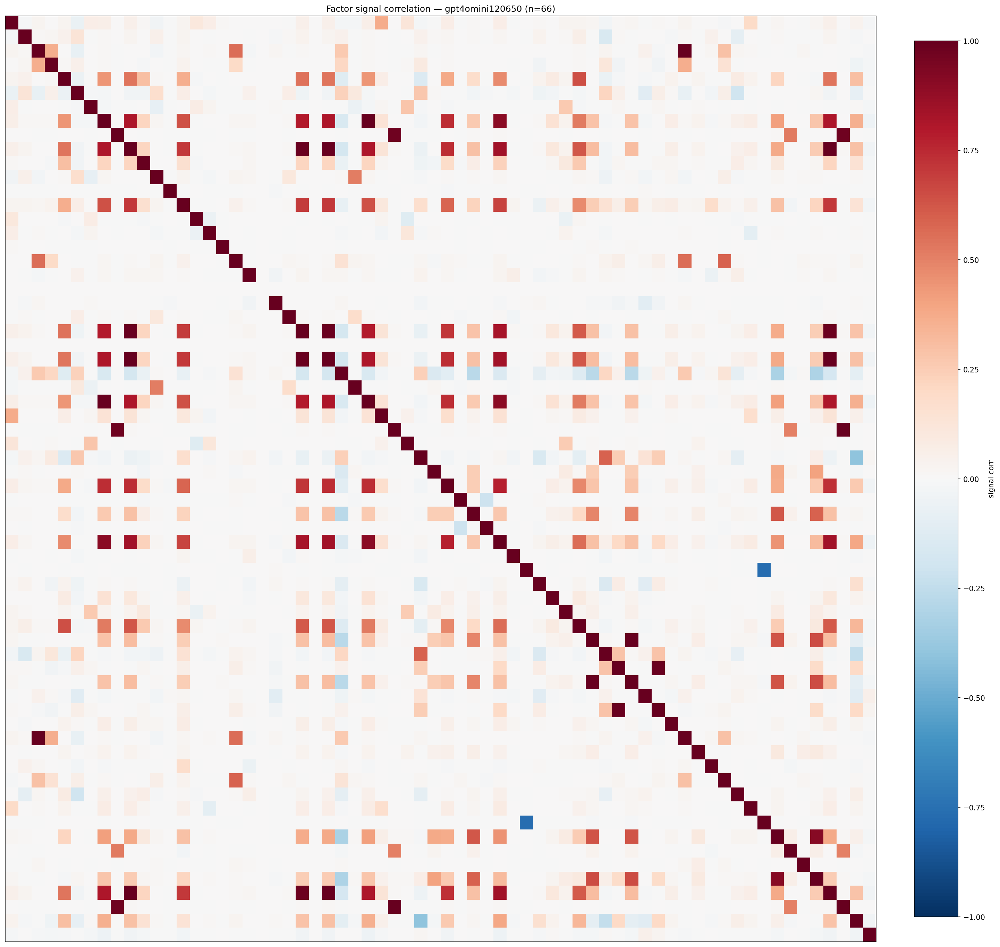

*Signal correlation matrix — gpt4omini120650*

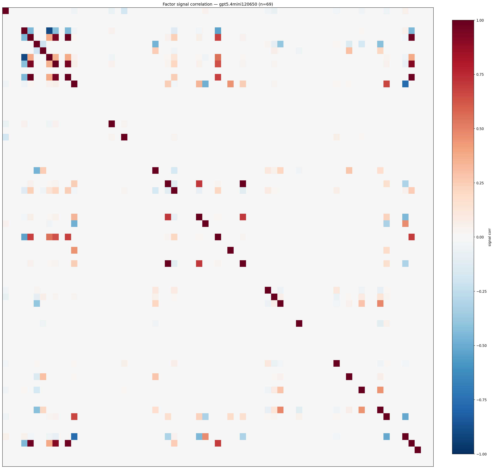

*Signal correlation matrix — gpt5.4mini120650*

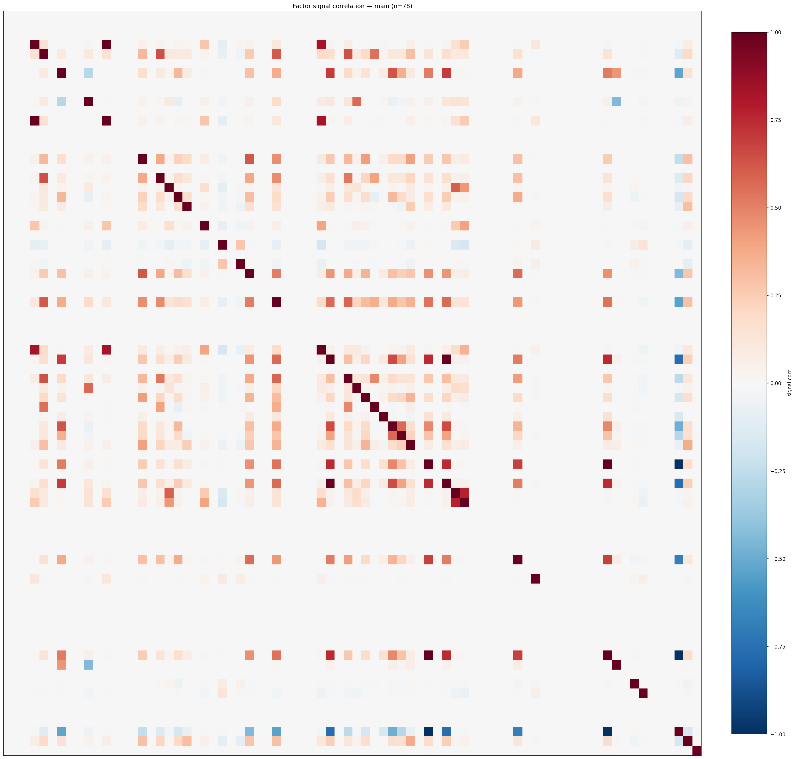

*Signal correlation matrix — main*

## 3. Deflation & model-based importance

`deflated_best_ic` haircuts each zoo's best |IC| for the number of factors tried (`ic_n_tested`) — a bigger zoo's best factor is more likely to be lucky. `lasso_n_nonzero` / `lasso_sparsity` show how many factors a sparse linear model actually keeps (model-view redundancy).

| prerun | best_ic | deflated_best_ic | deflated_best_t | ic_n_tested | ic_n_obs | lasso_n_nonzero | lasso_sparsity |
| --- | --- | --- | --- | --- | --- | --- | --- |
| gpt4omini120650 | 0.0235 | 0.0159 | 5.9987 | 64 | 142739 | 2 | 0.9697 |
| gpt5.4mini120650 | 0.0194 | 0.0124 | 4.7025 | 31 | 142739 | 0 | 1.0 |
| main | 0.019 | 0.0118 | 4.4663 | 38 | 142739 | 0 | 1.0 |

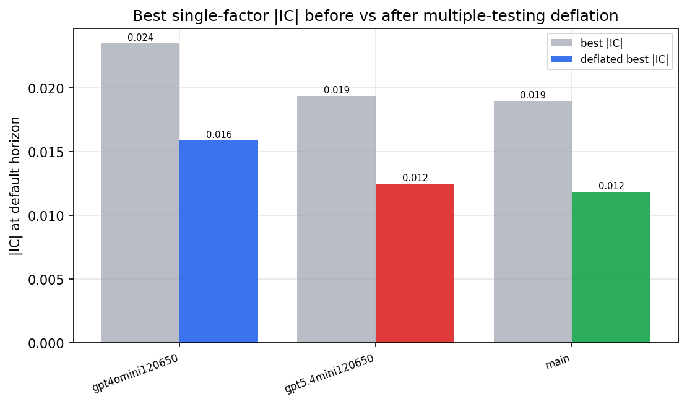

*Best |IC| before vs after multiple-testing deflation*

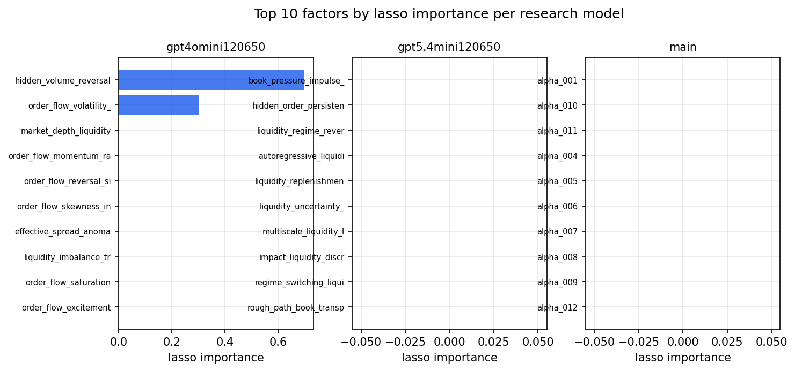

*Top factors by lasso importance per zoo*

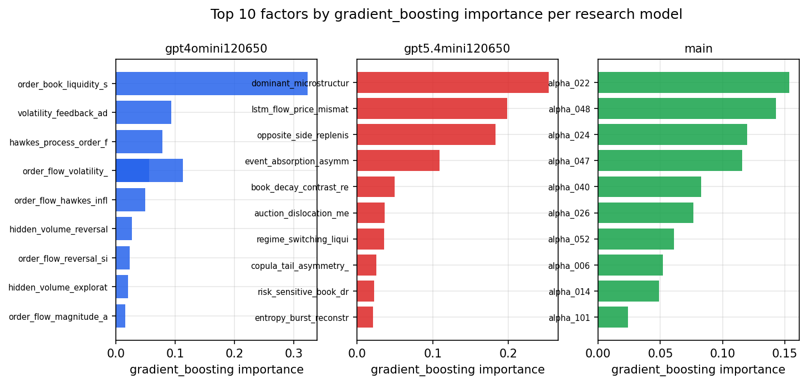

*Top factors by gradient_boosting importance per zoo*

## 4. ML-combined signal — per-underlying vectorised backtest

Each model combines a prerun's factors into ONE signal (fit `factors → forward return` on IS, predict per (bar, underlying)), then that combined signal is run through a simple vectorised backtest — `position(signal) × the underlying's own forward return` — on the held-out OOS tail (+ an equal-weight ensemble). No cross-sectional ranking.

> Config: position=**threshold** (t=1.0, z-score `expanding`), aggregation=**portfolio**, fit-standardise=**per_underlying**, horizon=6.

| prerun | model | n_factors_used | oos_ic | oos_sharpe | is_sharpe | oos_ann_return | oos_max_drawdown |
| --- | --- | --- | --- | --- | --- | --- | --- |
| gpt4omini120650 | linear_regression | 66 | 0.0058 | 4.3275 | 9.8716 | 0.2388 | -0.0068 |
| gpt4omini120650 | ridge | 66 | 0.0075 | 5.1115 | 9.0197 | 0.3018 | -0.0084 |
| gpt4omini120650 | lasso | 66 | 0.021 | 2.5843 | 3.1832 | 0.1628 | -0.0104 |
| gpt4omini120650 | elastic_net | 66 | 0.0208 | 2.5903 | 3.1751 | 0.1633 | -0.0106 |
| gpt4omini120650 | random_forest | 66 | -0.0009 | 1.3529 | 9.233 | 0.0659 | -0.0112 |
| gpt4omini120650 | gradient_boosting | 66 | -0.0037 | 4.1718 | 8.7779 | 0.1792 | -0.004 |
| gpt4omini120650 | xgboost | 66 | 0.0003 | 3.8616 | 12.0639 | 0.201 | -0.0078 |
| gpt4omini120650 | lightgbm | 66 | -0.0005 | 2.6673 | 15.8381 | 0.1257 | -0.0123 |
| gpt4omini120650 | ensemble | 66 | 0.0116 | 4.4199 | 11.4144 | 0.2353 | -0.0059 |
| gpt5.4mini120650 | linear_regression | 69 | 0.0057 | -4.7484 | 7.3135 | -0.285 | -0.025 |
| gpt5.4mini120650 | ridge | 69 | 0.0072 | -4.816 | 7.4598 | -0.2876 | -0.0254 |
| gpt5.4mini120650 | lasso | 69 | 0.0112 | -3.2442 | 4.8184 | -0.1939 | -0.0201 |
| gpt5.4mini120650 | elastic_net | 69 | 0.0112 | -3.2442 | 4.8184 | -0.1939 | -0.0201 |
| gpt5.4mini120650 | random_forest | 69 | 0.0133 | 1.238 | 7.8664 | 0.0655 | -0.0064 |
| gpt5.4mini120650 | gradient_boosting | 69 | 0.0129 | 0.9692 | 9.1721 | 0.0324 | -0.0067 |
| gpt5.4mini120650 | xgboost | 69 | 0.0139 | 3.3373 | 10.2922 | 0.1617 | -0.0063 |
| gpt5.4mini120650 | lightgbm | 69 | 0.015 | 4.0547 | 14.2427 | 0.1988 | -0.0043 |
| gpt5.4mini120650 | ensemble | 69 | 0.0144 | -1.4863 | 11.2618 | -0.0854 | -0.0131 |
| main | linear_regression | 78 | 0.0011 | -3.3709 | 8.2589 | -0.1767 | -0.0178 |
| main | ridge | 78 | 0.0004 | -4.137 | 8.6864 | -0.2185 | -0.0205 |
| main | lasso | 78 | nan | nan | nan | nan | nan |
| main | elastic_net | 78 | nan | nan | nan | nan | nan |
| main | random_forest | 78 | 0.0116 | -0.5846 | 10.0894 | -0.0168 | -0.0085 |
| main | gradient_boosting | 78 | 0.0114 | -0.4298 | 10.6522 | -0.0108 | -0.0086 |
| main | xgboost | 78 | 0.0109 | -0.1621 | 13.1877 | -0.0034 | -0.0063 |
| main | lightgbm | 78 | 0.0029 | 0.7103 | 19.8104 | 0.0142 | -0.0068 |
| main | ensemble | 78 | 0.0039 | -1.8059 | 15.4964 | -0.0611 | -0.0105 |

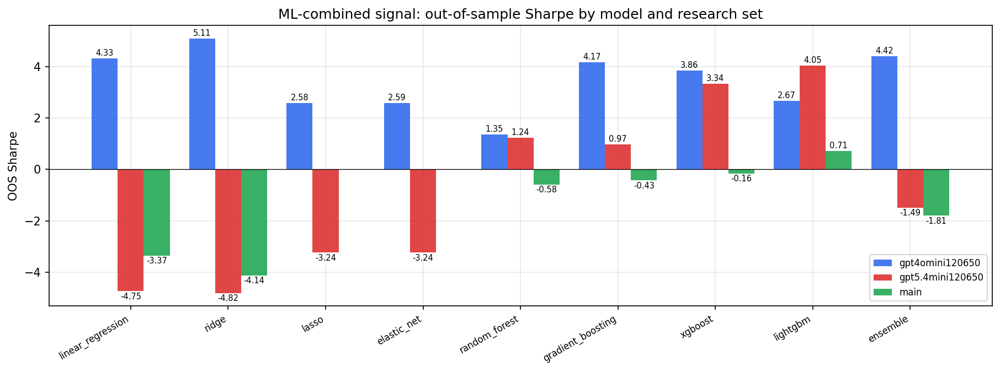

*ML-combined OOS Sharpe by model and research set*

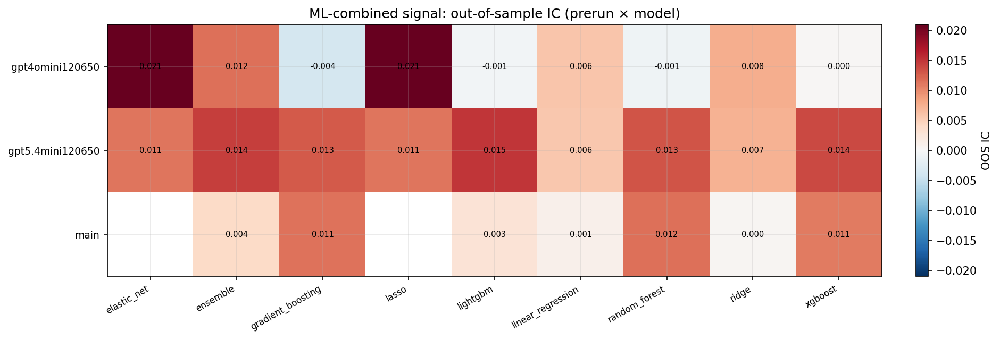

*ML-combined OOS IC (prerun × model)*

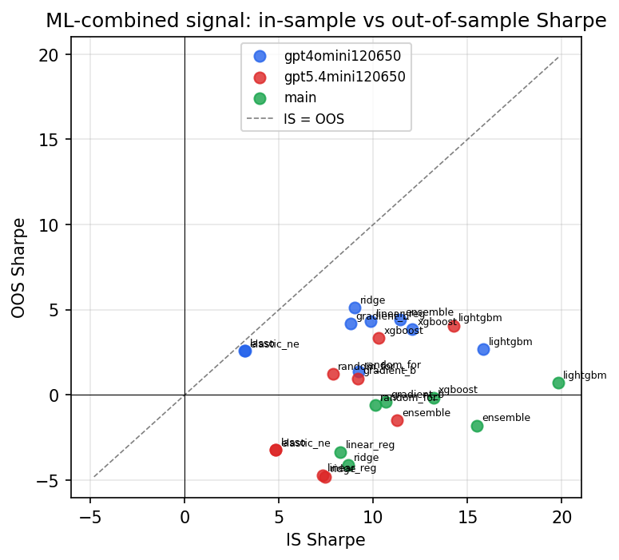

*IS vs OOS Sharpe (overfitting diagnostic)*

---
*Generated by `run_model_comparison.py`. Tables: `*.csv`; interactive: `comparison.ipynb`.*
