# Research-LLM factor comparison — `2024-04`

Comparing the **factor output of different research LLMs** on three axes (raw factor quality → factors as ML features → factors through the full agentic fund). The panel, IS/OOS split, horizon and model hyper-parameters are held identical across preruns — the *only* variable is the factor set.

## Preruns compared

| prerun | research_model | usable_factors | dropped_factors |
| --- | --- | --- | --- |
| gpt4omini120650 | gpt-4o-mini | 66 | 0 |
| gpt5.4mini120650 | gpt-5.4-mini | 69 | 0 |
| main | seed library | 78 | 10 |

> Dropped factors declare fields the current data doesn't have yet (e.g. fundamentals); they light up unchanged once that data is downloaded.

*Usable vs awaiting-data factors per research model*

## Key findings

- **Best ML-combined OOS Sharpe:** `gpt5.4mini120650` with `linear_regression` (OOS Sharpe = 2.036).
- **Mean OOS Sharpe across models, by research set:** `gpt5.4mini120650` = -1.042, `gpt4omini120650` = -3.451, `main` = -4.962.
- **Highest mean single-factor |IC| (h=6):** `main` (mean |IC| = 0.0077).
- **Most diverse zoo (highest effective/raw factor ratio):** `gpt5.4mini120650` (eff 43.1 of 69, ratio 0.62).
- **Best selection-deflated single-factor |IC|:** `gpt4omini120650` (deflated |IC| = 0.0098 from 64 factors tried).

## 1. Single-factor IC (raw factor quality)

Per-underlying time-series Spearman rank-IC of every researched factor, recomputed on the shared panel at horizons h=1, h=6, h=60. The per-underlying IC correlates each factor's value vector with the underlying's own forward-return vector (pooled across underlyings); the cross-sectional IC ranks across underlyings per timestamp.

| prerun | n_factors | mean_abs_ic_1 | mean_abs_ic_6 | mean_abs_ic_60 | mean_abs_icir_6 | best_factor_h6 | best_abs_ic_h6 |
| --- | --- | --- | --- | --- | --- | --- | --- |
| gpt4omini120650 | 66 | 0.0078 | 0.0072 | 0.0076 | 0.4015 | order_flow_lead_lag_analysis | 0.0174 |
| gpt5.4mini120650 | 69 | 0.0046 | 0.0062 | 0.0047 | 0.406 | lstm_flow_price_mismatch | 0.0155 |
| main | 78 | 0.0104 | 0.0077 | 0.006 | 0.4752 | alpha_035 | 0.0164 |

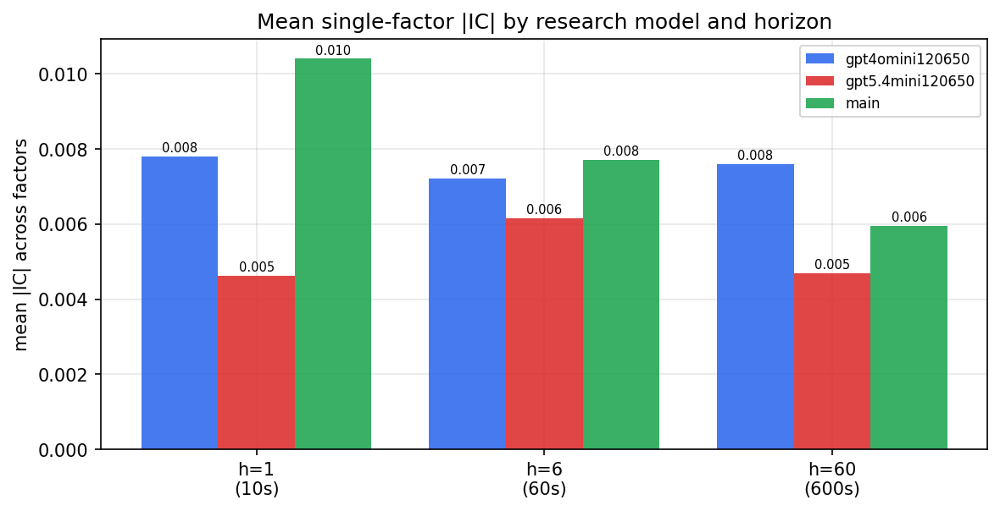

*Mean |IC| by research model and horizon*

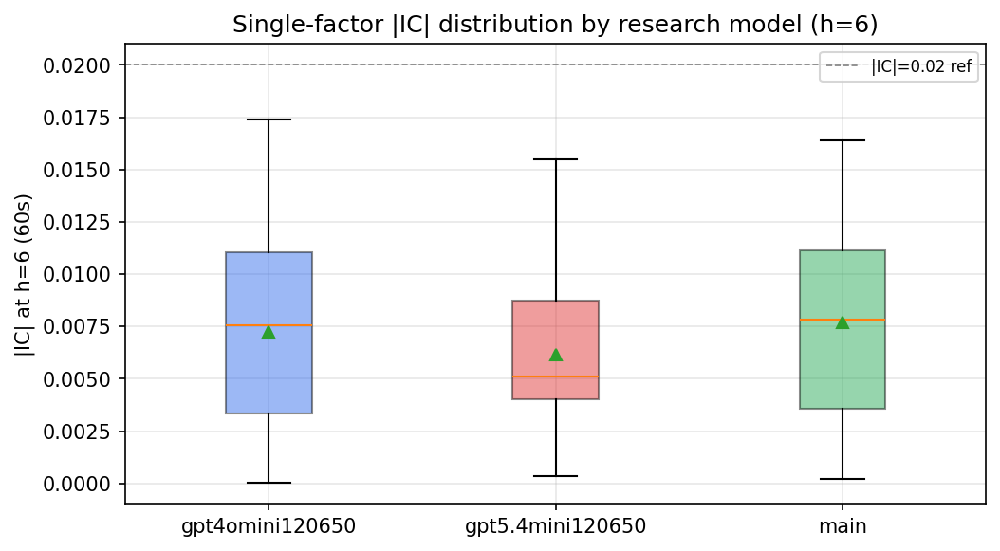

*Per-factor |IC| distribution by research model*

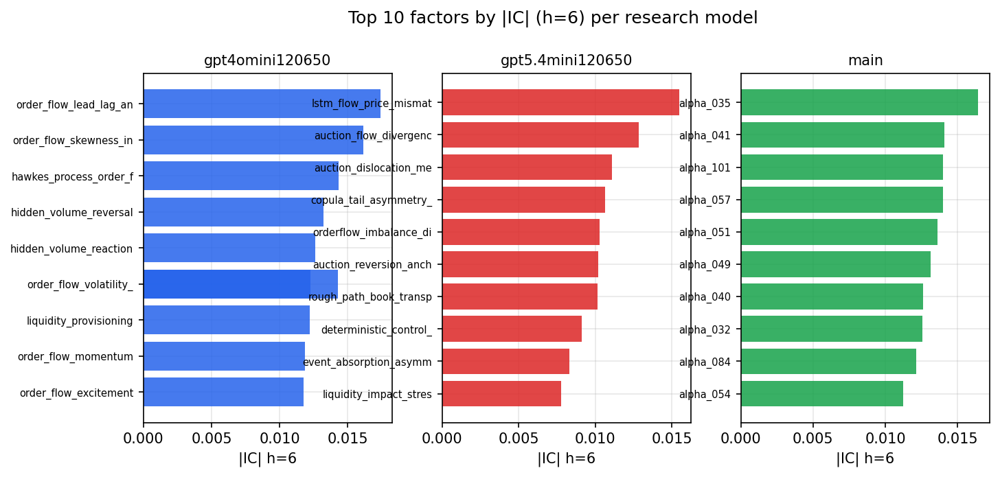

*Top factors by |IC| per research model*

## 2. Factor diversity & redundancy

Pairwise correlation of each zoo's *signals*. `eff_n_factors` is the effective number of independent factors (participation ratio of the correlation eigenvalues); `eff_ratio` and `redundancy` summarise how much unique information the zoo holds vs. how much is duplicated; `n_clusters` groups factors at |corr| ≥ 0.7.

| prerun | n_factors | eff_n_factors | eff_ratio | mean_abs_corr | n_clusters | redundancy |
| --- | --- | --- | --- | --- | --- | --- |
| gpt4omini120650 | 66 | 25.2548 | 0.3826 | 0.055 | 52 | 0.6174 |
| gpt5.4mini120650 | 69 | 43.0928 | 0.6245 | 0.0156 | 60 | 0.3755 |
| main | 78 | 42.041 | 0.539 | 0.0287 | 70 | 0.461 |

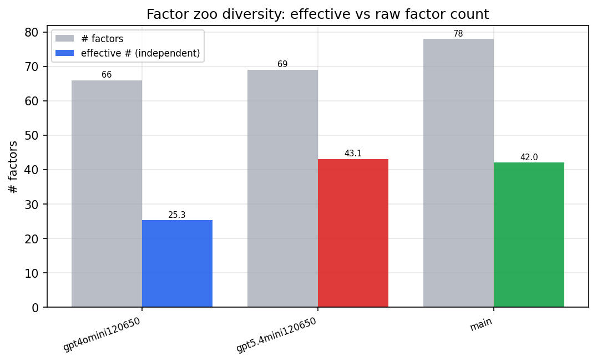

*Effective vs raw factor count per research model*

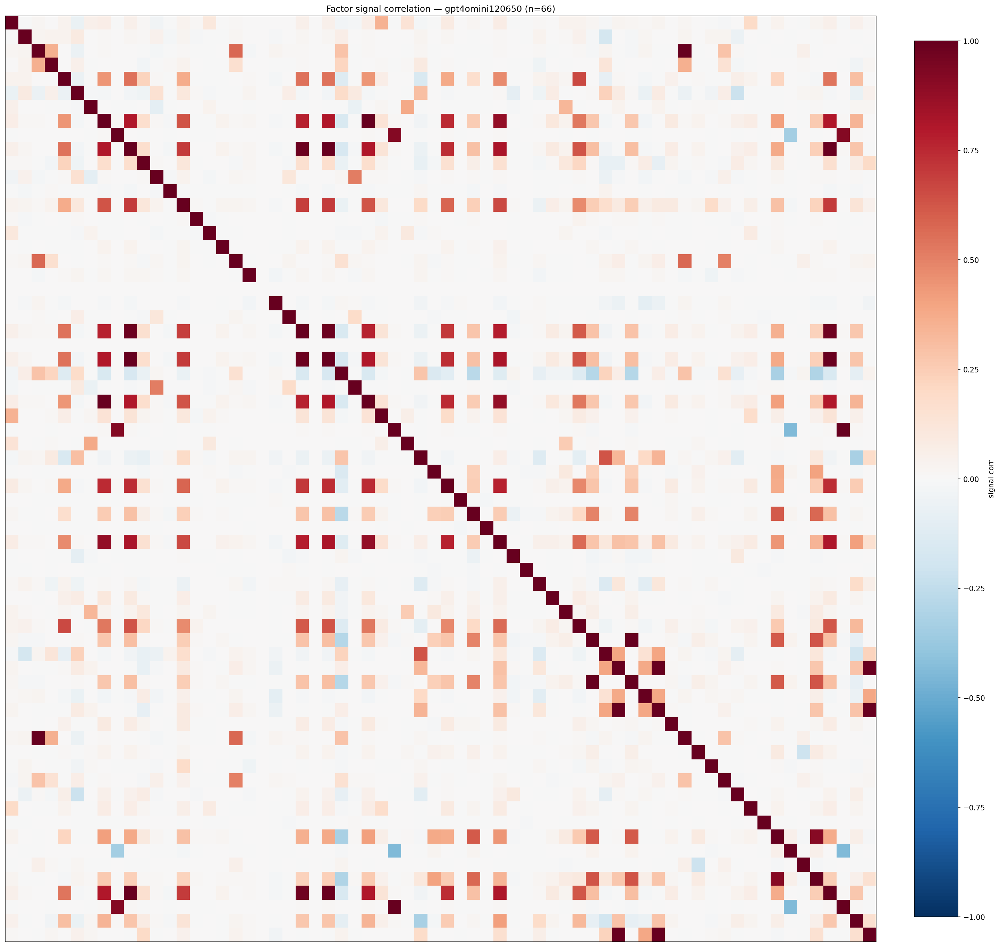

*Signal correlation matrix — gpt4omini120650*

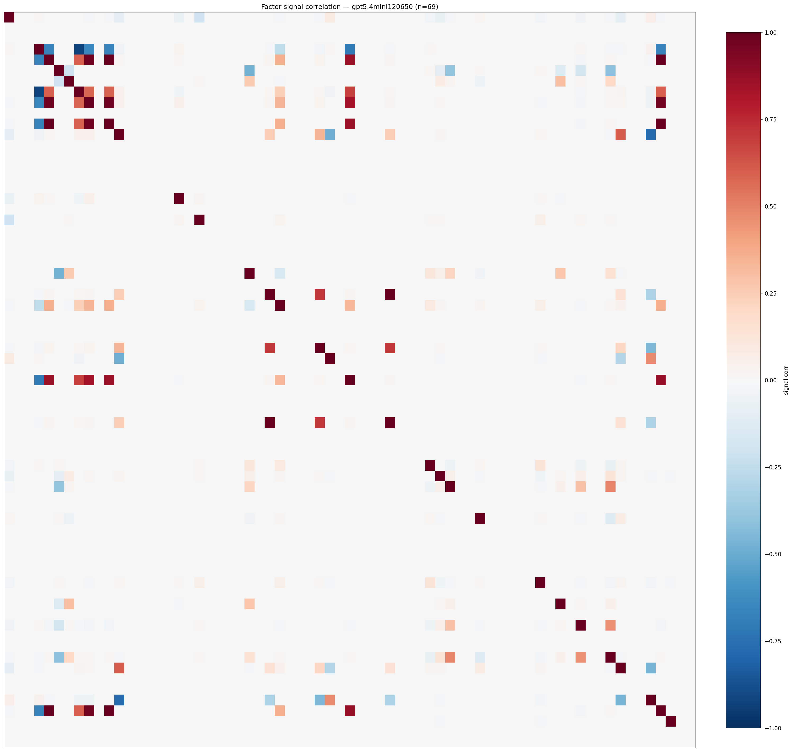

*Signal correlation matrix — gpt5.4mini120650*

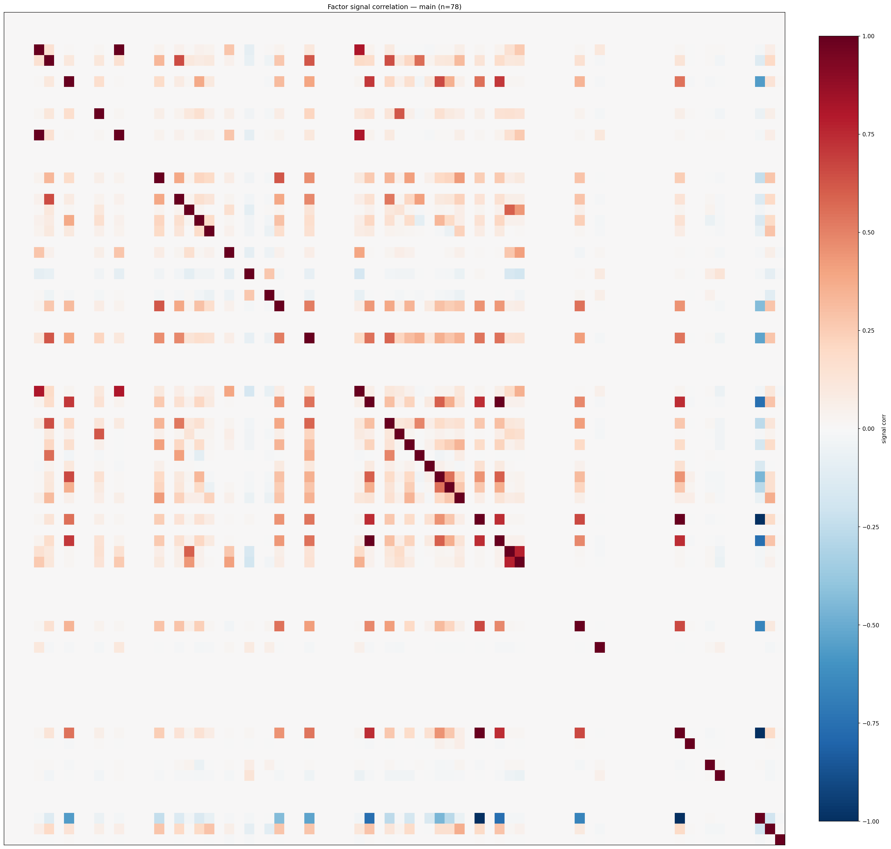

*Signal correlation matrix — main*

## 3. Deflation & model-based importance

`deflated_best_ic` haircuts each zoo's best |IC| for the number of factors tried (`ic_n_tested`) — a bigger zoo's best factor is more likely to be lucky. `lasso_n_nonzero` / `lasso_sparsity` show how many factors a sparse linear model actually keeps (model-view redundancy).

| prerun | best_ic | deflated_best_ic | deflated_best_t | ic_n_tested | ic_n_obs | lasso_n_nonzero | lasso_sparsity |
| --- | --- | --- | --- | --- | --- | --- | --- |
| gpt4omini120650 | 0.0174 | 0.0098 | 3.7437 | 64 | 145079 | 0 | 1.0 |
| gpt5.4mini120650 | 0.0155 | 0.0086 | 3.2711 | 31 | 145079 | 6 | 0.913 |
| main | 0.0164 | 0.0093 | 3.5476 | 38 | 145079 | 0 | 1.0 |

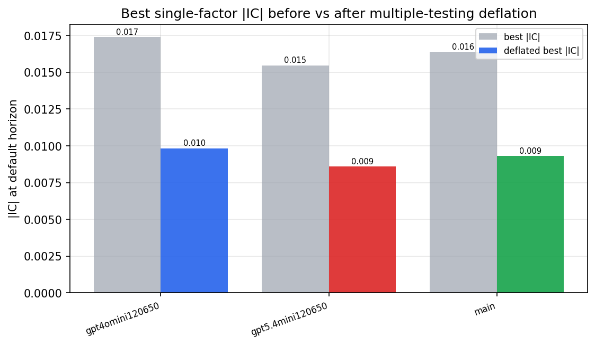

*Best |IC| before vs after multiple-testing deflation*

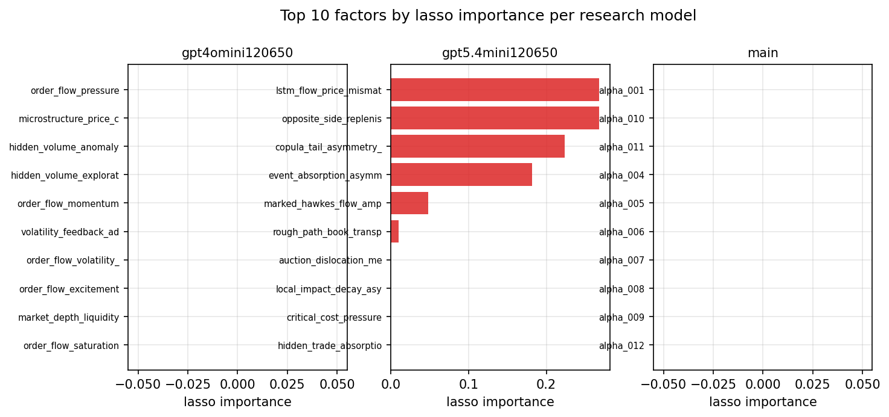

*Top factors by lasso importance per zoo*

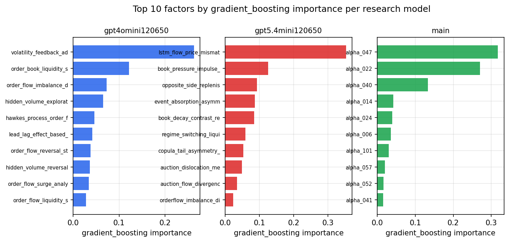

*Top factors by gradient_boosting importance per zoo*

## 4. ML-combined signal — per-underlying vectorised backtest

Each model combines a prerun's factors into ONE signal (fit `factors → forward return` on IS, predict per (bar, underlying)), then that combined signal is run through a simple vectorised backtest — `position(signal) × the underlying's own forward return` — on the held-out OOS tail (+ an equal-weight ensemble). No cross-sectional ranking.

> Config: position=**threshold** (t=1.0, z-score `expanding`), aggregation=**portfolio**, fit-standardise=**per_underlying**, horizon=6.

| prerun | model | n_factors_used | oos_ic | oos_sharpe | is_sharpe | oos_ann_return | oos_max_drawdown |
| --- | --- | --- | --- | --- | --- | --- | --- |
| gpt4omini120650 | linear_regression | 66 | 0.0007 | -4.9763 | 8.7507 | -0.1443 | -0.0136 |
| gpt4omini120650 | ridge | 66 | 0.0007 | -4.6114 | 9.1915 | -0.134 | -0.0135 |
| gpt4omini120650 | lasso | 66 | 0.001 | -4.3624 | 8.8419 | -0.1268 | -0.0128 |
| gpt4omini120650 | elastic_net | 66 | 0.0038 | -5.0251 | 7.748 | -0.3955 | -0.0417 |
| gpt4omini120650 | random_forest | 66 | 0.0089 | -1.9716 | 8.0915 | -0.1658 | -0.0248 |
| gpt4omini120650 | gradient_boosting | 66 | 0.0023 | -2.471 | 8.6161 | -0.1595 | -0.0154 |
| gpt4omini120650 | xgboost | 66 | 0.0141 | -2.5336 | 10.5628 | -0.1745 | -0.0206 |
| gpt4omini120650 | lightgbm | 66 | 0.0148 | -1.5984 | 13.5361 | -0.097 | -0.0152 |
| gpt4omini120650 | ensemble | 66 | 0.0049 | -3.5097 | 11.2789 | -0.2655 | -0.0275 |
| gpt5.4mini120650 | linear_regression | 69 | -0.001 | 2.0364 | 6.4692 | 0.0943 | -0.0136 |
| gpt5.4mini120650 | ridge | 69 | 0.0012 | 1.5254 | 5.9514 | 0.0685 | -0.015 |
| gpt5.4mini120650 | lasso | 69 | nan | nan | nan | nan | nan |
| gpt5.4mini120650 | elastic_net | 69 | nan | nan | nan | nan | nan |
| gpt5.4mini120650 | random_forest | 69 | -0.0097 | -2.6517 | 6.4414 | -0.2114 | -0.0212 |
| gpt5.4mini120650 | gradient_boosting | 69 | -0.0131 | -0.4769 | 7.9199 | -0.0211 | -0.0091 |
| gpt5.4mini120650 | xgboost | 69 | -0.0041 | -1.7681 | 8.7637 | -0.106 | -0.0208 |
| gpt5.4mini120650 | lightgbm | 69 | -0.0045 | -3.1294 | 12.1392 | -0.1846 | -0.0218 |
| gpt5.4mini120650 | ensemble | 69 | -0.0021 | -2.8277 | 9.942 | -0.2068 | -0.0223 |
| main | linear_regression | 78 | -0.0022 | -1.768 | 6.809 | -0.0889 | -0.0208 |
| main | ridge | 78 | -0.002 | -2.9259 | 6.2396 | -0.1608 | -0.0244 |
| main | lasso | 78 | nan | nan | nan | nan | nan |
| main | elastic_net | 78 | nan | nan | nan | nan | nan |
| main | random_forest | 78 | -0.0095 | -8.8727 | 8.9948 | -0.5526 | -0.0522 |
| main | gradient_boosting | 78 | -0.0089 | -6.6975 | 8.9034 | -0.2583 | -0.0321 |
| main | xgboost | 78 | -0.002 | -4.9751 | 10.6952 | -0.2394 | -0.0253 |
| main | lightgbm | 78 | 0.003 | -3.9271 | 14.9249 | -0.1391 | -0.0156 |
| main | ensemble | 78 | -0.0071 | -5.565 | 12.2842 | -0.3294 | -0.0363 |

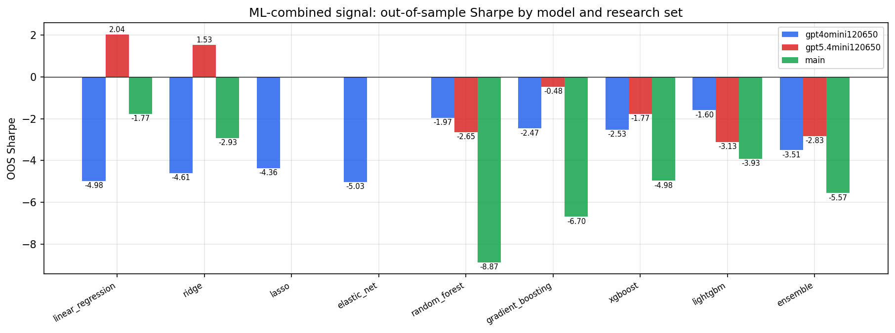

*ML-combined OOS Sharpe by model and research set*

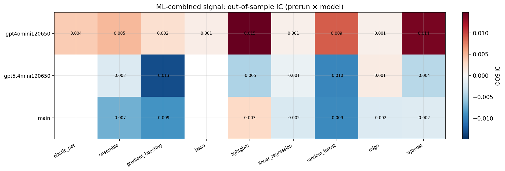

*ML-combined OOS IC (prerun × model)*

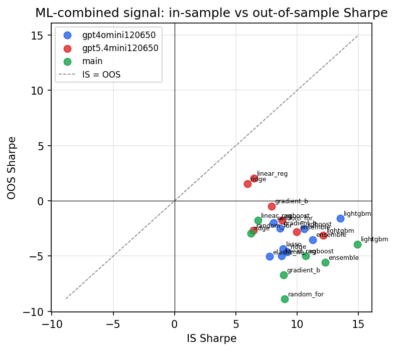

*IS vs OOS Sharpe (overfitting diagnostic)*

---
*Generated by `run_model_comparison.py`. Tables: `*.csv`; interactive: `comparison.ipynb`.*
