# Research-LLM factor comparison — `2024-05`

Comparing the **factor output of different research LLMs** on three axes (raw factor quality → factors as ML features → factors through the full agentic fund). The panel, IS/OOS split, horizon and model hyper-parameters are held identical across preruns — the *only* variable is the factor set.

## Preruns compared

| prerun | research_model | usable_factors | dropped_factors |
| --- | --- | --- | --- |
| gpt4omini120650 | gpt-4o-mini | 66 | 0 |
| gpt5.4mini120650 | gpt-5.4-mini | 69 | 0 |
| main | seed library | 78 | 10 |

> Dropped factors declare fields the current data doesn't have yet (e.g. fundamentals); they light up unchanged once that data is downloaded.

*Usable vs awaiting-data factors per research model*

## Key findings

- **Best ML-combined OOS Sharpe:** `gpt4omini120650` with `ridge` (OOS Sharpe = 7.579).
- **Mean OOS Sharpe across models, by research set:** `gpt4omini120650` = 5.824, `gpt5.4mini120650` = 3.854, `main` = -1.222.
- **Highest mean single-factor |IC| (h=6):** `main` (mean |IC| = 0.0081).
- **Most diverse zoo (highest effective/raw factor ratio):** `gpt5.4mini120650` (eff 47.3 of 69, ratio 0.69).
- **Best selection-deflated single-factor |IC|:** `gpt4omini120650` (deflated |IC| = 0.0123 from 64 factors tried).

## 1. Single-factor IC (raw factor quality)

Per-underlying time-series Spearman rank-IC of every researched factor, recomputed on the shared panel at horizons h=1, h=6, h=60. The per-underlying IC correlates each factor's value vector with the underlying's own forward-return vector (pooled across underlyings); the cross-sectional IC ranks across underlyings per timestamp.

| prerun | n_factors | mean_abs_ic_1 | mean_abs_ic_6 | mean_abs_ic_60 | mean_abs_icir_6 | best_factor_h6 | best_abs_ic_h6 |
| --- | --- | --- | --- | --- | --- | --- | --- |
| gpt4omini120650 | 66 | 0.0077 | 0.0076 | 0.0082 | 0.4644 | order_flow_skewness_indicator | 0.0198 |
| gpt5.4mini120650 | 69 | 0.0046 | 0.0057 | 0.0073 | 0.4132 | lstm_flow_price_mismatch | 0.0153 |
| main | 78 | 0.009 | 0.0081 | 0.0065 | 0.4941 | alpha_084 | 0.0169 |

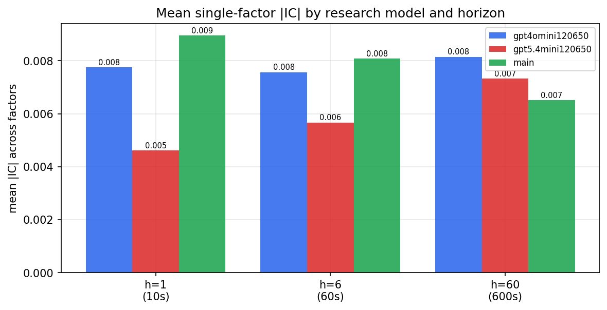

*Mean |IC| by research model and horizon*

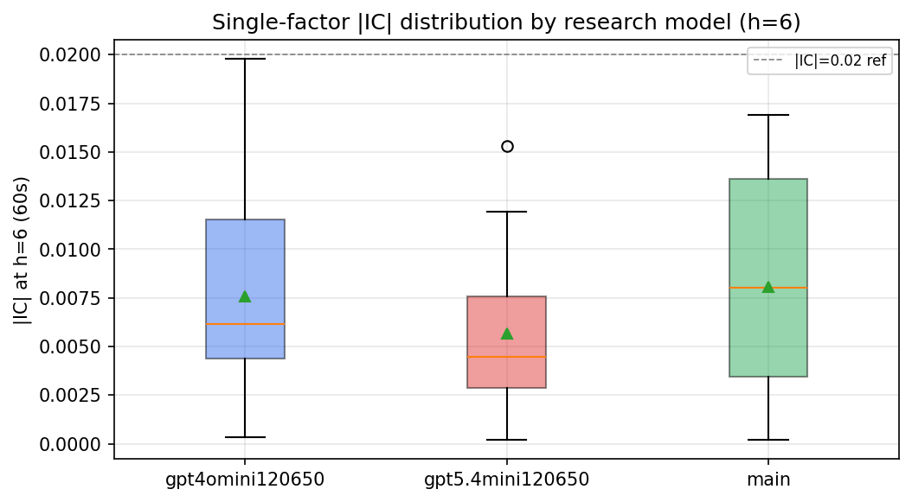

*Per-factor |IC| distribution by research model*

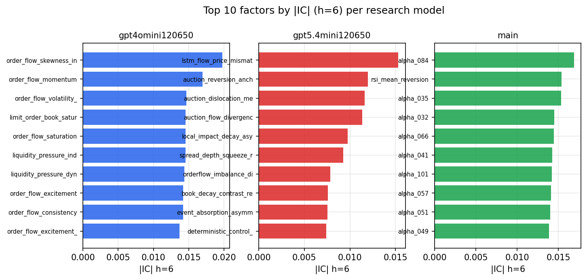

*Top factors by |IC| per research model*

## 2. Factor diversity & redundancy

Pairwise correlation of each zoo's *signals*. `eff_n_factors` is the effective number of independent factors (participation ratio of the correlation eigenvalues); `eff_ratio` and `redundancy` summarise how much unique information the zoo holds vs. how much is duplicated; `n_clusters` groups factors at |corr| ≥ 0.7.

| prerun | n_factors | eff_n_factors | eff_ratio | mean_abs_corr | n_clusters | redundancy |
| --- | --- | --- | --- | --- | --- | --- |
| gpt4omini120650 | 66 | 25.7409 | 0.39 | 0.054 | 52 | 0.61 |
| gpt5.4mini120650 | 69 | 47.2771 | 0.6852 | 0.0129 | 64 | 0.3148 |
| main | 78 | 43.1097 | 0.5527 | 0.0277 | 71 | 0.4473 |

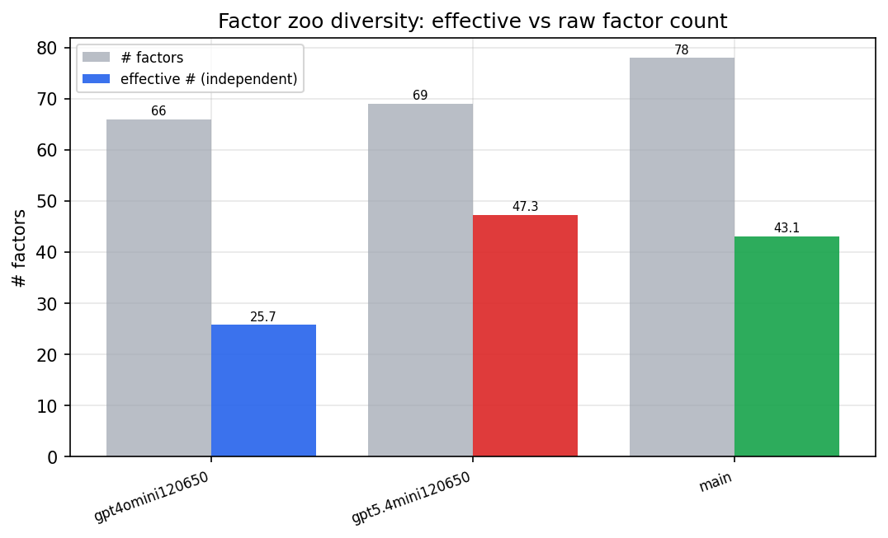

*Effective vs raw factor count per research model*

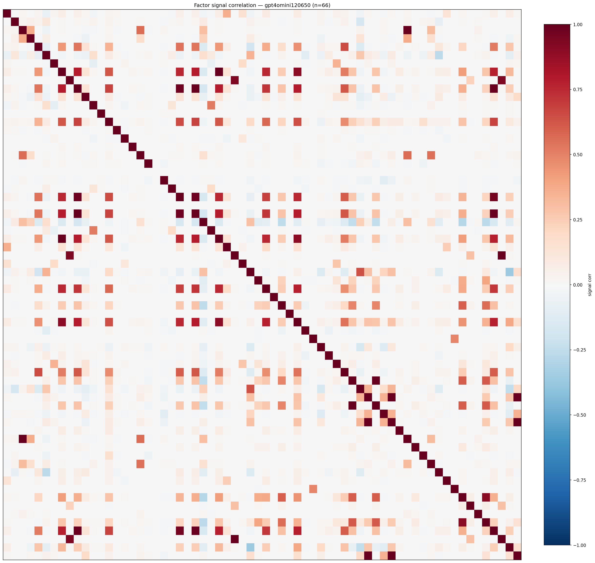

*Signal correlation matrix — gpt4omini120650*

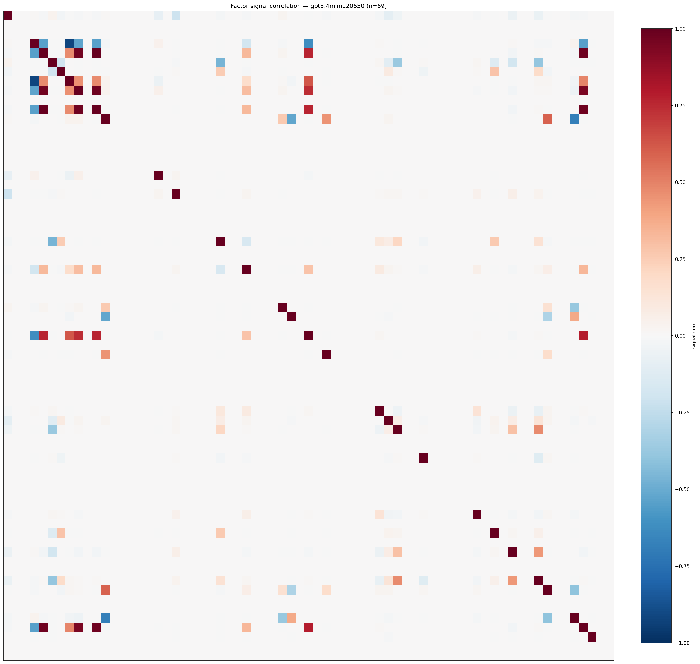

*Signal correlation matrix — gpt5.4mini120650*

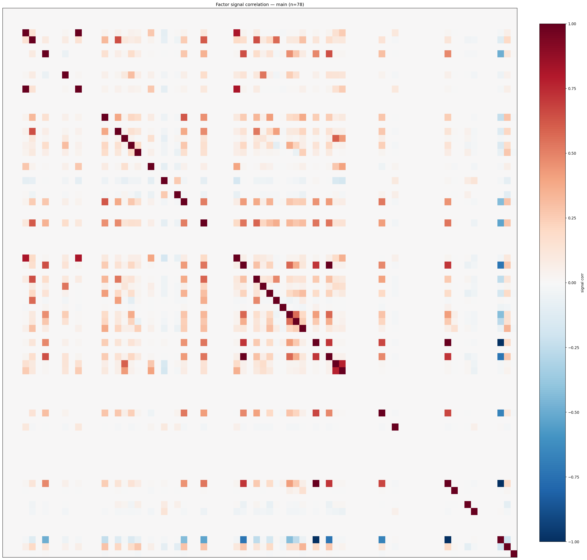

*Signal correlation matrix — main*

## 3. Deflation & model-based importance

`deflated_best_ic` haircuts each zoo's best |IC| for the number of factors tried (`ic_n_tested`) — a bigger zoo's best factor is more likely to be lucky. `lasso_n_nonzero` / `lasso_sparsity` show how many factors a sparse linear model actually keeps (model-view redundancy).

| prerun | best_ic | deflated_best_ic | deflated_best_t | ic_n_tested | ic_n_obs | lasso_n_nonzero | lasso_sparsity |
| --- | --- | --- | --- | --- | --- | --- | --- |
| gpt4omini120650 | 0.0198 | 0.0123 | 4.7683 | 64 | 149759 | 0 | 1.0 |
| gpt5.4mini120650 | 0.0153 | 0.0085 | 3.3034 | 31 | 149759 | 0 | 1.0 |
| main | 0.0169 | 0.0099 | 3.8446 | 38 | 149759 | 0 | 1.0 |

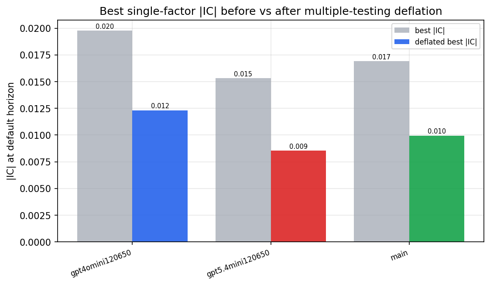

*Best |IC| before vs after multiple-testing deflation*

*Top factors by lasso importance per zoo*

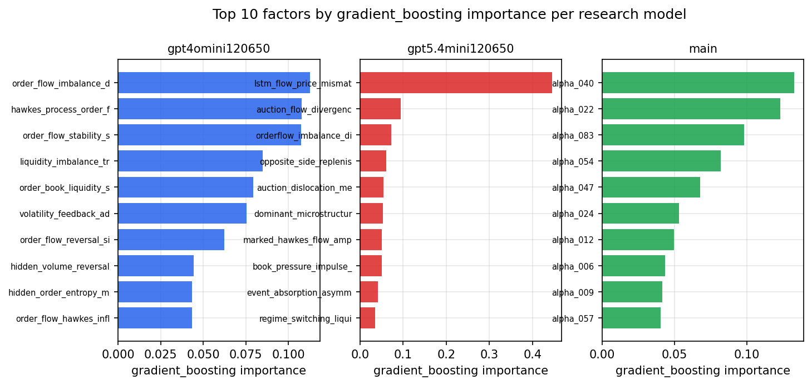

*Top factors by gradient_boosting importance per zoo*

## 4. ML-combined signal — per-underlying vectorised backtest

Each model combines a prerun's factors into ONE signal (fit `factors → forward return` on IS, predict per (bar, underlying)), then that combined signal is run through a simple vectorised backtest — `position(signal) × the underlying's own forward return` — on the held-out OOS tail (+ an equal-weight ensemble). No cross-sectional ranking.

> Config: position=**threshold** (t=1.0, z-score `expanding`), aggregation=**portfolio**, fit-standardise=**per_underlying**, horizon=6.

| prerun | model | n_factors_used | oos_ic | oos_sharpe | is_sharpe | oos_ann_return | oos_max_drawdown |
| --- | --- | --- | --- | --- | --- | --- | --- |
| gpt4omini120650 | linear_regression | 66 | 0.0014 | 7.4431 | 7.6462 | 0.356 | -0.0058 |
| gpt4omini120650 | ridge | 66 | -0.0004 | 7.5786 | 6.2662 | 0.4086 | -0.0054 |
| gpt4omini120650 | lasso | 66 | nan | nan | nan | nan | nan |
| gpt4omini120650 | elastic_net | 66 | nan | nan | nan | nan | nan |
| gpt4omini120650 | random_forest | 66 | 0.0085 | 4.0282 | 7.2309 | 0.242 | -0.0091 |
| gpt4omini120650 | gradient_boosting | 66 | -0.0087 | 6.4227 | 10.5072 | 0.2018 | -0.0052 |
| gpt4omini120650 | xgboost | 66 | 0.0099 | 5.4434 | 12.1817 | 0.2333 | -0.0051 |
| gpt4omini120650 | lightgbm | 66 | 0.0045 | 3.6498 | 15.7303 | 0.1239 | -0.0058 |
| gpt4omini120650 | ensemble | 66 | -0.0019 | 6.2012 | 11.7606 | 0.2836 | -0.0056 |
| gpt5.4mini120650 | linear_regression | 69 | 0.0023 | 2.9927 | 5.8012 | 0.194 | -0.0123 |
| gpt5.4mini120650 | ridge | 69 | 0.0047 | 3.0556 | 5.4159 | 0.197 | -0.0131 |
| gpt5.4mini120650 | lasso | 69 | nan | nan | nan | nan | nan |
| gpt5.4mini120650 | elastic_net | 69 | nan | nan | nan | nan | nan |
| gpt5.4mini120650 | random_forest | 69 | 0.0079 | 4.0437 | 8.0229 | 0.158 | -0.0053 |
| gpt5.4mini120650 | gradient_boosting | 69 | 0.0262 | -0.3376 | 8.9647 | -0.0111 | -0.0122 |
| gpt5.4mini120650 | xgboost | 69 | 0.0045 | 6.2258 | 10.9758 | 0.1437 | -0.0022 |
| gpt5.4mini120650 | lightgbm | 69 | -0.0029 | 6.7784 | 14.2585 | 0.1898 | -0.0038 |
| gpt5.4mini120650 | ensemble | 69 | 0.0069 | 4.2199 | 10.3958 | 0.1435 | -0.0055 |
| main | linear_regression | 78 | -0.0192 | -1.9212 | 10.177 | -0.0674 | -0.009 |
| main | ridge | 78 | -0.02 | -1.0106 | 9.7681 | -0.0375 | -0.0081 |
| main | lasso | 78 | nan | nan | nan | nan | nan |
| main | elastic_net | 78 | nan | nan | nan | nan | nan |
| main | random_forest | 78 | -0.0143 | -2.4054 | 13.4784 | -0.0804 | -0.0134 |
| main | gradient_boosting | 78 | -0.0104 | -2.7897 | 10.3394 | -0.0514 | -0.0062 |
| main | xgboost | 78 | -0.0089 | -1.5106 | 16.8049 | -0.0448 | -0.0116 |
| main | lightgbm | 78 | -0.0105 | 0.7504 | 22.6046 | 0.0245 | -0.0082 |
| main | ensemble | 78 | -0.0217 | 0.3322 | 11.8422 | 0.0069 | -0.0047 |

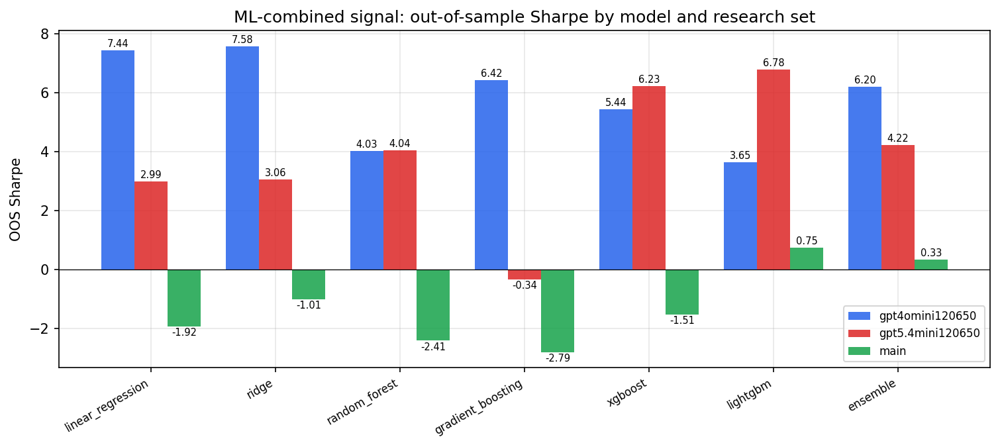

*ML-combined OOS Sharpe by model and research set*

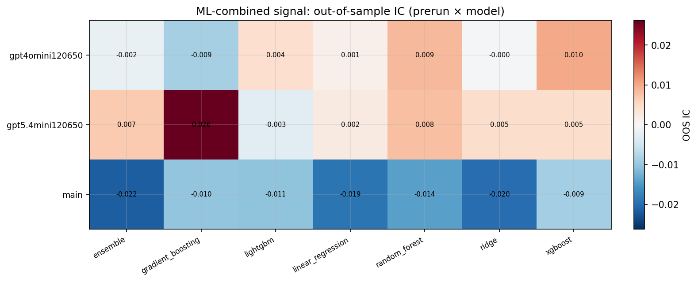

*ML-combined OOS IC (prerun × model)*

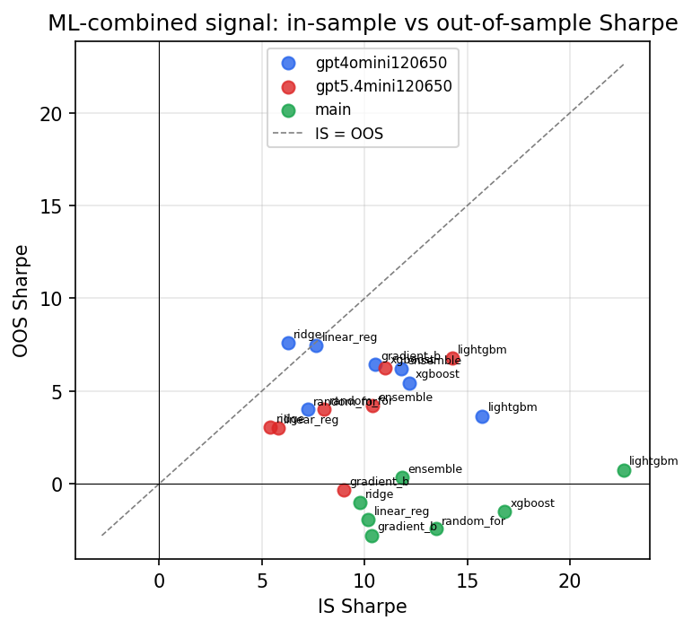

*IS vs OOS Sharpe (overfitting diagnostic)*

---
*Generated by `run_model_comparison.py`. Tables: `*.csv`; interactive: `comparison.ipynb`.*
