# Research-LLM factor comparison — `2024-06`

Comparing the **factor output of different research LLMs** on three axes (raw factor quality → factors as ML features → factors through the full agentic fund). The panel, IS/OOS split, horizon and model hyper-parameters are held identical across preruns — the *only* variable is the factor set.

## Preruns compared

| prerun | research_model | usable_factors | dropped_factors |
| --- | --- | --- | --- |
| gpt4omini120650 | gpt-4o-mini | 66 | 0 |
| gpt5.4mini120650 | gpt-5.4-mini | 69 | 0 |
| main | seed library | 78 | 10 |

> Dropped factors declare fields the current data doesn't have yet (e.g. fundamentals); they light up unchanged once that data is downloaded.

*Usable vs awaiting-data factors per research model*

## Key findings

- **Best ML-combined OOS Sharpe:** `main` with `gradient_boosting` (OOS Sharpe = 1.968).
- **Mean OOS Sharpe across models, by research set:** `main` = 0.134, `gpt5.4mini120650` = -2.024, `gpt4omini120650` = -2.849.
- **Highest mean single-factor |IC| (h=6):** `main` (mean |IC| = 0.0074).
- **Most diverse zoo (highest effective/raw factor ratio):** `gpt5.4mini120650` (eff 47.0 of 69, ratio 0.68).
- **Best selection-deflated single-factor |IC|:** `main` (deflated |IC| = 0.0112 from 38 factors tried).

## 1. Single-factor IC (raw factor quality)

Per-underlying time-series Spearman rank-IC of every researched factor, recomputed on the shared panel at horizons h=1, h=6, h=60. The per-underlying IC correlates each factor's value vector with the underlying's own forward-return vector (pooled across underlyings); the cross-sectional IC ranks across underlyings per timestamp.

| prerun | n_factors | mean_abs_ic_1 | mean_abs_ic_6 | mean_abs_ic_60 | mean_abs_icir_6 | best_factor_h6 | best_abs_ic_h6 |
| --- | --- | --- | --- | --- | --- | --- | --- |
| gpt4omini120650 | 66 | 0.0072 | 0.0055 | 0.0066 | 0.3574 | order_flow_skewness_indicator | 0.0167 |
| gpt5.4mini120650 | 69 | 0.0039 | 0.0056 | 0.0083 | 0.3594 | lstm_flow_price_mismatch | 0.0122 |
| main | 78 | 0.0078 | 0.0074 | 0.0054 | 0.4517 | rsi_mean_reversion | 0.0183 |

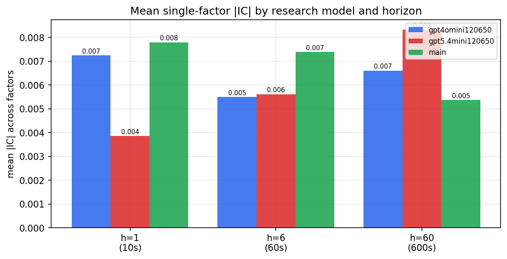

*Mean |IC| by research model and horizon*

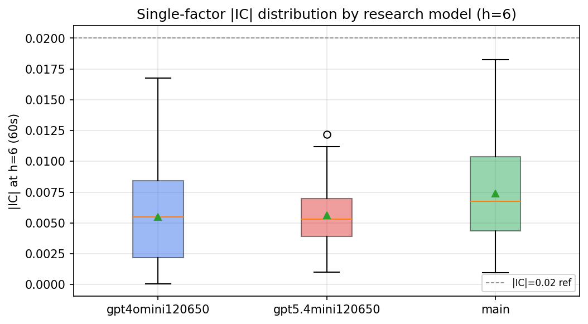

*Per-factor |IC| distribution by research model*

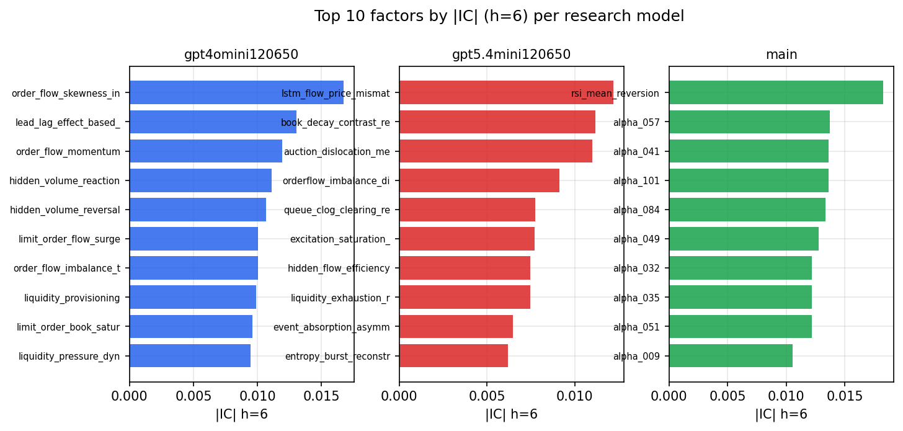

*Top factors by |IC| per research model*

## 2. Factor diversity & redundancy

Pairwise correlation of each zoo's *signals*. `eff_n_factors` is the effective number of independent factors (participation ratio of the correlation eigenvalues); `eff_ratio` and `redundancy` summarise how much unique information the zoo holds vs. how much is duplicated; `n_clusters` groups factors at |corr| ≥ 0.7.

| prerun | n_factors | eff_n_factors | eff_ratio | mean_abs_corr | n_clusters | redundancy |
| --- | --- | --- | --- | --- | --- | --- |
| gpt4omini120650 | 66 | 25.5157 | 0.3866 | 0.0549 | 52 | 0.6134 |
| gpt5.4mini120650 | 69 | 46.9884 | 0.681 | 0.0139 | 62 | 0.319 |
| main | 78 | 42.8654 | 0.5496 | 0.028 | 71 | 0.4504 |

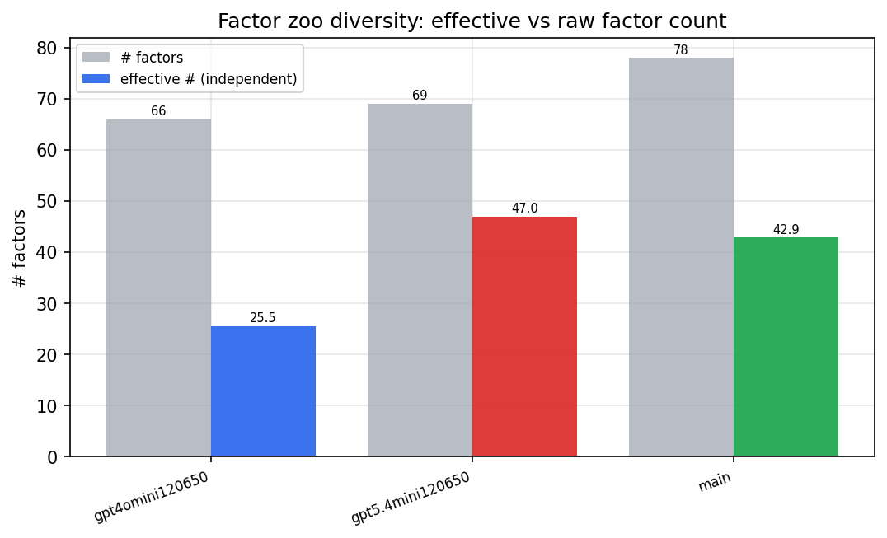

*Effective vs raw factor count per research model*

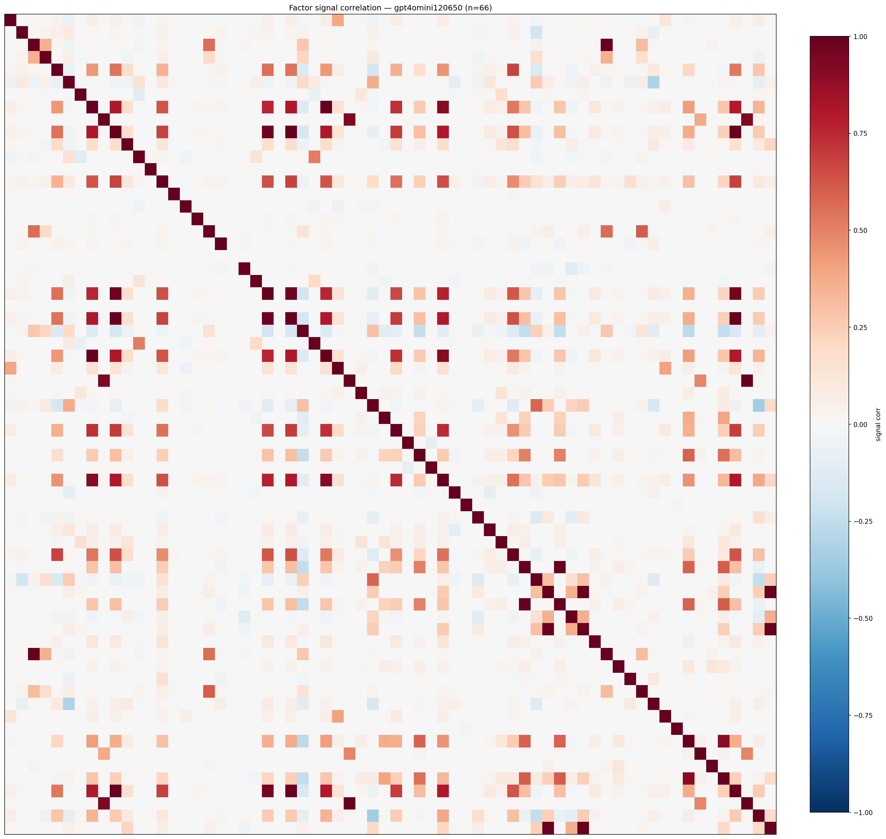

*Signal correlation matrix — gpt4omini120650*

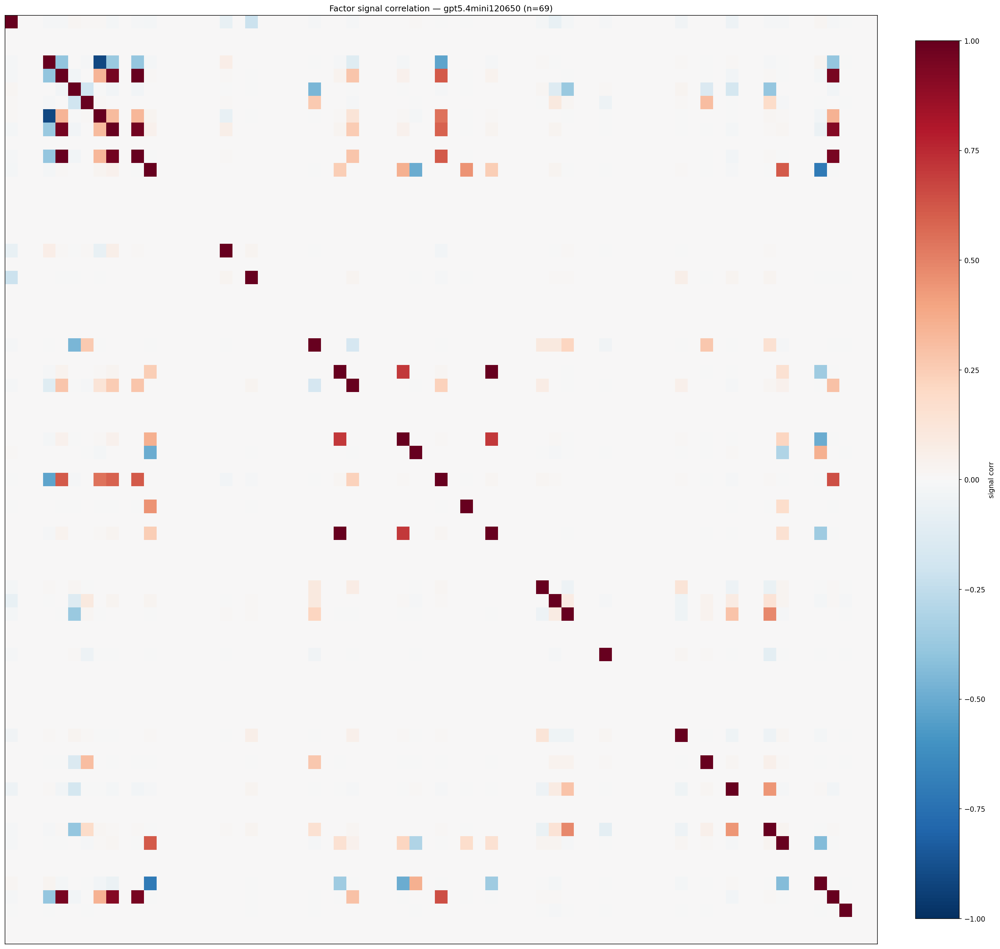

*Signal correlation matrix — gpt5.4mini120650*

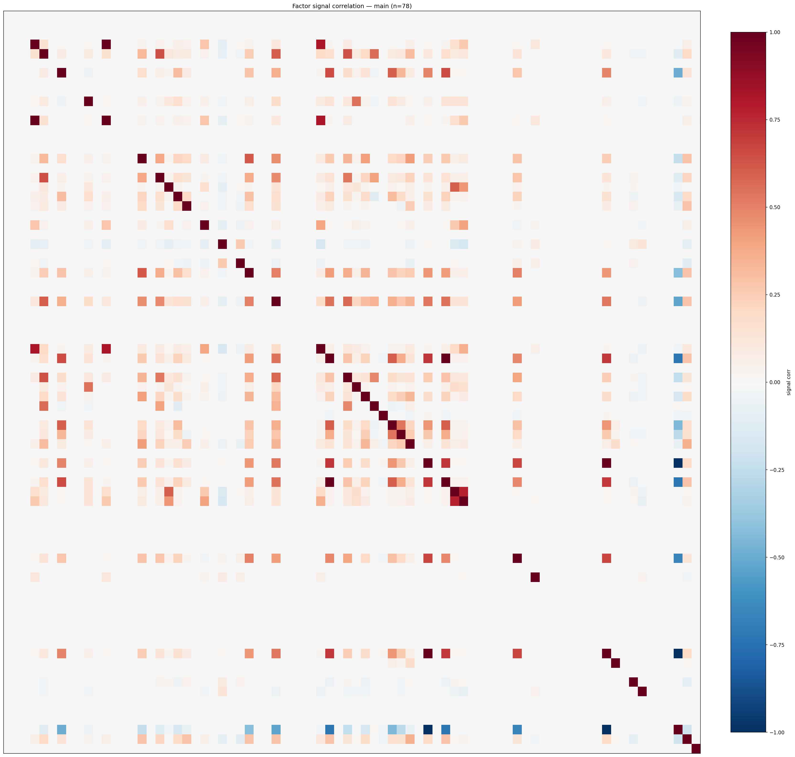

*Signal correlation matrix — main*

## 3. Deflation & model-based importance

`deflated_best_ic` haircuts each zoo's best |IC| for the number of factors tried (`ic_n_tested`) — a bigger zoo's best factor is more likely to be lucky. `lasso_n_nonzero` / `lasso_sparsity` show how many factors a sparse linear model actually keeps (model-view redundancy).

| prerun | best_ic | deflated_best_ic | deflated_best_t | ic_n_tested | ic_n_obs | lasso_n_nonzero | lasso_sparsity |
| --- | --- | --- | --- | --- | --- | --- | --- |
| gpt4omini120650 | 0.0167 | 0.0092 | 3.5417 | 64 | 147419 | 0 | 1.0 |
| gpt5.4mini120650 | 0.0122 | 0.0054 | 2.0653 | 31 | 147419 | 0 | 1.0 |
| main | 0.0183 | 0.0112 | 4.3138 | 38 | 147419 | 0 | 1.0 |

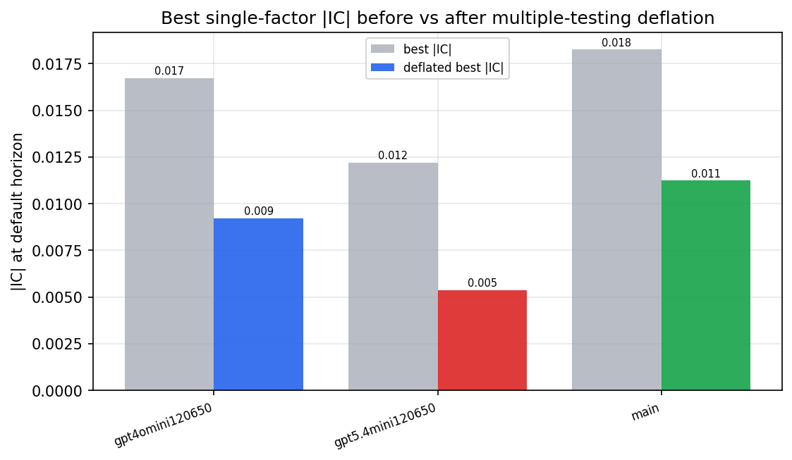

*Best |IC| before vs after multiple-testing deflation*

*Top factors by lasso importance per zoo*

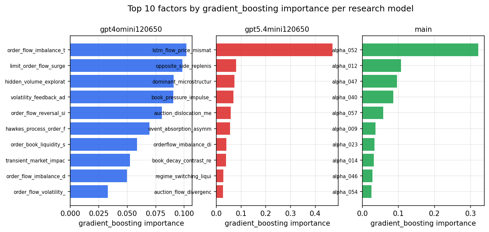

*Top factors by gradient_boosting importance per zoo*

## 4. ML-combined signal — per-underlying vectorised backtest

Each model combines a prerun's factors into ONE signal (fit `factors → forward return` on IS, predict per (bar, underlying)), then that combined signal is run through a simple vectorised backtest — `position(signal) × the underlying's own forward return` — on the held-out OOS tail (+ an equal-weight ensemble). No cross-sectional ranking.

> Config: position=**threshold** (t=1.0, z-score `expanding`), aggregation=**portfolio**, fit-standardise=**per_underlying**, horizon=6.

| prerun | model | n_factors_used | oos_ic | oos_sharpe | is_sharpe | oos_ann_return | oos_max_drawdown |
| --- | --- | --- | --- | --- | --- | --- | --- |
| gpt4omini120650 | linear_regression | 66 | 0.0099 | -0.9999 | 5.1289 | -0.0514 | -0.0157 |
| gpt4omini120650 | ridge | 66 | 0.009 | -0.5369 | 5.1017 | -0.028 | -0.0152 |
| gpt4omini120650 | lasso | 66 | nan | nan | nan | nan | nan |
| gpt4omini120650 | elastic_net | 66 | nan | nan | nan | nan | nan |
| gpt4omini120650 | random_forest | 66 | -0.0239 | -2.7085 | 7.9721 | -0.0914 | -0.0116 |
| gpt4omini120650 | gradient_boosting | 66 | 0.0022 | -4.1347 | 9.3996 | -0.0826 | -0.0092 |
| gpt4omini120650 | xgboost | 66 | -0.0285 | -3.2614 | 11.4582 | -0.0931 | -0.0095 |
| gpt4omini120650 | lightgbm | 66 | -0.0268 | -6.7458 | 15.3162 | -0.1703 | -0.0133 |
| gpt4omini120650 | ensemble | 66 | 0.0062 | -1.5578 | 12.4373 | -0.0677 | -0.0103 |
| gpt5.4mini120650 | linear_regression | 69 | -0.0015 | -0.2172 | 6.3567 | -0.009 | -0.0095 |
| gpt5.4mini120650 | ridge | 69 | -0.0014 | -0.0524 | 6.6067 | -0.0022 | -0.0095 |
| gpt5.4mini120650 | lasso | 69 | 0.0024 | -1.6447 | 5.3385 | -0.059 | -0.0118 |
| gpt5.4mini120650 | elastic_net | 69 | 0.0024 | -1.6447 | 5.3385 | -0.059 | -0.0118 |
| gpt5.4mini120650 | random_forest | 69 | -0.0028 | -3.5884 | 5.8786 | -0.1021 | -0.0105 |
| gpt5.4mini120650 | gradient_boosting | 69 | -0.0018 | -2.4987 | 9.0195 | -0.0359 | -0.0044 |
| gpt5.4mini120650 | xgboost | 69 | -0.0024 | -3.0968 | 10.4932 | -0.0807 | -0.0072 |
| gpt5.4mini120650 | lightgbm | 69 | -0.0047 | -3.4959 | 14.0671 | -0.0926 | -0.0075 |
| gpt5.4mini120650 | ensemble | 69 | -0.0002 | -1.9743 | 11.5174 | -0.0754 | -0.0108 |
| main | linear_regression | 78 | -0.0049 | -0.1533 | 8.8415 | -0.0047 | -0.006 |
| main | ridge | 78 | -0.0057 | 1.6873 | 8.9717 | 0.0499 | -0.0054 |
| main | lasso | 78 | nan | nan | nan | nan | nan |
| main | elastic_net | 78 | nan | nan | nan | nan | nan |
| main | random_forest | 78 | -0.0004 | -1.9629 | 14.0524 | -0.0386 | -0.0063 |
| main | gradient_boosting | 78 | -0.0082 | 1.968 | 12.4317 | 0.0247 | -0.0024 |
| main | xgboost | 78 | -0.0071 | -0.7974 | 17.7238 | -0.0138 | -0.0061 |
| main | lightgbm | 78 | -0.0101 | -0.8012 | 23.9298 | -0.01 | -0.0027 |
| main | ensemble | 78 | -0.0078 | 0.9981 | 18.3626 | 0.0233 | -0.0067 |

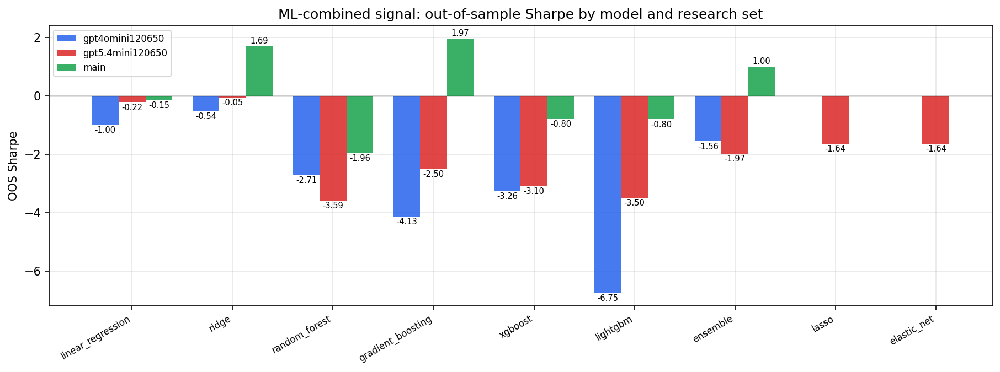

*ML-combined OOS Sharpe by model and research set*

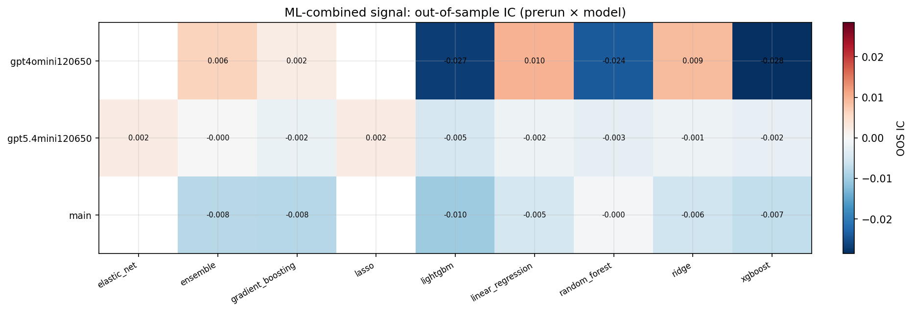

*ML-combined OOS IC (prerun × model)*

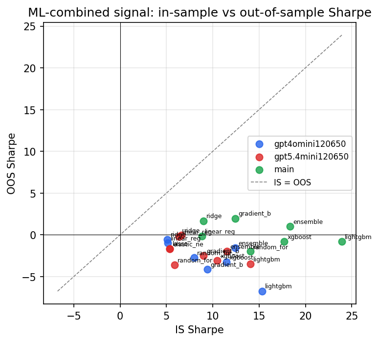

*IS vs OOS Sharpe (overfitting diagnostic)*

---
*Generated by `run_model_comparison.py`. Tables: `*.csv`; interactive: `comparison.ipynb`.*
