# Research-LLM factor comparison — `2024-07`

Comparing the **factor output of different research LLMs** on three axes (raw factor quality → factors as ML features → factors through the full agentic fund). The panel, IS/OOS split, horizon and model hyper-parameters are held identical across preruns — the *only* variable is the factor set.

## Preruns compared

| prerun | research_model | usable_factors | dropped_factors |
| --- | --- | --- | --- |
| gpt4omini120650 | gpt-4o-mini | 66 | 0 |
| gpt5.4mini120650 | gpt-5.4-mini | 69 | 0 |
| main | seed library | 78 | 10 |

> Dropped factors declare fields the current data doesn't have yet (e.g. fundamentals); they light up unchanged once that data is downloaded.

*Usable vs awaiting-data factors per research model*

## Key findings

- **Best ML-combined OOS Sharpe:** `gpt4omini120650` with `lightgbm` (OOS Sharpe = 4.224).
- **Mean OOS Sharpe across models, by research set:** `gpt4omini120650` = 0.936, `gpt5.4mini120650` = 0.329, `main` = -2.812.
- **Highest mean single-factor |IC| (h=6):** `gpt4omini120650` (mean |IC| = 0.0057).
- **Most diverse zoo (highest effective/raw factor ratio):** `gpt5.4mini120650` (eff 46.5 of 69, ratio 0.67).
- **Best selection-deflated single-factor |IC|:** `main` (deflated |IC| = 0.0114 from 38 factors tried).

## 1. Single-factor IC (raw factor quality)

Per-underlying time-series Spearman rank-IC of every researched factor, recomputed on the shared panel at horizons h=1, h=6, h=60. The per-underlying IC correlates each factor's value vector with the underlying's own forward-return vector (pooled across underlyings); the cross-sectional IC ranks across underlyings per timestamp.

| prerun | n_factors | mean_abs_ic_1 | mean_abs_ic_6 | mean_abs_ic_60 | mean_abs_icir_6 | best_factor_h6 | best_abs_ic_h6 |
| --- | --- | --- | --- | --- | --- | --- | --- |
| gpt4omini120650 | 66 | 0.0053 | 0.0057 | 0.0103 | 0.3422 | order_flow_momentum | 0.0144 |
| gpt5.4mini120650 | 69 | 0.0046 | 0.0054 | 0.01 | 0.4138 | book_decay_contrast_reversal | 0.0096 |
| main | 78 | 0.0038 | 0.0057 | 0.0064 | 0.3529 | rsi_mean_reversion | 0.0184 |

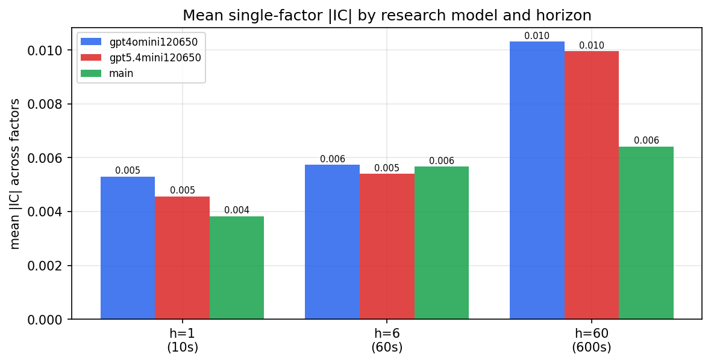

*Mean |IC| by research model and horizon*

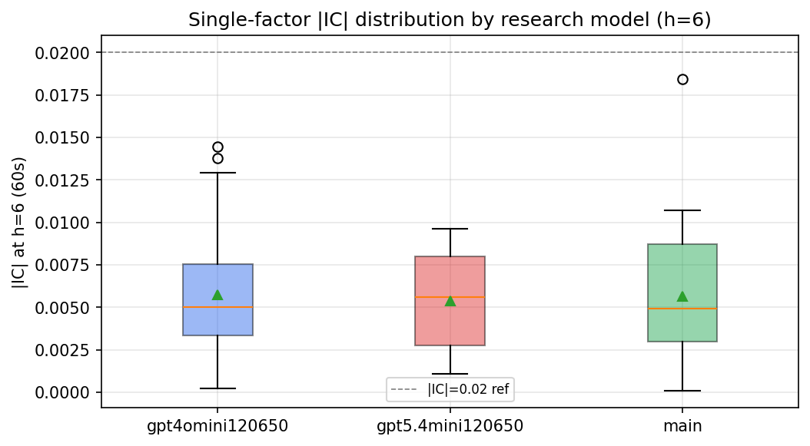

*Per-factor |IC| distribution by research model*

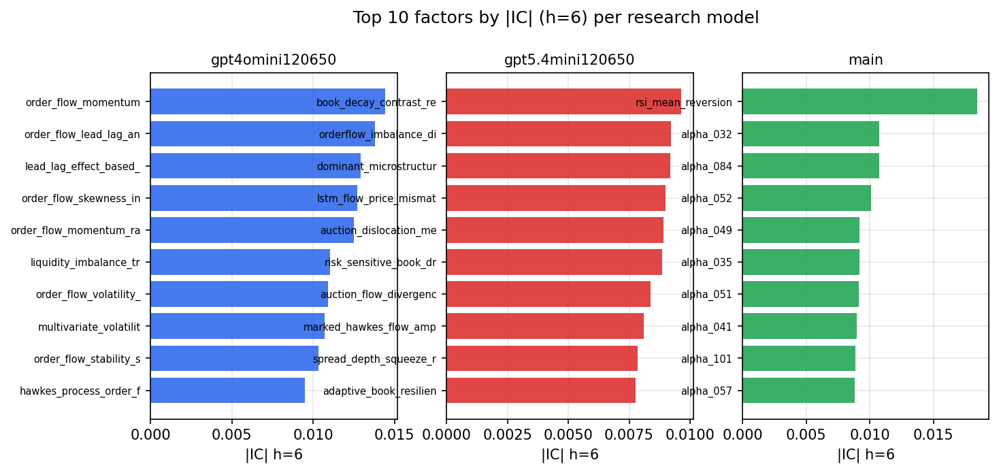

*Top factors by |IC| per research model*

## 2. Factor diversity & redundancy

Pairwise correlation of each zoo's *signals*. `eff_n_factors` is the effective number of independent factors (participation ratio of the correlation eigenvalues); `eff_ratio` and `redundancy` summarise how much unique information the zoo holds vs. how much is duplicated; `n_clusters` groups factors at |corr| ≥ 0.7.

| prerun | n_factors | eff_n_factors | eff_ratio | mean_abs_corr | n_clusters | redundancy |
| --- | --- | --- | --- | --- | --- | --- |
| gpt4omini120650 | 66 | 25.4264 | 0.3852 | 0.055 | 49 | 0.6148 |
| gpt5.4mini120650 | 69 | 46.5237 | 0.6743 | 0.0142 | 62 | 0.3257 |
| main | 78 | 42.8534 | 0.5494 | 0.0278 | 70 | 0.4506 |

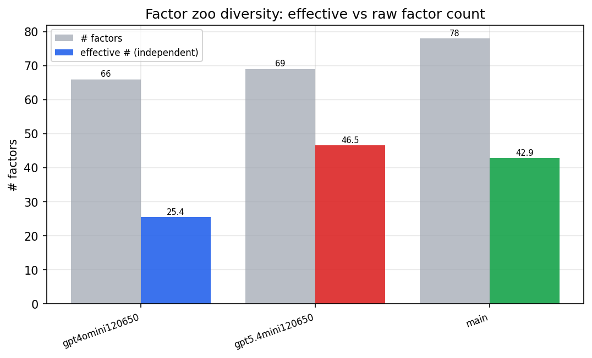

*Effective vs raw factor count per research model*

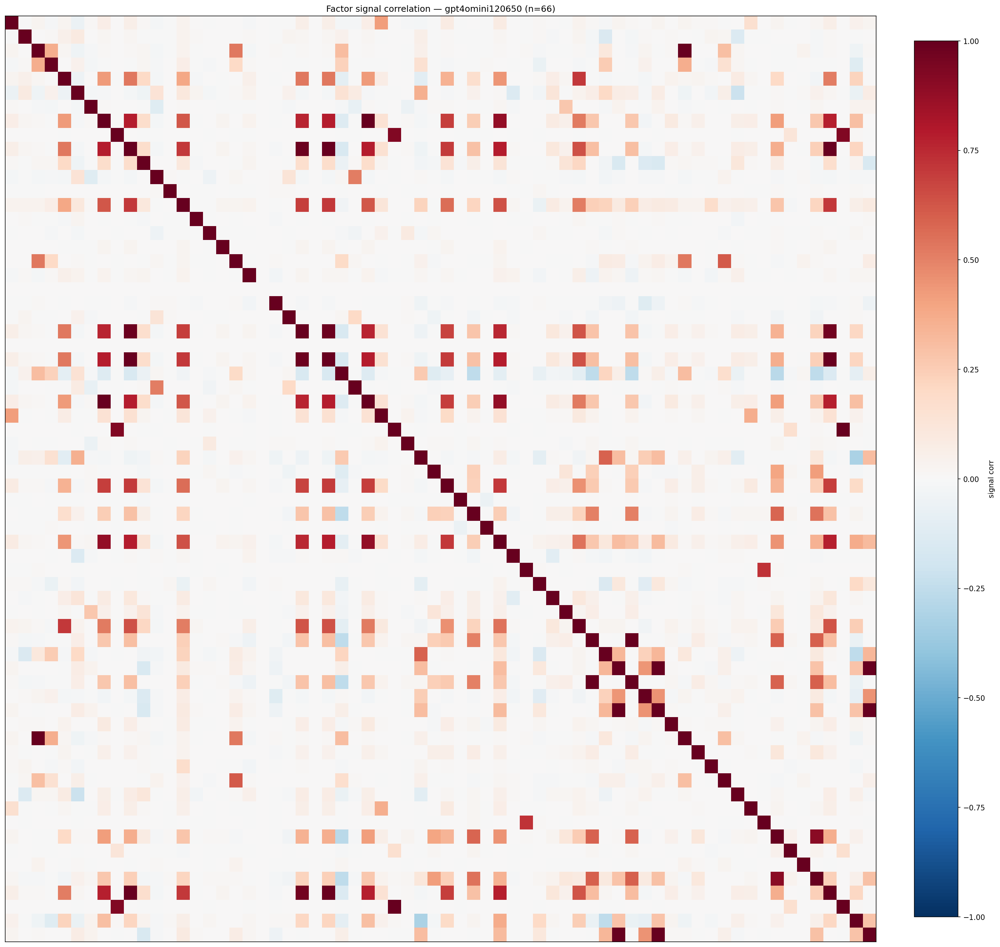

*Signal correlation matrix — gpt4omini120650*

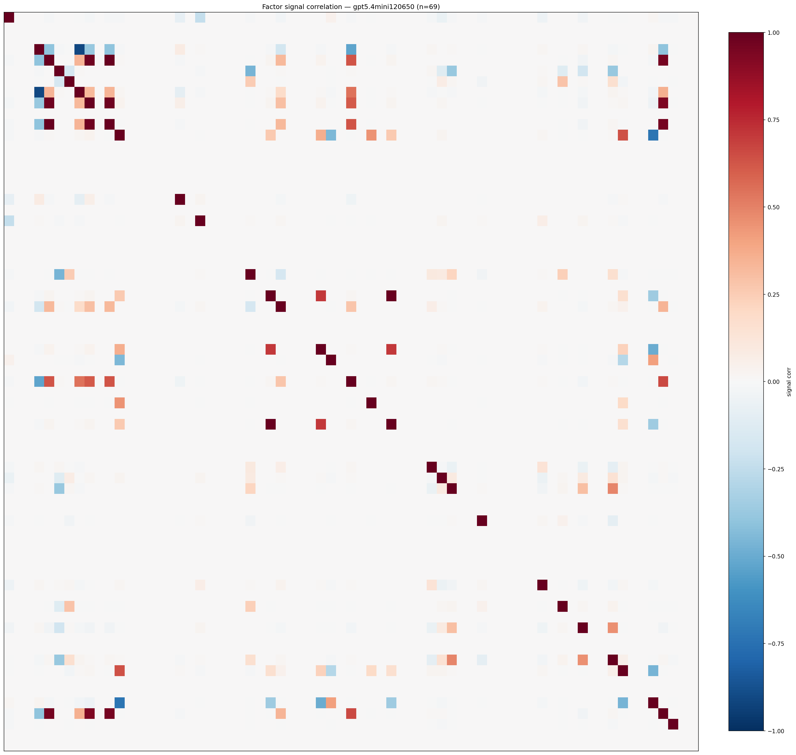

*Signal correlation matrix — gpt5.4mini120650*

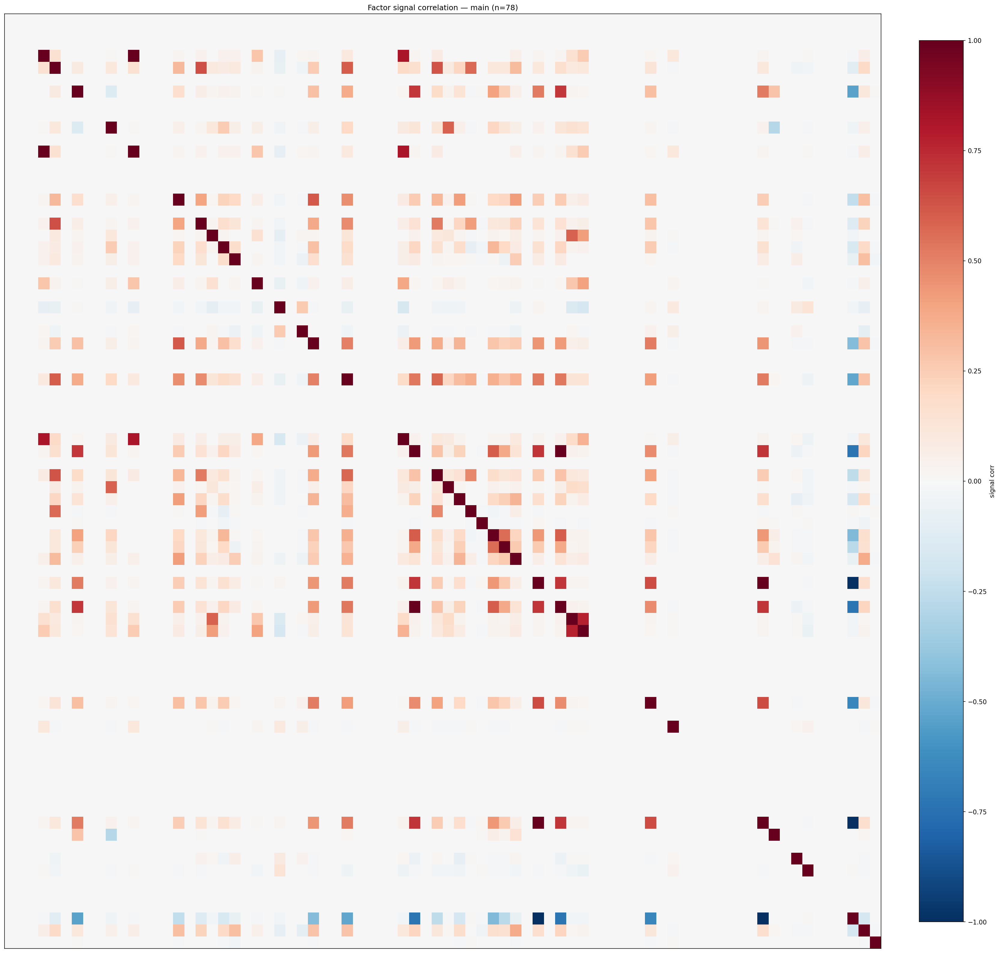

*Signal correlation matrix — main*

## 3. Deflation & model-based importance

`deflated_best_ic` haircuts each zoo's best |IC| for the number of factors tried (`ic_n_tested`) — a bigger zoo's best factor is more likely to be lucky. `lasso_n_nonzero` / `lasso_sparsity` show how many factors a sparse linear model actually keeps (model-view redundancy).

| prerun | best_ic | deflated_best_ic | deflated_best_t | ic_n_tested | ic_n_obs | lasso_n_nonzero | lasso_sparsity |
| --- | --- | --- | --- | --- | --- | --- | --- |
| gpt4omini120650 | 0.0144 | 0.0069 | 2.6435 | 64 | 146339 | 0 | 1.0 |
| gpt5.4mini120650 | 0.0096 | 0.0028 | 1.0688 | 31 | 146339 | 0 | 1.0 |
| main | 0.0184 | 0.0114 | 4.3574 | 38 | 146339 | 0 | 1.0 |

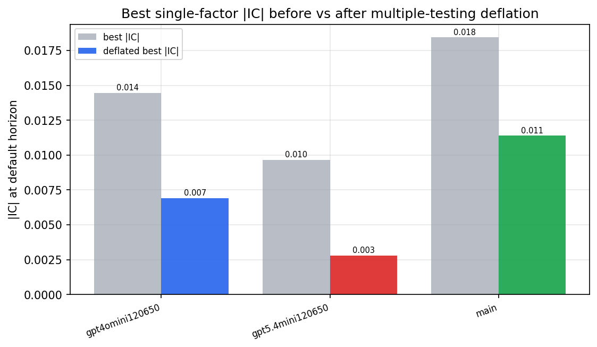

*Best |IC| before vs after multiple-testing deflation*

*Top factors by lasso importance per zoo*

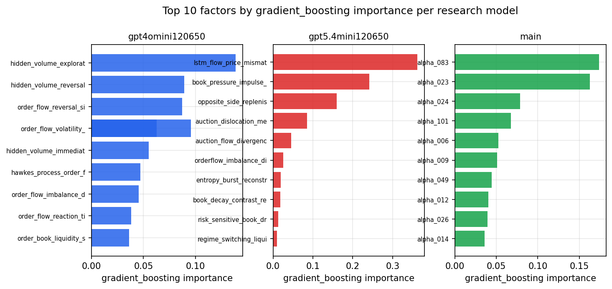

*Top factors by gradient_boosting importance per zoo*

## 4. ML-combined signal — per-underlying vectorised backtest

Each model combines a prerun's factors into ONE signal (fit `factors → forward return` on IS, predict per (bar, underlying)), then that combined signal is run through a simple vectorised backtest — `position(signal) × the underlying's own forward return` — on the held-out OOS tail (+ an equal-weight ensemble). No cross-sectional ranking.

> Config: position=**threshold** (t=1.0, z-score `expanding`), aggregation=**portfolio**, fit-standardise=**per_underlying**, horizon=6.

| prerun | model | n_factors_used | oos_ic | oos_sharpe | is_sharpe | oos_ann_return | oos_max_drawdown |
| --- | --- | --- | --- | --- | --- | --- | --- |
| gpt4omini120650 | linear_regression | 66 | -0.0105 | 0.151 | 6.1838 | 0.0098 | -0.0231 |
| gpt4omini120650 | ridge | 66 | -0.0102 | -0.1034 | 6.1885 | -0.0067 | -0.0237 |
| gpt4omini120650 | lasso | 66 | nan | nan | nan | nan | nan |
| gpt4omini120650 | elastic_net | 66 | nan | nan | nan | nan | nan |
| gpt4omini120650 | random_forest | 66 | -0.0032 | 0.2815 | 6.7754 | 0.0182 | -0.0224 |
| gpt4omini120650 | gradient_boosting | 66 | 0.0108 | 0.192 | 8.227 | 0.0091 | -0.0135 |
| gpt4omini120650 | xgboost | 66 | -0.0184 | 0.354 | 10.5362 | 0.0167 | -0.0119 |
| gpt4omini120650 | lightgbm | 66 | 0.0002 | 4.2238 | 16.9107 | 0.1298 | -0.004 |
| gpt4omini120650 | ensemble | 66 | -0.0155 | 1.4507 | 9.2261 | 0.0889 | -0.0181 |
| gpt5.4mini120650 | linear_regression | 69 | 0.0033 | 2.5418 | 5.3248 | 0.1459 | -0.0171 |
| gpt5.4mini120650 | ridge | 69 | 0.0025 | 2.3157 | 5.3613 | 0.133 | -0.0163 |
| gpt5.4mini120650 | lasso | 69 | nan | nan | nan | nan | nan |
| gpt5.4mini120650 | elastic_net | 69 | nan | nan | nan | nan | nan |
| gpt5.4mini120650 | random_forest | 69 | -0.008 | 1.3057 | 5.6529 | 0.0679 | -0.0161 |
| gpt5.4mini120650 | gradient_boosting | 69 | 0.0017 | -0.7842 | 7.8407 | -0.0243 | -0.0125 |
| gpt5.4mini120650 | xgboost | 69 | -0.0096 | -1.6448 | 10.7579 | -0.0683 | -0.014 |
| gpt5.4mini120650 | lightgbm | 69 | -0.0071 | -1.2162 | 14.713 | -0.0472 | -0.014 |
| gpt5.4mini120650 | ensemble | 69 | 0.0 | -0.2167 | 10.6513 | -0.009 | -0.0114 |
| main | linear_regression | 78 | 0.0027 | -0.4673 | 8.6217 | -0.0092 | -0.007 |
| main | ridge | 78 | 0.0021 | -2.3362 | 8.4833 | -0.0483 | -0.0083 |
| main | lasso | 78 | nan | nan | nan | nan | nan |
| main | elastic_net | 78 | nan | nan | nan | nan | nan |
| main | random_forest | 78 | -0.0049 | -1.2734 | 8.8893 | -0.045 | -0.0106 |
| main | gradient_boosting | 78 | -0.0009 | -5.3973 | 12.0441 | -0.1284 | -0.0118 |
| main | xgboost | 78 | -0.0081 | -2.7435 | 15.0944 | -0.0701 | -0.0078 |
| main | lightgbm | 78 | -0.008 | -2.6025 | 19.3676 | -0.0721 | -0.0101 |
| main | ensemble | 78 | -0.0056 | -4.8633 | 16.5013 | -0.1373 | -0.0119 |

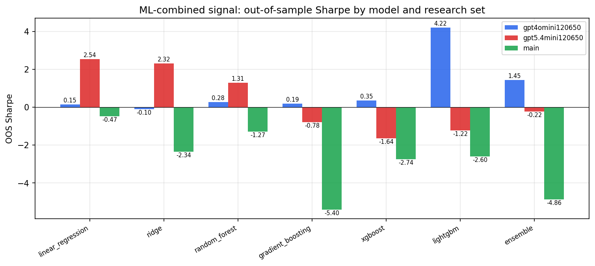

*ML-combined OOS Sharpe by model and research set*

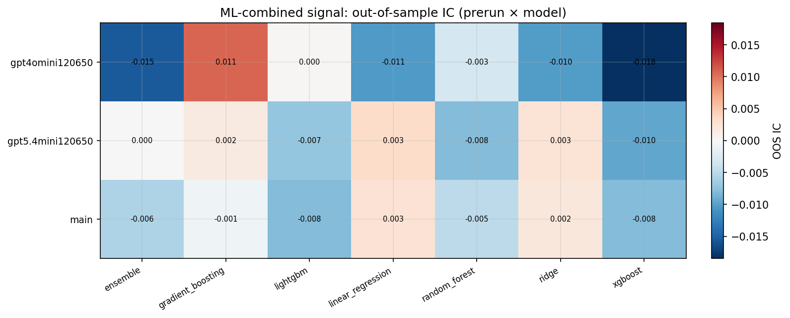

*ML-combined OOS IC (prerun × model)*

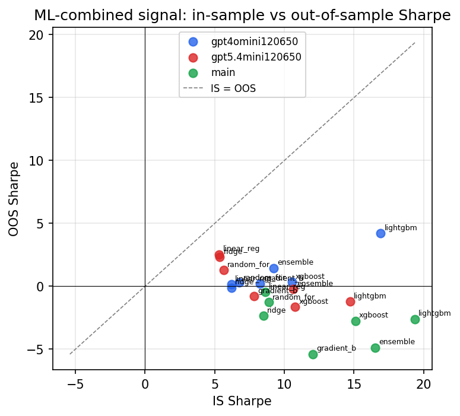

*IS vs OOS Sharpe (overfitting diagnostic)*

---
*Generated by `run_model_comparison.py`. Tables: `*.csv`; interactive: `comparison.ipynb`.*
