# Research-LLM factor comparison — `2024-08`

Comparing the **factor output of different research LLMs** on three axes (raw factor quality → factors as ML features → factors through the full agentic fund). The panel, IS/OOS split, horizon and model hyper-parameters are held identical across preruns — the *only* variable is the factor set.

## Preruns compared

| prerun | research_model | usable_factors | dropped_factors |
| --- | --- | --- | --- |
| gpt4omini120650 | gpt-4o-mini | 66 | 0 |
| gpt5.4mini120650 | gpt-5.4-mini | 69 | 0 |
| main | seed library | 78 | 10 |

> Dropped factors declare fields the current data doesn't have yet (e.g. fundamentals); they light up unchanged once that data is downloaded.

*Usable vs awaiting-data factors per research model*

## Key findings

- **Best ML-combined OOS Sharpe:** `gpt4omini120650` with `gradient_boosting` (OOS Sharpe = 10.335).
- **Mean OOS Sharpe across models, by research set:** `gpt4omini120650` = 4.909, `gpt5.4mini120650` = 1.465, `main` = 0.865.
- **Highest mean single-factor |IC| (h=6):** `gpt4omini120650` (mean |IC| = 0.0073).
- **Most diverse zoo (highest effective/raw factor ratio):** `gpt5.4mini120650` (eff 43.4 of 69, ratio 0.63).
- **Best selection-deflated single-factor |IC|:** `gpt4omini120650` (deflated |IC| = 0.0129 from 64 factors tried).

## 1. Single-factor IC (raw factor quality)

Per-underlying time-series Spearman rank-IC of every researched factor, recomputed on the shared panel at horizons h=1, h=6, h=60. The per-underlying IC correlates each factor's value vector with the underlying's own forward-return vector (pooled across underlyings); the cross-sectional IC ranks across underlyings per timestamp.

| prerun | n_factors | mean_abs_ic_1 | mean_abs_ic_6 | mean_abs_ic_60 | mean_abs_icir_6 | best_factor_h6 | best_abs_ic_h6 |
| --- | --- | --- | --- | --- | --- | --- | --- |
| gpt4omini120650 | 66 | 0.0055 | 0.0073 | 0.0075 | 0.3536 | order_flow_momentum | 0.0205 |
| gpt5.4mini120650 | 69 | 0.005 | 0.0061 | 0.0081 | 0.3441 | auction_flow_divergence_reversion | 0.0185 |
| main | 78 | 0.0051 | 0.0062 | 0.0052 | 0.3305 | alpha_032 | 0.0179 |

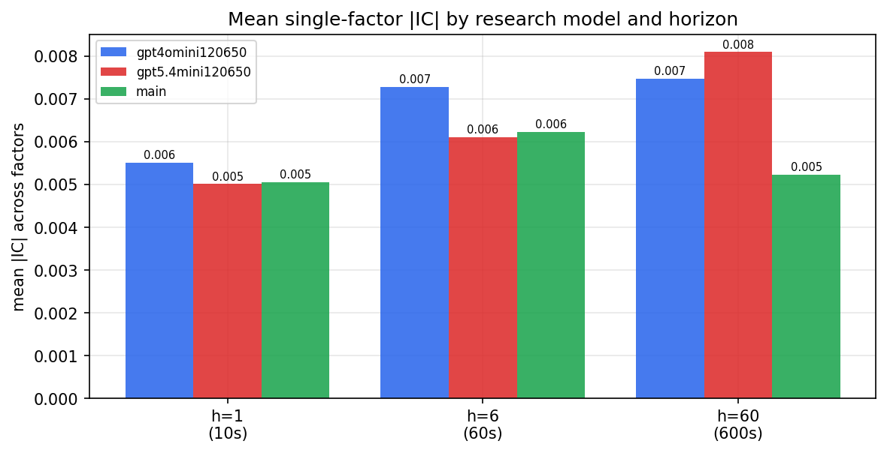

*Mean |IC| by research model and horizon*

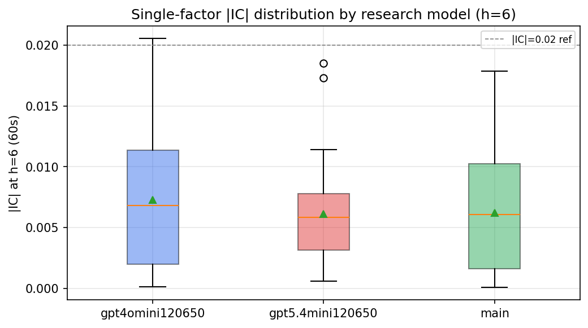

*Per-factor |IC| distribution by research model*

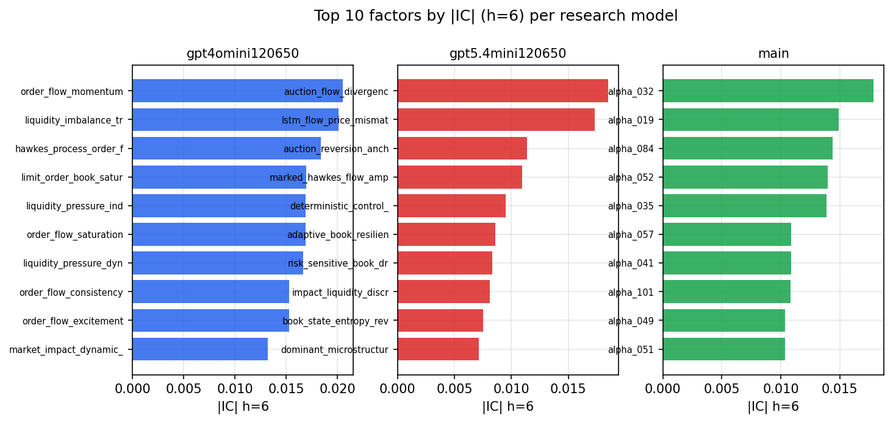

*Top factors by |IC| per research model*

## 2. Factor diversity & redundancy

Pairwise correlation of each zoo's *signals*. `eff_n_factors` is the effective number of independent factors (participation ratio of the correlation eigenvalues); `eff_ratio` and `redundancy` summarise how much unique information the zoo holds vs. how much is duplicated; `n_clusters` groups factors at |corr| ≥ 0.7.

| prerun | n_factors | eff_n_factors | eff_ratio | mean_abs_corr | n_clusters | redundancy |
| --- | --- | --- | --- | --- | --- | --- |
| gpt4omini120650 | 66 | 25.048 | 0.3795 | 0.0562 | 51 | 0.6205 |
| gpt5.4mini120650 | 69 | 43.3827 | 0.6287 | 0.0167 | 61 | 0.3713 |
| main | 78 | 42.6325 | 0.5466 | 0.0278 | 70 | 0.4534 |

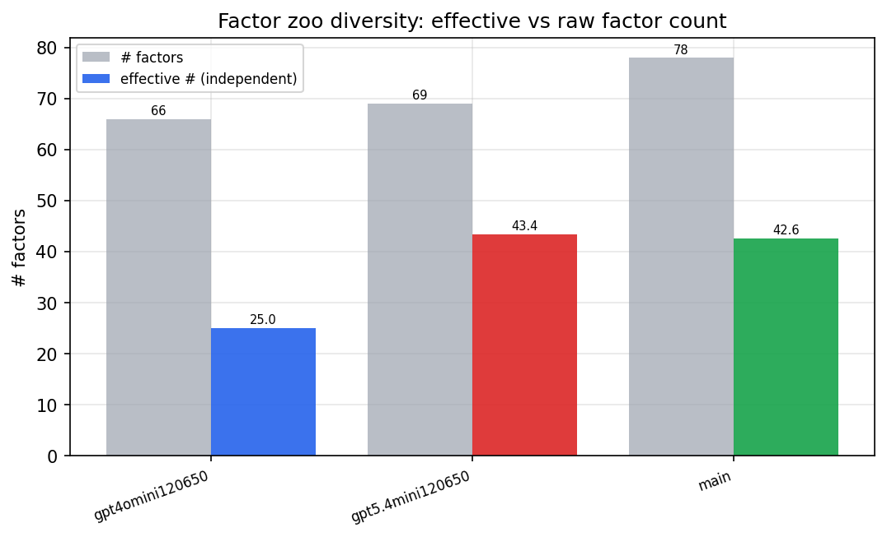

*Effective vs raw factor count per research model*

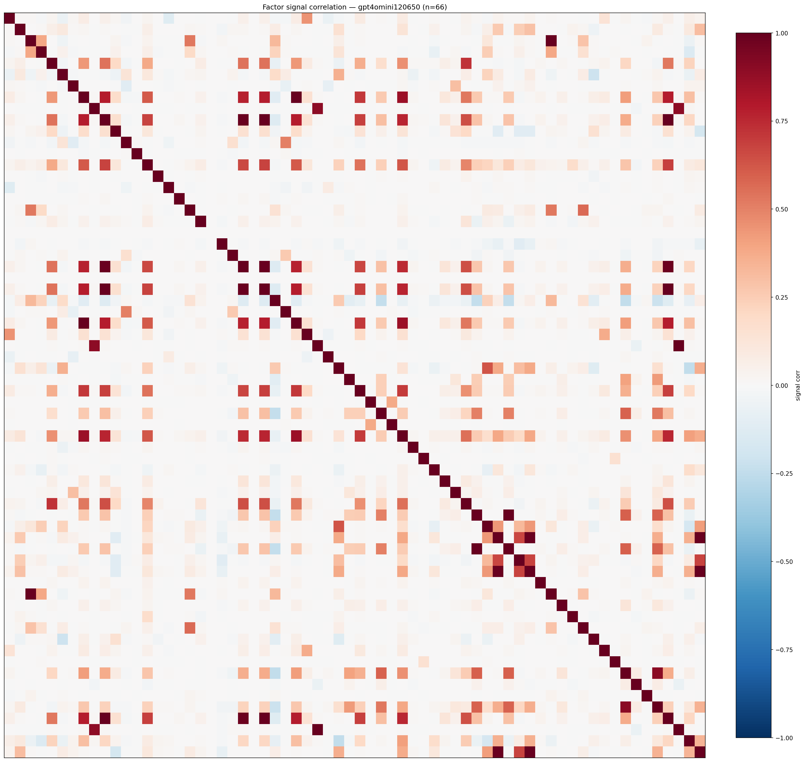

*Signal correlation matrix — gpt4omini120650*

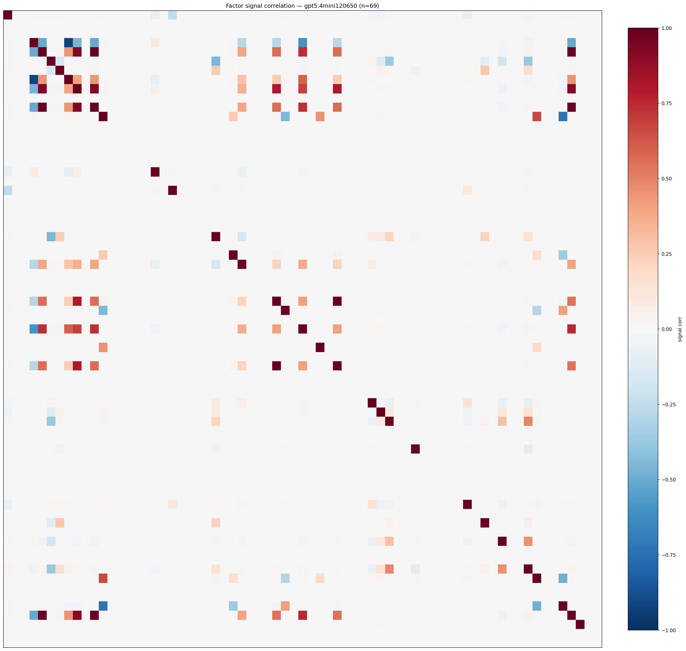

*Signal correlation matrix — gpt5.4mini120650*

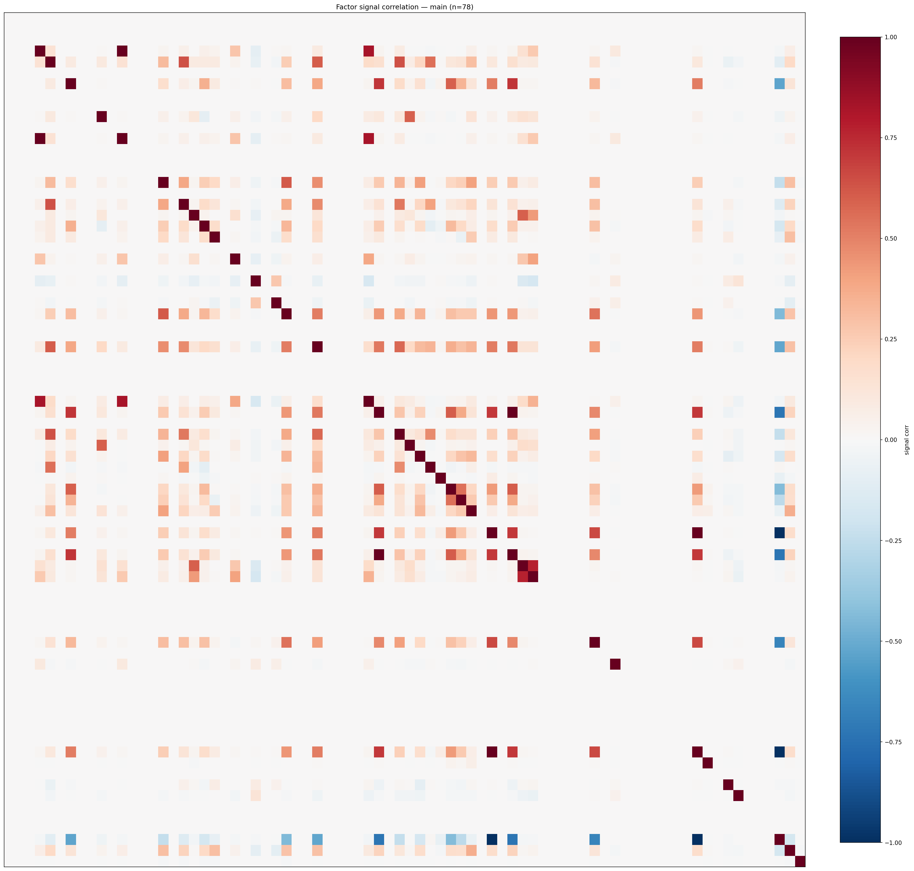

*Signal correlation matrix — main*

## 3. Deflation & model-based importance

`deflated_best_ic` haircuts each zoo's best |IC| for the number of factors tried (`ic_n_tested`) — a bigger zoo's best factor is more likely to be lucky. `lasso_n_nonzero` / `lasso_sparsity` show how many factors a sparse linear model actually keeps (model-view redundancy).

| prerun | best_ic | deflated_best_ic | deflated_best_t | ic_n_tested | ic_n_obs | lasso_n_nonzero | lasso_sparsity |
| --- | --- | --- | --- | --- | --- | --- | --- |
| gpt4omini120650 | 0.0205 | 0.0129 | 4.9106 | 64 | 143998 | 0 | 1.0 |
| gpt5.4mini120650 | 0.0185 | 0.0116 | 4.4054 | 31 | 143998 | 0 | 1.0 |
| main | 0.0179 | 0.0107 | 4.0782 | 38 | 143998 | 0 | 1.0 |

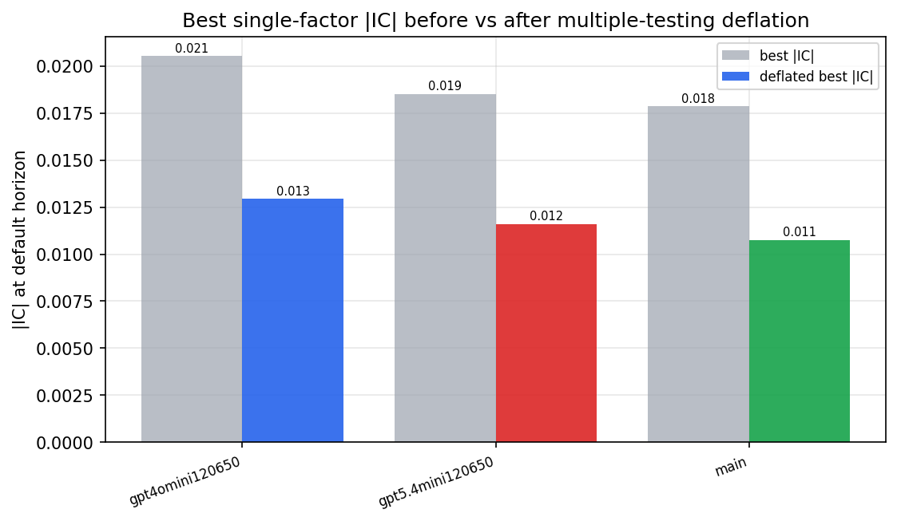

*Best |IC| before vs after multiple-testing deflation*

*Top factors by lasso importance per zoo*

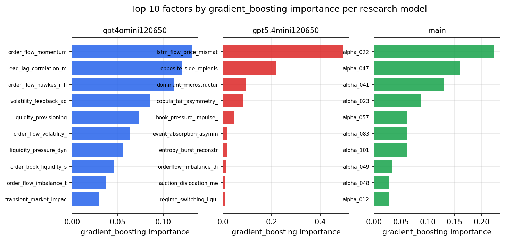

*Top factors by gradient_boosting importance per zoo*

## 4. ML-combined signal — per-underlying vectorised backtest

Each model combines a prerun's factors into ONE signal (fit `factors → forward return` on IS, predict per (bar, underlying)), then that combined signal is run through a simple vectorised backtest — `position(signal) × the underlying's own forward return` — on the held-out OOS tail (+ an equal-weight ensemble). No cross-sectional ranking.

> Config: position=**threshold** (t=1.0, z-score `expanding`), aggregation=**portfolio**, fit-standardise=**per_underlying**, horizon=6.

| prerun | model | n_factors_used | oos_ic | oos_sharpe | is_sharpe | oos_ann_return | oos_max_drawdown |
| --- | --- | --- | --- | --- | --- | --- | --- |
| gpt4omini120650 | linear_regression | 66 | -0.0147 | 3.3604 | 10.9055 | 0.2293 | -0.0166 |
| gpt4omini120650 | ridge | 66 | -0.0114 | 4.0045 | 10.2854 | 0.2815 | -0.014 |
| gpt4omini120650 | lasso | 66 | nan | nan | nan | nan | nan |
| gpt4omini120650 | elastic_net | 66 | nan | nan | nan | nan | nan |
| gpt4omini120650 | random_forest | 66 | 0.0008 | 6.6385 | 13.5196 | 0.6386 | -0.0158 |
| gpt4omini120650 | gradient_boosting | 66 | 0.0107 | 10.3351 | 10.4467 | 0.7168 | -0.0021 |
| gpt4omini120650 | xgboost | 66 | -0.0008 | 2.7823 | 14.7371 | 0.2224 | -0.0153 |
| gpt4omini120650 | lightgbm | 66 | -0.0066 | 2.8763 | 19.8451 | 0.2353 | -0.0163 |
| gpt4omini120650 | ensemble | 66 | -0.0131 | 4.367 | 17.4841 | 0.3962 | -0.0158 |
| gpt5.4mini120650 | linear_regression | 69 | -0.0095 | 4.7577 | 8.6805 | 0.2684 | -0.005 |
| gpt5.4mini120650 | ridge | 69 | -0.0101 | 4.2202 | 8.7287 | 0.1261 | -0.004 |
| gpt5.4mini120650 | lasso | 69 | nan | nan | nan | nan | nan |
| gpt5.4mini120650 | elastic_net | 69 | nan | nan | nan | nan | nan |
| gpt5.4mini120650 | random_forest | 69 | 0.0058 | 0.9114 | 13.6989 | 0.0709 | -0.0268 |
| gpt5.4mini120650 | gradient_boosting | 69 | 0.0052 | -4.4344 | 9.38 | -0.1252 | -0.0125 |
| gpt5.4mini120650 | xgboost | 69 | 0.0115 | 3.932 | 15.3128 | 0.2104 | -0.0108 |
| gpt5.4mini120650 | lightgbm | 69 | 0.0074 | 0.249 | 21.507 | 0.0163 | -0.0228 |
| gpt5.4mini120650 | ensemble | 69 | 0.0004 | 0.6171 | 18.1607 | 0.0318 | -0.0198 |
| main | linear_regression | 78 | -0.0109 | 4.3385 | 10.7053 | 0.0726 | -0.0022 |
| main | ridge | 78 | -0.0115 | 4.3661 | 10.1265 | 0.0746 | -0.0024 |
| main | lasso | 78 | nan | nan | nan | nan | nan |
| main | elastic_net | 78 | nan | nan | nan | nan | nan |
| main | random_forest | 78 | -0.0022 | -0.713 | 13.6297 | -0.0277 | -0.0128 |
| main | gradient_boosting | 78 | 0.0038 | -1.3669 | 15.0496 | -0.0499 | -0.011 |
| main | xgboost | 78 | 0.0113 | 2.4372 | 18.6725 | 0.1048 | -0.0094 |
| main | lightgbm | 78 | 0.0054 | -2.5915 | 25.1165 | -0.1071 | -0.0106 |
| main | ensemble | 78 | 0.0046 | -0.418 | 21.1782 | -0.0165 | -0.0127 |

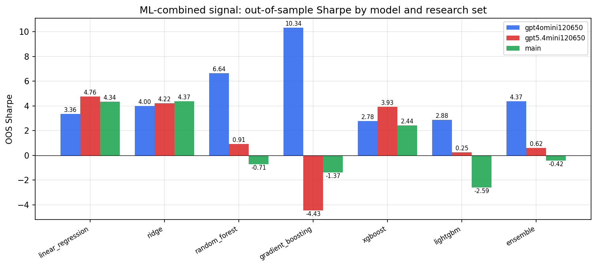

*ML-combined OOS Sharpe by model and research set*

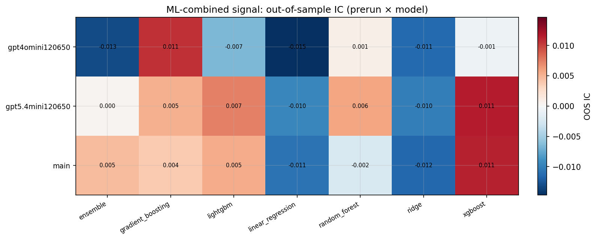

*ML-combined OOS IC (prerun × model)*

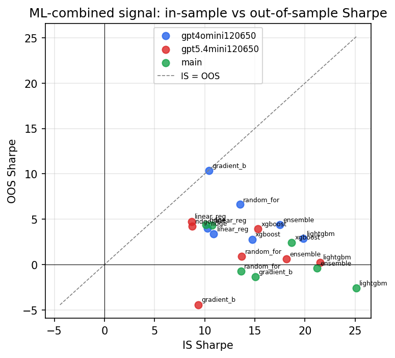

*IS vs OOS Sharpe (overfitting diagnostic)*

---
*Generated by `run_model_comparison.py`. Tables: `*.csv`; interactive: `comparison.ipynb`.*
