# Research-LLM factor comparison — `2024-09`

Comparing the **factor output of different research LLMs** on three axes (raw factor quality → factors as ML features → factors through the full agentic fund). The panel, IS/OOS split, horizon and model hyper-parameters are held identical across preruns — the *only* variable is the factor set.

## Preruns compared

| prerun | research_model | usable_factors | dropped_factors |
| --- | --- | --- | --- |
| gpt4omini120650 | gpt-4o-mini | 66 | 0 |
| gpt5.4mini120650 | gpt-5.4-mini | 69 | 0 |
| main | seed library | 78 | 10 |

> Dropped factors declare fields the current data doesn't have yet (e.g. fundamentals); they light up unchanged once that data is downloaded.

*Usable vs awaiting-data factors per research model*

## Key findings

- **Best ML-combined OOS Sharpe:** `gpt4omini120650` with `linear_regression` (OOS Sharpe = 6.886).
- **Mean OOS Sharpe across models, by research set:** `gpt4omini120650` = 3.949, `main` = 2.341, `gpt5.4mini120650` = -0.108.
- **Highest mean single-factor |IC| (h=6):** `gpt4omini120650` (mean |IC| = 0.0114).
- **Most diverse zoo (highest effective/raw factor ratio):** `gpt5.4mini120650` (eff 40.4 of 69, ratio 0.59).
- **Best selection-deflated single-factor |IC|:** `gpt5.4mini120650` (deflated |IC| = 0.0222 from 31 factors tried).

## 1. Single-factor IC (raw factor quality)

Per-underlying time-series Spearman rank-IC of every researched factor, recomputed on the shared panel at horizons h=1, h=6, h=60. The per-underlying IC correlates each factor's value vector with the underlying's own forward-return vector (pooled across underlyings); the cross-sectional IC ranks across underlyings per timestamp.

| prerun | n_factors | mean_abs_ic_1 | mean_abs_ic_6 | mean_abs_ic_60 | mean_abs_icir_6 | best_factor_h6 | best_abs_ic_h6 |
| --- | --- | --- | --- | --- | --- | --- | --- |
| gpt4omini120650 | 66 | 0.0075 | 0.0114 | 0.0082 | 0.5286 | hawkes_process_order_flow_indicator | 0.0295 |
| gpt5.4mini120650 | 69 | 0.0054 | 0.0077 | 0.0079 | 0.5235 | auction_flow_divergence_reversion | 0.0291 |
| main | 78 | 0.0089 | 0.0098 | 0.0041 | 0.5166 | alpha_052 | 0.0248 |

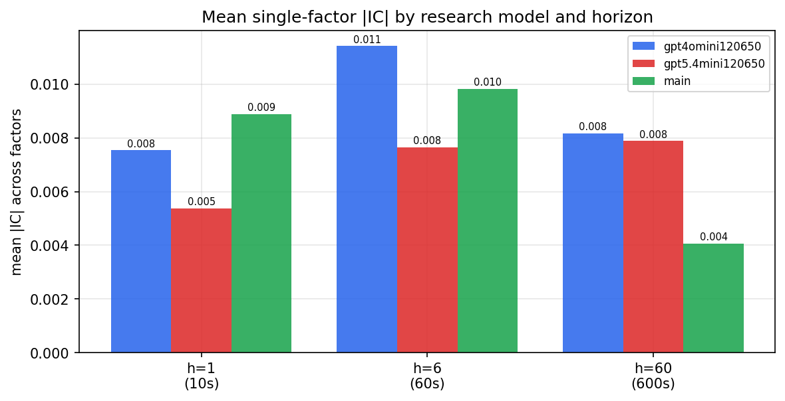

*Mean |IC| by research model and horizon*

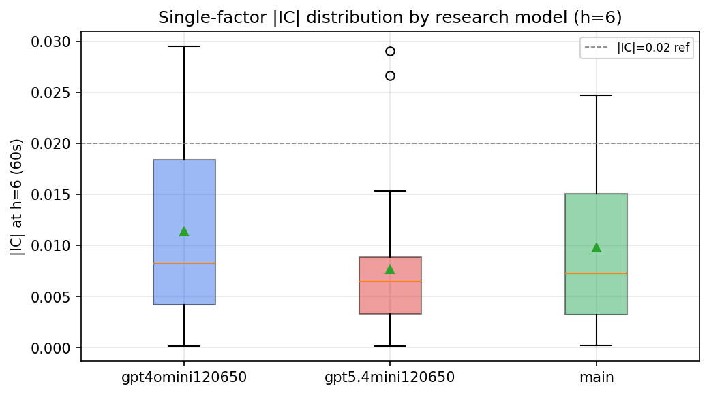

*Per-factor |IC| distribution by research model*

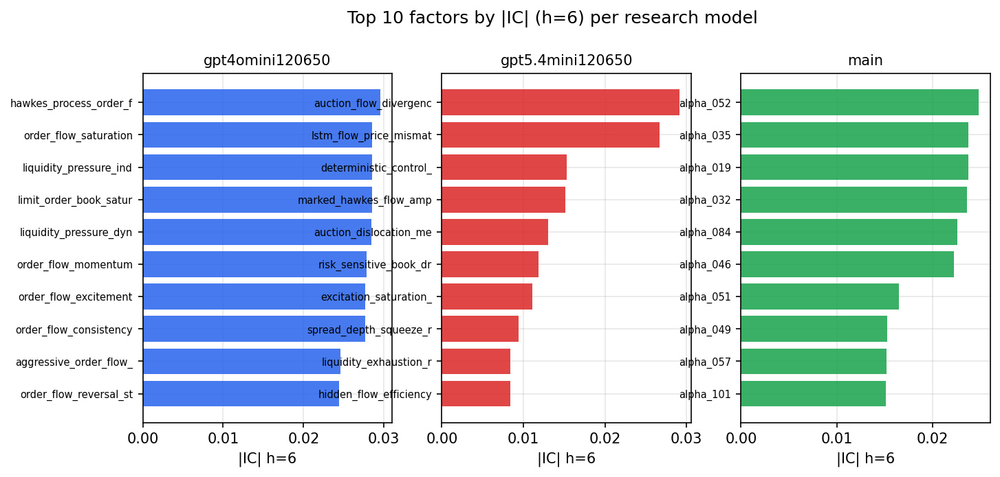

*Top factors by |IC| per research model*

## 2. Factor diversity & redundancy

Pairwise correlation of each zoo's *signals*. `eff_n_factors` is the effective number of independent factors (participation ratio of the correlation eigenvalues); `eff_ratio` and `redundancy` summarise how much unique information the zoo holds vs. how much is duplicated; `n_clusters` groups factors at |corr| ≥ 0.7.

| prerun | n_factors | eff_n_factors | eff_ratio | mean_abs_corr | n_clusters | redundancy |
| --- | --- | --- | --- | --- | --- | --- |
| gpt4omini120650 | 66 | 24.7726 | 0.3753 | 0.0569 | 50 | 0.6247 |
| gpt5.4mini120650 | 69 | 40.393 | 0.5854 | 0.0181 | 61 | 0.4146 |
| main | 78 | 42.4532 | 0.5443 | 0.0284 | 70 | 0.4557 |

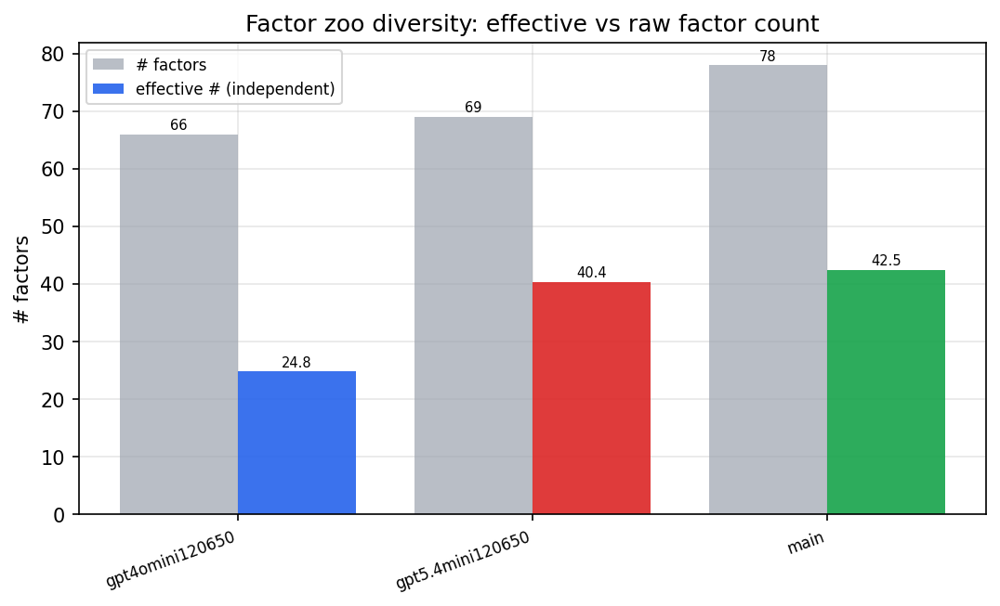

*Effective vs raw factor count per research model*

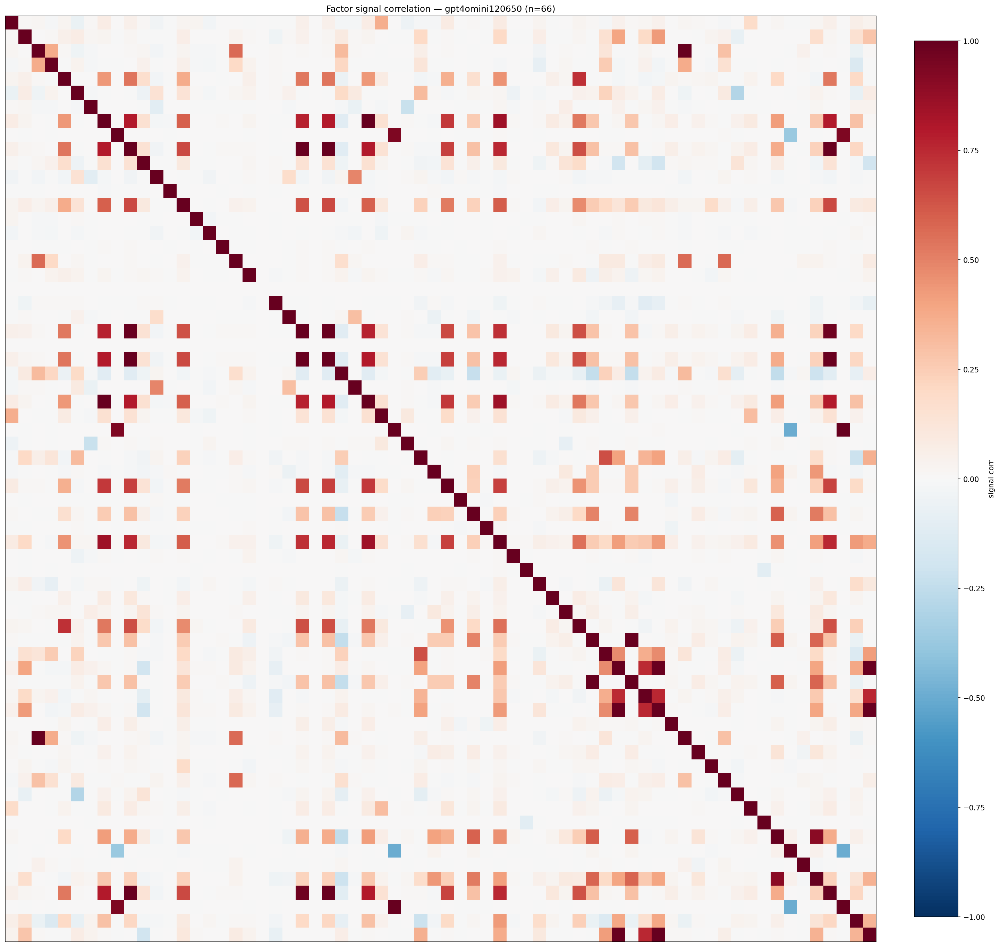

*Signal correlation matrix — gpt4omini120650*

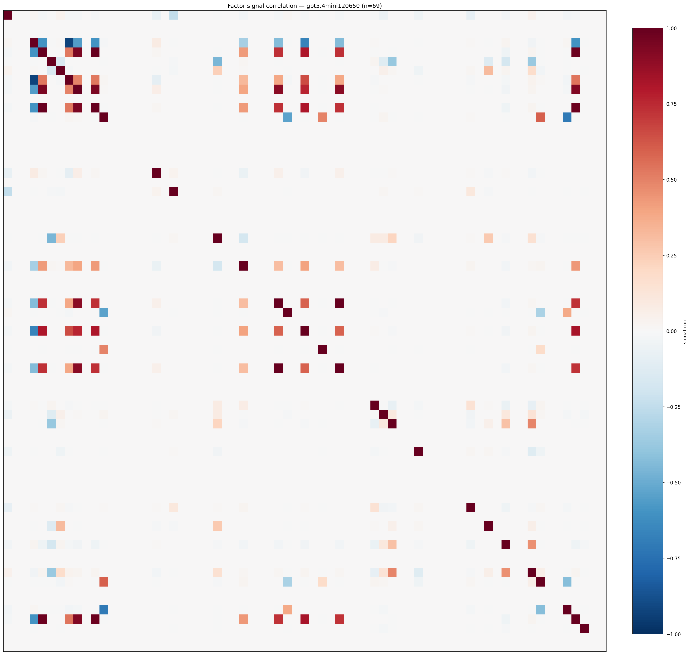

*Signal correlation matrix — gpt5.4mini120650*

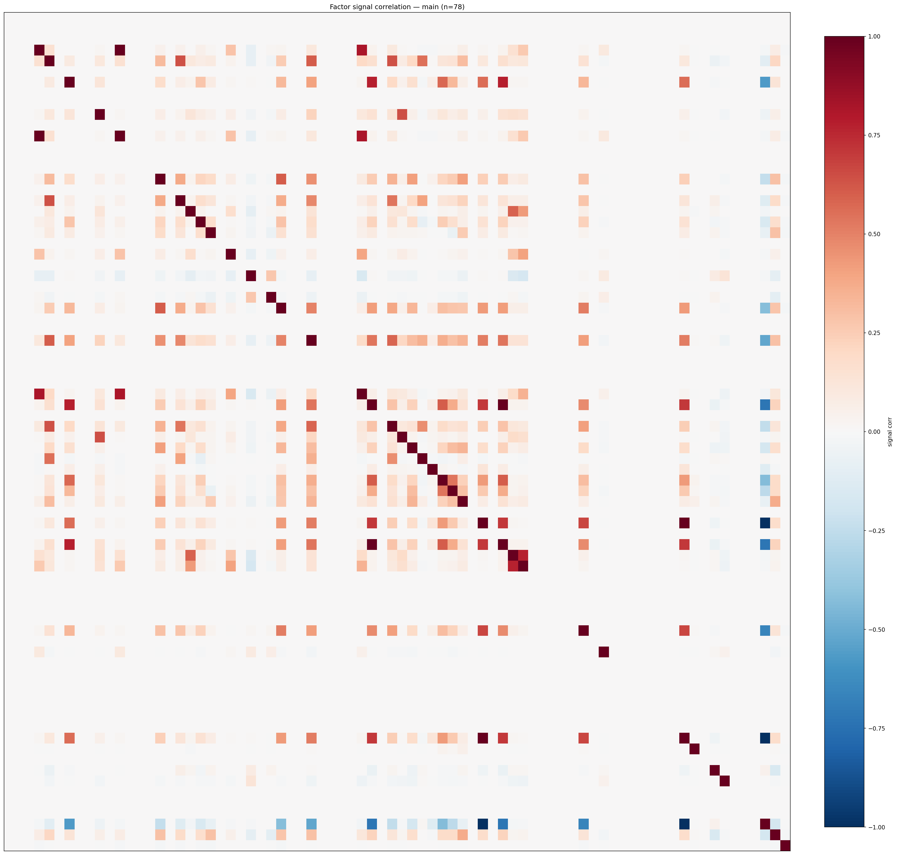

*Signal correlation matrix — main*

## 3. Deflation & model-based importance

`deflated_best_ic` haircuts each zoo's best |IC| for the number of factors tried (`ic_n_tested`) — a bigger zoo's best factor is more likely to be lucky. `lasso_n_nonzero` / `lasso_sparsity` show how many factors a sparse linear model actually keeps (model-view redundancy).

| prerun | best_ic | deflated_best_ic | deflated_best_t | ic_n_tested | ic_n_obs | lasso_n_nonzero | lasso_sparsity |
| --- | --- | --- | --- | --- | --- | --- | --- |
| gpt4omini120650 | 0.0295 | 0.0219 | 8.3209 | 64 | 143997 | 8 | 0.8788 |
| gpt5.4mini120650 | 0.0291 | 0.0222 | 8.4284 | 31 | 143997 | 0 | 1.0 |
| main | 0.0248 | 0.0177 | 6.6995 | 38 | 143997 | 0 | 1.0 |

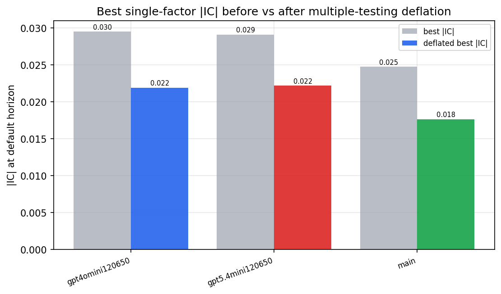

*Best |IC| before vs after multiple-testing deflation*

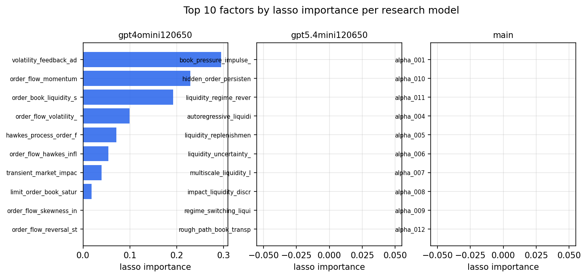

*Top factors by lasso importance per zoo*

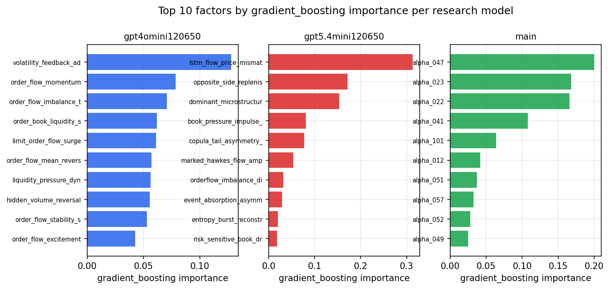

*Top factors by gradient_boosting importance per zoo*

## 4. ML-combined signal — per-underlying vectorised backtest

Each model combines a prerun's factors into ONE signal (fit `factors → forward return` on IS, predict per (bar, underlying)), then that combined signal is run through a simple vectorised backtest — `position(signal) × the underlying's own forward return` — on the held-out OOS tail (+ an equal-weight ensemble). No cross-sectional ranking.

> Config: position=**threshold** (t=1.0, z-score `expanding`), aggregation=**portfolio**, fit-standardise=**per_underlying**, horizon=6.

| prerun | model | n_factors_used | oos_ic | oos_sharpe | is_sharpe | oos_ann_return | oos_max_drawdown |
| --- | --- | --- | --- | --- | --- | --- | --- |
| gpt4omini120650 | linear_regression | 66 | 0.0129 | 6.8865 | 6.9053 | 0.36 | -0.0049 |
| gpt4omini120650 | ridge | 66 | 0.0114 | 6.5857 | 7.217 | 0.4346 | -0.0071 |
| gpt4omini120650 | lasso | 66 | nan | nan | nan | nan | nan |
| gpt4omini120650 | elastic_net | 66 | nan | nan | nan | nan | nan |
| gpt4omini120650 | random_forest | 66 | 0.0034 | 4.3791 | 10.7846 | 0.2874 | -0.0068 |
| gpt4omini120650 | gradient_boosting | 66 | -0.011 | 3.3969 | 10.6705 | 0.237 | -0.0059 |
| gpt4omini120650 | xgboost | 66 | 0.002 | 3.3553 | 11.9917 | 0.1441 | -0.0044 |
| gpt4omini120650 | lightgbm | 66 | -0.0034 | -1.5522 | 16.4341 | -0.0605 | -0.014 |
| gpt4omini120650 | ensemble | 66 | 0.0075 | 4.5944 | 11.2011 | 0.2407 | -0.0055 |
| gpt5.4mini120650 | linear_regression | 69 | 0.0162 | -2.8155 | 1.5161 | -0.0188 | -0.003 |
| gpt5.4mini120650 | ridge | 69 | 0.0181 | 0.6845 | 1.8999 | 0.0055 | -0.0021 |
| gpt5.4mini120650 | lasso | 69 | nan | nan | nan | nan | nan |
| gpt5.4mini120650 | elastic_net | 69 | nan | nan | nan | nan | nan |
| gpt5.4mini120650 | random_forest | 69 | -0.0025 | 0.3814 | 8.8784 | 0.0097 | -0.0068 |
| gpt5.4mini120650 | gradient_boosting | 69 | -0.0063 | 3.8928 | 8.8825 | 0.1222 | -0.0062 |
| gpt5.4mini120650 | xgboost | 69 | -0.0112 | -2.3931 | 10.9691 | -0.069 | -0.0111 |
| gpt5.4mini120650 | lightgbm | 69 | -0.0046 | -3.7975 | 13.8775 | -0.1203 | -0.0146 |
| gpt5.4mini120650 | ensemble | 69 | 0.0054 | 3.2948 | 10.1579 | 0.0931 | -0.0059 |
| main | linear_regression | 78 | -0.014 | 0.8784 | 7.6436 | 0.0069 | -0.0019 |
| main | ridge | 78 | -0.0129 | 0.5959 | 7.9954 | 0.0036 | -0.0013 |
| main | lasso | 78 | nan | nan | nan | nan | nan |
| main | elastic_net | 78 | nan | nan | nan | nan | nan |
| main | random_forest | 78 | -0.0065 | 2.5698 | 16.4756 | 0.0993 | -0.0106 |
| main | gradient_boosting | 78 | -0.0181 | 6.1937 | 10.6579 | 0.1423 | -0.004 |
| main | xgboost | 78 | -0.006 | 1.5946 | 16.832 | 0.0572 | -0.0099 |
| main | lightgbm | 78 | -0.0039 | 0.4221 | 23.433 | 0.0135 | -0.0089 |
| main | ensemble | 78 | -0.0112 | 4.1295 | 9.7724 | 0.0932 | -0.0048 |

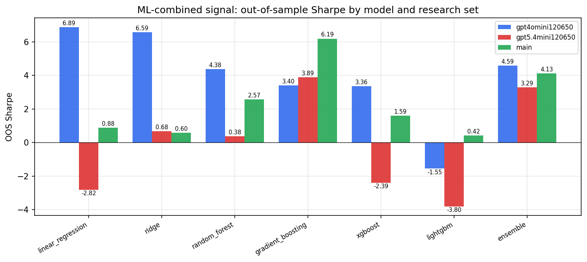

*ML-combined OOS Sharpe by model and research set*

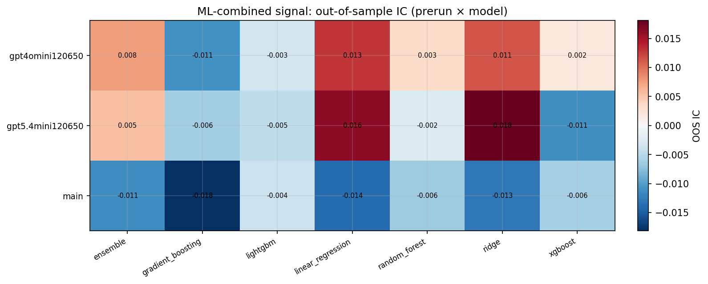

*ML-combined OOS IC (prerun × model)*

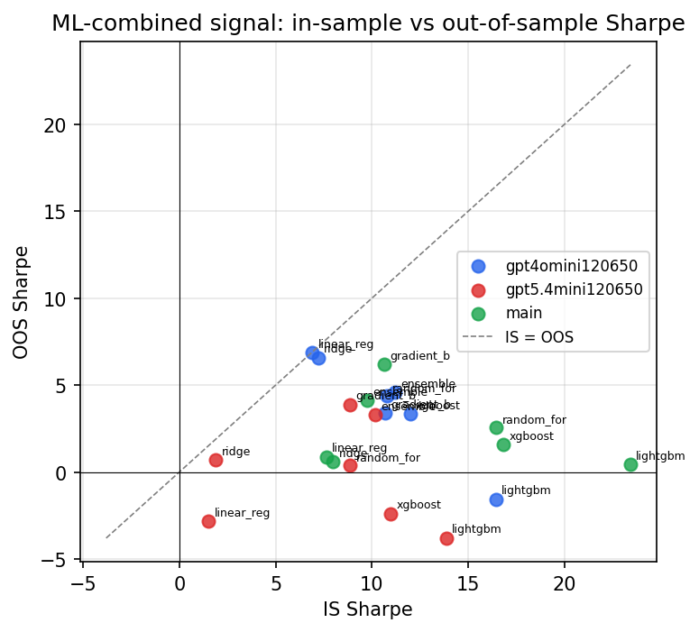

*IS vs OOS Sharpe (overfitting diagnostic)*

---
*Generated by `run_model_comparison.py`. Tables: `*.csv`; interactive: `comparison.ipynb`.*
