# Research-LLM factor comparison — `2024-10`

Comparing the **factor output of different research LLMs** on three axes (raw factor quality → factors as ML features → factors through the full agentic fund). The panel, IS/OOS split, horizon and model hyper-parameters are held identical across preruns — the *only* variable is the factor set.

## Preruns compared

| prerun | research_model | usable_factors | dropped_factors |
| --- | --- | --- | --- |
| gpt4omini120650 | gpt-4o-mini | 66 | 0 |
| gpt5.4mini120650 | gpt-5.4-mini | 69 | 0 |
| main | seed library | 78 | 10 |

> Dropped factors declare fields the current data doesn't have yet (e.g. fundamentals); they light up unchanged once that data is downloaded.

*Usable vs awaiting-data factors per research model*

## Key findings

- **Best ML-combined OOS Sharpe:** `gpt4omini120650` with `lightgbm` (OOS Sharpe = 3.249).
- **Mean OOS Sharpe across models, by research set:** `gpt4omini120650` = -0.755, `main` = -1.596, `gpt5.4mini120650` = -3.038.
- **Highest mean single-factor |IC| (h=6):** `gpt4omini120650` (mean |IC| = 0.0098).
- **Most diverse zoo (highest effective/raw factor ratio):** `gpt5.4mini120650` (eff 40.8 of 69, ratio 0.59).
- **Best selection-deflated single-factor |IC|:** `gpt4omini120650` (deflated |IC| = 0.0184 from 64 factors tried).

## 1. Single-factor IC (raw factor quality)

Per-underlying time-series Spearman rank-IC of every researched factor, recomputed on the shared panel at horizons h=1, h=6, h=60. The per-underlying IC correlates each factor's value vector with the underlying's own forward-return vector (pooled across underlyings); the cross-sectional IC ranks across underlyings per timestamp.

| prerun | n_factors | mean_abs_ic_1 | mean_abs_ic_6 | mean_abs_ic_60 | mean_abs_icir_6 | best_factor_h6 | best_abs_ic_h6 |
| --- | --- | --- | --- | --- | --- | --- | --- |
| gpt4omini120650 | 66 | 0.0088 | 0.0098 | 0.0074 | 0.4416 | liquidity_pressure_dynamics | 0.0259 |
| gpt5.4mini120650 | 69 | 0.0049 | 0.0067 | 0.0074 | 0.4229 | lstm_flow_price_mismatch | 0.0234 |
| main | 78 | 0.0114 | 0.009 | 0.0036 | 0.4648 | alpha_084 | 0.0209 |

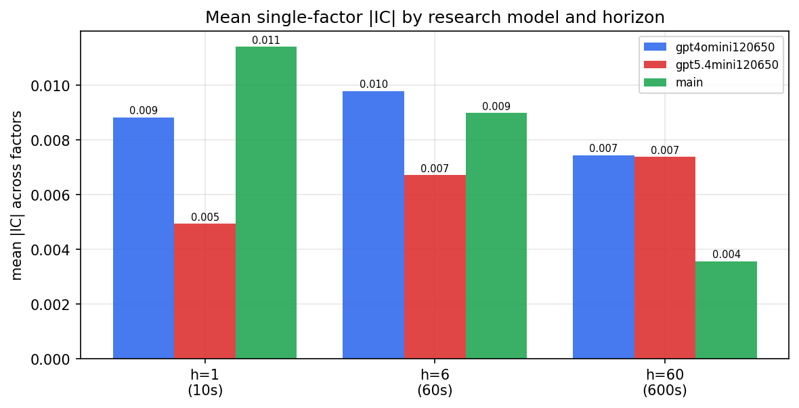

*Mean |IC| by research model and horizon*

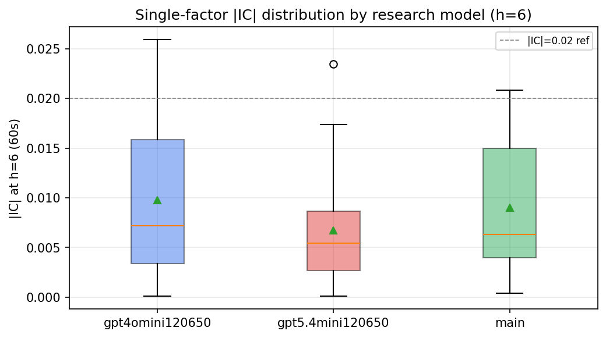

*Per-factor |IC| distribution by research model*

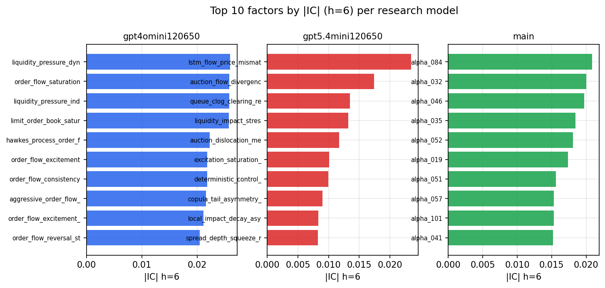

*Top factors by |IC| per research model*

## 2. Factor diversity & redundancy

Pairwise correlation of each zoo's *signals*. `eff_n_factors` is the effective number of independent factors (participation ratio of the correlation eigenvalues); `eff_ratio` and `redundancy` summarise how much unique information the zoo holds vs. how much is duplicated; `n_clusters` groups factors at |corr| ≥ 0.7.

| prerun | n_factors | eff_n_factors | eff_ratio | mean_abs_corr | n_clusters | redundancy |
| --- | --- | --- | --- | --- | --- | --- |
| gpt4omini120650 | 66 | 26.1091 | 0.3956 | 0.0533 | 52 | 0.6044 |
| gpt5.4mini120650 | 69 | 40.8228 | 0.5916 | 0.0172 | 62 | 0.4084 |
| main | 78 | 42.7701 | 0.5483 | 0.0283 | 70 | 0.4517 |

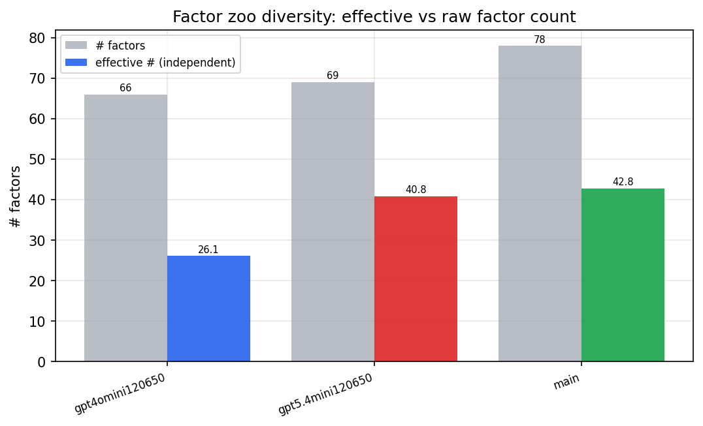

*Effective vs raw factor count per research model*

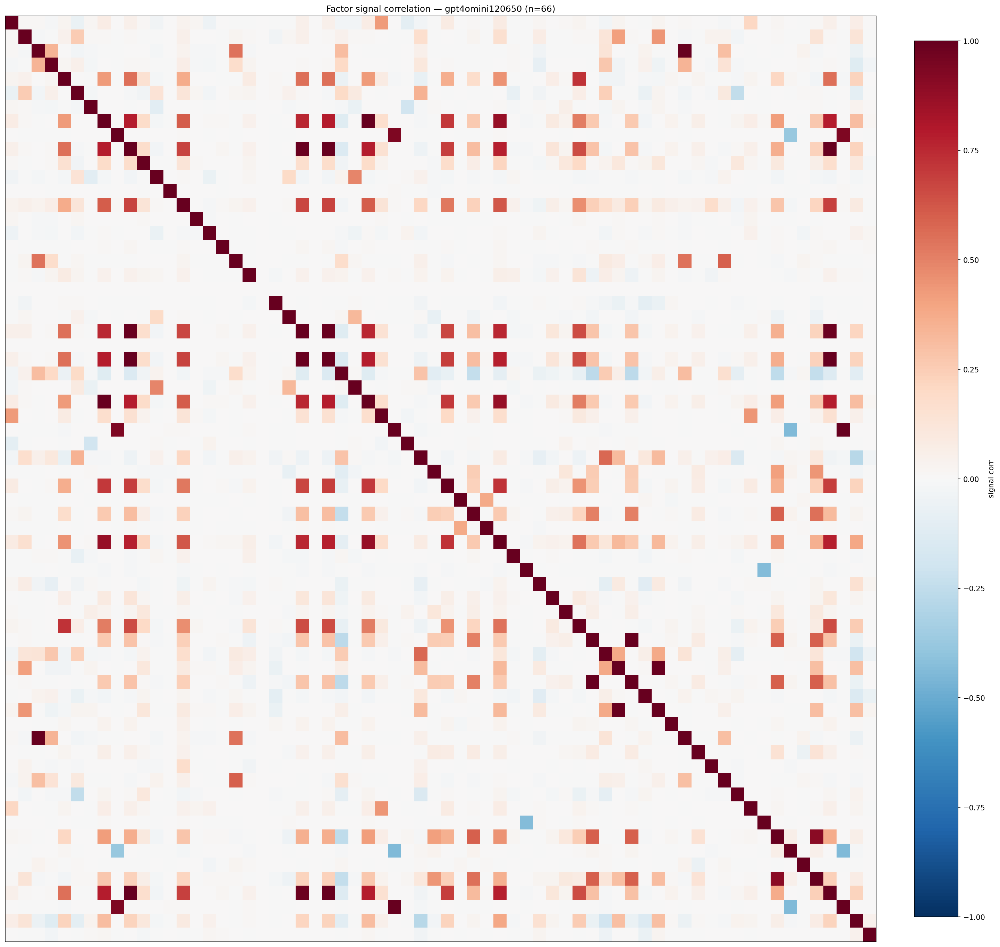

*Signal correlation matrix — gpt4omini120650*

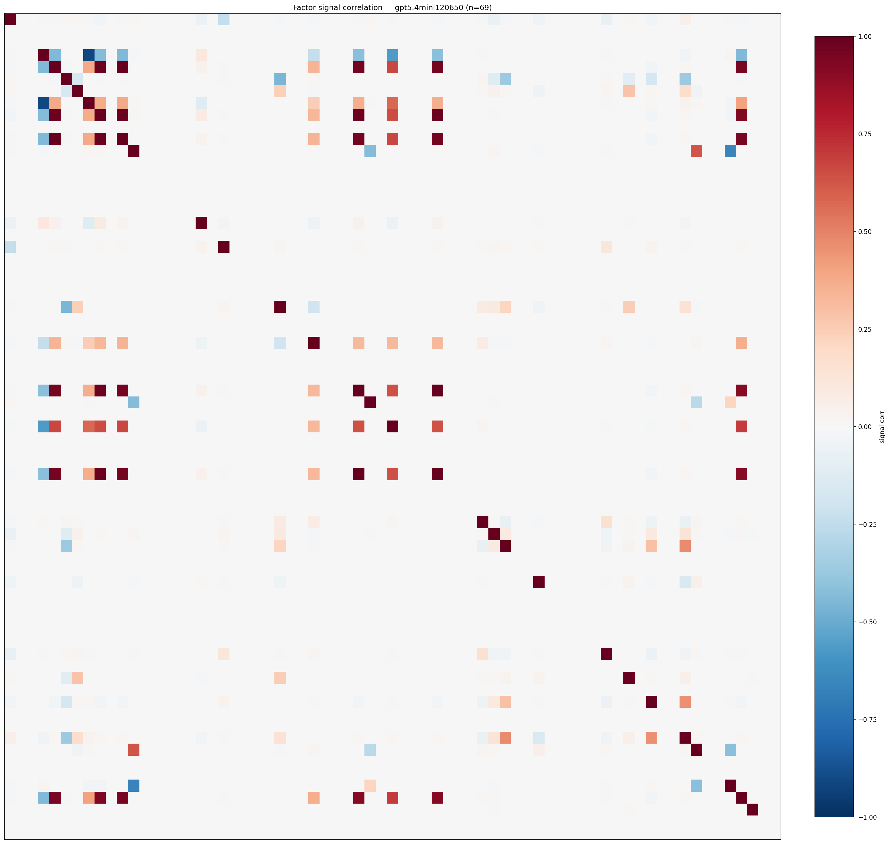

*Signal correlation matrix — gpt5.4mini120650*

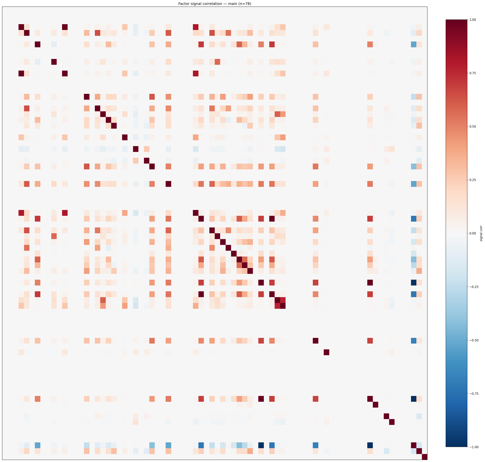

*Signal correlation matrix — main*

## 3. Deflation & model-based importance

`deflated_best_ic` haircuts each zoo's best |IC| for the number of factors tried (`ic_n_tested`) — a bigger zoo's best factor is more likely to be lucky. `lasso_n_nonzero` / `lasso_sparsity` show how many factors a sparse linear model actually keeps (model-view redundancy).

| prerun | best_ic | deflated_best_ic | deflated_best_t | ic_n_tested | ic_n_obs | lasso_n_nonzero | lasso_sparsity |
| --- | --- | --- | --- | --- | --- | --- | --- |
| gpt4omini120650 | 0.0259 | 0.0184 | 7.0566 | 64 | 147417 | 0 | 1.0 |
| gpt5.4mini120650 | 0.0234 | 0.0166 | 6.3751 | 31 | 147417 | 13 | 0.8116 |
| main | 0.0209 | 0.0138 | 5.3081 | 38 | 147417 | 0 | 1.0 |

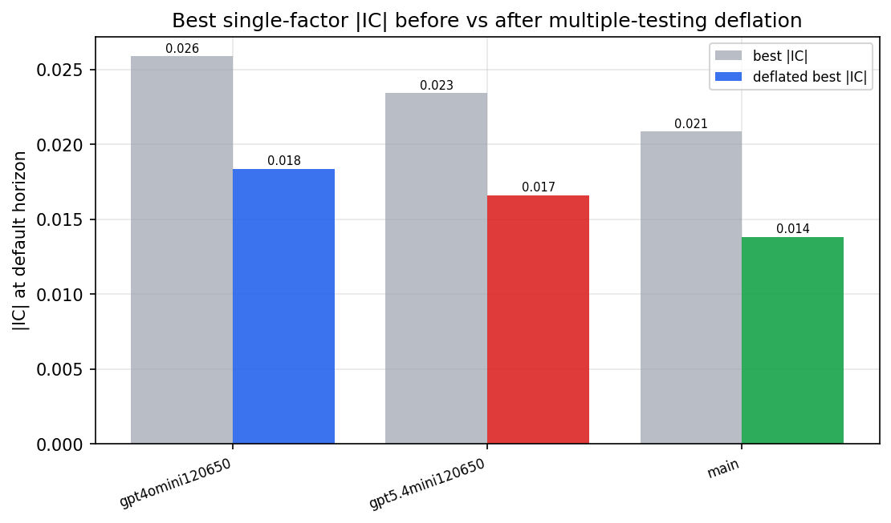

*Best |IC| before vs after multiple-testing deflation*

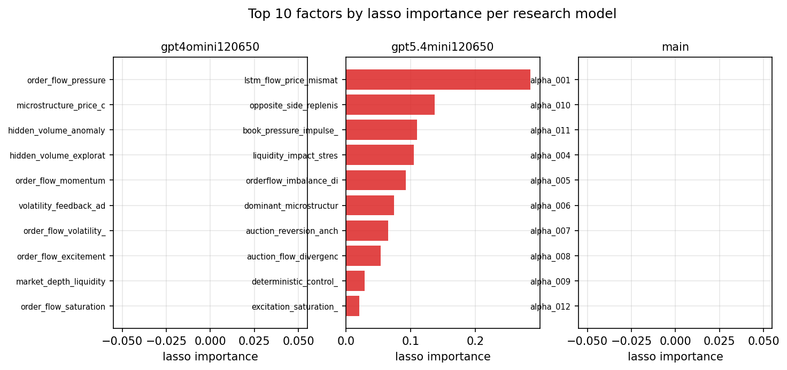

*Top factors by lasso importance per zoo*

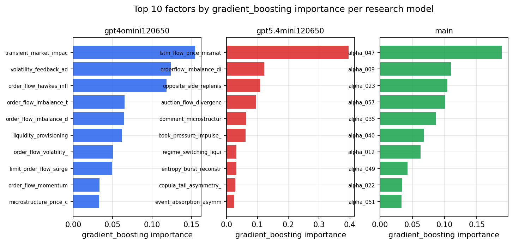

*Top factors by gradient_boosting importance per zoo*

## 4. ML-combined signal — per-underlying vectorised backtest

Each model combines a prerun's factors into ONE signal (fit `factors → forward return` on IS, predict per (bar, underlying)), then that combined signal is run through a simple vectorised backtest — `position(signal) × the underlying's own forward return` — on the held-out OOS tail (+ an equal-weight ensemble). No cross-sectional ranking.

> Config: position=**threshold** (t=1.0, z-score `expanding`), aggregation=**portfolio**, fit-standardise=**per_underlying**, horizon=6.

| prerun | model | n_factors_used | oos_ic | oos_sharpe | is_sharpe | oos_ann_return | oos_max_drawdown |
| --- | --- | --- | --- | --- | --- | --- | --- |
| gpt4omini120650 | linear_regression | 66 | -0.0055 | -5.4468 | 9.4957 | -0.2676 | -0.0243 |
| gpt4omini120650 | ridge | 66 | -0.0049 | -5.6101 | 9.5316 | -0.272 | -0.0247 |
| gpt4omini120650 | lasso | 66 | nan | nan | nan | nan | nan |
| gpt4omini120650 | elastic_net | 66 | nan | nan | nan | nan | nan |
| gpt4omini120650 | random_forest | 66 | -0.006 | -0.1702 | 8.4376 | -0.0104 | -0.014 |
| gpt4omini120650 | gradient_boosting | 66 | -0.0134 | -0.1235 | 9.8676 | -0.0069 | -0.0129 |
| gpt4omini120650 | xgboost | 66 | 0.0038 | 2.3655 | 11.5029 | 0.1311 | -0.0112 |
| gpt4omini120650 | lightgbm | 66 | -0.0017 | 3.2493 | 15.0843 | 0.1776 | -0.0085 |
| gpt4omini120650 | ensemble | 66 | -0.0078 | 0.4533 | 12.3601 | 0.0265 | -0.0138 |
| gpt5.4mini120650 | linear_regression | 69 | -0.0023 | -3.3103 | 5.2874 | -0.1117 | -0.0132 |
| gpt5.4mini120650 | ridge | 69 | -0.0033 | -2.1832 | 4.9544 | -0.0672 | -0.0103 |
| gpt5.4mini120650 | lasso | 69 | -0.0072 | -6.523 | 6.9111 | -0.2948 | -0.0291 |
| gpt5.4mini120650 | elastic_net | 69 | -0.0072 | -7.0499 | 7.3597 | -0.2974 | -0.0282 |
| gpt5.4mini120650 | random_forest | 69 | -0.013 | -1.9855 | 8.8237 | -0.084 | -0.0103 |
| gpt5.4mini120650 | gradient_boosting | 69 | -0.0156 | -2.497 | 9.0477 | -0.0894 | -0.011 |
| gpt5.4mini120650 | xgboost | 69 | -0.0144 | -2.4314 | 9.8398 | -0.0881 | -0.01 |
| gpt5.4mini120650 | lightgbm | 69 | -0.0076 | 2.0042 | 13.7308 | 0.0677 | -0.005 |
| gpt5.4mini120650 | ensemble | 69 | -0.0075 | -3.3674 | 11.1659 | -0.0954 | -0.0134 |
| main | linear_regression | 78 | 0.0043 | -2.6309 | 6.4458 | -0.0034 | -0.0007 |
| main | ridge | 78 | 0.0035 | -4.5284 | 6.0339 | -0.0056 | -0.0007 |
| main | lasso | 78 | nan | nan | nan | nan | nan |
| main | elastic_net | 78 | nan | nan | nan | nan | nan |
| main | random_forest | 78 | -0.0082 | 0.0134 | 14.3743 | 0.0004 | -0.0081 |
| main | gradient_boosting | 78 | -0.0071 | 1.8812 | 13.945 | 0.0277 | -0.0029 |
| main | xgboost | 78 | -0.0074 | -4.4056 | 13.6393 | -0.0718 | -0.0076 |
| main | lightgbm | 78 | -0.0067 | -0.8414 | 19.1236 | -0.0113 | -0.006 |
| main | ensemble | 78 | -0.0065 | -0.6631 | 9.4972 | -0.0032 | -0.0018 |

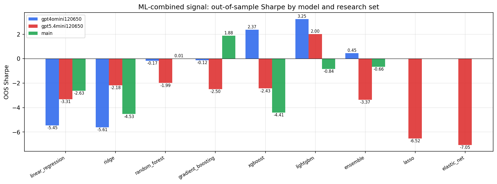

*ML-combined OOS Sharpe by model and research set*

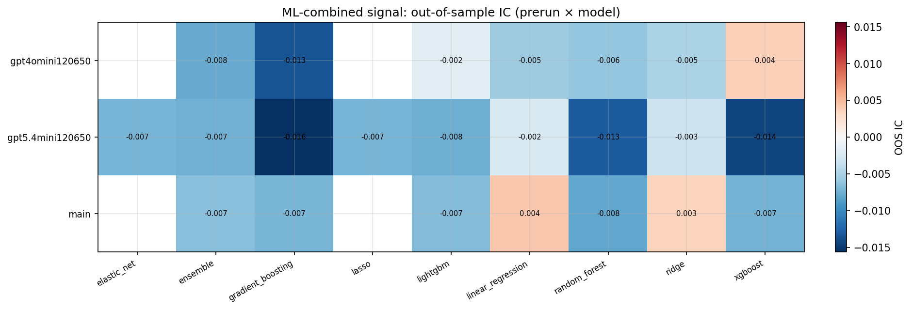

*ML-combined OOS IC (prerun × model)*

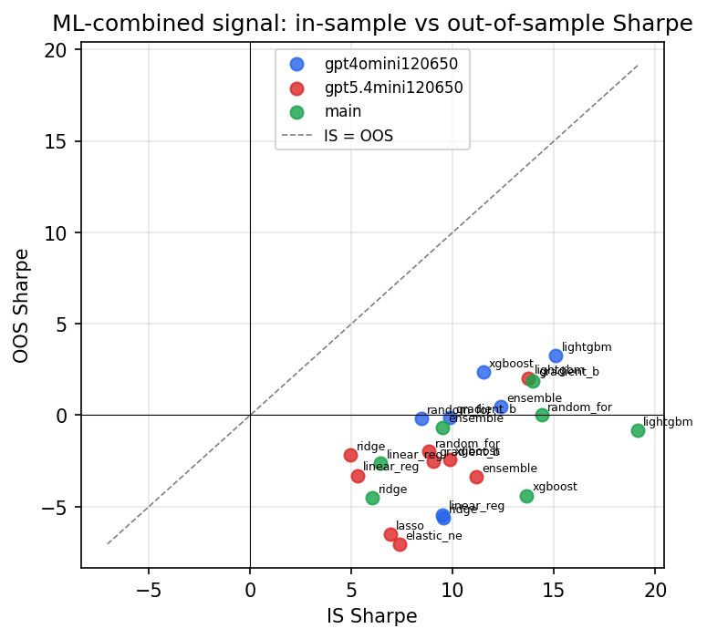

*IS vs OOS Sharpe (overfitting diagnostic)*

---
*Generated by `run_model_comparison.py`. Tables: `*.csv`; interactive: `comparison.ipynb`.*
