# Research-LLM factor comparison — `2024-11`

Comparing the **factor output of different research LLMs** on three axes (raw factor quality → factors as ML features → factors through the full agentic fund). The panel, IS/OOS split, horizon and model hyper-parameters are held identical across preruns — the *only* variable is the factor set.

## Preruns compared

| prerun | research_model | usable_factors | dropped_factors |
| --- | --- | --- | --- |
| gpt4omini120650 | gpt-4o-mini | 66 | 0 |
| gpt5.4mini120650 | gpt-5.4-mini | 69 | 0 |
| main | seed library | 78 | 10 |

> Dropped factors declare fields the current data doesn't have yet (e.g. fundamentals); they light up unchanged once that data is downloaded.

*Usable vs awaiting-data factors per research model*

## Key findings

- **Best ML-combined OOS Sharpe:** `gpt5.4mini120650` with `lightgbm` (OOS Sharpe = 5.046).
- **Mean OOS Sharpe across models, by research set:** `gpt5.4mini120650` = 3.616, `gpt4omini120650` = 2.774, `main` = 2.368.
- **Highest mean single-factor |IC| (h=6):** `main` (mean |IC| = 0.0074).
- **Most diverse zoo (highest effective/raw factor ratio):** `gpt5.4mini120650` (eff 43.3 of 69, ratio 0.63).
- **Best selection-deflated single-factor |IC|:** `main` (deflated |IC| = 0.0116 from 38 factors tried).

## 1. Single-factor IC (raw factor quality)

Per-underlying time-series Spearman rank-IC of every researched factor, recomputed on the shared panel at horizons h=1, h=6, h=60. The per-underlying IC correlates each factor's value vector with the underlying's own forward-return vector (pooled across underlyings); the cross-sectional IC ranks across underlyings per timestamp.

| prerun | n_factors | mean_abs_ic_1 | mean_abs_ic_6 | mean_abs_ic_60 | mean_abs_icir_6 | best_factor_h6 | best_abs_ic_h6 |
| --- | --- | --- | --- | --- | --- | --- | --- |
| gpt4omini120650 | 66 | 0.0061 | 0.0058 | 0.0081 | 0.2791 | hidden_volume_reversal_strength | 0.0133 |
| gpt5.4mini120650 | 69 | 0.0052 | 0.0059 | 0.0088 | 0.3107 | local_impact_decay_asymmetry | 0.0128 |
| main | 78 | 0.0109 | 0.0074 | 0.0054 | 0.4106 | alpha_066 | 0.0187 |

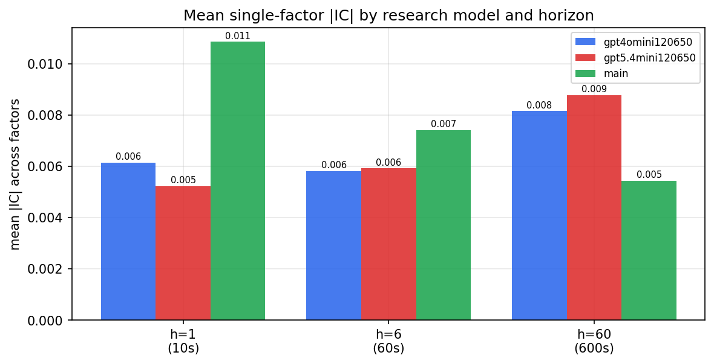

*Mean |IC| by research model and horizon*

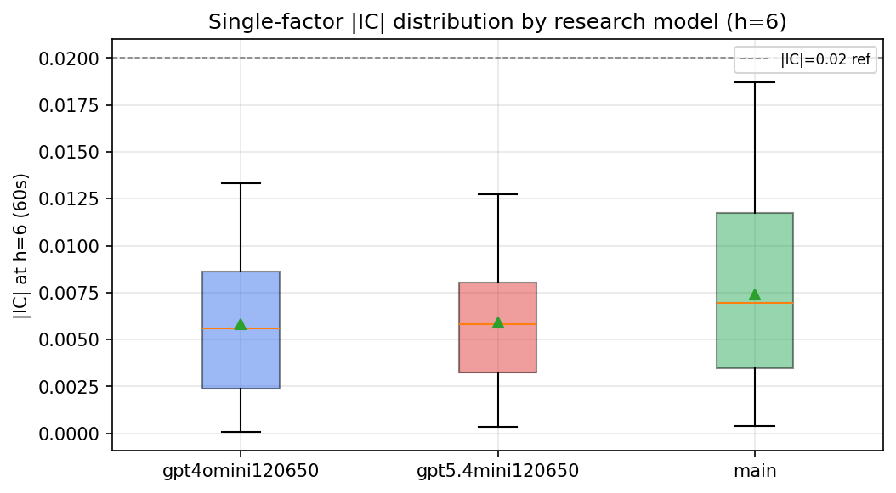

*Per-factor |IC| distribution by research model*

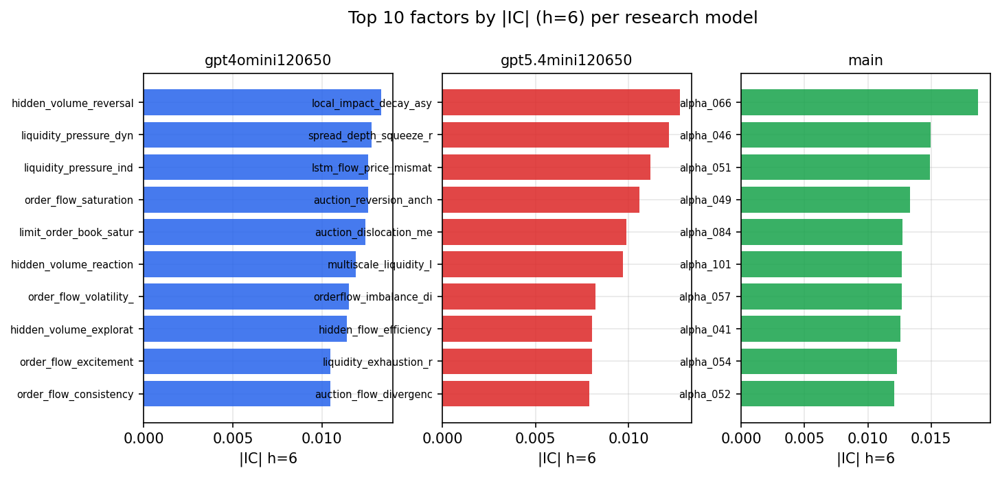

*Top factors by |IC| per research model*

## 2. Factor diversity & redundancy

Pairwise correlation of each zoo's *signals*. `eff_n_factors` is the effective number of independent factors (participation ratio of the correlation eigenvalues); `eff_ratio` and `redundancy` summarise how much unique information the zoo holds vs. how much is duplicated; `n_clusters` groups factors at |corr| ≥ 0.7.

| prerun | n_factors | eff_n_factors | eff_ratio | mean_abs_corr | n_clusters | redundancy |
| --- | --- | --- | --- | --- | --- | --- |
| gpt4omini120650 | 66 | 26.2398 | 0.3976 | 0.0539 | 52 | 0.6024 |
| gpt5.4mini120650 | 69 | 43.3441 | 0.6282 | 0.0169 | 62 | 0.3718 |
| main | 78 | 42.6969 | 0.5474 | 0.0283 | 70 | 0.4526 |

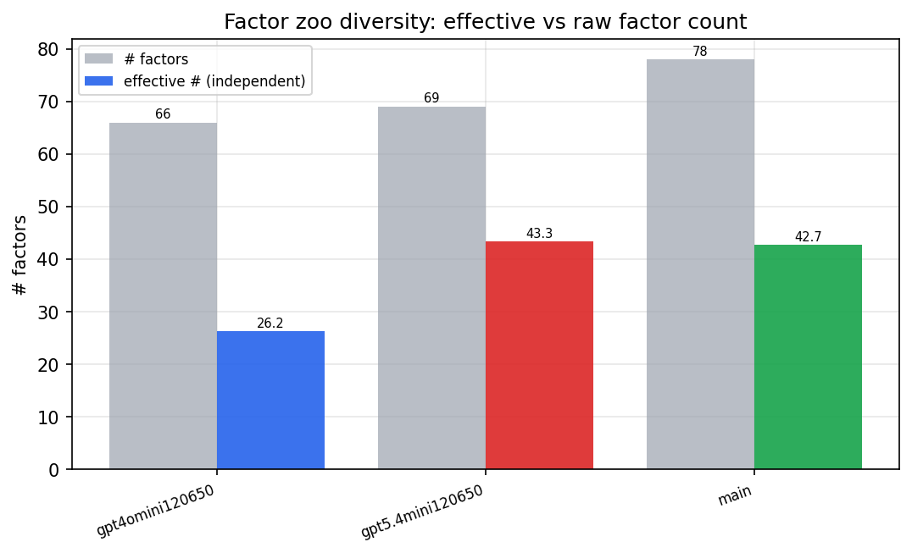

*Effective vs raw factor count per research model*

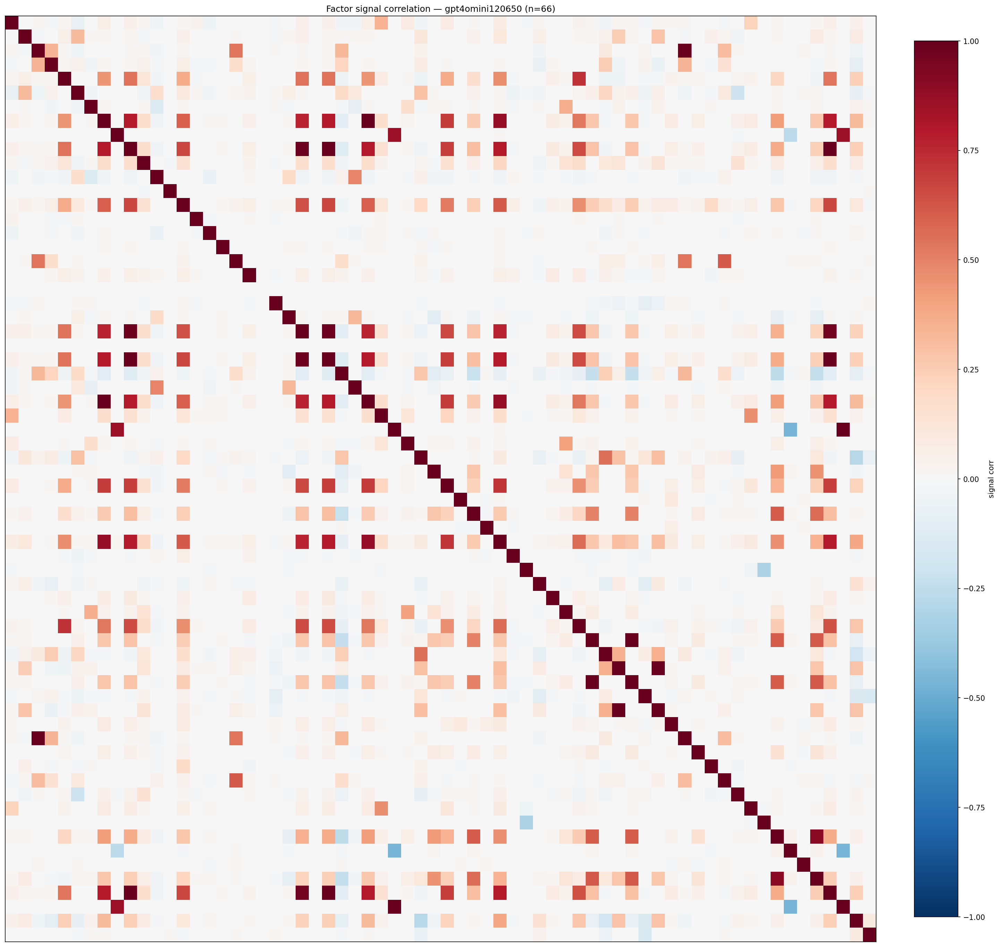

*Signal correlation matrix — gpt4omini120650*

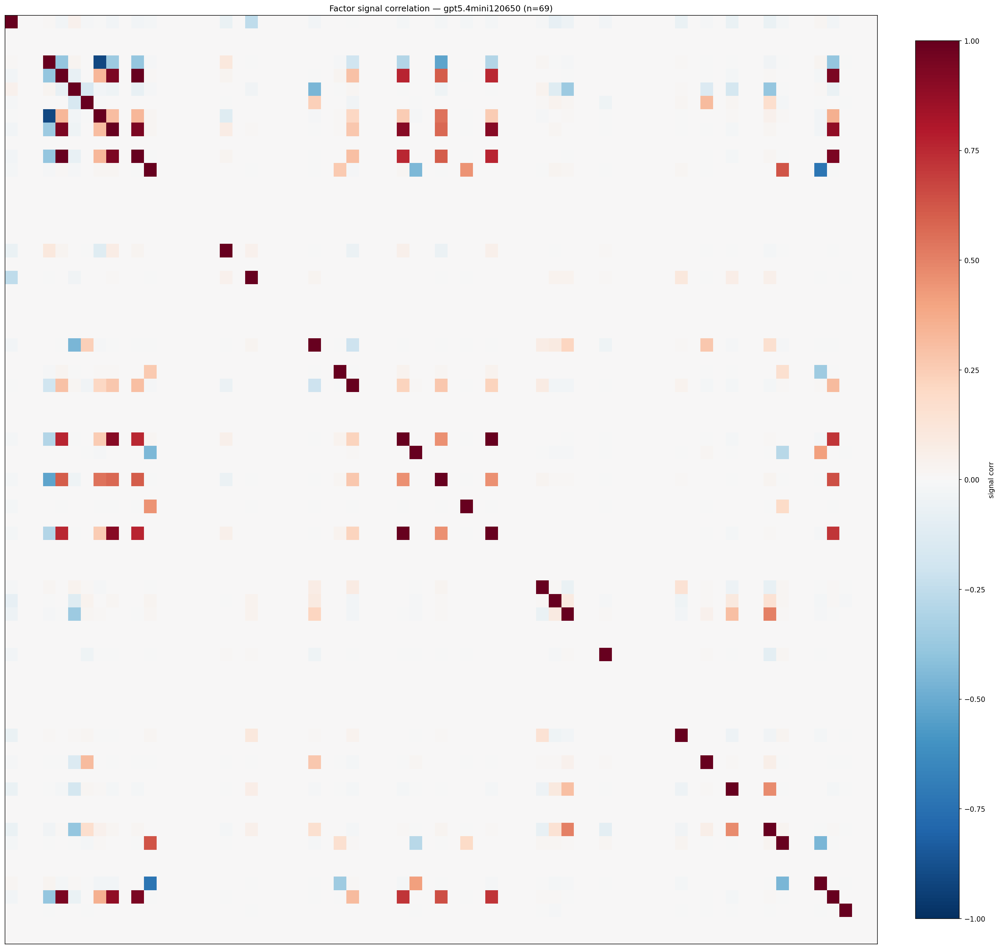

*Signal correlation matrix — gpt5.4mini120650*

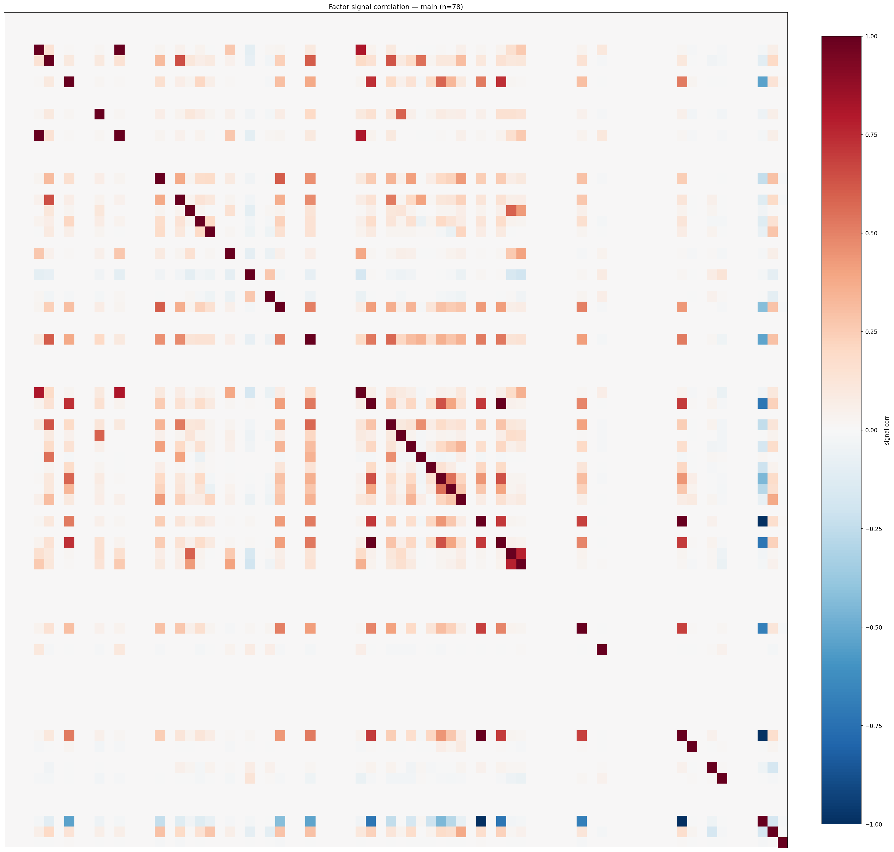

*Signal correlation matrix — main*

## 3. Deflation & model-based importance

`deflated_best_ic` haircuts each zoo's best |IC| for the number of factors tried (`ic_n_tested`) — a bigger zoo's best factor is more likely to be lucky. `lasso_n_nonzero` / `lasso_sparsity` show how many factors a sparse linear model actually keeps (model-view redundancy).

| prerun | best_ic | deflated_best_ic | deflated_best_t | ic_n_tested | ic_n_obs | lasso_n_nonzero | lasso_sparsity |
| --- | --- | --- | --- | --- | --- | --- | --- |
| gpt4omini120650 | 0.0133 | 0.0057 | 2.1668 | 64 | 143998 | 2 | 0.9697 |
| gpt5.4mini120650 | 0.0128 | 0.0058 | 2.2179 | 31 | 143998 | 0 | 1.0 |
| main | 0.0187 | 0.0116 | 4.4063 | 38 | 143998 | 0 | 1.0 |

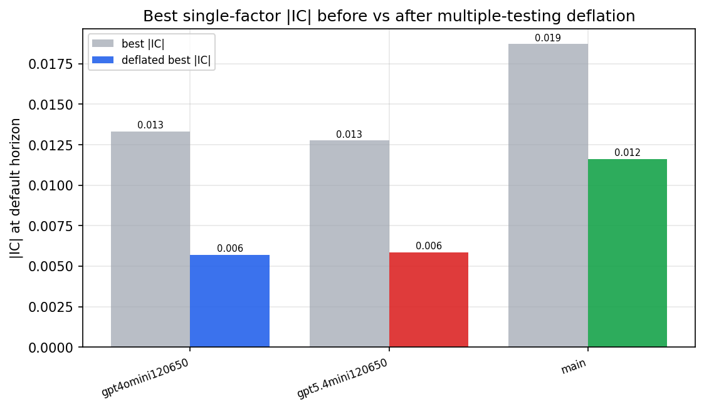

*Best |IC| before vs after multiple-testing deflation*

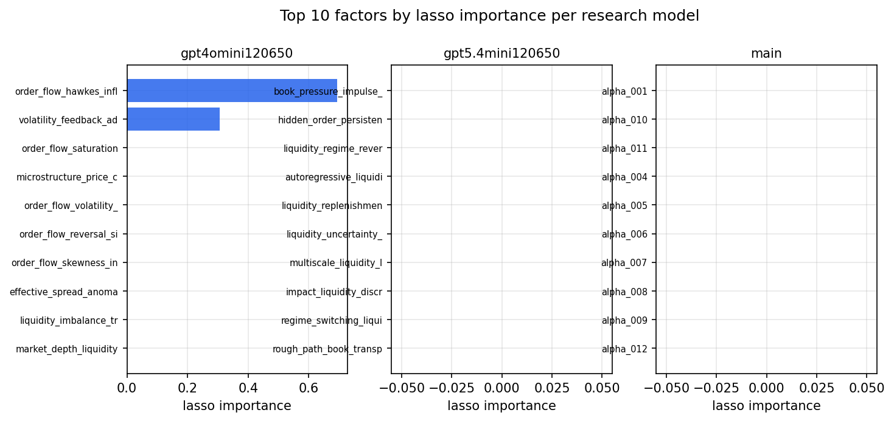

*Top factors by lasso importance per zoo*

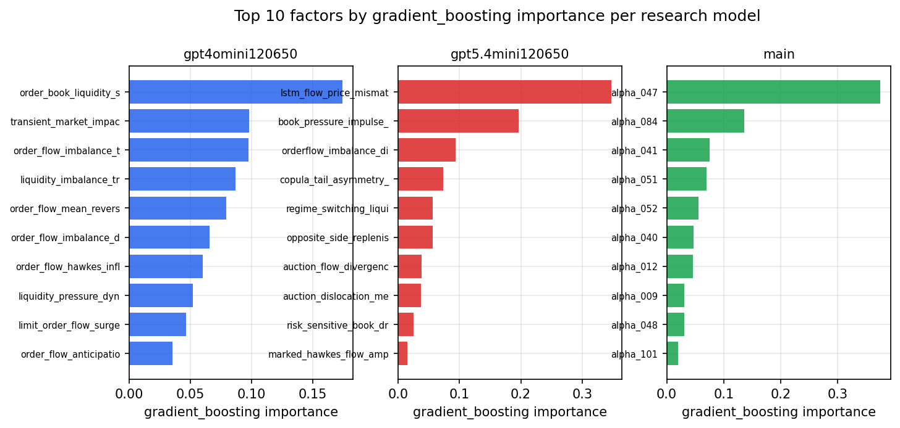

*Top factors by gradient_boosting importance per zoo*

## 4. ML-combined signal — per-underlying vectorised backtest

Each model combines a prerun's factors into ONE signal (fit `factors → forward return` on IS, predict per (bar, underlying)), then that combined signal is run through a simple vectorised backtest — `position(signal) × the underlying's own forward return` — on the held-out OOS tail (+ an equal-weight ensemble). No cross-sectional ranking.

> Config: position=**threshold** (t=1.0, z-score `expanding`), aggregation=**portfolio**, fit-standardise=**per_underlying**, horizon=6.

| prerun | model | n_factors_used | oos_ic | oos_sharpe | is_sharpe | oos_ann_return | oos_max_drawdown |
| --- | --- | --- | --- | --- | --- | --- | --- |
| gpt4omini120650 | linear_regression | 66 | 0.0086 | 4.424 | 5.5433 | 0.3689 | -0.0069 |
| gpt4omini120650 | ridge | 66 | 0.0029 | 4.0975 | 5.5562 | 0.3377 | -0.0068 |
| gpt4omini120650 | lasso | 66 | 0.0044 | 2.9671 | 6.1401 | 0.2553 | -0.0109 |
| gpt4omini120650 | elastic_net | 66 | 0.003 | 2.8448 | 5.9053 | 0.2447 | -0.0105 |
| gpt4omini120650 | random_forest | 66 | 0.0049 | 0.9564 | 9.8823 | 0.0779 | -0.0185 |
| gpt4omini120650 | gradient_boosting | 66 | -0.0008 | 1.7726 | 10.0555 | 0.1001 | -0.0082 |
| gpt4omini120650 | xgboost | 66 | 0.0004 | 2.5031 | 12.6774 | 0.1957 | -0.0089 |
| gpt4omini120650 | lightgbm | 66 | -0.0018 | 2.977 | 19.2372 | 0.2332 | -0.0103 |
| gpt4omini120650 | ensemble | 66 | 0.0016 | 2.4222 | 12.7421 | 0.1975 | -0.011 |
| gpt5.4mini120650 | linear_regression | 69 | 0.0027 | 0.1982 | 6.3253 | 0.0052 | -0.0094 |
| gpt5.4mini120650 | ridge | 69 | 0.0024 | 2.1205 | 5.1325 | 0.0657 | -0.0076 |
| gpt5.4mini120650 | lasso | 69 | nan | nan | nan | nan | nan |
| gpt5.4mini120650 | elastic_net | 69 | nan | nan | nan | nan | nan |
| gpt5.4mini120650 | random_forest | 69 | 0.0 | 4.5313 | 7.4569 | 0.3561 | -0.0038 |
| gpt5.4mini120650 | gradient_boosting | 69 | 0.0137 | 3.7701 | 9.1861 | 0.1989 | -0.0032 |
| gpt5.4mini120650 | xgboost | 69 | -0.0113 | 4.7291 | 12.2022 | 0.371 | -0.005 |
| gpt5.4mini120650 | lightgbm | 69 | -0.0099 | 5.0461 | 15.7123 | 0.3919 | -0.0029 |
| gpt5.4mini120650 | ensemble | 69 | 0.0036 | 4.9162 | 11.5579 | 0.3849 | -0.0042 |
| main | linear_regression | 78 | 0.0023 | -0.9563 | 7.4514 | -0.0166 | -0.0055 |
| main | ridge | 78 | 0.0037 | -0.4592 | 7.2732 | -0.0078 | -0.005 |
| main | lasso | 78 | nan | nan | nan | nan | nan |
| main | elastic_net | 78 | nan | nan | nan | nan | nan |
| main | random_forest | 78 | 0.012 | 2.9473 | 8.8966 | 0.1365 | -0.0055 |
| main | gradient_boosting | 78 | 0.0153 | 3.1019 | 9.9812 | 0.1055 | -0.0042 |
| main | xgboost | 78 | 0.0127 | 3.7609 | 17.066 | 0.0952 | -0.0075 |
| main | lightgbm | 78 | 0.0057 | 4.571 | 22.5219 | 0.1482 | -0.0057 |
| main | ensemble | 78 | 0.0078 | 3.6131 | 14.7638 | 0.1621 | -0.0044 |

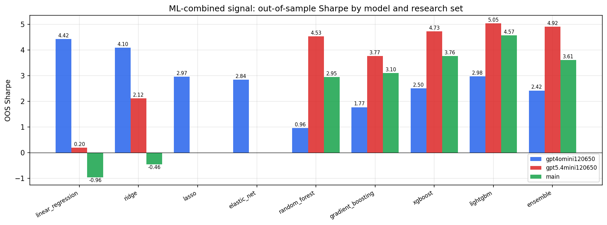

*ML-combined OOS Sharpe by model and research set*

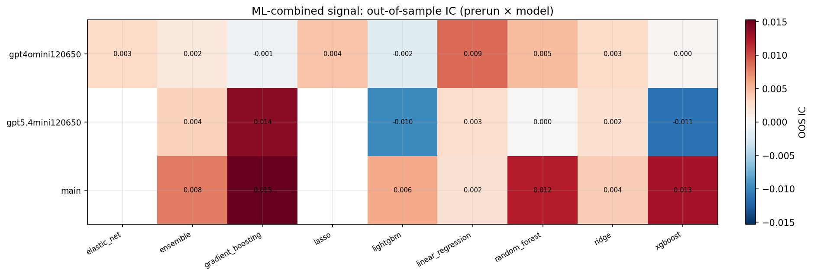

*ML-combined OOS IC (prerun × model)*

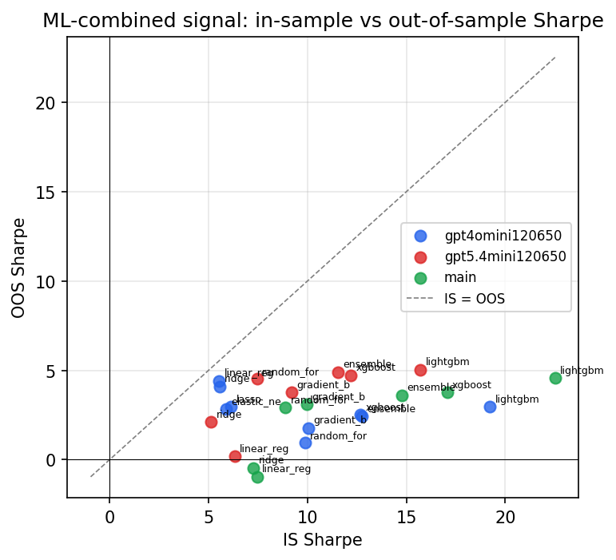

*IS vs OOS Sharpe (overfitting diagnostic)*

---
*Generated by `run_model_comparison.py`. Tables: `*.csv`; interactive: `comparison.ipynb`.*
