# Research-LLM factor comparison — `2024-12`

Comparing the **factor output of different research LLMs** on three axes (raw factor quality → factors as ML features → factors through the full agentic fund). The panel, IS/OOS split, horizon and model hyper-parameters are held identical across preruns — the *only* variable is the factor set.

## Preruns compared

| prerun | research_model | usable_factors | dropped_factors |
| --- | --- | --- | --- |
| gpt4omini120650 | gpt-4o-mini | 66 | 0 |
| gpt5.4mini120650 | gpt-5.4-mini | 69 | 0 |
| main | seed library | 78 | 10 |

> Dropped factors declare fields the current data doesn't have yet (e.g. fundamentals); they light up unchanged once that data is downloaded.

*Usable vs awaiting-data factors per research model*

## Key findings

- **Best ML-combined OOS Sharpe:** `main` with `ensemble` (OOS Sharpe = 5.381).
- **Mean OOS Sharpe across models, by research set:** `main` = 2.472, `gpt5.4mini120650` = 0.275, `gpt4omini120650` = -2.504.
- **Highest mean single-factor |IC| (h=6):** `gpt5.4mini120650` (mean |IC| = 0.0057).
- **Most diverse zoo (highest effective/raw factor ratio):** `gpt5.4mini120650` (eff 48.6 of 69, ratio 0.70).
- **Best selection-deflated single-factor |IC|:** `gpt5.4mini120650` (deflated |IC| = 0.0177 from 31 factors tried).

## 1. Single-factor IC (raw factor quality)

Per-underlying time-series Spearman rank-IC of every researched factor, recomputed on the shared panel at horizons h=1, h=6, h=60. The per-underlying IC correlates each factor's value vector with the underlying's own forward-return vector (pooled across underlyings); the cross-sectional IC ranks across underlyings per timestamp.

| prerun | n_factors | mean_abs_ic_1 | mean_abs_ic_6 | mean_abs_ic_60 | mean_abs_icir_6 | best_factor_h6 | best_abs_ic_h6 |
| --- | --- | --- | --- | --- | --- | --- | --- |
| gpt4omini120650 | 66 | 0.0036 | 0.0033 | 0.0059 | 0.1757 | order_flow_stability_score | 0.0164 |
| gpt5.4mini120650 | 69 | 0.0037 | 0.0057 | 0.0079 | 0.291 | multiscale_liquidity_leadlag_reversal | 0.0246 |
| main | 78 | 0.0057 | 0.0034 | 0.0049 | 0.2091 | alpha_066 | 0.0098 |

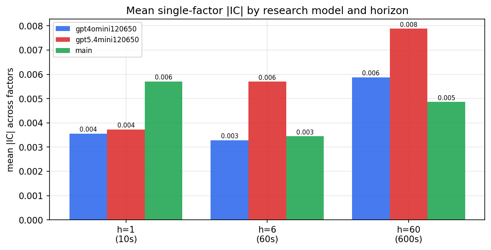

*Mean |IC| by research model and horizon*

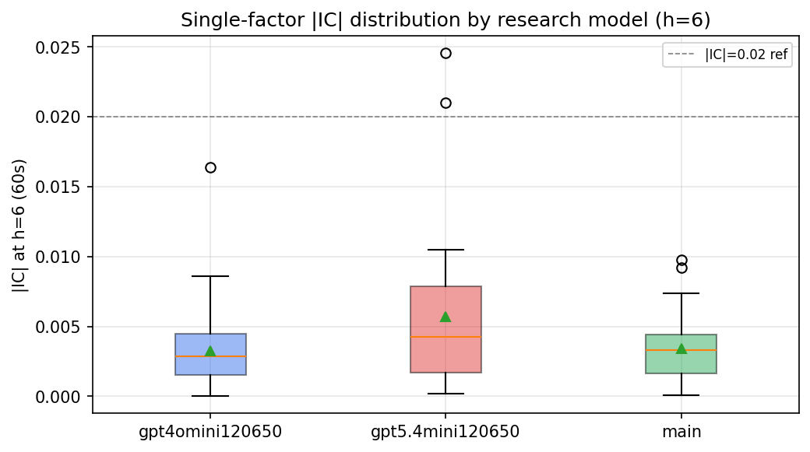

*Per-factor |IC| distribution by research model*

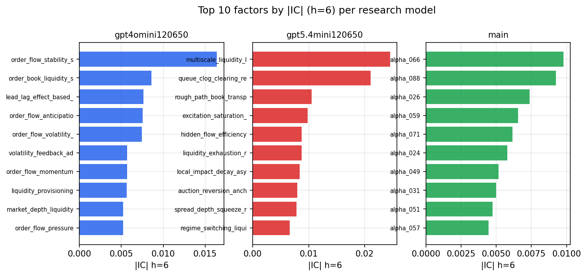

*Top factors by |IC| per research model*

## 2. Factor diversity & redundancy

Pairwise correlation of each zoo's *signals*. `eff_n_factors` is the effective number of independent factors (participation ratio of the correlation eigenvalues); `eff_ratio` and `redundancy` summarise how much unique information the zoo holds vs. how much is duplicated; `n_clusters` groups factors at |corr| ≥ 0.7.

| prerun | n_factors | eff_n_factors | eff_ratio | mean_abs_corr | n_clusters | redundancy |
| --- | --- | --- | --- | --- | --- | --- |
| gpt4omini120650 | 66 | 26.6652 | 0.404 | 0.0521 | 52 | 0.596 |
| gpt5.4mini120650 | 69 | 48.5768 | 0.704 | 0.0138 | 62 | 0.296 |
| main | 78 | 43.2173 | 0.5541 | 0.0276 | 71 | 0.4459 |

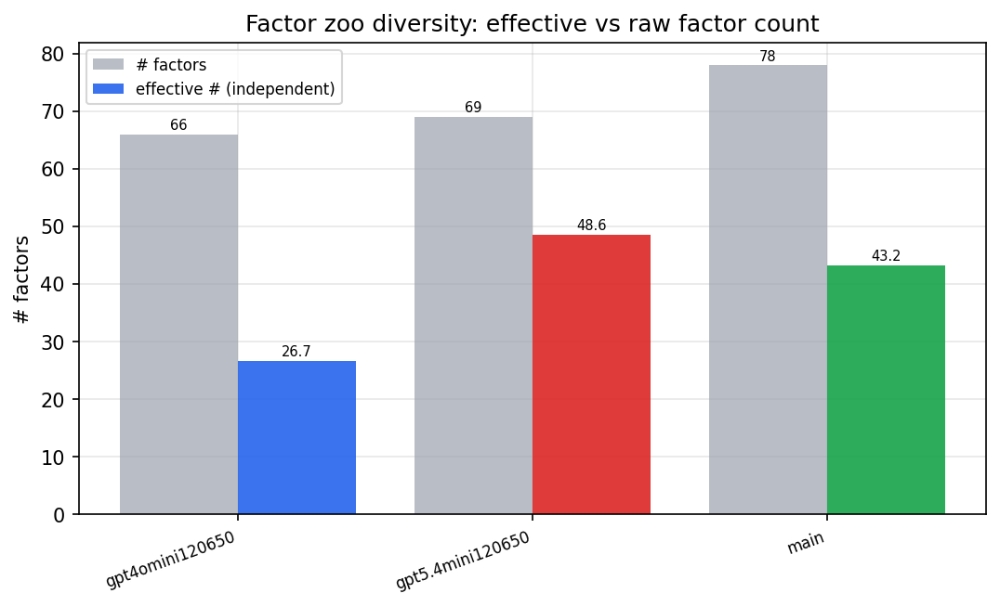

*Effective vs raw factor count per research model*

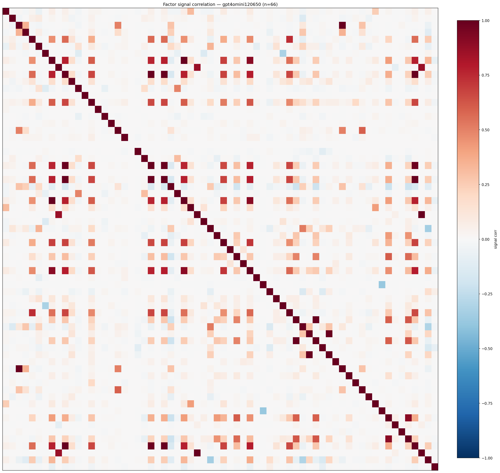

*Signal correlation matrix — gpt4omini120650*

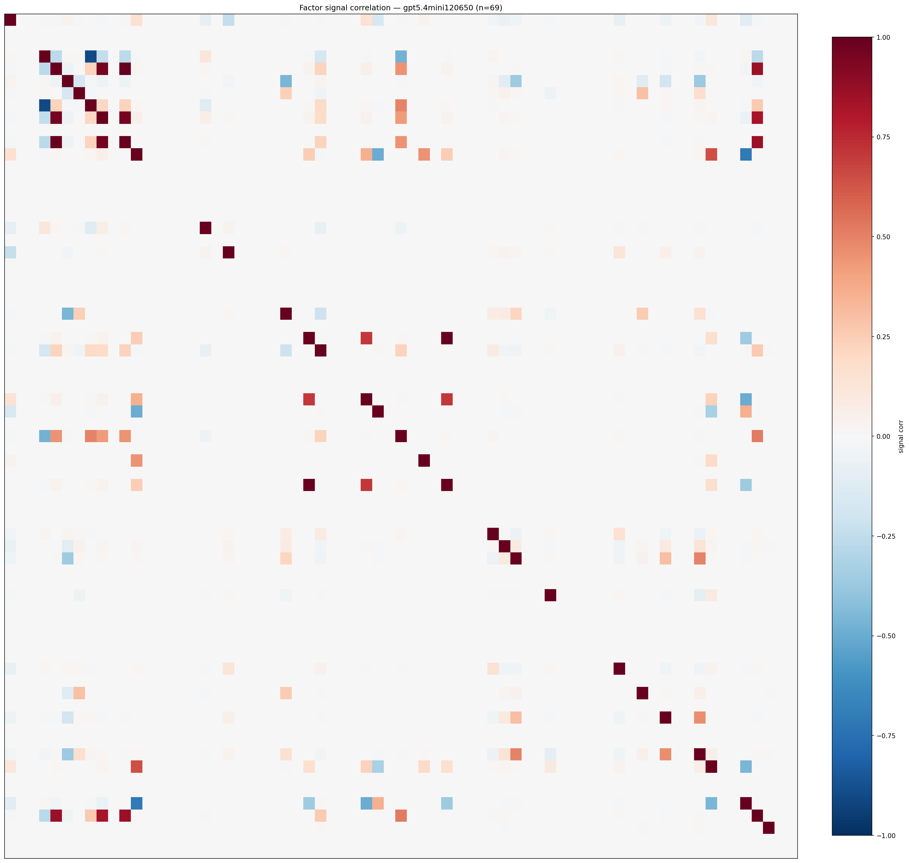

*Signal correlation matrix — gpt5.4mini120650*

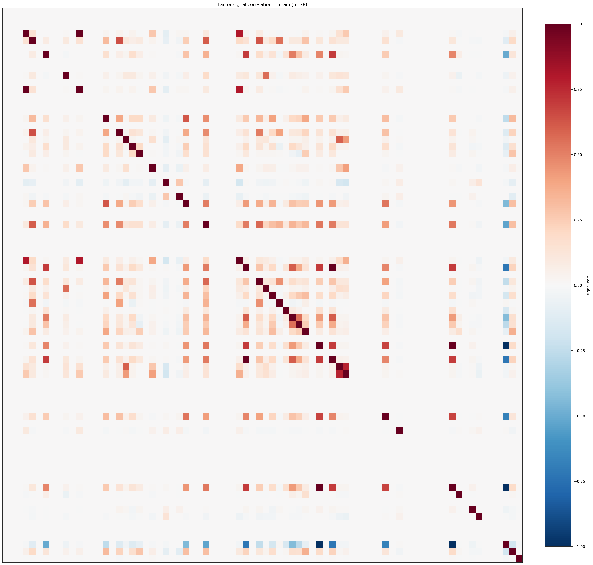

*Signal correlation matrix — main*

## 3. Deflation & model-based importance

`deflated_best_ic` haircuts each zoo's best |IC| for the number of factors tried (`ic_n_tested`) — a bigger zoo's best factor is more likely to be lucky. `lasso_n_nonzero` / `lasso_sparsity` show how many factors a sparse linear model actually keeps (model-view redundancy).

| prerun | best_ic | deflated_best_ic | deflated_best_t | ic_n_tested | ic_n_obs | lasso_n_nonzero | lasso_sparsity |
| --- | --- | --- | --- | --- | --- | --- | --- |
| gpt4omini120650 | 0.0164 | 0.0089 | 3.4144 | 64 | 147599 | 0 | 1.0 |
| gpt5.4mini120650 | 0.0246 | 0.0177 | 6.8119 | 31 | 147599 | 0 | 1.0 |
| main | 0.0098 | 0.0028 | 1.0617 | 38 | 147599 | 0 | 1.0 |

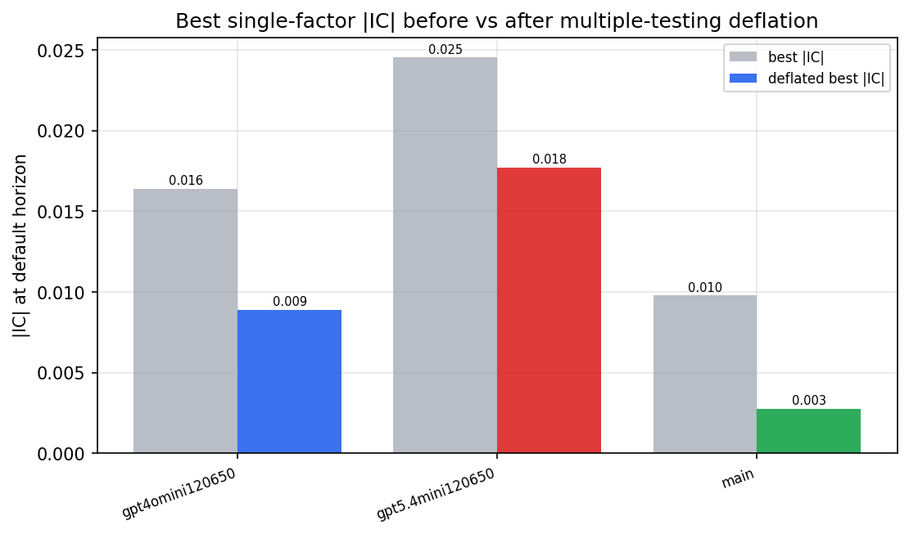

*Best |IC| before vs after multiple-testing deflation*

*Top factors by lasso importance per zoo*

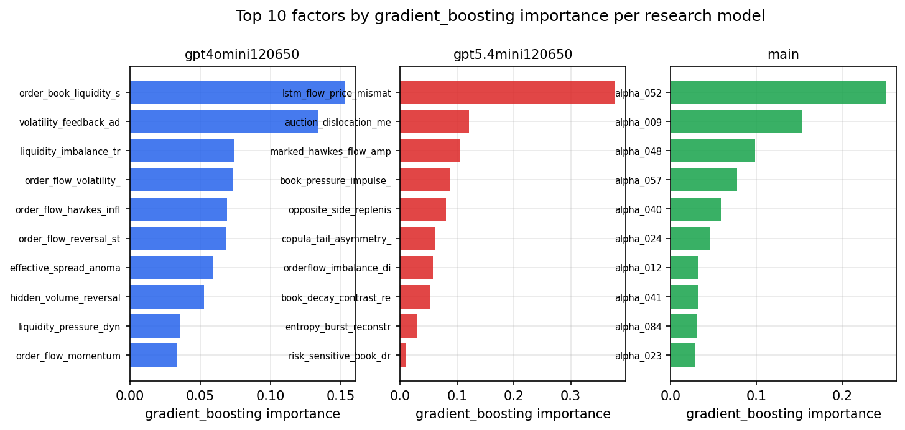

*Top factors by gradient_boosting importance per zoo*

## 4. ML-combined signal — per-underlying vectorised backtest

Each model combines a prerun's factors into ONE signal (fit `factors → forward return` on IS, predict per (bar, underlying)), then that combined signal is run through a simple vectorised backtest — `position(signal) × the underlying's own forward return` — on the held-out OOS tail (+ an equal-weight ensemble). No cross-sectional ranking.

> Config: position=**threshold** (t=1.0, z-score `expanding`), aggregation=**portfolio**, fit-standardise=**per_underlying**, horizon=6.

| prerun | model | n_factors_used | oos_ic | oos_sharpe | is_sharpe | oos_ann_return | oos_max_drawdown |
| --- | --- | --- | --- | --- | --- | --- | --- |
| gpt4omini120650 | linear_regression | 66 | -0.0188 | -3.4853 | 5.2592 | -0.2378 | -0.0315 |
| gpt4omini120650 | ridge | 66 | -0.0186 | -3.1036 | 5.4577 | -0.2138 | -0.0304 |
| gpt4omini120650 | lasso | 66 | -0.0128 | -3.0013 | 4.0206 | -0.1907 | -0.0275 |
| gpt4omini120650 | elastic_net | 66 | -0.0151 | -3.2038 | 4.3385 | -0.215 | -0.0289 |
| gpt4omini120650 | random_forest | 66 | -0.0292 | -3.5233 | 7.0307 | -0.2233 | -0.0311 |
| gpt4omini120650 | gradient_boosting | 66 | -0.0022 | -1.2075 | 7.8052 | -0.0417 | -0.0102 |
| gpt4omini120650 | xgboost | 66 | -0.023 | -0.8297 | 9.4886 | -0.0359 | -0.0159 |
| gpt4omini120650 | lightgbm | 66 | -0.0129 | -1.1808 | 14.9953 | -0.0532 | -0.0213 |
| gpt4omini120650 | ensemble | 66 | -0.0213 | -3.0045 | 8.3409 | -0.1844 | -0.0283 |
| gpt5.4mini120650 | linear_regression | 69 | -0.0017 | 1.0737 | 2.6204 | 0.0669 | -0.0235 |
| gpt5.4mini120650 | ridge | 69 | -0.0016 | 1.3877 | 2.6752 | 0.0859 | -0.023 |
| gpt5.4mini120650 | lasso | 69 | nan | nan | nan | nan | nan |
| gpt5.4mini120650 | elastic_net | 69 | nan | nan | nan | nan | nan |
| gpt5.4mini120650 | random_forest | 69 | 0.0063 | -3.0791 | 4.6876 | -0.1941 | -0.029 |
| gpt5.4mini120650 | gradient_boosting | 69 | -0.0036 | 1.5142 | 6.41 | 0.0377 | -0.0054 |
| gpt5.4mini120650 | xgboost | 69 | 0.0049 | -0.0382 | 7.1429 | -0.0015 | -0.0107 |
| gpt5.4mini120650 | lightgbm | 69 | 0.0046 | 2.1302 | 11.8532 | 0.0777 | -0.0099 |
| gpt5.4mini120650 | ensemble | 69 | -0.0064 | -1.0616 | 5.4302 | -0.0188 | -0.0054 |
| main | linear_regression | 78 | 0.0052 | 0.8781 | 3.8689 | 0.0342 | -0.012 |
| main | ridge | 78 | 0.0057 | 0.7869 | 4.0105 | 0.0354 | -0.0143 |
| main | lasso | 78 | nan | nan | nan | nan | nan |
| main | elastic_net | 78 | nan | nan | nan | nan | nan |
| main | random_forest | 78 | -0.0012 | 2.9719 | 9.2154 | 0.0995 | -0.0107 |
| main | gradient_boosting | 78 | 0.0057 | 4.8076 | 6.7752 | 0.1359 | -0.0047 |
| main | xgboost | 78 | 0.0002 | 1.3747 | 9.3145 | 0.0237 | -0.0065 |
| main | lightgbm | 78 | -0.0023 | 1.1029 | 13.5509 | 0.0213 | -0.0058 |
| main | ensemble | 78 | 0.0029 | 5.3811 | 4.6538 | 0.0557 | -0.0008 |

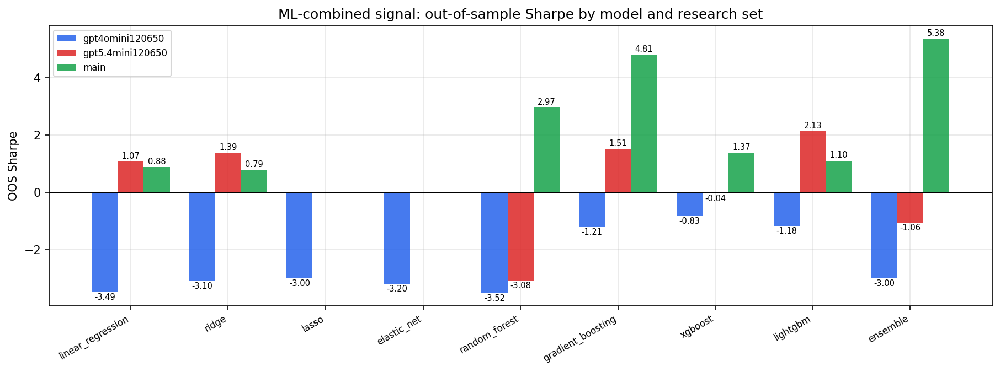

*ML-combined OOS Sharpe by model and research set*

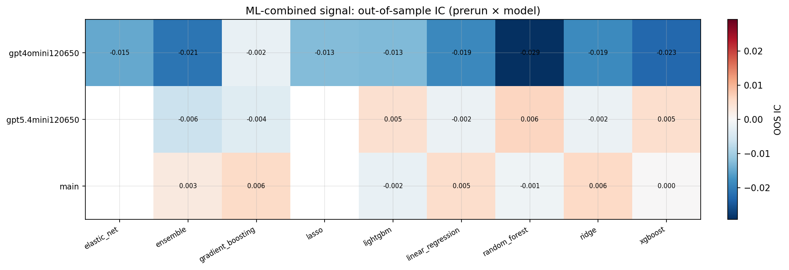

*ML-combined OOS IC (prerun × model)*

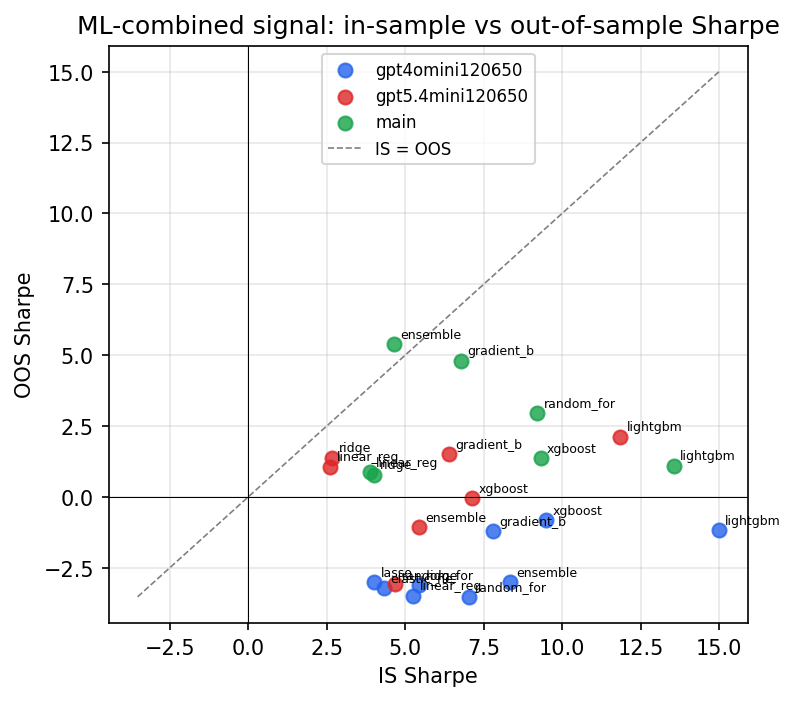

*IS vs OOS Sharpe (overfitting diagnostic)*

---
*Generated by `run_model_comparison.py`. Tables: `*.csv`; interactive: `comparison.ipynb`.*
