# Research-LLM factor comparison — `2025-01`

Comparing the **factor output of different research LLMs** on three axes (raw factor quality → factors as ML features → factors through the full agentic fund). The panel, IS/OOS split, horizon and model hyper-parameters are held identical across preruns — the *only* variable is the factor set.

## Preruns compared

| prerun | research_model | usable_factors | dropped_factors |
| --- | --- | --- | --- |
| gpt4omini120650 | gpt-4o-mini | 66 | 0 |
| gpt5.4mini120650 | gpt-5.4-mini | 69 | 0 |
| main | seed library | 78 | 10 |

> Dropped factors declare fields the current data doesn't have yet (e.g. fundamentals); they light up unchanged once that data is downloaded.

*Usable vs awaiting-data factors per research model*

## Key findings

- **Best ML-combined OOS Sharpe:** `gpt4omini120650` with `ridge` (OOS Sharpe = 4.434).
- **Mean OOS Sharpe across models, by research set:** `gpt4omini120650` = 2.188, `gpt5.4mini120650` = 2.150, `main` = -1.470.
- **Highest mean single-factor |IC| (h=6):** `gpt5.4mini120650` (mean |IC| = 0.0052).
- **Most diverse zoo (highest effective/raw factor ratio):** `gpt5.4mini120650` (eff 47.8 of 69, ratio 0.69).
- **Best selection-deflated single-factor |IC|:** `gpt4omini120650` (deflated |IC| = 0.0108 from 64 factors tried).

## 1. Single-factor IC (raw factor quality)

Per-underlying time-series Spearman rank-IC of every researched factor, recomputed on the shared panel at horizons h=1, h=6, h=60. The per-underlying IC correlates each factor's value vector with the underlying's own forward-return vector (pooled across underlyings); the cross-sectional IC ranks across underlyings per timestamp.

| prerun | n_factors | mean_abs_ic_1 | mean_abs_ic_6 | mean_abs_ic_60 | mean_abs_icir_6 | best_factor_h6 | best_abs_ic_h6 |
| --- | --- | --- | --- | --- | --- | --- | --- |
| gpt4omini120650 | 66 | 0.004 | 0.0035 | 0.0073 | 0.1925 | order_flow_stability_score | 0.0185 |
| gpt5.4mini120650 | 69 | 0.0035 | 0.0052 | 0.0092 | 0.2024 | spread_depth_squeeze_reversion | 0.0154 |
| main | 78 | 0.0045 | 0.0032 | 0.0042 | 0.2471 | alpha_071 | 0.0111 |

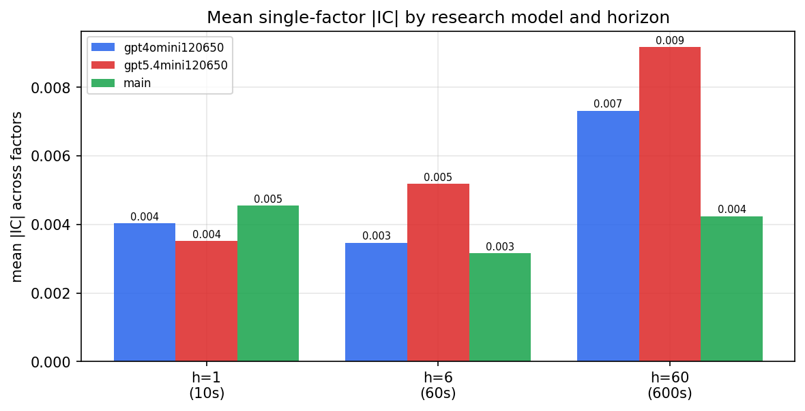

*Mean |IC| by research model and horizon*

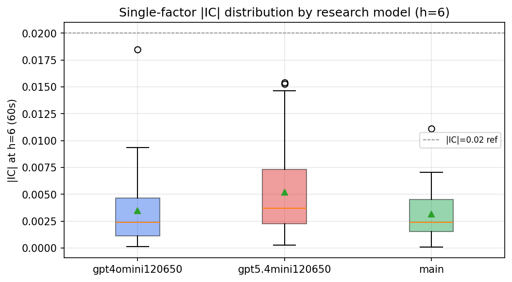

*Per-factor |IC| distribution by research model*

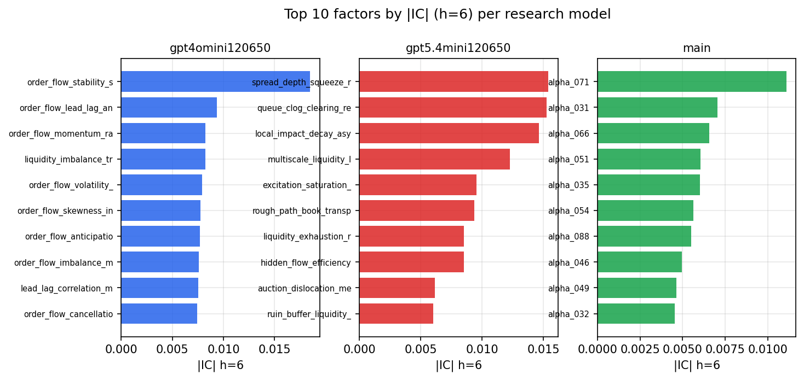

*Top factors by |IC| per research model*

## 2. Factor diversity & redundancy

Pairwise correlation of each zoo's *signals*. `eff_n_factors` is the effective number of independent factors (participation ratio of the correlation eigenvalues); `eff_ratio` and `redundancy` summarise how much unique information the zoo holds vs. how much is duplicated; `n_clusters` groups factors at |corr| ≥ 0.7.

| prerun | n_factors | eff_n_factors | eff_ratio | mean_abs_corr | n_clusters | redundancy |
| --- | --- | --- | --- | --- | --- | --- |
| gpt4omini120650 | 66 | 26.6165 | 0.4033 | 0.052 | 51 | 0.5967 |
| gpt5.4mini120650 | 69 | 47.8386 | 0.6933 | 0.0137 | 62 | 0.3067 |
| main | 78 | 43.6387 | 0.5595 | 0.027 | 71 | 0.4405 |

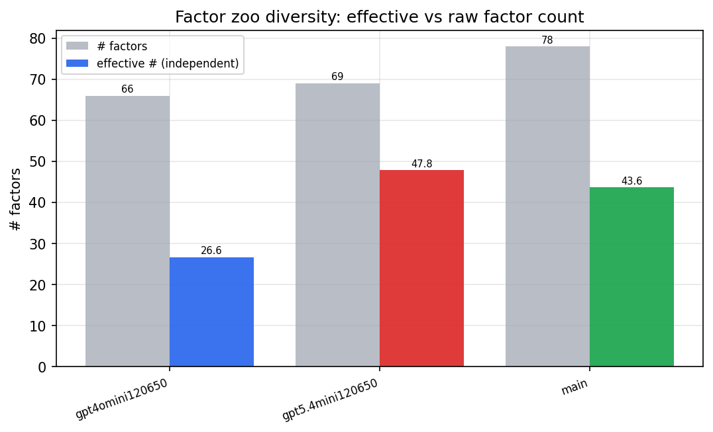

*Effective vs raw factor count per research model*

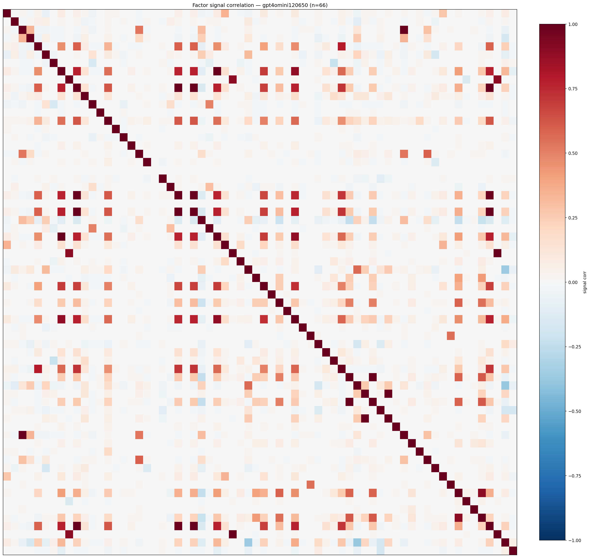

*Signal correlation matrix — gpt4omini120650*

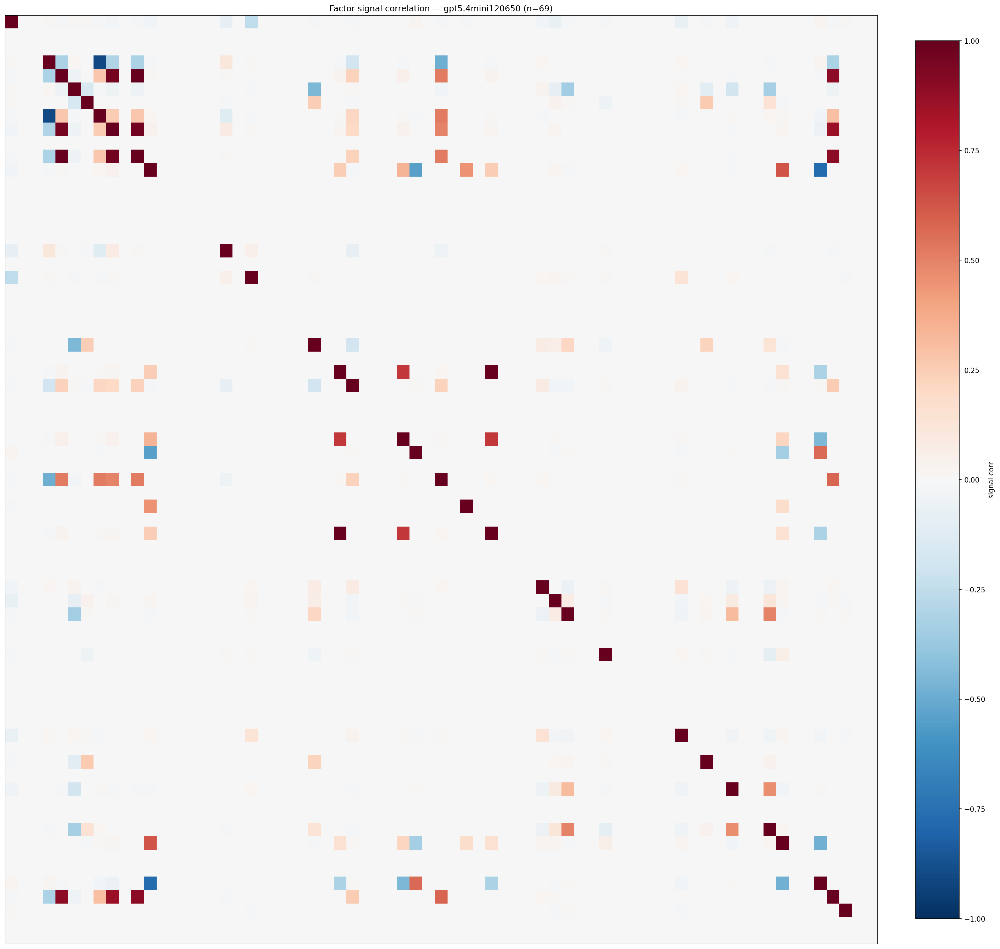

*Signal correlation matrix — gpt5.4mini120650*

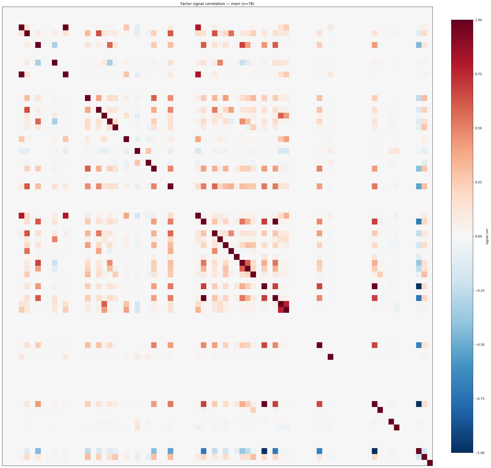

*Signal correlation matrix — main*

## 3. Deflation & model-based importance

`deflated_best_ic` haircuts each zoo's best |IC| for the number of factors tried (`ic_n_tested`) — a bigger zoo's best factor is more likely to be lucky. `lasso_n_nonzero` / `lasso_sparsity` show how many factors a sparse linear model actually keeps (model-view redundancy).

| prerun | best_ic | deflated_best_ic | deflated_best_t | ic_n_tested | ic_n_obs | lasso_n_nonzero | lasso_sparsity |
| --- | --- | --- | --- | --- | --- | --- | --- |
| gpt4omini120650 | 0.0185 | 0.0108 | 4.0442 | 64 | 140579 | 0 | 1.0 |
| gpt5.4mini120650 | 0.0154 | 0.0084 | 3.155 | 31 | 140579 | 0 | 1.0 |
| main | 0.0111 | 0.0039 | 1.4677 | 38 | 140579 | 0 | 1.0 |

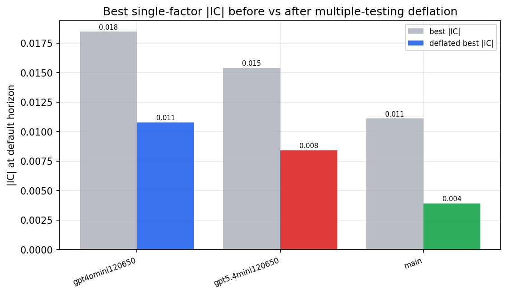

*Best |IC| before vs after multiple-testing deflation*

*Top factors by lasso importance per zoo*

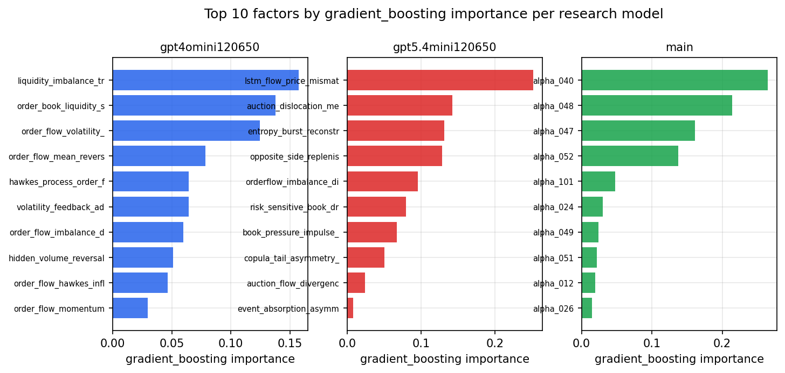

*Top factors by gradient_boosting importance per zoo*

## 4. ML-combined signal — per-underlying vectorised backtest

Each model combines a prerun's factors into ONE signal (fit `factors → forward return` on IS, predict per (bar, underlying)), then that combined signal is run through a simple vectorised backtest — `position(signal) × the underlying's own forward return` — on the held-out OOS tail (+ an equal-weight ensemble). No cross-sectional ranking.

> Config: position=**threshold** (t=1.0, z-score `expanding`), aggregation=**portfolio**, fit-standardise=**per_underlying**, horizon=6.

| prerun | model | n_factors_used | oos_ic | oos_sharpe | is_sharpe | oos_ann_return | oos_max_drawdown |
| --- | --- | --- | --- | --- | --- | --- | --- |
| gpt4omini120650 | linear_regression | 66 | -0.0029 | 4.2481 | 4.8509 | 0.5143 | -0.023 |
| gpt4omini120650 | ridge | 66 | -0.0026 | 4.4343 | 4.7736 | 0.5336 | -0.0217 |
| gpt4omini120650 | lasso | 66 | nan | nan | nan | nan | nan |
| gpt4omini120650 | elastic_net | 66 | nan | nan | nan | nan | nan |
| gpt4omini120650 | random_forest | 66 | -0.0042 | 2.7188 | 6.7185 | 0.3121 | -0.0218 |
| gpt4omini120650 | gradient_boosting | 66 | 0.0162 | 1.011 | 8.5995 | 0.0575 | -0.0153 |
| gpt4omini120650 | xgboost | 66 | 0.0001 | 1.1604 | 9.0174 | 0.1044 | -0.0197 |
| gpt4omini120650 | lightgbm | 66 | 0.0043 | -0.7344 | 15.8325 | -0.053 | -0.0178 |
| gpt4omini120650 | ensemble | 66 | -0.0044 | 2.476 | 12.5712 | 0.2762 | -0.028 |
| gpt5.4mini120650 | linear_regression | 69 | 0.007 | 4.0376 | 3.7169 | 0.2691 | -0.0154 |
| gpt5.4mini120650 | ridge | 69 | 0.0077 | 3.609 | 3.6553 | 0.2534 | -0.0164 |
| gpt5.4mini120650 | lasso | 69 | nan | nan | nan | nan | nan |
| gpt5.4mini120650 | elastic_net | 69 | nan | nan | nan | nan | nan |
| gpt5.4mini120650 | random_forest | 69 | 0.0011 | 0.2822 | 7.0959 | 0.0263 | -0.0246 |
| gpt5.4mini120650 | gradient_boosting | 69 | 0.0037 | 3.5817 | 7.7107 | 0.1785 | -0.0084 |
| gpt5.4mini120650 | xgboost | 69 | 0.0026 | 1.8287 | 8.1826 | 0.144 | -0.0148 |
| gpt5.4mini120650 | lightgbm | 69 | 0.0049 | 0.7119 | 11.5111 | 0.0677 | -0.0223 |
| gpt5.4mini120650 | ensemble | 69 | 0.0089 | 0.9973 | 9.8243 | 0.0969 | -0.0226 |
| main | linear_regression | 78 | -0.0148 | -2.7444 | 8.03 | -0.099 | -0.0187 |
| main | ridge | 78 | -0.0144 | -3.1701 | 7.5166 | -0.1116 | -0.015 |
| main | lasso | 78 | nan | nan | nan | nan | nan |
| main | elastic_net | 78 | nan | nan | nan | nan | nan |
| main | random_forest | 78 | -0.0071 | -1.6313 | 10.5845 | -0.075 | -0.0186 |
| main | gradient_boosting | 78 | -0.0044 | -0.0489 | 9.4309 | -0.0014 | -0.009 |
| main | xgboost | 78 | -0.0006 | 0.2585 | 11.6814 | 0.0091 | -0.0089 |
| main | lightgbm | 78 | -0.0031 | -1.2383 | 16.5906 | -0.035 | -0.0074 |
| main | ensemble | 78 | -0.0063 | -1.7133 | 14.5897 | -0.0662 | -0.0131 |

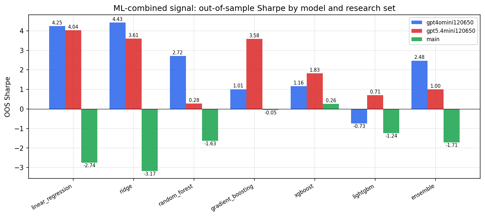

*ML-combined OOS Sharpe by model and research set*

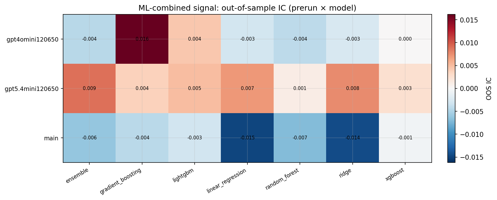

*ML-combined OOS IC (prerun × model)*

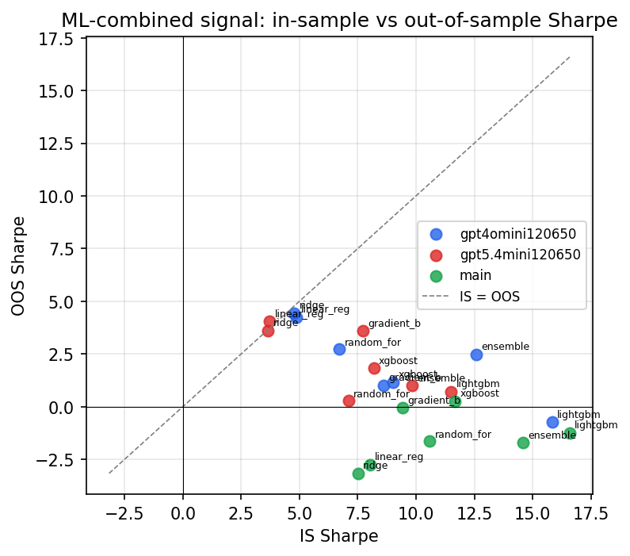

*IS vs OOS Sharpe (overfitting diagnostic)*

---
*Generated by `run_model_comparison.py`. Tables: `*.csv`; interactive: `comparison.ipynb`.*
