# Research-LLM factor comparison — `2025-02`

Comparing the **factor output of different research LLMs** on three axes (raw factor quality → factors as ML features → factors through the full agentic fund). The panel, IS/OOS split, horizon and model hyper-parameters are held identical across preruns — the *only* variable is the factor set.

## Preruns compared

| prerun | research_model | usable_factors | dropped_factors |
| --- | --- | --- | --- |
| gpt4omini120650 | gpt-4o-mini | 66 | 0 |
| gpt5.4mini120650 | gpt-5.4-mini | 69 | 0 |
| main | seed library | 78 | 10 |

> Dropped factors declare fields the current data doesn't have yet (e.g. fundamentals); they light up unchanged once that data is downloaded.

*Usable vs awaiting-data factors per research model*

## Key findings

- **Best ML-combined OOS Sharpe:** `gpt4omini120650` with `lightgbm` (OOS Sharpe = 2.789).
- **Mean OOS Sharpe across models, by research set:** `main` = -2.616, `gpt4omini120650` = -2.744, `gpt5.4mini120650` = -3.236.
- **Highest mean single-factor |IC| (h=6):** `gpt5.4mini120650` (mean |IC| = 0.0046).
- **Most diverse zoo (highest effective/raw factor ratio):** `gpt5.4mini120650` (eff 46.7 of 69, ratio 0.68).
- **Best selection-deflated single-factor |IC|:** `gpt5.4mini120650` (deflated |IC| = 0.0086 from 31 factors tried).

## 1. Single-factor IC (raw factor quality)

Per-underlying time-series Spearman rank-IC of every researched factor, recomputed on the shared panel at horizons h=1, h=6, h=60. The per-underlying IC correlates each factor's value vector with the underlying's own forward-return vector (pooled across underlyings); the cross-sectional IC ranks across underlyings per timestamp.

| prerun | n_factors | mean_abs_ic_1 | mean_abs_ic_6 | mean_abs_ic_60 | mean_abs_icir_6 | best_factor_h6 | best_abs_ic_h6 |
| --- | --- | --- | --- | --- | --- | --- | --- |
| gpt4omini120650 | 66 | 0.0042 | 0.0039 | 0.0065 | 0.2132 | order_flow_stability_score | 0.0111 |
| gpt5.4mini120650 | 69 | 0.0033 | 0.0046 | 0.0065 | 0.1814 | spread_depth_squeeze_reversion | 0.0157 |
| main | 78 | 0.0029 | 0.0022 | 0.0034 | 0.1421 | alpha_031 | 0.008 |

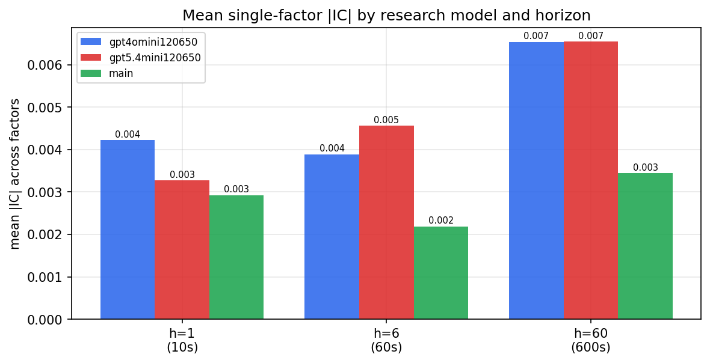

*Mean |IC| by research model and horizon*

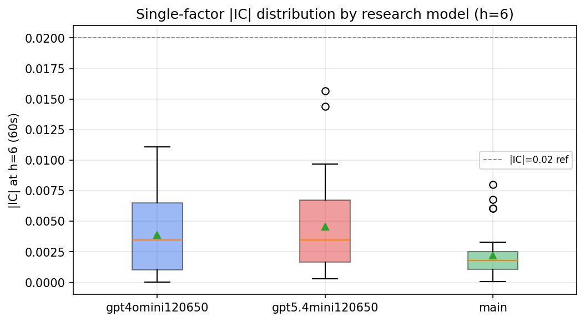

*Per-factor |IC| distribution by research model*

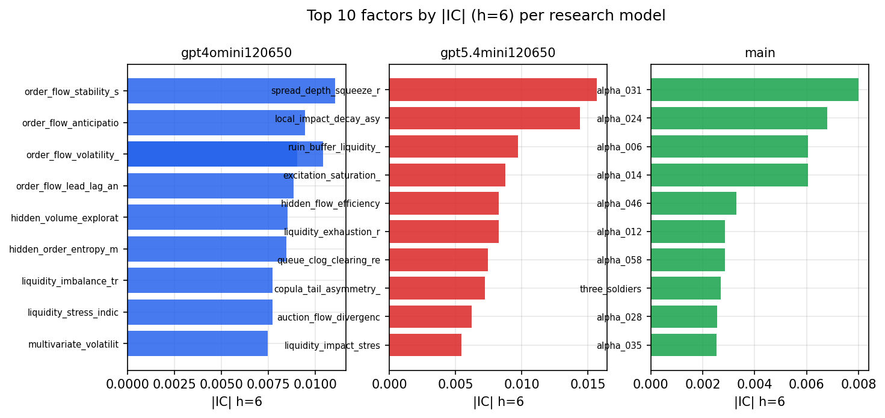

*Top factors by |IC| per research model*

## 2. Factor diversity & redundancy

Pairwise correlation of each zoo's *signals*. `eff_n_factors` is the effective number of independent factors (participation ratio of the correlation eigenvalues); `eff_ratio` and `redundancy` summarise how much unique information the zoo holds vs. how much is duplicated; `n_clusters` groups factors at |corr| ≥ 0.7.

| prerun | n_factors | eff_n_factors | eff_ratio | mean_abs_corr | n_clusters | redundancy |
| --- | --- | --- | --- | --- | --- | --- |
| gpt4omini120650 | 66 | 26.6712 | 0.4041 | 0.0531 | 51 | 0.5959 |
| gpt5.4mini120650 | 69 | 46.6576 | 0.6762 | 0.0141 | 62 | 0.3238 |
| main | 78 | 43.1145 | 0.5527 | 0.0274 | 71 | 0.4472 |

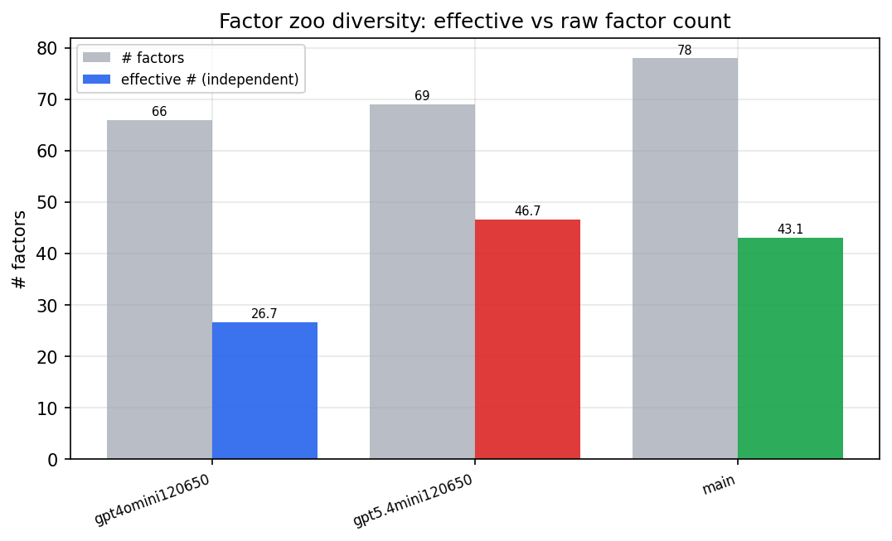

*Effective vs raw factor count per research model*

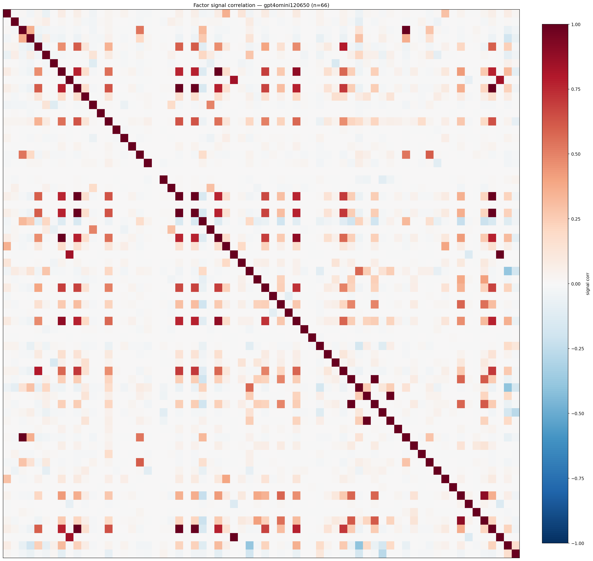

*Signal correlation matrix — gpt4omini120650*

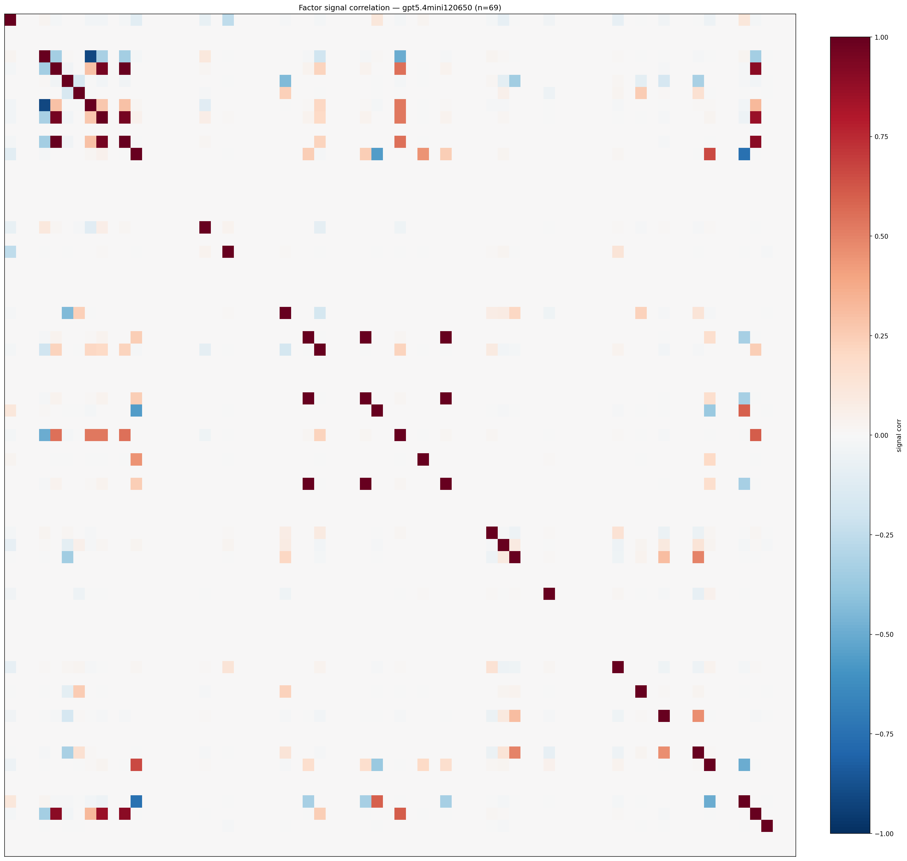

*Signal correlation matrix — gpt5.4mini120650*

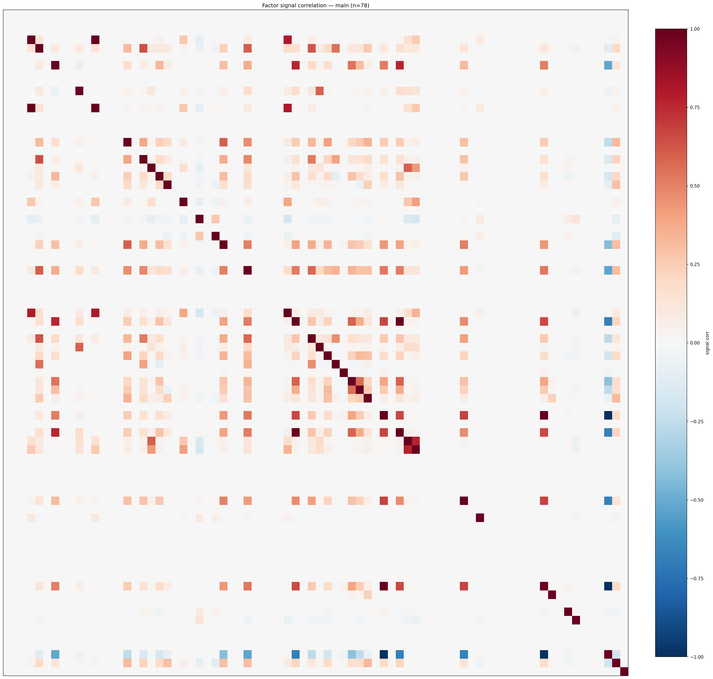

*Signal correlation matrix — main*

## 3. Deflation & model-based importance

`deflated_best_ic` haircuts each zoo's best |IC| for the number of factors tried (`ic_n_tested`) — a bigger zoo's best factor is more likely to be lucky. `lasso_n_nonzero` / `lasso_sparsity` show how many factors a sparse linear model actually keeps (model-view redundancy).

| prerun | best_ic | deflated_best_ic | deflated_best_t | ic_n_tested | ic_n_obs | lasso_n_nonzero | lasso_sparsity |
| --- | --- | --- | --- | --- | --- | --- | --- |
| gpt4omini120650 | 0.0111 | 0.0033 | 1.2499 | 64 | 139319 | 0 | 1.0 |
| gpt5.4mini120650 | 0.0157 | 0.0086 | 3.228 | 31 | 139319 | 0 | 1.0 |
| main | 0.008 | 0.0008 | 0.2898 | 38 | 139319 | 0 | 1.0 |

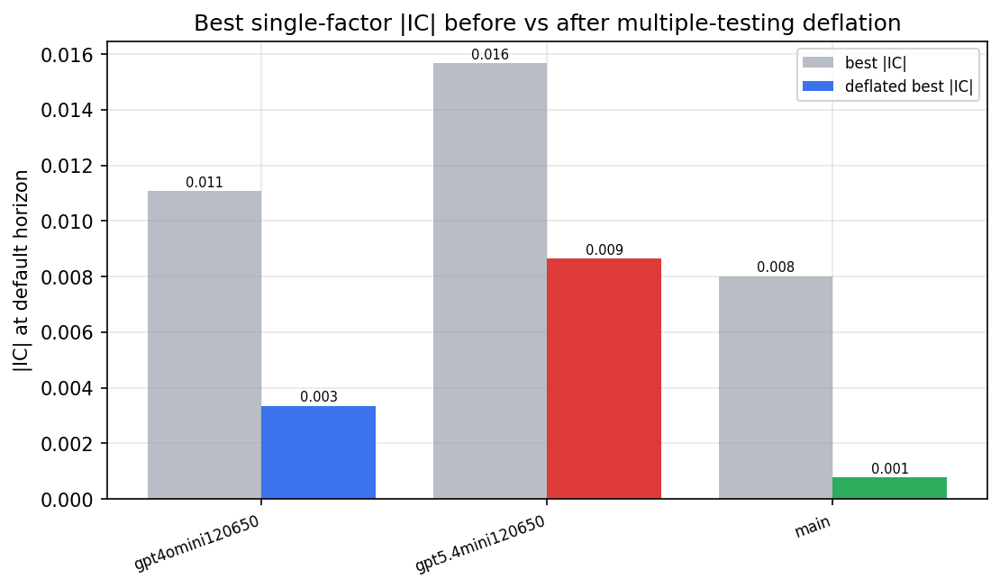

*Best |IC| before vs after multiple-testing deflation*

*Top factors by lasso importance per zoo*

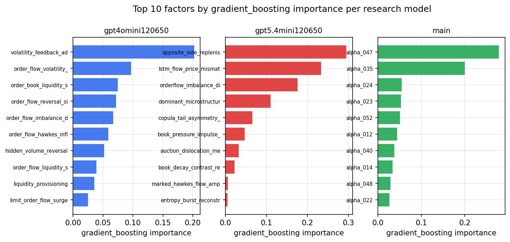

*Top factors by gradient_boosting importance per zoo*

## 4. ML-combined signal — per-underlying vectorised backtest

Each model combines a prerun's factors into ONE signal (fit `factors → forward return` on IS, predict per (bar, underlying)), then that combined signal is run through a simple vectorised backtest — `position(signal) × the underlying's own forward return` — on the held-out OOS tail (+ an equal-weight ensemble). No cross-sectional ranking.

> Config: position=**threshold** (t=1.0, z-score `expanding`), aggregation=**portfolio**, fit-standardise=**per_underlying**, horizon=6.

| prerun | model | n_factors_used | oos_ic | oos_sharpe | is_sharpe | oos_ann_return | oos_max_drawdown |
| --- | --- | --- | --- | --- | --- | --- | --- |
| gpt4omini120650 | linear_regression | 66 | 0.0097 | -1.0511 | 5.8278 | -0.0561 | -0.0165 |
| gpt4omini120650 | ridge | 66 | 0.01 | -1.1413 | 5.2705 | -0.0616 | -0.0173 |
| gpt4omini120650 | lasso | 66 | nan | nan | nan | nan | nan |
| gpt4omini120650 | elastic_net | 66 | nan | nan | nan | nan | nan |
| gpt4omini120650 | random_forest | 66 | -0.0093 | -7.0316 | 10.2582 | -0.1743 | -0.0161 |
| gpt4omini120650 | gradient_boosting | 66 | -0.0054 | -4.5984 | 9.9155 | -0.0917 | -0.0078 |
| gpt4omini120650 | xgboost | 66 | -0.011 | -4.2624 | 12.7341 | -0.081 | -0.0085 |
| gpt4omini120650 | lightgbm | 66 | -0.0065 | 2.7887 | 16.7582 | 0.1158 | -0.0048 |
| gpt4omini120650 | ensemble | 66 | 0.0082 | -3.9126 | 11.6717 | -0.0595 | -0.0081 |
| gpt5.4mini120650 | linear_regression | 69 | -0.0089 | -3.5951 | 4.6198 | -0.1577 | -0.0235 |
| gpt5.4mini120650 | ridge | 69 | -0.0084 | -3.6071 | 4.8791 | -0.1577 | -0.0233 |
| gpt5.4mini120650 | lasso | 69 | nan | nan | nan | nan | nan |
| gpt5.4mini120650 | elastic_net | 69 | nan | nan | nan | nan | nan |
| gpt5.4mini120650 | random_forest | 69 | -0.0084 | -0.5375 | 6.2293 | -0.0163 | -0.0119 |
| gpt5.4mini120650 | gradient_boosting | 69 | 0.0104 | -2.0313 | 9.2888 | -0.0275 | -0.0052 |
| gpt5.4mini120650 | xgboost | 69 | -0.0041 | -4.0086 | 10.8982 | -0.0832 | -0.0106 |
| gpt5.4mini120650 | lightgbm | 69 | -0.0028 | -6.7203 | 14.4065 | -0.1731 | -0.0163 |
| gpt5.4mini120650 | ensemble | 69 | -0.0041 | -2.1556 | 9.9452 | -0.0673 | -0.0139 |
| main | linear_regression | 78 | -0.0158 | -2.9782 | 8.3641 | -0.1067 | -0.0124 |
| main | ridge | 78 | -0.0159 | -3.5324 | 8.3229 | -0.1267 | -0.0143 |
| main | lasso | 78 | nan | nan | nan | nan | nan |
| main | elastic_net | 78 | nan | nan | nan | nan | nan |
| main | random_forest | 78 | -0.0144 | -0.8422 | 13.2744 | -0.0276 | -0.0145 |
| main | gradient_boosting | 78 | -0.0123 | -2.1758 | 12.8616 | -0.0305 | -0.0052 |
| main | xgboost | 78 | -0.0214 | -1.6763 | 14.3669 | -0.0293 | -0.0069 |
| main | lightgbm | 78 | -0.0167 | -3.4248 | 19.7338 | -0.0655 | -0.0082 |
| main | ensemble | 78 | -0.0153 | -3.6807 | 9.092 | -0.0412 | -0.0061 |

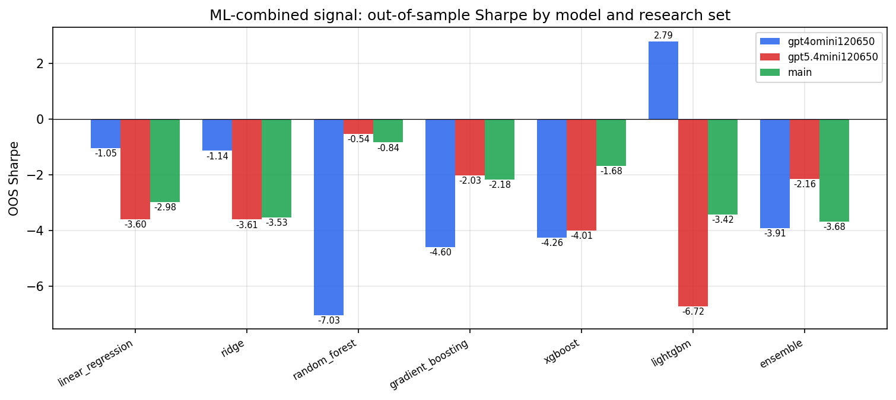

*ML-combined OOS Sharpe by model and research set*

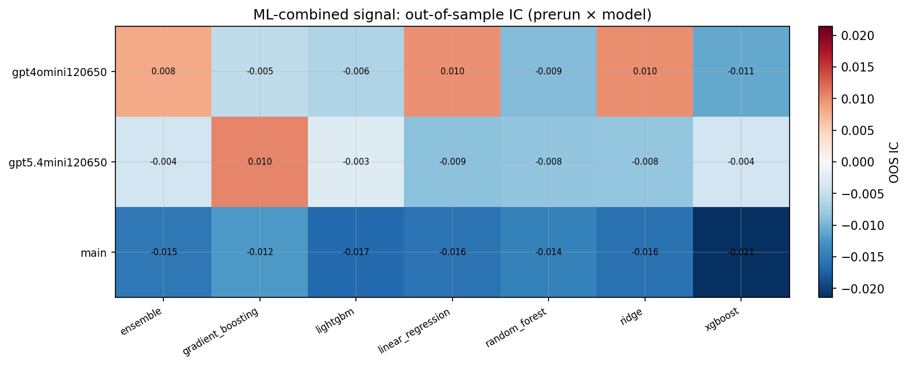

*ML-combined OOS IC (prerun × model)*

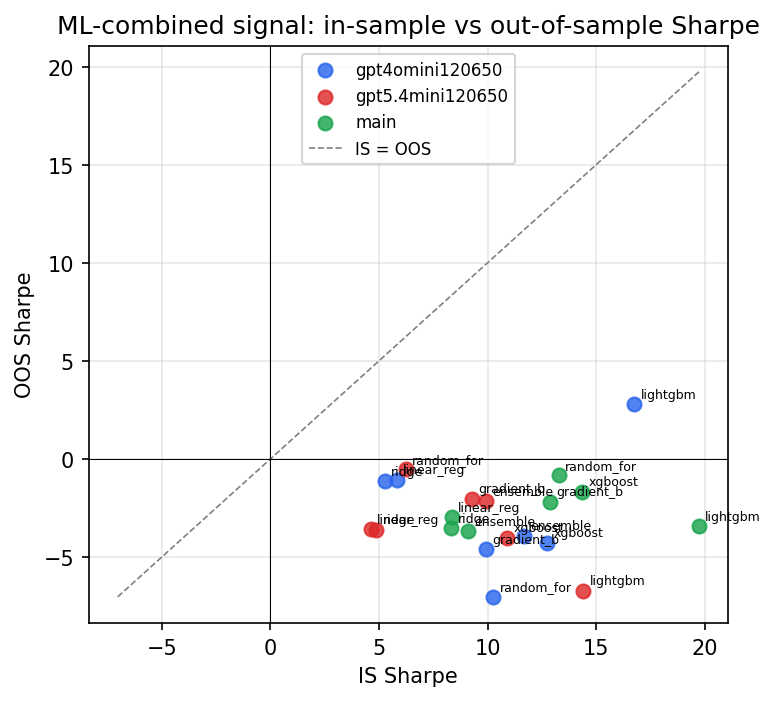

*IS vs OOS Sharpe (overfitting diagnostic)*

---
*Generated by `run_model_comparison.py`. Tables: `*.csv`; interactive: `comparison.ipynb`.*
