# Research-LLM factor comparison — `2025-03`

Comparing the **factor output of different research LLMs** on three axes (raw factor quality → factors as ML features → factors through the full agentic fund). The panel, IS/OOS split, horizon and model hyper-parameters are held identical across preruns — the *only* variable is the factor set.

## Preruns compared

| prerun | research_model | usable_factors | dropped_factors |
| --- | --- | --- | --- |
| gpt4omini120650 | gpt-4o-mini | 66 | 0 |
| gpt5.4mini120650 | gpt-5.4-mini | 69 | 0 |
| main | seed library | 78 | 10 |

> Dropped factors declare fields the current data doesn't have yet (e.g. fundamentals); they light up unchanged once that data is downloaded.

*Usable vs awaiting-data factors per research model*

## Key findings

- **Best ML-combined OOS Sharpe:** `gpt4omini120650` with `random_forest` (OOS Sharpe = 3.983).
- **Mean OOS Sharpe across models, by research set:** `gpt5.4mini120650` = 1.500, `gpt4omini120650` = 0.321, `main` = -2.745.
- **Highest mean single-factor |IC| (h=6):** `gpt5.4mini120650` (mean |IC| = 0.0051).
- **Most diverse zoo (highest effective/raw factor ratio):** `gpt5.4mini120650` (eff 44.2 of 69, ratio 0.64).
- **Best selection-deflated single-factor |IC|:** `gpt5.4mini120650` (deflated |IC| = 0.0093 from 31 factors tried).

## 1. Single-factor IC (raw factor quality)

Per-underlying time-series Spearman rank-IC of every researched factor, recomputed on the shared panel at horizons h=1, h=6, h=60. The per-underlying IC correlates each factor's value vector with the underlying's own forward-return vector (pooled across underlyings); the cross-sectional IC ranks across underlyings per timestamp.

| prerun | n_factors | mean_abs_ic_1 | mean_abs_ic_6 | mean_abs_ic_60 | mean_abs_icir_6 | best_factor_h6 | best_abs_ic_h6 |
| --- | --- | --- | --- | --- | --- | --- | --- |
| gpt4omini120650 | 66 | 0.0039 | 0.0036 | 0.0062 | 0.2389 | order_flow_volatility_spread | 0.0123 |
| gpt5.4mini120650 | 69 | 0.0034 | 0.0051 | 0.0086 | 0.2447 | spread_depth_squeeze_reversion | 0.0163 |
| main | 78 | 0.0027 | 0.0028 | 0.0033 | 0.1656 | alpha_026 | 0.0081 |

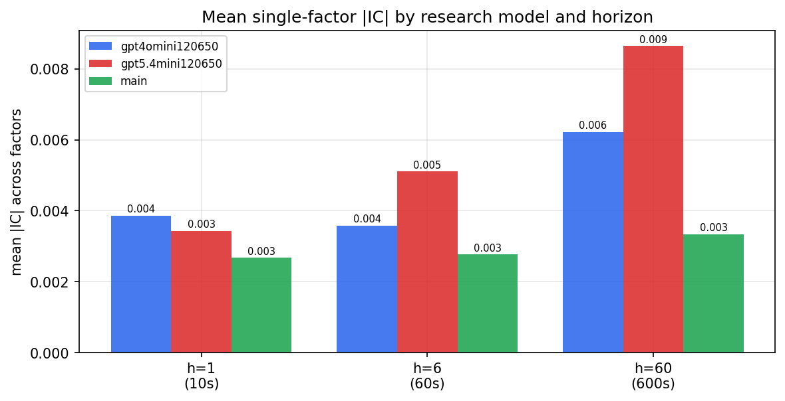

*Mean |IC| by research model and horizon*

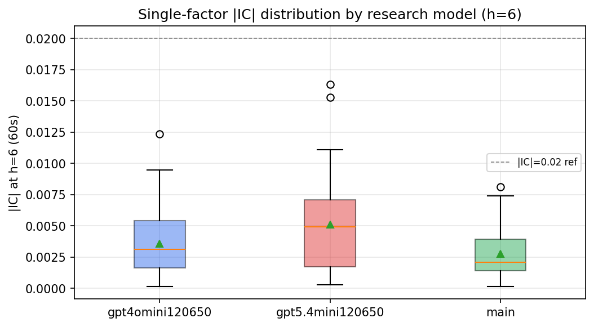

*Per-factor |IC| distribution by research model*

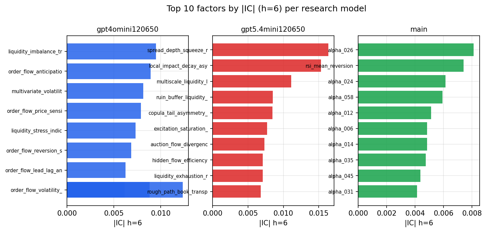

*Top factors by |IC| per research model*

## 2. Factor diversity & redundancy

Pairwise correlation of each zoo's *signals*. `eff_n_factors` is the effective number of independent factors (participation ratio of the correlation eigenvalues); `eff_ratio` and `redundancy` summarise how much unique information the zoo holds vs. how much is duplicated; `n_clusters` groups factors at |corr| ≥ 0.7.

| prerun | n_factors | eff_n_factors | eff_ratio | mean_abs_corr | n_clusters | redundancy |
| --- | --- | --- | --- | --- | --- | --- |
| gpt4omini120650 | 66 | 25.9078 | 0.3925 | 0.0542 | 50 | 0.6075 |
| gpt5.4mini120650 | 69 | 44.2344 | 0.6411 | 0.0154 | 61 | 0.3589 |
| main | 78 | 43.2856 | 0.5549 | 0.028 | 71 | 0.4451 |

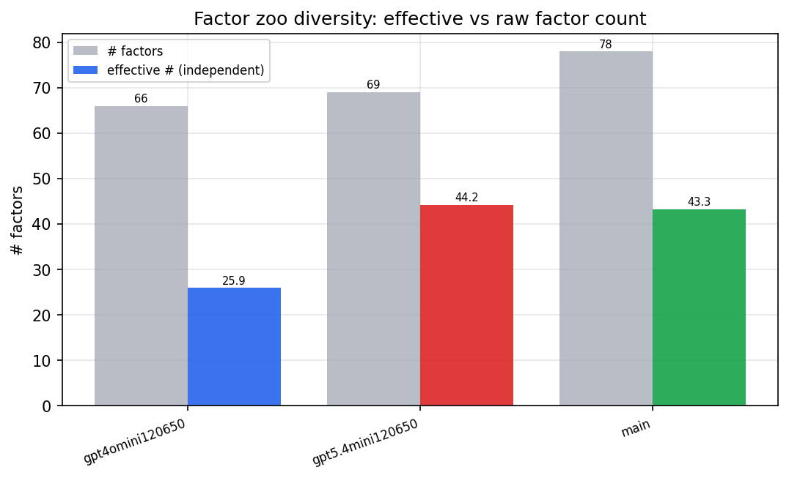

*Effective vs raw factor count per research model*

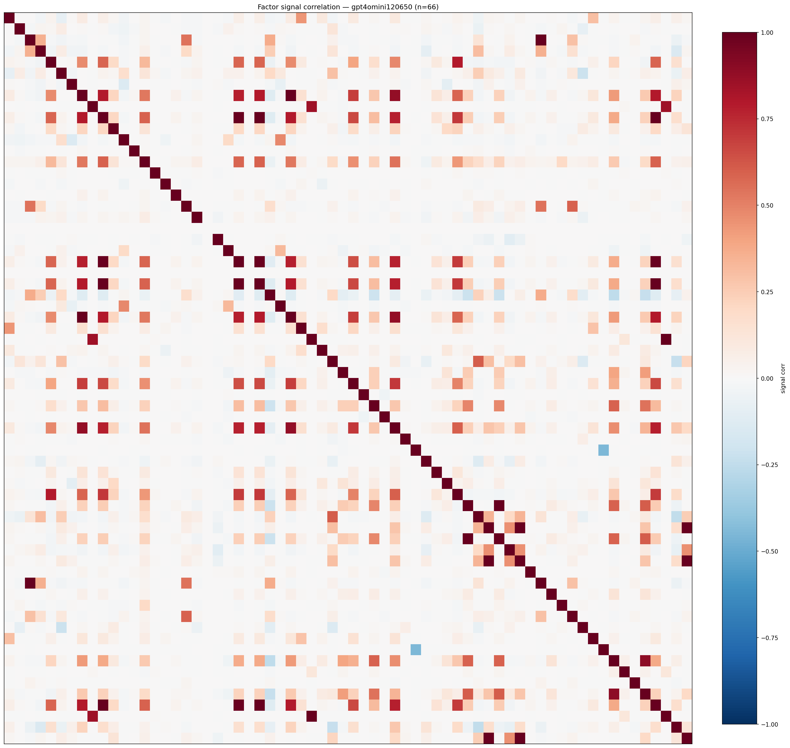

*Signal correlation matrix — gpt4omini120650*

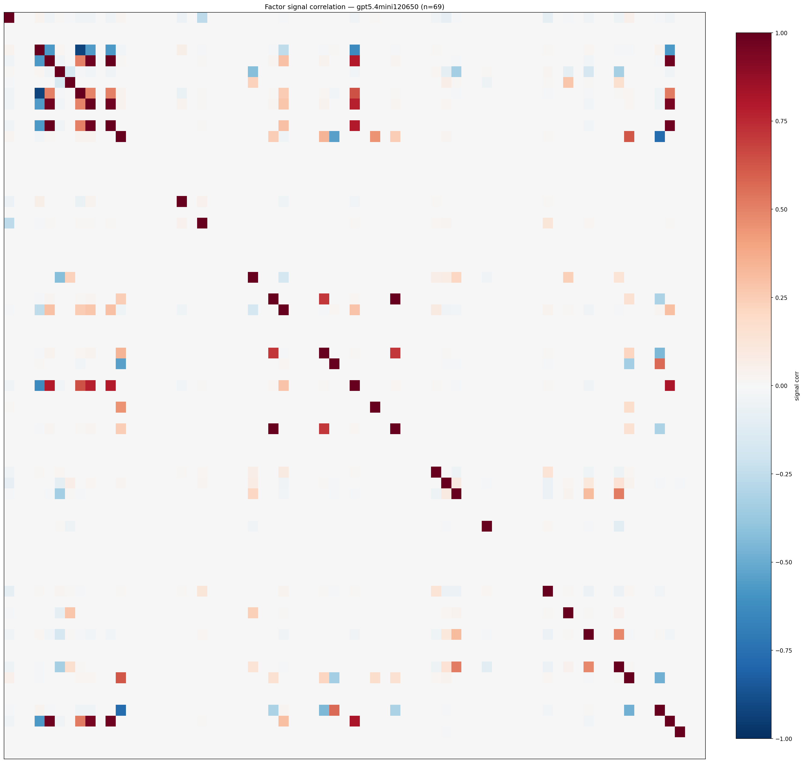

*Signal correlation matrix — gpt5.4mini120650*

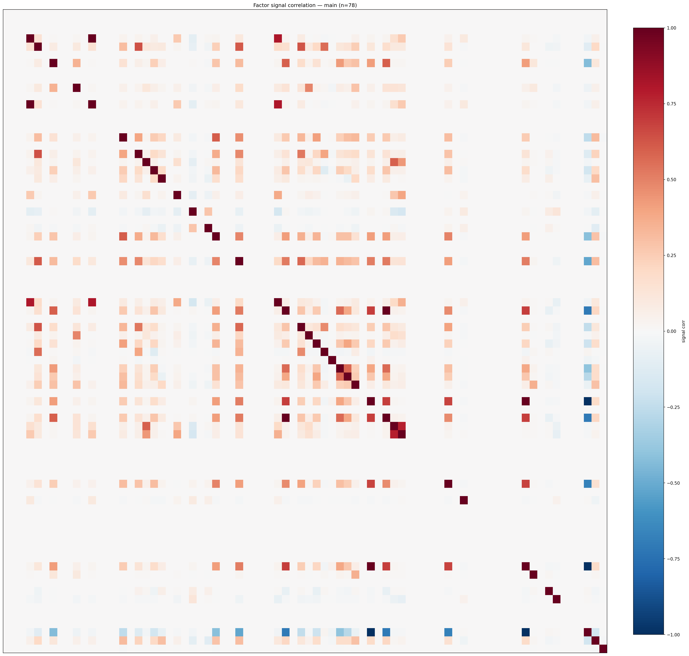

*Signal correlation matrix — main*

## 3. Deflation & model-based importance

`deflated_best_ic` haircuts each zoo's best |IC| for the number of factors tried (`ic_n_tested`) — a bigger zoo's best factor is more likely to be lucky. `lasso_n_nonzero` / `lasso_sparsity` show how many factors a sparse linear model actually keeps (model-view redundancy).

| prerun | best_ic | deflated_best_ic | deflated_best_t | ic_n_tested | ic_n_obs | lasso_n_nonzero | lasso_sparsity |
| --- | --- | --- | --- | --- | --- | --- | --- |
| gpt4omini120650 | 0.0123 | 0.0046 | 1.7425 | 64 | 140399 | 0 | 1.0 |
| gpt5.4mini120650 | 0.0163 | 0.0093 | 3.4969 | 31 | 140399 | 2 | 0.971 |
| main | 0.0081 | 0.0009 | 0.3457 | 38 | 140399 | 0 | 1.0 |

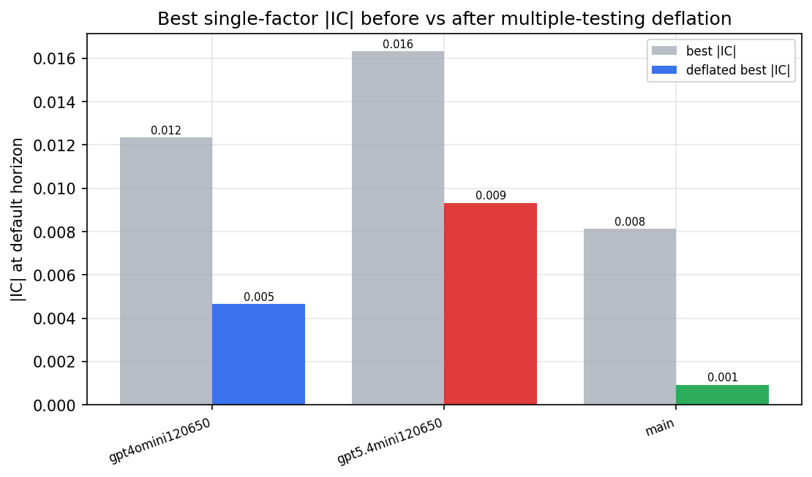

*Best |IC| before vs after multiple-testing deflation*

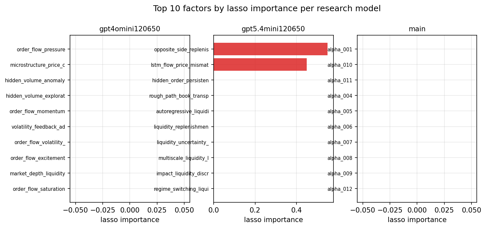

*Top factors by lasso importance per zoo*

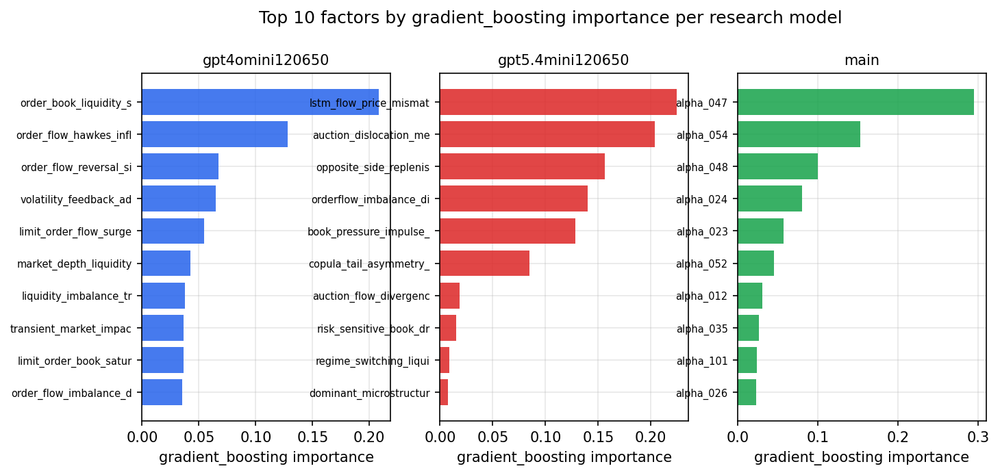

*Top factors by gradient_boosting importance per zoo*

## 4. ML-combined signal — per-underlying vectorised backtest

Each model combines a prerun's factors into ONE signal (fit `factors → forward return` on IS, predict per (bar, underlying)), then that combined signal is run through a simple vectorised backtest — `position(signal) × the underlying's own forward return` — on the held-out OOS tail (+ an equal-weight ensemble). No cross-sectional ranking.

> Config: position=**threshold** (t=1.0, z-score `expanding`), aggregation=**portfolio**, fit-standardise=**per_underlying**, horizon=6.

| prerun | model | n_factors_used | oos_ic | oos_sharpe | is_sharpe | oos_ann_return | oos_max_drawdown |
| --- | --- | --- | --- | --- | --- | --- | --- |
| gpt4omini120650 | linear_regression | 66 | 0.0012 | -1.9461 | 6.5009 | -0.192 | -0.0373 |
| gpt4omini120650 | ridge | 66 | 0.0014 | -1.7899 | 6.4494 | -0.1767 | -0.0364 |
| gpt4omini120650 | lasso | 66 | nan | nan | nan | nan | nan |
| gpt4omini120650 | elastic_net | 66 | nan | nan | nan | nan | nan |
| gpt4omini120650 | random_forest | 66 | 0.0055 | 3.9826 | 12.4003 | 0.3324 | -0.0129 |
| gpt4omini120650 | gradient_boosting | 66 | -0.0013 | 1.4554 | 9.7229 | 0.088 | -0.017 |
| gpt4omini120650 | xgboost | 66 | 0.0037 | -1.6919 | 12.6895 | -0.1811 | -0.0457 |
| gpt4omini120650 | lightgbm | 66 | 0.0094 | 2.5465 | 15.4113 | 0.1865 | -0.0211 |
| gpt4omini120650 | ensemble | 66 | -0.0052 | -0.3066 | 12.8515 | -0.0338 | -0.0401 |
| gpt5.4mini120650 | linear_regression | 69 | 0.0017 | 3.8899 | 4.1303 | 0.2781 | -0.0149 |
| gpt5.4mini120650 | ridge | 69 | 0.0017 | 3.9524 | 4.5606 | 0.2805 | -0.0157 |
| gpt5.4mini120650 | lasso | 69 | 0.0009 | 3.16 | 3.0394 | 0.2184 | -0.0121 |
| gpt5.4mini120650 | elastic_net | 69 | 0.0009 | 3.16 | 3.0394 | 0.2184 | -0.0121 |
| gpt5.4mini120650 | random_forest | 69 | -0.0044 | 2.1981 | 7.0658 | 0.1239 | -0.0102 |
| gpt5.4mini120650 | gradient_boosting | 69 | -0.0165 | -1.9009 | 8.5439 | -0.1012 | -0.0136 |
| gpt5.4mini120650 | xgboost | 69 | -0.0075 | -1.1613 | 8.9421 | -0.0761 | -0.0145 |
| gpt5.4mini120650 | lightgbm | 69 | 0.0008 | -2.63 | 13.4629 | -0.1846 | -0.022 |
| gpt5.4mini120650 | ensemble | 69 | 0.0004 | 2.8287 | 8.2369 | 0.1712 | -0.0102 |
| main | linear_regression | 78 | 0.001 | 0.3605 | 7.5586 | 0.0035 | -0.0042 |
| main | ridge | 78 | 0.0009 | 0.3605 | 7.5805 | 0.0035 | -0.0042 |
| main | lasso | 78 | nan | nan | nan | nan | nan |
| main | elastic_net | 78 | nan | nan | nan | nan | nan |
| main | random_forest | 78 | -0.0059 | -1.4087 | 12.1643 | -0.1373 | -0.0417 |
| main | gradient_boosting | 78 | -0.0094 | -4.2004 | 11.3554 | -0.3807 | -0.0422 |
| main | xgboost | 78 | -0.0087 | -4.6073 | 11.8458 | -0.4384 | -0.0459 |
| main | lightgbm | 78 | -0.0065 | -3.9228 | 18.7339 | -0.397 | -0.0471 |
| main | ensemble | 78 | -0.0038 | -5.7946 | 8.0432 | -0.0763 | -0.0073 |

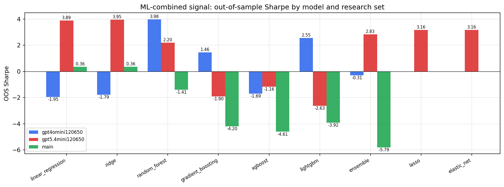

*ML-combined OOS Sharpe by model and research set*

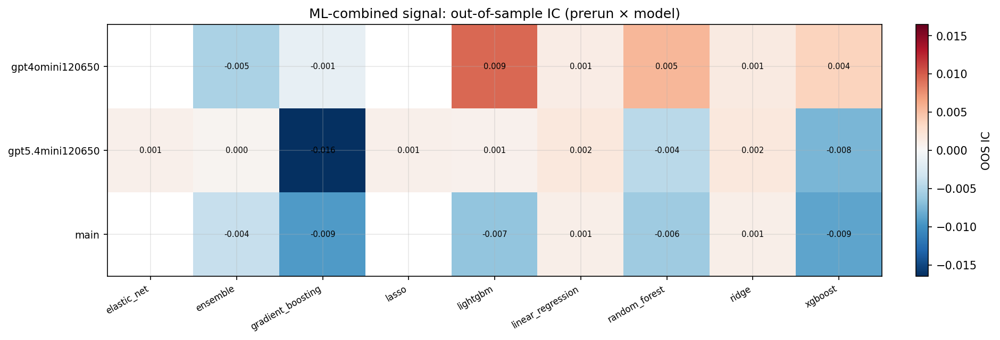

*ML-combined OOS IC (prerun × model)*

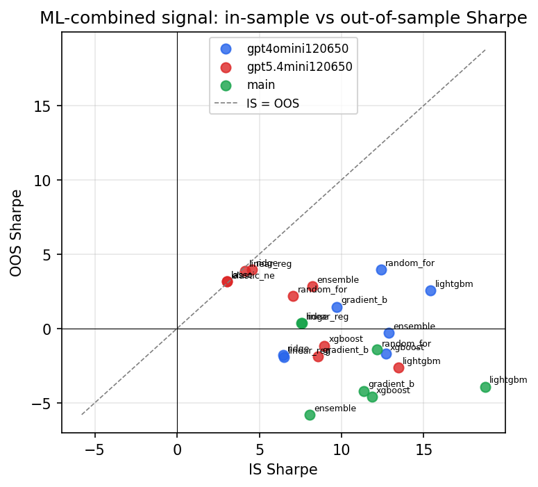

*IS vs OOS Sharpe (overfitting diagnostic)*

---
*Generated by `run_model_comparison.py`. Tables: `*.csv`; interactive: `comparison.ipynb`.*
