# Research-LLM factor comparison — `2025-04`

Comparing the **factor output of different research LLMs** on three axes (raw factor quality → factors as ML features → factors through the full agentic fund). The panel, IS/OOS split, horizon and model hyper-parameters are held identical across preruns — the *only* variable is the factor set.

## Preruns compared

| prerun | research_model | usable_factors | dropped_factors |
| --- | --- | --- | --- |
| gpt4omini120650 | gpt-4o-mini | 66 | 0 |
| gpt5.4mini120650 | gpt-5.4-mini | 69 | 0 |
| main | seed library | 78 | 10 |

> Dropped factors declare fields the current data doesn't have yet (e.g. fundamentals); they light up unchanged once that data is downloaded.

*Usable vs awaiting-data factors per research model*

## Key findings

- **Best ML-combined OOS Sharpe:** `gpt5.4mini120650` with `random_forest` (OOS Sharpe = 8.523).
- **Mean OOS Sharpe across models, by research set:** `gpt5.4mini120650` = 6.132, `gpt4omini120650` = 2.158, `main` = 0.347.
- **Highest mean single-factor |IC| (h=6):** `gpt5.4mini120650` (mean |IC| = 0.0040).
- **Most diverse zoo (highest effective/raw factor ratio):** `gpt5.4mini120650` (eff 43.3 of 69, ratio 0.63).
- **Best selection-deflated single-factor |IC|:** `main` (deflated |IC| = 0.0042 from 38 factors tried).

## 1. Single-factor IC (raw factor quality)

Per-underlying time-series Spearman rank-IC of every researched factor, recomputed on the shared panel at horizons h=1, h=6, h=60. The per-underlying IC correlates each factor's value vector with the underlying's own forward-return vector (pooled across underlyings); the cross-sectional IC ranks across underlyings per timestamp.

| prerun | n_factors | mean_abs_ic_1 | mean_abs_ic_6 | mean_abs_ic_60 | mean_abs_icir_6 | best_factor_h6 | best_abs_ic_h6 |
| --- | --- | --- | --- | --- | --- | --- | --- |
| gpt4omini120650 | 66 | 0.0028 | 0.0038 | 0.0042 | 0.2426 | order_flow_volatility_spread | 0.0101 |
| gpt5.4mini120650 | 69 | 0.0023 | 0.004 | 0.0061 | 0.2341 | excitation_saturation_reversal | 0.0095 |
| main | 78 | 0.0023 | 0.0035 | 0.0042 | 0.2158 | alpha_024 | 0.0113 |

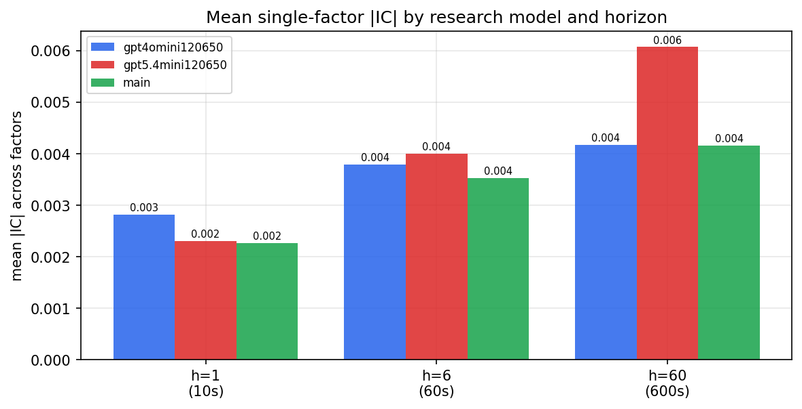

*Mean |IC| by research model and horizon*

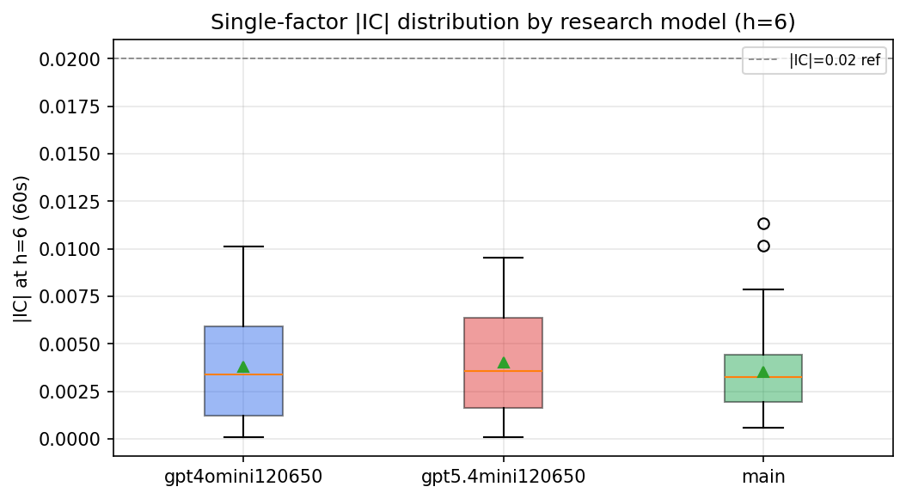

*Per-factor |IC| distribution by research model*

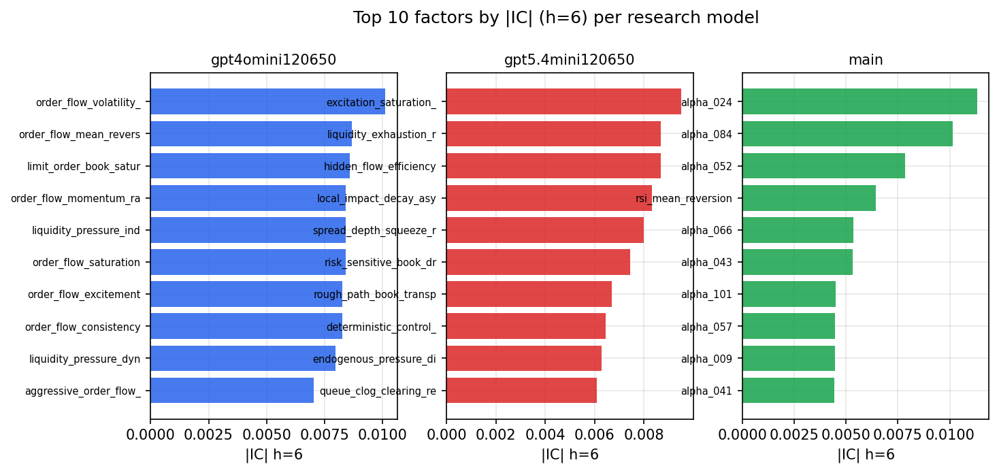

*Top factors by |IC| per research model*

## 2. Factor diversity & redundancy

Pairwise correlation of each zoo's *signals*. `eff_n_factors` is the effective number of independent factors (participation ratio of the correlation eigenvalues); `eff_ratio` and `redundancy` summarise how much unique information the zoo holds vs. how much is duplicated; `n_clusters` groups factors at |corr| ≥ 0.7.

| prerun | n_factors | eff_n_factors | eff_ratio | mean_abs_corr | n_clusters | redundancy |
| --- | --- | --- | --- | --- | --- | --- |
| gpt4omini120650 | 66 | 26.861 | 0.407 | 0.0539 | 52 | 0.593 |
| gpt5.4mini120650 | 69 | 43.297 | 0.6275 | 0.0158 | 60 | 0.3725 |
| main | 78 | 43.6803 | 0.56 | 0.0279 | 72 | 0.44 |

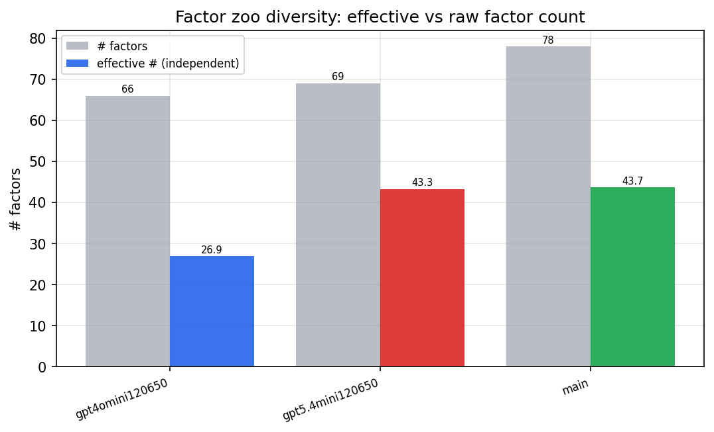

*Effective vs raw factor count per research model*

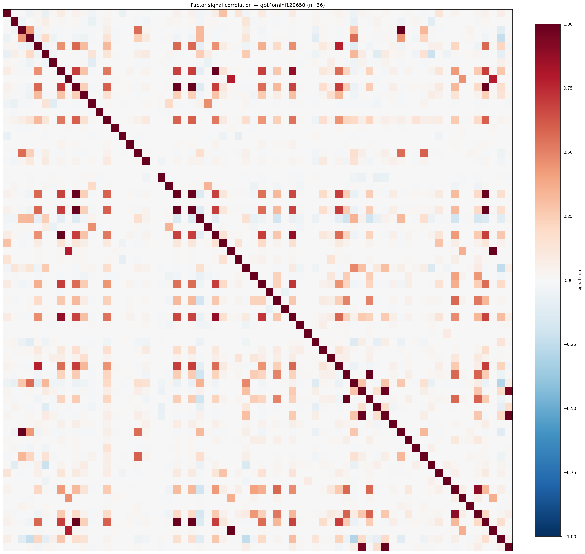

*Signal correlation matrix — gpt4omini120650*

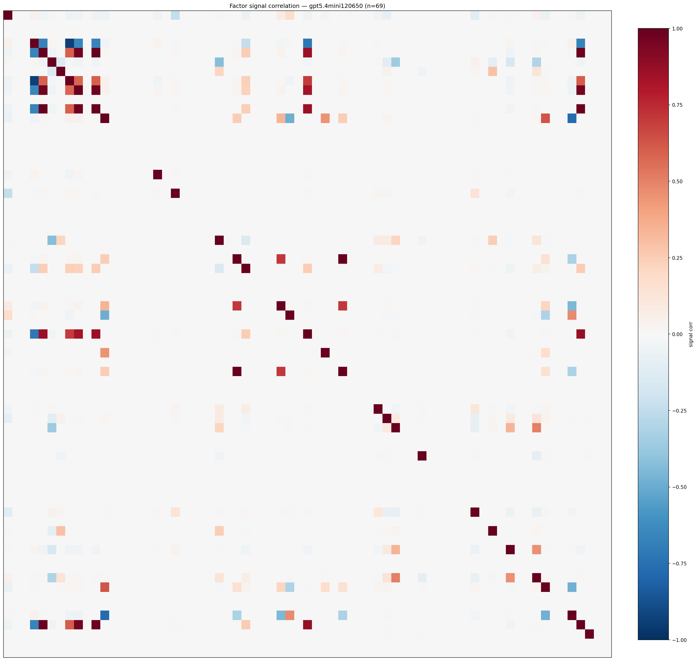

*Signal correlation matrix — gpt5.4mini120650*

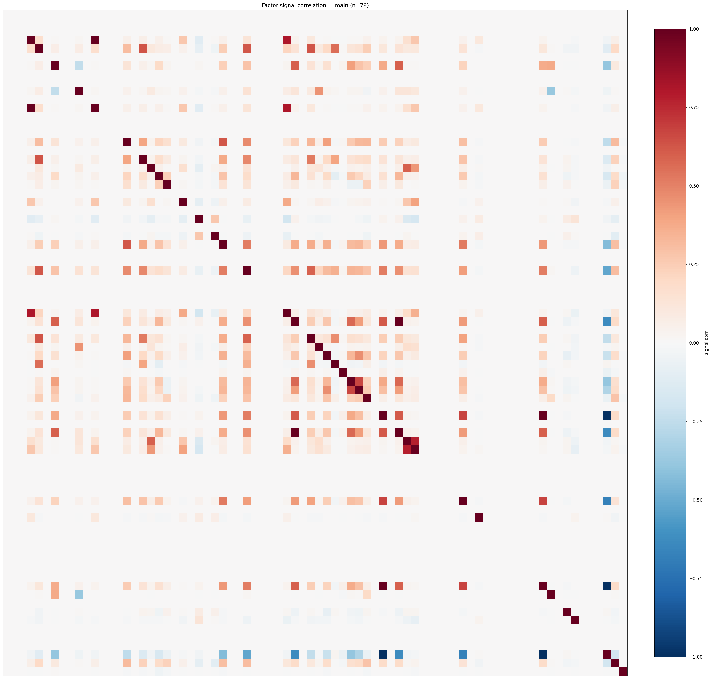

*Signal correlation matrix — main*

## 3. Deflation & model-based importance

`deflated_best_ic` haircuts each zoo's best |IC| for the number of factors tried (`ic_n_tested`) — a bigger zoo's best factor is more likely to be lucky. `lasso_n_nonzero` / `lasso_sparsity` show how many factors a sparse linear model actually keeps (model-view redundancy).

| prerun | best_ic | deflated_best_ic | deflated_best_t | ic_n_tested | ic_n_obs | lasso_n_nonzero | lasso_sparsity |
| --- | --- | --- | --- | --- | --- | --- | --- |
| gpt4omini120650 | 0.0101 | 0.0025 | 0.9378 | 64 | 142739 | 0 | 1.0 |
| gpt5.4mini120650 | 0.0095 | 0.0026 | 0.9762 | 31 | 142739 | 0 | 1.0 |
| main | 0.0113 | 0.0042 | 1.5844 | 38 | 142739 | 4 | 0.9487 |

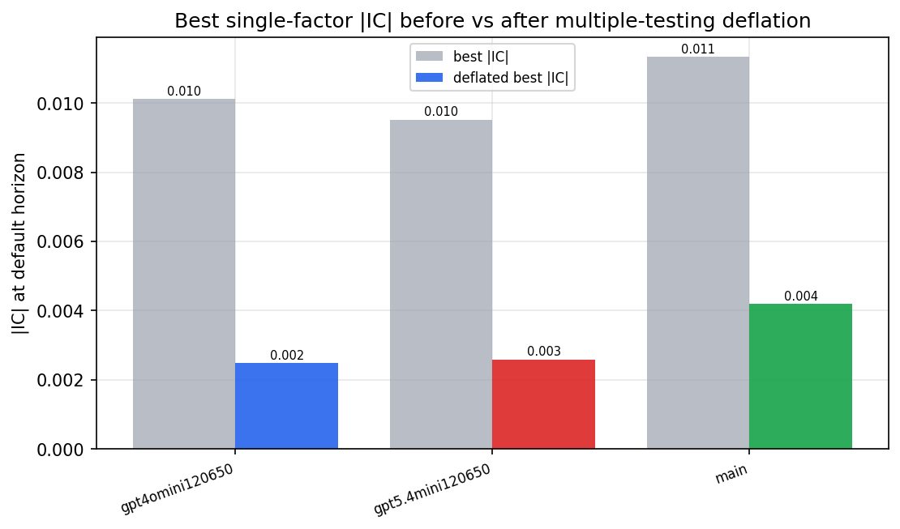

*Best |IC| before vs after multiple-testing deflation*

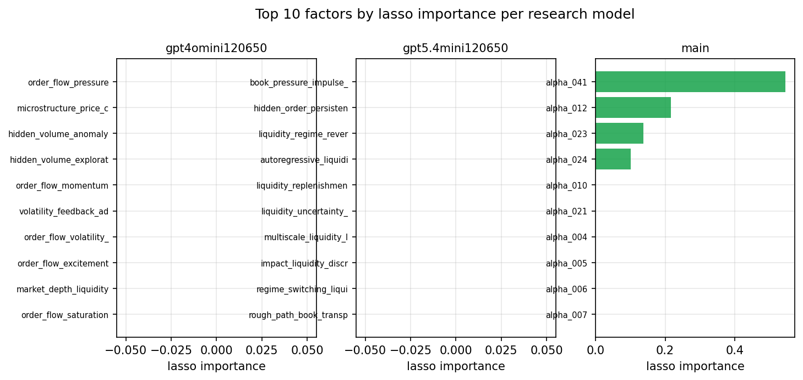

*Top factors by lasso importance per zoo*

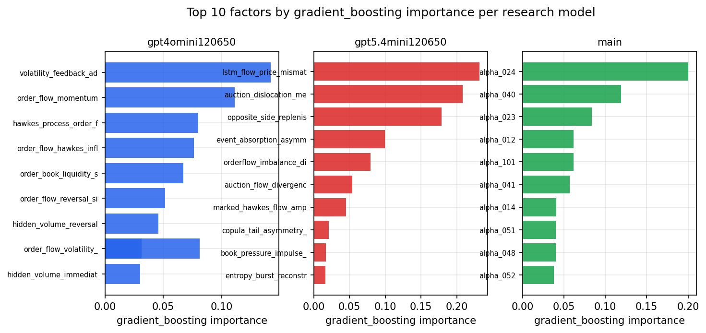

*Top factors by gradient_boosting importance per zoo*

## 4. ML-combined signal — per-underlying vectorised backtest

Each model combines a prerun's factors into ONE signal (fit `factors → forward return` on IS, predict per (bar, underlying)), then that combined signal is run through a simple vectorised backtest — `position(signal) × the underlying's own forward return` — on the held-out OOS tail (+ an equal-weight ensemble). No cross-sectional ranking.

> Config: position=**threshold** (t=1.0, z-score `expanding`), aggregation=**portfolio**, fit-standardise=**per_underlying**, horizon=6.

| prerun | model | n_factors_used | oos_ic | oos_sharpe | is_sharpe | oos_ann_return | oos_max_drawdown |
| --- | --- | --- | --- | --- | --- | --- | --- |
| gpt4omini120650 | linear_regression | 66 | 0.0145 | 3.5377 | 7.6272 | 0.9655 | -0.0643 |
| gpt4omini120650 | ridge | 66 | 0.0135 | 3.2379 | 7.0232 | 0.8933 | -0.0617 |
| gpt4omini120650 | lasso | 66 | nan | nan | nan | nan | nan |
| gpt4omini120650 | elastic_net | 66 | nan | nan | nan | nan | nan |
| gpt4omini120650 | random_forest | 66 | 0.0076 | 4.5837 | 7.9039 | 1.1991 | -0.0499 |
| gpt4omini120650 | gradient_boosting | 66 | -0.0017 | 0.5158 | 8.9808 | 0.123 | -0.0717 |
| gpt4omini120650 | xgboost | 66 | 0.0033 | 1.8471 | 12.3691 | 0.4747 | -0.0638 |
| gpt4omini120650 | lightgbm | 66 | -0.0046 | 0.3125 | 19.3692 | 0.0774 | -0.073 |
| gpt4omini120650 | ensemble | 66 | 0.0118 | 1.0681 | 10.5184 | 0.265 | -0.0622 |
| gpt5.4mini120650 | linear_regression | 69 | -0.0028 | 4.0656 | 4.663 | 0.9198 | -0.0454 |
| gpt5.4mini120650 | ridge | 69 | -0.0028 | 4.7258 | 4.8846 | 1.0185 | -0.0474 |
| gpt5.4mini120650 | lasso | 69 | nan | nan | nan | nan | nan |
| gpt5.4mini120650 | elastic_net | 69 | nan | nan | nan | nan | nan |
| gpt5.4mini120650 | random_forest | 69 | 0.0018 | 8.5227 | 7.3136 | 1.7452 | -0.019 |
| gpt5.4mini120650 | gradient_boosting | 69 | -0.0007 | 6.4681 | 8.782 | 0.9946 | -0.019 |
| gpt5.4mini120650 | xgboost | 69 | -0.0026 | 7.0979 | 10.9234 | 1.2265 | -0.0232 |
| gpt5.4mini120650 | lightgbm | 69 | -0.0033 | 5.765 | 16.5745 | 1.116 | -0.0299 |
| gpt5.4mini120650 | ensemble | 69 | -0.0014 | 6.2816 | 8.3809 | 0.7092 | -0.0166 |
| main | linear_regression | 78 | -0.0037 | 3.4208 | 8.0571 | 0.2763 | -0.0042 |
| main | ridge | 78 | -0.0016 | 3.4166 | 7.2751 | 0.2759 | -0.0042 |
| main | lasso | 78 | nan | nan | nan | nan | nan |
| main | elastic_net | 78 | nan | nan | nan | nan | nan |
| main | random_forest | 78 | -0.0061 | -0.7246 | 15.4158 | -0.1357 | -0.0747 |
| main | gradient_boosting | 78 | 0.0023 | -1.157 | 17.218 | -0.1455 | -0.0587 |
| main | xgboost | 78 | 0.0005 | 0.4318 | 18.0875 | 0.0891 | -0.071 |
| main | lightgbm | 78 | 0.0001 | 2.0285 | 29.0521 | 0.3397 | -0.0444 |
| main | ensemble | 78 | 0.0072 | -4.987 | 9.0409 | -0.3236 | -0.0315 |

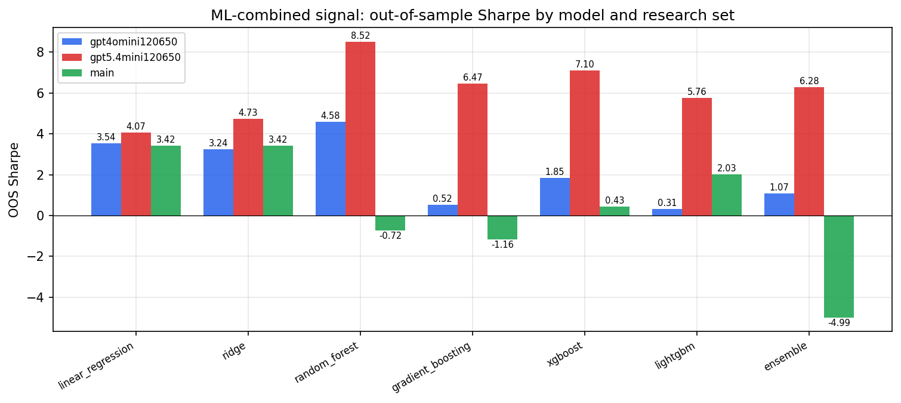

*ML-combined OOS Sharpe by model and research set*

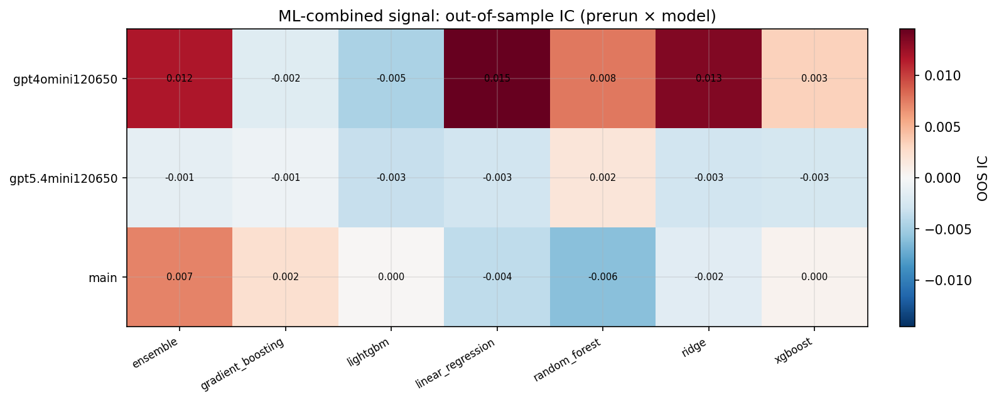

*ML-combined OOS IC (prerun × model)*

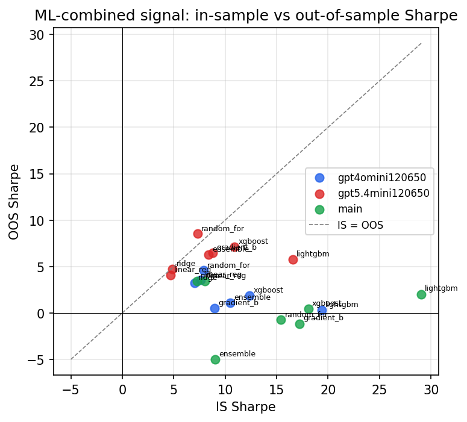

*IS vs OOS Sharpe (overfitting diagnostic)*

---
*Generated by `run_model_comparison.py`. Tables: `*.csv`; interactive: `comparison.ipynb`.*
