# Research-LLM factor comparison — `2025-05`

Comparing the **factor output of different research LLMs** on three axes (raw factor quality → factors as ML features → factors through the full agentic fund). The panel, IS/OOS split, horizon and model hyper-parameters are held identical across preruns — the *only* variable is the factor set.

## Preruns compared

| prerun | research_model | usable_factors | dropped_factors |
| --- | --- | --- | --- |
| gpt4omini120650 | gpt-4o-mini | 66 | 0 |
| gpt5.4mini120650 | gpt-5.4-mini | 69 | 0 |
| main | seed library | 78 | 10 |

> Dropped factors declare fields the current data doesn't have yet (e.g. fundamentals); they light up unchanged once that data is downloaded.

*Usable vs awaiting-data factors per research model*

## Key findings

- **Best ML-combined OOS Sharpe:** `gpt4omini120650` with `gradient_boosting` (OOS Sharpe = 3.669).
- **Mean OOS Sharpe across models, by research set:** `gpt5.4mini120650` = 1.129, `gpt4omini120650` = 0.406, `main` = -1.636.
- **Highest mean single-factor |IC| (h=6):** `gpt4omini120650` (mean |IC| = 0.0043).
- **Most diverse zoo (highest effective/raw factor ratio):** `gpt5.4mini120650` (eff 39.2 of 69, ratio 0.57).
- **Best selection-deflated single-factor |IC|:** `main` (deflated |IC| = 0.0082 from 38 factors tried).

## 1. Single-factor IC (raw factor quality)

Per-underlying time-series Spearman rank-IC of every researched factor, recomputed on the shared panel at horizons h=1, h=6, h=60. The per-underlying IC correlates each factor's value vector with the underlying's own forward-return vector (pooled across underlyings); the cross-sectional IC ranks across underlyings per timestamp.

| prerun | n_factors | mean_abs_ic_1 | mean_abs_ic_6 | mean_abs_ic_60 | mean_abs_icir_6 | best_factor_h6 | best_abs_ic_h6 |
| --- | --- | --- | --- | --- | --- | --- | --- |
| gpt4omini120650 | 66 | 0.002 | 0.0043 | 0.0044 | 0.3092 | order_flow_excitement | 0.0102 |
| gpt5.4mini120650 | 69 | 0.0024 | 0.0038 | 0.0063 | 0.2906 | queue_clog_clearing_reversion | 0.0078 |
| main | 78 | 0.0034 | 0.0042 | 0.0032 | 0.2889 | rsi_mean_reversion | 0.0153 |

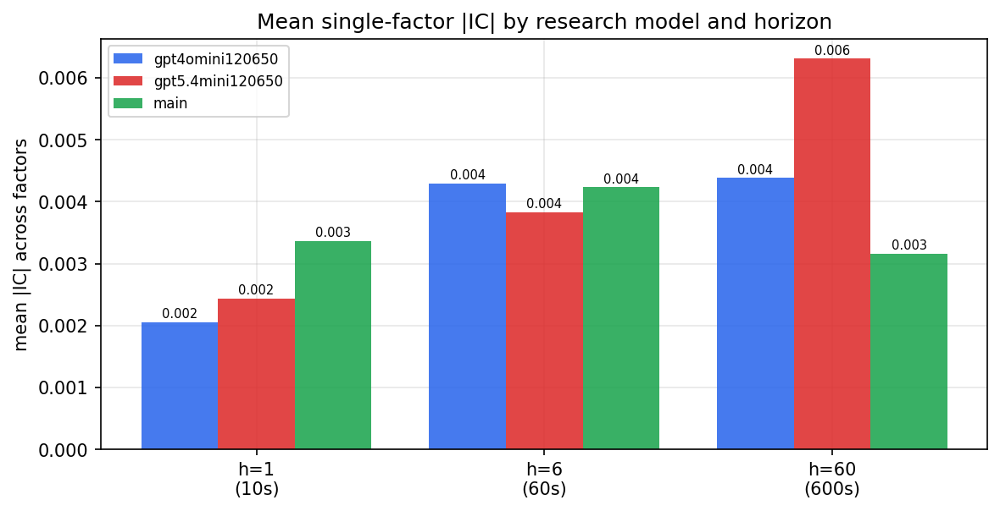

*Mean |IC| by research model and horizon*

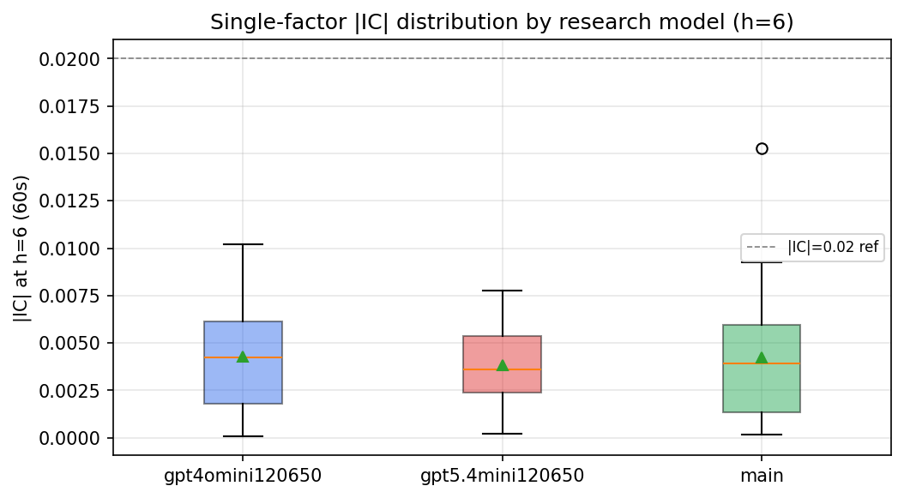

*Per-factor |IC| distribution by research model*

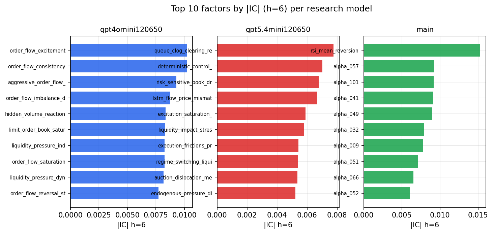

*Top factors by |IC| per research model*

## 2. Factor diversity & redundancy

Pairwise correlation of each zoo's *signals*. `eff_n_factors` is the effective number of independent factors (participation ratio of the correlation eigenvalues); `eff_ratio` and `redundancy` summarise how much unique information the zoo holds vs. how much is duplicated; `n_clusters` groups factors at |corr| ≥ 0.7.

| prerun | n_factors | eff_n_factors | eff_ratio | mean_abs_corr | n_clusters | redundancy |
| --- | --- | --- | --- | --- | --- | --- |
| gpt4omini120650 | 66 | 26.7551 | 0.4054 | 0.0546 | 52 | 0.5946 |
| gpt5.4mini120650 | 69 | 39.2353 | 0.5686 | 0.0187 | 60 | 0.4314 |
| main | 78 | 43.6142 | 0.5592 | 0.0277 | 72 | 0.4408 |

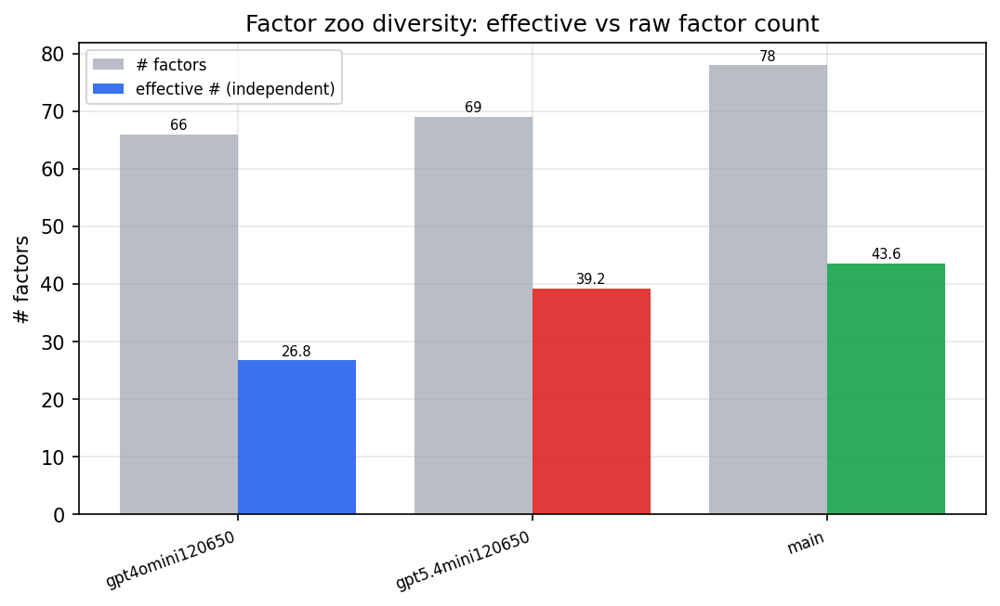

*Effective vs raw factor count per research model*

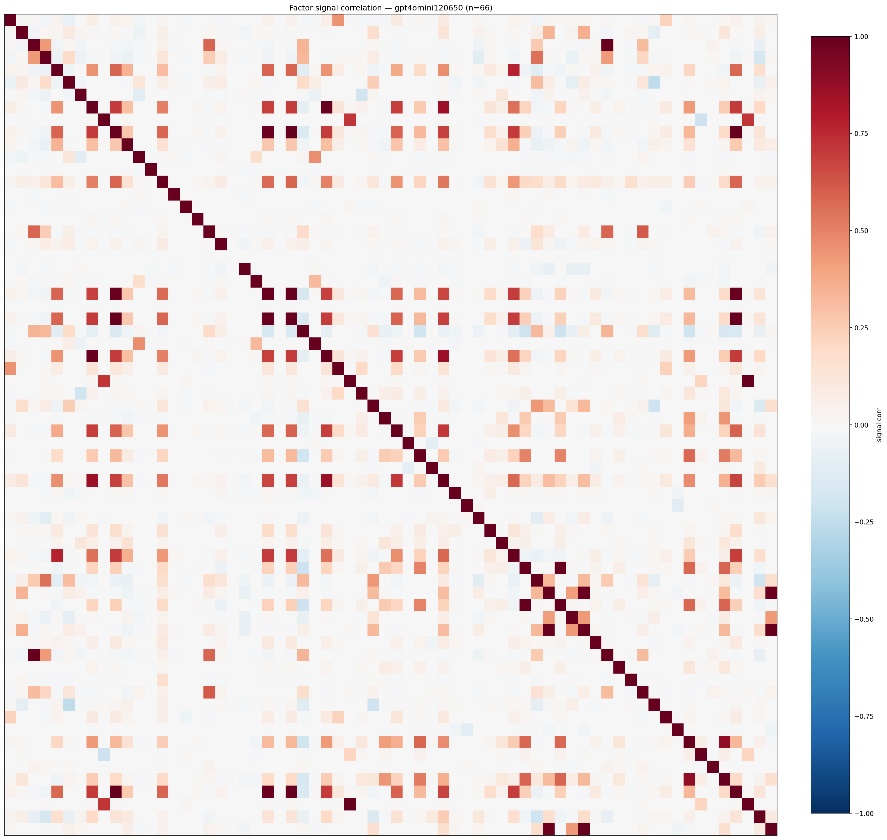

*Signal correlation matrix — gpt4omini120650*

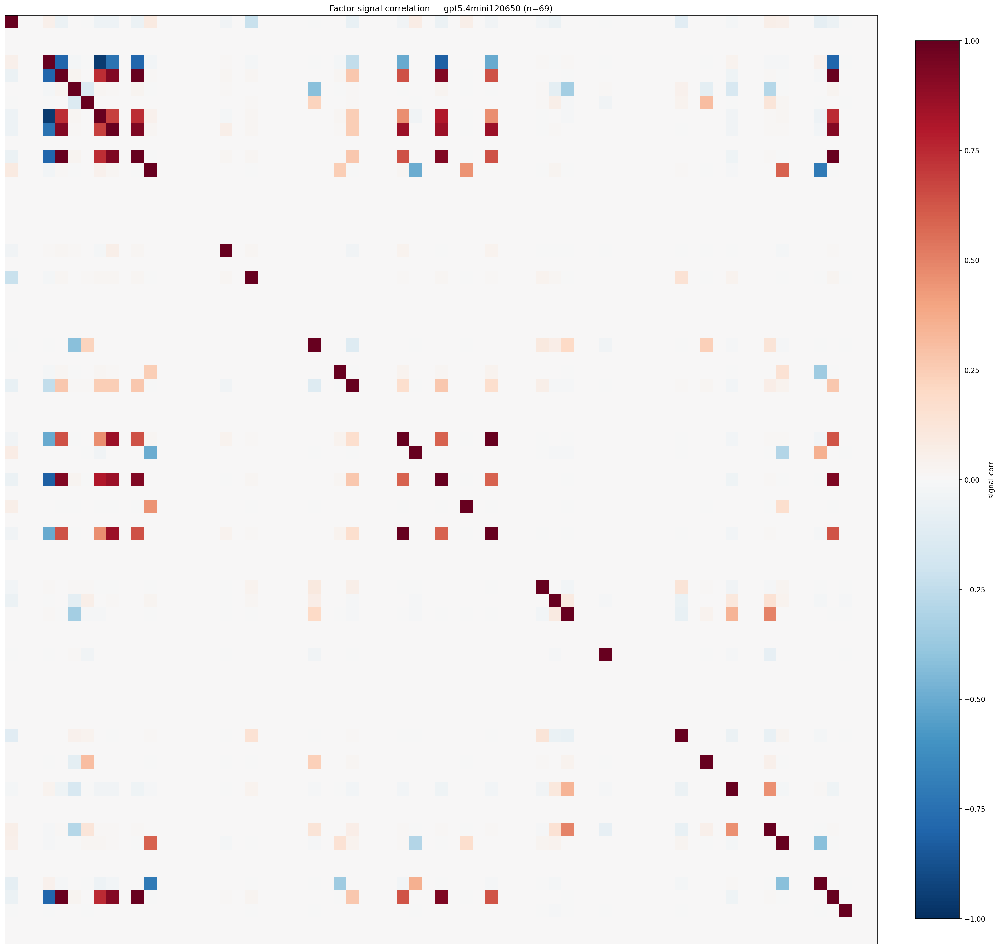

*Signal correlation matrix — gpt5.4mini120650*

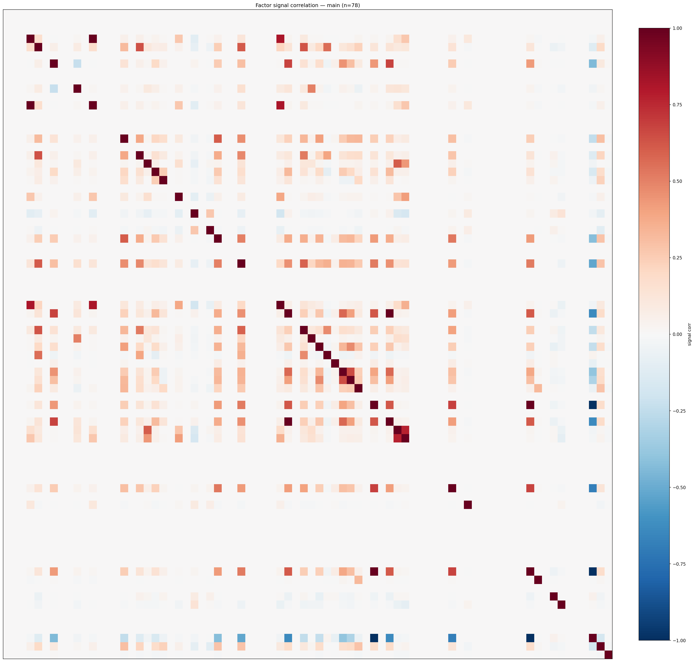

*Signal correlation matrix — main*

## 3. Deflation & model-based importance

`deflated_best_ic` haircuts each zoo's best |IC| for the number of factors tried (`ic_n_tested`) — a bigger zoo's best factor is more likely to be lucky. `lasso_n_nonzero` / `lasso_sparsity` show how many factors a sparse linear model actually keeps (model-view redundancy).

| prerun | best_ic | deflated_best_ic | deflated_best_t | ic_n_tested | ic_n_obs | lasso_n_nonzero | lasso_sparsity |
| --- | --- | --- | --- | --- | --- | --- | --- |
| gpt4omini120650 | 0.0102 | 0.0026 | 1.0066 | 64 | 145078 | 0 | 1.0 |
| gpt5.4mini120650 | 0.0078 | 0.0009 | 0.3343 | 31 | 145078 | 0 | 1.0 |
| main | 0.0153 | 0.0082 | 3.1166 | 38 | 145078 | 0 | 1.0 |

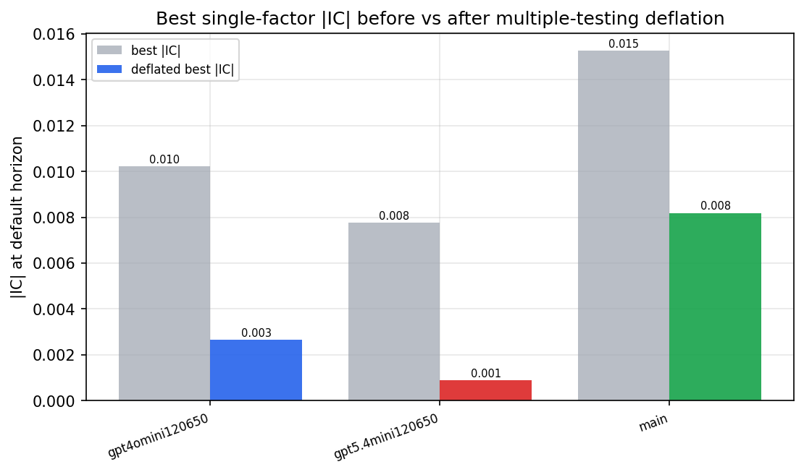

*Best |IC| before vs after multiple-testing deflation*

*Top factors by lasso importance per zoo*

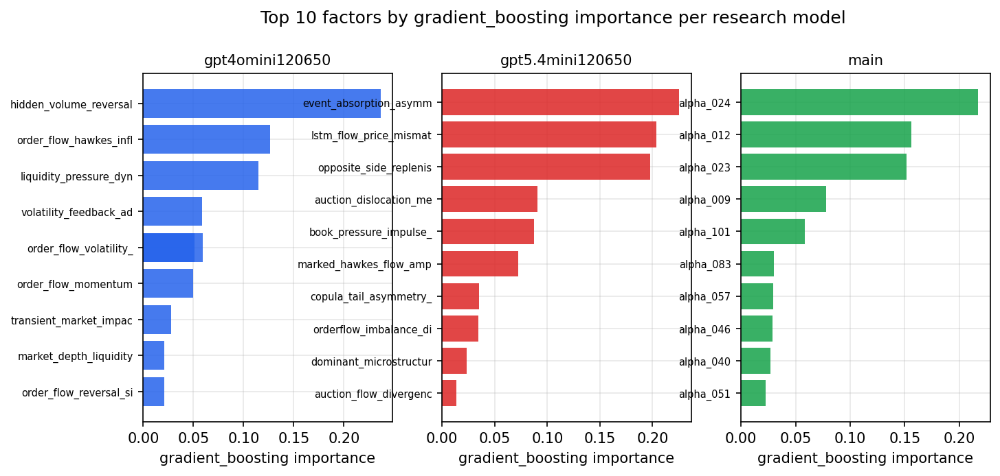

*Top factors by gradient_boosting importance per zoo*

## 4. ML-combined signal — per-underlying vectorised backtest

Each model combines a prerun's factors into ONE signal (fit `factors → forward return` on IS, predict per (bar, underlying)), then that combined signal is run through a simple vectorised backtest — `position(signal) × the underlying's own forward return` — on the held-out OOS tail (+ an equal-weight ensemble). No cross-sectional ranking.

> Config: position=**threshold** (t=1.0, z-score `expanding`), aggregation=**portfolio**, fit-standardise=**per_underlying**, horizon=6.

| prerun | model | n_factors_used | oos_ic | oos_sharpe | is_sharpe | oos_ann_return | oos_max_drawdown |
| --- | --- | --- | --- | --- | --- | --- | --- |
| gpt4omini120650 | linear_regression | 66 | -0.0013 | 0.0127 | 7.9664 | 0.0017 | -0.0398 |
| gpt4omini120650 | ridge | 66 | -0.0012 | -0.0178 | 8.0435 | -0.0023 | -0.0399 |
| gpt4omini120650 | lasso | 66 | nan | nan | nan | nan | nan |
| gpt4omini120650 | elastic_net | 66 | nan | nan | nan | nan | nan |
| gpt4omini120650 | random_forest | 66 | 0.0113 | -0.3686 | 10.446 | -0.0358 | -0.0235 |
| gpt4omini120650 | gradient_boosting | 66 | 0.0088 | 3.6687 | 12.8481 | 0.1797 | -0.0083 |
| gpt4omini120650 | xgboost | 66 | -0.0011 | -1.0708 | 17.0698 | -0.0446 | -0.0108 |
| gpt4omini120650 | lightgbm | 66 | -0.0074 | 1.4096 | 22.692 | 0.0986 | -0.0133 |
| gpt4omini120650 | ensemble | 66 | -0.0018 | -0.7908 | 16.6969 | -0.0982 | -0.0333 |
| gpt5.4mini120650 | linear_regression | 69 | -0.0024 | -1.7662 | 2.5433 | -0.0989 | -0.0178 |
| gpt5.4mini120650 | ridge | 69 | -0.0022 | -1.2983 | 2.7345 | -0.0805 | -0.0187 |
| gpt5.4mini120650 | lasso | 69 | nan | nan | nan | nan | nan |
| gpt5.4mini120650 | elastic_net | 69 | nan | nan | nan | nan | nan |
| gpt5.4mini120650 | random_forest | 69 | 0.0044 | 2.0595 | 8.2209 | 0.1304 | -0.0131 |
| gpt5.4mini120650 | gradient_boosting | 69 | -0.0025 | 1.7382 | 11.644 | 0.1089 | -0.0136 |
| gpt5.4mini120650 | xgboost | 69 | 0.0113 | 2.6166 | 14.0891 | 0.1751 | -0.0151 |
| gpt5.4mini120650 | lightgbm | 69 | 0.0015 | 2.7814 | 18.8503 | 0.17 | -0.0148 |
| gpt5.4mini120650 | ensemble | 69 | 0.0015 | 1.7706 | 12.742 | 0.1258 | -0.0177 |
| main | linear_regression | 78 | 0.0117 | -3.8235 | 7.567 | -0.0437 | -0.0063 |
| main | ridge | 78 | 0.0128 | -3.5988 | 6.3545 | -0.0375 | -0.0052 |
| main | lasso | 78 | nan | nan | nan | nan | nan |
| main | elastic_net | 78 | nan | nan | nan | nan | nan |
| main | random_forest | 78 | 0.007 | 0.9669 | 13.0155 | 0.0148 | -0.0049 |
| main | gradient_boosting | 78 | 0.006 | -5.0169 | 11.9522 | -0.0132 | -0.0012 |
| main | xgboost | 78 | -0.0006 | 0.0207 | 19.1941 | 0.0003 | -0.005 |
| main | lightgbm | 78 | -0.0014 | -0.8573 | 27.9766 | -0.0099 | -0.004 |
| main | ensemble | 78 | 0.01 | 0.8596 | 19.3899 | 0.0123 | -0.0044 |

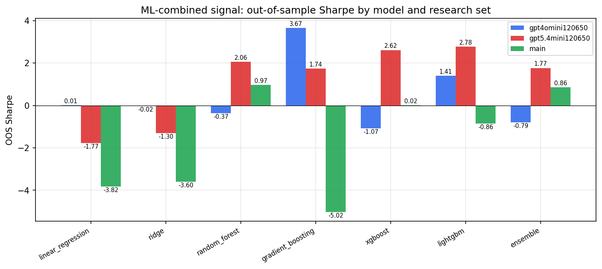

*ML-combined OOS Sharpe by model and research set*

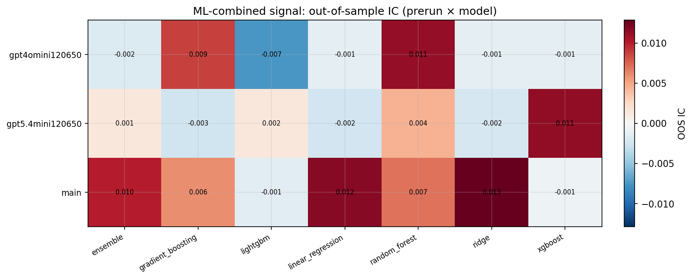

*ML-combined OOS IC (prerun × model)*

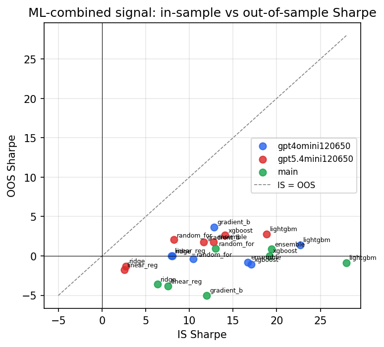

*IS vs OOS Sharpe (overfitting diagnostic)*

---
*Generated by `run_model_comparison.py`. Tables: `*.csv`; interactive: `comparison.ipynb`.*
