# Research-LLM factor comparison — `2025-06`

Comparing the **factor output of different research LLMs** on three axes (raw factor quality → factors as ML features → factors through the full agentic fund). The panel, IS/OOS split, horizon and model hyper-parameters are held identical across preruns — the *only* variable is the factor set.

## Preruns compared

| prerun | research_model | usable_factors | dropped_factors |
| --- | --- | --- | --- |
| gpt4omini120650 | gpt-4o-mini | 66 | 0 |
| gpt5.4mini120650 | gpt-5.4-mini | 69 | 0 |
| main | seed library | 78 | 10 |

> Dropped factors declare fields the current data doesn't have yet (e.g. fundamentals); they light up unchanged once that data is downloaded.

*Usable vs awaiting-data factors per research model*

## Key findings

- **Best ML-combined OOS Sharpe:** `main` with `gradient_boosting` (OOS Sharpe = 6.070).
- **Mean OOS Sharpe across models, by research set:** `main` = -0.737, `gpt4omini120650` = -7.035, `gpt5.4mini120650` = -7.153.
- **Highest mean single-factor |IC| (h=6):** `main` (mean |IC| = 0.0075).
- **Most diverse zoo (highest effective/raw factor ratio):** `main` (eff 44.7 of 78, ratio 0.57).
- **Best selection-deflated single-factor |IC|:** `main` (deflated |IC| = 0.0100 from 38 factors tried).

## 1. Single-factor IC (raw factor quality)

Per-underlying time-series Spearman rank-IC of every researched factor, recomputed on the shared panel at horizons h=1, h=6, h=60. The per-underlying IC correlates each factor's value vector with the underlying's own forward-return vector (pooled across underlyings); the cross-sectional IC ranks across underlyings per timestamp.

| prerun | n_factors | mean_abs_ic_1 | mean_abs_ic_6 | mean_abs_ic_60 | mean_abs_icir_6 | best_factor_h6 | best_abs_ic_h6 |
| --- | --- | --- | --- | --- | --- | --- | --- |
| gpt4omini120650 | 66 | 0.0031 | 0.0059 | 0.0061 | 0.4794 | order_flow_excitement | 0.015 |
| gpt5.4mini120650 | 69 | 0.0021 | 0.0048 | 0.0055 | 0.3679 | risk_sensitive_book_drift | 0.0144 |
| main | 78 | 0.0046 | 0.0075 | 0.0047 | 0.54 | rsi_mean_reversion | 0.0172 |

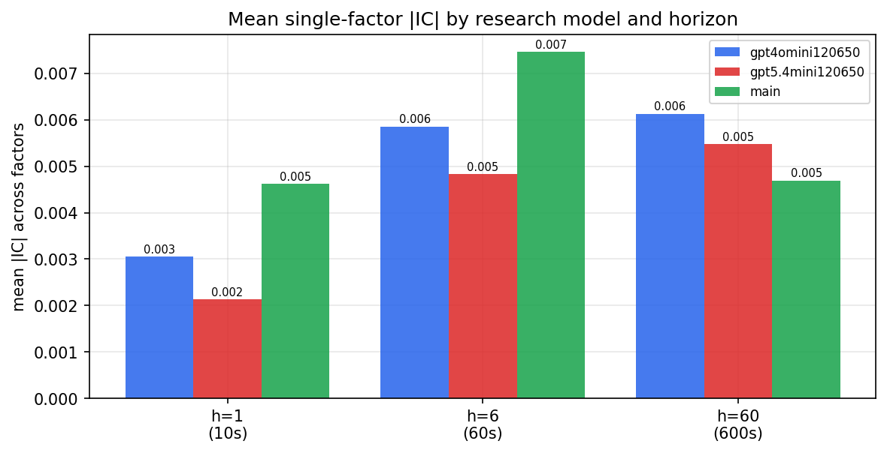

*Mean |IC| by research model and horizon*

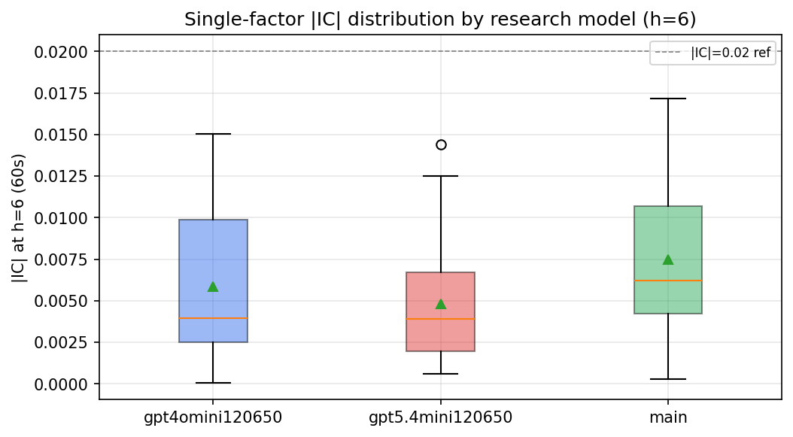

*Per-factor |IC| distribution by research model*

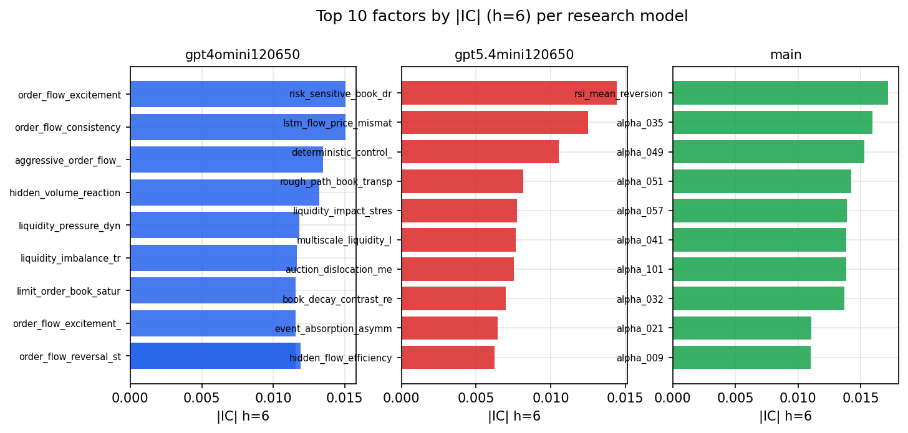

*Top factors by |IC| per research model*

## 2. Factor diversity & redundancy

Pairwise correlation of each zoo's *signals*. `eff_n_factors` is the effective number of independent factors (participation ratio of the correlation eigenvalues); `eff_ratio` and `redundancy` summarise how much unique information the zoo holds vs. how much is duplicated; `n_clusters` groups factors at |corr| ≥ 0.7.

| prerun | n_factors | eff_n_factors | eff_ratio | mean_abs_corr | n_clusters | redundancy |
| --- | --- | --- | --- | --- | --- | --- |
| gpt4omini120650 | 66 | 26.4487 | 0.4007 | 0.0555 | 51 | 0.5993 |
| gpt5.4mini120650 | 69 | 39.5029 | 0.5725 | 0.0183 | 60 | 0.4275 |
| main | 78 | 44.6901 | 0.5729 | 0.0264 | 72 | 0.427 |

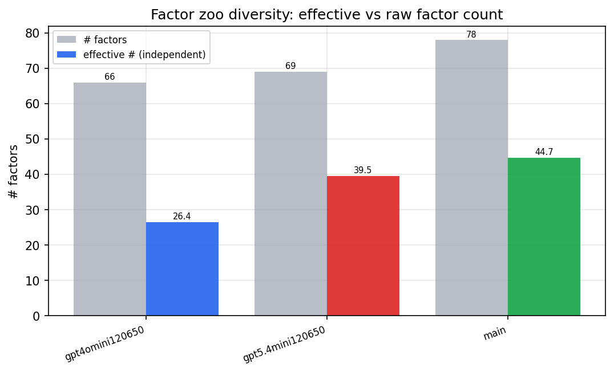

*Effective vs raw factor count per research model*

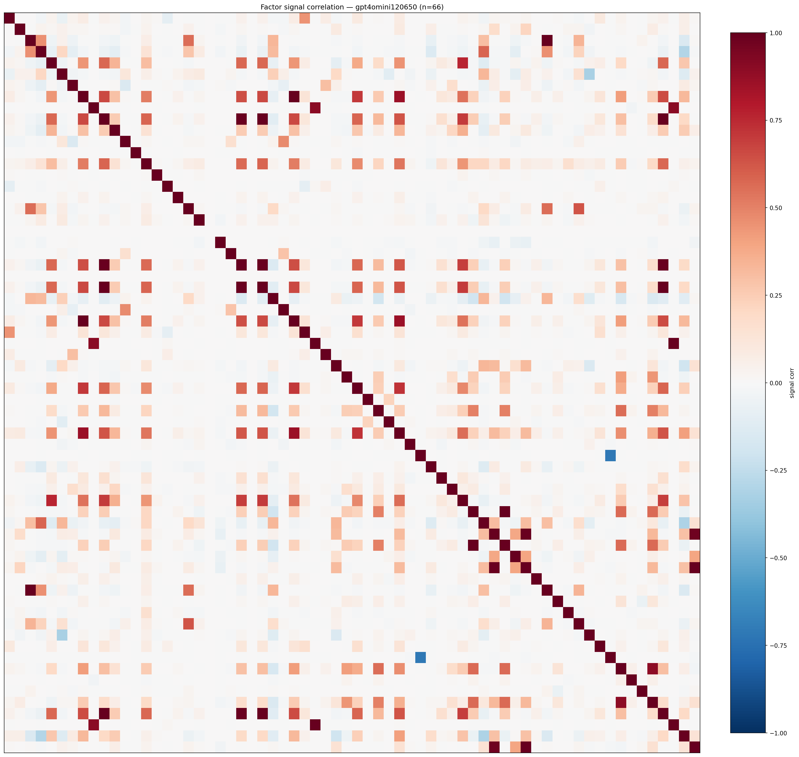

*Signal correlation matrix — gpt4omini120650*

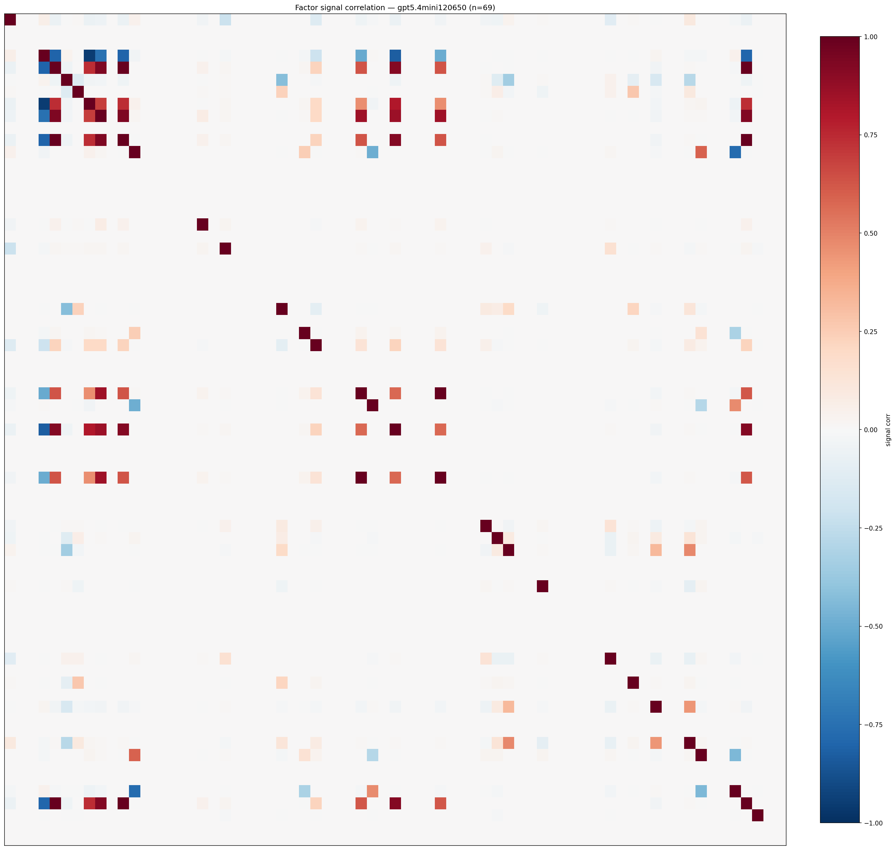

*Signal correlation matrix — gpt5.4mini120650*

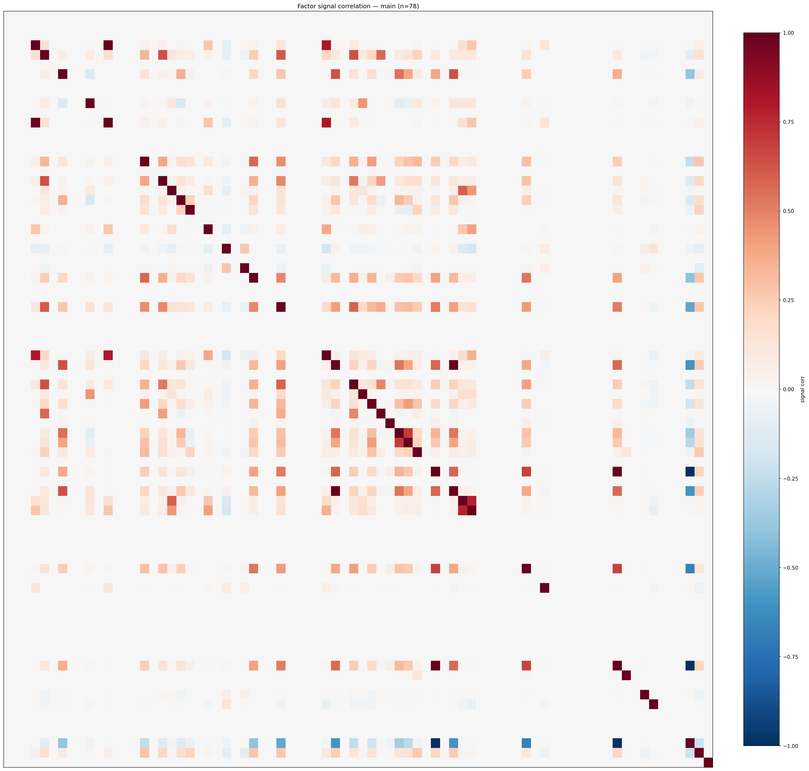

*Signal correlation matrix — main*

## 3. Deflation & model-based importance

`deflated_best_ic` haircuts each zoo's best |IC| for the number of factors tried (`ic_n_tested`) — a bigger zoo's best factor is more likely to be lucky. `lasso_n_nonzero` / `lasso_sparsity` show how many factors a sparse linear model actually keeps (model-view redundancy).

| prerun | best_ic | deflated_best_ic | deflated_best_t | ic_n_tested | ic_n_obs | lasso_n_nonzero | lasso_sparsity |
| --- | --- | --- | --- | --- | --- | --- | --- |
| gpt4omini120650 | 0.015 | 0.0074 | 2.8008 | 64 | 142738 | 0 | 1.0 |
| gpt5.4mini120650 | 0.0144 | 0.0075 | 2.826 | 31 | 142738 | 0 | 1.0 |
| main | 0.0172 | 0.01 | 3.7883 | 38 | 142738 | 0 | 1.0 |

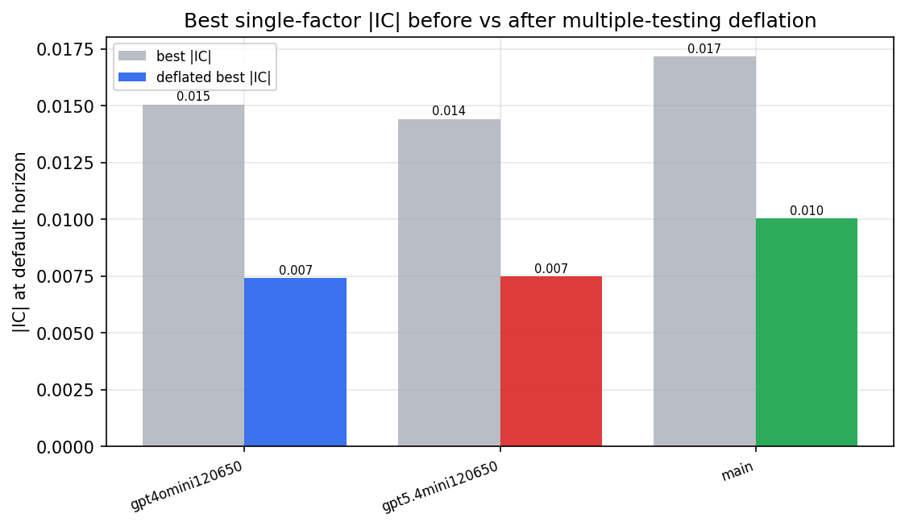

*Best |IC| before vs after multiple-testing deflation*

*Top factors by lasso importance per zoo*

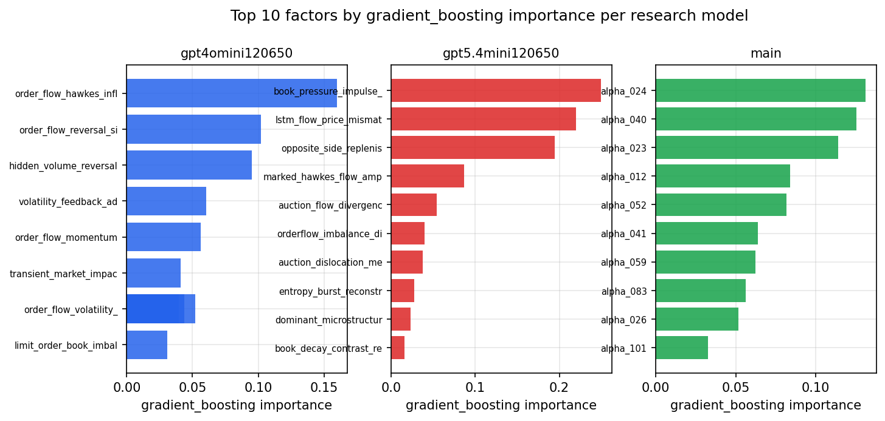

*Top factors by gradient_boosting importance per zoo*

## 4. ML-combined signal — per-underlying vectorised backtest

Each model combines a prerun's factors into ONE signal (fit `factors → forward return` on IS, predict per (bar, underlying)), then that combined signal is run through a simple vectorised backtest — `position(signal) × the underlying's own forward return` — on the held-out OOS tail (+ an equal-weight ensemble). No cross-sectional ranking.

> Config: position=**threshold** (t=1.0, z-score `expanding`), aggregation=**portfolio**, fit-standardise=**per_underlying**, horizon=6.

| prerun | model | n_factors_used | oos_ic | oos_sharpe | is_sharpe | oos_ann_return | oos_max_drawdown |
| --- | --- | --- | --- | --- | --- | --- | --- |
| gpt4omini120650 | linear_regression | 66 | 0.0015 | -6.6438 | 6.1743 | -0.2891 | -0.0234 |
| gpt4omini120650 | ridge | 66 | 0.0014 | -7.4602 | 6.5724 | -0.333 | -0.0268 |
| gpt4omini120650 | lasso | 66 | nan | nan | nan | nan | nan |
| gpt4omini120650 | elastic_net | 66 | nan | nan | nan | nan | nan |
| gpt4omini120650 | random_forest | 66 | -0.0087 | -7.1184 | 10.1285 | -0.4136 | -0.0365 |
| gpt4omini120650 | gradient_boosting | 66 | -0.006 | -5.4179 | 11.7394 | -0.1891 | -0.0157 |
| gpt4omini120650 | xgboost | 66 | -0.0152 | -5.8966 | 15.9653 | -0.2195 | -0.0192 |
| gpt4omini120650 | lightgbm | 66 | -0.0012 | -7.9534 | 20.5111 | -0.232 | -0.0189 |
| gpt4omini120650 | ensemble | 66 | -0.0004 | -8.7516 | 16.8483 | -0.4315 | -0.0355 |
| gpt5.4mini120650 | linear_regression | 69 | -0.0039 | -2.7659 | 2.1932 | -0.0905 | -0.011 |
| gpt5.4mini120650 | ridge | 69 | -0.0066 | -4.0278 | 2.5792 | -0.13 | -0.013 |
| gpt5.4mini120650 | lasso | 69 | nan | nan | nan | nan | nan |
| gpt5.4mini120650 | elastic_net | 69 | nan | nan | nan | nan | nan |
| gpt5.4mini120650 | random_forest | 69 | 0.0038 | -8.2763 | 6.8692 | -0.3539 | -0.0295 |
| gpt5.4mini120650 | gradient_boosting | 69 | -0.0176 | -8.3101 | 10.7416 | -0.1924 | -0.0158 |
| gpt5.4mini120650 | xgboost | 69 | 0.0088 | -7.7378 | 11.689 | -0.2337 | -0.0206 |
| gpt5.4mini120650 | lightgbm | 69 | 0.0005 | -8.7956 | 17.8401 | -0.2925 | -0.0242 |
| gpt5.4mini120650 | ensemble | 69 | -0.0084 | -10.1586 | 12.8892 | -0.3043 | -0.0255 |
| main | linear_regression | 78 | 0.0001 | 2.9901 | 8.8447 | 0.0659 | -0.0025 |
| main | ridge | 78 | 0.005 | 2.2084 | 7.944 | 0.0586 | -0.0039 |
| main | lasso | 78 | nan | nan | nan | nan | nan |
| main | elastic_net | 78 | nan | nan | nan | nan | nan |
| main | random_forest | 78 | 0.0082 | -2.3025 | 14.2711 | -0.0234 | -0.005 |
| main | gradient_boosting | 78 | -0.0136 | 6.0698 | 13.3419 | 0.0084 | -0.0003 |
| main | xgboost | 78 | 0.0122 | -4.987 | 17.036 | -0.0458 | -0.0059 |
| main | lightgbm | 78 | 0.0112 | -5.6709 | 23.6818 | -0.0333 | -0.0031 |
| main | ensemble | 78 | 0.0003 | -3.4666 | 19.6338 | -0.0305 | -0.0043 |

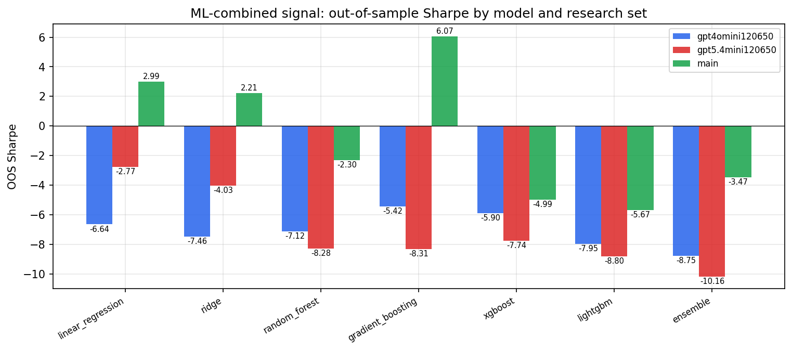

*ML-combined OOS Sharpe by model and research set*

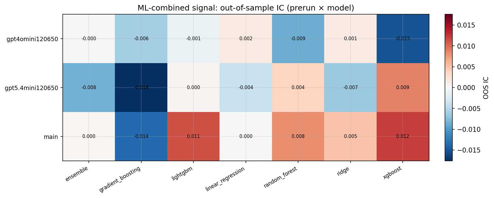

*ML-combined OOS IC (prerun × model)*

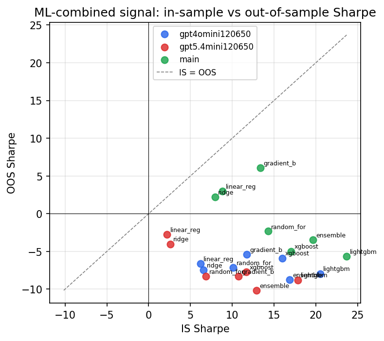

*IS vs OOS Sharpe (overfitting diagnostic)*

---
*Generated by `run_model_comparison.py`. Tables: `*.csv`; interactive: `comparison.ipynb`.*
