# Research-LLM factor comparison — `2025-07`

Comparing the **factor output of different research LLMs** on three axes (raw factor quality → factors as ML features → factors through the full agentic fund). The panel, IS/OOS split, horizon and model hyper-parameters are held identical across preruns — the *only* variable is the factor set.

## Preruns compared

| prerun | research_model | usable_factors | dropped_factors |
| --- | --- | --- | --- |
| gpt4omini120650 | gpt-4o-mini | 66 | 0 |
| gpt5.4mini120650 | gpt-5.4-mini | 69 | 0 |
| main | seed library | 78 | 10 |

> Dropped factors declare fields the current data doesn't have yet (e.g. fundamentals); they light up unchanged once that data is downloaded.

*Usable vs awaiting-data factors per research model*

## Key findings

- **Best ML-combined OOS Sharpe:** `gpt4omini120650` with `gradient_boosting` (OOS Sharpe = 5.140).
- **Mean OOS Sharpe across models, by research set:** `gpt4omini120650` = 2.461, `gpt5.4mini120650` = 0.850, `main` = 0.478.
- **Highest mean single-factor |IC| (h=6):** `main` (mean |IC| = 0.0097).
- **Most diverse zoo (highest effective/raw factor ratio):** `gpt5.4mini120650` (eff 39.8 of 69, ratio 0.58).
- **Best selection-deflated single-factor |IC|:** `main` (deflated |IC| = 0.0188 from 38 factors tried).

## 1. Single-factor IC (raw factor quality)

Per-underlying time-series Spearman rank-IC of every researched factor, recomputed on the shared panel at horizons h=1, h=6, h=60. The per-underlying IC correlates each factor's value vector with the underlying's own forward-return vector (pooled across underlyings); the cross-sectional IC ranks across underlyings per timestamp.

| prerun | n_factors | mean_abs_ic_1 | mean_abs_ic_6 | mean_abs_ic_60 | mean_abs_icir_6 | best_factor_h6 | best_abs_ic_h6 |
| --- | --- | --- | --- | --- | --- | --- | --- |
| gpt4omini120650 | 66 | 0.0055 | 0.0078 | 0.0083 | 0.5024 | hawkes_process_order_flow_indicator | 0.0189 |
| gpt5.4mini120650 | 69 | 0.0034 | 0.006 | 0.007 | 0.4088 | lstm_flow_price_mismatch | 0.0183 |
| main | 78 | 0.0078 | 0.0097 | 0.0062 | 0.6752 | alpha_084 | 0.0259 |

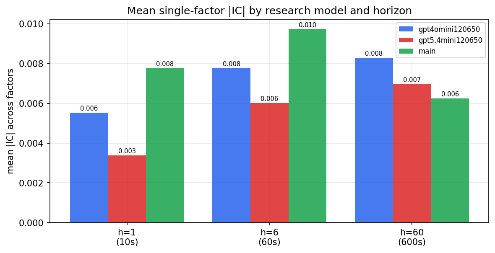

*Mean |IC| by research model and horizon*

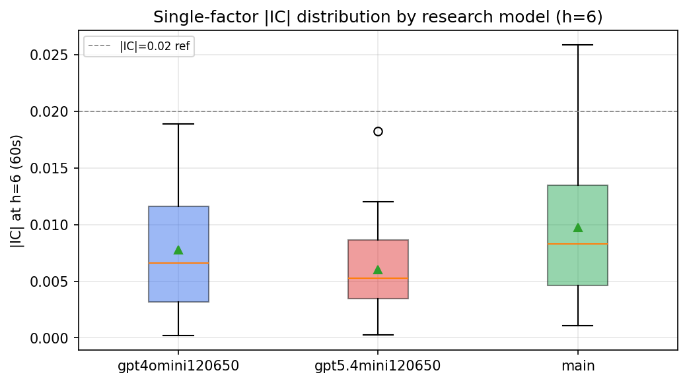

*Per-factor |IC| distribution by research model*

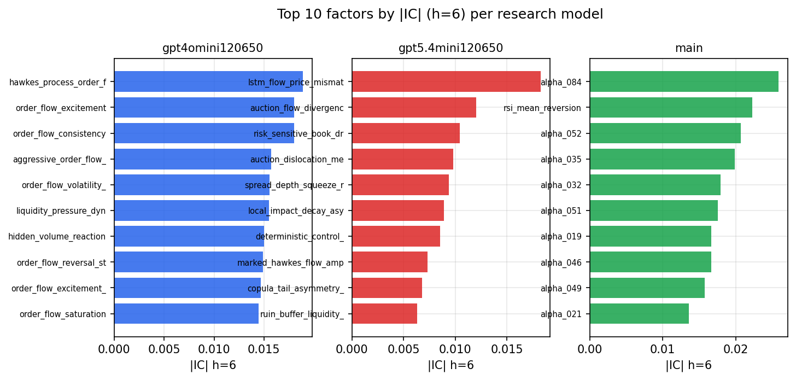

*Top factors by |IC| per research model*

## 2. Factor diversity & redundancy

Pairwise correlation of each zoo's *signals*. `eff_n_factors` is the effective number of independent factors (participation ratio of the correlation eigenvalues); `eff_ratio` and `redundancy` summarise how much unique information the zoo holds vs. how much is duplicated; `n_clusters` groups factors at |corr| ≥ 0.7.

| prerun | n_factors | eff_n_factors | eff_ratio | mean_abs_corr | n_clusters | redundancy |
| --- | --- | --- | --- | --- | --- | --- |
| gpt4omini120650 | 66 | 25.3772 | 0.3845 | 0.0573 | 51 | 0.6155 |
| gpt5.4mini120650 | 69 | 39.8415 | 0.5774 | 0.0196 | 60 | 0.4226 |
| main | 78 | 43.8435 | 0.5621 | 0.0269 | 72 | 0.4379 |

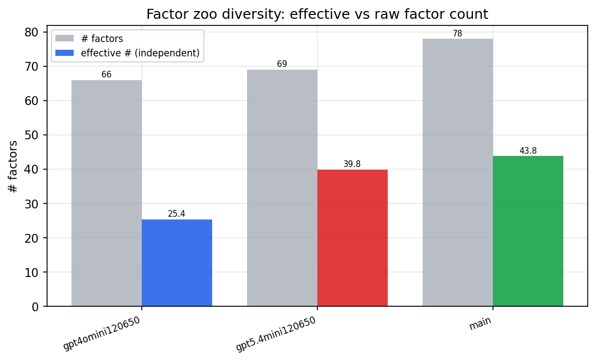

*Effective vs raw factor count per research model*

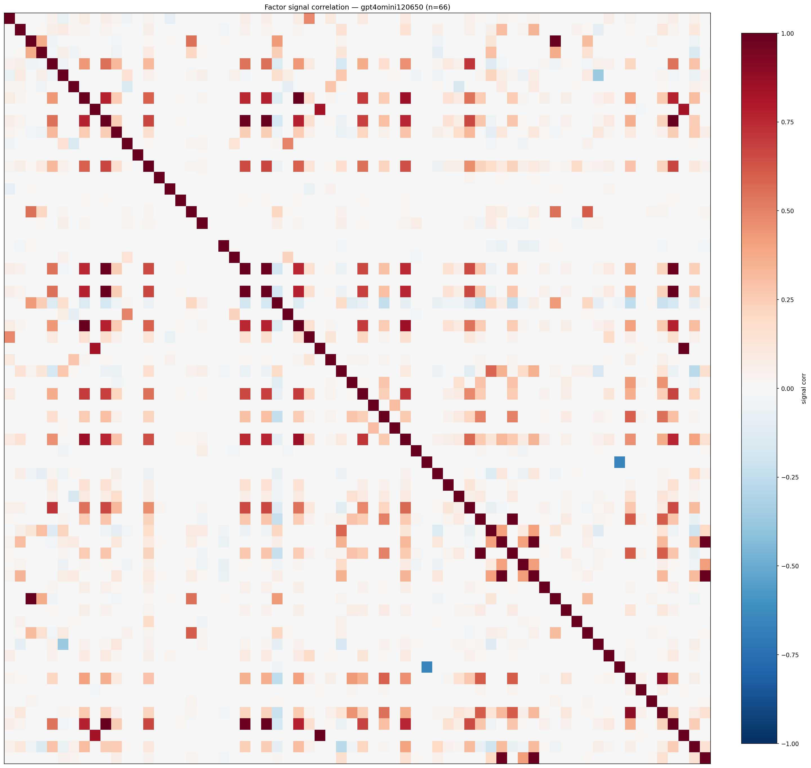

*Signal correlation matrix — gpt4omini120650*

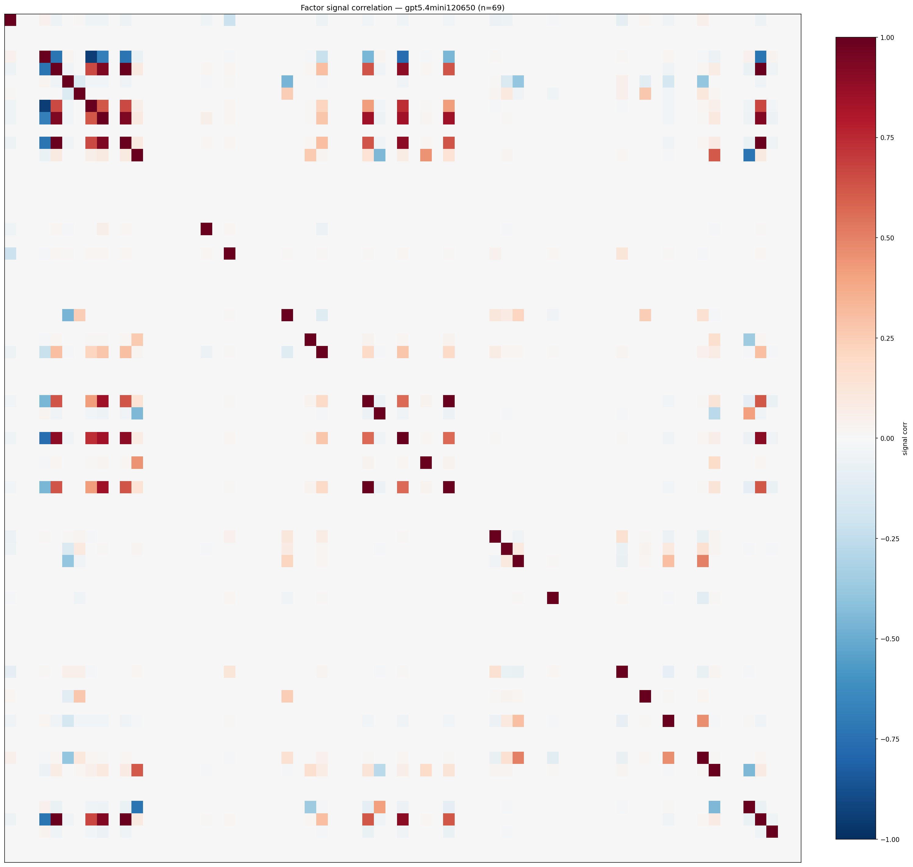

*Signal correlation matrix — gpt5.4mini120650*

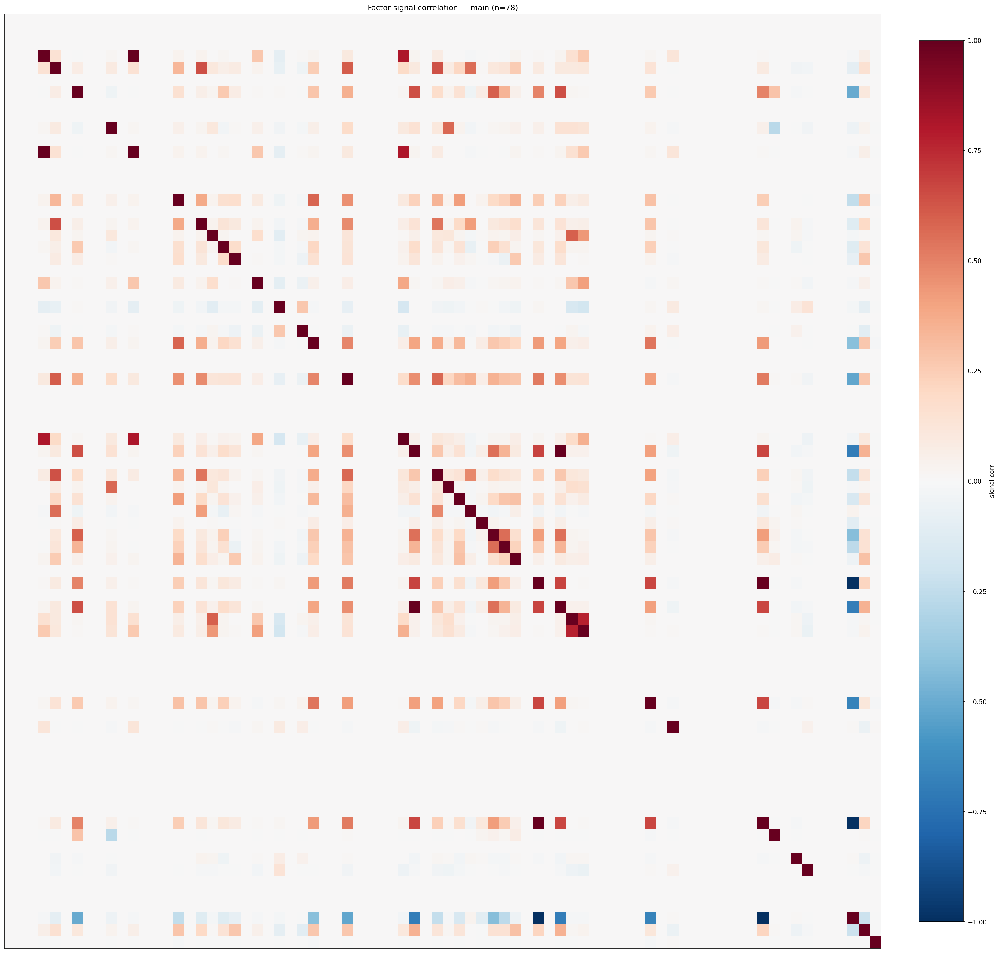

*Signal correlation matrix — main*

## 3. Deflation & model-based importance

`deflated_best_ic` haircuts each zoo's best |IC| for the number of factors tried (`ic_n_tested`) — a bigger zoo's best factor is more likely to be lucky. `lasso_n_nonzero` / `lasso_sparsity` show how many factors a sparse linear model actually keeps (model-view redundancy).

| prerun | best_ic | deflated_best_ic | deflated_best_t | ic_n_tested | ic_n_obs | lasso_n_nonzero | lasso_sparsity |
| --- | --- | --- | --- | --- | --- | --- | --- |
| gpt4omini120650 | 0.0189 | 0.0113 | 4.2857 | 64 | 143999 | 0 | 1.0 |
| gpt5.4mini120650 | 0.0183 | 0.0116 | 4.4073 | 24 | 143999 | 0 | 1.0 |
| main | 0.0259 | 0.0188 | 7.1166 | 38 | 143999 | 3 | 0.9615 |

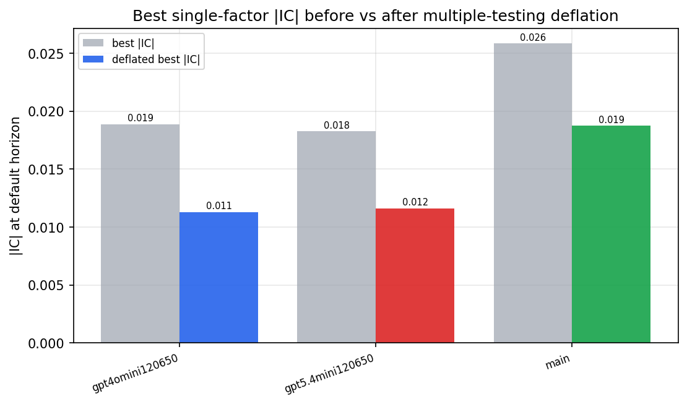

*Best |IC| before vs after multiple-testing deflation*

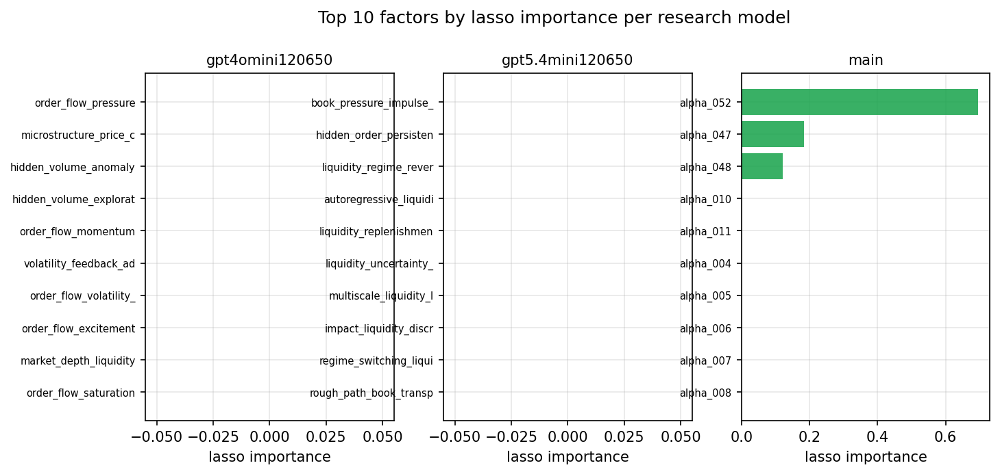

*Top factors by lasso importance per zoo*

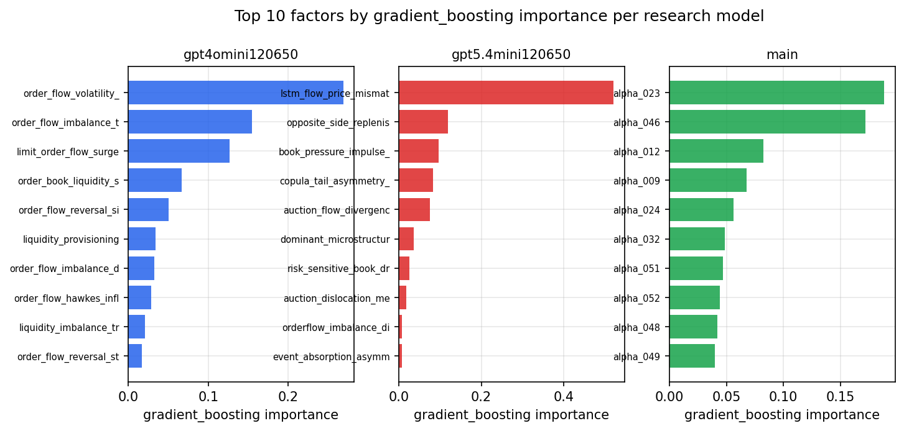

*Top factors by gradient_boosting importance per zoo*

## 4. ML-combined signal — per-underlying vectorised backtest

Each model combines a prerun's factors into ONE signal (fit `factors → forward return` on IS, predict per (bar, underlying)), then that combined signal is run through a simple vectorised backtest — `position(signal) × the underlying's own forward return` — on the held-out OOS tail (+ an equal-weight ensemble). No cross-sectional ranking.

> Config: position=**threshold** (t=1.0, z-score `expanding`), aggregation=**portfolio**, fit-standardise=**per_underlying**, horizon=6.

| prerun | model | n_factors_used | oos_ic | oos_sharpe | is_sharpe | oos_ann_return | oos_max_drawdown |
| --- | --- | --- | --- | --- | --- | --- | --- |
| gpt4omini120650 | linear_regression | 66 | -0.0003 | -1.3026 | 4.9031 | -0.0496 | -0.0114 |
| gpt4omini120650 | ridge | 66 | -0.0028 | -0.3932 | 4.6456 | -0.0157 | -0.01 |
| gpt4omini120650 | lasso | 66 | nan | nan | nan | nan | nan |
| gpt4omini120650 | elastic_net | 66 | nan | nan | nan | nan | nan |
| gpt4omini120650 | random_forest | 66 | -0.0013 | 2.4731 | 8.4703 | 0.0865 | -0.0057 |
| gpt4omini120650 | gradient_boosting | 66 | -0.0043 | 5.1396 | 7.5945 | 0.0919 | -0.0023 |
| gpt4omini120650 | xgboost | 66 | -0.0036 | 3.5533 | 11.3396 | 0.1102 | -0.0031 |
| gpt4omini120650 | lightgbm | 66 | -0.0018 | 4.3639 | 14.1621 | 0.1655 | -0.0054 |
| gpt4omini120650 | ensemble | 66 | -0.0033 | 3.3897 | 11.6584 | 0.1303 | -0.0052 |
| gpt5.4mini120650 | linear_regression | 69 | -0.0002 | 3.38 | 1.9932 | 0.0599 | -0.0019 |
| gpt5.4mini120650 | ridge | 69 | -0.0004 | 1.2061 | 1.637 | 0.0179 | -0.0022 |
| gpt5.4mini120650 | lasso | 69 | nan | nan | nan | nan | nan |
| gpt5.4mini120650 | elastic_net | 69 | nan | nan | nan | nan | nan |
| gpt5.4mini120650 | random_forest | 69 | -0.0043 | 4.7307 | 7.2055 | 0.1724 | -0.0056 |
| gpt5.4mini120650 | gradient_boosting | 69 | 0.0041 | 1.5597 | 8.4294 | 0.0299 | -0.004 |
| gpt5.4mini120650 | xgboost | 69 | -0.0028 | -2.5372 | 11.3655 | -0.0615 | -0.0102 |
| gpt5.4mini120650 | lightgbm | 69 | -0.0005 | -2.4255 | 13.7473 | -0.0703 | -0.0095 |
| gpt5.4mini120650 | ensemble | 69 | 0.0013 | 0.0347 | 9.1327 | 0.0009 | -0.0054 |
| main | linear_regression | 78 | 0.002 | 0.9557 | 8.3997 | 0.0288 | -0.0076 |
| main | ridge | 78 | 0.0024 | 1.5609 | 8.5892 | 0.0464 | -0.0076 |
| main | lasso | 78 | 0.0262 | 0.1767 | 2.6586 | 0.0042 | -0.0052 |
| main | elastic_net | 78 | 0.0157 | 2.8076 | 5.6283 | 0.0783 | -0.0052 |
| main | random_forest | 78 | 0.005 | 1.3672 | 9.9066 | 0.0223 | -0.0043 |
| main | gradient_boosting | 78 | -0.0023 | -4.4256 | 12.861 | -0.0635 | -0.0082 |
| main | xgboost | 78 | 0.003 | 0.4157 | 12.6866 | 0.0054 | -0.0043 |
| main | lightgbm | 78 | -0.0038 | -0.2635 | 14.8767 | -0.0035 | -0.0035 |
| main | ensemble | 78 | 0.0075 | 1.7097 | 12.2594 | 0.0377 | -0.0046 |

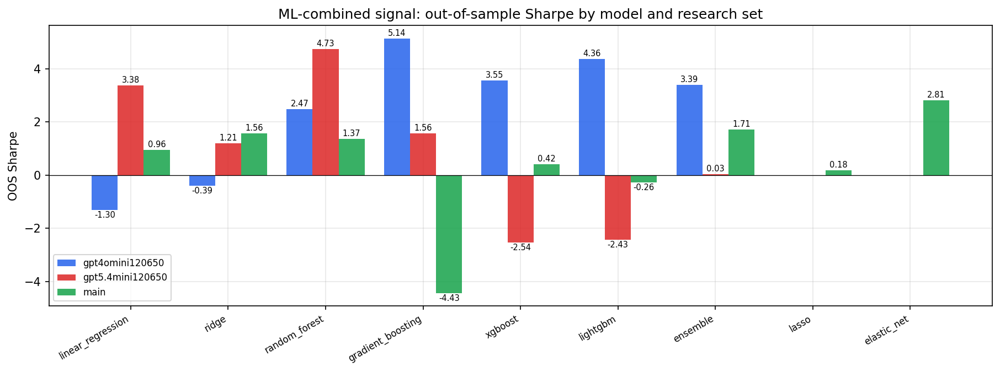

*ML-combined OOS Sharpe by model and research set*

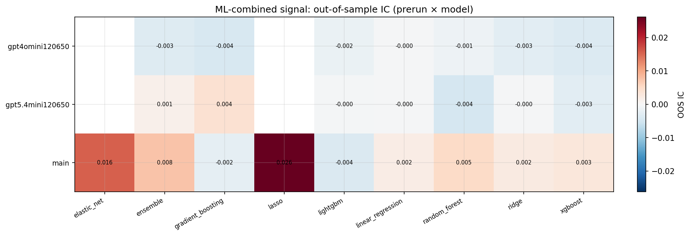

*ML-combined OOS IC (prerun × model)*

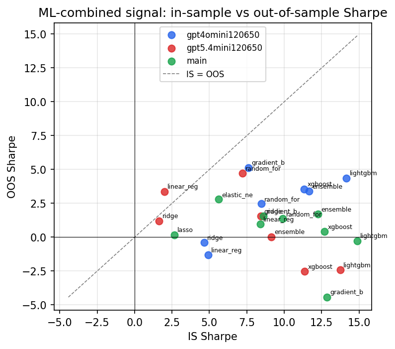

*IS vs OOS Sharpe (overfitting diagnostic)*

---
*Generated by `run_model_comparison.py`. Tables: `*.csv`; interactive: `comparison.ipynb`.*
