# Research-LLM factor comparison — `2025-08`

Comparing the **factor output of different research LLMs** on three axes (raw factor quality → factors as ML features → factors through the full agentic fund). The panel, IS/OOS split, horizon and model hyper-parameters are held identical across preruns — the *only* variable is the factor set.

## Preruns compared

| prerun | research_model | usable_factors | dropped_factors |
| --- | --- | --- | --- |
| gpt4omini120650 | gpt-4o-mini | 66 | 0 |
| gpt5.4mini120650 | gpt-5.4-mini | 69 | 0 |
| main | seed library | 78 | 10 |

> Dropped factors declare fields the current data doesn't have yet (e.g. fundamentals); they light up unchanged once that data is downloaded.

*Usable vs awaiting-data factors per research model*

## Key findings

- **Best ML-combined OOS Sharpe:** `gpt4omini120650` with `lightgbm` (OOS Sharpe = 7.508).
- **Mean OOS Sharpe across models, by research set:** `gpt4omini120650` = 3.200, `gpt5.4mini120650` = 2.737, `main` = 1.232.
- **Highest mean single-factor |IC| (h=6):** `main` (mean |IC| = 0.0105).
- **Most diverse zoo (highest effective/raw factor ratio):** `gpt5.4mini120650` (eff 41.2 of 69, ratio 0.60).
- **Best selection-deflated single-factor |IC|:** `main` (deflated |IC| = 0.0204 from 38 factors tried).

## 1. Single-factor IC (raw factor quality)

Per-underlying time-series Spearman rank-IC of every researched factor, recomputed on the shared panel at horizons h=1, h=6, h=60. The per-underlying IC correlates each factor's value vector with the underlying's own forward-return vector (pooled across underlyings); the cross-sectional IC ranks across underlyings per timestamp.

| prerun | n_factors | mean_abs_ic_1 | mean_abs_ic_6 | mean_abs_ic_60 | mean_abs_icir_6 | best_factor_h6 | best_abs_ic_h6 |
| --- | --- | --- | --- | --- | --- | --- | --- |
| gpt4omini120650 | 66 | 0.0067 | 0.0095 | 0.0079 | 0.5575 | order_flow_excitement | 0.0225 |
| gpt5.4mini120650 | 69 | 0.0027 | 0.0061 | 0.0078 | 0.4938 | lstm_flow_price_mismatch | 0.0229 |
| main | 78 | 0.009 | 0.0105 | 0.0056 | 0.742 | alpha_084 | 0.0274 |

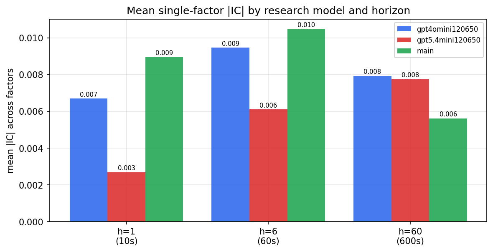

*Mean |IC| by research model and horizon*

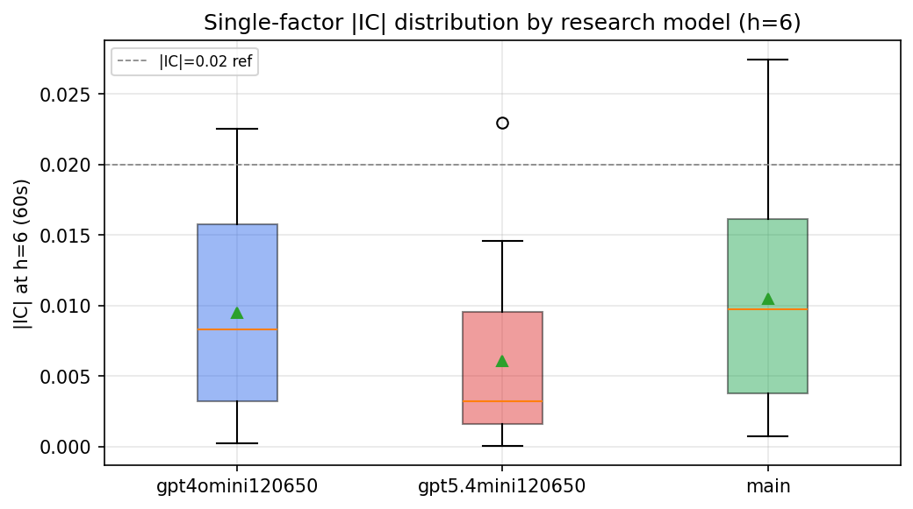

*Per-factor |IC| distribution by research model*

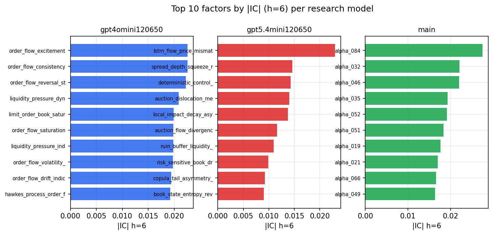

*Top factors by |IC| per research model*

## 2. Factor diversity & redundancy

Pairwise correlation of each zoo's *signals*. `eff_n_factors` is the effective number of independent factors (participation ratio of the correlation eigenvalues); `eff_ratio` and `redundancy` summarise how much unique information the zoo holds vs. how much is duplicated; `n_clusters` groups factors at |corr| ≥ 0.7.

| prerun | n_factors | eff_n_factors | eff_ratio | mean_abs_corr | n_clusters | redundancy |
| --- | --- | --- | --- | --- | --- | --- |
| gpt4omini120650 | 66 | 25.4778 | 0.386 | 0.0575 | 51 | 0.614 |
| gpt5.4mini120650 | 69 | 41.2196 | 0.5974 | 0.0177 | 60 | 0.4026 |
| main | 78 | 43.4734 | 0.5574 | 0.0275 | 72 | 0.4426 |

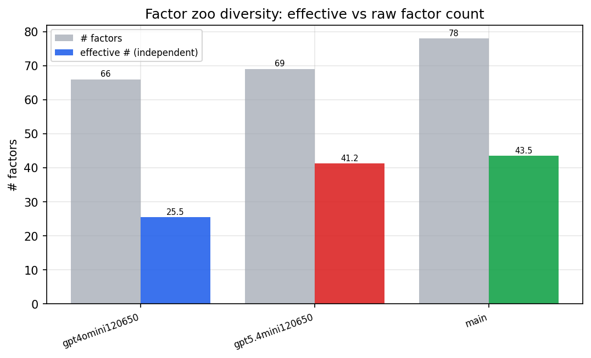

*Effective vs raw factor count per research model*

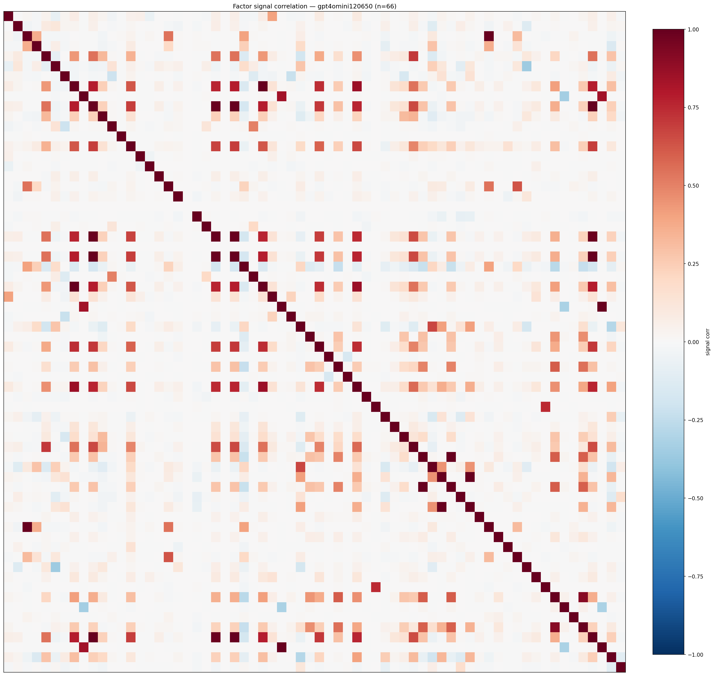

*Signal correlation matrix — gpt4omini120650*

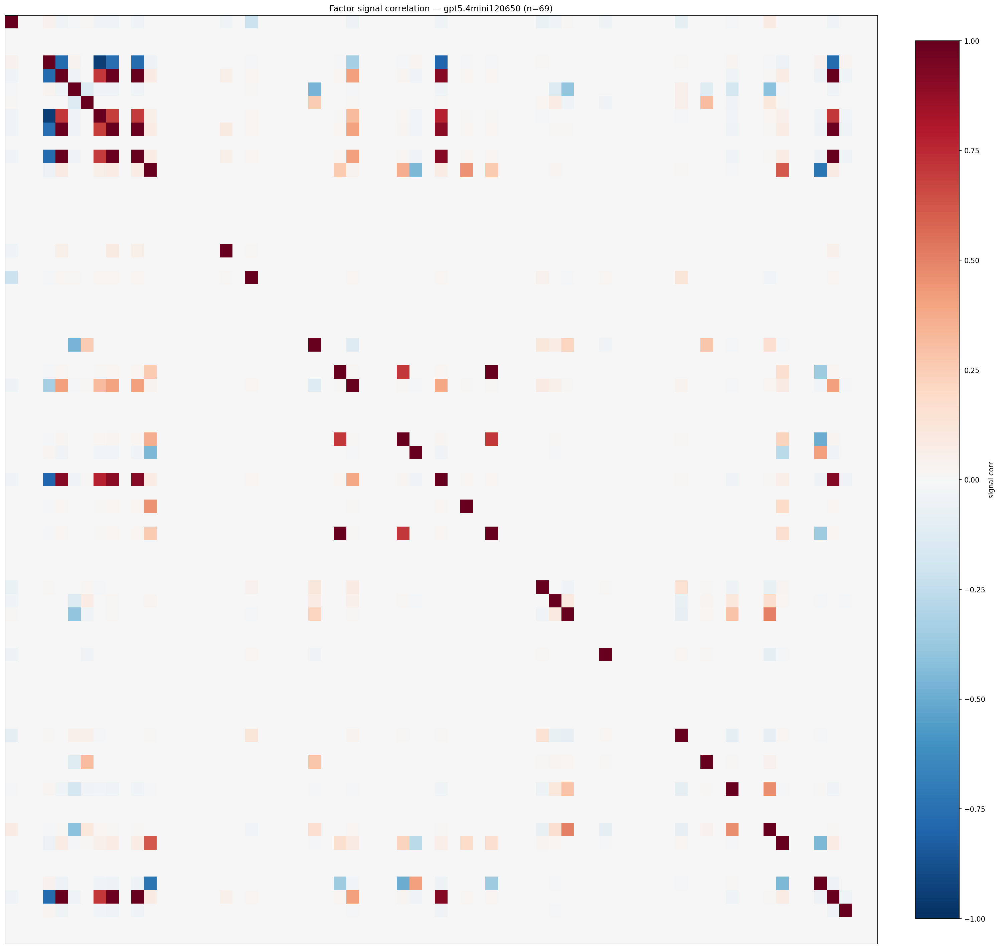

*Signal correlation matrix — gpt5.4mini120650*

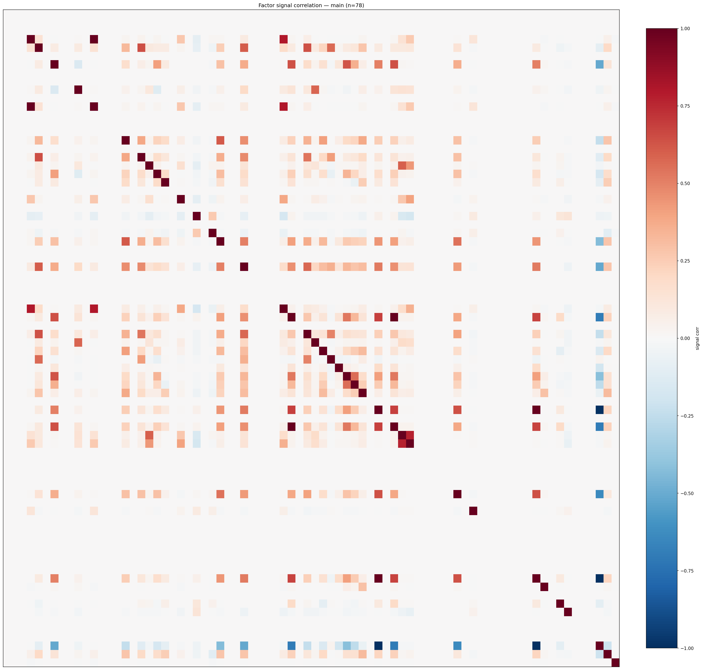

*Signal correlation matrix — main*

## 3. Deflation & model-based importance

`deflated_best_ic` haircuts each zoo's best |IC| for the number of factors tried (`ic_n_tested`) — a bigger zoo's best factor is more likely to be lucky. `lasso_n_nonzero` / `lasso_sparsity` show how many factors a sparse linear model actually keeps (model-view redundancy).

| prerun | best_ic | deflated_best_ic | deflated_best_t | ic_n_tested | ic_n_obs | lasso_n_nonzero | lasso_sparsity |
| --- | --- | --- | --- | --- | --- | --- | --- |
| gpt4omini120650 | 0.0225 | 0.015 | 5.7392 | 64 | 146339 | 0 | 1.0 |
| gpt5.4mini120650 | 0.0229 | 0.0161 | 6.1576 | 31 | 146339 | 0 | 1.0 |
| main | 0.0274 | 0.0204 | 7.794 | 38 | 146339 | 0 | 1.0 |

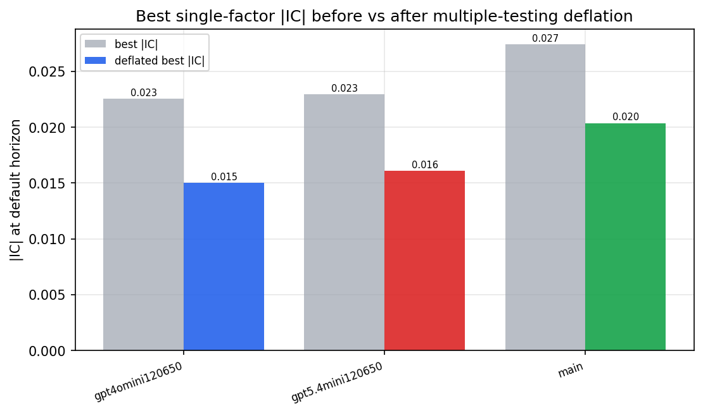

*Best |IC| before vs after multiple-testing deflation*

*Top factors by lasso importance per zoo*

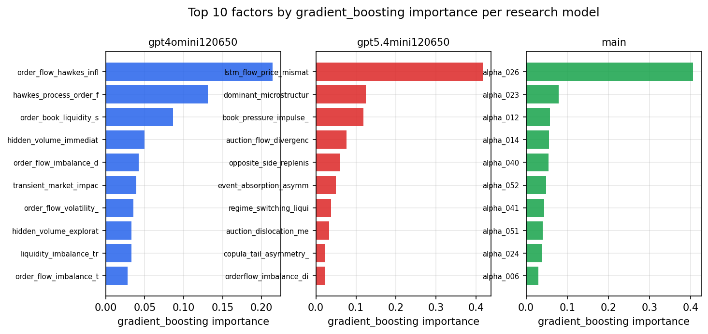

*Top factors by gradient_boosting importance per zoo*

## 4. ML-combined signal — per-underlying vectorised backtest

Each model combines a prerun's factors into ONE signal (fit `factors → forward return` on IS, predict per (bar, underlying)), then that combined signal is run through a simple vectorised backtest — `position(signal) × the underlying's own forward return` — on the held-out OOS tail (+ an equal-weight ensemble). No cross-sectional ranking.

> Config: position=**threshold** (t=1.0, z-score `expanding`), aggregation=**portfolio**, fit-standardise=**per_underlying**, horizon=6.

| prerun | model | n_factors_used | oos_ic | oos_sharpe | is_sharpe | oos_ann_return | oos_max_drawdown |
| --- | --- | --- | --- | --- | --- | --- | --- |
| gpt4omini120650 | linear_regression | 66 | 0.0078 | 1.8444 | 4.9924 | 0.085 | -0.0091 |
| gpt4omini120650 | ridge | 66 | 0.009 | 1.7797 | 5.1098 | 0.0835 | -0.0081 |
| gpt4omini120650 | lasso | 66 | nan | nan | nan | nan | nan |
| gpt4omini120650 | elastic_net | 66 | nan | nan | nan | nan | nan |
| gpt4omini120650 | random_forest | 66 | -0.0004 | 3.5318 | 8.6327 | 0.1709 | -0.0128 |
| gpt4omini120650 | gradient_boosting | 66 | 0.0024 | 1.2986 | 9.7715 | 0.0301 | -0.0076 |
| gpt4omini120650 | xgboost | 66 | 0.0024 | 1.7755 | 12.9713 | 0.0646 | -0.0101 |
| gpt4omini120650 | lightgbm | 66 | 0.0072 | 7.5082 | 18.5167 | 0.262 | -0.0063 |
| gpt4omini120650 | ensemble | 66 | 0.009 | 4.664 | 12.6491 | 0.1898 | -0.0107 |
| gpt5.4mini120650 | linear_regression | 69 | -0.0027 | -1.81 | 6.6649 | -0.067 | -0.0186 |
| gpt5.4mini120650 | ridge | 69 | -0.0026 | -1.9481 | 6.4698 | -0.0721 | -0.0192 |
| gpt5.4mini120650 | lasso | 69 | nan | nan | nan | nan | nan |
| gpt5.4mini120650 | elastic_net | 69 | nan | nan | nan | nan | nan |
| gpt5.4mini120650 | random_forest | 69 | 0.0011 | 3.4061 | 8.5931 | 0.122 | -0.0108 |
| gpt5.4mini120650 | gradient_boosting | 69 | 0.0041 | 6.1359 | 9.5286 | 0.1566 | -0.0057 |
| gpt5.4mini120650 | xgboost | 69 | 0.0028 | 4.7331 | 10.1369 | 0.1542 | -0.0084 |
| gpt5.4mini120650 | lightgbm | 69 | -0.0027 | 5.644 | 16.5764 | 0.1716 | -0.0061 |
| gpt5.4mini120650 | ensemble | 69 | 0.0037 | 2.9983 | 10.8139 | 0.0768 | -0.0056 |
| main | linear_regression | 78 | 0.0118 | -4.9966 | 9.7953 | -0.0093 | -0.0009 |
| main | ridge | 78 | 0.0091 | -4.8561 | 9.9757 | -0.0074 | -0.0007 |
| main | lasso | 78 | nan | nan | nan | nan | nan |
| main | elastic_net | 78 | 0.0027 | -3.4209 | 8.0572 | -0.0032 | -0.0004 |
| main | random_forest | 78 | 0.0113 | 4.3604 | 13.382 | 0.136 | -0.0084 |
| main | gradient_boosting | 78 | 0.0061 | 4.2983 | 10.7514 | 0.0684 | -0.0029 |
| main | xgboost | 78 | 0.0106 | 5.7796 | 14.7277 | 0.1205 | -0.0057 |
| main | lightgbm | 78 | 0.0062 | 3.378 | 18.8184 | 0.0562 | -0.0057 |
| main | ensemble | 78 | 0.0157 | 5.3158 | 15.3033 | 0.1172 | -0.0053 |

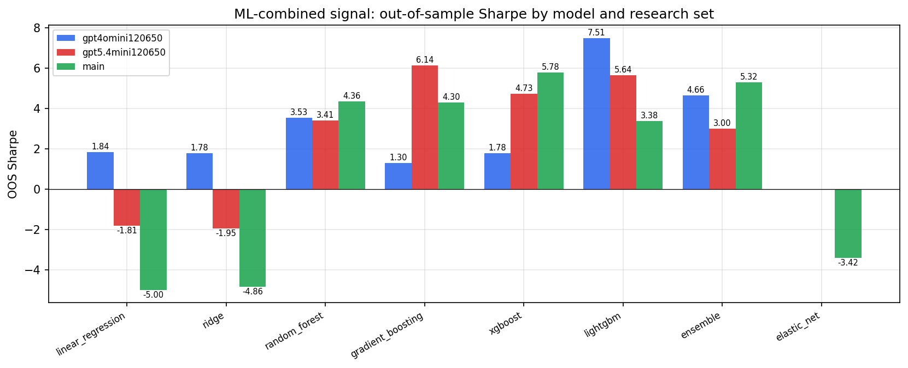

*ML-combined OOS Sharpe by model and research set*

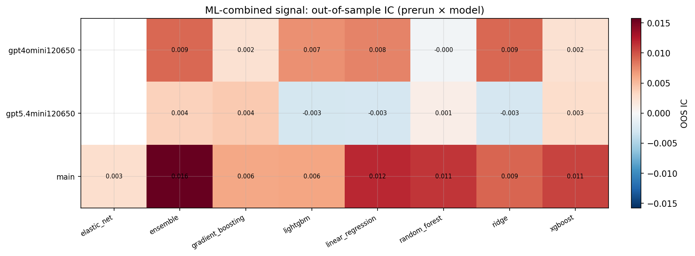

*ML-combined OOS IC (prerun × model)*

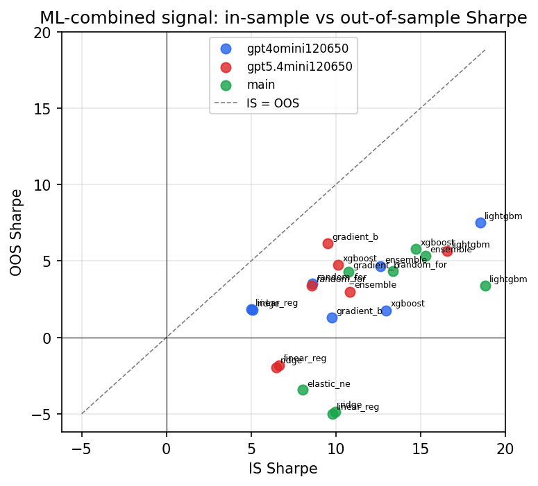

*IS vs OOS Sharpe (overfitting diagnostic)*

---
*Generated by `run_model_comparison.py`. Tables: `*.csv`; interactive: `comparison.ipynb`.*
