# Research-LLM factor comparison — `2025-09`

Comparing the **factor output of different research LLMs** on three axes (raw factor quality → factors as ML features → factors through the full agentic fund). The panel, IS/OOS split, horizon and model hyper-parameters are held identical across preruns — the *only* variable is the factor set.

## Preruns compared

| prerun | research_model | usable_factors | dropped_factors |
| --- | --- | --- | --- |
| gpt4omini120650 | gpt-4o-mini | 66 | 0 |
| gpt5.4mini120650 | gpt-5.4-mini | 69 | 0 |
| main | seed library | 78 | 10 |

> Dropped factors declare fields the current data doesn't have yet (e.g. fundamentals); they light up unchanged once that data is downloaded.

*Usable vs awaiting-data factors per research model*

## Key findings

- **Best ML-combined OOS Sharpe:** `main` with `linear_regression` (OOS Sharpe = 12.960).
- **Mean OOS Sharpe across models, by research set:** `main` = 3.691, `gpt5.4mini120650` = 1.525, `gpt4omini120650` = 1.195.
- **Highest mean single-factor |IC| (h=6):** `gpt4omini120650` (mean |IC| = 0.0069).
- **Most diverse zoo (highest effective/raw factor ratio):** `gpt5.4mini120650` (eff 44.3 of 69, ratio 0.64).
- **Best selection-deflated single-factor |IC|:** `gpt4omini120650` (deflated |IC| = 0.0081 from 64 factors tried).

## 1. Single-factor IC (raw factor quality)

Per-underlying time-series Spearman rank-IC of every researched factor, recomputed on the shared panel at horizons h=1, h=6, h=60. The per-underlying IC correlates each factor's value vector with the underlying's own forward-return vector (pooled across underlyings); the cross-sectional IC ranks across underlyings per timestamp.

| prerun | n_factors | mean_abs_ic_1 | mean_abs_ic_6 | mean_abs_ic_60 | mean_abs_icir_6 | best_factor_h6 | best_abs_ic_h6 |
| --- | --- | --- | --- | --- | --- | --- | --- |
| gpt4omini120650 | 66 | 0.0063 | 0.0069 | 0.0082 | 0.3648 | order_flow_excitement | 0.0156 |
| gpt5.4mini120650 | 69 | 0.0032 | 0.0052 | 0.0084 | 0.282 | lstm_flow_price_mismatch | 0.0129 |
| main | 78 | 0.0074 | 0.0065 | 0.0049 | 0.3579 | alpha_084 | 0.0147 |

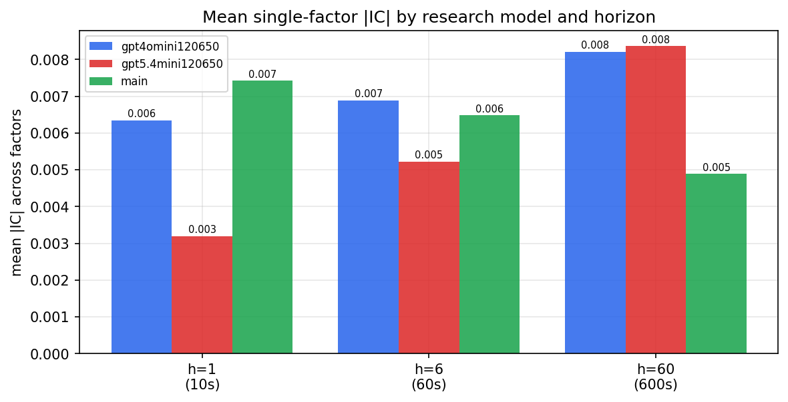

*Mean |IC| by research model and horizon*

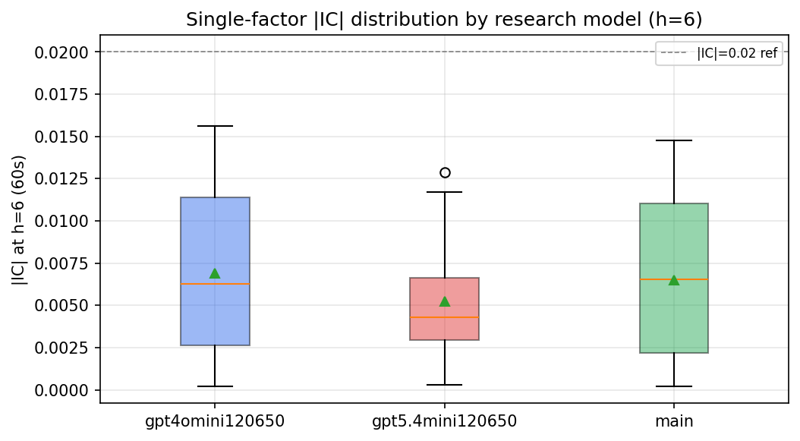

*Per-factor |IC| distribution by research model*

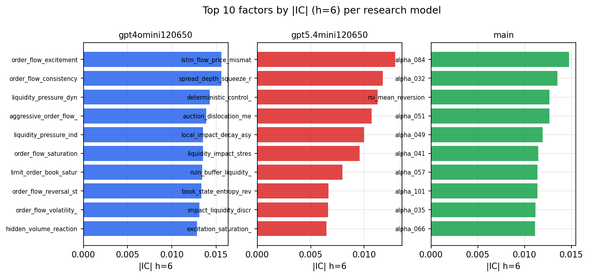

*Top factors by |IC| per research model*

## 2. Factor diversity & redundancy

Pairwise correlation of each zoo's *signals*. `eff_n_factors` is the effective number of independent factors (participation ratio of the correlation eigenvalues); `eff_ratio` and `redundancy` summarise how much unique information the zoo holds vs. how much is duplicated; `n_clusters` groups factors at |corr| ≥ 0.7.

| prerun | n_factors | eff_n_factors | eff_ratio | mean_abs_corr | n_clusters | redundancy |
| --- | --- | --- | --- | --- | --- | --- |
| gpt4omini120650 | 66 | 25.7483 | 0.3901 | 0.0554 | 52 | 0.6099 |
| gpt5.4mini120650 | 69 | 44.2916 | 0.6419 | 0.0145 | 62 | 0.3581 |
| main | 78 | 42.4781 | 0.5446 | 0.0277 | 70 | 0.4554 |

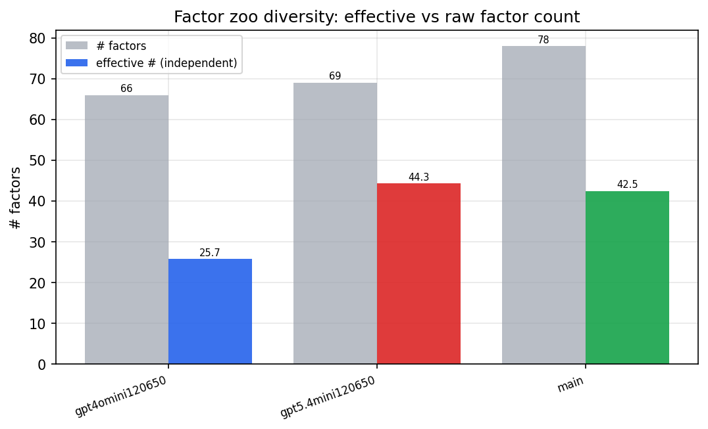

*Effective vs raw factor count per research model*

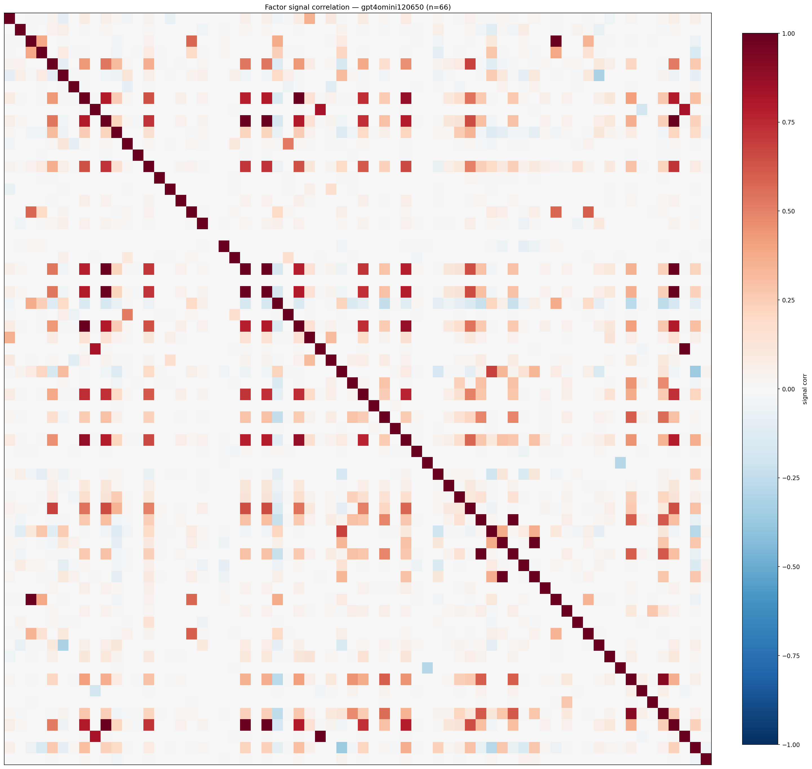

*Signal correlation matrix — gpt4omini120650*

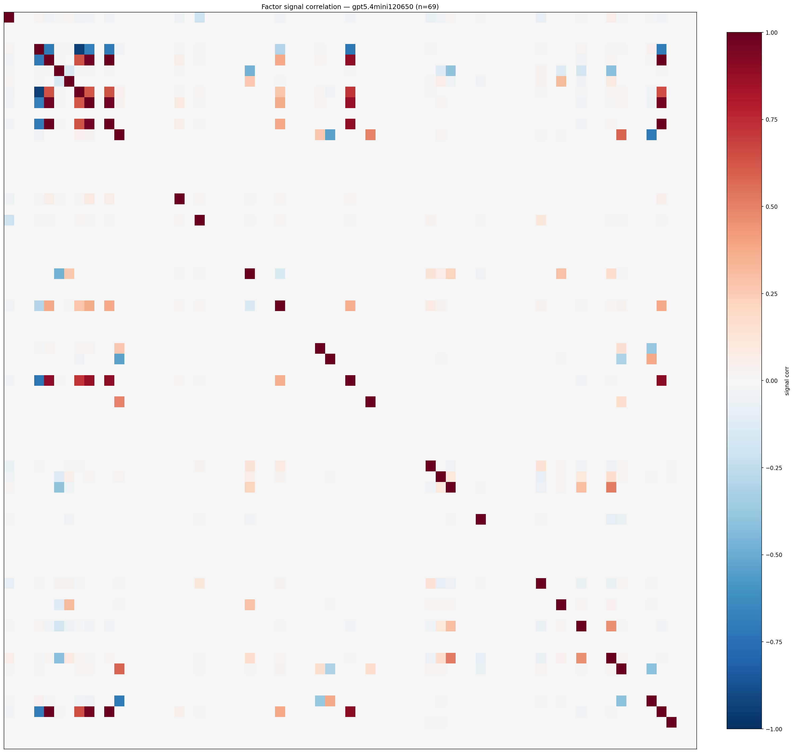

*Signal correlation matrix — gpt5.4mini120650*

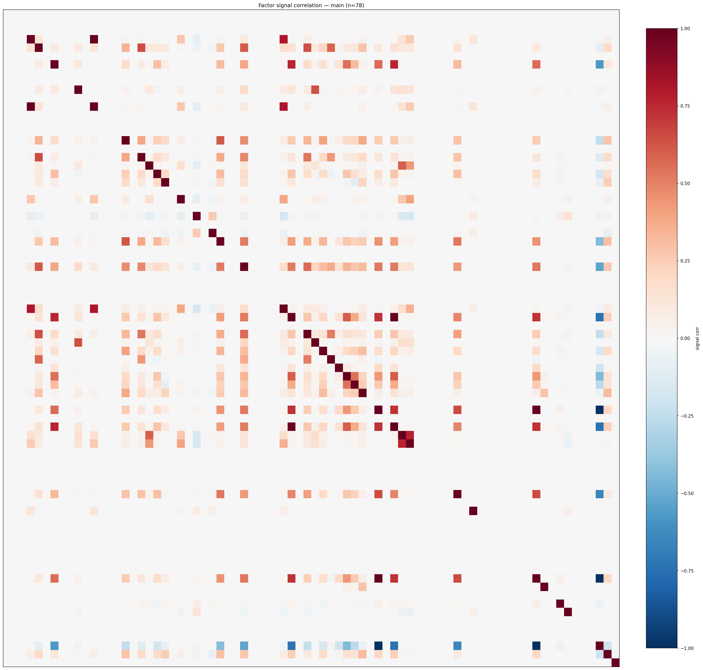

*Signal correlation matrix — main*

## 3. Deflation & model-based importance

`deflated_best_ic` haircuts each zoo's best |IC| for the number of factors tried (`ic_n_tested`) — a bigger zoo's best factor is more likely to be lucky. `lasso_n_nonzero` / `lasso_sparsity` show how many factors a sparse linear model actually keeps (model-view redundancy).

| prerun | best_ic | deflated_best_ic | deflated_best_t | ic_n_tested | ic_n_obs | lasso_n_nonzero | lasso_sparsity |
| --- | --- | --- | --- | --- | --- | --- | --- |
| gpt4omini120650 | 0.0156 | 0.0081 | 3.1294 | 64 | 148679 | 0 | 1.0 |
| gpt5.4mini120650 | 0.0129 | 0.0061 | 2.3505 | 31 | 148679 | 0 | 1.0 |
| main | 0.0147 | 0.0077 | 2.9874 | 38 | 148679 | 0 | 1.0 |

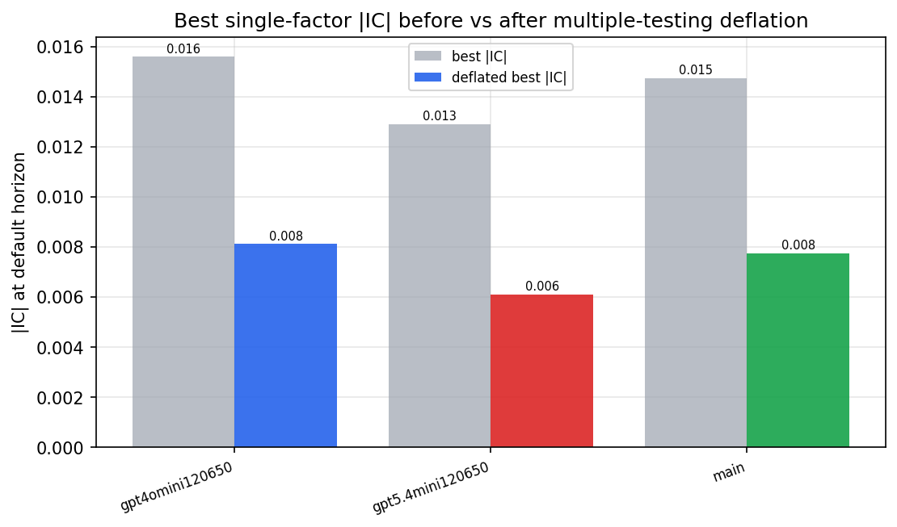

*Best |IC| before vs after multiple-testing deflation*

*Top factors by lasso importance per zoo*

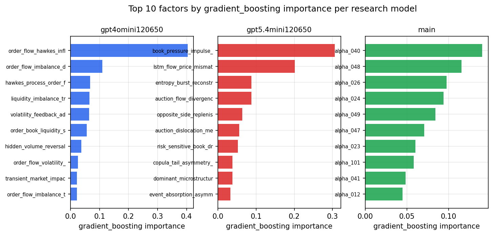

*Top factors by gradient_boosting importance per zoo*

## 4. ML-combined signal — per-underlying vectorised backtest

Each model combines a prerun's factors into ONE signal (fit `factors → forward return` on IS, predict per (bar, underlying)), then that combined signal is run through a simple vectorised backtest — `position(signal) × the underlying's own forward return` — on the held-out OOS tail (+ an equal-weight ensemble). No cross-sectional ranking.

> Config: position=**threshold** (t=1.0, z-score `expanding`), aggregation=**portfolio**, fit-standardise=**per_underlying**, horizon=6.

| prerun | model | n_factors_used | oos_ic | oos_sharpe | is_sharpe | oos_ann_return | oos_max_drawdown |
| --- | --- | --- | --- | --- | --- | --- | --- |
| gpt4omini120650 | linear_regression | 66 | -0.007 | -4.5366 | 3.6327 | -0.1659 | -0.0158 |
| gpt4omini120650 | ridge | 66 | -0.0077 | -3.7954 | 2.6245 | -0.1305 | -0.0145 |
| gpt4omini120650 | lasso | 66 | nan | nan | nan | nan | nan |
| gpt4omini120650 | elastic_net | 66 | nan | nan | nan | nan | nan |
| gpt4omini120650 | random_forest | 66 | -0.0061 | 0.5719 | 9.0807 | 0.0206 | -0.0192 |
| gpt4omini120650 | gradient_boosting | 66 | -0.0042 | 2.1488 | 8.5203 | 0.0466 | -0.0068 |
| gpt4omini120650 | xgboost | 66 | -0.0002 | 3.8092 | 11.2675 | 0.1088 | -0.0066 |
| gpt4omini120650 | lightgbm | 66 | -0.0033 | 7.1383 | 18.5502 | 0.1729 | -0.0042 |
| gpt4omini120650 | ensemble | 66 | -0.0032 | 3.0317 | 12.5077 | 0.0702 | -0.0076 |
| gpt5.4mini120650 | linear_regression | 69 | 0.003 | -1.34 | 2.9688 | -0.0481 | -0.016 |
| gpt5.4mini120650 | ridge | 69 | 0.0028 | -1.4682 | 2.7893 | -0.0529 | -0.0149 |
| gpt5.4mini120650 | lasso | 69 | 0.0019 | -2.6223 | 1.4044 | -0.0887 | -0.0134 |
| gpt5.4mini120650 | elastic_net | 69 | -0.0006 | -3.8289 | 2.25 | -0.1338 | -0.0173 |
| gpt5.4mini120650 | random_forest | 69 | -0.0138 | 3.282 | 9.4679 | 0.103 | -0.0074 |
| gpt5.4mini120650 | gradient_boosting | 69 | -0.0053 | 6.2254 | 8.0287 | 0.0868 | -0.0041 |
| gpt5.4mini120650 | xgboost | 69 | -0.0101 | 5.2195 | 10.0248 | 0.1704 | -0.0075 |
| gpt5.4mini120650 | lightgbm | 69 | -0.0131 | 4.6015 | 16.2889 | 0.1159 | -0.0055 |
| gpt5.4mini120650 | ensemble | 69 | 0.0023 | 3.6569 | 11.1593 | 0.1215 | -0.0089 |
| main | linear_regression | 78 | 0.0008 | 12.9605 | 7.4364 | 0.059 | -0.0004 |
| main | ridge | 78 | 0.0007 | 11.645 | 7.5092 | 0.0464 | -0.0006 |
| main | lasso | 78 | nan | nan | nan | nan | nan |
| main | elastic_net | 78 | nan | nan | nan | nan | nan |
| main | random_forest | 78 | 0.0014 | 0.8477 | 8.5938 | 0.0215 | -0.0078 |
| main | gradient_boosting | 78 | 0.0087 | 0.0452 | 8.9736 | 0.0009 | -0.006 |
| main | xgboost | 78 | -0.003 | -0.2986 | 12.6532 | -0.0053 | -0.0066 |
| main | lightgbm | 78 | -0.005 | 0.4097 | 16.636 | 0.0061 | -0.0054 |
| main | ensemble | 78 | -0.0018 | 0.2296 | 10.586 | 0.0039 | -0.0057 |

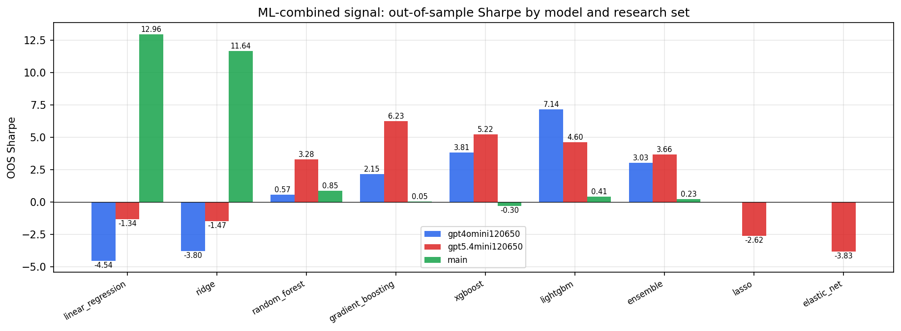

*ML-combined OOS Sharpe by model and research set*

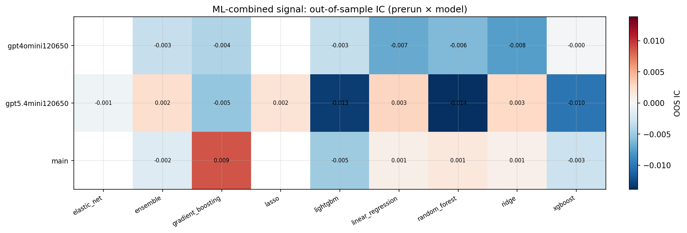

*ML-combined OOS IC (prerun × model)*

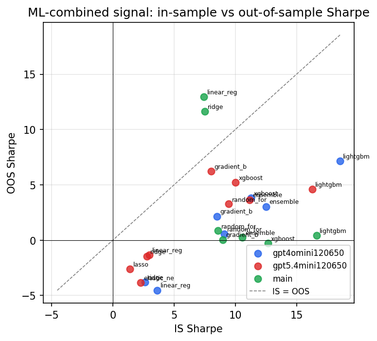

*IS vs OOS Sharpe (overfitting diagnostic)*

---
*Generated by `run_model_comparison.py`. Tables: `*.csv`; interactive: `comparison.ipynb`.*
