# Research-LLM factor comparison — `2025-10`

Comparing the **factor output of different research LLMs** on three axes (raw factor quality → factors as ML features → factors through the full agentic fund). The panel, IS/OOS split, horizon and model hyper-parameters are held identical across preruns — the *only* variable is the factor set.

## Preruns compared

| prerun | research_model | usable_factors | dropped_factors |
| --- | --- | --- | --- |
| gpt4omini120650 | gpt-4o-mini | 66 | 0 |
| gpt5.4mini120650 | gpt-5.4-mini | 69 | 0 |
| main | seed library | 78 | 10 |

> Dropped factors declare fields the current data doesn't have yet (e.g. fundamentals); they light up unchanged once that data is downloaded.

*Usable vs awaiting-data factors per research model*

## Key findings

- **Best ML-combined OOS Sharpe:** `gpt5.4mini120650` with `ensemble` (OOS Sharpe = 6.749).
- **Mean OOS Sharpe across models, by research set:** `gpt5.4mini120650` = 3.378, `gpt4omini120650` = 2.869, `main` = -2.537.
- **Highest mean single-factor |IC| (h=6):** `gpt5.4mini120650` (mean |IC| = 0.0064).
- **Most diverse zoo (highest effective/raw factor ratio):** `gpt5.4mini120650` (eff 42.0 of 69, ratio 0.61).
- **Best selection-deflated single-factor |IC|:** `gpt5.4mini120650` (deflated |IC| = 0.0103 from 31 factors tried).

## 1. Single-factor IC (raw factor quality)

Per-underlying time-series Spearman rank-IC of every researched factor, recomputed on the shared panel at horizons h=1, h=6, h=60. The per-underlying IC correlates each factor's value vector with the underlying's own forward-return vector (pooled across underlyings); the cross-sectional IC ranks across underlyings per timestamp.

| prerun | n_factors | mean_abs_ic_1 | mean_abs_ic_6 | mean_abs_ic_60 | mean_abs_icir_6 | best_factor_h6 | best_abs_ic_h6 |
| --- | --- | --- | --- | --- | --- | --- | --- |
| gpt4omini120650 | 66 | 0.0063 | 0.0054 | 0.0071 | 0.3009 | order_flow_stability_score | 0.0125 |
| gpt5.4mini120650 | 69 | 0.0041 | 0.0064 | 0.0098 | 0.3239 | multiscale_liquidity_leadlag_reversal | 0.017 |
| main | 78 | 0.0074 | 0.0061 | 0.0058 | 0.332 | alpha_066 | 0.0167 |

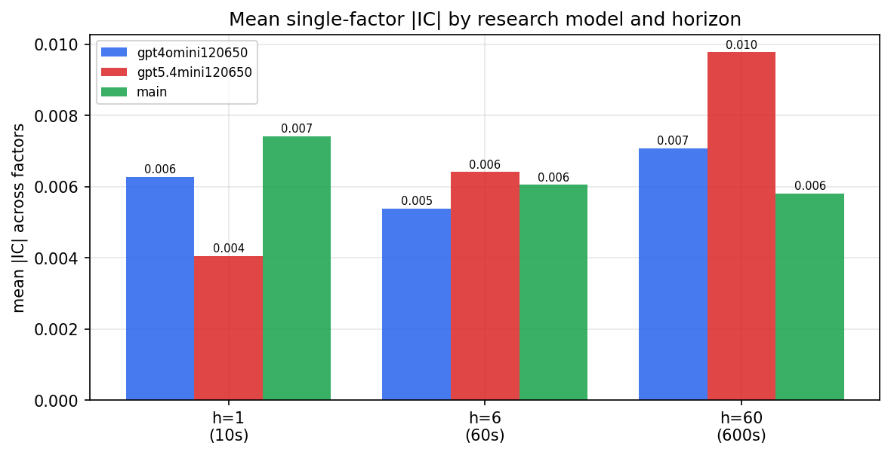

*Mean |IC| by research model and horizon*

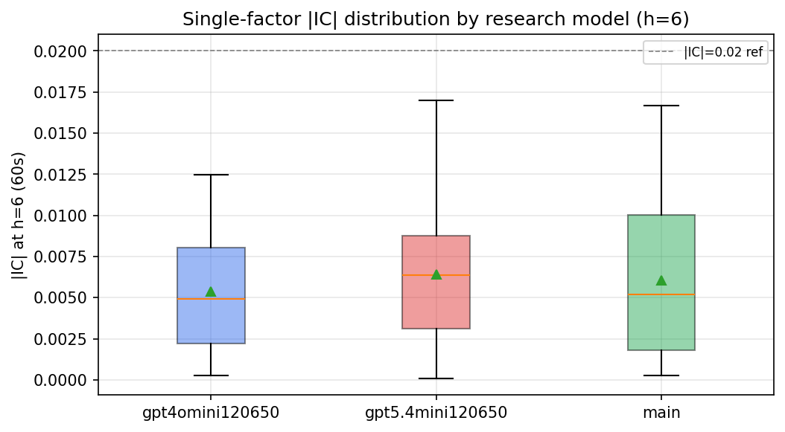

*Per-factor |IC| distribution by research model*

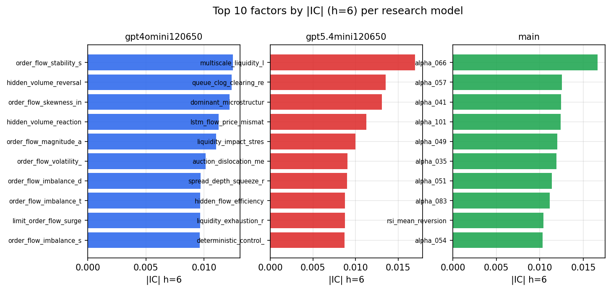

*Top factors by |IC| per research model*

## 2. Factor diversity & redundancy

Pairwise correlation of each zoo's *signals*. `eff_n_factors` is the effective number of independent factors (participation ratio of the correlation eigenvalues); `eff_ratio` and `redundancy` summarise how much unique information the zoo holds vs. how much is duplicated; `n_clusters` groups factors at |corr| ≥ 0.7.

| prerun | n_factors | eff_n_factors | eff_ratio | mean_abs_corr | n_clusters | redundancy |
| --- | --- | --- | --- | --- | --- | --- |
| gpt4omini120650 | 66 | 25.9833 | 0.3937 | 0.056 | 51 | 0.6063 |
| gpt5.4mini120650 | 69 | 42.0113 | 0.6089 | 0.0153 | 63 | 0.3911 |
| main | 78 | 42.999 | 0.5513 | 0.0274 | 70 | 0.4487 |

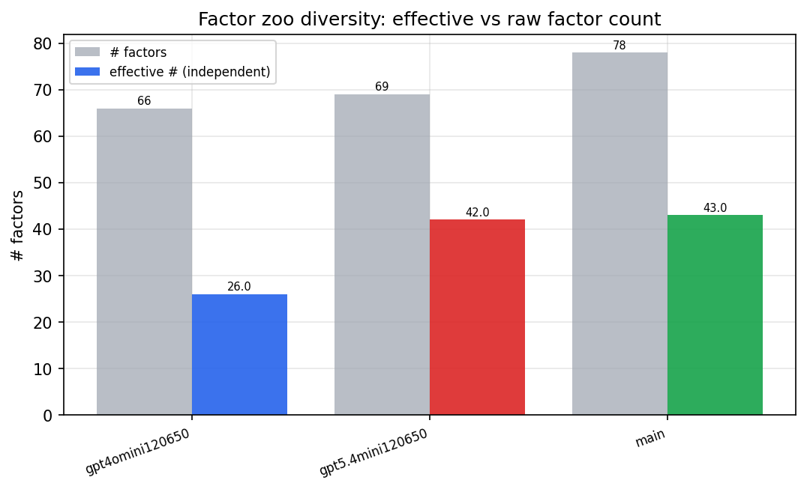

*Effective vs raw factor count per research model*

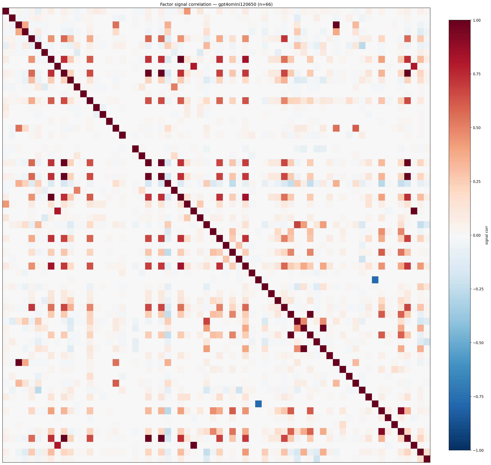

*Signal correlation matrix — gpt4omini120650*

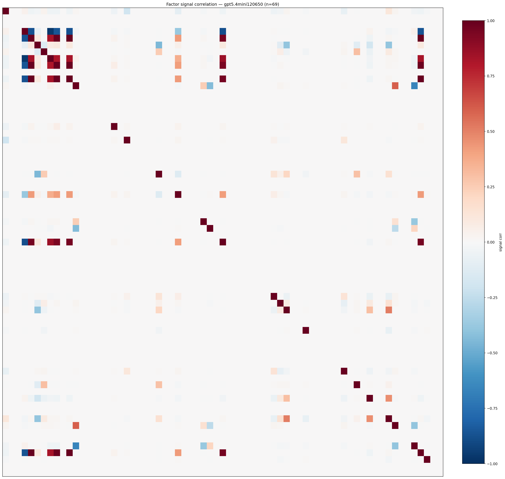

*Signal correlation matrix — gpt5.4mini120650*

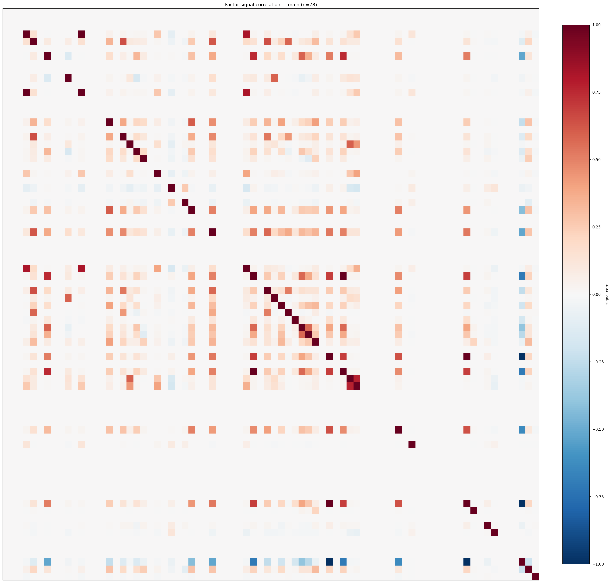

*Signal correlation matrix — main*

## 3. Deflation & model-based importance

`deflated_best_ic` haircuts each zoo's best |IC| for the number of factors tried (`ic_n_tested`) — a bigger zoo's best factor is more likely to be lucky. `lasso_n_nonzero` / `lasso_sparsity` show how many factors a sparse linear model actually keeps (model-view redundancy).

| prerun | best_ic | deflated_best_ic | deflated_best_t | ic_n_tested | ic_n_obs | lasso_n_nonzero | lasso_sparsity |
| --- | --- | --- | --- | --- | --- | --- | --- |
| gpt4omini120650 | 0.0125 | 0.0051 | 1.982 | 64 | 152099 | 7 | 0.8939 |
| gpt5.4mini120650 | 0.017 | 0.0103 | 4.0118 | 31 | 152099 | 0 | 1.0 |
| main | 0.0167 | 0.0097 | 3.7963 | 38 | 152099 | 1 | 0.9872 |

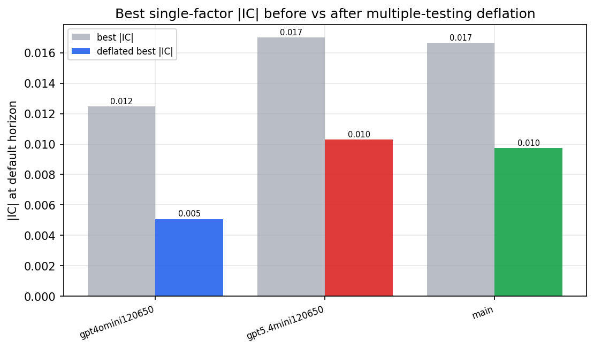

*Best |IC| before vs after multiple-testing deflation*

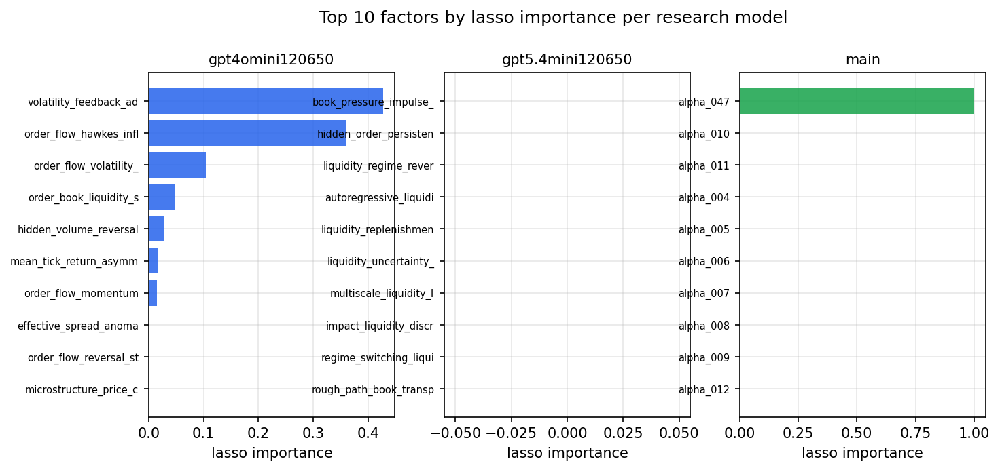

*Top factors by lasso importance per zoo*

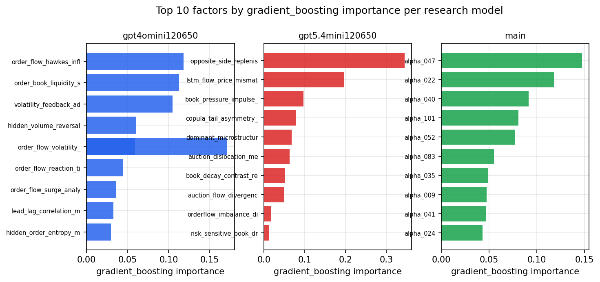

*Top factors by gradient_boosting importance per zoo*

## 4. ML-combined signal — per-underlying vectorised backtest

Each model combines a prerun's factors into ONE signal (fit `factors → forward return` on IS, predict per (bar, underlying)), then that combined signal is run through a simple vectorised backtest — `position(signal) × the underlying's own forward return` — on the held-out OOS tail (+ an equal-weight ensemble). No cross-sectional ranking.

> Config: position=**threshold** (t=1.0, z-score `expanding`), aggregation=**portfolio**, fit-standardise=**per_underlying**, horizon=6.

| prerun | model | n_factors_used | oos_ic | oos_sharpe | is_sharpe | oos_ann_return | oos_max_drawdown |
| --- | --- | --- | --- | --- | --- | --- | --- |
| gpt4omini120650 | linear_regression | 66 | 0.0041 | 3.717 | 8.0694 | 0.211 | -0.0091 |
| gpt4omini120650 | ridge | 66 | 0.0041 | 3.9999 | 8.0422 | 0.2273 | -0.0088 |
| gpt4omini120650 | lasso | 66 | nan | nan | nan | nan | nan |
| gpt4omini120650 | elastic_net | 66 | nan | nan | nan | nan | nan |
| gpt4omini120650 | random_forest | 66 | 0.0068 | 4.0694 | 10.526 | 0.3285 | -0.0129 |
| gpt4omini120650 | gradient_boosting | 66 | -0.0049 | 4.0761 | 8.4578 | 0.2109 | -0.0087 |
| gpt4omini120650 | xgboost | 66 | 0.0017 | -2.2068 | 14.7249 | -0.141 | -0.0321 |
| gpt4omini120650 | lightgbm | 66 | 0.0005 | 2.8442 | 20.4332 | 0.1985 | -0.0223 |
| gpt4omini120650 | ensemble | 66 | 0.0056 | 3.5838 | 12.9817 | 0.2151 | -0.017 |
| gpt5.4mini120650 | linear_regression | 69 | -0.0002 | 0.1556 | 6.1435 | 0.0083 | -0.0175 |
| gpt5.4mini120650 | ridge | 69 | -0.001 | 0.427 | 5.2859 | 0.0231 | -0.0196 |
| gpt5.4mini120650 | lasso | 69 | nan | nan | nan | nan | nan |
| gpt5.4mini120650 | elastic_net | 69 | nan | nan | nan | nan | nan |
| gpt5.4mini120650 | random_forest | 69 | 0.0046 | 3.9465 | 6.8375 | 0.225 | -0.0172 |
| gpt5.4mini120650 | gradient_boosting | 69 | 0.0151 | 5.7094 | 8.6544 | 0.1365 | -0.0042 |
| gpt5.4mini120650 | xgboost | 69 | 0.0089 | 2.5722 | 10.2366 | 0.1157 | -0.0121 |
| gpt5.4mini120650 | lightgbm | 69 | 0.0063 | 4.0838 | 16.0744 | 0.1673 | -0.0089 |
| gpt5.4mini120650 | ensemble | 69 | -0.0012 | 6.7487 | 8.045 | 0.1469 | -0.0031 |
| main | linear_regression | 78 | -0.0033 | -3.4789 | 6.9194 | -0.1504 | -0.0153 |
| main | ridge | 78 | 0.0028 | -3.3721 | 7.2672 | -0.1425 | -0.0138 |
| main | lasso | 78 | nan | nan | nan | nan | nan |
| main | elastic_net | 78 | nan | nan | nan | nan | nan |
| main | random_forest | 78 | 0.0001 | -0.2979 | 10.841 | -0.014 | -0.012 |
| main | gradient_boosting | 78 | 0.0036 | -1.383 | 12.3045 | -0.035 | -0.0046 |
| main | xgboost | 78 | -0.0104 | -4.7975 | 17.2075 | -0.1449 | -0.0144 |
| main | lightgbm | 78 | -0.0057 | 0.5827 | 23.9659 | 0.0161 | -0.007 |
| main | ensemble | 78 | -0.0026 | -5.0105 | 6.8579 | -0.0429 | -0.0041 |

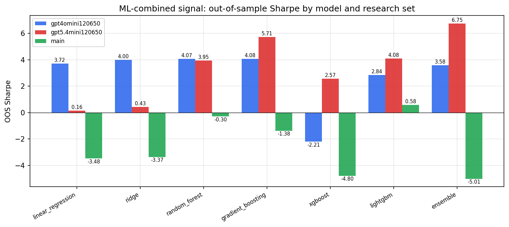

*ML-combined OOS Sharpe by model and research set*

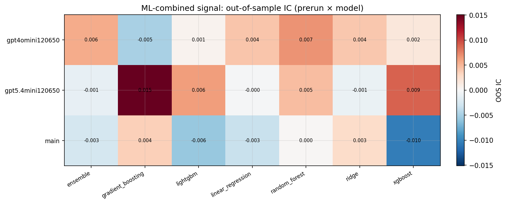

*ML-combined OOS IC (prerun × model)*

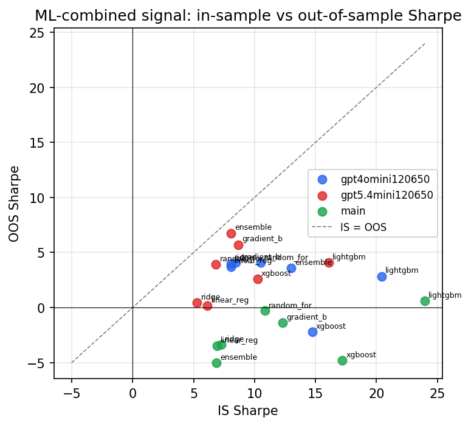

*IS vs OOS Sharpe (overfitting diagnostic)*

---
*Generated by `run_model_comparison.py`. Tables: `*.csv`; interactive: `comparison.ipynb`.*
