# Research-LLM factor comparison — `2025-11`

Comparing the **factor output of different research LLMs** on three axes (raw factor quality → factors as ML features → factors through the full agentic fund). The panel, IS/OOS split, horizon and model hyper-parameters are held identical across preruns — the *only* variable is the factor set.

## Preruns compared

| prerun | research_model | usable_factors | dropped_factors |
| --- | --- | --- | --- |
| gpt4omini120650 | gpt-4o-mini | 66 | 0 |
| gpt5.4mini120650 | gpt-5.4-mini | 69 | 0 |
| main | seed library | 78 | 10 |

> Dropped factors declare fields the current data doesn't have yet (e.g. fundamentals); they light up unchanged once that data is downloaded.

*Usable vs awaiting-data factors per research model*

## Key findings

- **Best ML-combined OOS Sharpe:** `main` with `ridge` (OOS Sharpe = 5.936).
- **Mean OOS Sharpe across models, by research set:** `main` = 4.026, `gpt4omini120650` = 0.496, `gpt5.4mini120650` = -0.376.
- **Highest mean single-factor |IC| (h=6):** `gpt5.4mini120650` (mean |IC| = 0.0042).
- **Most diverse zoo (highest effective/raw factor ratio):** `gpt5.4mini120650` (eff 39.1 of 69, ratio 0.57).
- **Best selection-deflated single-factor |IC|:** `gpt4omini120650` (deflated |IC| = 0.0037 from 64 factors tried).

## 1. Single-factor IC (raw factor quality)

Per-underlying time-series Spearman rank-IC of every researched factor, recomputed on the shared panel at horizons h=1, h=6, h=60. The per-underlying IC correlates each factor's value vector with the underlying's own forward-return vector (pooled across underlyings); the cross-sectional IC ranks across underlyings per timestamp.

| prerun | n_factors | mean_abs_ic_1 | mean_abs_ic_6 | mean_abs_ic_60 | mean_abs_icir_6 | best_factor_h6 | best_abs_ic_h6 |
| --- | --- | --- | --- | --- | --- | --- | --- |
| gpt4omini120650 | 66 | 0.0039 | 0.0034 | 0.0067 | 0.2097 | order_flow_stability_score | 0.0112 |
| gpt5.4mini120650 | 69 | 0.0041 | 0.0042 | 0.0072 | 0.2256 | excitation_saturation_reversal | 0.0097 |
| main | 78 | 0.005 | 0.0036 | 0.0054 | 0.2064 | alpha_071 | 0.0088 |

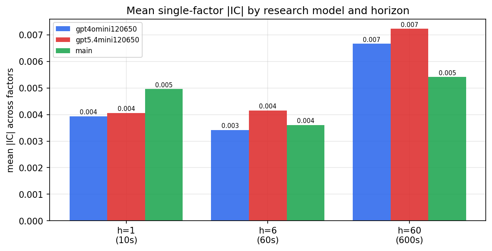

*Mean |IC| by research model and horizon*

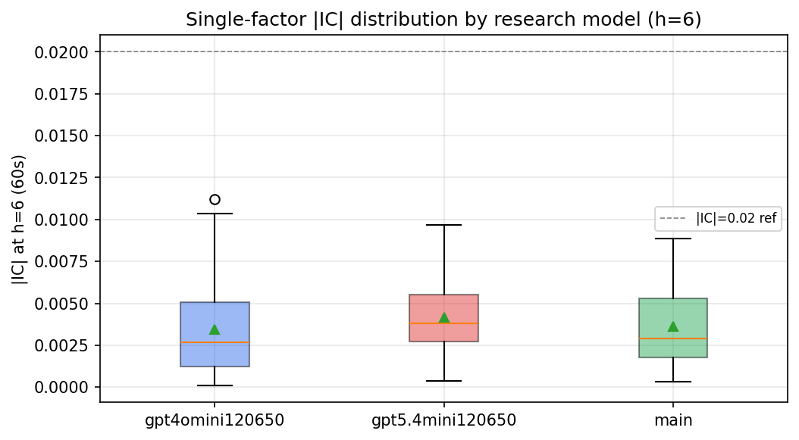

*Per-factor |IC| distribution by research model*

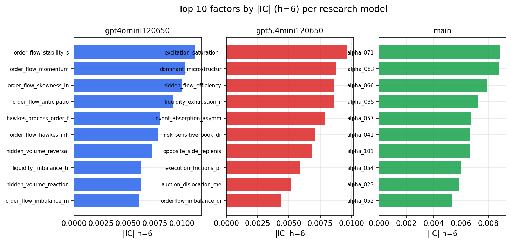

*Top factors by |IC| per research model*

## 2. Factor diversity & redundancy

Pairwise correlation of each zoo's *signals*. `eff_n_factors` is the effective number of independent factors (participation ratio of the correlation eigenvalues); `eff_ratio` and `redundancy` summarise how much unique information the zoo holds vs. how much is duplicated; `n_clusters` groups factors at |corr| ≥ 0.7.

| prerun | n_factors | eff_n_factors | eff_ratio | mean_abs_corr | n_clusters | redundancy |
| --- | --- | --- | --- | --- | --- | --- |
| gpt4omini120650 | 66 | 24.6116 | 0.3729 | 0.0586 | 49 | 0.6271 |
| gpt5.4mini120650 | 69 | 39.0778 | 0.5663 | 0.0182 | 60 | 0.4337 |
| main | 78 | 42.9127 | 0.5502 | 0.0276 | 71 | 0.4498 |

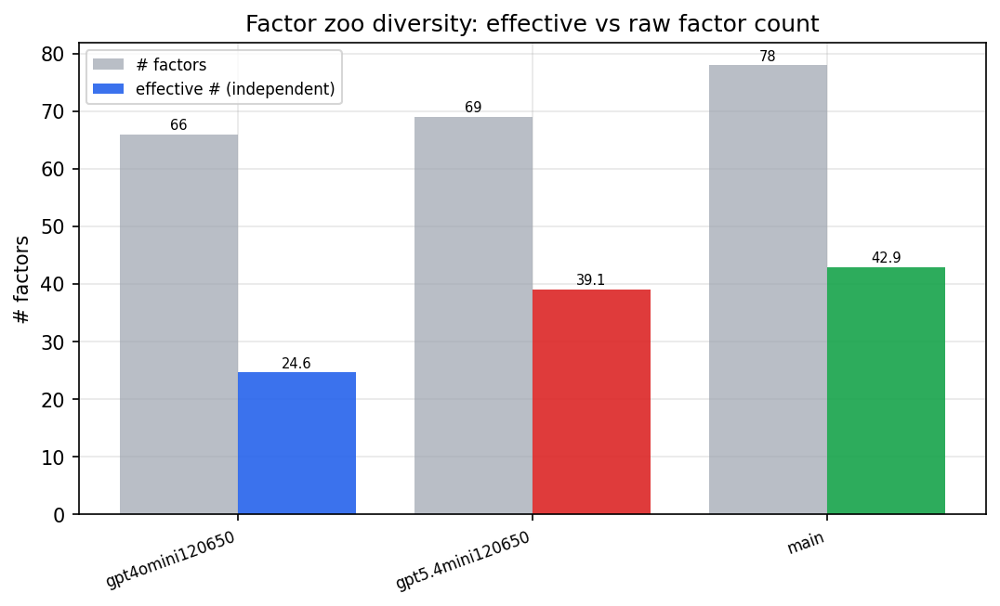

*Effective vs raw factor count per research model*

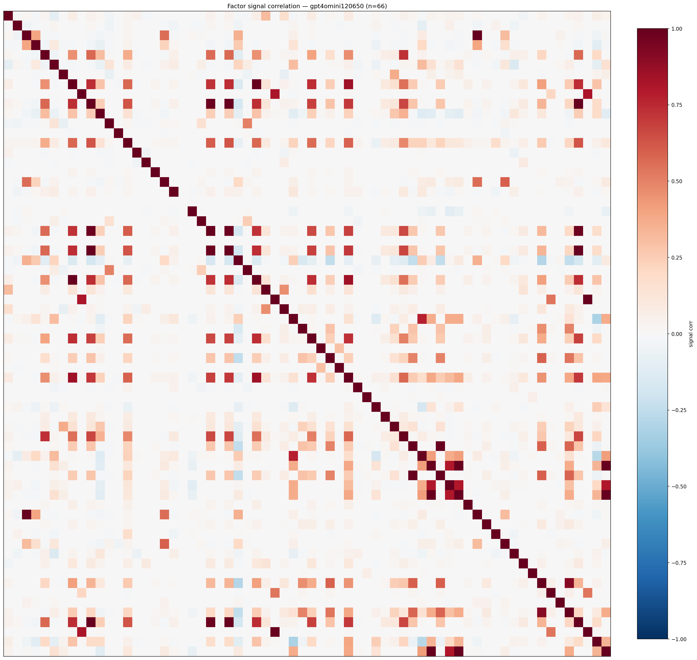

*Signal correlation matrix — gpt4omini120650*

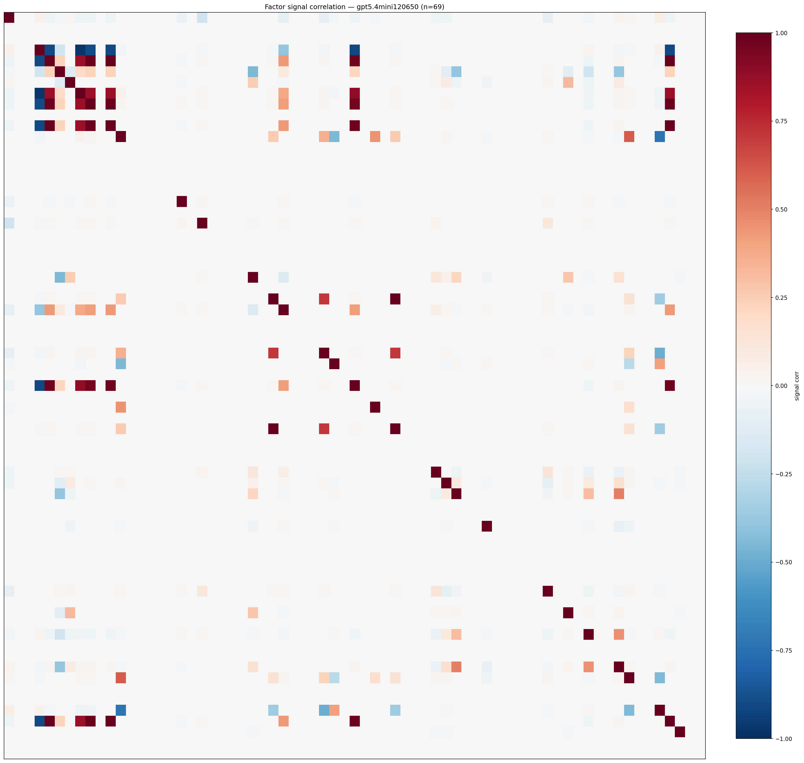

*Signal correlation matrix — gpt5.4mini120650*

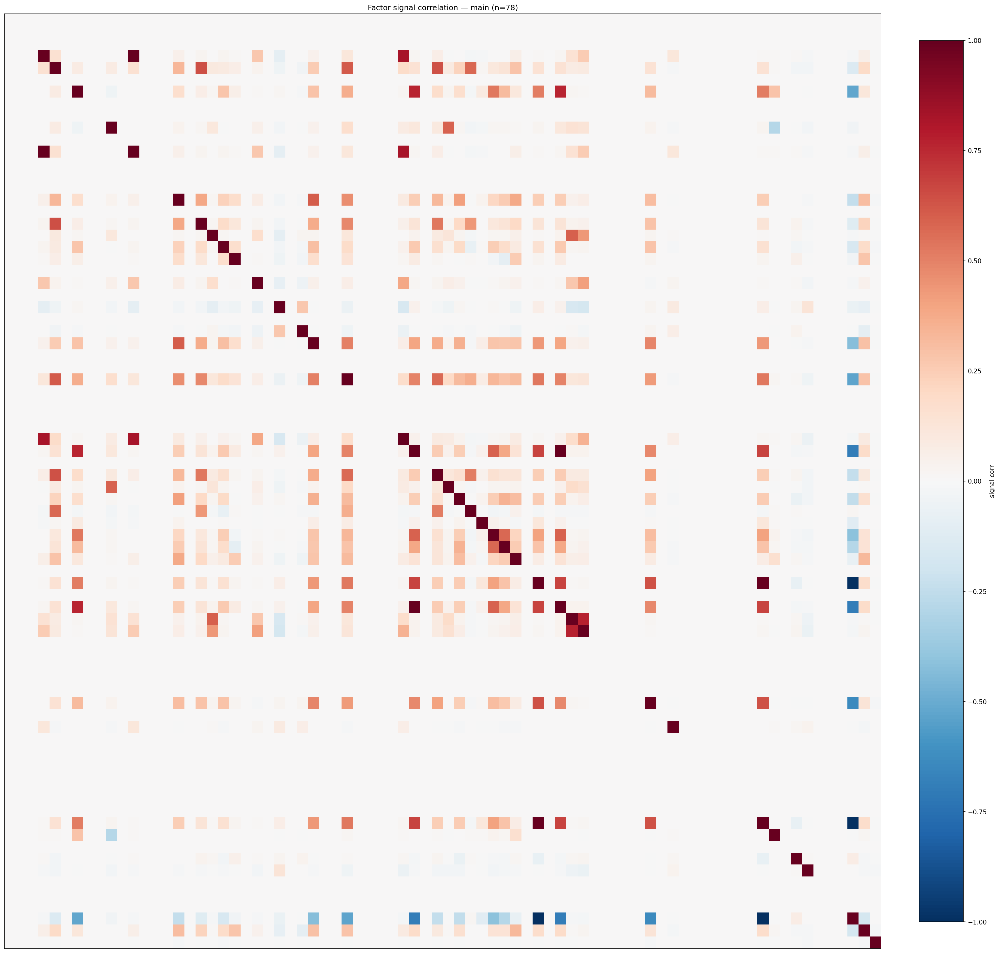

*Signal correlation matrix — main*

## 3. Deflation & model-based importance

`deflated_best_ic` haircuts each zoo's best |IC| for the number of factors tried (`ic_n_tested`) — a bigger zoo's best factor is more likely to be lucky. `lasso_n_nonzero` / `lasso_sparsity` show how many factors a sparse linear model actually keeps (model-view redundancy).

| prerun | best_ic | deflated_best_ic | deflated_best_t | ic_n_tested | ic_n_obs | lasso_n_nonzero | lasso_sparsity |
| --- | --- | --- | --- | --- | --- | --- | --- |
| gpt4omini120650 | 0.0112 | 0.0037 | 1.411 | 64 | 146339 | 1 | 0.9848 |
| gpt5.4mini120650 | 0.0097 | 0.0028 | 1.0847 | 31 | 146339 | 0 | 1.0 |
| main | 0.0088 | 0.0018 | 0.6853 | 38 | 146339 | 0 | 1.0 |

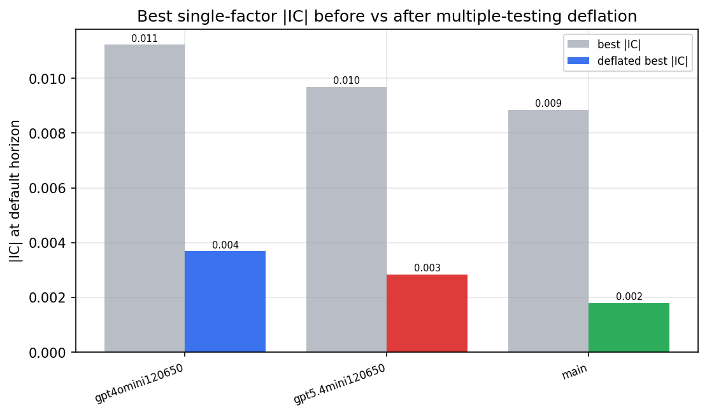

*Best |IC| before vs after multiple-testing deflation*

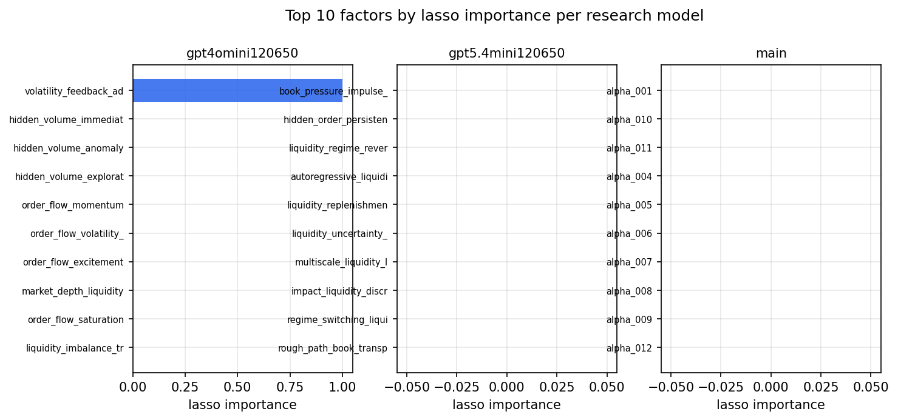

*Top factors by lasso importance per zoo*

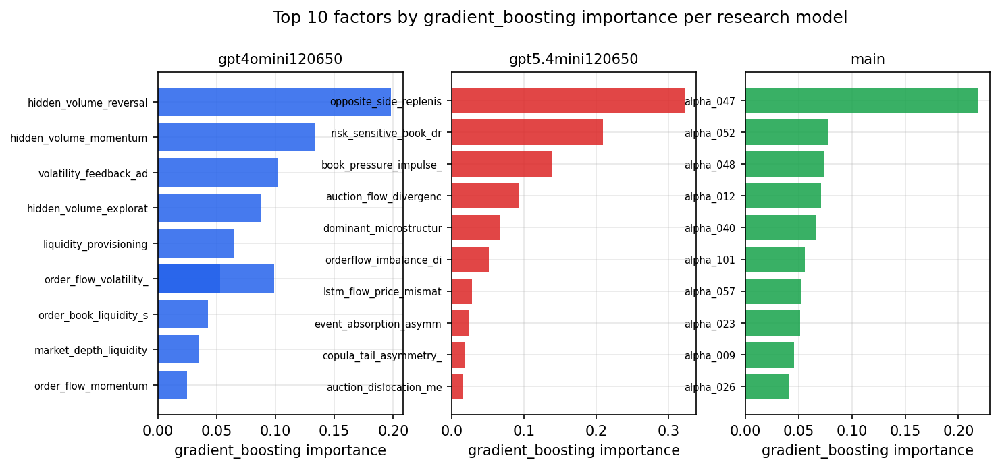

*Top factors by gradient_boosting importance per zoo*

## 4. ML-combined signal — per-underlying vectorised backtest

Each model combines a prerun's factors into ONE signal (fit `factors → forward return` on IS, predict per (bar, underlying)), then that combined signal is run through a simple vectorised backtest — `position(signal) × the underlying's own forward return` — on the held-out OOS tail (+ an equal-weight ensemble). No cross-sectional ranking.

> Config: position=**threshold** (t=1.0, z-score `expanding`), aggregation=**portfolio**, fit-standardise=**per_underlying**, horizon=6.

| prerun | model | n_factors_used | oos_ic | oos_sharpe | is_sharpe | oos_ann_return | oos_max_drawdown |
| --- | --- | --- | --- | --- | --- | --- | --- |
| gpt4omini120650 | linear_regression | 66 | -0.0036 | 0.1307 | 5.0442 | 0.0138 | -0.0365 |
| gpt4omini120650 | ridge | 66 | -0.0056 | -0.0081 | 5.127 | -0.0009 | -0.0384 |
| gpt4omini120650 | lasso | 66 | -0.0053 | -0.0227 | 5.0151 | -0.0024 | -0.0403 |
| gpt4omini120650 | elastic_net | 66 | -0.0051 | -0.0895 | 5.1236 | -0.0093 | -0.0405 |
| gpt4omini120650 | random_forest | 66 | -0.0084 | 0.9949 | 8.8245 | 0.0941 | -0.0315 |
| gpt4omini120650 | gradient_boosting | 66 | -0.0139 | 1.9456 | 12.1335 | 0.165 | -0.0221 |
| gpt4omini120650 | xgboost | 66 | -0.0076 | 0.9498 | 16.3755 | 0.0798 | -0.0263 |
| gpt4omini120650 | lightgbm | 66 | 0.0025 | 0.3912 | 22.9114 | 0.0321 | -0.0255 |
| gpt4omini120650 | ensemble | 66 | -0.0045 | 0.1676 | 11.3308 | 0.0165 | -0.0318 |
| gpt5.4mini120650 | linear_regression | 69 | -0.0098 | -3.2247 | 6.1975 | -0.2235 | -0.0405 |
| gpt5.4mini120650 | ridge | 69 | -0.0104 | -3.1407 | 5.9846 | -0.2146 | -0.0396 |
| gpt5.4mini120650 | lasso | 69 | -0.0124 | -0.5214 | 6.8819 | -0.0338 | -0.027 |
| gpt5.4mini120650 | elastic_net | 69 | -0.0124 | -0.5467 | 6.856 | -0.0354 | -0.0271 |
| gpt5.4mini120650 | random_forest | 69 | -0.0112 | 0.8253 | 7.588 | 0.0717 | -0.0261 |
| gpt5.4mini120650 | gradient_boosting | 69 | -0.0037 | 2.4137 | 10.7339 | 0.1793 | -0.0192 |
| gpt5.4mini120650 | xgboost | 69 | -0.004 | 0.3577 | 12.3772 | 0.0286 | -0.0245 |
| gpt5.4mini120650 | lightgbm | 69 | -0.0097 | 0.7273 | 16.677 | 0.0572 | -0.0227 |
| gpt5.4mini120650 | ensemble | 69 | -0.0123 | -0.2702 | 11.8622 | -0.0234 | -0.0374 |
| main | linear_regression | 78 | 0.0108 | 5.4675 | 10.8857 | 0.1876 | -0.0041 |
| main | ridge | 78 | 0.0102 | 5.936 | 9.2991 | 0.2128 | -0.0049 |
| main | lasso | 78 | nan | nan | nan | nan | nan |
| main | elastic_net | 78 | nan | nan | nan | nan | nan |
| main | random_forest | 78 | 0.002 | -0.4856 | 14.2871 | -0.0214 | -0.0153 |
| main | gradient_boosting | 78 | -0.002 | 3.7831 | 19.145 | 0.1094 | -0.0061 |
| main | xgboost | 78 | 0.0055 | 3.6971 | 22.2675 | 0.15 | -0.0057 |
| main | lightgbm | 78 | 0.0099 | 5.877 | 30.1882 | 0.1904 | -0.0063 |
| main | ensemble | 78 | 0.0085 | 3.9061 | 13.5503 | 0.0741 | -0.0039 |

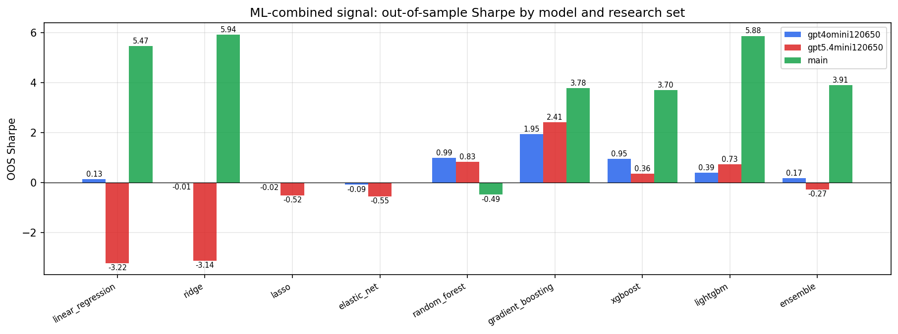

*ML-combined OOS Sharpe by model and research set*

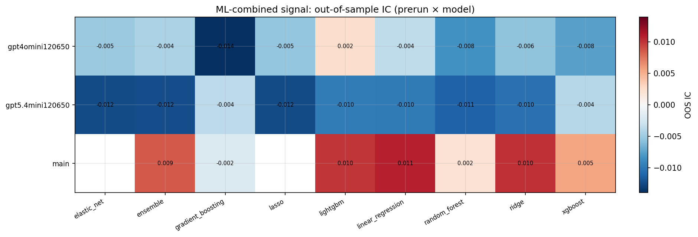

*ML-combined OOS IC (prerun × model)*

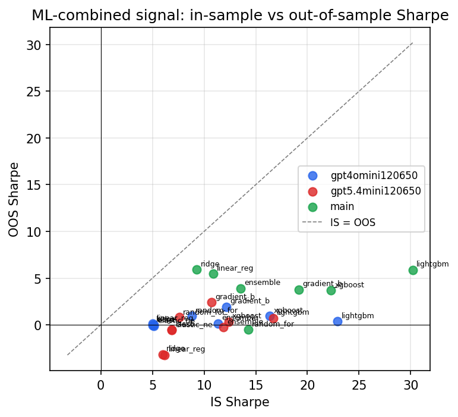

*IS vs OOS Sharpe (overfitting diagnostic)*

---
*Generated by `run_model_comparison.py`. Tables: `*.csv`; interactive: `comparison.ipynb`.*
