# Research-LLM factor comparison — `2025-12`

Comparing the **factor output of different research LLMs** on three axes (raw factor quality → factors as ML features → factors through the full agentic fund). The panel, IS/OOS split, horizon and model hyper-parameters are held identical across preruns — the *only* variable is the factor set.

## Preruns compared

| prerun | research_model | usable_factors | dropped_factors |
| --- | --- | --- | --- |
| gpt4omini120650 | gpt-4o-mini | 66 | 0 |
| gpt5.4mini120650 | gpt-5.4-mini | 69 | 0 |
| main | seed library | 78 | 10 |

> Dropped factors declare fields the current data doesn't have yet (e.g. fundamentals); they light up unchanged once that data is downloaded.

*Usable vs awaiting-data factors per research model*

## Key findings

- **Best ML-combined OOS Sharpe:** `gpt5.4mini120650` with `gradient_boosting` (OOS Sharpe = 5.213).
- **Mean OOS Sharpe across models, by research set:** `gpt5.4mini120650` = 3.697, `gpt4omini120650` = 0.478, `main` = -2.154.
- **Highest mean single-factor |IC| (h=6):** `gpt5.4mini120650` (mean |IC| = 0.0052).
- **Most diverse zoo (highest effective/raw factor ratio):** `gpt5.4mini120650` (eff 38.7 of 69, ratio 0.56).
- **Best selection-deflated single-factor |IC|:** `gpt5.4mini120650` (deflated |IC| = 0.0093 from 31 factors tried).

## 1. Single-factor IC (raw factor quality)

Per-underlying time-series Spearman rank-IC of every researched factor, recomputed on the shared panel at horizons h=1, h=6, h=60. The per-underlying IC correlates each factor's value vector with the underlying's own forward-return vector (pooled across underlyings); the cross-sectional IC ranks across underlyings per timestamp.

| prerun | n_factors | mean_abs_ic_1 | mean_abs_ic_6 | mean_abs_ic_60 | mean_abs_icir_6 | best_factor_h6 | best_abs_ic_h6 |
| --- | --- | --- | --- | --- | --- | --- | --- |
| gpt4omini120650 | 66 | 0.0047 | 0.0029 | 0.0065 | 0.2466 | hawkes_process_order_flow_indicator | 0.0152 |
| gpt5.4mini120650 | 69 | 0.0037 | 0.0052 | 0.007 | 0.2845 | queue_clog_clearing_reversion | 0.0161 |
| main | 78 | 0.0059 | 0.0049 | 0.0059 | 0.3548 | alpha_046 | 0.0135 |

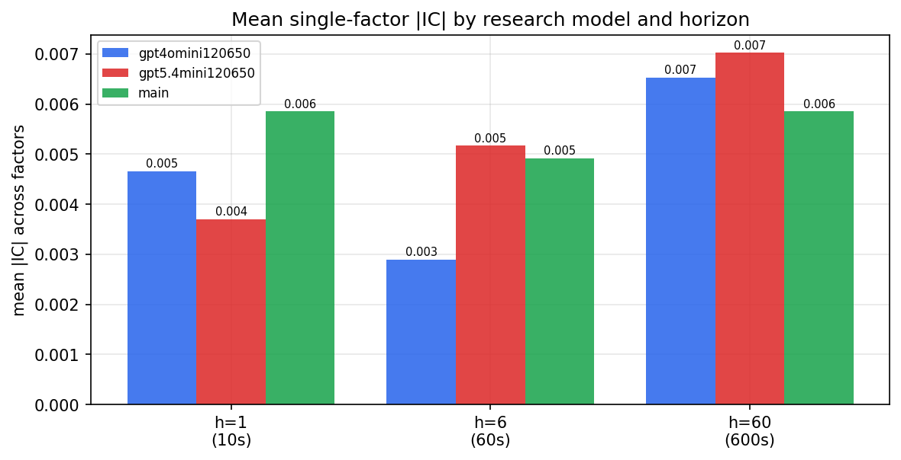

*Mean |IC| by research model and horizon*

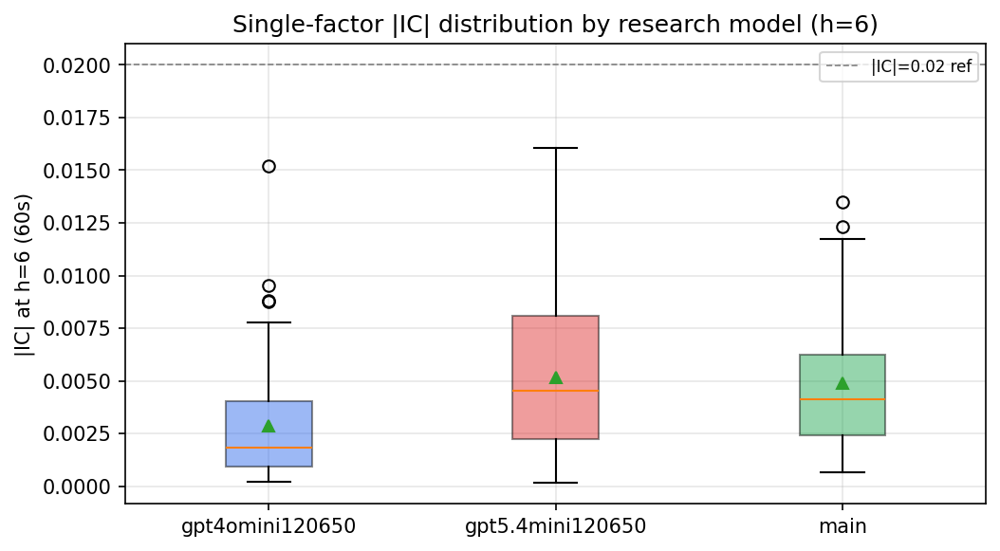

*Per-factor |IC| distribution by research model*

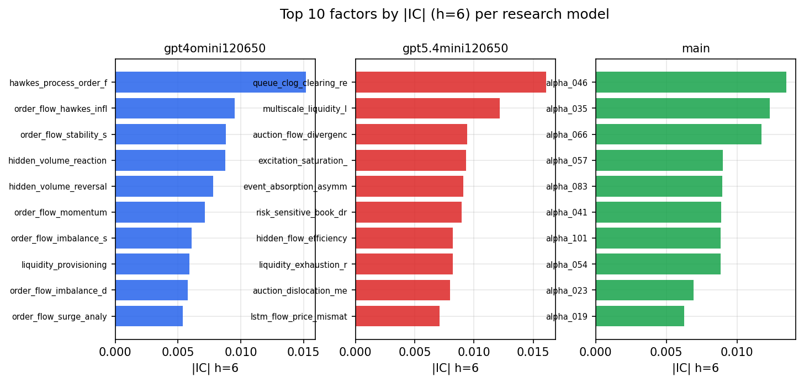

*Top factors by |IC| per research model*

## 2. Factor diversity & redundancy

Pairwise correlation of each zoo's *signals*. `eff_n_factors` is the effective number of independent factors (participation ratio of the correlation eigenvalues); `eff_ratio` and `redundancy` summarise how much unique information the zoo holds vs. how much is duplicated; `n_clusters` groups factors at |corr| ≥ 0.7.

| prerun | n_factors | eff_n_factors | eff_ratio | mean_abs_corr | n_clusters | redundancy |
| --- | --- | --- | --- | --- | --- | --- |
| gpt4omini120650 | 66 | 24.6336 | 0.3732 | 0.0598 | 50 | 0.6268 |
| gpt5.4mini120650 | 69 | 38.7068 | 0.561 | 0.0185 | 60 | 0.439 |
| main | 78 | 42.7584 | 0.5482 | 0.0284 | 71 | 0.4518 |

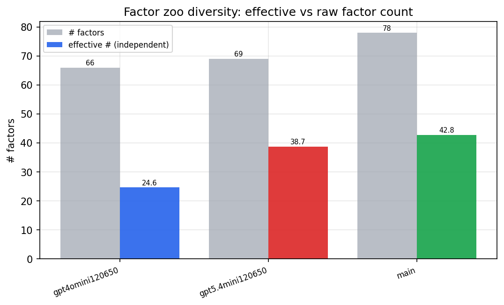

*Effective vs raw factor count per research model*

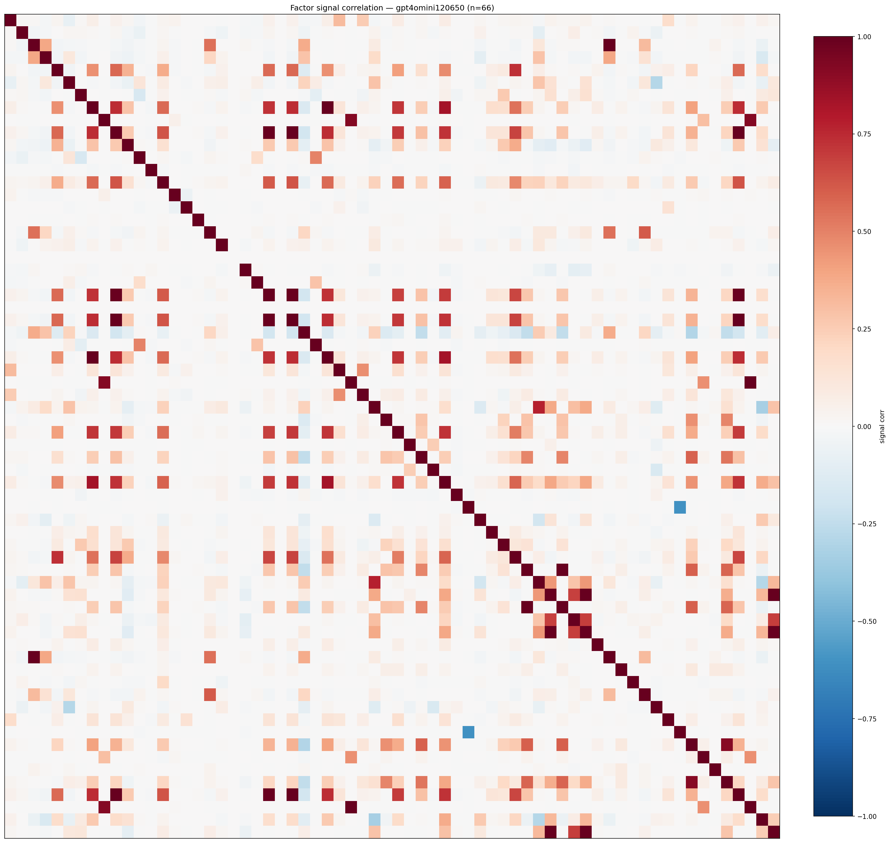

*Signal correlation matrix — gpt4omini120650*

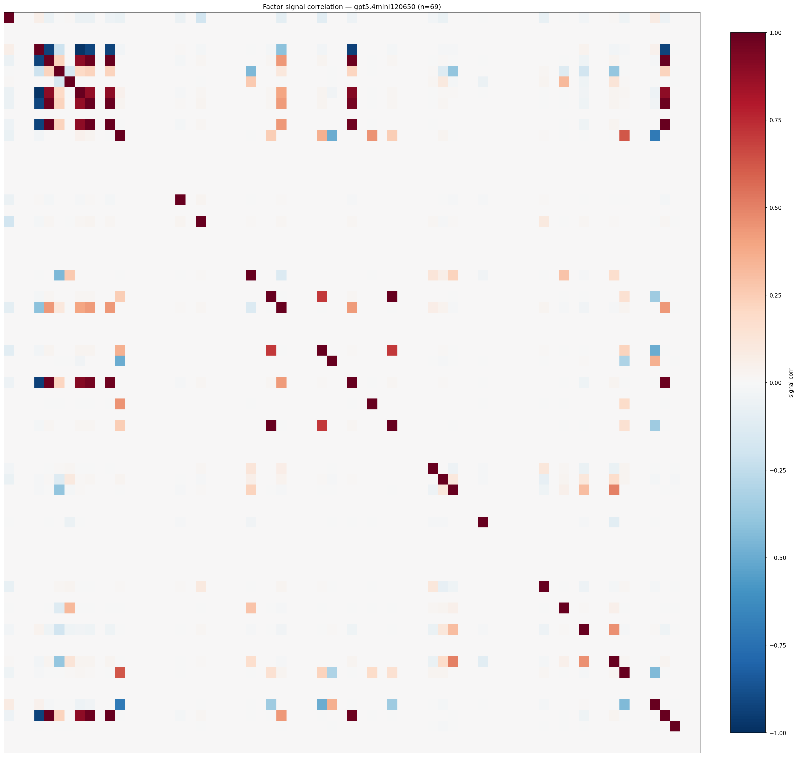

*Signal correlation matrix — gpt5.4mini120650*

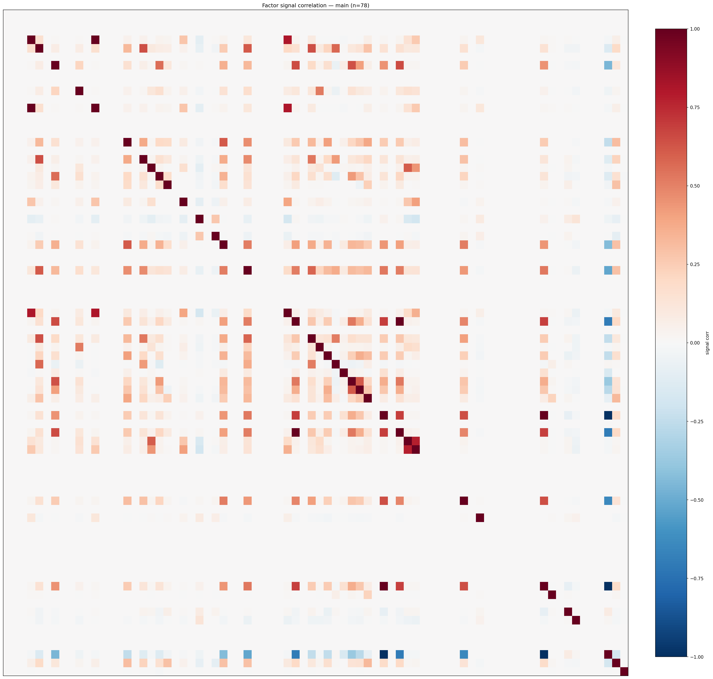

*Signal correlation matrix — main*

## 3. Deflation & model-based importance

`deflated_best_ic` haircuts each zoo's best |IC| for the number of factors tried (`ic_n_tested`) — a bigger zoo's best factor is more likely to be lucky. `lasso_n_nonzero` / `lasso_sparsity` show how many factors a sparse linear model actually keeps (model-view redundancy).

| prerun | best_ic | deflated_best_ic | deflated_best_t | ic_n_tested | ic_n_obs | lasso_n_nonzero | lasso_sparsity |
| --- | --- | --- | --- | --- | --- | --- | --- |
| gpt4omini120650 | 0.0152 | 0.0077 | 2.9538 | 64 | 147599 | 2 | 0.9697 |
| gpt5.4mini120650 | 0.0161 | 0.0093 | 3.5562 | 31 | 147599 | 0 | 1.0 |
| main | 0.0135 | 0.0065 | 2.4783 | 38 | 147599 | 18 | 0.7692 |

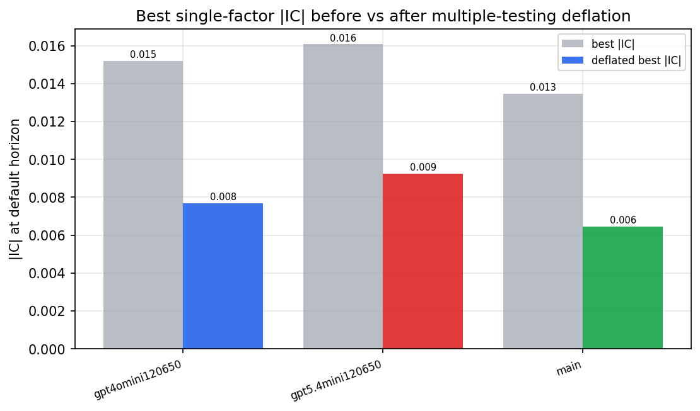

*Best |IC| before vs after multiple-testing deflation*

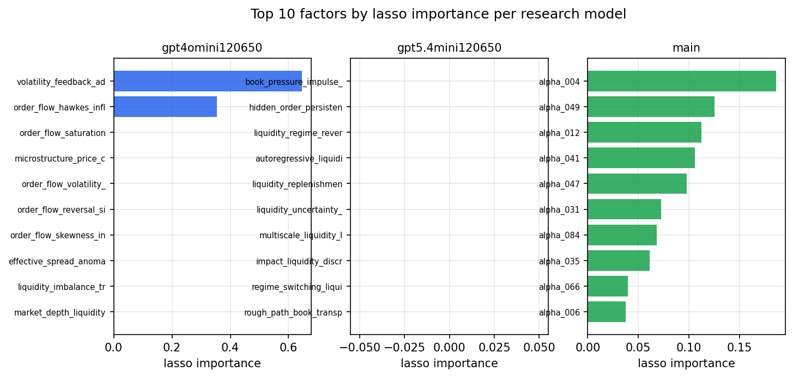

*Top factors by lasso importance per zoo*

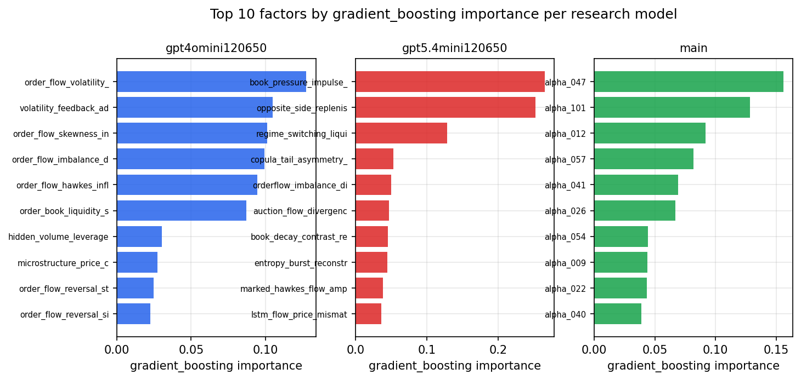

*Top factors by gradient_boosting importance per zoo*

## 4. ML-combined signal — per-underlying vectorised backtest

Each model combines a prerun's factors into ONE signal (fit `factors → forward return` on IS, predict per (bar, underlying)), then that combined signal is run through a simple vectorised backtest — `position(signal) × the underlying's own forward return` — on the held-out OOS tail (+ an equal-weight ensemble). No cross-sectional ranking.

> Config: position=**threshold** (t=1.0, z-score `expanding`), aggregation=**portfolio**, fit-standardise=**per_underlying**, horizon=6.

| prerun | model | n_factors_used | oos_ic | oos_sharpe | is_sharpe | oos_ann_return | oos_max_drawdown |
| --- | --- | --- | --- | --- | --- | --- | --- |
| gpt4omini120650 | linear_regression | 66 | -0.0062 | 0.4975 | 4.1096 | 0.0254 | -0.0135 |
| gpt4omini120650 | ridge | 66 | -0.0047 | 0.8823 | 3.5171 | 0.0447 | -0.0149 |
| gpt4omini120650 | lasso | 66 | nan | nan | nan | nan | nan |
| gpt4omini120650 | elastic_net | 66 | nan | nan | nan | nan | nan |
| gpt4omini120650 | random_forest | 66 | 0.0061 | -0.0166 | 8.4259 | -0.0006 | -0.0122 |
| gpt4omini120650 | gradient_boosting | 66 | 0.0058 | 0.8571 | 10.1809 | 0.0229 | -0.0076 |
| gpt4omini120650 | xgboost | 66 | 0.0131 | -2.2772 | 17.0564 | -0.0699 | -0.0104 |
| gpt4omini120650 | lightgbm | 66 | 0.0074 | 2.0102 | 21.6612 | 0.078 | -0.0075 |
| gpt4omini120650 | ensemble | 66 | -0.006 | 1.3935 | 14.4533 | 0.0604 | -0.0081 |
| gpt5.4mini120650 | linear_regression | 69 | 0.0027 | 1.2097 | 5.1757 | 0.0417 | -0.0093 |
| gpt5.4mini120650 | ridge | 69 | 0.0023 | 0.6518 | 5.2616 | 0.0233 | -0.0098 |
| gpt5.4mini120650 | lasso | 69 | nan | nan | nan | nan | nan |
| gpt5.4mini120650 | elastic_net | 69 | nan | nan | nan | nan | nan |
| gpt5.4mini120650 | random_forest | 69 | -0.0077 | 3.96 | 5.7033 | 0.1674 | -0.0078 |
| gpt5.4mini120650 | gradient_boosting | 69 | 0.0071 | 5.213 | 9.4724 | 0.1532 | -0.0065 |
| gpt5.4mini120650 | xgboost | 69 | -0.0094 | 5.0309 | 10.7357 | 0.1931 | -0.006 |
| gpt5.4mini120650 | lightgbm | 69 | -0.0058 | 5.0365 | 16.8986 | 0.1673 | -0.0056 |
| gpt5.4mini120650 | ensemble | 69 | 0.0046 | 4.7754 | 8.5904 | 0.0787 | -0.0035 |
| main | linear_regression | 78 | 0.0034 | -3.6635 | 10.8661 | -0.1097 | -0.0107 |
| main | ridge | 78 | -0.0002 | -3.6875 | 10.4778 | -0.1031 | -0.0095 |
| main | lasso | 78 | 0.0011 | -4.0847 | 10.8723 | -0.1114 | -0.01 |
| main | elastic_net | 78 | 0.0011 | -3.9536 | 10.509 | -0.1105 | -0.0101 |
| main | random_forest | 78 | -0.0004 | -2.2878 | 15.3608 | -0.0506 | -0.0081 |
| main | gradient_boosting | 78 | 0.0047 | 1.4202 | 17.2226 | 0.0147 | -0.0023 |
| main | xgboost | 78 | 0.0065 | -2.2557 | 19.7234 | -0.0513 | -0.0096 |
| main | lightgbm | 78 | 0.0051 | 1.2133 | 26.0768 | 0.0284 | -0.0042 |
| main | ensemble | 78 | 0.0026 | -2.0861 | 19.1364 | -0.0623 | -0.0101 |

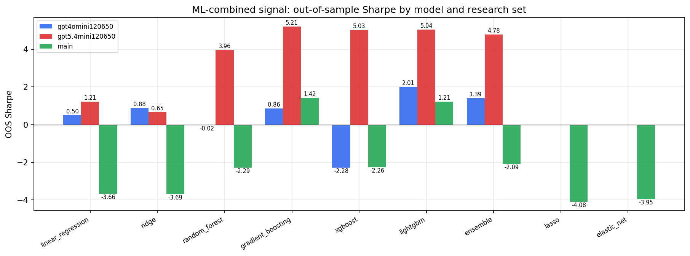

*ML-combined OOS Sharpe by model and research set*

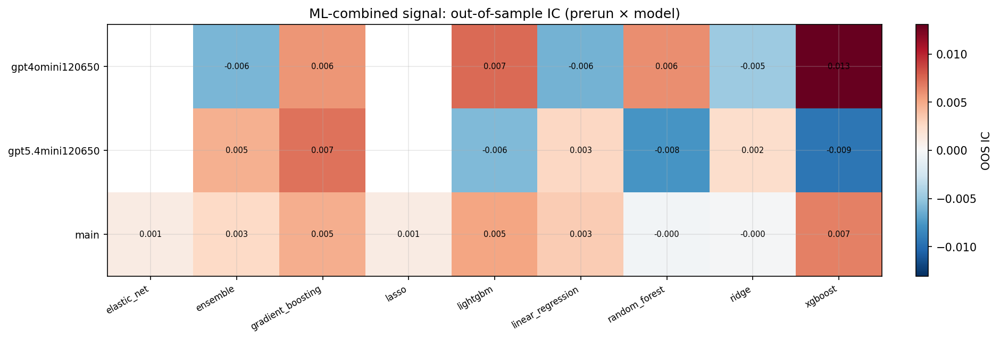

*ML-combined OOS IC (prerun × model)*

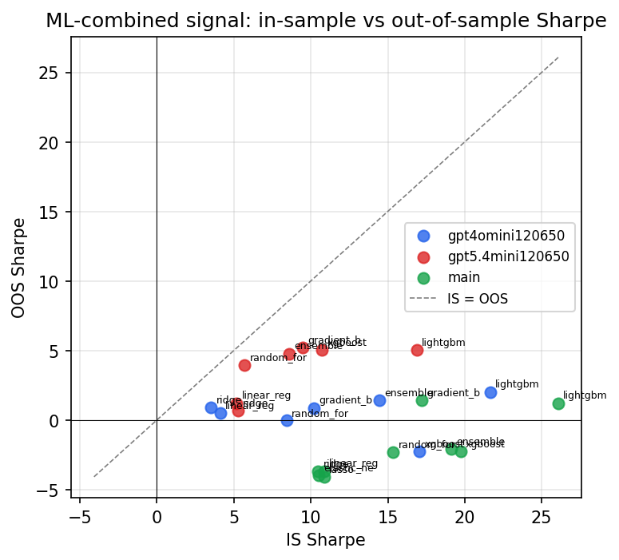

*IS vs OOS Sharpe (overfitting diagnostic)*

---
*Generated by `run_model_comparison.py`. Tables: `*.csv`; interactive: `comparison.ipynb`.*
