# Research-LLM factor comparison — `2026-01`

Comparing the **factor output of different research LLMs** on three axes (raw factor quality → factors as ML features → factors through the full agentic fund). The panel, IS/OOS split, horizon and model hyper-parameters are held identical across preruns — the *only* variable is the factor set.

## Preruns compared

| prerun | research_model | usable_factors | dropped_factors |
| --- | --- | --- | --- |
| gpt4omini120650 | gpt-4o-mini | 66 | 0 |
| gpt5.4mini120650 | gpt-5.4-mini | 69 | 0 |
| main | seed library | 78 | 10 |

> Dropped factors declare fields the current data doesn't have yet (e.g. fundamentals); they light up unchanged once that data is downloaded.

*Usable vs awaiting-data factors per research model*

## Key findings

- **Best ML-combined OOS Sharpe:** `main` with `random_forest` (OOS Sharpe = 5.833).
- **Mean OOS Sharpe across models, by research set:** `main` = 2.246, `gpt4omini120650` = -0.456, `gpt5.4mini120650` = -1.109.
- **Highest mean single-factor |IC| (h=6):** `main` (mean |IC| = 0.0048).
- **Most diverse zoo (highest effective/raw factor ratio):** `gpt5.4mini120650` (eff 39.2 of 69, ratio 0.57).
- **Best selection-deflated single-factor |IC|:** `gpt5.4mini120650` (deflated |IC| = 0.0079 from 31 factors tried).

## 1. Single-factor IC (raw factor quality)

Per-underlying time-series Spearman rank-IC of every researched factor, recomputed on the shared panel at horizons h=1, h=6, h=60. The per-underlying IC correlates each factor's value vector with the underlying's own forward-return vector (pooled across underlyings); the cross-sectional IC ranks across underlyings per timestamp.

| prerun | n_factors | mean_abs_ic_1 | mean_abs_ic_6 | mean_abs_ic_60 | mean_abs_icir_6 | best_factor_h6 | best_abs_ic_h6 |
| --- | --- | --- | --- | --- | --- | --- | --- |
| gpt4omini120650 | 66 | 0.0063 | 0.0028 | 0.0061 | 0.2468 | order_flow_hawkes_influence | 0.0116 |
| gpt5.4mini120650 | 69 | 0.0052 | 0.0046 | 0.0067 | 0.2612 | risk_sensitive_book_drift | 0.0149 |
| main | 78 | 0.008 | 0.0048 | 0.0051 | 0.3189 | alpha_046 | 0.0147 |

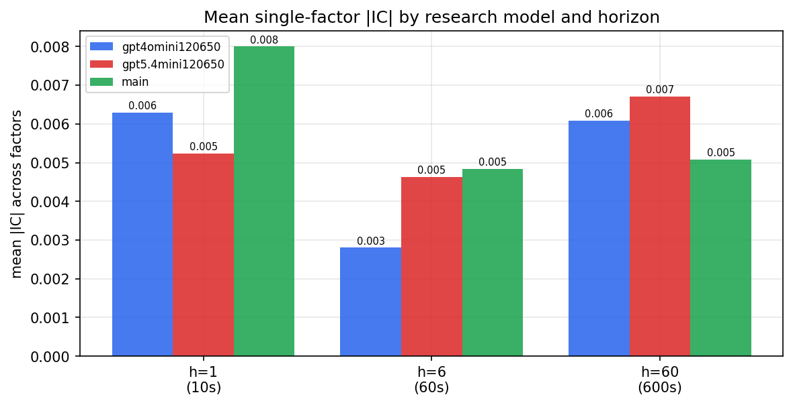

*Mean |IC| by research model and horizon*

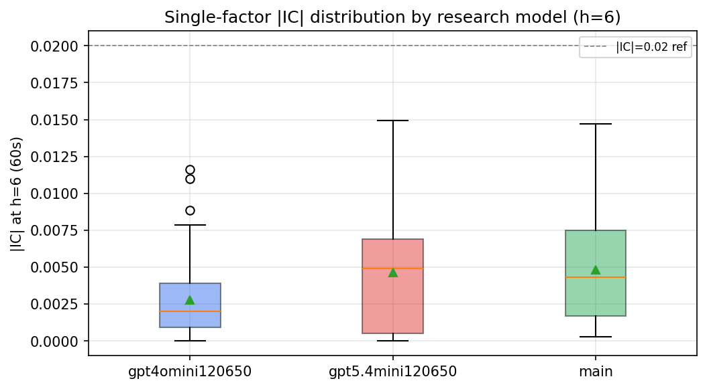

*Per-factor |IC| distribution by research model*

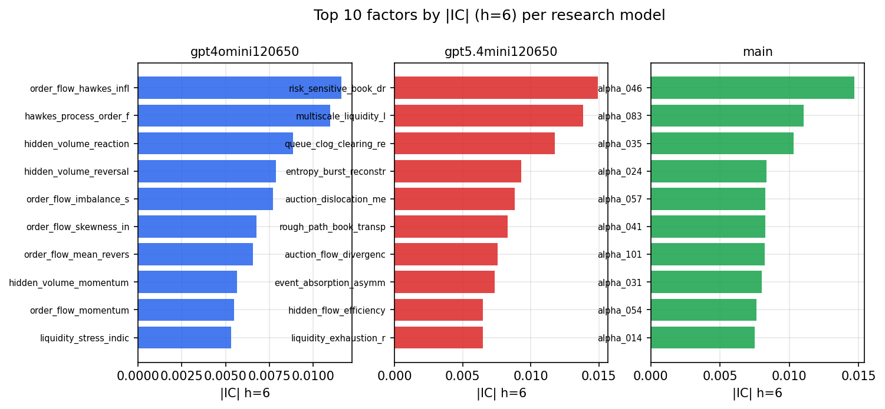

*Top factors by |IC| per research model*

## 2. Factor diversity & redundancy

Pairwise correlation of each zoo's *signals*. `eff_n_factors` is the effective number of independent factors (participation ratio of the correlation eigenvalues); `eff_ratio` and `redundancy` summarise how much unique information the zoo holds vs. how much is duplicated; `n_clusters` groups factors at |corr| ≥ 0.7.

| prerun | n_factors | eff_n_factors | eff_ratio | mean_abs_corr | n_clusters | redundancy |
| --- | --- | --- | --- | --- | --- | --- |
| gpt4omini120650 | 66 | 24.4921 | 0.3711 | 0.0591 | 49 | 0.6289 |
| gpt5.4mini120650 | 69 | 39.2062 | 0.5682 | 0.0179 | 60 | 0.4318 |
| main | 78 | 42.1528 | 0.5404 | 0.0287 | 70 | 0.4596 |

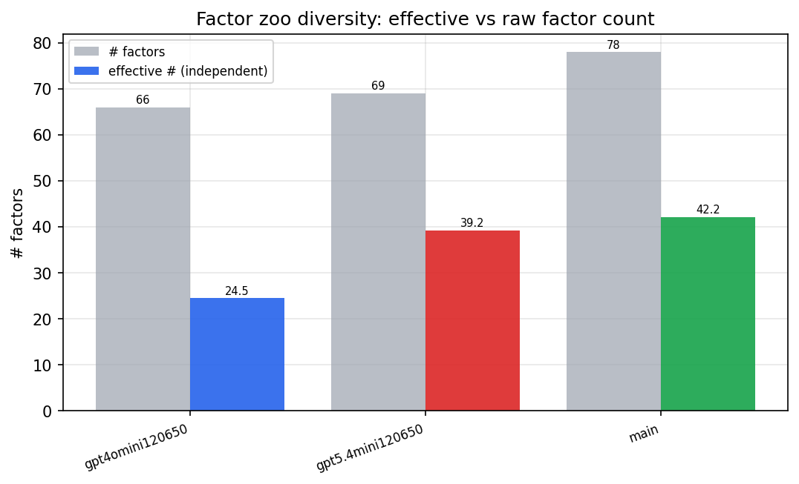

*Effective vs raw factor count per research model*

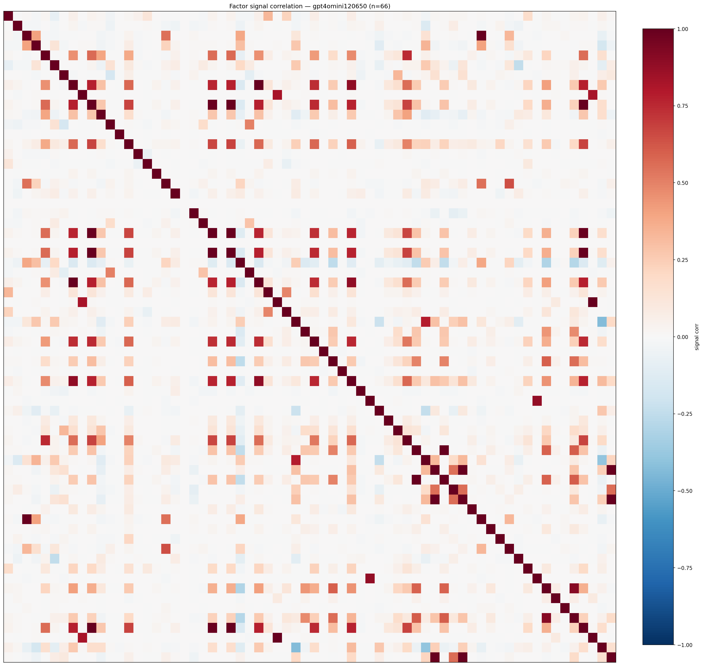

*Signal correlation matrix — gpt4omini120650*

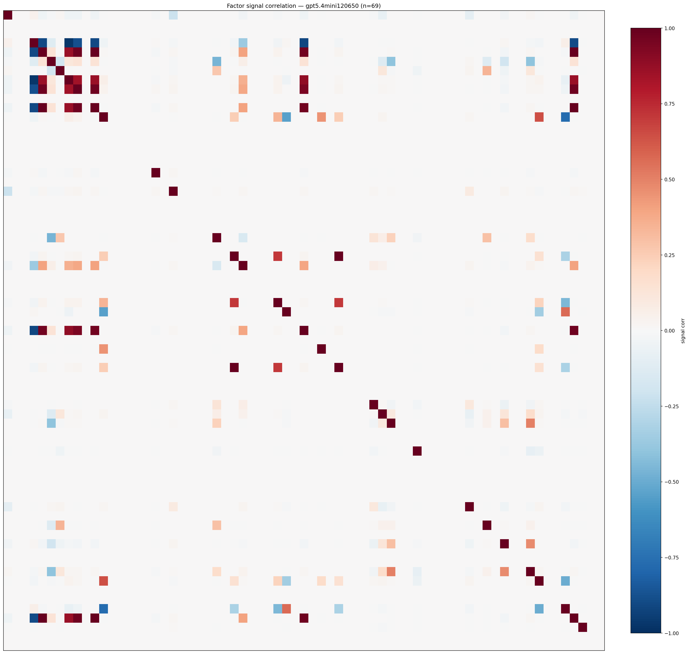

*Signal correlation matrix — gpt5.4mini120650*

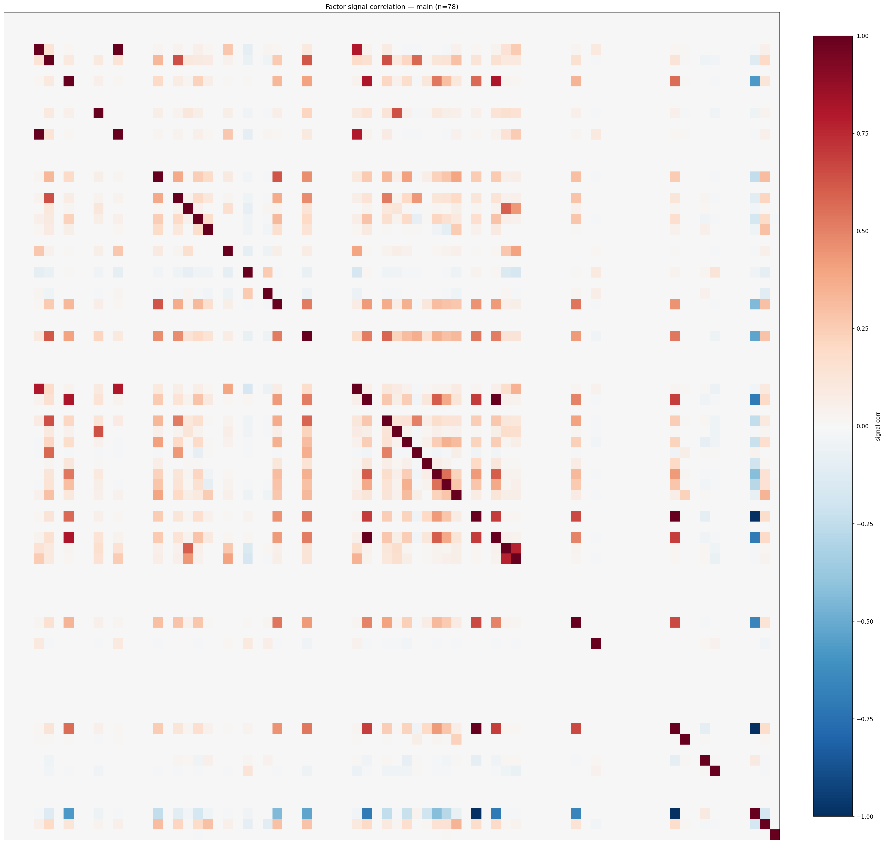

*Signal correlation matrix — main*

## 3. Deflation & model-based importance

`deflated_best_ic` haircuts each zoo's best |IC| for the number of factors tried (`ic_n_tested`) — a bigger zoo's best factor is more likely to be lucky. `lasso_n_nonzero` / `lasso_sparsity` show how many factors a sparse linear model actually keeps (model-view redundancy).

| prerun | best_ic | deflated_best_ic | deflated_best_t | ic_n_tested | ic_n_obs | lasso_n_nonzero | lasso_sparsity |
| --- | --- | --- | --- | --- | --- | --- | --- |
| gpt4omini120650 | 0.0116 | 0.0039 | 1.4744 | 64 | 140579 | 0 | 1.0 |
| gpt5.4mini120650 | 0.0149 | 0.0079 | 2.9781 | 31 | 140579 | 0 | 1.0 |
| main | 0.0147 | 0.0075 | 2.8102 | 38 | 140579 | 0 | 1.0 |

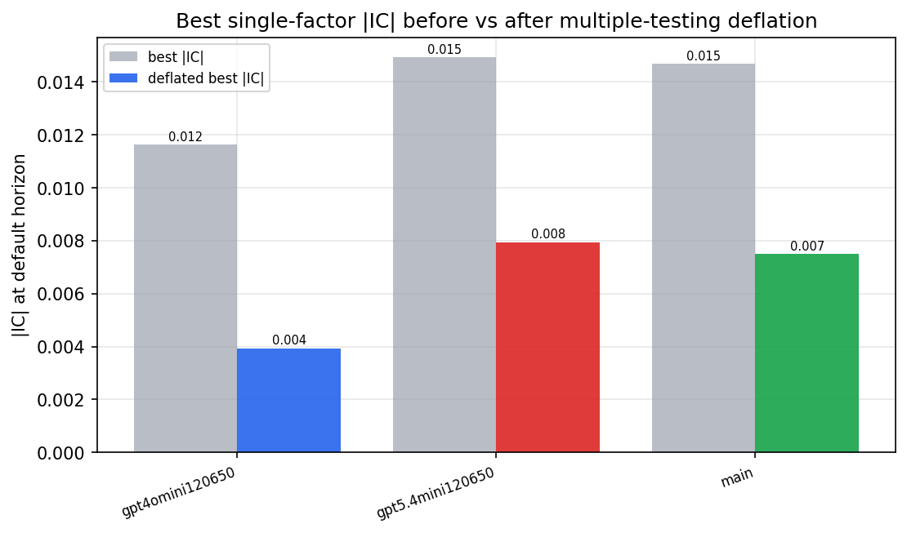

*Best |IC| before vs after multiple-testing deflation*

*Top factors by lasso importance per zoo*

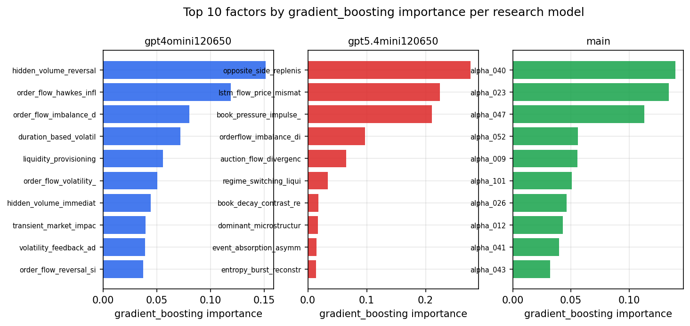

*Top factors by gradient_boosting importance per zoo*

## 4. ML-combined signal — per-underlying vectorised backtest

Each model combines a prerun's factors into ONE signal (fit `factors → forward return` on IS, predict per (bar, underlying)), then that combined signal is run through a simple vectorised backtest — `position(signal) × the underlying's own forward return` — on the held-out OOS tail (+ an equal-weight ensemble). No cross-sectional ranking.

> Config: position=**threshold** (t=1.0, z-score `expanding`), aggregation=**portfolio**, fit-standardise=**per_underlying**, horizon=6.

| prerun | model | n_factors_used | oos_ic | oos_sharpe | is_sharpe | oos_ann_return | oos_max_drawdown |
| --- | --- | --- | --- | --- | --- | --- | --- |
| gpt4omini120650 | linear_regression | 66 | 0.0048 | 0.1511 | 5.9721 | 0.0105 | -0.0159 |
| gpt4omini120650 | ridge | 66 | 0.0045 | 0.4169 | 5.4636 | 0.0288 | -0.0157 |
| gpt4omini120650 | lasso | 66 | nan | nan | nan | nan | nan |
| gpt4omini120650 | elastic_net | 66 | nan | nan | nan | nan | nan |
| gpt4omini120650 | random_forest | 66 | -0.0004 | 1.9209 | 10.5822 | 0.0964 | -0.0101 |
| gpt4omini120650 | gradient_boosting | 66 | -0.0017 | -1.2144 | 10.4701 | -0.0403 | -0.0111 |
| gpt4omini120650 | xgboost | 66 | 0.0041 | -5.0615 | 13.5888 | -0.157 | -0.0146 |
| gpt4omini120650 | lightgbm | 66 | 0.0049 | 0.528 | 23.1644 | 0.0204 | -0.0084 |
| gpt4omini120650 | ensemble | 66 | -0.0052 | 0.0667 | 14.8624 | 0.0041 | -0.0136 |
| gpt5.4mini120650 | linear_regression | 69 | 0.0047 | -2.7637 | 6.9465 | -0.1002 | -0.0169 |
| gpt5.4mini120650 | ridge | 69 | 0.0048 | -2.9216 | 7.1774 | -0.1064 | -0.0169 |
| gpt5.4mini120650 | lasso | 69 | nan | nan | nan | nan | nan |
| gpt5.4mini120650 | elastic_net | 69 | nan | nan | nan | nan | nan |
| gpt5.4mini120650 | random_forest | 69 | 0.0029 | 1.4056 | 5.6061 | 0.0883 | -0.0144 |
| gpt5.4mini120650 | gradient_boosting | 69 | -0.0036 | -0.2168 | 8.1286 | -0.0102 | -0.0136 |
| gpt5.4mini120650 | xgboost | 69 | 0.0007 | -1.9488 | 11.0176 | -0.0987 | -0.0197 |
| gpt5.4mini120650 | lightgbm | 69 | -0.0019 | -3.6463 | 17.0672 | -0.1449 | -0.0173 |
| gpt5.4mini120650 | ensemble | 69 | 0.0007 | 2.3313 | 7.509 | 0.0328 | -0.0041 |
| main | linear_regression | 78 | 0.0074 | -1.6445 | 10.2789 | -0.0487 | -0.0076 |
| main | ridge | 78 | 0.0023 | -3.7724 | 7.9816 | -0.0845 | -0.0076 |
| main | lasso | 78 | nan | nan | nan | nan | nan |
| main | elastic_net | 78 | nan | nan | nan | nan | nan |
| main | random_forest | 78 | 0.0078 | 5.8328 | 13.064 | 0.1233 | -0.0041 |
| main | gradient_boosting | 78 | -0.0045 | 5.4909 | 14.4515 | 0.0761 | -0.0019 |
| main | xgboost | 78 | 0.0043 | 0.8425 | 14.1282 | 0.0143 | -0.0037 |
| main | lightgbm | 78 | 0.0074 | 5.436 | 22.8546 | 0.0889 | -0.0025 |
| main | ensemble | 78 | 0.005 | 3.5361 | 15.2991 | 0.0308 | -0.0011 |

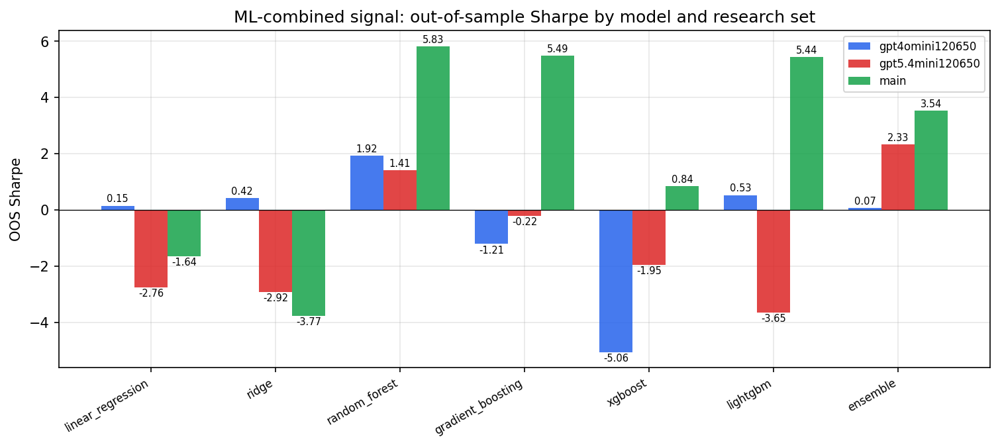

*ML-combined OOS Sharpe by model and research set*

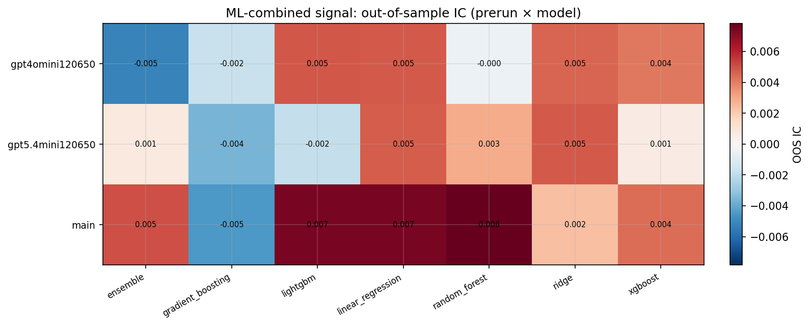

*ML-combined OOS IC (prerun × model)*

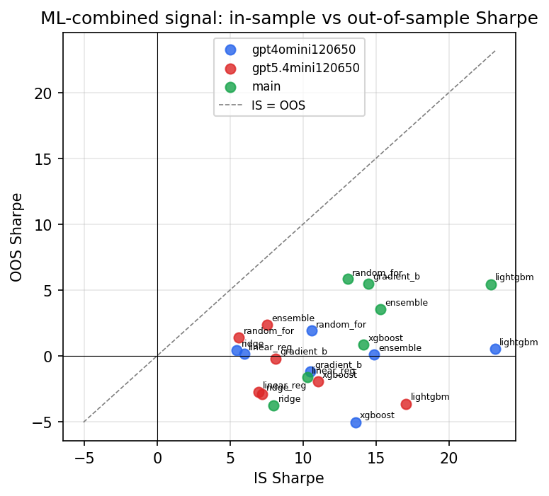

*IS vs OOS Sharpe (overfitting diagnostic)*

---
*Generated by `run_model_comparison.py`. Tables: `*.csv`; interactive: `comparison.ipynb`.*
