# Research-LLM factor comparison — `2026-02`

Comparing the **factor output of different research LLMs** on three axes (raw factor quality → factors as ML features → factors through the full agentic fund). The panel, IS/OOS split, horizon and model hyper-parameters are held identical across preruns — the *only* variable is the factor set.

## Preruns compared

| prerun | research_model | usable_factors | dropped_factors |
| --- | --- | --- | --- |
| gpt4omini120650 | gpt-4o-mini | 66 | 0 |
| gpt5.4mini120650 | gpt-5.4-mini | 69 | 0 |
| main | seed library | 78 | 10 |

> Dropped factors declare fields the current data doesn't have yet (e.g. fundamentals); they light up unchanged once that data is downloaded.

*Usable vs awaiting-data factors per research model*

## Key findings

- **Best ML-combined OOS Sharpe:** `gpt5.4mini120650` with `gradient_boosting` (OOS Sharpe = 5.516).
- **Mean OOS Sharpe across models, by research set:** `gpt4omini120650` = 1.632, `gpt5.4mini120650` = 0.657, `main` = -1.318.
- **Highest mean single-factor |IC| (h=6):** `main` (mean |IC| = 0.0072).
- **Most diverse zoo (highest effective/raw factor ratio):** `gpt5.4mini120650` (eff 52.7 of 69, ratio 0.76).
- **Best selection-deflated single-factor |IC|:** `main` (deflated |IC| = 0.0148 from 38 factors tried).

## 1. Single-factor IC (raw factor quality)

Per-underlying time-series Spearman rank-IC of every researched factor, recomputed on the shared panel at horizons h=1, h=6, h=60. The per-underlying IC correlates each factor's value vector with the underlying's own forward-return vector (pooled across underlyings); the cross-sectional IC ranks across underlyings per timestamp.

| prerun | n_factors | mean_abs_ic_1 | mean_abs_ic_6 | mean_abs_ic_60 | mean_abs_icir_6 | best_factor_h6 | best_abs_ic_h6 |
| --- | --- | --- | --- | --- | --- | --- | --- |
| gpt4omini120650 | 66 | 0.0083 | 0.0051 | 0.0065 | 0.3531 | order_flow_skewness_indicator | 0.0137 |
| gpt5.4mini120650 | 69 | 0.0055 | 0.0049 | 0.0054 | 0.3962 | copula_tail_asymmetry_volatility | 0.0129 |
| main | 78 | 0.0119 | 0.0072 | 0.0041 | 0.4848 | alpha_066 | 0.022 |

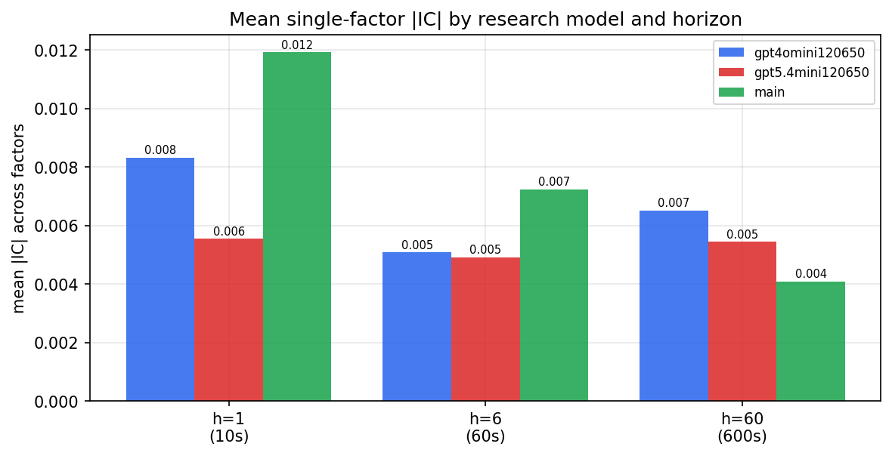

*Mean |IC| by research model and horizon*

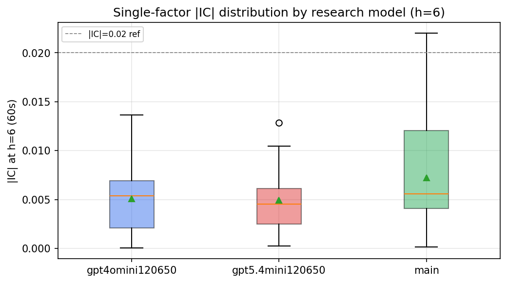

*Per-factor |IC| distribution by research model*

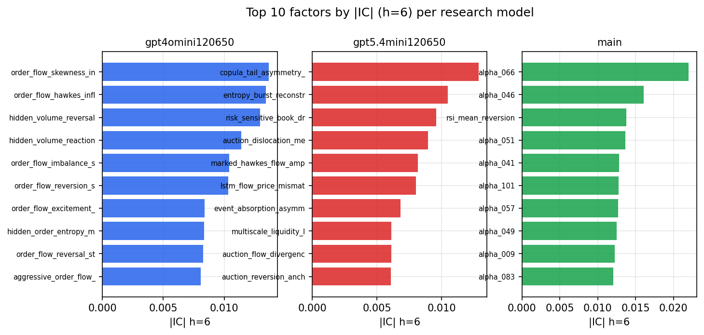

*Top factors by |IC| per research model*

## 2. Factor diversity & redundancy

Pairwise correlation of each zoo's *signals*. `eff_n_factors` is the effective number of independent factors (participation ratio of the correlation eigenvalues); `eff_ratio` and `redundancy` summarise how much unique information the zoo holds vs. how much is duplicated; `n_clusters` groups factors at |corr| ≥ 0.7.

| prerun | n_factors | eff_n_factors | eff_ratio | mean_abs_corr | n_clusters | redundancy |
| --- | --- | --- | --- | --- | --- | --- |
| gpt4omini120650 | 66 | 25.3885 | 0.3847 | 0.0558 | 51 | 0.6153 |
| gpt5.4mini120650 | 69 | 52.7366 | 0.7643 | 0.0111 | 64 | 0.2357 |
| main | 78 | 41.7126 | 0.5348 | 0.0291 | 70 | 0.4652 |

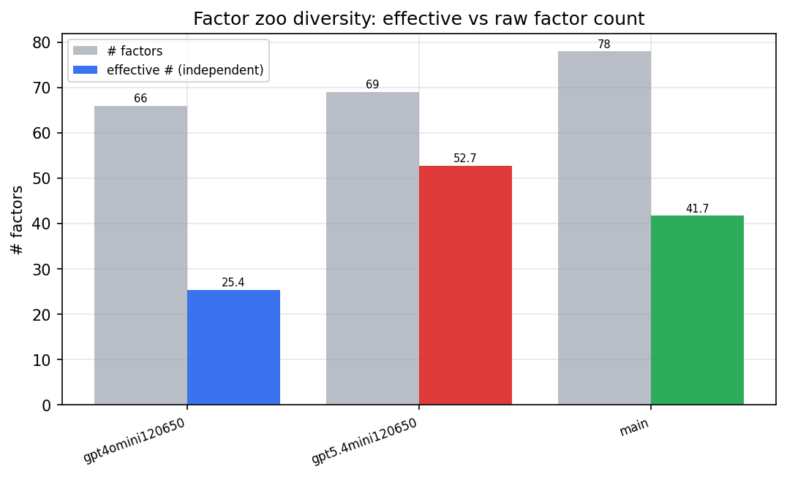

*Effective vs raw factor count per research model*

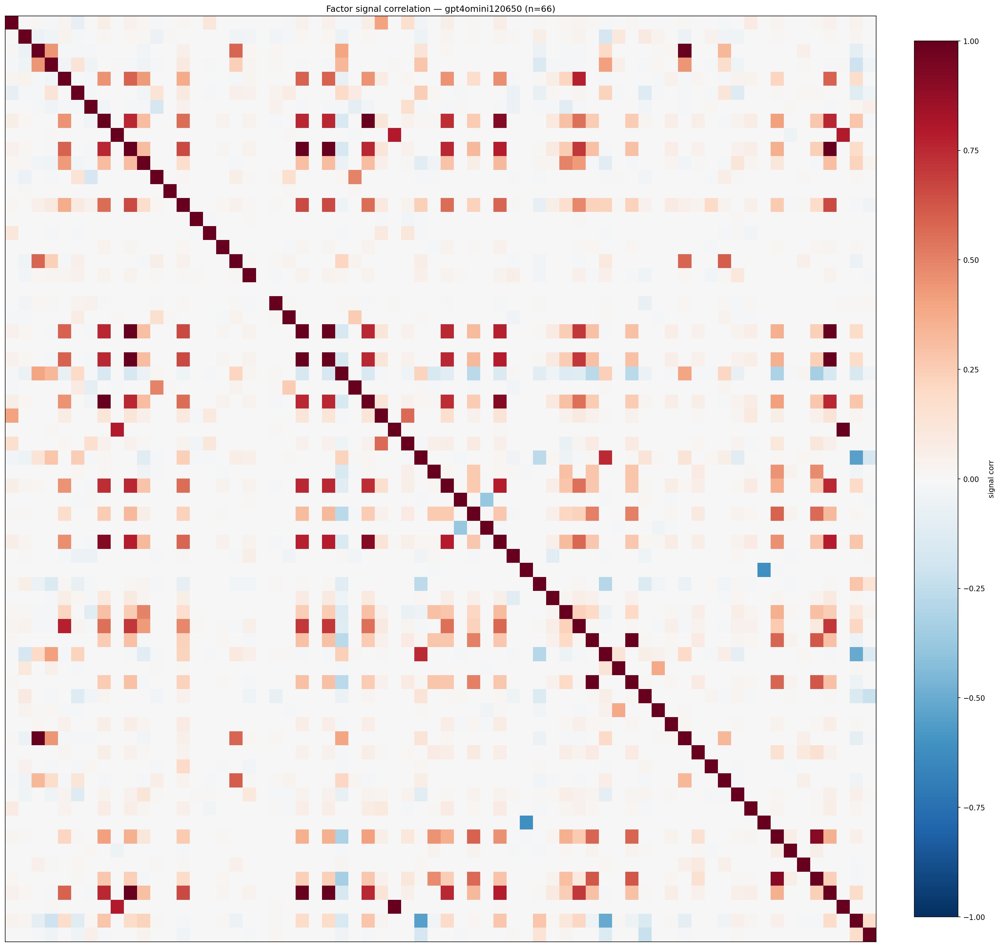

*Signal correlation matrix — gpt4omini120650*

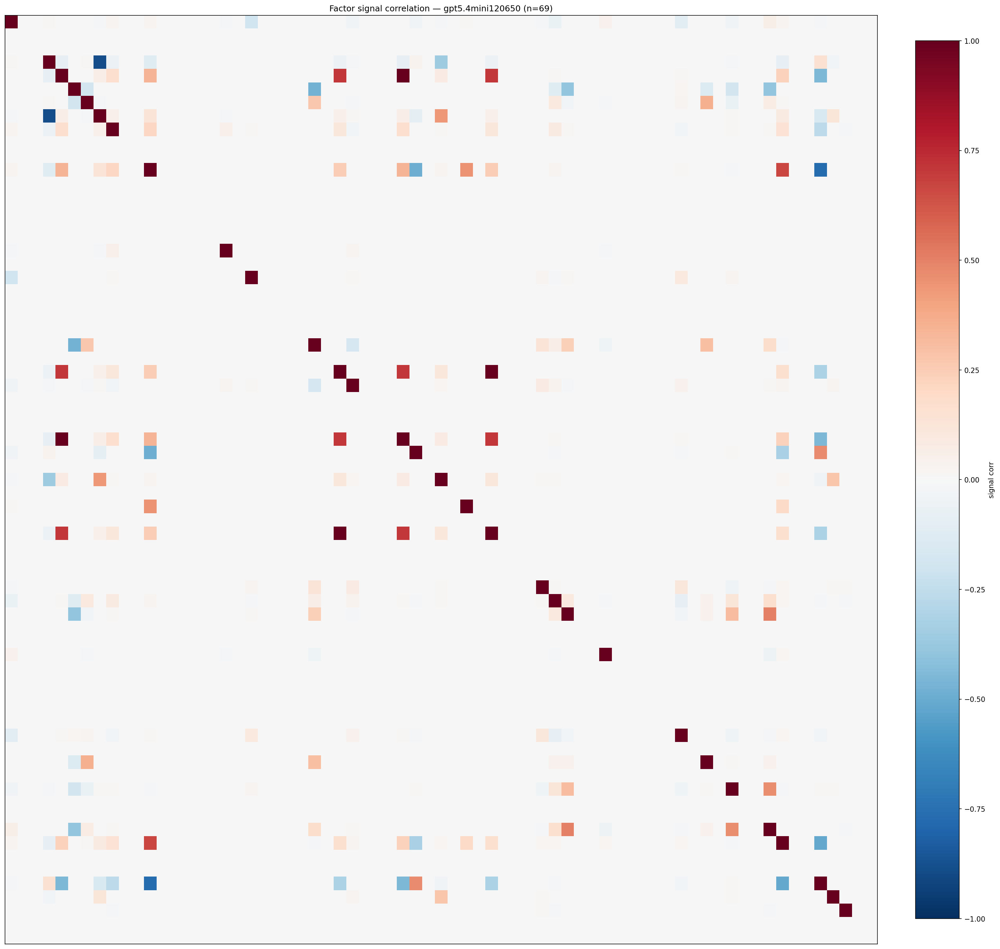

*Signal correlation matrix — gpt5.4mini120650*

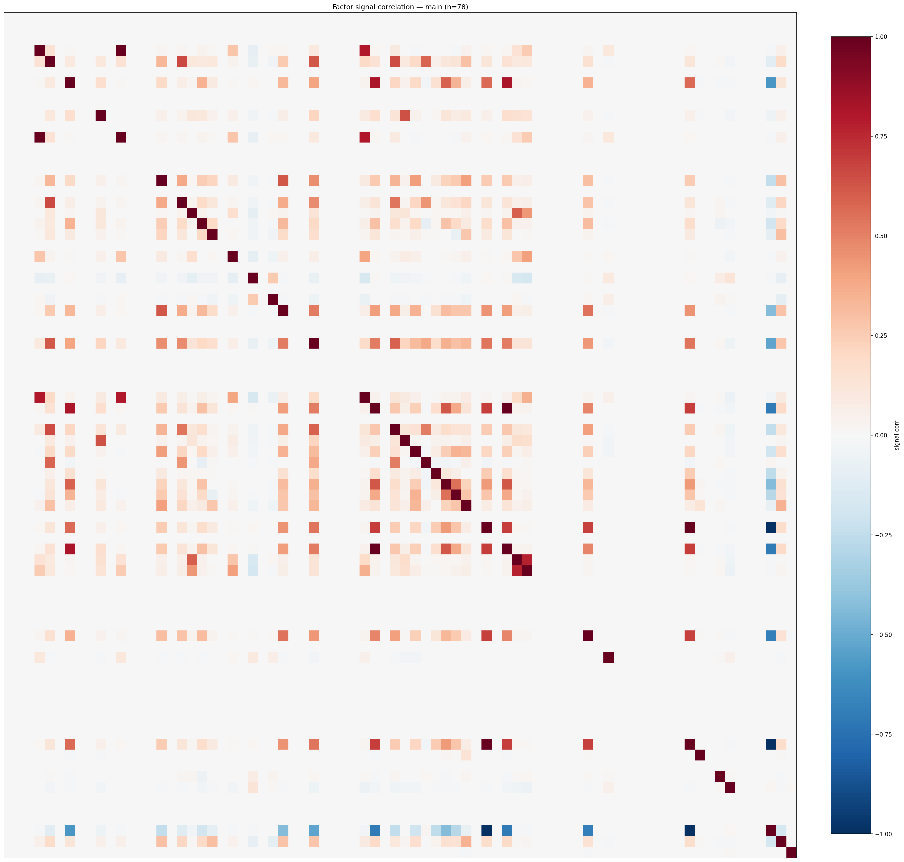

*Signal correlation matrix — main*

## 3. Deflation & model-based importance

`deflated_best_ic` haircuts each zoo's best |IC| for the number of factors tried (`ic_n_tested`) — a bigger zoo's best factor is more likely to be lucky. `lasso_n_nonzero` / `lasso_sparsity` show how many factors a sparse linear model actually keeps (model-view redundancy).

| prerun | best_ic | deflated_best_ic | deflated_best_t | ic_n_tested | ic_n_obs | lasso_n_nonzero | lasso_sparsity |
| --- | --- | --- | --- | --- | --- | --- | --- |
| gpt4omini120650 | 0.0137 | 0.006 | 2.2585 | 64 | 141659 | 0 | 1.0 |
| gpt5.4mini120650 | 0.0129 | 0.0059 | 2.2348 | 30 | 141659 | 0 | 1.0 |
| main | 0.022 | 0.0148 | 5.58 | 38 | 141659 | 0 | 1.0 |

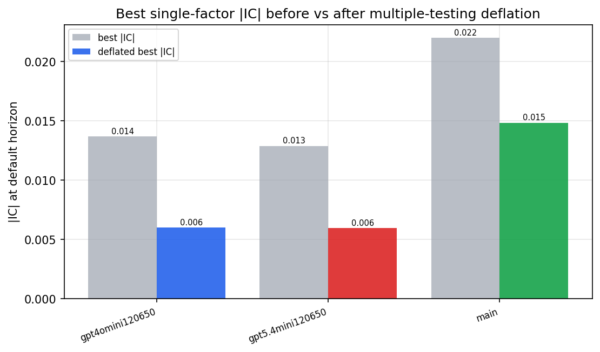

*Best |IC| before vs after multiple-testing deflation*

*Top factors by lasso importance per zoo*

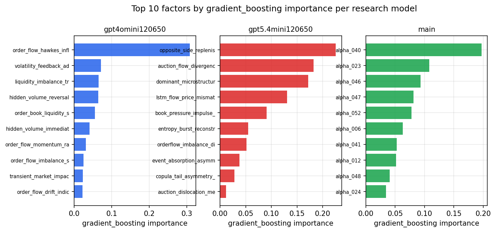

*Top factors by gradient_boosting importance per zoo*

## 4. ML-combined signal — per-underlying vectorised backtest

Each model combines a prerun's factors into ONE signal (fit `factors → forward return` on IS, predict per (bar, underlying)), then that combined signal is run through a simple vectorised backtest — `position(signal) × the underlying's own forward return` — on the held-out OOS tail (+ an equal-weight ensemble). No cross-sectional ranking.

> Config: position=**threshold** (t=1.0, z-score `expanding`), aggregation=**portfolio**, fit-standardise=**per_underlying**, horizon=6.

| prerun | model | n_factors_used | oos_ic | oos_sharpe | is_sharpe | oos_ann_return | oos_max_drawdown |
| --- | --- | --- | --- | --- | --- | --- | --- |
| gpt4omini120650 | linear_regression | 66 | 0.0046 | 0.4129 | 6.167 | 0.0217 | -0.0129 |
| gpt4omini120650 | ridge | 66 | 0.0043 | 1.568 | 5.384 | 0.0844 | -0.0105 |
| gpt4omini120650 | lasso | 66 | nan | nan | nan | nan | nan |
| gpt4omini120650 | elastic_net | 66 | nan | nan | nan | nan | nan |
| gpt4omini120650 | random_forest | 66 | -0.0046 | 0.9207 | 10.9592 | 0.0625 | -0.0185 |
| gpt4omini120650 | gradient_boosting | 66 | 0.0069 | 5.1483 | 9.3643 | 0.1803 | -0.0045 |
| gpt4omini120650 | xgboost | 66 | -0.0035 | 2.0273 | 13.1991 | 0.1107 | -0.0132 |
| gpt4omini120650 | lightgbm | 66 | 0.0043 | -0.9452 | 20.6517 | -0.0475 | -0.0157 |
| gpt4omini120650 | ensemble | 66 | 0.0068 | 2.2933 | 14.0187 | 0.136 | -0.0139 |
| gpt5.4mini120650 | linear_regression | 69 | -0.0021 | -2.1734 | 8.0704 | -0.1427 | -0.0186 |
| gpt5.4mini120650 | ridge | 69 | -0.0016 | -1.8736 | 8.0078 | -0.1266 | -0.0206 |
| gpt5.4mini120650 | lasso | 69 | -0.0038 | -0.7027 | 5.4087 | -0.0473 | -0.0148 |
| gpt5.4mini120650 | elastic_net | 69 | -0.0039 | -0.8535 | 5.3492 | -0.0579 | -0.0152 |
| gpt5.4mini120650 | random_forest | 69 | 0.0067 | 3.389 | 7.5324 | 0.1804 | -0.0087 |
| gpt5.4mini120650 | gradient_boosting | 69 | 0.0043 | 5.5161 | 8.9624 | 0.1965 | -0.0037 |
| gpt5.4mini120650 | xgboost | 69 | 0.0077 | 2.32 | 11.6309 | 0.1035 | -0.0091 |
| gpt5.4mini120650 | lightgbm | 69 | -0.0053 | -0.6227 | 16.1093 | -0.0244 | -0.0096 |
| gpt5.4mini120650 | ensemble | 69 | -0.0004 | 0.9141 | 10.9357 | 0.0578 | -0.015 |
| main | linear_regression | 78 | -0.006 | -4.1518 | 8.2479 | -0.205 | -0.02 |
| main | ridge | 78 | -0.0069 | -4.7564 | 8.0811 | -0.2323 | -0.0194 |
| main | lasso | 78 | 0.0016 | -3.6094 | 3.8439 | -0.1434 | -0.0161 |
| main | elastic_net | 78 | 0.0016 | -3.2814 | 3.7851 | -0.1305 | -0.0153 |
| main | random_forest | 78 | 0.0033 | 2.8274 | 12.8447 | 0.1081 | -0.0074 |
| main | gradient_boosting | 78 | 0.0042 | -0.7578 | 16.0005 | -0.0218 | -0.0074 |
| main | xgboost | 78 | -0.002 | 0.2144 | 17.5948 | 0.0072 | -0.0111 |
| main | lightgbm | 78 | 0.0002 | 1.6699 | 26.5164 | 0.0502 | -0.0056 |
| main | ensemble | 78 | -0.0031 | -0.0129 | 16.2164 | -0.0005 | -0.0106 |

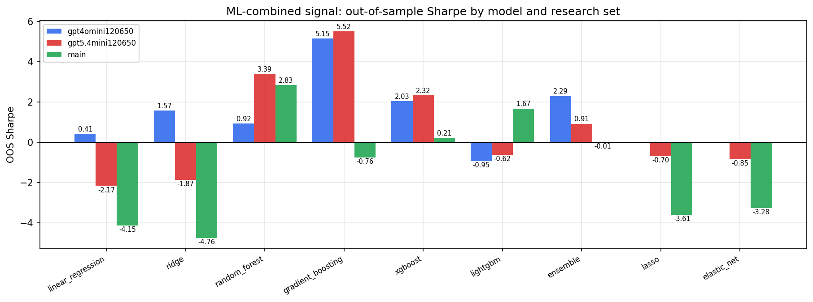

*ML-combined OOS Sharpe by model and research set*

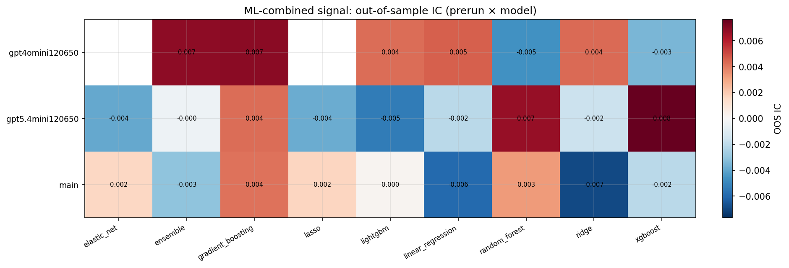

*ML-combined OOS IC (prerun × model)*

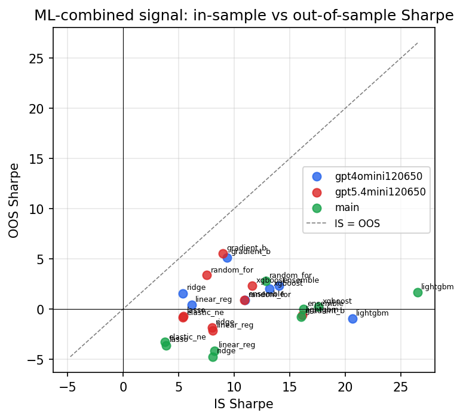

*IS vs OOS Sharpe (overfitting diagnostic)*

---
*Generated by `run_model_comparison.py`. Tables: `*.csv`; interactive: `comparison.ipynb`.*
