# Research-LLM factor comparison — `2026-03`

Comparing the **factor output of different research LLMs** on three axes (raw factor quality → factors as ML features → factors through the full agentic fund). The panel, IS/OOS split, horizon and model hyper-parameters are held identical across preruns — the *only* variable is the factor set.

## Preruns compared

| prerun | research_model | usable_factors | dropped_factors |
| --- | --- | --- | --- |
| gpt4omini120650 | gpt-4o-mini | 66 | 0 |
| gpt5.4mini120650 | gpt-5.4-mini | 69 | 0 |
| main | seed library | 78 | 10 |

> Dropped factors declare fields the current data doesn't have yet (e.g. fundamentals); they light up unchanged once that data is downloaded.

*Usable vs awaiting-data factors per research model*

## Key findings

- **Best ML-combined OOS Sharpe:** `gpt4omini120650` with `lightgbm` (OOS Sharpe = 8.176).
- **Mean OOS Sharpe across models, by research set:** `gpt4omini120650` = 4.900, `gpt5.4mini120650` = 2.233, `main` = -1.331.
- **Highest mean single-factor |IC| (h=6):** `main` (mean |IC| = 0.0067).
- **Most diverse zoo (highest effective/raw factor ratio):** `gpt5.4mini120650` (eff 52.4 of 69, ratio 0.76).
- **Best selection-deflated single-factor |IC|:** `gpt4omini120650` (deflated |IC| = 0.0192 from 64 factors tried).

## 1. Single-factor IC (raw factor quality)

Per-underlying time-series Spearman rank-IC of every researched factor, recomputed on the shared panel at horizons h=1, h=6, h=60. The per-underlying IC correlates each factor's value vector with the underlying's own forward-return vector (pooled across underlyings); the cross-sectional IC ranks across underlyings per timestamp.

| prerun | n_factors | mean_abs_ic_1 | mean_abs_ic_6 | mean_abs_ic_60 | mean_abs_icir_6 | best_factor_h6 | best_abs_ic_h6 |
| --- | --- | --- | --- | --- | --- | --- | --- |
| gpt4omini120650 | 66 | 0.0103 | 0.006 | 0.0071 | 0.3619 | order_flow_skewness_indicator | 0.0269 |
| gpt5.4mini120650 | 69 | 0.0062 | 0.0052 | 0.007 | 0.2853 | queue_clog_clearing_reversion | 0.0133 |
| main | 78 | 0.0147 | 0.0067 | 0.0033 | 0.3807 | alpha_066 | 0.0209 |

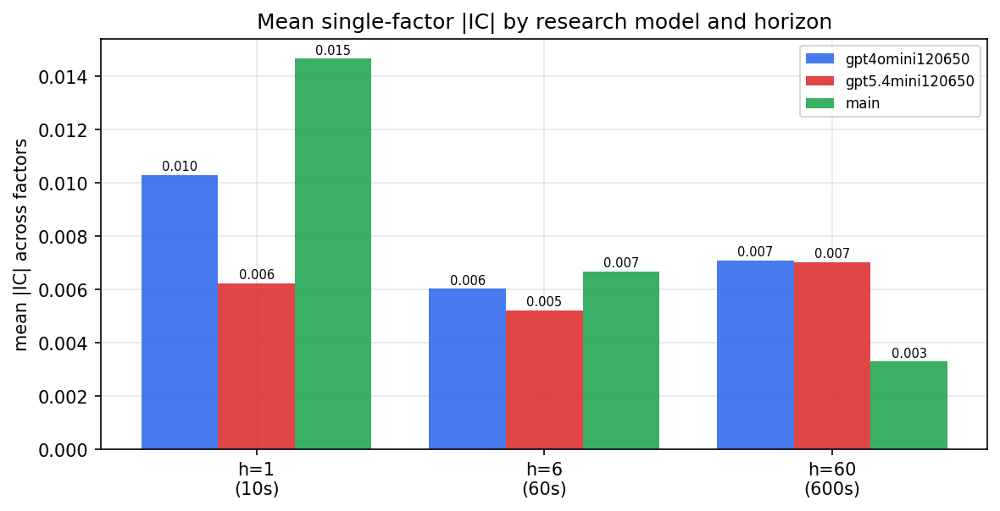

*Mean |IC| by research model and horizon*

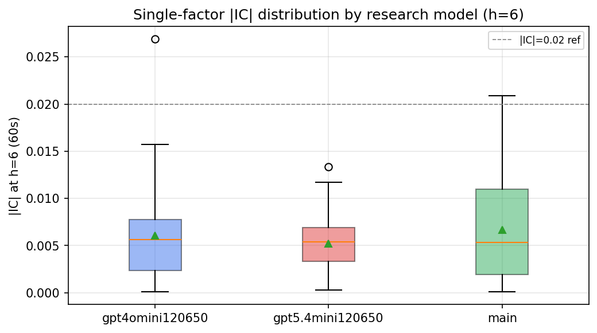

*Per-factor |IC| distribution by research model*

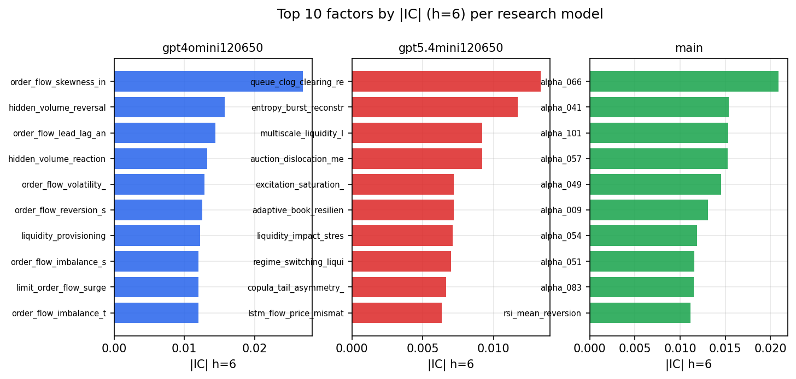

*Top factors by |IC| per research model*

## 2. Factor diversity & redundancy

Pairwise correlation of each zoo's *signals*. `eff_n_factors` is the effective number of independent factors (participation ratio of the correlation eigenvalues); `eff_ratio` and `redundancy` summarise how much unique information the zoo holds vs. how much is duplicated; `n_clusters` groups factors at |corr| ≥ 0.7.

| prerun | n_factors | eff_n_factors | eff_ratio | mean_abs_corr | n_clusters | redundancy |
| --- | --- | --- | --- | --- | --- | --- |
| gpt4omini120650 | 66 | 24.0572 | 0.3645 | 0.0598 | 51 | 0.6355 |
| gpt5.4mini120650 | 69 | 52.4433 | 0.76 | 0.0114 | 64 | 0.24 |
| main | 78 | 41.996 | 0.5384 | 0.0289 | 70 | 0.4616 |

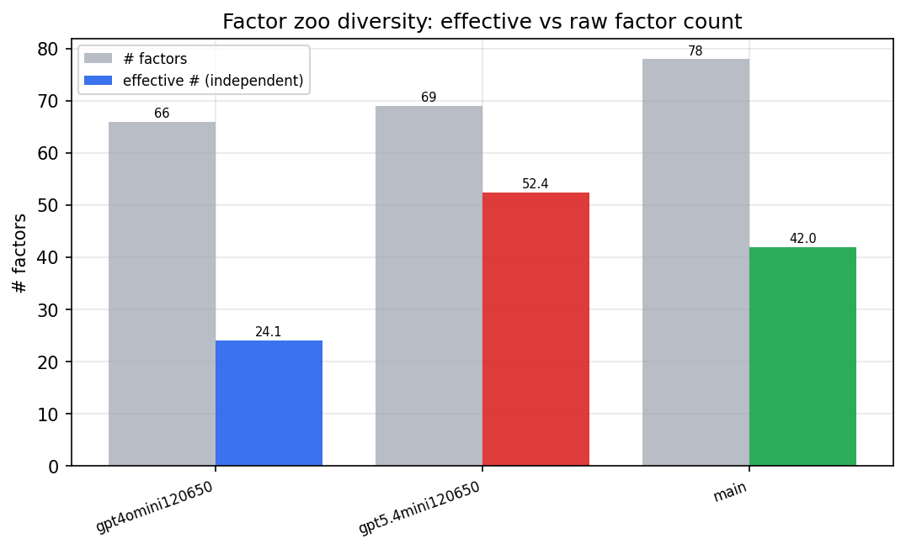

*Effective vs raw factor count per research model*

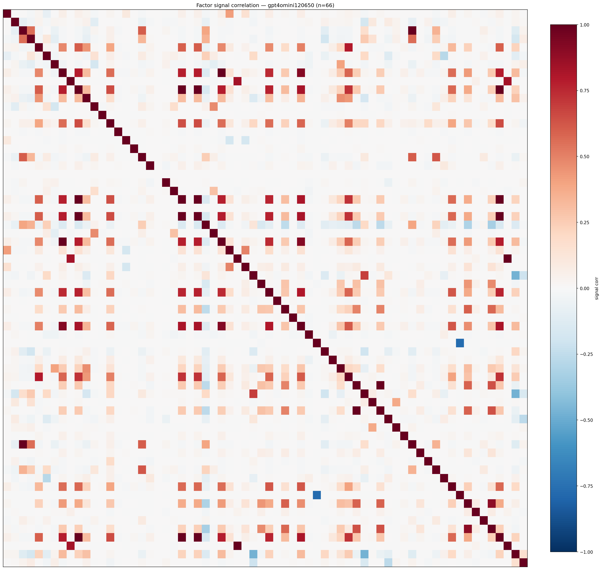

*Signal correlation matrix — gpt4omini120650*

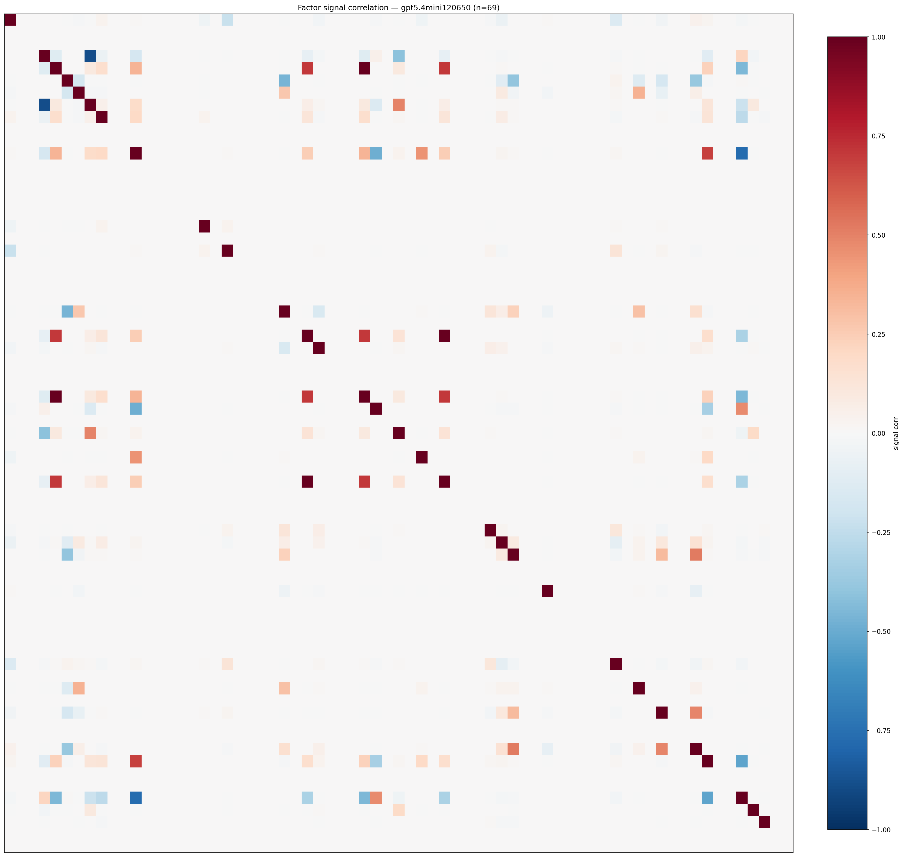

*Signal correlation matrix — gpt5.4mini120650*

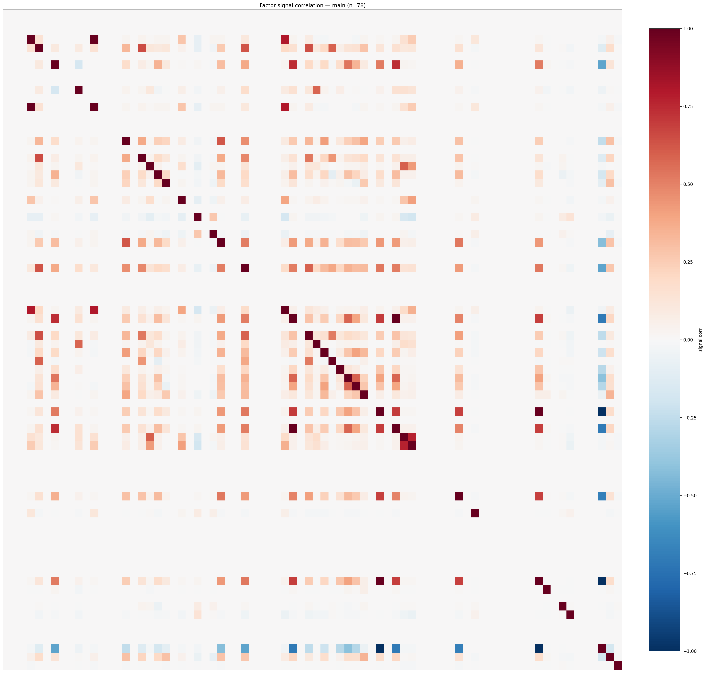

*Signal correlation matrix — main*

## 3. Deflation & model-based importance

`deflated_best_ic` haircuts each zoo's best |IC| for the number of factors tried (`ic_n_tested`) — a bigger zoo's best factor is more likely to be lucky. `lasso_n_nonzero` / `lasso_sparsity` show how many factors a sparse linear model actually keeps (model-view redundancy).

| prerun | best_ic | deflated_best_ic | deflated_best_t | ic_n_tested | ic_n_obs | lasso_n_nonzero | lasso_sparsity |
| --- | --- | --- | --- | --- | --- | --- | --- |
| gpt4omini120650 | 0.0269 | 0.0192 | 7.2711 | 64 | 142739 | 0 | 1.0 |
| gpt5.4mini120650 | 0.0133 | 0.0064 | 2.4245 | 30 | 142739 | 0 | 1.0 |
| main | 0.0209 | 0.0137 | 5.1901 | 38 | 142739 | 0 | 1.0 |

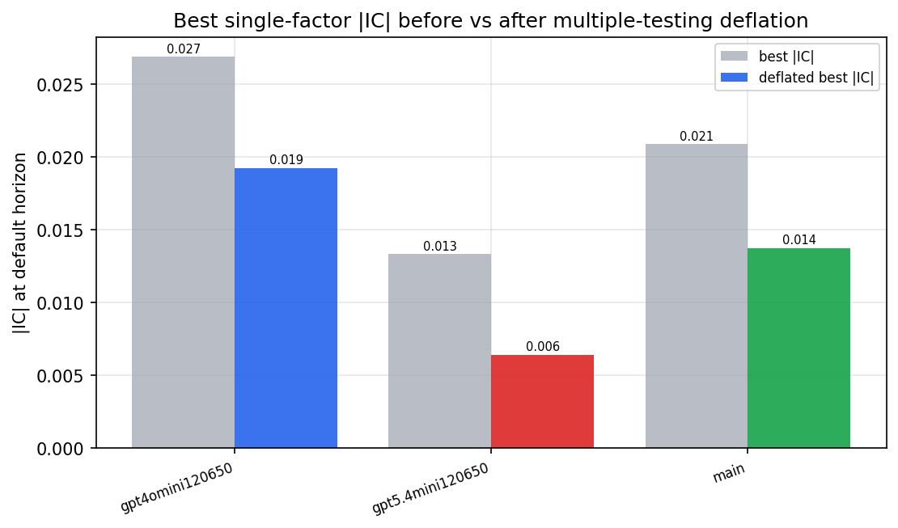

*Best |IC| before vs after multiple-testing deflation*

*Top factors by lasso importance per zoo*

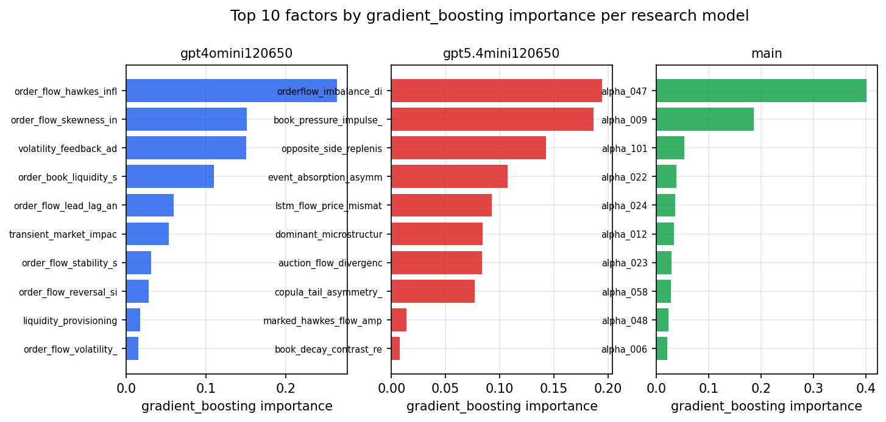

*Top factors by gradient_boosting importance per zoo*

## 4. ML-combined signal — per-underlying vectorised backtest

Each model combines a prerun's factors into ONE signal (fit `factors → forward return` on IS, predict per (bar, underlying)), then that combined signal is run through a simple vectorised backtest — `position(signal) × the underlying's own forward return` — on the held-out OOS tail (+ an equal-weight ensemble). No cross-sectional ranking.

> Config: position=**threshold** (t=1.0, z-score `expanding`), aggregation=**portfolio**, fit-standardise=**per_underlying**, horizon=6.

| prerun | model | n_factors_used | oos_ic | oos_sharpe | is_sharpe | oos_ann_return | oos_max_drawdown |
| --- | --- | --- | --- | --- | --- | --- | --- |
| gpt4omini120650 | linear_regression | 66 | -0.0009 | 4.3033 | 7.6717 | 0.4677 | -0.021 |
| gpt4omini120650 | ridge | 66 | 0.002 | 3.7656 | 7.1996 | 0.3923 | -0.0215 |
| gpt4omini120650 | lasso | 66 | nan | nan | nan | nan | nan |
| gpt4omini120650 | elastic_net | 66 | nan | nan | nan | nan | nan |
| gpt4omini120650 | random_forest | 66 | -0.0143 | 0.0961 | 14.1561 | 0.0138 | -0.0365 |
| gpt4omini120650 | gradient_boosting | 66 | 0.0129 | 5.399 | 10.2702 | 0.2881 | -0.0051 |
| gpt4omini120650 | xgboost | 66 | -0.0017 | 7.7907 | 17.0475 | 0.7086 | -0.007 |
| gpt4omini120650 | lightgbm | 66 | -0.001 | 8.1763 | 24.3542 | 0.7469 | -0.0069 |
| gpt4omini120650 | ensemble | 66 | -0.0059 | 4.7721 | 19.0704 | 0.4859 | -0.0131 |
| gpt5.4mini120650 | linear_regression | 69 | 0.0074 | 0.3966 | 5.7437 | 0.024 | -0.0272 |
| gpt5.4mini120650 | ridge | 69 | 0.0073 | 0.9053 | 5.551 | 0.0543 | -0.0292 |
| gpt5.4mini120650 | lasso | 69 | nan | nan | nan | nan | nan |
| gpt5.4mini120650 | elastic_net | 69 | nan | nan | nan | nan | nan |
| gpt5.4mini120650 | random_forest | 69 | 0.0093 | -0.3744 | 12.5781 | -0.0226 | -0.021 |
| gpt5.4mini120650 | gradient_boosting | 69 | -0.0058 | 1.3279 | 10.5697 | 0.0379 | -0.0063 |
| gpt5.4mini120650 | xgboost | 69 | 0.0028 | 2.5627 | 13.3339 | 0.1173 | -0.0144 |
| gpt5.4mini120650 | lightgbm | 69 | 0.0116 | 7.287 | 20.3118 | 0.3862 | -0.0098 |
| gpt5.4mini120650 | ensemble | 69 | 0.0087 | 3.5233 | 15.5005 | 0.1692 | -0.007 |
| main | linear_regression | 78 | 0.0104 | -0.0211 | 9.9255 | -0.0002 | -0.0046 |
| main | ridge | 78 | 0.01 | -3.4779 | 11.0125 | -0.1535 | -0.0175 |
| main | lasso | 78 | nan | nan | nan | nan | nan |
| main | elastic_net | 78 | nan | nan | nan | nan | nan |
| main | random_forest | 78 | 0.0061 | 2.1731 | 21.8505 | 0.1133 | -0.0152 |
| main | gradient_boosting | 78 | 0.0085 | -1.9507 | 20.724 | -0.0793 | -0.0141 |
| main | xgboost | 78 | 0.005 | 0.1355 | 27.0871 | 0.0082 | -0.0214 |
| main | lightgbm | 78 | -0.0003 | -4.7111 | 34.7964 | -0.2129 | -0.0264 |
| main | ensemble | 78 | 0.0068 | -1.4621 | 27.3272 | -0.076 | -0.0182 |

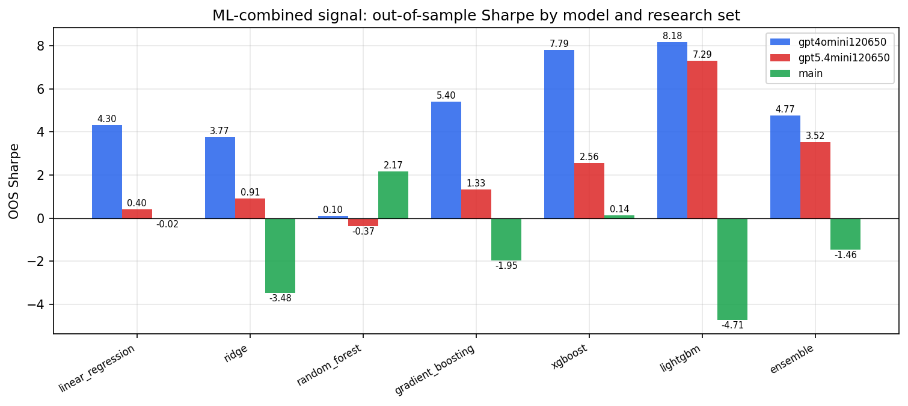

*ML-combined OOS Sharpe by model and research set*

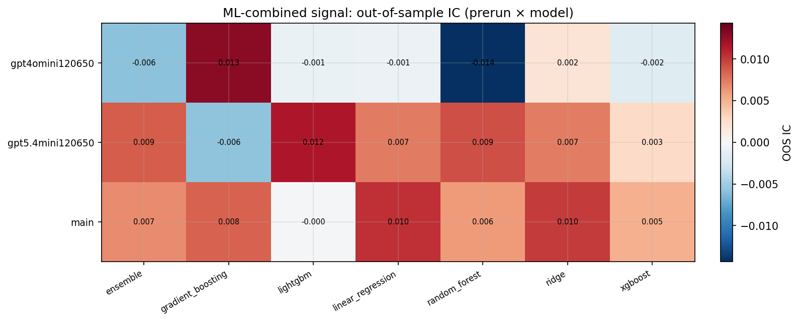

*ML-combined OOS IC (prerun × model)*

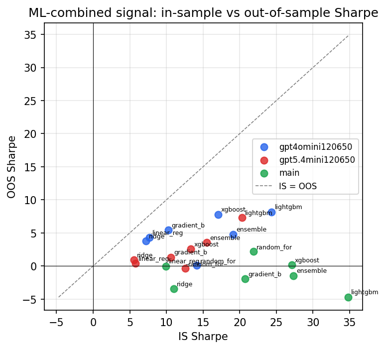

*IS vs OOS Sharpe (overfitting diagnostic)*

---
*Generated by `run_model_comparison.py`. Tables: `*.csv`; interactive: `comparison.ipynb`.*
