# Research-LLM factor comparison — `2026-04`

Comparing the **factor output of different research LLMs** on three axes (raw factor quality → factors as ML features → factors through the full agentic fund). The panel, IS/OOS split, horizon and model hyper-parameters are held identical across preruns — the *only* variable is the factor set.

## Preruns compared

| prerun | research_model | usable_factors | dropped_factors |
| --- | --- | --- | --- |
| gpt4omini120650 | gpt-4o-mini | 66 | 0 |
| gpt5.4mini120650 | gpt-5.4-mini | 69 | 0 |
| main | seed library | 78 | 10 |

> Dropped factors declare fields the current data doesn't have yet (e.g. fundamentals); they light up unchanged once that data is downloaded.

*Usable vs awaiting-data factors per research model*

## Key findings

- **Best ML-combined OOS Sharpe:** `gpt5.4mini120650` with `ensemble` (OOS Sharpe = 6.154).
- **Mean OOS Sharpe across models, by research set:** `gpt5.4mini120650` = 3.092, `main` = 2.360, `gpt4omini120650` = -4.858.
- **Highest mean single-factor |IC| (h=6):** `main` (mean |IC| = 0.0072).
- **Most diverse zoo (highest effective/raw factor ratio):** `gpt5.4mini120650` (eff 53.3 of 69, ratio 0.77).
- **Best selection-deflated single-factor |IC|:** `main` (deflated |IC| = 0.0105 from 38 factors tried).

## 1. Single-factor IC (raw factor quality)

Per-underlying time-series Spearman rank-IC of every researched factor, recomputed on the shared panel at horizons h=1, h=6, h=60. The per-underlying IC correlates each factor's value vector with the underlying's own forward-return vector (pooled across underlyings); the cross-sectional IC ranks across underlyings per timestamp.

| prerun | n_factors | mean_abs_ic_1 | mean_abs_ic_6 | mean_abs_ic_60 | mean_abs_icir_6 | best_factor_h6 | best_abs_ic_h6 |
| --- | --- | --- | --- | --- | --- | --- | --- |
| gpt4omini120650 | 66 | 0.0093 | 0.0055 | 0.0069 | 0.3165 | hidden_volume_reversal_strength | 0.0138 |
| gpt5.4mini120650 | 69 | 0.006 | 0.0054 | 0.009 | 0.2812 | marked_hawkes_flow_amplification | 0.0128 |
| main | 78 | 0.0139 | 0.0072 | 0.004 | 0.414 | alpha_066 | 0.0175 |

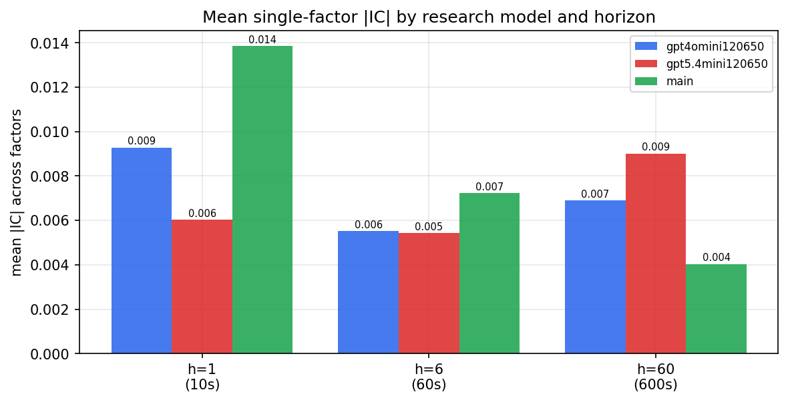

*Mean |IC| by research model and horizon*

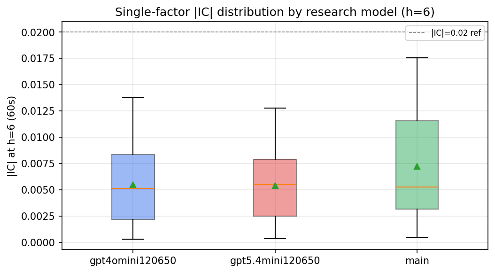

*Per-factor |IC| distribution by research model*

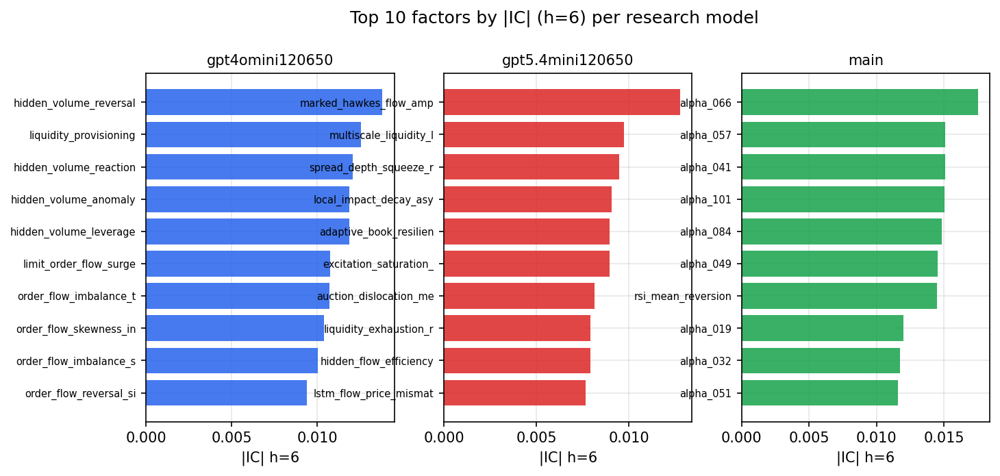

*Top factors by |IC| per research model*

## 2. Factor diversity & redundancy

Pairwise correlation of each zoo's *signals*. `eff_n_factors` is the effective number of independent factors (participation ratio of the correlation eigenvalues); `eff_ratio` and `redundancy` summarise how much unique information the zoo holds vs. how much is duplicated; `n_clusters` groups factors at |corr| ≥ 0.7.

| prerun | n_factors | eff_n_factors | eff_ratio | mean_abs_corr | n_clusters | redundancy |
| --- | --- | --- | --- | --- | --- | --- |
| gpt4omini120650 | 66 | 25.7653 | 0.3904 | 0.0534 | 51 | 0.6096 |
| gpt5.4mini120650 | 69 | 53.2809 | 0.7722 | 0.0105 | 64 | 0.2278 |
| main | 78 | 42.6247 | 0.5465 | 0.0281 | 71 | 0.4535 |

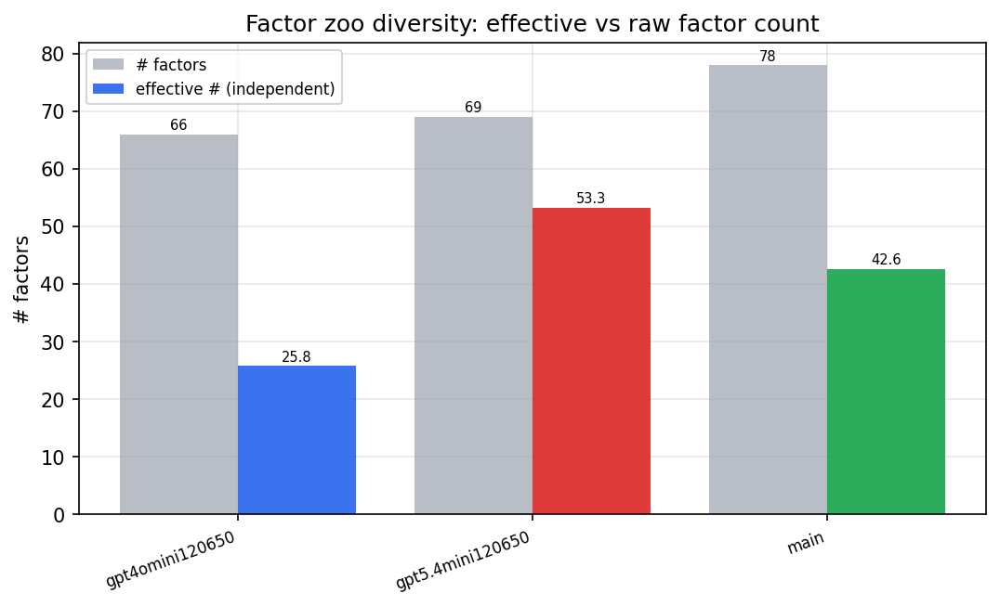

*Effective vs raw factor count per research model*

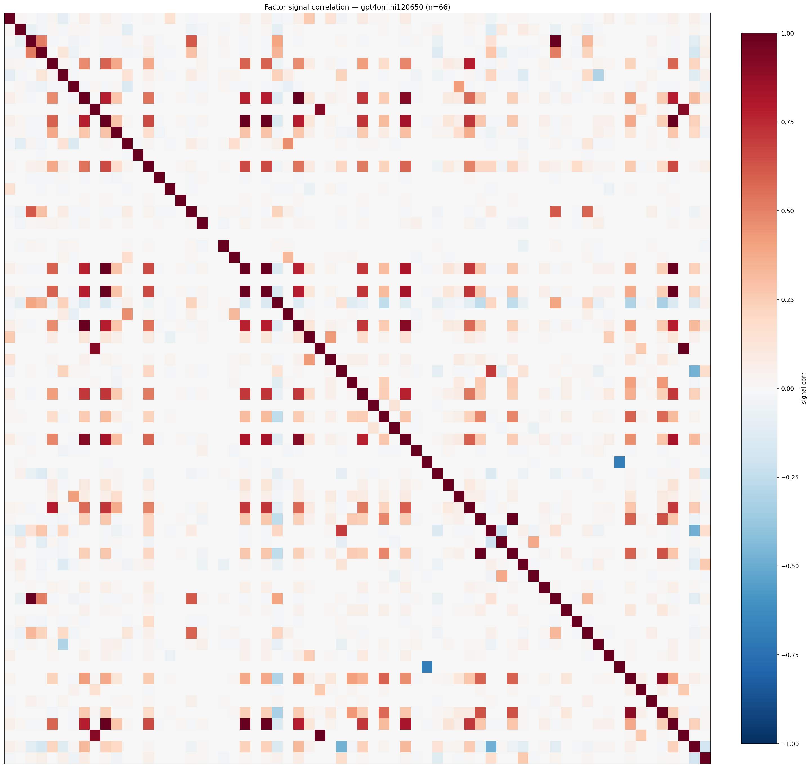

*Signal correlation matrix — gpt4omini120650*

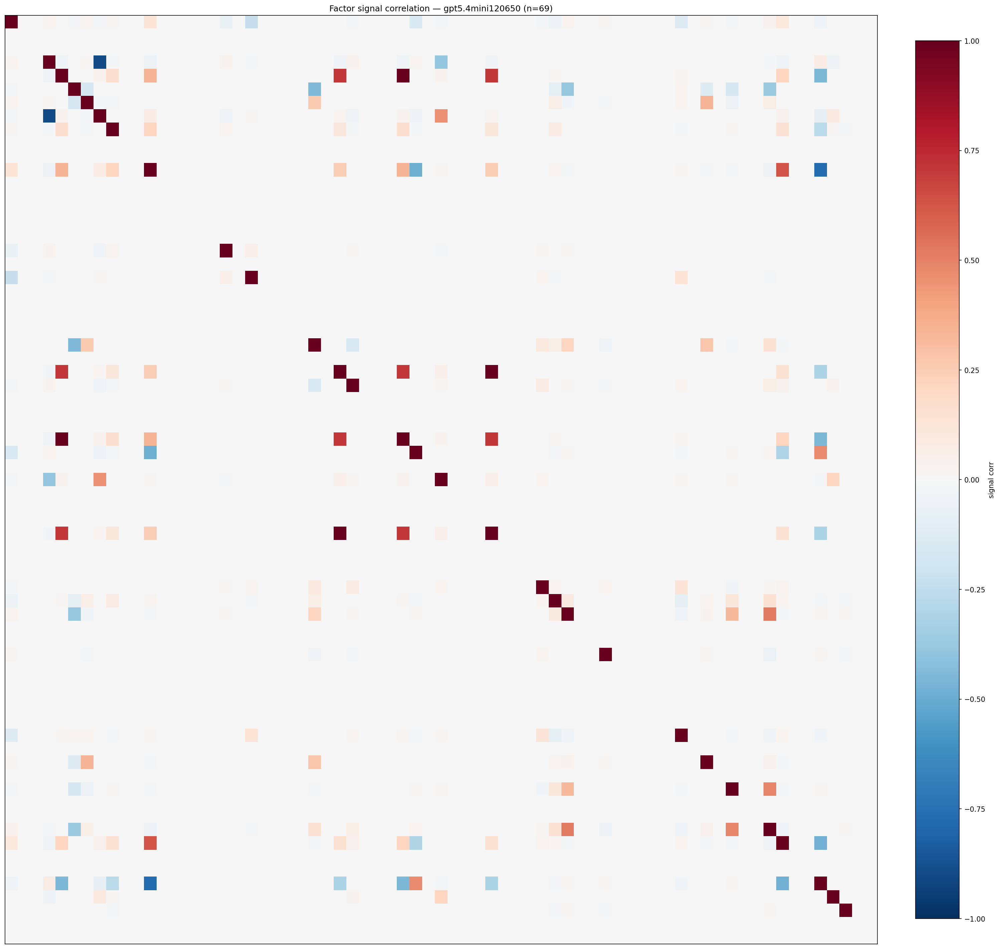

*Signal correlation matrix — gpt5.4mini120650*

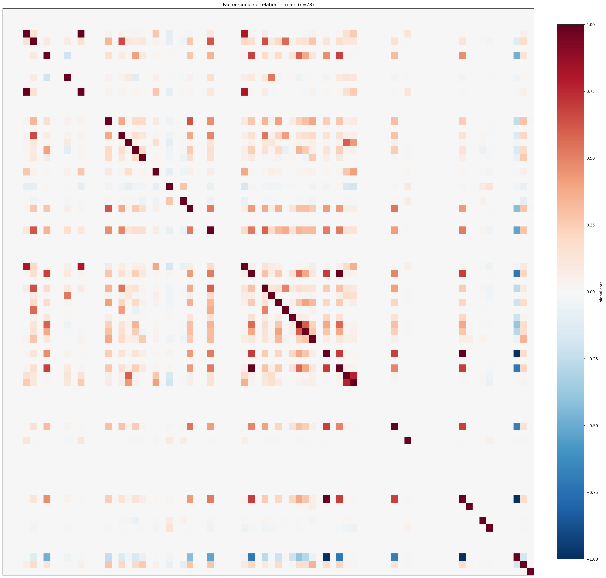

*Signal correlation matrix — main*

## 3. Deflation & model-based importance

`deflated_best_ic` haircuts each zoo's best |IC| for the number of factors tried (`ic_n_tested`) — a bigger zoo's best factor is more likely to be lucky. `lasso_n_nonzero` / `lasso_sparsity` show how many factors a sparse linear model actually keeps (model-view redundancy).

| prerun | best_ic | deflated_best_ic | deflated_best_t | ic_n_tested | ic_n_obs | lasso_n_nonzero | lasso_sparsity |
| --- | --- | --- | --- | --- | --- | --- | --- |
| gpt4omini120650 | 0.0138 | 0.0062 | 2.3689 | 64 | 145079 | 0 | 1.0 |
| gpt5.4mini120650 | 0.0128 | 0.0059 | 2.2583 | 30 | 145079 | 0 | 1.0 |
| main | 0.0175 | 0.0105 | 3.986 | 38 | 145079 | 0 | 1.0 |

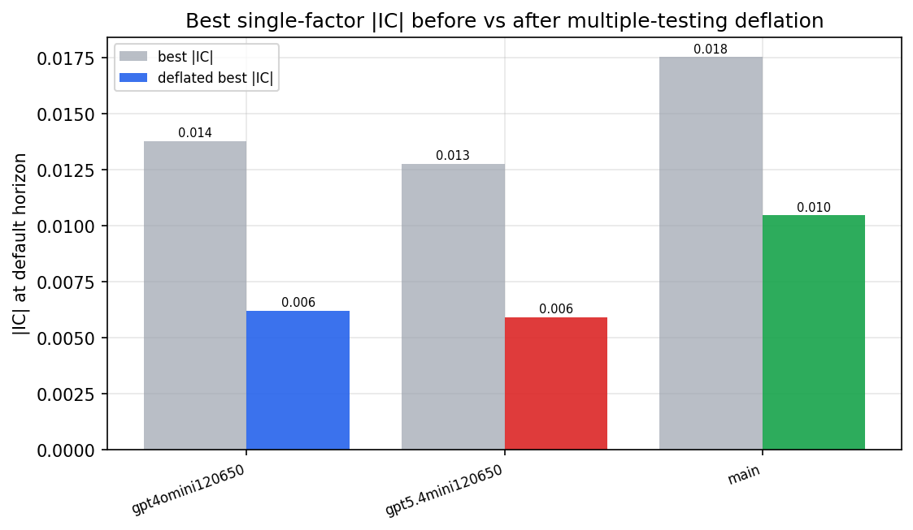

*Best |IC| before vs after multiple-testing deflation*

*Top factors by lasso importance per zoo*

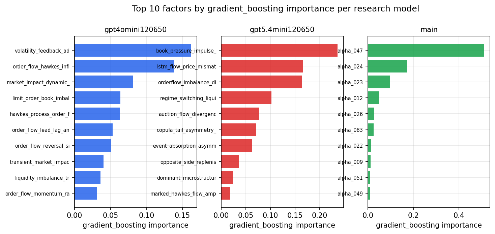

*Top factors by gradient_boosting importance per zoo*

## 4. ML-combined signal — per-underlying vectorised backtest

Each model combines a prerun's factors into ONE signal (fit `factors → forward return` on IS, predict per (bar, underlying)), then that combined signal is run through a simple vectorised backtest — `position(signal) × the underlying's own forward return` — on the held-out OOS tail (+ an equal-weight ensemble). No cross-sectional ranking.

> Config: position=**threshold** (t=1.0, z-score `expanding`), aggregation=**portfolio**, fit-standardise=**per_underlying**, horizon=6.

| prerun | model | n_factors_used | oos_ic | oos_sharpe | is_sharpe | oos_ann_return | oos_max_drawdown |
| --- | --- | --- | --- | --- | --- | --- | --- |
| gpt4omini120650 | linear_regression | 66 | -0.0115 | -5.9215 | 6.2127 | -0.4018 | -0.0354 |
| gpt4omini120650 | ridge | 66 | -0.0128 | -6.6132 | 6.2479 | -0.4584 | -0.0405 |
| gpt4omini120650 | lasso | 66 | 0.0023 | -4.7034 | 3.9785 | -0.2596 | -0.0279 |
| gpt4omini120650 | elastic_net | 66 | 0.0023 | -4.7034 | 3.9785 | -0.2596 | -0.0279 |
| gpt4omini120650 | random_forest | 66 | 0.0101 | -5.3892 | 10.7284 | -0.3787 | -0.0366 |
| gpt4omini120650 | gradient_boosting | 66 | 0.008 | -3.7467 | 9.4494 | -0.0959 | -0.01 |
| gpt4omini120650 | xgboost | 66 | 0.0034 | -5.7232 | 15.0256 | -0.2486 | -0.0245 |
| gpt4omini120650 | lightgbm | 66 | 0.0029 | -0.9285 | 19.0553 | -0.0377 | -0.0133 |
| gpt4omini120650 | ensemble | 66 | -0.0053 | -5.9959 | 11.6297 | -0.4366 | -0.0389 |
| gpt5.4mini120650 | linear_regression | 69 | -0.0058 | 1.8798 | 8.7184 | 0.089 | -0.0125 |
| gpt5.4mini120650 | ridge | 69 | -0.0061 | 1.96 | 8.7689 | 0.0935 | -0.0138 |
| gpt5.4mini120650 | lasso | 69 | -0.0058 | 0.1299 | 8.1764 | 0.0065 | -0.0177 |
| gpt5.4mini120650 | elastic_net | 69 | -0.0057 | -0.2478 | 8.021 | -0.0124 | -0.0191 |
| gpt5.4mini120650 | random_forest | 69 | 0.0006 | 5.9543 | 10.5757 | 0.2646 | -0.0106 |
| gpt5.4mini120650 | gradient_boosting | 69 | -0.0009 | 3.5976 | 9.5791 | 0.2362 | -0.0055 |
| gpt5.4mini120650 | xgboost | 69 | -0.0019 | 2.705 | 12.9571 | 0.1409 | -0.0043 |
| gpt5.4mini120650 | lightgbm | 69 | -0.0004 | 5.6992 | 17.1905 | 0.333 | -0.0064 |
| gpt5.4mini120650 | ensemble | 69 | -0.0024 | 6.1543 | 13.8598 | 0.3879 | -0.0066 |
| main | linear_regression | 78 | 0.0024 | 3.5579 | 10.1233 | 0.2622 | -0.0132 |
| main | ridge | 78 | 0.004 | 3.2929 | 9.4993 | 0.243 | -0.014 |
| main | lasso | 78 | nan | nan | nan | nan | nan |
| main | elastic_net | 78 | nan | nan | nan | nan | nan |
| main | random_forest | 78 | 0.0014 | 3.3642 | 17.0025 | 0.1773 | -0.0073 |
| main | gradient_boosting | 78 | 0.0047 | -1.2039 | 17.5252 | -0.0178 | -0.0046 |
| main | xgboost | 78 | 0.0052 | 3.1647 | 21.6629 | 0.1186 | -0.0043 |
| main | lightgbm | 78 | 0.0033 | 2.1627 | 26.7076 | 0.0493 | -0.0036 |
| main | ensemble | 78 | 0.0046 | 2.1829 | 21.7282 | 0.1199 | -0.0107 |

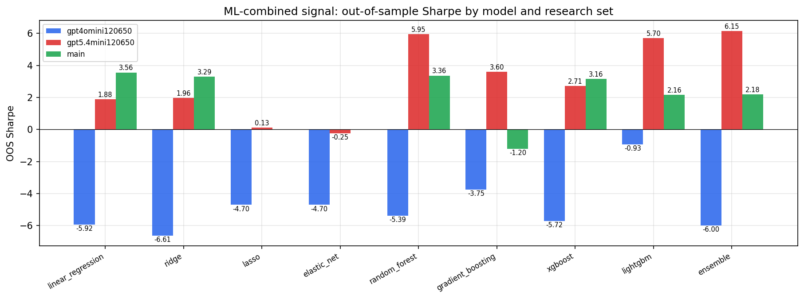

*ML-combined OOS Sharpe by model and research set*

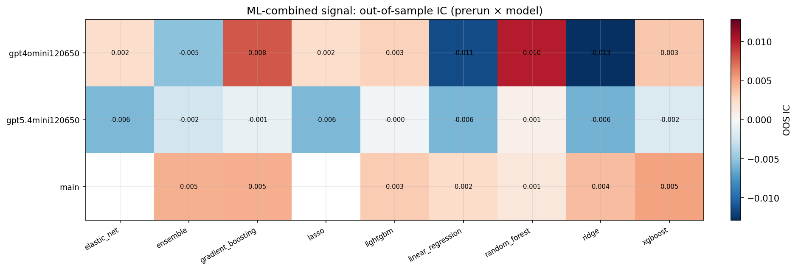

*ML-combined OOS IC (prerun × model)*

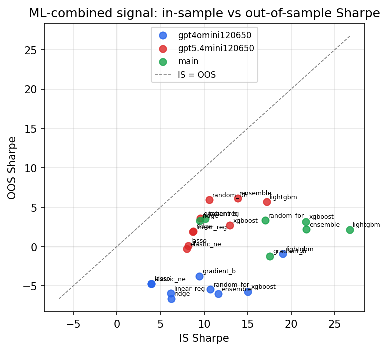

*IS vs OOS Sharpe (overfitting diagnostic)*

---
*Generated by `run_model_comparison.py`. Tables: `*.csv`; interactive: `comparison.ipynb`.*
