# Research-LLM factor comparison — `2026-06`

Comparing the **factor output of different research LLMs** on three axes (raw factor quality → factors as ML features → factors through the full agentic fund). The panel, IS/OOS split, horizon and model hyper-parameters are held identical across preruns — the *only* variable is the factor set.

## Preruns compared

| prerun | research_model | usable_factors | dropped_factors |
| --- | --- | --- | --- |
| gpt4omini120650 | gpt-4o-mini | 66 | 0 |
| gpt5.4mini120650 | gpt-5.4-mini | 69 | 0 |
| main | seed library | 78 | 10 |

> Dropped factors declare fields the current data doesn't have yet (e.g. fundamentals); they light up unchanged once that data is downloaded.

*Usable vs awaiting-data factors per research model*

## Key findings

- **Best ML-combined OOS Sharpe:** `main` with `lightgbm` (OOS Sharpe = 21.396).
- **Mean OOS Sharpe across models, by research set:** `main` = 10.878, `gpt5.4mini120650` = -0.449, `gpt4omini120650` = -7.340.
- **Highest mean single-factor |IC| (h=6):** `main` (mean |IC| = 0.0062).
- **Most diverse zoo (highest effective/raw factor ratio):** `gpt5.4mini120650` (eff 43.7 of 69, ratio 0.63).
- **Best selection-deflated single-factor |IC|:** `gpt5.4mini120650` (deflated |IC| = 0.0122 from 31 factors tried).

## 1. Single-factor IC (raw factor quality)

Per-underlying time-series Spearman rank-IC of every researched factor, recomputed on the shared panel at horizons h=1, h=6, h=60. The per-underlying IC correlates each factor's value vector with the underlying's own forward-return vector (pooled across underlyings); the cross-sectional IC ranks across underlyings per timestamp.

| prerun | n_factors | mean_abs_ic_1 | mean_abs_ic_6 | mean_abs_ic_60 | mean_abs_icir_6 | best_factor_h6 | best_abs_ic_h6 |
| --- | --- | --- | --- | --- | --- | --- | --- |
| gpt4omini120650 | 66 | 0.0051 | 0.0043 | 0.0087 | 0.1954 | hidden_volume_anomaly | 0.0167 |
| gpt5.4mini120650 | 69 | 0.0049 | 0.0057 | 0.0093 | 0.3658 | liquidity_impact_stress_ratio | 0.0206 |
| main | 78 | 0.0093 | 0.0062 | 0.0058 | 0.2506 | alpha_052 | 0.0178 |

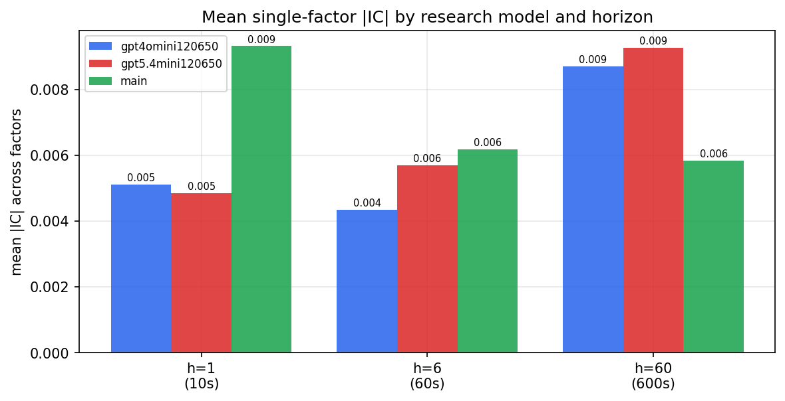

*Mean |IC| by research model and horizon*

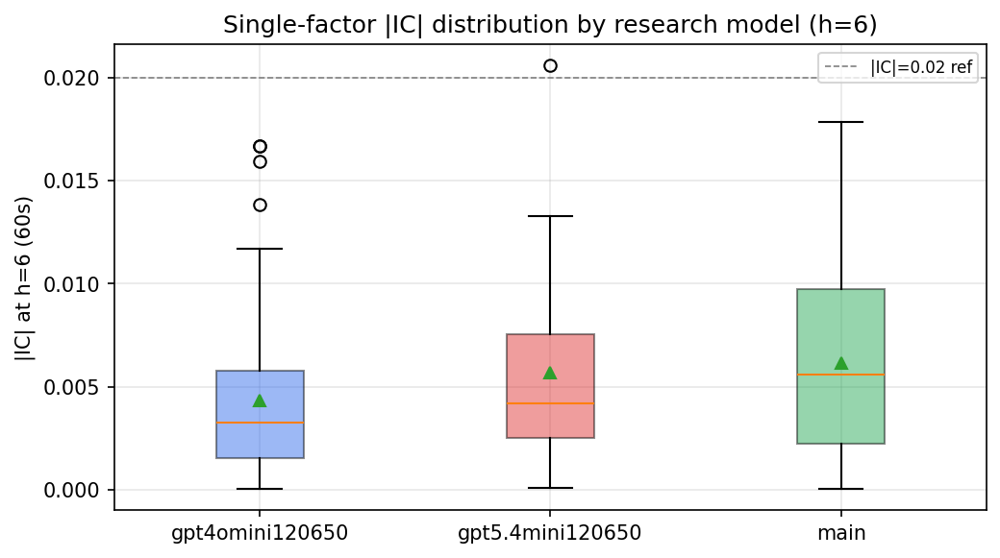

*Per-factor |IC| distribution by research model*

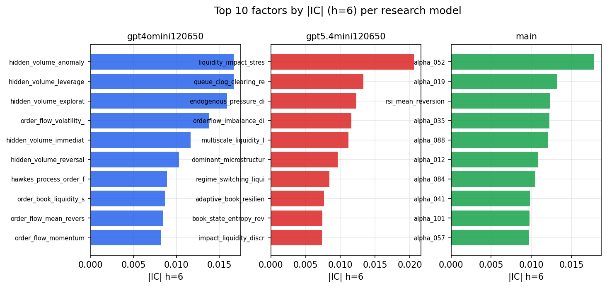

*Top factors by |IC| per research model*

## 2. Factor diversity & redundancy

Pairwise correlation of each zoo's *signals*. `eff_n_factors` is the effective number of independent factors (participation ratio of the correlation eigenvalues); `eff_ratio` and `redundancy` summarise how much unique information the zoo holds vs. how much is duplicated; `n_clusters` groups factors at |corr| ≥ 0.7.

| prerun | n_factors | eff_n_factors | eff_ratio | mean_abs_corr | n_clusters | redundancy |
| --- | --- | --- | --- | --- | --- | --- |
| gpt4omini120650 | 66 | 25.3043 | 0.3834 | 0.0556 | 51 | 0.6166 |
| gpt5.4mini120650 | 69 | 43.7302 | 0.6338 | 0.0161 | 61 | 0.3662 |
| main | 78 | 43.5256 | 0.558 | 0.0276 | 72 | 0.442 |

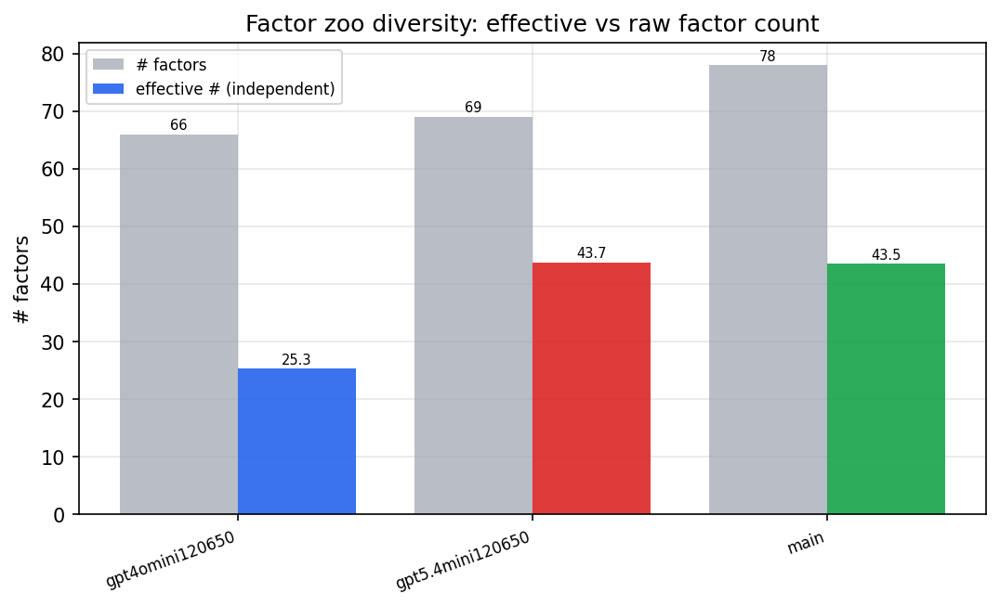

*Effective vs raw factor count per research model*

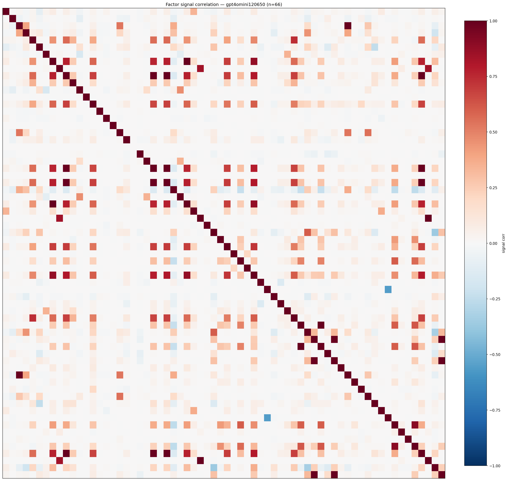

*Signal correlation matrix — gpt4omini120650*

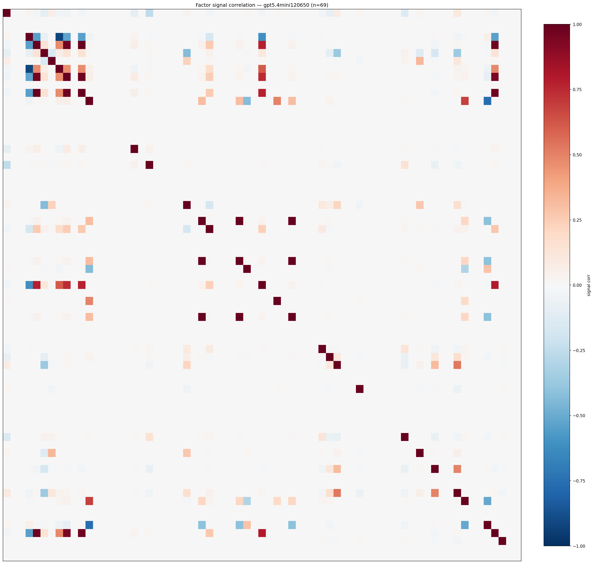

*Signal correlation matrix — gpt5.4mini120650*

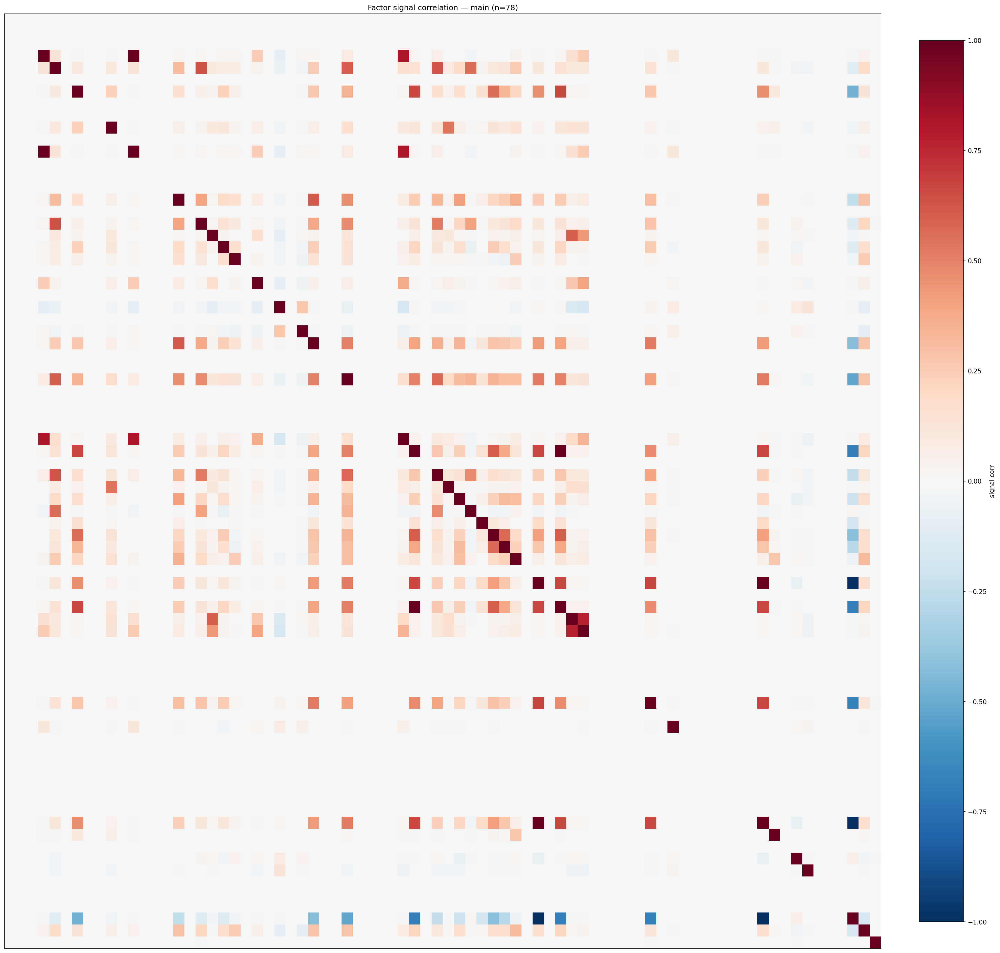

*Signal correlation matrix — main*

## 3. Deflation & model-based importance

`deflated_best_ic` haircuts each zoo's best |IC| for the number of factors tried (`ic_n_tested`) — a bigger zoo's best factor is more likely to be lucky. `lasso_n_nonzero` / `lasso_sparsity` show how many factors a sparse linear model actually keeps (model-view redundancy).

| prerun | best_ic | deflated_best_ic | deflated_best_t | ic_n_tested | ic_n_obs | lasso_n_nonzero | lasso_sparsity |
| --- | --- | --- | --- | --- | --- | --- | --- |
| gpt4omini120650 | 0.0167 | 0.0075 | 2.3475 | 64 | 98279 | 3 | 0.9545 |
| gpt5.4mini120650 | 0.0206 | 0.0122 | 3.8295 | 31 | 98279 | 17 | 0.7536 |
| main | 0.0178 | 0.0092 | 2.8906 | 38 | 98279 | 0 | 1.0 |

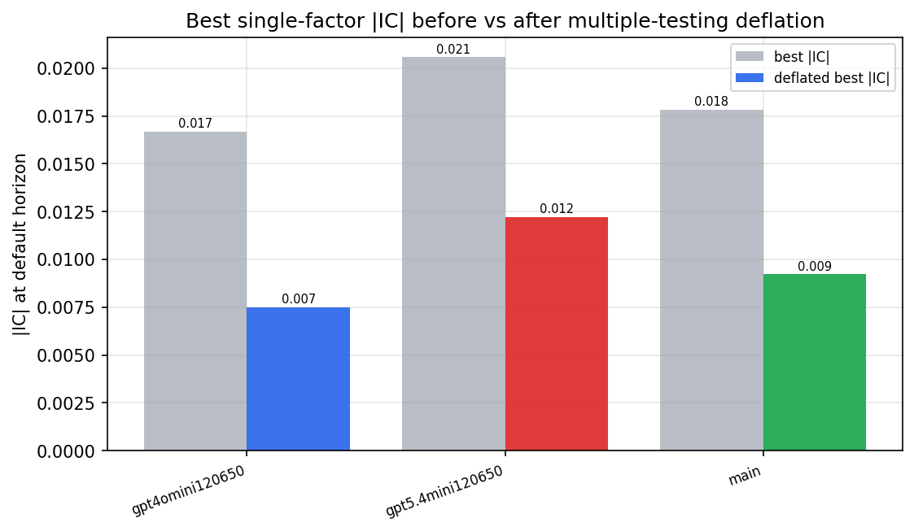

*Best |IC| before vs after multiple-testing deflation*

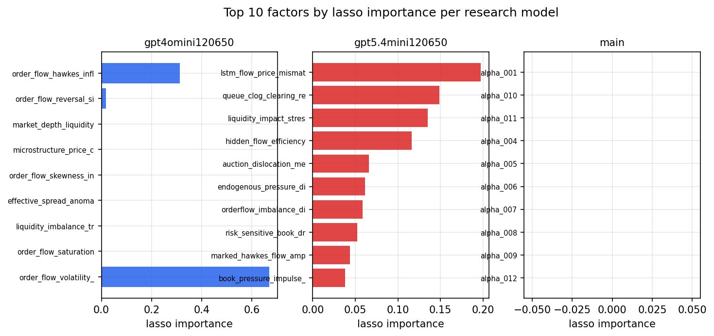

*Top factors by lasso importance per zoo*

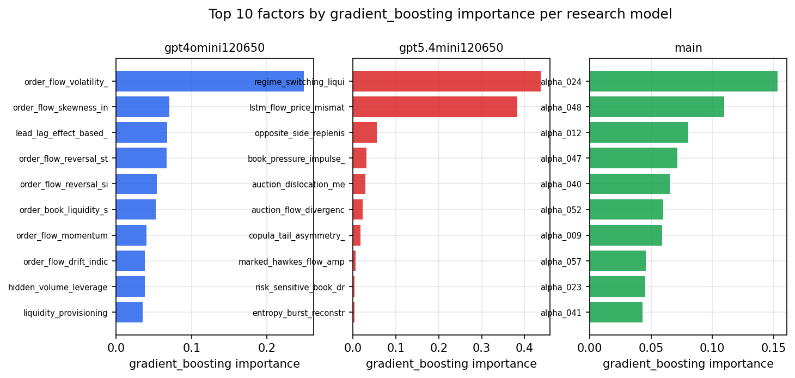

*Top factors by gradient_boosting importance per zoo*

## 4. ML-combined signal — per-underlying vectorised backtest

Each model combines a prerun's factors into ONE signal (fit `factors → forward return` on IS, predict per (bar, underlying)), then that combined signal is run through a simple vectorised backtest — `position(signal) × the underlying's own forward return` — on the held-out OOS tail (+ an equal-weight ensemble). No cross-sectional ranking.

> Config: position=**threshold** (t=1.0, z-score `expanding`), aggregation=**portfolio**, fit-standardise=**per_underlying**, horizon=6.

| prerun | model | n_factors_used | oos_ic | oos_sharpe | is_sharpe | oos_ann_return | oos_max_drawdown |
| --- | --- | --- | --- | --- | --- | --- | --- |
| gpt4omini120650 | linear_regression | 66 | -0.0604 | -13.8858 | 4.3574 | -0.3092 | -0.0019 |
| gpt4omini120650 | ridge | 66 | -0.0487 | -8.611 | 4.4867 | -0.1917 | -0.0014 |
| gpt4omini120650 | lasso | 66 | nan | nan | nan | nan | nan |
| gpt4omini120650 | elastic_net | 66 | nan | nan | nan | nan | nan |
| gpt4omini120650 | random_forest | 66 | 0.0446 | -8.0414 | 6.1336 | -0.1527 | -0.0011 |
| gpt4omini120650 | gradient_boosting | 66 | -0.0438 | -15.8779 | 5.1253 | -0.0095 | -0.0 |
| gpt4omini120650 | xgboost | 66 | 0.0355 | 0.9972 | 8.485 | 0.0108 | -0.0005 |
| gpt4omini120650 | lightgbm | 66 | 0.0076 | -0.0362 | 12.589 | -0.0005 | -0.0007 |
| gpt4omini120650 | ensemble | 66 | -0.0562 | -5.9279 | 8.3196 | -0.0512 | -0.0005 |
| gpt5.4mini120650 | linear_regression | 69 | -0.011 | -1.1309 | 4.3649 | -0.0288 | -0.002 |
| gpt5.4mini120650 | ridge | 69 | -0.0104 | -3.3077 | 4.276 | -0.0849 | -0.0021 |
| gpt5.4mini120650 | lasso | 69 | -0.0166 | -7.3082 | 3.612 | -0.2034 | -0.002 |
| gpt5.4mini120650 | elastic_net | 69 | -0.0166 | -7.3082 | 3.612 | -0.2034 | -0.002 |
| gpt5.4mini120650 | random_forest | 69 | 0.0381 | -9.3907 | 6.7115 | -0.1076 | -0.0009 |
| gpt5.4mini120650 | gradient_boosting | 69 | 0.027 | 12.9843 | 4.9445 | 0.0222 | -0.0 |
| gpt5.4mini120650 | xgboost | 69 | 0.0545 | 1.9388 | 5.9739 | 0.0126 | -0.0004 |
| gpt5.4mini120650 | lightgbm | 69 | 0.0345 | 2.7177 | 10.6059 | 0.0248 | -0.0003 |
| gpt5.4mini120650 | ensemble | 69 | -0.005 | 6.7605 | 6.8486 | 0.1288 | -0.0011 |
| main | linear_regression | 78 | 0.0345 | 13.5176 | 6.5132 | 0.3246 | -0.0013 |
| main | ridge | 78 | 0.0327 | 13.0463 | 6.8845 | 0.3318 | -0.0017 |
| main | lasso | 78 | nan | nan | nan | nan | nan |
| main | elastic_net | 78 | nan | nan | nan | nan | nan |
| main | random_forest | 78 | 0.0046 | -6.0715 | 7.3355 | -0.0546 | -0.0007 |
| main | gradient_boosting | 78 | 0.0078 | 2.9557 | 6.6409 | 0.0142 | -0.0003 |
| main | xgboost | 78 | 0.0412 | 20.9319 | 9.2885 | 0.1666 | -0.0002 |
| main | lightgbm | 78 | 0.0446 | 21.3957 | 12.3365 | 0.1556 | -0.0003 |
| main | ensemble | 78 | 0.0292 | 10.372 | 9.4389 | 0.1138 | -0.0004 |

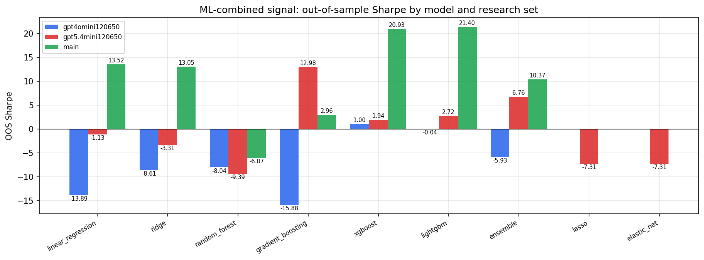

*ML-combined OOS Sharpe by model and research set*

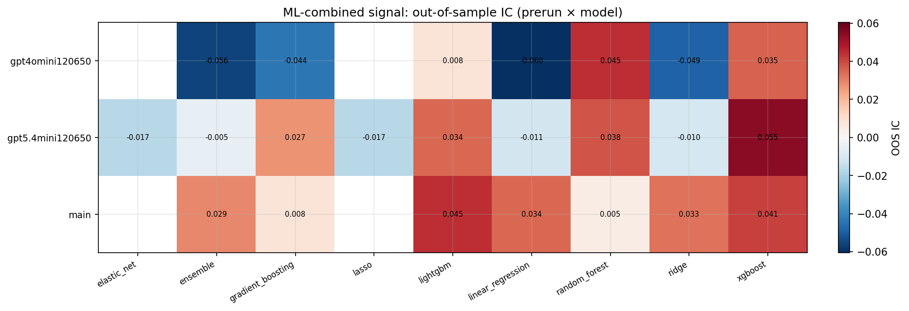

*ML-combined OOS IC (prerun × model)*

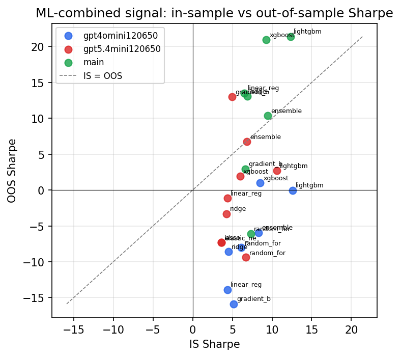

*IS vs OOS Sharpe (overfitting diagnostic)*

---
*Generated by `run_model_comparison.py`. Tables: `*.csv`; interactive: `comparison.ipynb`.*
