# Research-LLM factor comparison — `2024-03`

Comparing the **factor output of different research LLMs** on three axes (raw factor quality → factors as ML features → factors through the full agentic fund). The panel, IS/OOS split, horizon and model hyper-parameters are held identical across preruns — the *only* variable is the factor set.

## Preruns compared

| prerun | research_model | usable_factors | dropped_factors |
| --- | --- | --- | --- |
| gpt4omini120650 | gpt-4o-mini | 66 | 0 |
| gpt5.4mini120650 | gpt-5.4-mini | 69 | 0 |
| main | seed library | 78 | 10 |

> Dropped factors declare fields the current data doesn't have yet (e.g. fundamentals); they light up unchanged once that data is downloaded.

*Usable vs awaiting-data factors per research model*

## Key findings

- **Best ML-combined OOS Sharpe:** `gpt4omini120650` with `lightgbm` (OOS Sharpe = 4.941).
- **Mean OOS Sharpe across models, by research set:** `gpt4omini120650` = 2.315, `main` = 1.867, `gpt5.4mini120650` = -1.562.
- **Highest mean single-factor |IC| (h=6):** `main` (mean |IC| = 0.0110).
- **Most diverse zoo (highest effective/raw factor ratio):** `gpt5.4mini120650` (eff 54.1 of 69, ratio 0.78).
- **Best selection-deflated single-factor |IC|:** `main` (deflated |IC| = 0.0160 from 38 factors tried).

## 1. Single-factor IC (raw factor quality)

Per-underlying time-series Spearman rank-IC of every researched factor, recomputed on the shared panel at horizons h=1, h=6, h=60. The per-underlying IC correlates each factor's value vector with the underlying's own forward-return vector (pooled across underlyings); the cross-sectional IC ranks across underlyings per timestamp.

| prerun | n_factors | mean_abs_ic_1 | mean_abs_ic_6 | mean_abs_ic_60 | mean_abs_icir_6 | best_factor_h6 | best_abs_ic_h6 |
| --- | --- | --- | --- | --- | --- | --- | --- |
| gpt4omini120650 | 66 | 0.0056 | 0.0057 | 0.0059 | 0.2781 | hawkes_process_order_flow_indicator | 0.0234 |
| gpt5.4mini120650 | 69 | 0.005 | 0.0063 | 0.0072 | 0.2833 | auction_reversion_anchor_gap | 0.0178 |
| main | 78 | 0.0142 | 0.011 | 0.003 | 0.5806 | alpha_032 | 0.0231 |

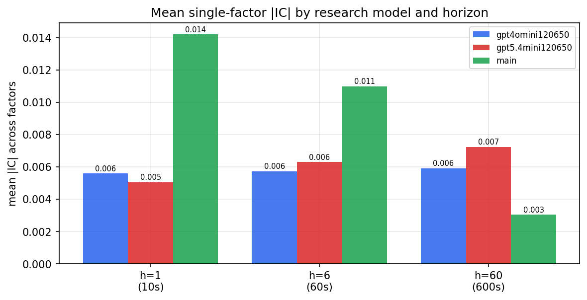

*Mean |IC| by research model and horizon*

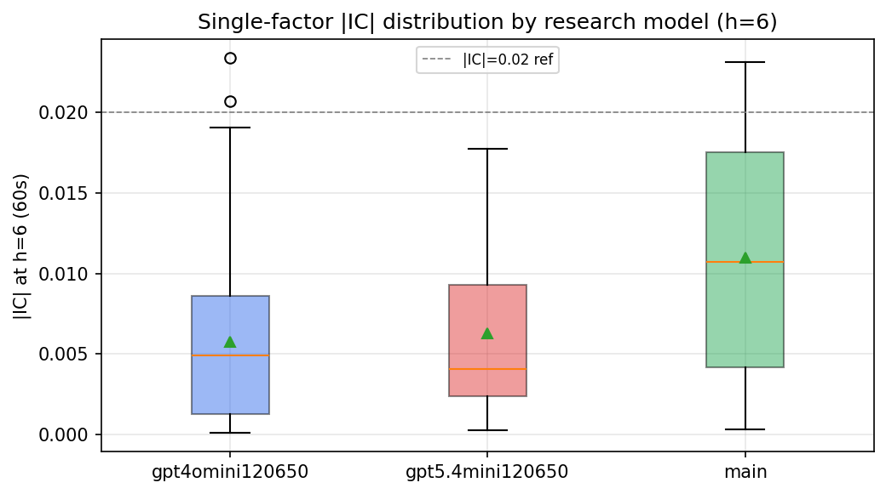

*Per-factor |IC| distribution by research model*

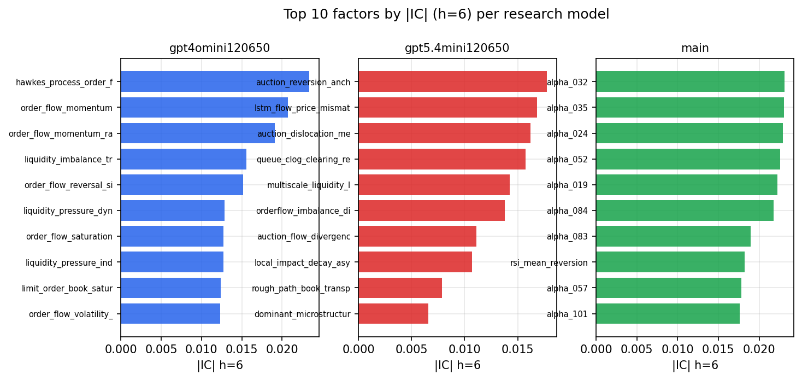

*Top factors by |IC| per research model*

## 2. Factor diversity & redundancy

Pairwise correlation of each zoo's *signals*. `eff_n_factors` is the effective number of independent factors (participation ratio of the correlation eigenvalues); `eff_ratio` and `redundancy` summarise how much unique information the zoo holds vs. how much is duplicated; `n_clusters` groups factors at |corr| ≥ 0.7.

| prerun | n_factors | eff_n_factors | eff_ratio | mean_abs_corr | n_clusters | redundancy |
| --- | --- | --- | --- | --- | --- | --- |
| gpt4omini120650 | 66 | 27.4859 | 0.4165 | 0.0495 | 50 | 0.5835 |
| gpt5.4mini120650 | 69 | 54.1183 | 0.7843 | 0.0111 | 64 | 0.2157 |
| main | 78 | 41.4974 | 0.532 | 0.0301 | 69 | 0.468 |

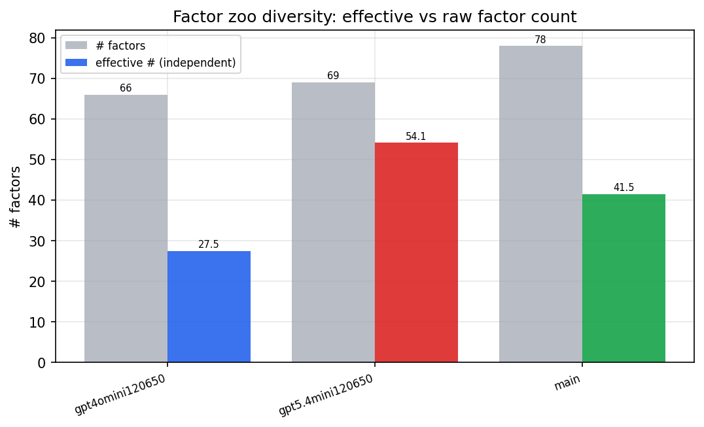

*Effective vs raw factor count per research model*

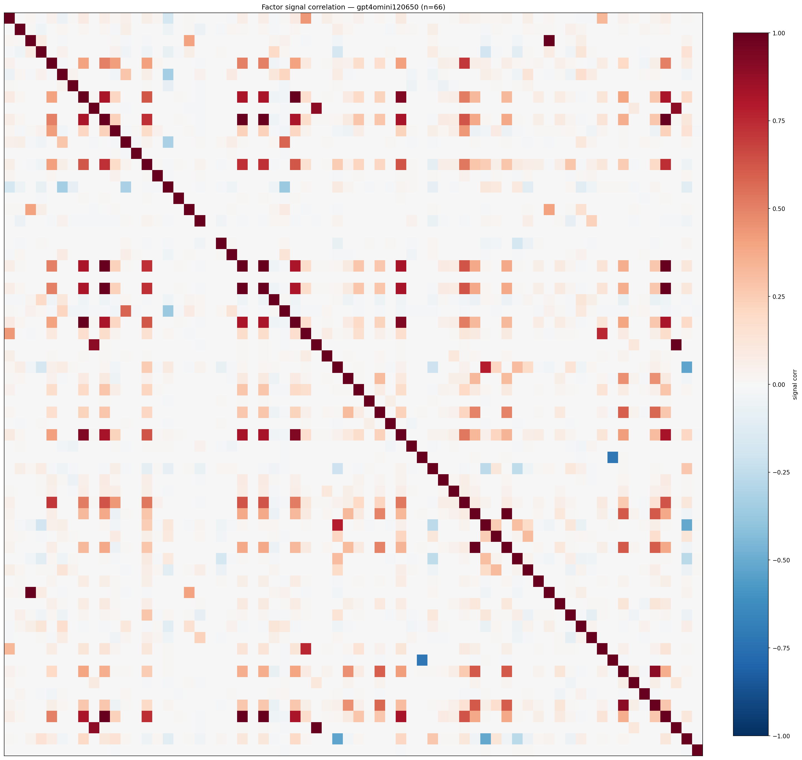

*Signal correlation matrix — gpt4omini120650*

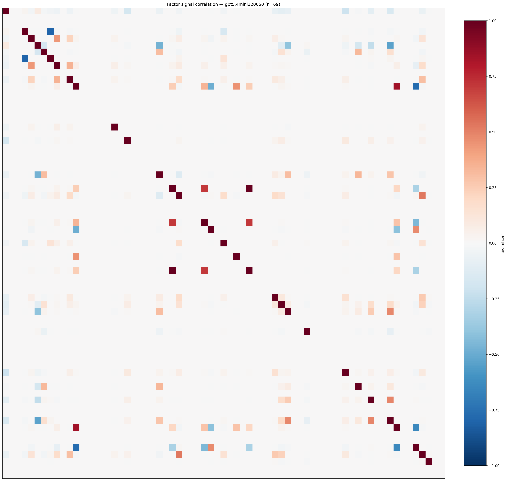

*Signal correlation matrix — gpt5.4mini120650*

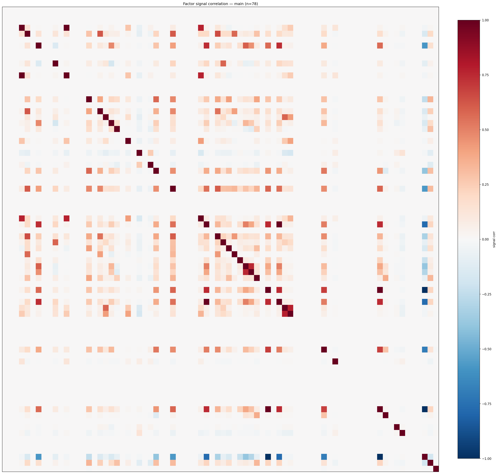

*Signal correlation matrix — main*

## 3. Deflation & model-based importance

`deflated_best_ic` haircuts each zoo's best |IC| for the number of factors tried (`ic_n_tested`) — a bigger zoo's best factor is more likely to be lucky. `lasso_n_nonzero` / `lasso_sparsity` show how many factors a sparse linear model actually keeps (model-view redundancy).

| prerun | best_ic | deflated_best_ic | deflated_best_t | ic_n_tested | ic_n_obs | lasso_n_nonzero | lasso_sparsity |
| --- | --- | --- | --- | --- | --- | --- | --- |
| gpt4omini120650 | 0.0234 | 0.0157 | 5.9488 | 64 | 142739 | 3 | 0.9545 |
| gpt5.4mini120650 | 0.0178 | 0.0108 | 4.0918 | 31 | 142739 | 2 | 0.971 |
| main | 0.0231 | 0.016 | 6.0394 | 38 | 142739 | 5 | 0.9359 |

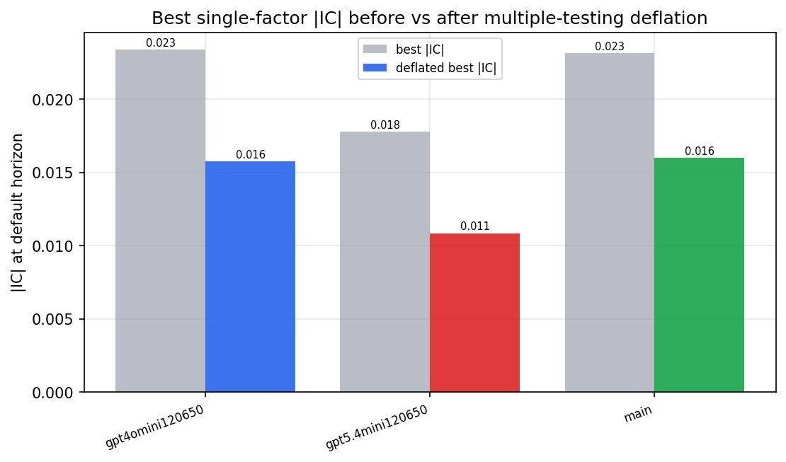

*Best |IC| before vs after multiple-testing deflation*

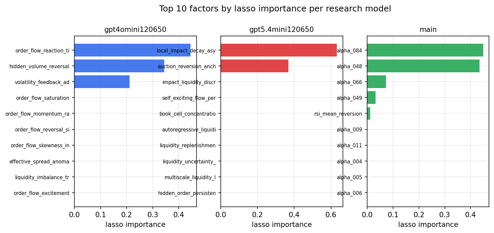

*Top factors by lasso importance per zoo*

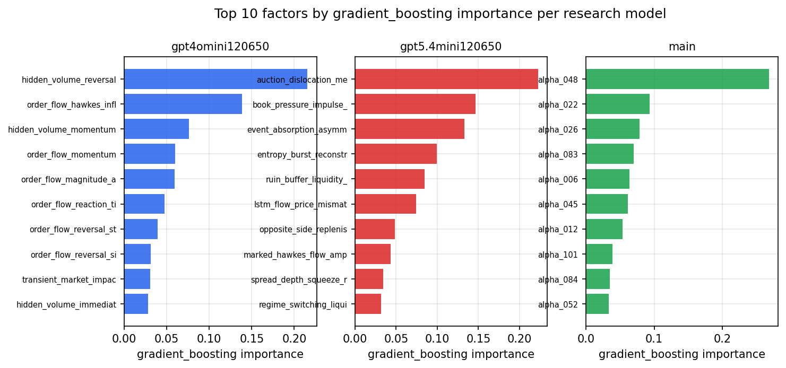

*Top factors by gradient_boosting importance per zoo*

## 4. ML-combined signal — per-underlying vectorised backtest

Each model combines a prerun's factors into ONE signal (fit `factors → forward return` on IS, predict per (bar, underlying)), then that combined signal is run through a simple vectorised backtest — `position(signal) × the underlying's own forward return` — on the held-out OOS tail (+ an equal-weight ensemble). No cross-sectional ranking.

> Config: position=**threshold** (t=1.0, z-score `expanding`), aggregation=**portfolio**, fit-standardise=**per_underlying**, horizon=6.

| prerun | model | n_factors_used | oos_ic | oos_sharpe | is_sharpe | oos_ann_return | oos_max_drawdown |
| --- | --- | --- | --- | --- | --- | --- | --- |
| gpt4omini120650 | linear_regression | 66 | 0.0003 | 3.4589 | 8.1901 | 0.2262 | -0.0206 |
| gpt4omini120650 | ridge | 66 | 0.0005 | 2.1697 | 8.0319 | 0.14 | -0.0238 |
| gpt4omini120650 | lasso | 66 | -0.0057 | -2.3403 | 3.6696 | -0.1533 | -0.0328 |
| gpt4omini120650 | elastic_net | 66 | -0.0054 | 0.8581 | 5.175 | 0.0504 | -0.019 |
| gpt4omini120650 | random_forest | 66 | 0.0134 | 0.8223 | 10.3363 | 0.0445 | -0.0156 |
| gpt4omini120650 | gradient_boosting | 66 | 0.0199 | 3.9429 | 10.7508 | 0.1649 | -0.0106 |
| gpt4omini120650 | xgboost | 66 | 0.0184 | 2.5062 | 11.815 | 0.1165 | -0.0145 |
| gpt4omini120650 | lightgbm | 66 | 0.0161 | 4.9413 | 15.6093 | 0.315 | -0.0061 |
| gpt4omini120650 | ensemble | 66 | 0.0006 | 4.4764 | 12.1992 | 0.2648 | -0.0142 |
| gpt5.4mini120650 | linear_regression | 69 | 0.0155 | -0.8564 | 6.4022 | -0.046 | -0.0144 |
| gpt5.4mini120650 | ridge | 69 | 0.0151 | -0.7454 | 5.7259 | -0.041 | -0.0144 |
| gpt5.4mini120650 | lasso | 69 | 0.0009 | -2.2826 | 4.6496 | -0.1135 | -0.0186 |
| gpt5.4mini120650 | elastic_net | 69 | 0.001 | -2.3223 | 4.0271 | -0.1155 | -0.0185 |
| gpt5.4mini120650 | random_forest | 69 | 0.0097 | -0.8378 | 9.6273 | -0.0446 | -0.0186 |
| gpt5.4mini120650 | gradient_boosting | 69 | 0.0117 | -3.0965 | 10.889 | -0.148 | -0.0201 |
| gpt5.4mini120650 | xgboost | 69 | 0.0152 | -1.5554 | 11.7852 | -0.065 | -0.0147 |
| gpt5.4mini120650 | lightgbm | 69 | 0.018 | -1.709 | 15.2698 | -0.0735 | -0.018 |
| gpt5.4mini120650 | ensemble | 69 | 0.0137 | -0.6507 | 9.5225 | -0.0318 | -0.0162 |
| main | linear_regression | 78 | 0.0179 | 0.939 | 7.0978 | 0.0601 | -0.0193 |
| main | ridge | 78 | 0.0144 | 1.2852 | 6.2109 | 0.0777 | -0.0234 |
| main | lasso | 78 | nan | nan | nan | nan | nan |
| main | elastic_net | 78 | nan | nan | nan | nan | nan |
| main | random_forest | 78 | 0.0204 | 2.5185 | 11.9362 | 0.1155 | -0.0142 |
| main | gradient_boosting | 78 | 0.021 | 2.6891 | 11.523 | 0.0807 | -0.0042 |
| main | xgboost | 78 | 0.0199 | 2.9473 | 14.6338 | 0.1643 | -0.0095 |
| main | lightgbm | 78 | 0.0153 | 1.62 | 17.201 | 0.0785 | -0.0102 |
| main | ensemble | 78 | 0.0146 | 1.0718 | 10.8733 | 0.0365 | -0.0086 |

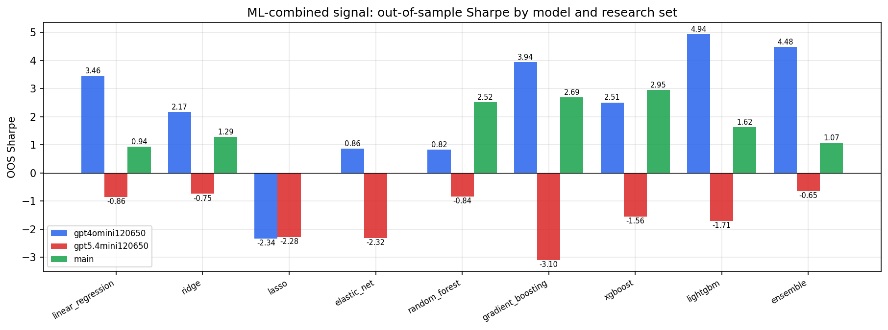

*ML-combined OOS Sharpe by model and research set*

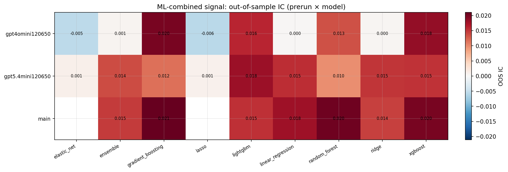

*ML-combined OOS IC (prerun × model)*

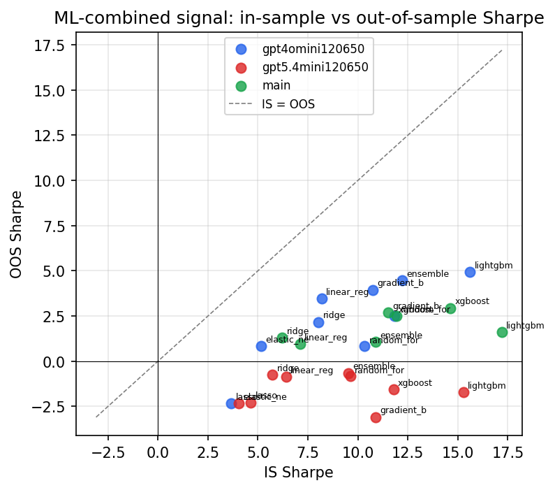

*IS vs OOS Sharpe (overfitting diagnostic)*

---
*Generated by `run_model_comparison.py`. Tables: `*.csv`; interactive: `comparison.ipynb`.*
