# Research-LLM factor comparison — `2024-05`

Comparing the **factor output of different research LLMs** on three axes (raw factor quality → factors as ML features → factors through the full agentic fund). The panel, IS/OOS split, horizon and model hyper-parameters are held identical across preruns — the *only* variable is the factor set.

## Preruns compared

| prerun | research_model | usable_factors | dropped_factors |
| --- | --- | --- | --- |
| gpt4omini120650 | gpt-4o-mini | 66 | 0 |
| gpt5.4mini120650 | gpt-5.4-mini | 69 | 0 |
| main | seed library | 78 | 10 |

> Dropped factors declare fields the current data doesn't have yet (e.g. fundamentals); they light up unchanged once that data is downloaded.

*Usable vs awaiting-data factors per research model*

## Key findings

- **Best ML-combined OOS Sharpe:** `gpt4omini120650` with `linear_regression` (OOS Sharpe = 4.957).
- **Mean OOS Sharpe across models, by research set:** `gpt4omini120650` = 1.659, `main` = 1.586, `gpt5.4mini120650` = -1.086.
- **Highest mean single-factor |IC| (h=6):** `main` (mean |IC| = 0.0132).
- **Most diverse zoo (highest effective/raw factor ratio):** `gpt5.4mini120650` (eff 57.4 of 69, ratio 0.83).
- **Best selection-deflated single-factor |IC|:** `main` (deflated |IC| = 0.0238 from 38 factors tried).

## 1. Single-factor IC (raw factor quality)

Per-underlying time-series Spearman rank-IC of every researched factor, recomputed on the shared panel at horizons h=1, h=6, h=60. The per-underlying IC correlates each factor's value vector with the underlying's own forward-return vector (pooled across underlyings); the cross-sectional IC ranks across underlyings per timestamp.

| prerun | n_factors | mean_abs_ic_1 | mean_abs_ic_6 | mean_abs_ic_60 | mean_abs_icir_6 | best_factor_h6 | best_abs_ic_h6 |
| --- | --- | --- | --- | --- | --- | --- | --- |
| gpt4omini120650 | 66 | 0.0073 | 0.0078 | 0.0047 | 0.4267 | order_flow_reversal_signal | 0.0256 |
| gpt5.4mini120650 | 69 | 0.0049 | 0.0066 | 0.0056 | 0.3544 | lstm_flow_price_mismatch | 0.0231 |
| main | 78 | 0.0176 | 0.0132 | 0.0046 | 0.7651 | alpha_032 | 0.0308 |

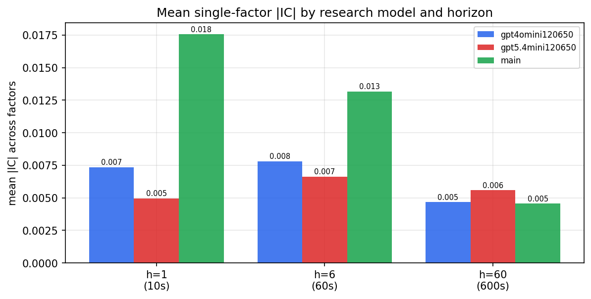

*Mean |IC| by research model and horizon*

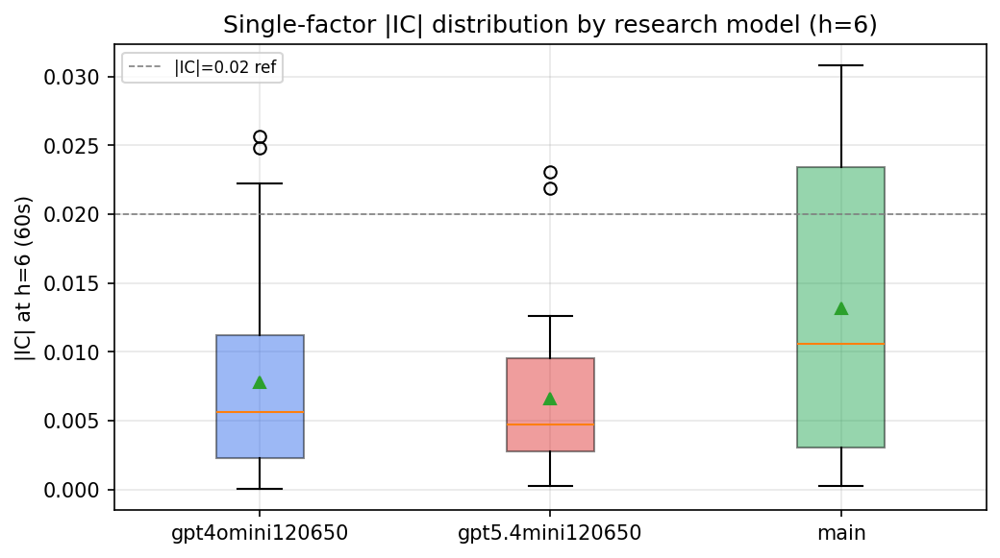

*Per-factor |IC| distribution by research model*

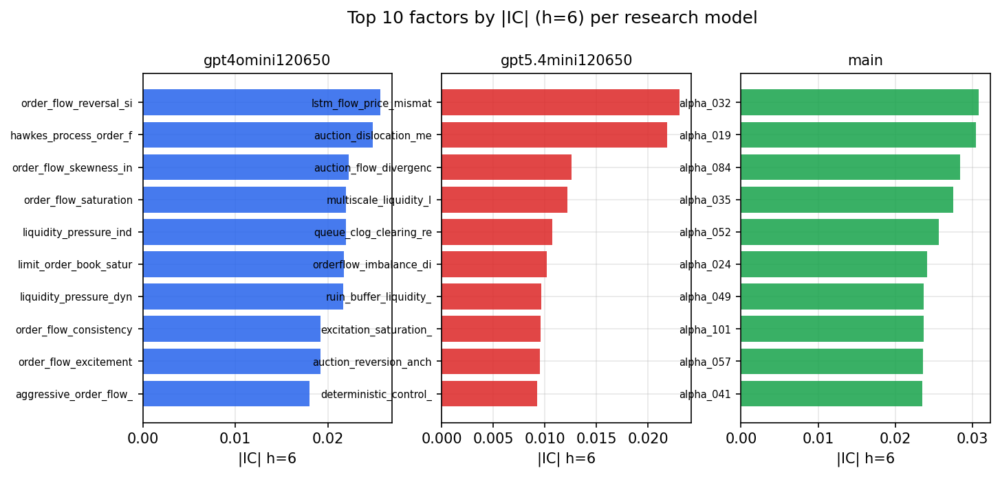

*Top factors by |IC| per research model*

## 2. Factor diversity & redundancy

Pairwise correlation of each zoo's *signals*. `eff_n_factors` is the effective number of independent factors (participation ratio of the correlation eigenvalues); `eff_ratio` and `redundancy` summarise how much unique information the zoo holds vs. how much is duplicated; `n_clusters` groups factors at |corr| ≥ 0.7.

| prerun | n_factors | eff_n_factors | eff_ratio | mean_abs_corr | n_clusters | redundancy |
| --- | --- | --- | --- | --- | --- | --- |
| gpt4omini120650 | 66 | 27.375 | 0.4148 | 0.0506 | 50 | 0.5852 |
| gpt5.4mini120650 | 69 | 57.3668 | 0.8314 | 0.0093 | 67 | 0.1686 |
| main | 78 | 41.0064 | 0.5257 | 0.0309 | 69 | 0.4743 |

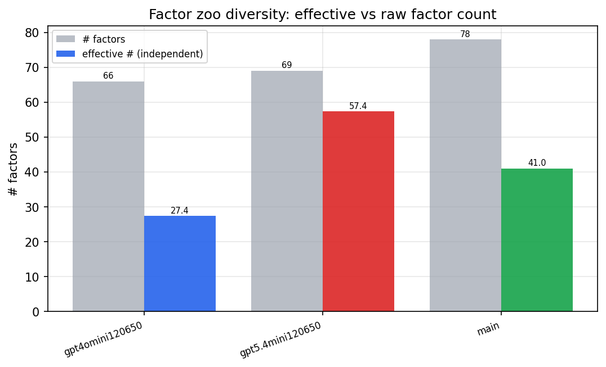

*Effective vs raw factor count per research model*

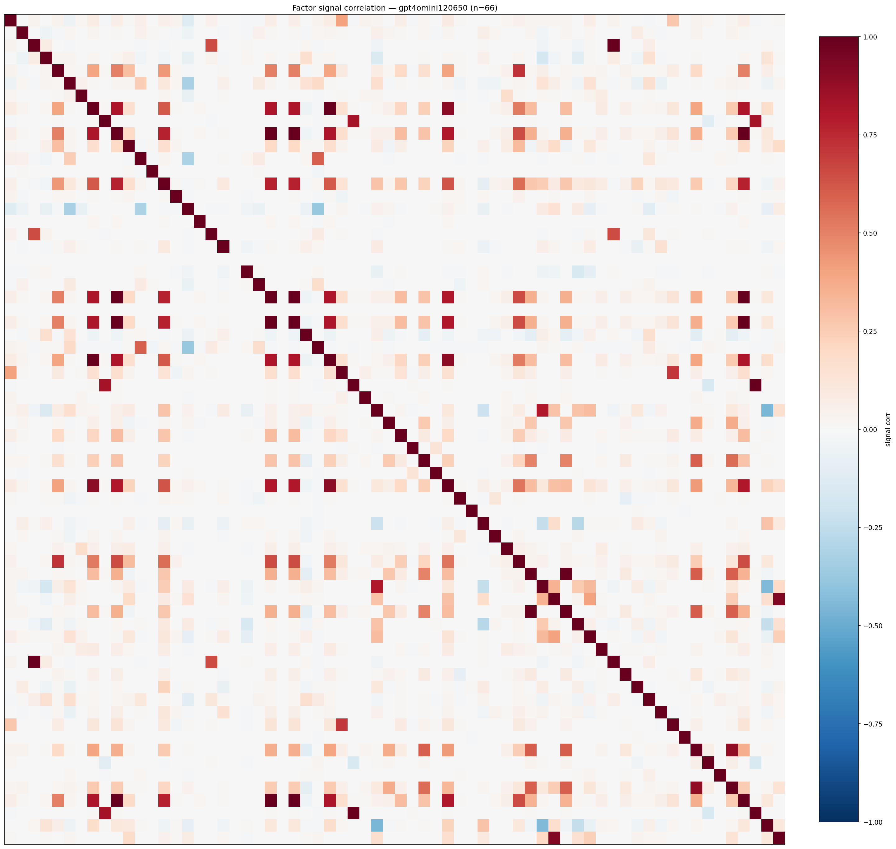

*Signal correlation matrix — gpt4omini120650*

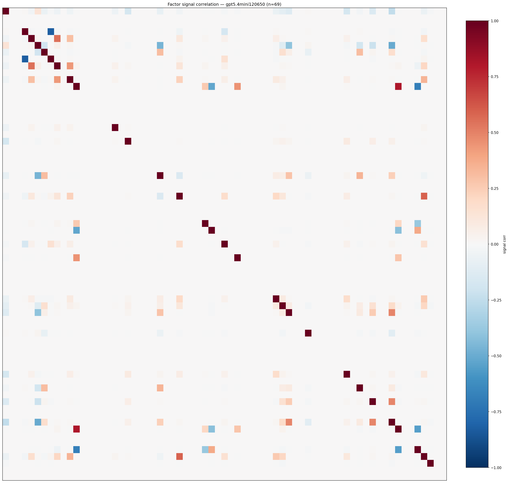

*Signal correlation matrix — gpt5.4mini120650*

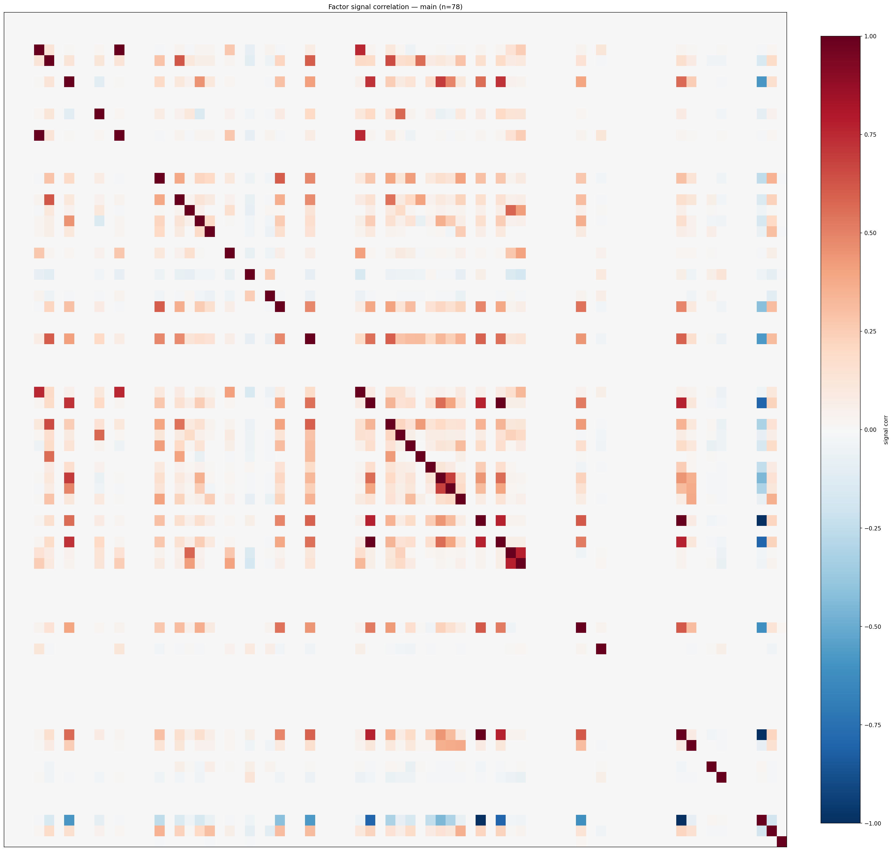

*Signal correlation matrix — main*

## 3. Deflation & model-based importance

`deflated_best_ic` haircuts each zoo's best |IC| for the number of factors tried (`ic_n_tested`) — a bigger zoo's best factor is more likely to be lucky. `lasso_n_nonzero` / `lasso_sparsity` show how many factors a sparse linear model actually keeps (model-view redundancy).

| prerun | best_ic | deflated_best_ic | deflated_best_t | ic_n_tested | ic_n_obs | lasso_n_nonzero | lasso_sparsity |
| --- | --- | --- | --- | --- | --- | --- | --- |
| gpt4omini120650 | 0.0256 | 0.0182 | 7.0382 | 64 | 149759 | 0 | 1.0 |
| gpt5.4mini120650 | 0.0231 | 0.0163 | 6.2996 | 31 | 149759 | 0 | 1.0 |
| main | 0.0308 | 0.0238 | 9.2161 | 38 | 149759 | 2 | 0.9744 |

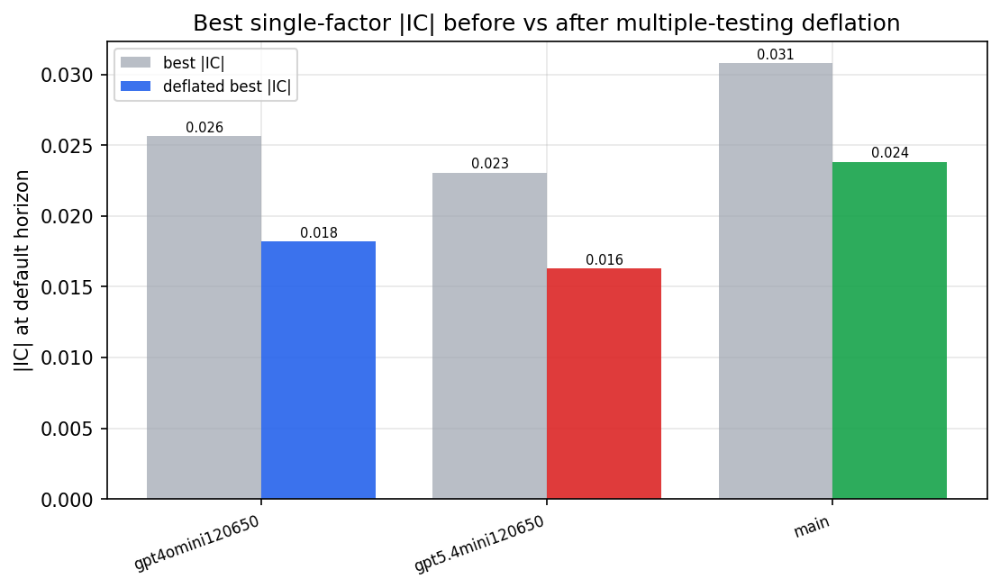

*Best |IC| before vs after multiple-testing deflation*

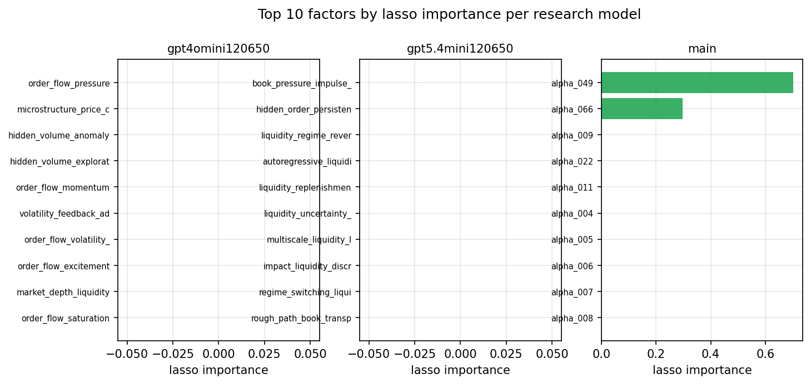

*Top factors by lasso importance per zoo*

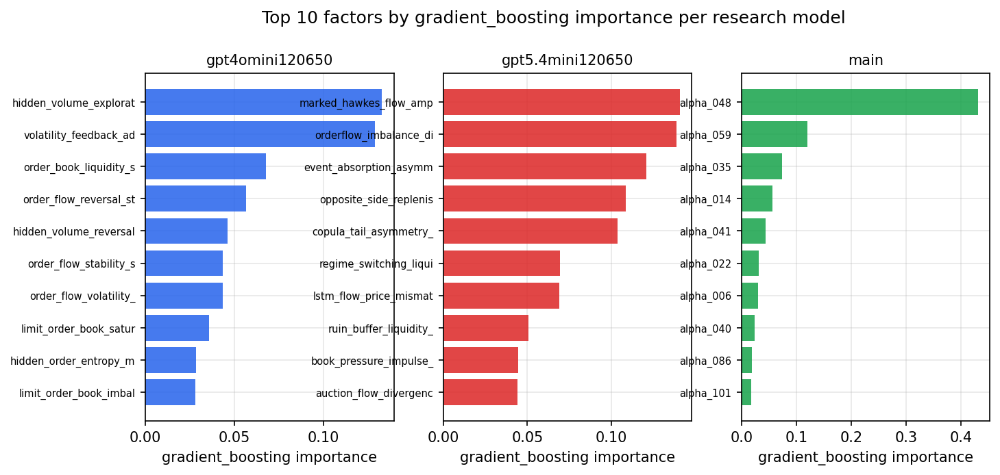

*Top factors by gradient_boosting importance per zoo*

## 4. ML-combined signal — per-underlying vectorised backtest

Each model combines a prerun's factors into ONE signal (fit `factors → forward return` on IS, predict per (bar, underlying)), then that combined signal is run through a simple vectorised backtest — `position(signal) × the underlying's own forward return` — on the held-out OOS tail (+ an equal-weight ensemble). No cross-sectional ranking.

> Config: position=**threshold** (t=1.0, z-score `expanding`), aggregation=**portfolio**, fit-standardise=**per_underlying**, horizon=6.

| prerun | model | n_factors_used | oos_ic | oos_sharpe | is_sharpe | oos_ann_return | oos_max_drawdown |
| --- | --- | --- | --- | --- | --- | --- | --- |
| gpt4omini120650 | linear_regression | 66 | 0.0178 | 4.957 | 7.646 | 0.5102 | -0.0182 |
| gpt4omini120650 | ridge | 66 | 0.0162 | 4.5561 | 7.9491 | 0.4803 | -0.0151 |
| gpt4omini120650 | lasso | 66 | nan | nan | nan | nan | nan |
| gpt4omini120650 | elastic_net | 66 | nan | nan | nan | nan | nan |
| gpt4omini120650 | random_forest | 66 | 0.0099 | -1.1229 | 12.1373 | -0.111 | -0.0338 |
| gpt4omini120650 | gradient_boosting | 66 | 0.0044 | 2.3002 | 12.5446 | 0.0971 | -0.0077 |
| gpt4omini120650 | xgboost | 66 | 0.0101 | -0.688 | 16.2982 | -0.0532 | -0.0196 |
| gpt4omini120650 | lightgbm | 66 | 0.0102 | 0.6813 | 20.363 | 0.0372 | -0.0184 |
| gpt4omini120650 | ensemble | 66 | 0.0176 | 0.9301 | 11.1045 | 0.0187 | -0.0083 |
| gpt5.4mini120650 | linear_regression | 69 | 0.0237 | -0.3127 | 5.5068 | -0.0118 | -0.019 |
| gpt5.4mini120650 | ridge | 69 | 0.0232 | -0.7101 | 4.0862 | -0.0271 | -0.0175 |
| gpt5.4mini120650 | lasso | 69 | nan | nan | nan | nan | nan |
| gpt5.4mini120650 | elastic_net | 69 | nan | nan | nan | nan | nan |
| gpt5.4mini120650 | random_forest | 69 | 0.0129 | 0.6377 | 13.4367 | 0.0333 | -0.0132 |
| gpt5.4mini120650 | gradient_boosting | 69 | 0.0169 | -1.3085 | 13.333 | -0.0623 | -0.018 |
| gpt5.4mini120650 | xgboost | 69 | 0.0156 | -1.0674 | 18.8099 | -0.0513 | -0.016 |
| gpt5.4mini120650 | lightgbm | 69 | 0.018 | -3.034 | 21.5727 | -0.1069 | -0.0171 |
| gpt5.4mini120650 | ensemble | 69 | 0.0238 | -1.806 | 7.5115 | -0.0207 | -0.005 |
| main | linear_regression | 78 | 0.0101 | 1.9926 | 9.6032 | 0.0967 | -0.012 |
| main | ridge | 78 | 0.0132 | 1.9065 | 9.8082 | 0.0961 | -0.0125 |
| main | lasso | 78 | nan | nan | nan | nan | nan |
| main | elastic_net | 78 | nan | nan | nan | nan | nan |
| main | random_forest | 78 | 0.0149 | -0.3256 | 19.9017 | -0.0168 | -0.0191 |
| main | gradient_boosting | 78 | 0.0173 | 3.8857 | 15.8025 | 0.1454 | -0.0045 |
| main | xgboost | 78 | 0.0068 | -3.4512 | 20.3125 | -0.1211 | -0.02 |
| main | lightgbm | 78 | 0.0168 | 2.5479 | 29.7957 | 0.0736 | -0.0089 |
| main | ensemble | 78 | 0.0139 | 4.5466 | 9.4018 | 0.1151 | -0.004 |

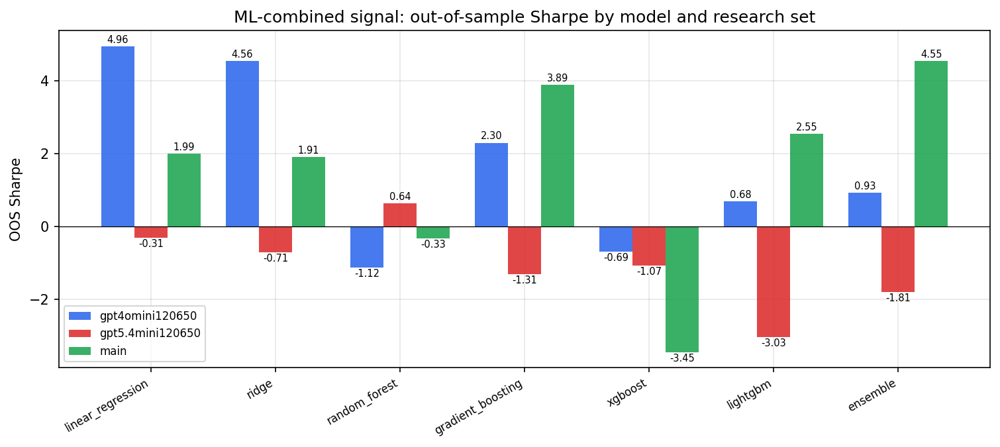

*ML-combined OOS Sharpe by model and research set*

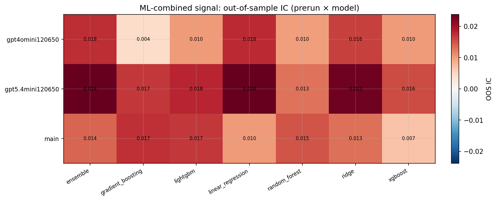

*ML-combined OOS IC (prerun × model)*

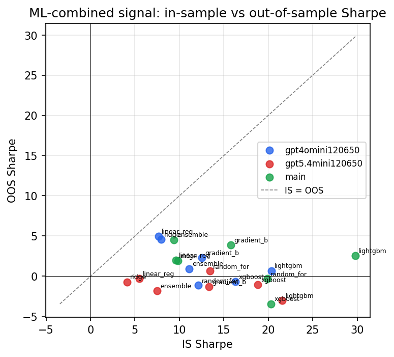

*IS vs OOS Sharpe (overfitting diagnostic)*

---
*Generated by `run_model_comparison.py`. Tables: `*.csv`; interactive: `comparison.ipynb`.*
