# Research-LLM factor comparison — `2024-06`

Comparing the **factor output of different research LLMs** on three axes (raw factor quality → factors as ML features → factors through the full agentic fund). The panel, IS/OOS split, horizon and model hyper-parameters are held identical across preruns — the *only* variable is the factor set.

## Preruns compared

| prerun | research_model | usable_factors | dropped_factors |
| --- | --- | --- | --- |
| gpt4omini120650 | gpt-4o-mini | 66 | 0 |
| gpt5.4mini120650 | gpt-5.4-mini | 69 | 0 |
| main | seed library | 78 | 10 |

> Dropped factors declare fields the current data doesn't have yet (e.g. fundamentals); they light up unchanged once that data is downloaded.

*Usable vs awaiting-data factors per research model*

## Key findings

- **Best ML-combined OOS Sharpe:** `main` with `lightgbm` (OOS Sharpe = 4.156).
- **Mean OOS Sharpe across models, by research set:** `main` = -1.096, `gpt5.4mini120650` = -1.173, `gpt4omini120650` = -3.176.
- **Highest mean single-factor |IC| (h=6):** `main` (mean |IC| = 0.0103).
- **Most diverse zoo (highest effective/raw factor ratio):** `gpt5.4mini120650` (eff 54.5 of 69, ratio 0.79).
- **Best selection-deflated single-factor |IC|:** `main` (deflated |IC| = 0.0209 from 38 factors tried).

## 1. Single-factor IC (raw factor quality)

Per-underlying time-series Spearman rank-IC of every researched factor, recomputed on the shared panel at horizons h=1, h=6, h=60. The per-underlying IC correlates each factor's value vector with the underlying's own forward-return vector (pooled across underlyings); the cross-sectional IC ranks across underlyings per timestamp.

| prerun | n_factors | mean_abs_ic_1 | mean_abs_ic_6 | mean_abs_ic_60 | mean_abs_icir_6 | best_factor_h6 | best_abs_ic_h6 |
| --- | --- | --- | --- | --- | --- | --- | --- |
| gpt4omini120650 | 66 | 0.0055 | 0.0061 | 0.0057 | 0.3364 | order_flow_skewness_indicator | 0.0242 |
| gpt5.4mini120650 | 69 | 0.0049 | 0.0067 | 0.0051 | 0.3681 | auction_dislocation_mean_reversion | 0.0177 |
| main | 78 | 0.0166 | 0.0103 | 0.0054 | 0.6471 | alpha_019 | 0.0279 |

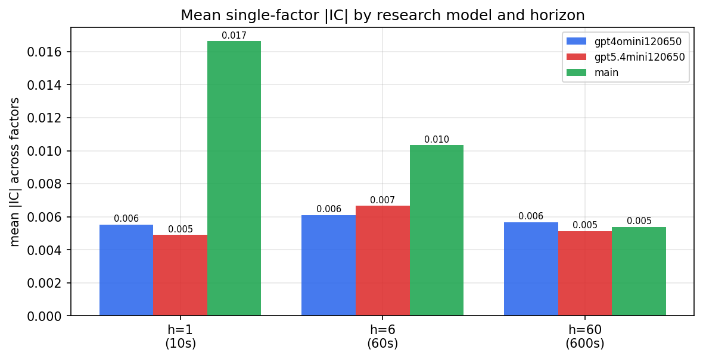

*Mean |IC| by research model and horizon*

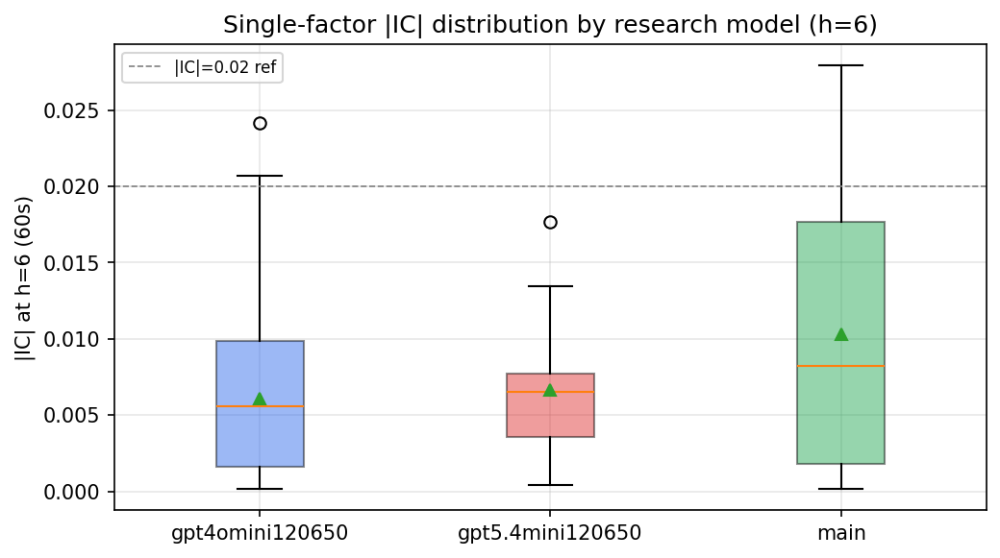

*Per-factor |IC| distribution by research model*

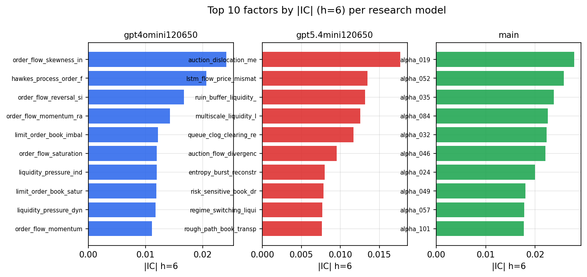

*Top factors by |IC| per research model*

## 2. Factor diversity & redundancy

Pairwise correlation of each zoo's *signals*. `eff_n_factors` is the effective number of independent factors (participation ratio of the correlation eigenvalues); `eff_ratio` and `redundancy` summarise how much unique information the zoo holds vs. how much is duplicated; `n_clusters` groups factors at |corr| ≥ 0.7.

| prerun | n_factors | eff_n_factors | eff_ratio | mean_abs_corr | n_clusters | redundancy |
| --- | --- | --- | --- | --- | --- | --- |
| gpt4omini120650 | 66 | 27.7947 | 0.4211 | 0.0486 | 49 | 0.5789 |
| gpt5.4mini120650 | 69 | 54.525 | 0.7902 | 0.011 | 64 | 0.2098 |
| main | 78 | 40.9305 | 0.5247 | 0.031 | 69 | 0.4753 |

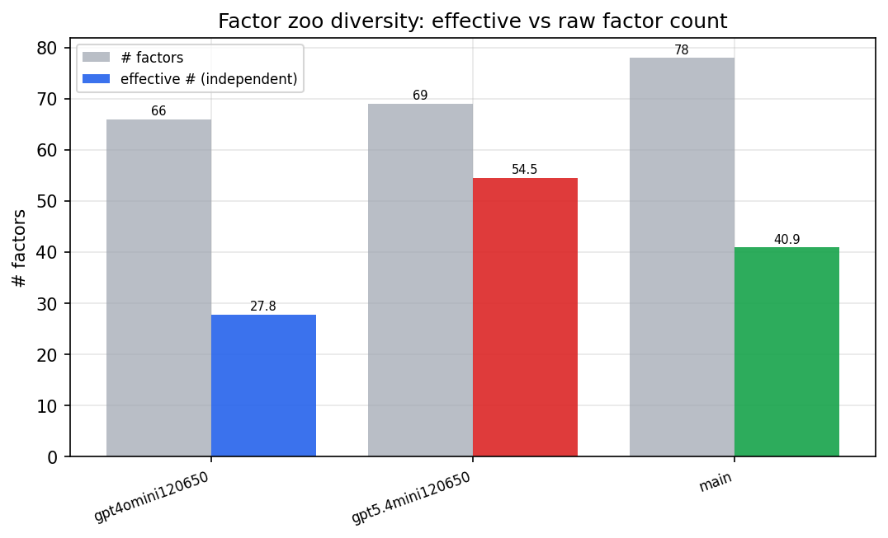

*Effective vs raw factor count per research model*

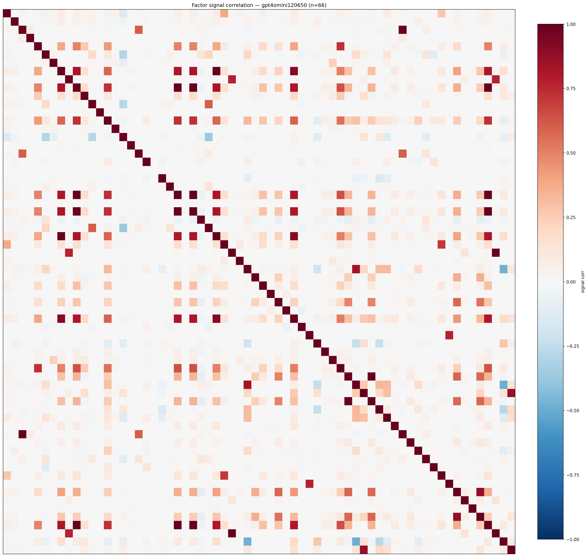

*Signal correlation matrix — gpt4omini120650*

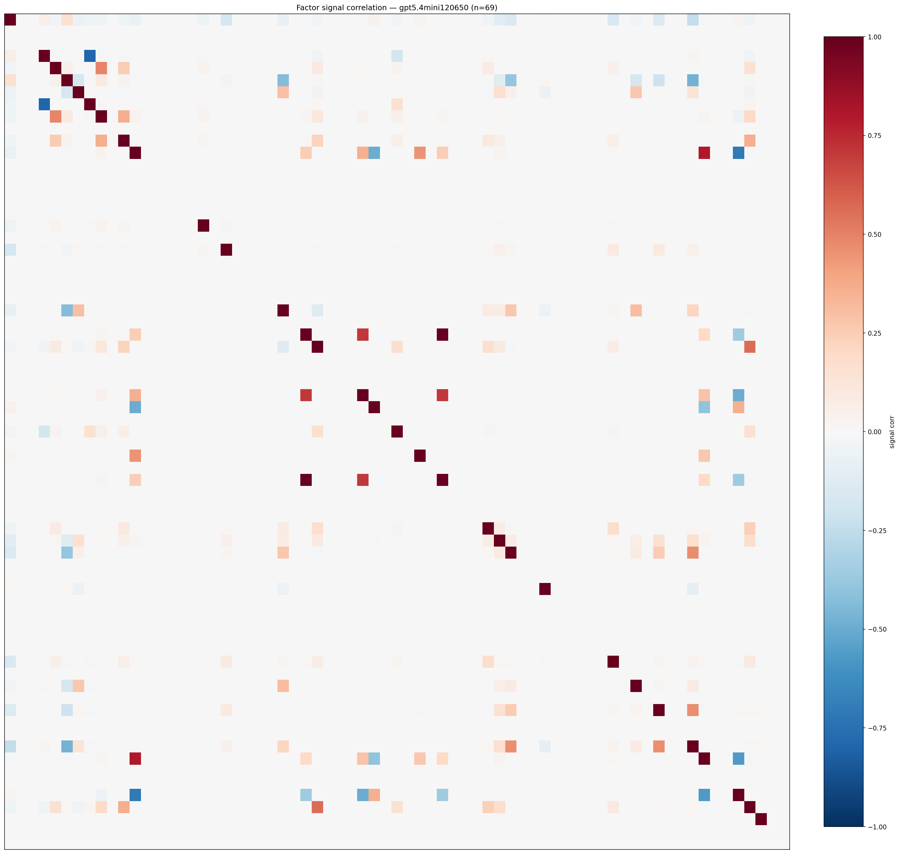

*Signal correlation matrix — gpt5.4mini120650*

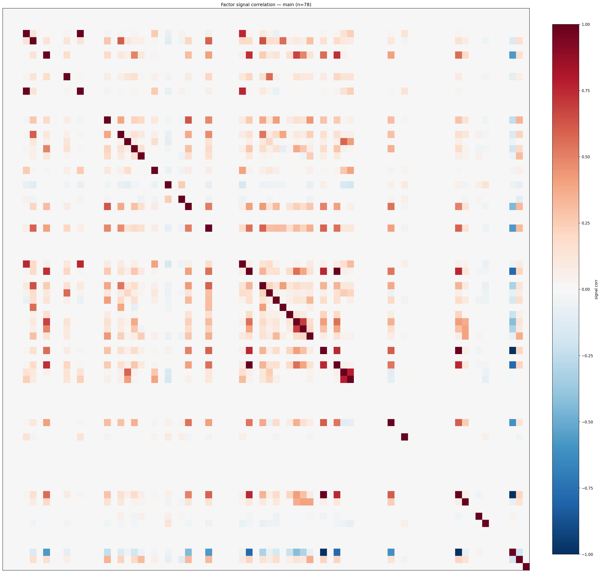

*Signal correlation matrix — main*

## 3. Deflation & model-based importance

`deflated_best_ic` haircuts each zoo's best |IC| for the number of factors tried (`ic_n_tested`) — a bigger zoo's best factor is more likely to be lucky. `lasso_n_nonzero` / `lasso_sparsity` show how many factors a sparse linear model actually keeps (model-view redundancy).

| prerun | best_ic | deflated_best_ic | deflated_best_t | ic_n_tested | ic_n_obs | lasso_n_nonzero | lasso_sparsity |
| --- | --- | --- | --- | --- | --- | --- | --- |
| gpt4omini120650 | 0.0242 | 0.0167 | 6.3978 | 64 | 147419 | 0 | 1.0 |
| gpt5.4mini120650 | 0.0177 | 0.0109 | 4.1766 | 31 | 147419 | 0 | 1.0 |
| main | 0.0279 | 0.0209 | 8.0212 | 38 | 147419 | 0 | 1.0 |

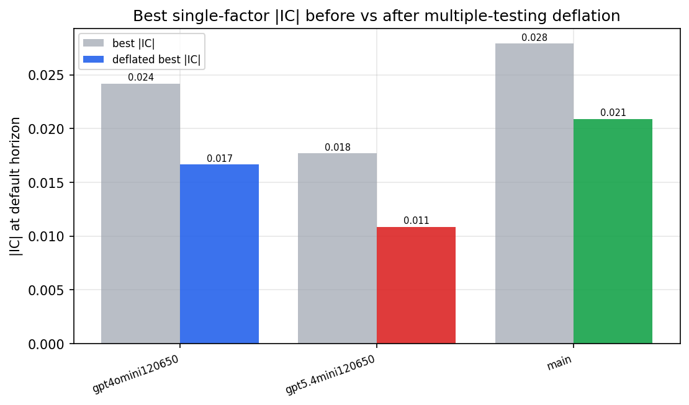

*Best |IC| before vs after multiple-testing deflation*

*Top factors by lasso importance per zoo*

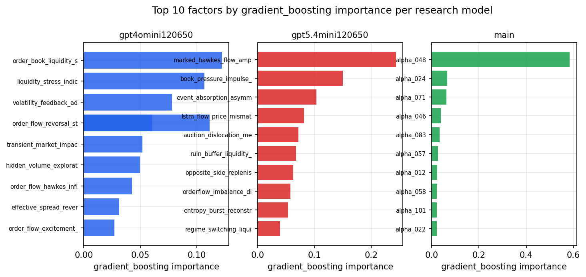

*Top factors by gradient_boosting importance per zoo*

## 4. ML-combined signal — per-underlying vectorised backtest

Each model combines a prerun's factors into ONE signal (fit `factors → forward return` on IS, predict per (bar, underlying)), then that combined signal is run through a simple vectorised backtest — `position(signal) × the underlying's own forward return` — on the held-out OOS tail (+ an equal-weight ensemble). No cross-sectional ranking.

> Config: position=**threshold** (t=1.0, z-score `expanding`), aggregation=**portfolio**, fit-standardise=**per_underlying**, horizon=6.

| prerun | model | n_factors_used | oos_ic | oos_sharpe | is_sharpe | oos_ann_return | oos_max_drawdown |
| --- | --- | --- | --- | --- | --- | --- | --- |
| gpt4omini120650 | linear_regression | 66 | -0.0036 | -1.8205 | 10.3002 | -0.0717 | -0.015 |
| gpt4omini120650 | ridge | 66 | -0.004 | 0.1819 | 9.7954 | 0.007 | -0.0107 |
| gpt4omini120650 | lasso | 66 | nan | nan | nan | nan | nan |
| gpt4omini120650 | elastic_net | 66 | nan | nan | nan | nan | nan |
| gpt4omini120650 | random_forest | 66 | -0.0014 | -2.8231 | 12.2746 | -0.2565 | -0.0409 |
| gpt4omini120650 | gradient_boosting | 66 | -0.0019 | -6.6572 | 13.571 | -0.5404 | -0.0497 |
| gpt4omini120650 | xgboost | 66 | 0.0004 | -3.9226 | 14.1315 | -0.2941 | -0.0384 |
| gpt4omini120650 | lightgbm | 66 | 0.0033 | -3.7176 | 20.9995 | -0.3102 | -0.0445 |
| gpt4omini120650 | ensemble | 66 | -0.0011 | -3.4718 | 16.5587 | -0.3027 | -0.0433 |
| gpt5.4mini120650 | linear_regression | 69 | 0.0102 | 1.8512 | 6.8878 | 0.15 | -0.0264 |
| gpt5.4mini120650 | ridge | 69 | 0.0098 | 2.291 | 6.3919 | 0.1847 | -0.0264 |
| gpt5.4mini120650 | lasso | 69 | nan | nan | nan | nan | nan |
| gpt5.4mini120650 | elastic_net | 69 | nan | nan | nan | nan | nan |
| gpt5.4mini120650 | random_forest | 69 | 0.0035 | -2.3558 | 13.0845 | -0.2035 | -0.0393 |
| gpt5.4mini120650 | gradient_boosting | 69 | -0.0015 | -5.3923 | 14.9432 | -0.2846 | -0.028 |
| gpt5.4mini120650 | xgboost | 69 | 0.0024 | -2.1242 | 17.2271 | -0.1468 | -0.0221 |
| gpt5.4mini120650 | lightgbm | 69 | 0.0054 | -1.0729 | 22.5695 | -0.0333 | -0.0109 |
| gpt5.4mini120650 | ensemble | 69 | 0.0073 | -1.4058 | 17.4072 | -0.1128 | -0.0326 |
| main | linear_regression | 78 | 0.0045 | -5.1512 | 10.468 | -0.2311 | -0.0233 |
| main | ridge | 78 | 0.0072 | -2.1944 | 11.3695 | -0.106 | -0.0181 |
| main | lasso | 78 | 0.004 | -5.8076 | 0.9418 | -0.1494 | -0.0131 |
| main | elastic_net | 78 | 0.004 | -5.8076 | 0.9418 | -0.1494 | -0.0131 |
| main | random_forest | 78 | 0.0091 | 2.4732 | 23.8308 | 0.1434 | -0.0082 |
| main | gradient_boosting | 78 | 0.0008 | 0.8859 | 13.1838 | 0.009 | -0.0035 |
| main | xgboost | 78 | 0.0154 | 0.881 | 25.7107 | 0.0272 | -0.0061 |
| main | lightgbm | 78 | 0.0115 | 4.1563 | 33.4184 | 0.1463 | -0.0045 |
| main | ensemble | 78 | 0.0063 | 0.7006 | 26.4448 | 0.028 | -0.0065 |

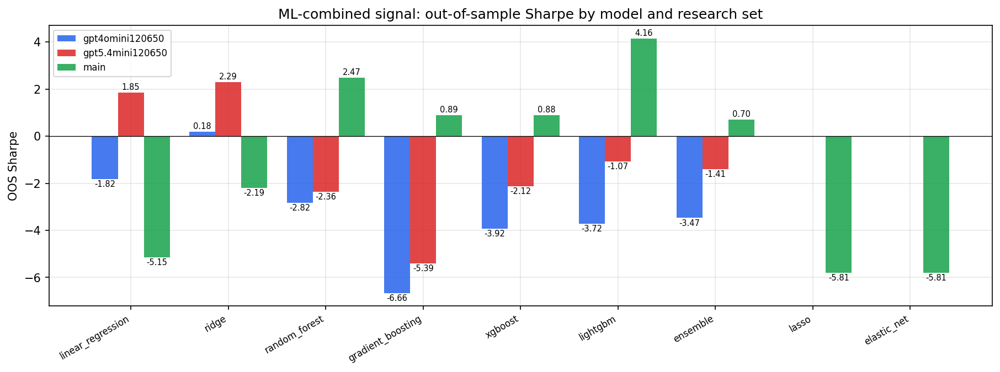

*ML-combined OOS Sharpe by model and research set*

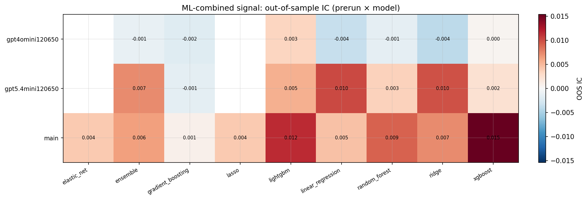

*ML-combined OOS IC (prerun × model)*

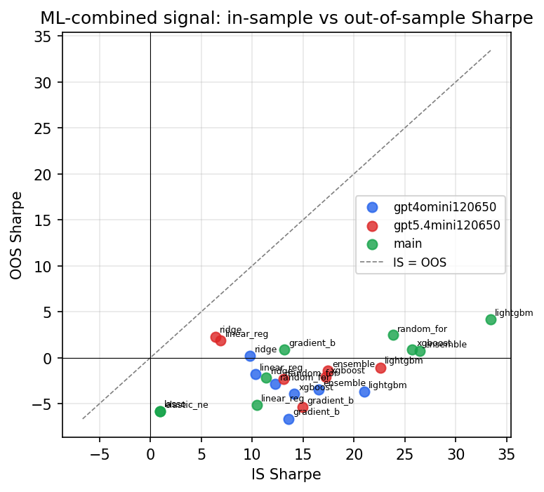

*IS vs OOS Sharpe (overfitting diagnostic)*

---
*Generated by `run_model_comparison.py`. Tables: `*.csv`; interactive: `comparison.ipynb`.*
