# Research-LLM factor comparison — `2024-07`

Comparing the **factor output of different research LLMs** on three axes (raw factor quality → factors as ML features → factors through the full agentic fund). The panel, IS/OOS split, horizon and model hyper-parameters are held identical across preruns — the *only* variable is the factor set.

## Preruns compared

| prerun | research_model | usable_factors | dropped_factors |
| --- | --- | --- | --- |
| gpt4omini120650 | gpt-4o-mini | 66 | 0 |
| gpt5.4mini120650 | gpt-5.4-mini | 69 | 0 |
| main | seed library | 78 | 10 |

> Dropped factors declare fields the current data doesn't have yet (e.g. fundamentals); they light up unchanged once that data is downloaded.

*Usable vs awaiting-data factors per research model*

## Key findings

- **Best ML-combined OOS Sharpe:** `gpt4omini120650` with `gradient_boosting` (OOS Sharpe = 2.151).
- **Mean OOS Sharpe across models, by research set:** `gpt5.4mini120650` = -0.011, `gpt4omini120650` = -0.035, `main` = -3.010.
- **Highest mean single-factor |IC| (h=6):** `main` (mean |IC| = 0.0084).
- **Most diverse zoo (highest effective/raw factor ratio):** `gpt5.4mini120650` (eff 54.7 of 69, ratio 0.79).
- **Best selection-deflated single-factor |IC|:** `main` (deflated |IC| = 0.0149 from 38 factors tried).

## 1. Single-factor IC (raw factor quality)

Per-underlying time-series Spearman rank-IC of every researched factor, recomputed on the shared panel at horizons h=1, h=6, h=60. The per-underlying IC correlates each factor's value vector with the underlying's own forward-return vector (pooled across underlyings); the cross-sectional IC ranks across underlyings per timestamp.

| prerun | n_factors | mean_abs_ic_1 | mean_abs_ic_6 | mean_abs_ic_60 | mean_abs_icir_6 | best_factor_h6 | best_abs_ic_h6 |
| --- | --- | --- | --- | --- | --- | --- | --- |
| gpt4omini120650 | 66 | 0.0033 | 0.0049 | 0.0068 | 0.2806 | limit_order_book_imbalance_surge | 0.0153 |
| gpt5.4mini120650 | 69 | 0.0036 | 0.0048 | 0.0058 | 0.3169 | auction_dislocation_mean_reversion | 0.012 |
| main | 78 | 0.0141 | 0.0084 | 0.0034 | 0.4638 | alpha_035 | 0.0219 |

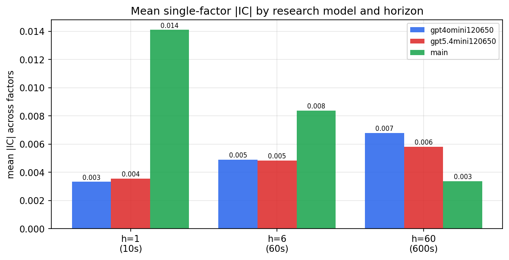

*Mean |IC| by research model and horizon*

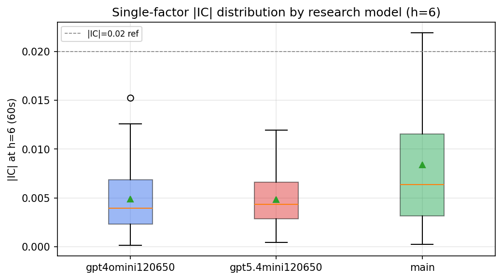

*Per-factor |IC| distribution by research model*

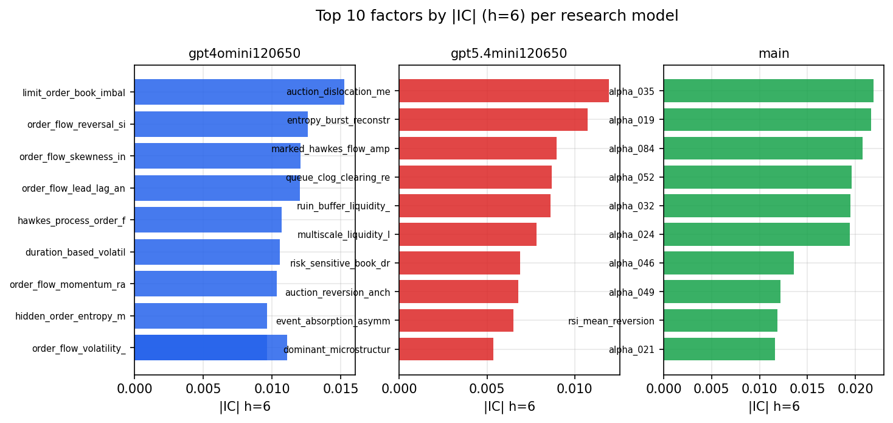

*Top factors by |IC| per research model*

## 2. Factor diversity & redundancy

Pairwise correlation of each zoo's *signals*. `eff_n_factors` is the effective number of independent factors (participation ratio of the correlation eigenvalues); `eff_ratio` and `redundancy` summarise how much unique information the zoo holds vs. how much is duplicated; `n_clusters` groups factors at |corr| ≥ 0.7.

| prerun | n_factors | eff_n_factors | eff_ratio | mean_abs_corr | n_clusters | redundancy |
| --- | --- | --- | --- | --- | --- | --- |
| gpt4omini120650 | 66 | 28.2336 | 0.4278 | 0.049 | 52 | 0.5722 |
| gpt5.4mini120650 | 69 | 54.7436 | 0.7934 | 0.0107 | 64 | 0.2066 |
| main | 78 | 41.9954 | 0.5384 | 0.0297 | 70 | 0.4616 |

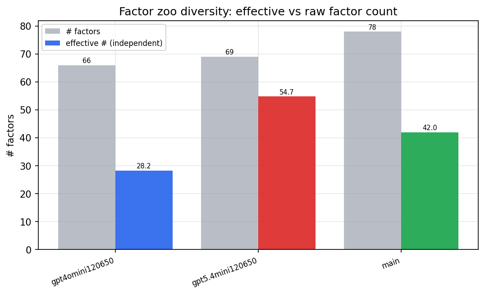

*Effective vs raw factor count per research model*

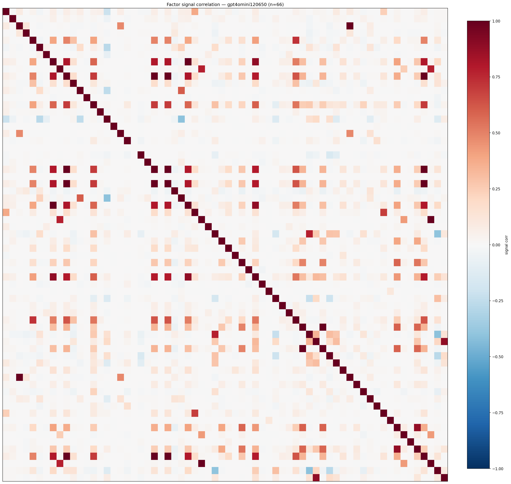

*Signal correlation matrix — gpt4omini120650*

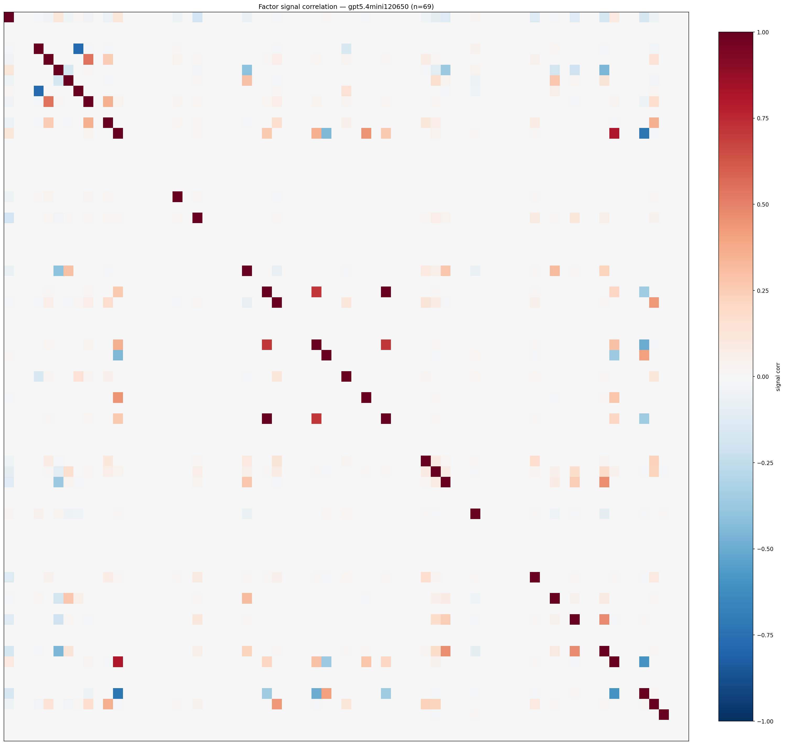

*Signal correlation matrix — gpt5.4mini120650*

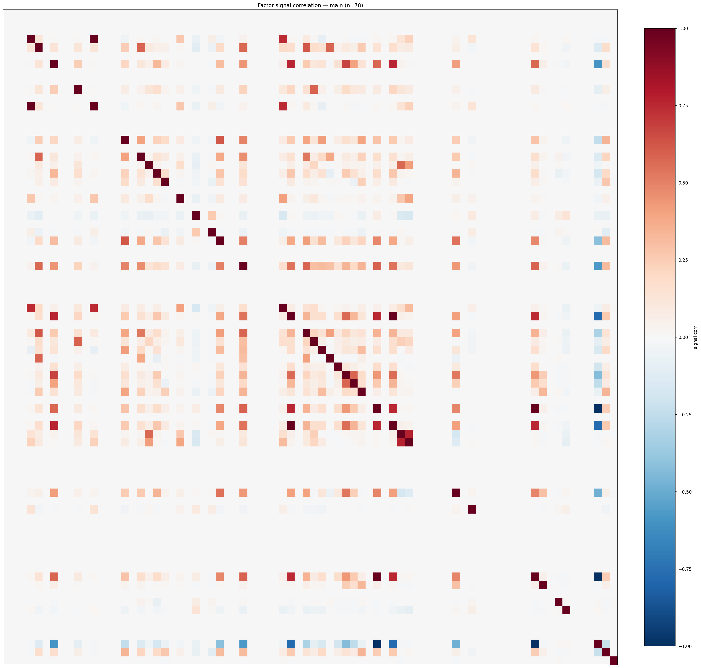

*Signal correlation matrix — main*

## 3. Deflation & model-based importance

`deflated_best_ic` haircuts each zoo's best |IC| for the number of factors tried (`ic_n_tested`) — a bigger zoo's best factor is more likely to be lucky. `lasso_n_nonzero` / `lasso_sparsity` show how many factors a sparse linear model actually keeps (model-view redundancy).

| prerun | best_ic | deflated_best_ic | deflated_best_t | ic_n_tested | ic_n_obs | lasso_n_nonzero | lasso_sparsity |
| --- | --- | --- | --- | --- | --- | --- | --- |
| gpt4omini120650 | 0.0153 | 0.0077 | 2.9579 | 64 | 146339 | 0 | 1.0 |
| gpt5.4mini120650 | 0.012 | 0.0051 | 1.9515 | 31 | 146339 | 0 | 1.0 |
| main | 0.0219 | 0.0149 | 5.6845 | 38 | 146339 | 0 | 1.0 |

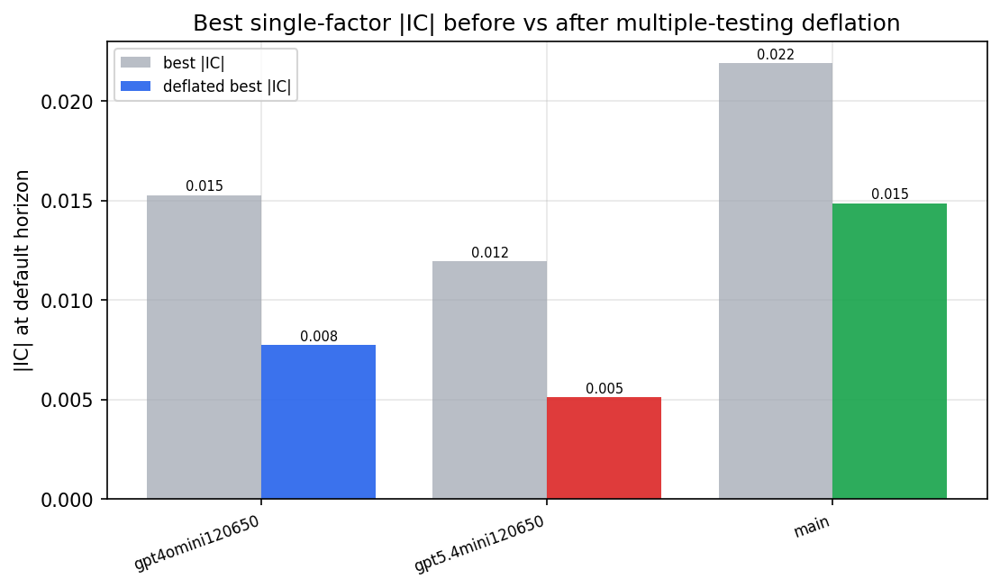

*Best |IC| before vs after multiple-testing deflation*

*Top factors by lasso importance per zoo*

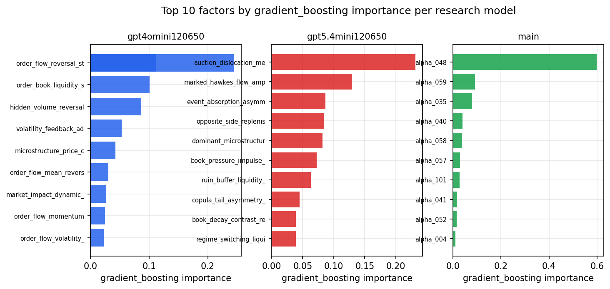

*Top factors by gradient_boosting importance per zoo*

## 4. ML-combined signal — per-underlying vectorised backtest

Each model combines a prerun's factors into ONE signal (fit `factors → forward return` on IS, predict per (bar, underlying)), then that combined signal is run through a simple vectorised backtest — `position(signal) × the underlying's own forward return` — on the held-out OOS tail (+ an equal-weight ensemble). No cross-sectional ranking.

> Config: position=**threshold** (t=1.0, z-score `expanding`), aggregation=**portfolio**, fit-standardise=**per_underlying**, horizon=6.

| prerun | model | n_factors_used | oos_ic | oos_sharpe | is_sharpe | oos_ann_return | oos_max_drawdown |
| --- | --- | --- | --- | --- | --- | --- | --- |
| gpt4omini120650 | linear_regression | 66 | -0.0008 | -0.7438 | 9.3998 | -0.1199 | -0.0483 |
| gpt4omini120650 | ridge | 66 | -0.0013 | 0.0823 | 10.4085 | 0.0132 | -0.0436 |
| gpt4omini120650 | lasso | 66 | nan | nan | nan | nan | nan |
| gpt4omini120650 | elastic_net | 66 | nan | nan | nan | nan | nan |
| gpt4omini120650 | random_forest | 66 | 0.0056 | -2.7195 | 13.5307 | -0.2177 | -0.0258 |
| gpt4omini120650 | gradient_boosting | 66 | 0.0061 | 2.1507 | 11.9183 | 0.2137 | -0.0136 |
| gpt4omini120650 | xgboost | 66 | 0.009 | 1.8877 | 16.2768 | 0.2141 | -0.0139 |
| gpt4omini120650 | lightgbm | 66 | 0.0109 | 0.9262 | 22.5039 | 0.0422 | -0.01 |
| gpt4omini120650 | ensemble | 66 | 0.001 | -1.8261 | 15.9507 | -0.2906 | -0.0533 |
| gpt5.4mini120650 | linear_regression | 69 | 0.0068 | 0.3535 | 8.1547 | 0.0552 | -0.0369 |
| gpt5.4mini120650 | ridge | 69 | 0.0065 | 0.207 | 7.4993 | 0.0323 | -0.0363 |
| gpt5.4mini120650 | lasso | 69 | nan | nan | nan | nan | nan |
| gpt5.4mini120650 | elastic_net | 69 | nan | nan | nan | nan | nan |
| gpt5.4mini120650 | random_forest | 69 | 0.0109 | 1.3891 | 11.7221 | 0.0698 | -0.0106 |
| gpt5.4mini120650 | gradient_boosting | 69 | 0.0065 | -2.1694 | 10.2208 | -0.0652 | -0.0101 |
| gpt5.4mini120650 | xgboost | 69 | 0.0087 | 0.0682 | 12.7389 | 0.002 | -0.0092 |
| gpt5.4mini120650 | lightgbm | 69 | 0.0091 | 1.6623 | 16.3862 | 0.0619 | -0.008 |
| gpt5.4mini120650 | ensemble | 69 | 0.0119 | -1.5891 | 7.8093 | -0.0235 | -0.0053 |
| main | linear_regression | 78 | 0.008 | -3.9564 | 9.1015 | -0.4916 | -0.0442 |
| main | ridge | 78 | 0.008 | -4.1215 | 9.1983 | -0.5107 | -0.045 |
| main | lasso | 78 | nan | nan | nan | nan | nan |
| main | elastic_net | 78 | nan | nan | nan | nan | nan |
| main | random_forest | 78 | 0.0053 | -1.3876 | 13.3735 | -0.0702 | -0.0171 |
| main | gradient_boosting | 78 | 0.0037 | -1.2202 | 10.6137 | -0.0278 | -0.0099 |
| main | xgboost | 78 | 0.0017 | -3.2371 | 15.086 | -0.1731 | -0.022 |
| main | lightgbm | 78 | -0.0014 | -2.6612 | 24.507 | -0.1759 | -0.024 |
| main | ensemble | 78 | 0.0072 | -4.4846 | 15.0556 | -0.1183 | -0.0147 |

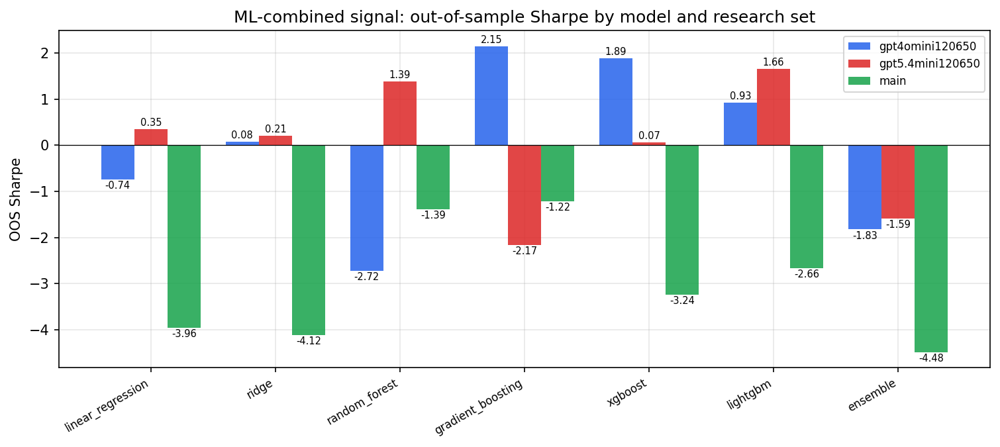

*ML-combined OOS Sharpe by model and research set*

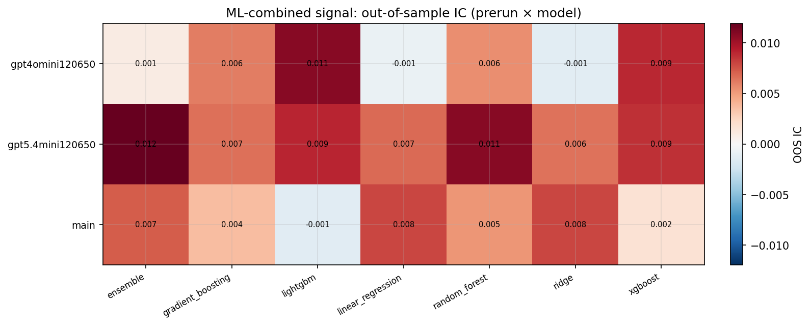

*ML-combined OOS IC (prerun × model)*

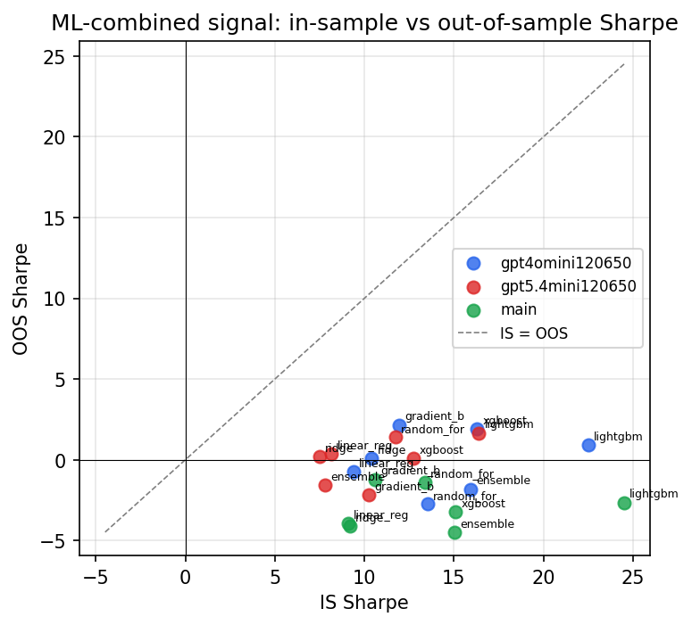

*IS vs OOS Sharpe (overfitting diagnostic)*

---
*Generated by `run_model_comparison.py`. Tables: `*.csv`; interactive: `comparison.ipynb`.*
