# Research-LLM factor comparison — `2024-08`

Comparing the **factor output of different research LLMs** on three axes (raw factor quality → factors as ML features → factors through the full agentic fund). The panel, IS/OOS split, horizon and model hyper-parameters are held identical across preruns — the *only* variable is the factor set.

## Preruns compared

| prerun | research_model | usable_factors | dropped_factors |
| --- | --- | --- | --- |
| gpt4omini120650 | gpt-4o-mini | 66 | 0 |
| gpt5.4mini120650 | gpt-5.4-mini | 69 | 0 |
| main | seed library | 78 | 10 |

> Dropped factors declare fields the current data doesn't have yet (e.g. fundamentals); they light up unchanged once that data is downloaded.

*Usable vs awaiting-data factors per research model*

## Key findings

- **Best ML-combined OOS Sharpe:** `gpt5.4mini120650` with `lightgbm` (OOS Sharpe = 9.288).
- **Mean OOS Sharpe across models, by research set:** `gpt5.4mini120650` = 4.419, `gpt4omini120650` = 1.804, `main` = -1.351.
- **Highest mean single-factor |IC| (h=6):** `main` (mean |IC| = 0.0087).
- **Most diverse zoo (highest effective/raw factor ratio):** `gpt5.4mini120650` (eff 55.4 of 69, ratio 0.80).
- **Best selection-deflated single-factor |IC|:** `main` (deflated |IC| = 0.0169 from 38 factors tried).

## 1. Single-factor IC (raw factor quality)

Per-underlying time-series Spearman rank-IC of every researched factor, recomputed on the shared panel at horizons h=1, h=6, h=60. The per-underlying IC correlates each factor's value vector with the underlying's own forward-return vector (pooled across underlyings); the cross-sectional IC ranks across underlyings per timestamp.

| prerun | n_factors | mean_abs_ic_1 | mean_abs_ic_6 | mean_abs_ic_60 | mean_abs_icir_6 | best_factor_h6 | best_abs_ic_h6 |
| --- | --- | --- | --- | --- | --- | --- | --- |
| gpt4omini120650 | 66 | 0.004 | 0.0052 | 0.0041 | 0.2864 | limit_order_book_imbalance_surge | 0.0151 |
| gpt5.4mini120650 | 69 | 0.0037 | 0.005 | 0.0077 | 0.326 | entropy_burst_reconstruction | 0.0123 |
| main | 78 | 0.0111 | 0.0087 | 0.0046 | 0.5235 | alpha_019 | 0.024 |

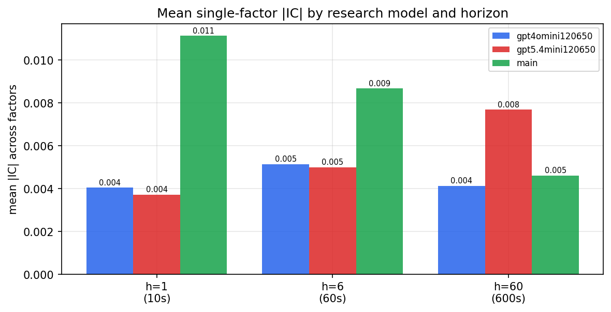

*Mean |IC| by research model and horizon*

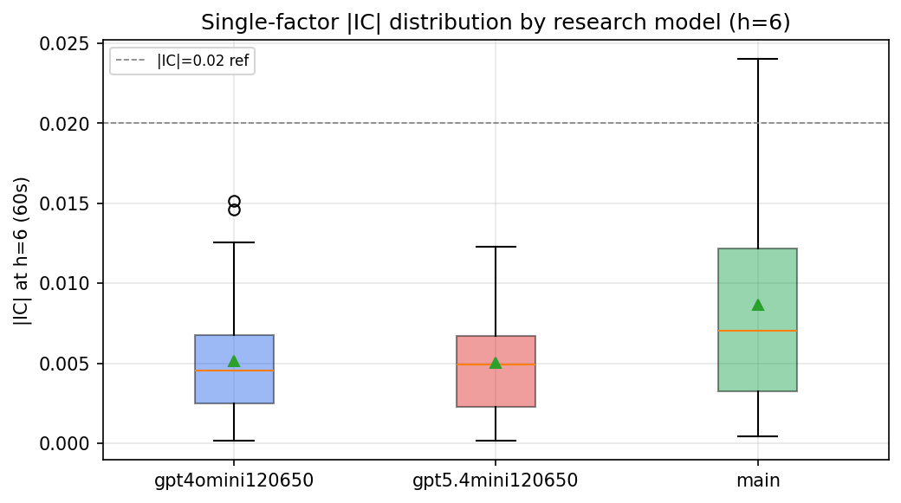

*Per-factor |IC| distribution by research model*

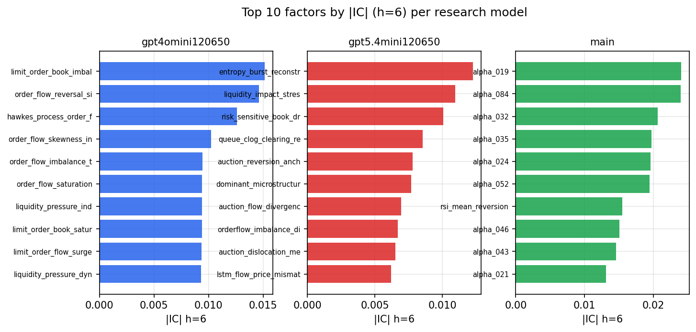

*Top factors by |IC| per research model*

## 2. Factor diversity & redundancy

Pairwise correlation of each zoo's *signals*. `eff_n_factors` is the effective number of independent factors (participation ratio of the correlation eigenvalues); `eff_ratio` and `redundancy` summarise how much unique information the zoo holds vs. how much is duplicated; `n_clusters` groups factors at |corr| ≥ 0.7.

| prerun | n_factors | eff_n_factors | eff_ratio | mean_abs_corr | n_clusters | redundancy |
| --- | --- | --- | --- | --- | --- | --- |
| gpt4omini120650 | 66 | 28.7593 | 0.4357 | 0.0467 | 52 | 0.5643 |
| gpt5.4mini120650 | 69 | 55.3606 | 0.8023 | 0.01 | 65 | 0.1977 |
| main | 78 | 42.445 | 0.5442 | 0.0289 | 69 | 0.4558 |

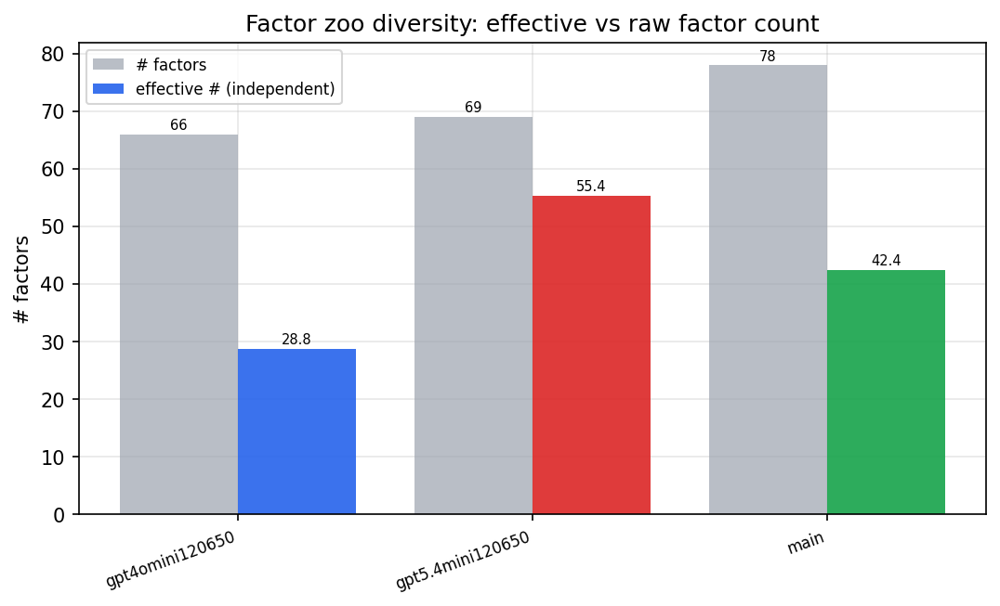

*Effective vs raw factor count per research model*

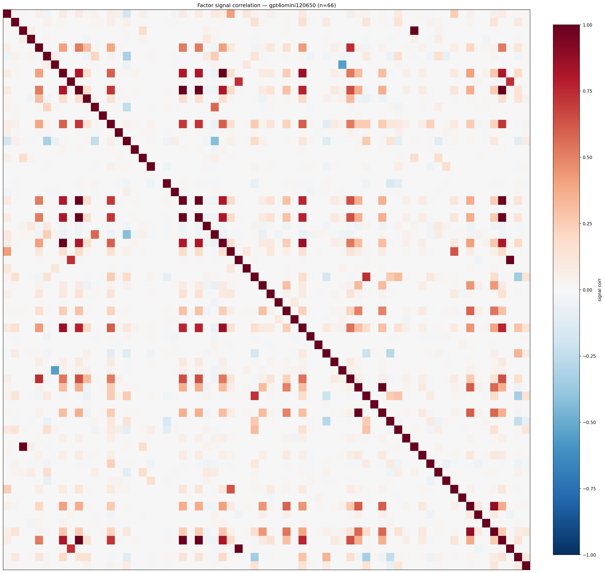

*Signal correlation matrix — gpt4omini120650*

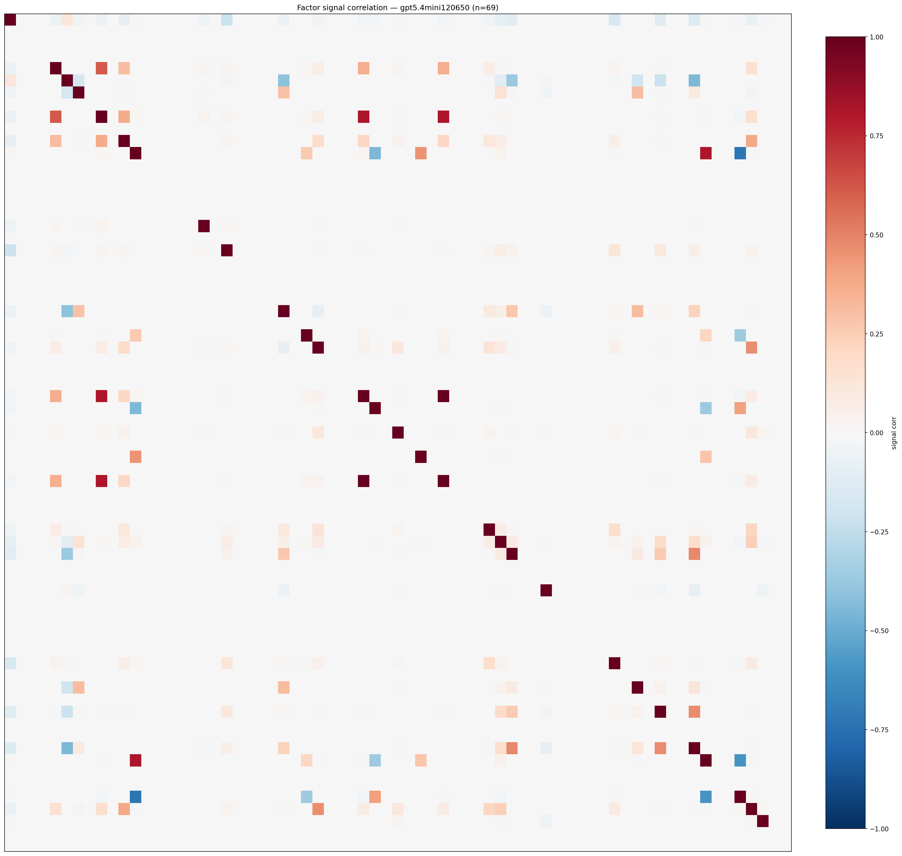

*Signal correlation matrix — gpt5.4mini120650*

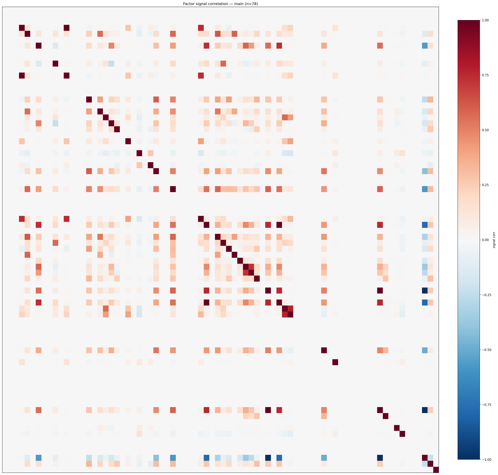

*Signal correlation matrix — main*

## 3. Deflation & model-based importance

`deflated_best_ic` haircuts each zoo's best |IC| for the number of factors tried (`ic_n_tested`) — a bigger zoo's best factor is more likely to be lucky. `lasso_n_nonzero` / `lasso_sparsity` show how many factors a sparse linear model actually keeps (model-view redundancy).

| prerun | best_ic | deflated_best_ic | deflated_best_t | ic_n_tested | ic_n_obs | lasso_n_nonzero | lasso_sparsity |
| --- | --- | --- | --- | --- | --- | --- | --- |
| gpt4omini120650 | 0.0151 | 0.0075 | 2.8564 | 64 | 143998 | 4 | 0.9394 |
| gpt5.4mini120650 | 0.0123 | 0.0054 | 2.0558 | 29 | 143998 | 12 | 0.8261 |
| main | 0.024 | 0.0169 | 6.4119 | 38 | 143998 | 0 | 1.0 |

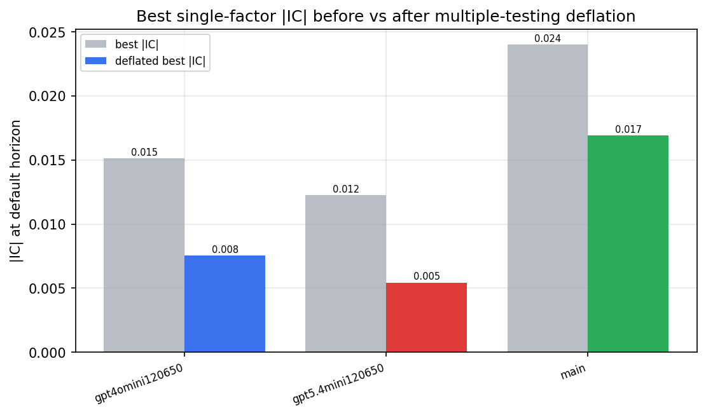

*Best |IC| before vs after multiple-testing deflation*

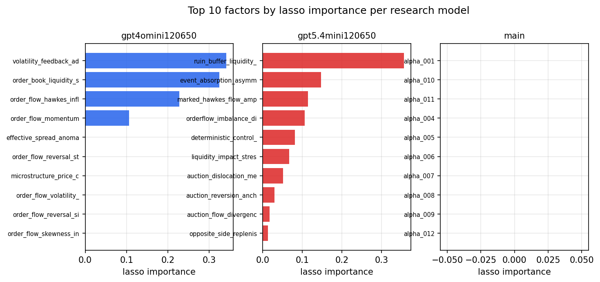

*Top factors by lasso importance per zoo*

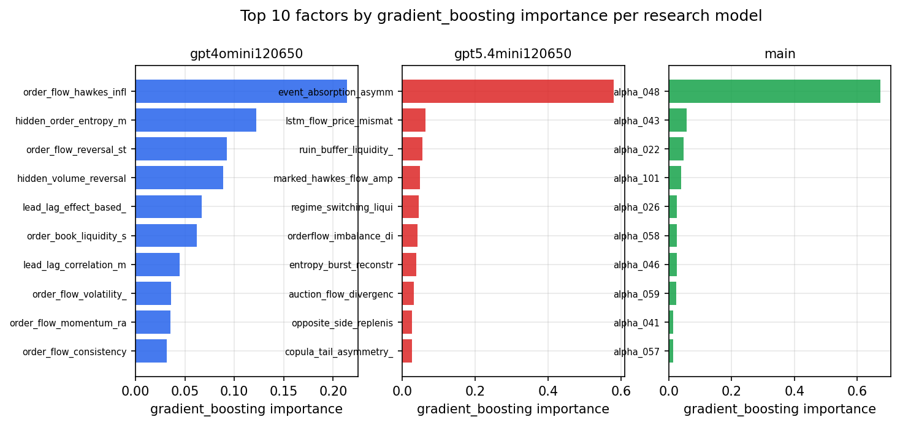

*Top factors by gradient_boosting importance per zoo*

## 4. ML-combined signal — per-underlying vectorised backtest

Each model combines a prerun's factors into ONE signal (fit `factors → forward return` on IS, predict per (bar, underlying)), then that combined signal is run through a simple vectorised backtest — `position(signal) × the underlying's own forward return` — on the held-out OOS tail (+ an equal-weight ensemble). No cross-sectional ranking.

> Config: position=**threshold** (t=1.0, z-score `expanding`), aggregation=**portfolio**, fit-standardise=**per_underlying**, horizon=6.

| prerun | model | n_factors_used | oos_ic | oos_sharpe | is_sharpe | oos_ann_return | oos_max_drawdown |
| --- | --- | --- | --- | --- | --- | --- | --- |
| gpt4omini120650 | linear_regression | 66 | -0.0037 | 0.7825 | 8.8523 | 0.0949 | -0.0241 |
| gpt4omini120650 | ridge | 66 | -0.0053 | -0.0201 | 8.9767 | -0.0025 | -0.0321 |
| gpt4omini120650 | lasso | 66 | -0.0108 | -0.759 | 8.392 | -0.0717 | -0.0219 |
| gpt4omini120650 | elastic_net | 66 | -0.011 | -0.8794 | 8.5316 | -0.0832 | -0.0219 |
| gpt4omini120650 | random_forest | 66 | -0.0248 | 1.4971 | 8.5568 | 0.107 | -0.0133 |
| gpt4omini120650 | gradient_boosting | 66 | -0.0268 | 4.1687 | 11.61 | 0.2786 | -0.0091 |
| gpt4omini120650 | xgboost | 66 | -0.0251 | 6.6768 | 13.9378 | 0.8374 | -0.0061 |
| gpt4omini120650 | lightgbm | 66 | -0.0296 | 2.3798 | 17.1868 | 0.2184 | -0.0135 |
| gpt4omini120650 | ensemble | 66 | -0.0112 | 2.391 | 14.813 | 0.3354 | -0.028 |
| gpt5.4mini120650 | linear_regression | 69 | -0.0004 | 5.784 | 4.666 | 0.6071 | -0.0092 |
| gpt5.4mini120650 | ridge | 69 | -0.0013 | 6.2945 | 4.5647 | 0.6729 | -0.0098 |
| gpt5.4mini120650 | lasso | 69 | nan | nan | nan | nan | nan |
| gpt5.4mini120650 | elastic_net | 69 | nan | nan | nan | nan | nan |
| gpt5.4mini120650 | random_forest | 69 | -0.0089 | 5.017 | 12.929 | 0.5872 | -0.0096 |
| gpt5.4mini120650 | gradient_boosting | 69 | -0.011 | 0.601 | 9.3986 | 0.0475 | -0.0186 |
| gpt5.4mini120650 | xgboost | 69 | -0.0058 | 2.6 | 12.0737 | 0.2296 | -0.0187 |
| gpt5.4mini120650 | lightgbm | 69 | -0.0034 | 9.2881 | 14.7604 | 0.6296 | -0.0027 |
| gpt5.4mini120650 | ensemble | 69 | -0.0048 | 1.3497 | 7.4876 | 0.0564 | -0.0079 |
| main | linear_regression | 78 | 0.0041 | -1.1967 | 8.6293 | -0.0921 | -0.0342 |
| main | ridge | 78 | 0.0047 | -1.004 | 9.4232 | -0.0522 | -0.0228 |
| main | lasso | 78 | nan | nan | nan | nan | nan |
| main | elastic_net | 78 | nan | nan | nan | nan | nan |
| main | random_forest | 78 | -0.0073 | -6.2211 | 13.5651 | -0.6498 | -0.0644 |
| main | gradient_boosting | 78 | -0.0115 | -0.4114 | 12.3874 | -0.0141 | -0.0112 |
| main | xgboost | 78 | -0.0144 | -0.8178 | 12.362 | -0.0501 | -0.0262 |
| main | lightgbm | 78 | -0.0015 | 0.1762 | 18.1307 | 0.02 | -0.0328 |
| main | ensemble | 78 | 0.0024 | 0.0171 | 10.103 | 0.0008 | -0.0145 |

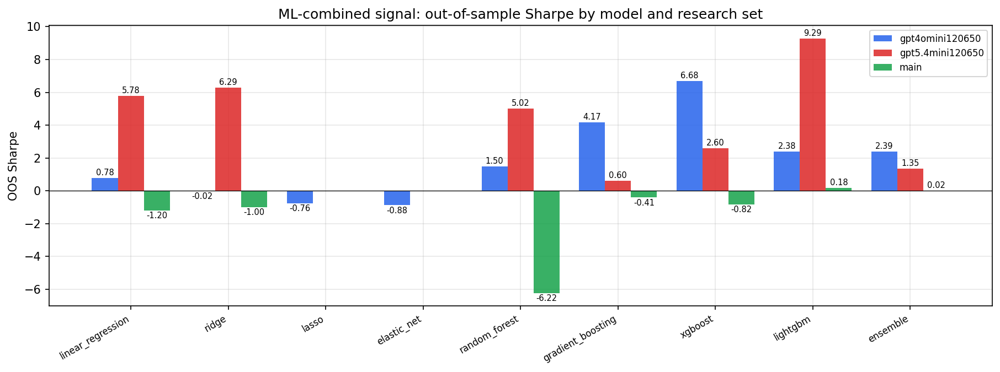

*ML-combined OOS Sharpe by model and research set*

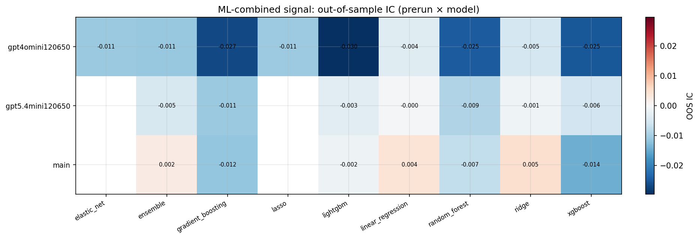

*ML-combined OOS IC (prerun × model)*

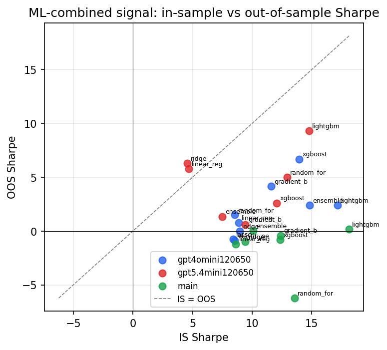

*IS vs OOS Sharpe (overfitting diagnostic)*

---
*Generated by `run_model_comparison.py`. Tables: `*.csv`; interactive: `comparison.ipynb`.*
