# Research-LLM factor comparison — `2024-09`

Comparing the **factor output of different research LLMs** on three axes (raw factor quality → factors as ML features → factors through the full agentic fund). The panel, IS/OOS split, horizon and model hyper-parameters are held identical across preruns — the *only* variable is the factor set.

## Preruns compared

| prerun | research_model | usable_factors | dropped_factors |
| --- | --- | --- | --- |
| gpt4omini120650 | gpt-4o-mini | 66 | 0 |
| gpt5.4mini120650 | gpt-5.4-mini | 69 | 0 |
| main | seed library | 78 | 10 |

> Dropped factors declare fields the current data doesn't have yet (e.g. fundamentals); they light up unchanged once that data is downloaded.

*Usable vs awaiting-data factors per research model*

## Key findings

- **Best ML-combined OOS Sharpe:** `gpt4omini120650` with `lightgbm` (OOS Sharpe = 8.751).
- **Mean OOS Sharpe across models, by research set:** `gpt4omini120650` = 5.113, `gpt5.4mini120650` = 3.947, `main` = 1.766.
- **Highest mean single-factor |IC| (h=6):** `main` (mean |IC| = 0.0107).
- **Most diverse zoo (highest effective/raw factor ratio):** `gpt5.4mini120650` (eff 54.4 of 69, ratio 0.79).
- **Best selection-deflated single-factor |IC|:** `main` (deflated |IC| = 0.0189 from 38 factors tried).

## 1. Single-factor IC (raw factor quality)

Per-underlying time-series Spearman rank-IC of every researched factor, recomputed on the shared panel at horizons h=1, h=6, h=60. The per-underlying IC correlates each factor's value vector with the underlying's own forward-return vector (pooled across underlyings); the cross-sectional IC ranks across underlyings per timestamp.

| prerun | n_factors | mean_abs_ic_1 | mean_abs_ic_6 | mean_abs_ic_60 | mean_abs_icir_6 | best_factor_h6 | best_abs_ic_h6 |
| --- | --- | --- | --- | --- | --- | --- | --- |
| gpt4omini120650 | 66 | 0.0032 | 0.0067 | 0.0045 | 0.34 | order_flow_reversal_signal | 0.0232 |
| gpt5.4mini120650 | 69 | 0.0031 | 0.0049 | 0.0071 | 0.297 | lstm_flow_price_mismatch | 0.0161 |
| main | 78 | 0.0104 | 0.0107 | 0.0038 | 0.4968 | alpha_084 | 0.0261 |

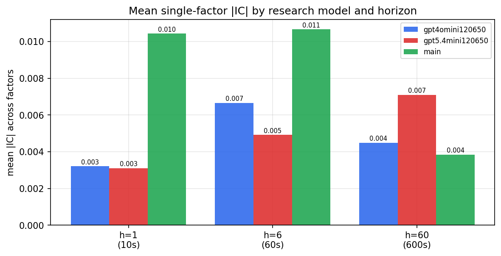

*Mean |IC| by research model and horizon*

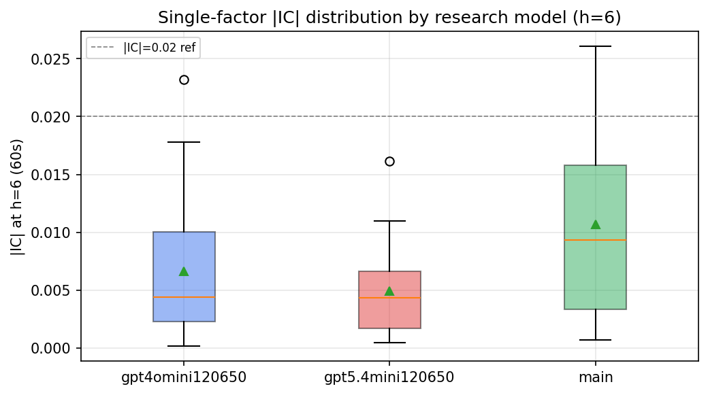

*Per-factor |IC| distribution by research model*

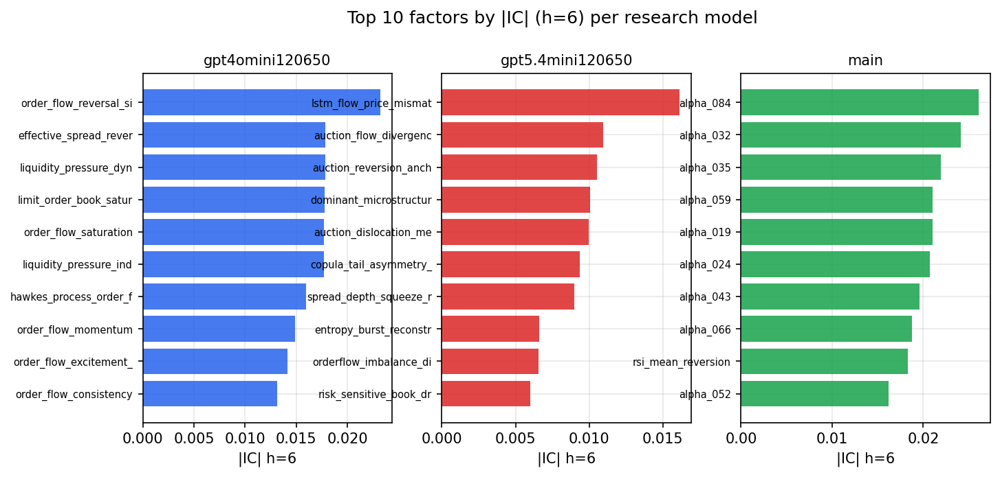

*Top factors by |IC| per research model*

## 2. Factor diversity & redundancy

Pairwise correlation of each zoo's *signals*. `eff_n_factors` is the effective number of independent factors (participation ratio of the correlation eigenvalues); `eff_ratio` and `redundancy` summarise how much unique information the zoo holds vs. how much is duplicated; `n_clusters` groups factors at |corr| ≥ 0.7.

| prerun | n_factors | eff_n_factors | eff_ratio | mean_abs_corr | n_clusters | redundancy |
| --- | --- | --- | --- | --- | --- | --- |
| gpt4omini120650 | 66 | 27.9484 | 0.4235 | 0.0488 | 52 | 0.5765 |
| gpt5.4mini120650 | 69 | 54.4472 | 0.7891 | 0.0099 | 65 | 0.2109 |
| main | 78 | 43.6672 | 0.5598 | 0.0278 | 70 | 0.4402 |

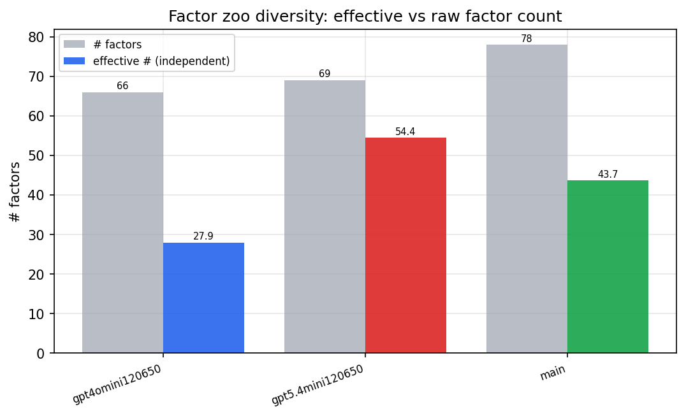

*Effective vs raw factor count per research model*

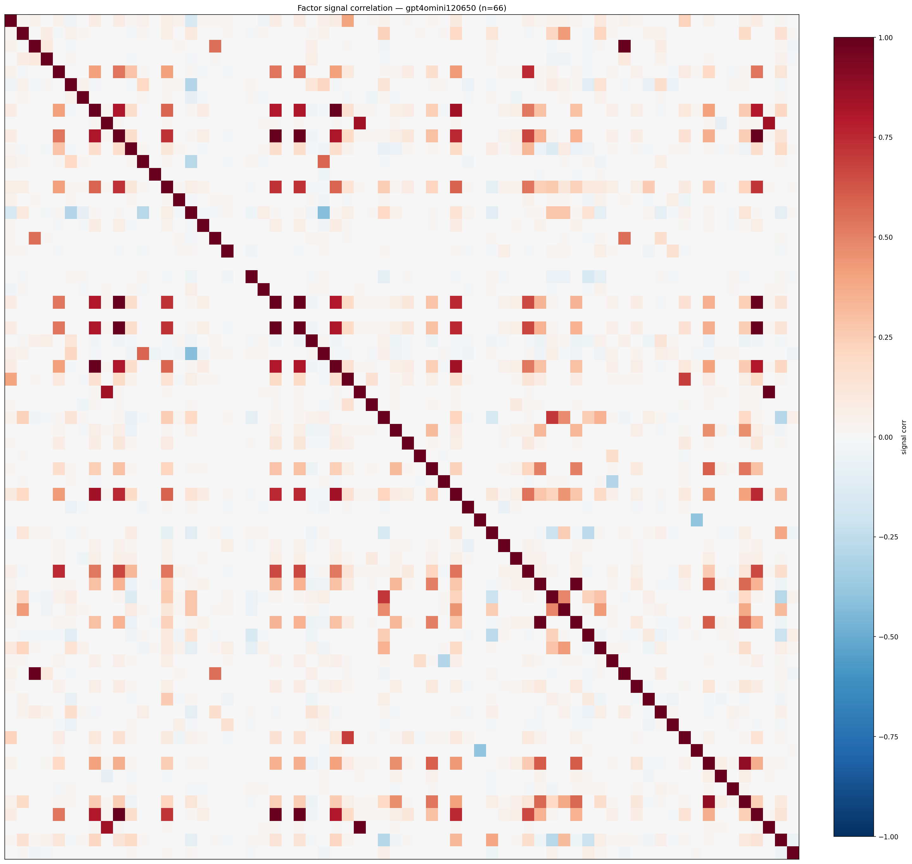

*Signal correlation matrix — gpt4omini120650*

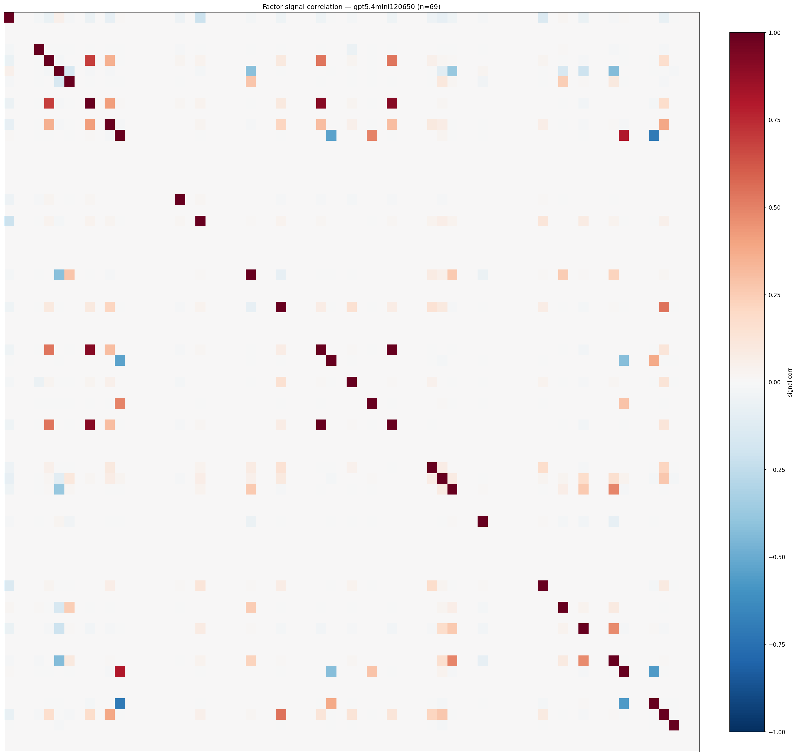

*Signal correlation matrix — gpt5.4mini120650*

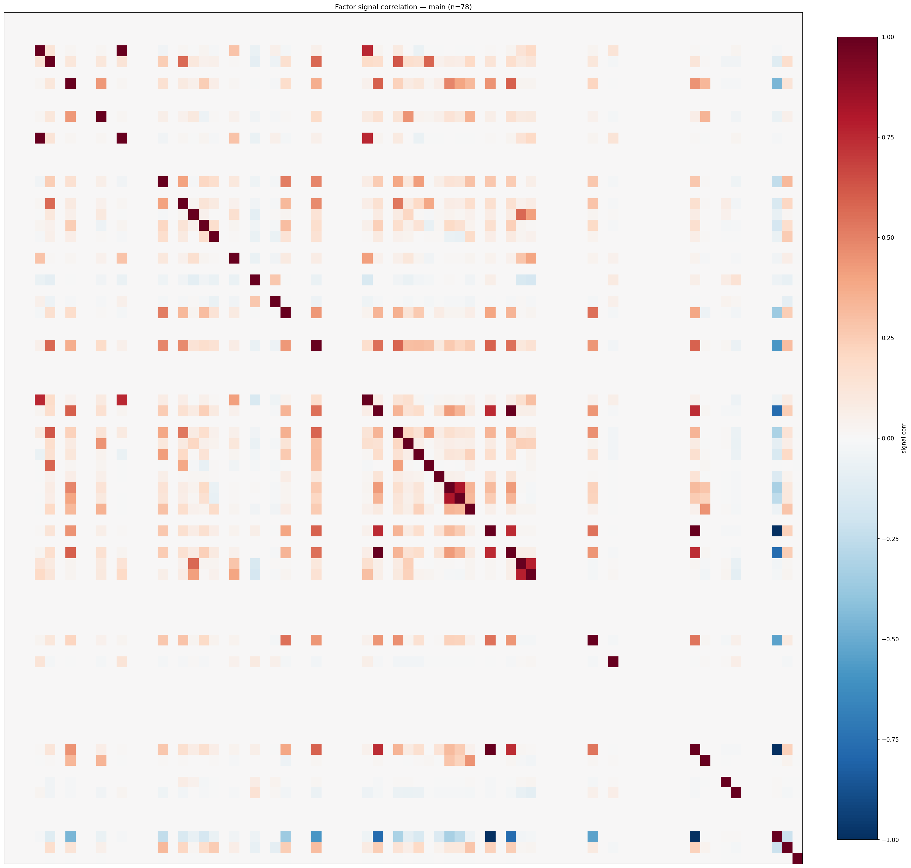

*Signal correlation matrix — main*

## 3. Deflation & model-based importance

`deflated_best_ic` haircuts each zoo's best |IC| for the number of factors tried (`ic_n_tested`) — a bigger zoo's best factor is more likely to be lucky. `lasso_n_nonzero` / `lasso_sparsity` show how many factors a sparse linear model actually keeps (model-view redundancy).

| prerun | best_ic | deflated_best_ic | deflated_best_t | ic_n_tested | ic_n_obs | lasso_n_nonzero | lasso_sparsity |
| --- | --- | --- | --- | --- | --- | --- | --- |
| gpt4omini120650 | 0.0232 | 0.0156 | 5.9169 | 64 | 143997 | 0 | 1.0 |
| gpt5.4mini120650 | 0.0161 | 0.0092 | 3.5088 | 30 | 143997 | 0 | 1.0 |
| main | 0.0261 | 0.0189 | 7.1907 | 38 | 143997 | 0 | 1.0 |

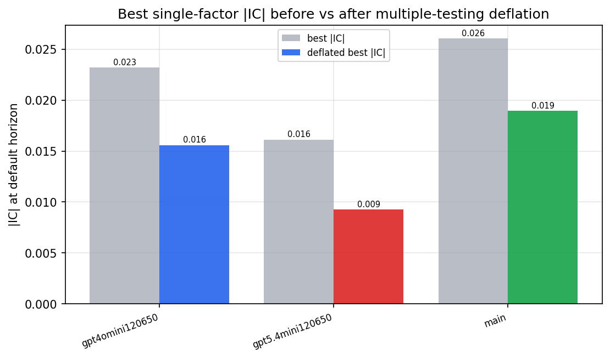

*Best |IC| before vs after multiple-testing deflation*

*Top factors by lasso importance per zoo*

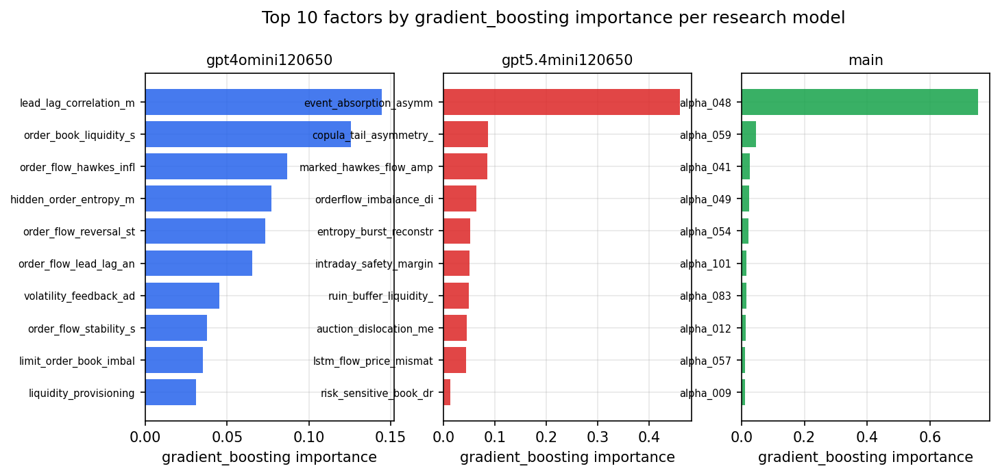

*Top factors by gradient_boosting importance per zoo*

## 4. ML-combined signal — per-underlying vectorised backtest

Each model combines a prerun's factors into ONE signal (fit `factors → forward return` on IS, predict per (bar, underlying)), then that combined signal is run through a simple vectorised backtest — `position(signal) × the underlying's own forward return` — on the held-out OOS tail (+ an equal-weight ensemble). No cross-sectional ranking.

> Config: position=**threshold** (t=1.0, z-score `expanding`), aggregation=**portfolio**, fit-standardise=**per_underlying**, horizon=6.

| prerun | model | n_factors_used | oos_ic | oos_sharpe | is_sharpe | oos_ann_return | oos_max_drawdown |
| --- | --- | --- | --- | --- | --- | --- | --- |
| gpt4omini120650 | linear_regression | 66 | 0.0174 | 3.8901 | 9.5585 | 0.3893 | -0.019 |
| gpt4omini120650 | ridge | 66 | 0.019 | 5.0649 | 9.0583 | 0.5043 | -0.015 |
| gpt4omini120650 | lasso | 66 | nan | nan | nan | nan | nan |
| gpt4omini120650 | elastic_net | 66 | nan | nan | nan | nan | nan |
| gpt4omini120650 | random_forest | 66 | -0.0104 | 3.3471 | 9.9545 | 0.4074 | -0.0285 |
| gpt4omini120650 | gradient_boosting | 66 | -0.0185 | 1.8044 | 7.7849 | 0.1309 | -0.0192 |
| gpt4omini120650 | xgboost | 66 | -0.0077 | 5.734 | 10.5071 | 0.5534 | -0.01 |
| gpt4omini120650 | lightgbm | 66 | -0.0019 | 8.7505 | 12.9203 | 0.9825 | -0.007 |
| gpt4omini120650 | ensemble | 66 | 0.0081 | 7.2014 | 12.9178 | 0.8624 | -0.0199 |
| gpt5.4mini120650 | linear_regression | 69 | 0.0043 | 3.588 | 6.2141 | 0.31 | -0.0096 |
| gpt5.4mini120650 | ridge | 69 | 0.0036 | 3.2144 | 5.7434 | 0.2788 | -0.0098 |
| gpt5.4mini120650 | lasso | 69 | nan | nan | nan | nan | nan |
| gpt5.4mini120650 | elastic_net | 69 | -0.0021 | 4.2876 | 3.1816 | 0.3868 | -0.0091 |
| gpt5.4mini120650 | random_forest | 69 | -0.0028 | 4.5846 | 8.3978 | 0.3769 | -0.0144 |
| gpt5.4mini120650 | gradient_boosting | 69 | 0.0091 | 1.0281 | 7.3442 | 0.0467 | -0.0066 |
| gpt5.4mini120650 | xgboost | 69 | 0.0008 | 3.0532 | 10.5246 | 0.1475 | -0.0111 |
| gpt5.4mini120650 | lightgbm | 69 | 0.0027 | 6.7319 | 13.155 | 0.3814 | -0.0057 |
| gpt5.4mini120650 | ensemble | 69 | 0.0014 | 5.0909 | 10.2904 | 0.3986 | -0.0092 |
| main | linear_regression | 78 | 0.018 | 0.7055 | 6.9994 | 0.0638 | -0.0248 |
| main | ridge | 78 | 0.0193 | 1.0446 | 6.5658 | 0.0958 | -0.0234 |
| main | lasso | 78 | 0.0091 | 5.3118 | 4.0024 | 0.6995 | -0.0187 |
| main | elastic_net | 78 | 0.0091 | 5.3118 | 4.0024 | 0.6995 | -0.0187 |
| main | random_forest | 78 | 0.0279 | 3.2917 | 10.4206 | 0.3958 | -0.0254 |
| main | gradient_boosting | 78 | 0.022 | -3.1556 | 8.7394 | -0.0935 | -0.0112 |
| main | xgboost | 78 | 0.0108 | 0.4466 | 10.4876 | 0.0414 | -0.0248 |
| main | lightgbm | 78 | 0.0134 | -1.848 | 14.3868 | -0.1603 | -0.0304 |
| main | ensemble | 78 | 0.0205 | 4.7871 | 10.0041 | 0.6706 | -0.0218 |

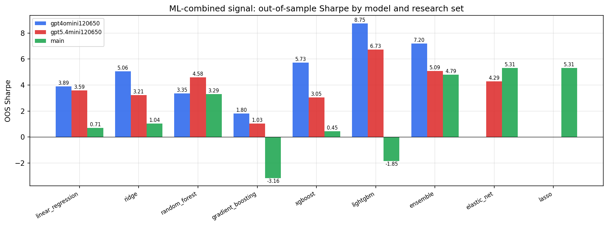

*ML-combined OOS Sharpe by model and research set*

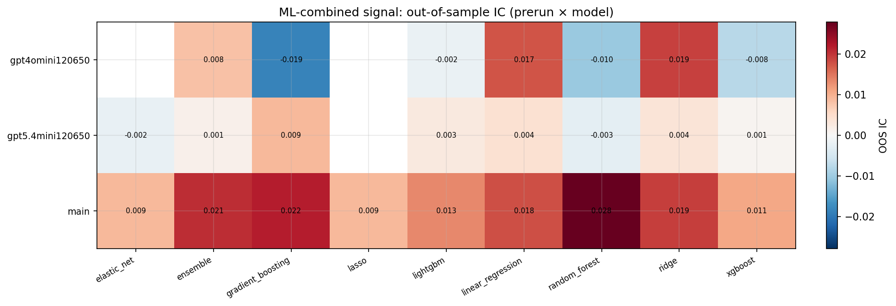

*ML-combined OOS IC (prerun × model)*

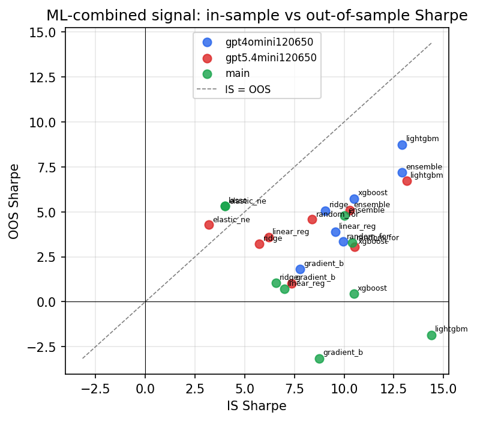

*IS vs OOS Sharpe (overfitting diagnostic)*

---
*Generated by `run_model_comparison.py`. Tables: `*.csv`; interactive: `comparison.ipynb`.*
