# Research-LLM factor comparison — `2024-10`

Comparing the **factor output of different research LLMs** on three axes (raw factor quality → factors as ML features → factors through the full agentic fund). The panel, IS/OOS split, horizon and model hyper-parameters are held identical across preruns — the *only* variable is the factor set.

## Preruns compared

| prerun | research_model | usable_factors | dropped_factors |
| --- | --- | --- | --- |
| gpt4omini120650 | gpt-4o-mini | 66 | 0 |
| gpt5.4mini120650 | gpt-5.4-mini | 69 | 0 |
| main | seed library | 78 | 10 |

> Dropped factors declare fields the current data doesn't have yet (e.g. fundamentals); they light up unchanged once that data is downloaded.

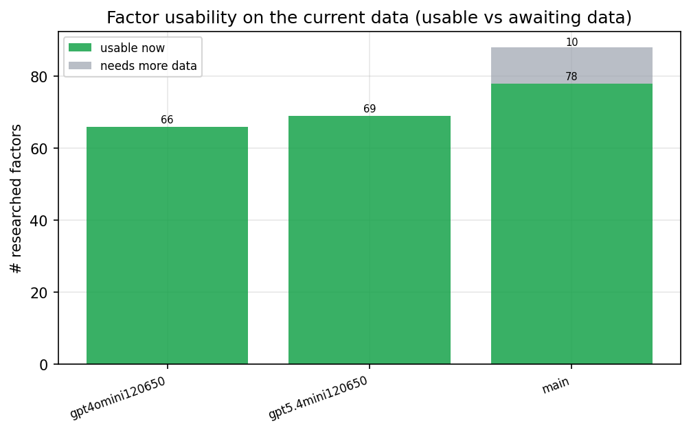

*Usable vs awaiting-data factors per research model*

## Key findings

- **Best ML-combined OOS Sharpe:** `main` with `lightgbm` (OOS Sharpe = 3.186).
- **Mean OOS Sharpe across models, by research set:** `main` = 0.164, `gpt4omini120650` = -2.115, `gpt5.4mini120650` = -2.703.
- **Highest mean single-factor |IC| (h=6):** `main` (mean |IC| = 0.0127).
- **Most diverse zoo (highest effective/raw factor ratio):** `gpt5.4mini120650` (eff 53.5 of 69, ratio 0.77).
- **Best selection-deflated single-factor |IC|:** `main` (deflated |IC| = 0.0212 from 38 factors tried).

## 1. Single-factor IC (raw factor quality)

Per-underlying time-series Spearman rank-IC of every researched factor, recomputed on the shared panel at horizons h=1, h=6, h=60. The per-underlying IC correlates each factor's value vector with the underlying's own forward-return vector (pooled across underlyings); the cross-sectional IC ranks across underlyings per timestamp.

| prerun | n_factors | mean_abs_ic_1 | mean_abs_ic_6 | mean_abs_ic_60 | mean_abs_icir_6 | best_factor_h6 | best_abs_ic_h6 |
| --- | --- | --- | --- | --- | --- | --- | --- |
| gpt4omini120650 | 66 | 0.0046 | 0.008 | 0.0075 | 0.4318 | order_flow_reversal_signal | 0.0247 |
| gpt5.4mini120650 | 69 | 0.0035 | 0.0055 | 0.006 | 0.4041 | lstm_flow_price_mismatch | 0.022 |
| main | 78 | 0.0118 | 0.0127 | 0.0052 | 0.75 | alpha_084 | 0.0282 |

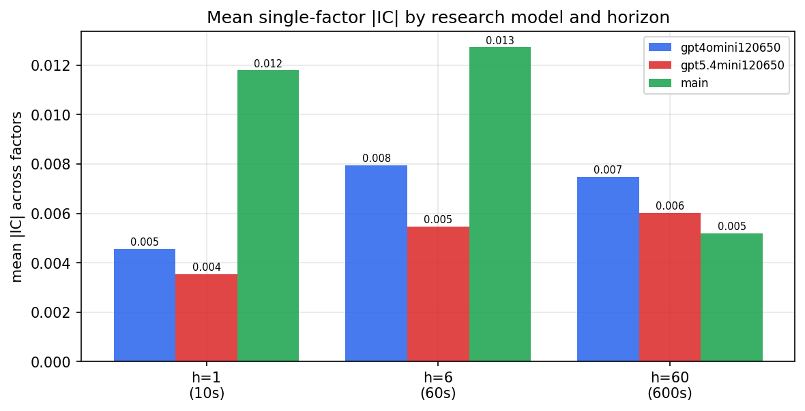

*Mean |IC| by research model and horizon*

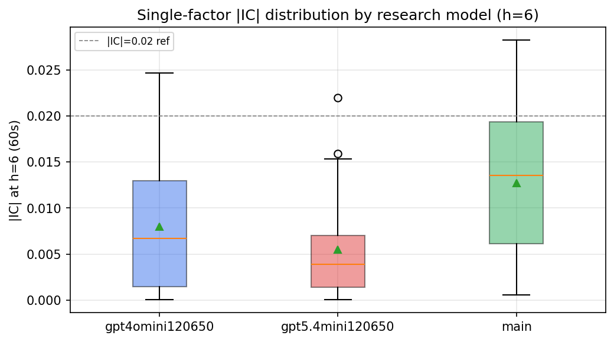

*Per-factor |IC| distribution by research model*

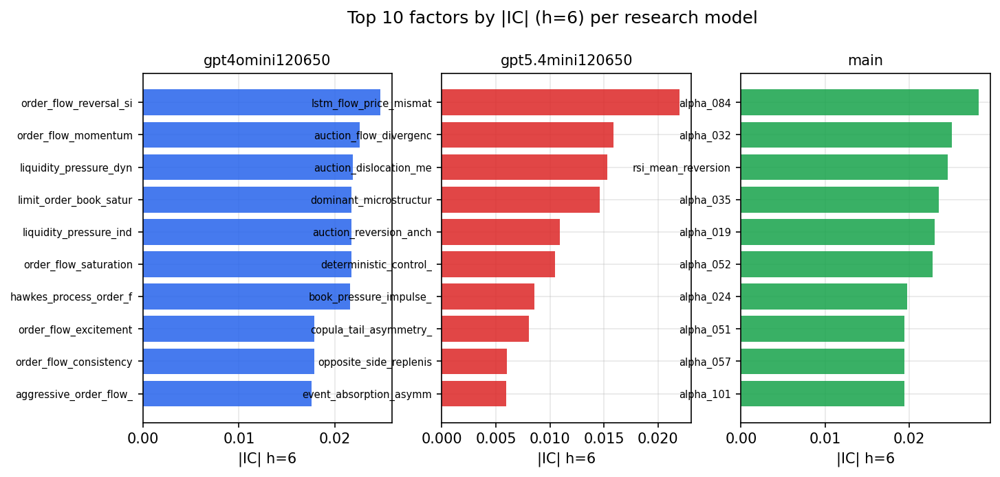

*Top factors by |IC| per research model*

## 2. Factor diversity & redundancy

Pairwise correlation of each zoo's *signals*. `eff_n_factors` is the effective number of independent factors (participation ratio of the correlation eigenvalues); `eff_ratio` and `redundancy` summarise how much unique information the zoo holds vs. how much is duplicated; `n_clusters` groups factors at |corr| ≥ 0.7.

| prerun | n_factors | eff_n_factors | eff_ratio | mean_abs_corr | n_clusters | redundancy |
| --- | --- | --- | --- | --- | --- | --- |
| gpt4omini120650 | 66 | 28.2698 | 0.4283 | 0.0477 | 54 | 0.5717 |
| gpt5.4mini120650 | 69 | 53.4599 | 0.7748 | 0.0103 | 65 | 0.2252 |
| main | 78 | 43.3127 | 0.5553 | 0.0278 | 70 | 0.4447 |

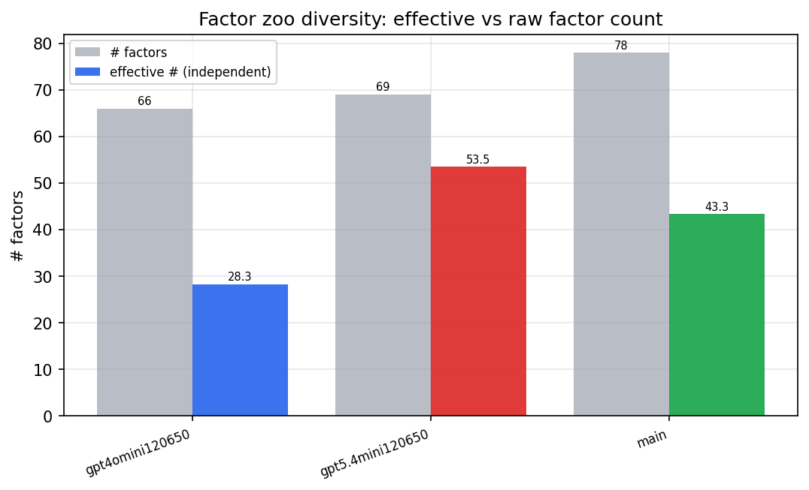

*Effective vs raw factor count per research model*

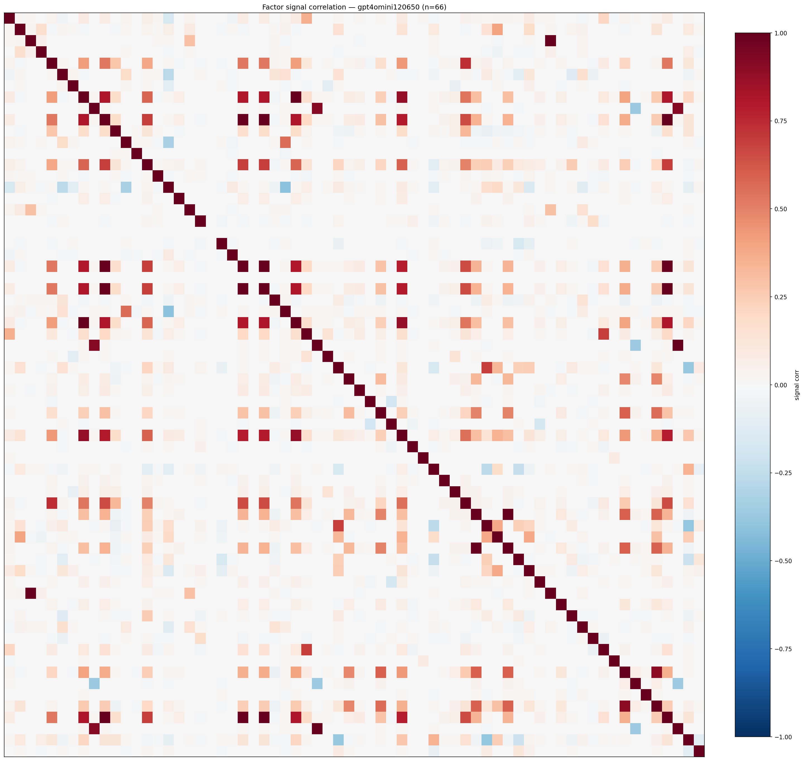

*Signal correlation matrix — gpt4omini120650*

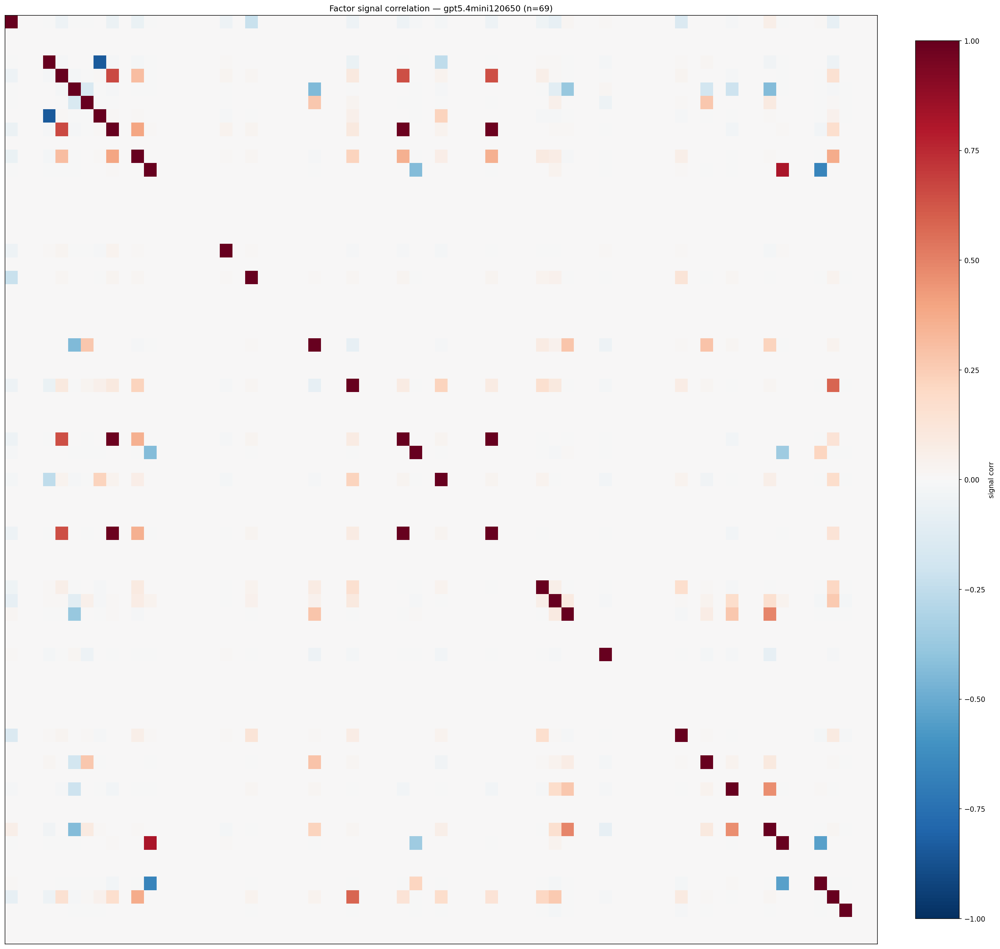

*Signal correlation matrix — gpt5.4mini120650*

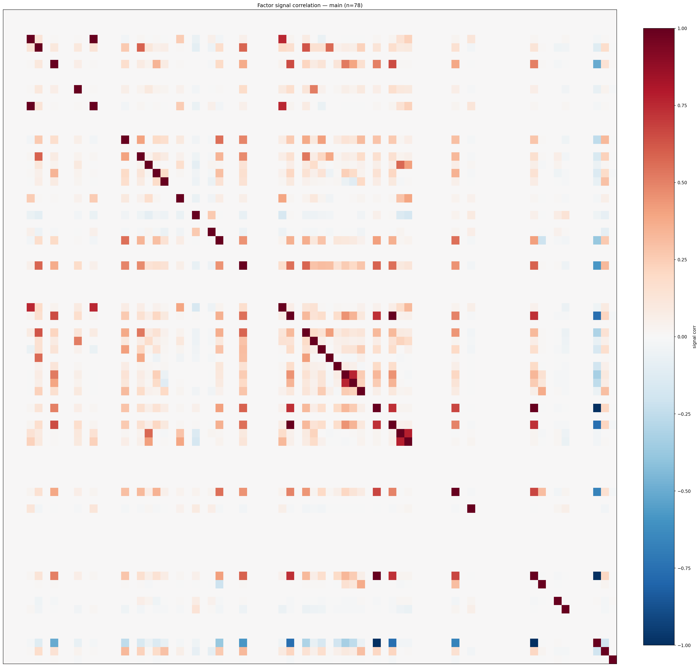

*Signal correlation matrix — main*

## 3. Deflation & model-based importance

`deflated_best_ic` haircuts each zoo's best |IC| for the number of factors tried (`ic_n_tested`) — a bigger zoo's best factor is more likely to be lucky. `lasso_n_nonzero` / `lasso_sparsity` show how many factors a sparse linear model actually keeps (model-view redundancy).

| prerun | best_ic | deflated_best_ic | deflated_best_t | ic_n_tested | ic_n_obs | lasso_n_nonzero | lasso_sparsity |
| --- | --- | --- | --- | --- | --- | --- | --- |
| gpt4omini120650 | 0.0247 | 0.0172 | 6.5944 | 64 | 147417 | 2 | 0.9697 |
| gpt5.4mini120650 | 0.022 | 0.0152 | 5.8177 | 31 | 147417 | 0 | 1.0 |
| main | 0.0282 | 0.0212 | 8.1432 | 38 | 147417 | 0 | 1.0 |

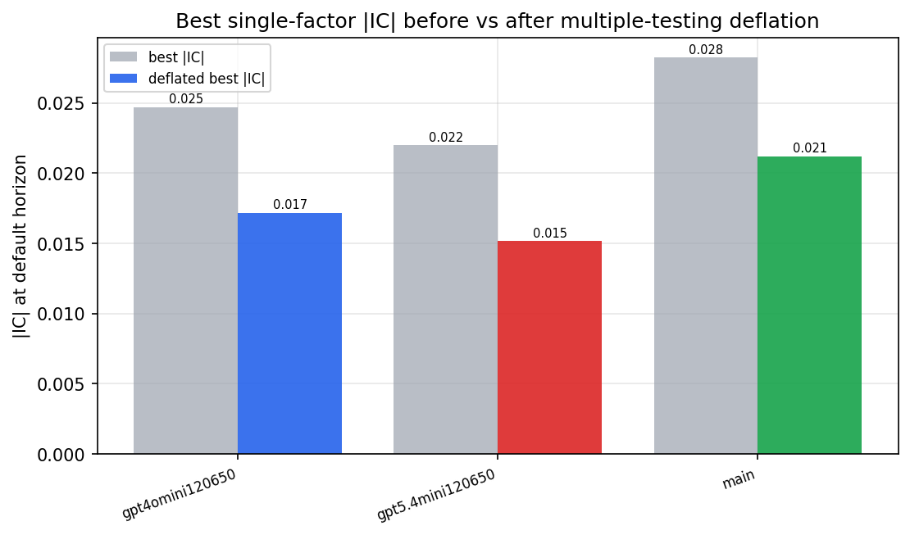

*Best |IC| before vs after multiple-testing deflation*

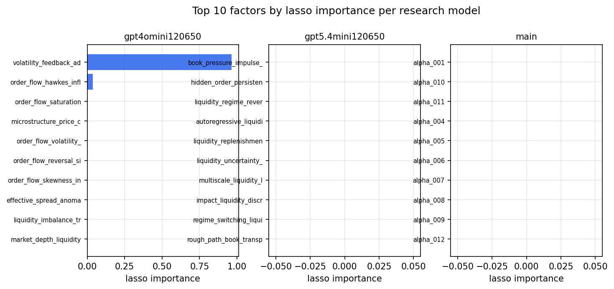

*Top factors by lasso importance per zoo*

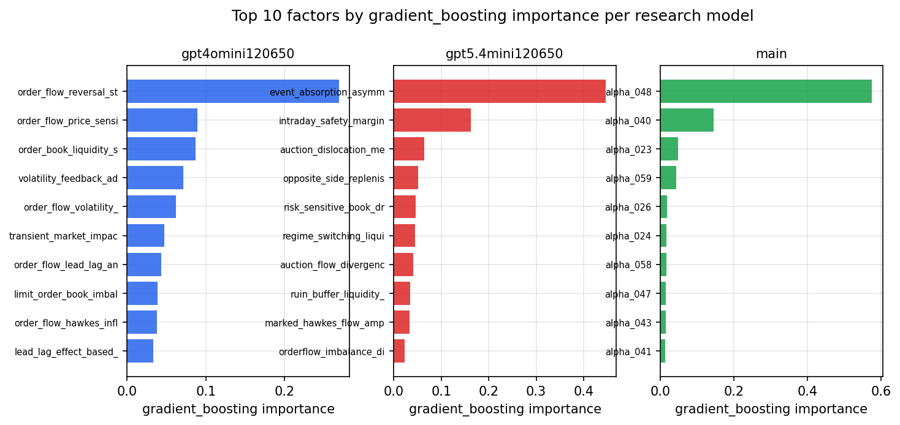

*Top factors by gradient_boosting importance per zoo*

## 4. ML-combined signal — per-underlying vectorised backtest

Each model combines a prerun's factors into ONE signal (fit `factors → forward return` on IS, predict per (bar, underlying)), then that combined signal is run through a simple vectorised backtest — `position(signal) × the underlying's own forward return` — on the held-out OOS tail (+ an equal-weight ensemble). No cross-sectional ranking.

> Config: position=**threshold** (t=1.0, z-score `expanding`), aggregation=**portfolio**, fit-standardise=**per_underlying**, horizon=6.

| prerun | model | n_factors_used | oos_ic | oos_sharpe | is_sharpe | oos_ann_return | oos_max_drawdown |
| --- | --- | --- | --- | --- | --- | --- | --- |
| gpt4omini120650 | linear_regression | 66 | 0.002 | -3.0487 | 7.8301 | -0.7883 | -0.1087 |
| gpt4omini120650 | ridge | 66 | 0.0025 | -3.8028 | 7.0422 | -1.0596 | -0.1322 |
| gpt4omini120650 | lasso | 66 | nan | nan | nan | nan | nan |
| gpt4omini120650 | elastic_net | 66 | nan | nan | nan | nan | nan |
| gpt4omini120650 | random_forest | 66 | 0.0156 | -1.847 | 11.2685 | -0.5547 | -0.1251 |
| gpt4omini120650 | gradient_boosting | 66 | 0.0123 | -3.1457 | 10.4279 | -0.6924 | -0.098 |
| gpt4omini120650 | xgboost | 66 | 0.0148 | -1.8626 | 11.9586 | -0.3219 | -0.0735 |
| gpt4omini120650 | lightgbm | 66 | 0.013 | 0.6107 | 14.3468 | 0.1121 | -0.0548 |
| gpt4omini120650 | ensemble | 66 | 0.0116 | -1.7116 | 13.6256 | -0.4765 | -0.1074 |
| gpt5.4mini120650 | linear_regression | 69 | 0.0102 | -2.2324 | 5.651 | -0.5929 | -0.1036 |
| gpt5.4mini120650 | ridge | 69 | 0.011 | -2.2157 | 5.7108 | -0.5884 | -0.1029 |
| gpt5.4mini120650 | lasso | 69 | 0.0039 | -1.7787 | 5.1119 | -0.468 | -0.0987 |
| gpt5.4mini120650 | elastic_net | 69 | 0.0041 | -1.7788 | 5.1119 | -0.4677 | -0.0989 |
| gpt5.4mini120650 | random_forest | 69 | 0.0159 | -1.9253 | 9.0813 | -0.5018 | -0.094 |
| gpt5.4mini120650 | gradient_boosting | 69 | 0.0148 | -2.7879 | 8.8237 | -0.7298 | -0.1058 |
| gpt5.4mini120650 | xgboost | 69 | 0.0136 | -5.1595 | 11.2242 | -1.2936 | -0.1395 |
| gpt5.4mini120650 | lightgbm | 69 | 0.0073 | -4.4746 | 13.1859 | -1.0018 | -0.1145 |
| gpt5.4mini120650 | ensemble | 69 | 0.0116 | -1.9724 | 9.8872 | -0.5203 | -0.101 |
| main | linear_regression | 78 | 0.0131 | 0.3852 | 6.1263 | 0.0338 | -0.0264 |
| main | ridge | 78 | 0.0131 | 0.56 | 6.8942 | 0.0425 | -0.0236 |
| main | lasso | 78 | 0.0096 | -2.2957 | 6.9907 | -0.352 | -0.0594 |
| main | elastic_net | 78 | 0.0096 | -2.2957 | 6.9907 | -0.352 | -0.0594 |
| main | random_forest | 78 | 0.0181 | 2.1823 | 12.9014 | 0.4704 | -0.0406 |
| main | gradient_boosting | 78 | 0.0103 | -1.0692 | 8.323 | -0.0406 | -0.0144 |
| main | xgboost | 78 | 0.0158 | -1.447 | 11.0849 | -0.1404 | -0.0408 |
| main | lightgbm | 78 | 0.0127 | 3.1856 | 14.8386 | 0.3868 | -0.024 |
| main | ensemble | 78 | 0.0177 | 2.2664 | 14.1603 | 0.395 | -0.0449 |

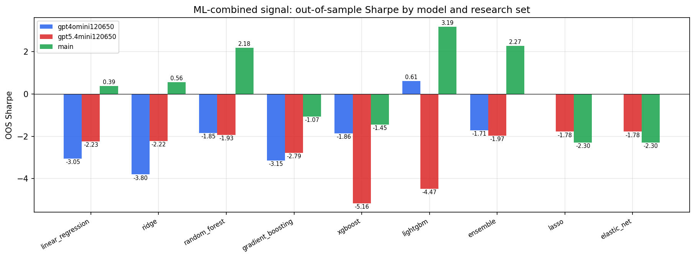

*ML-combined OOS Sharpe by model and research set*

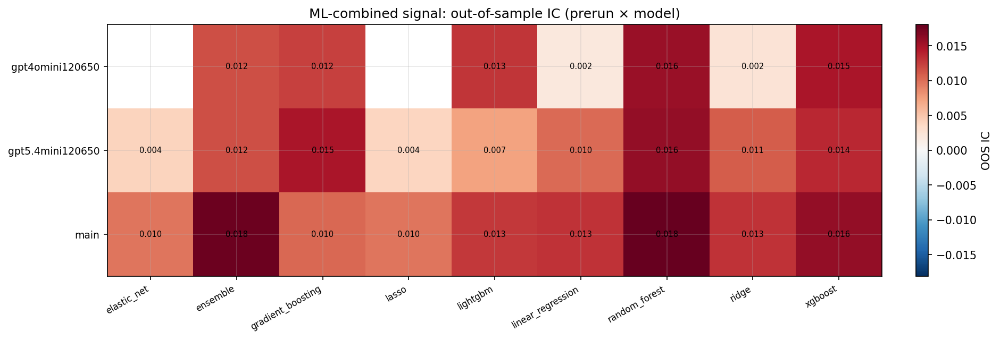

*ML-combined OOS IC (prerun × model)*

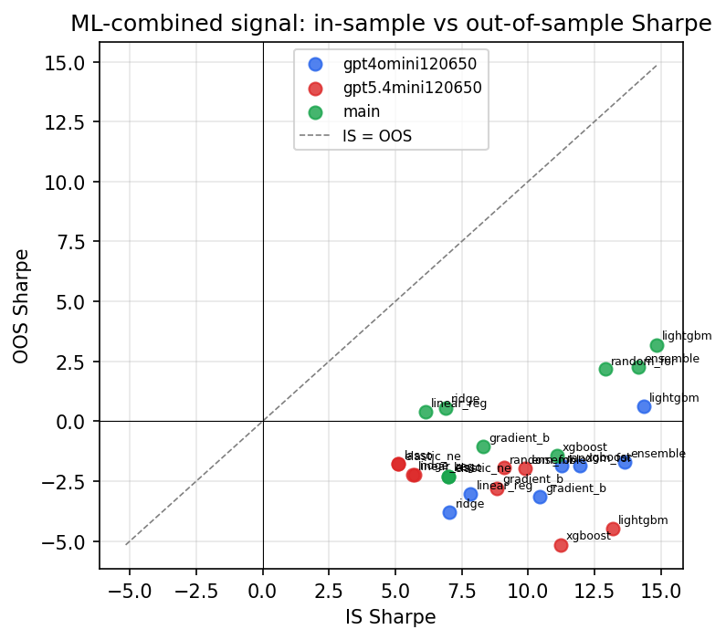

*IS vs OOS Sharpe (overfitting diagnostic)*

---
*Generated by `run_model_comparison.py`. Tables: `*.csv`; interactive: `comparison.ipynb`.*
